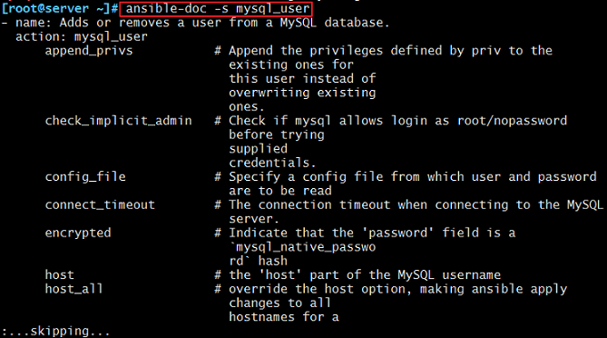
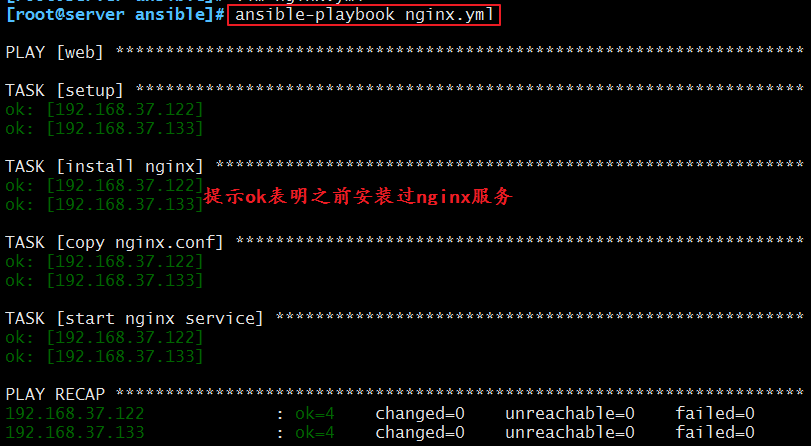
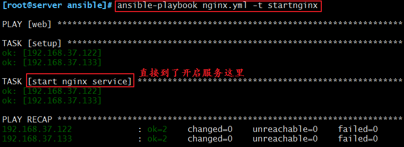
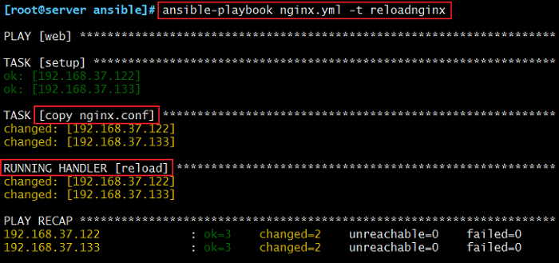
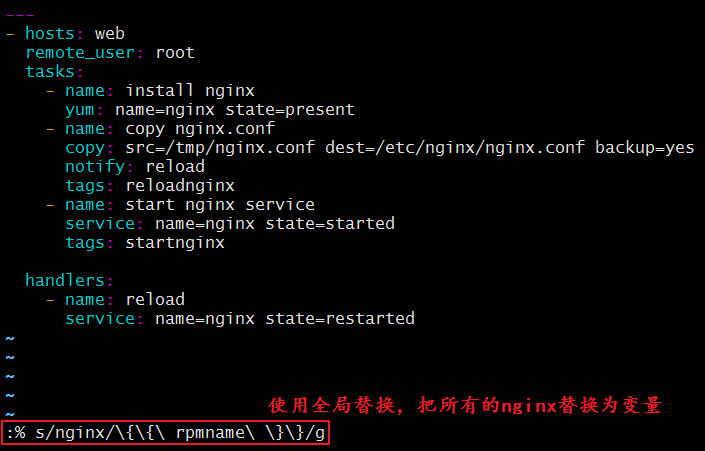
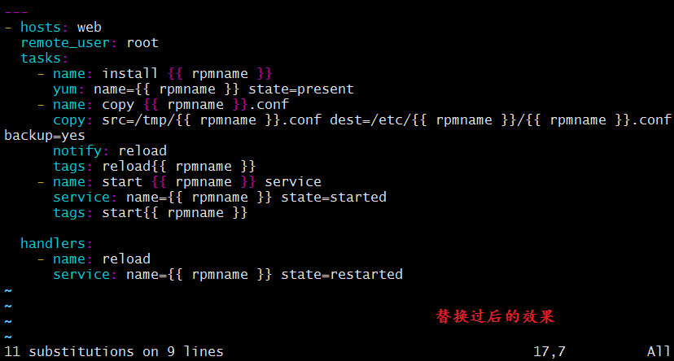
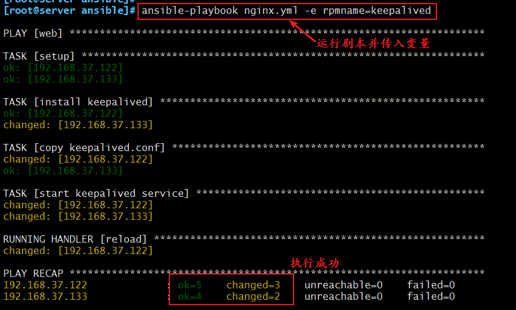
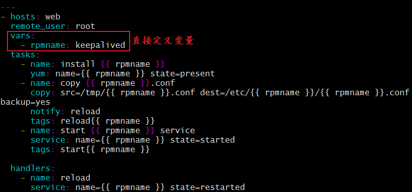
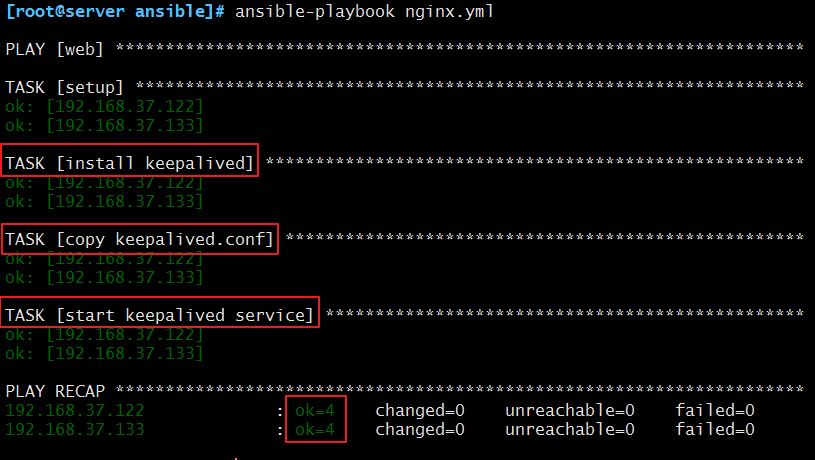
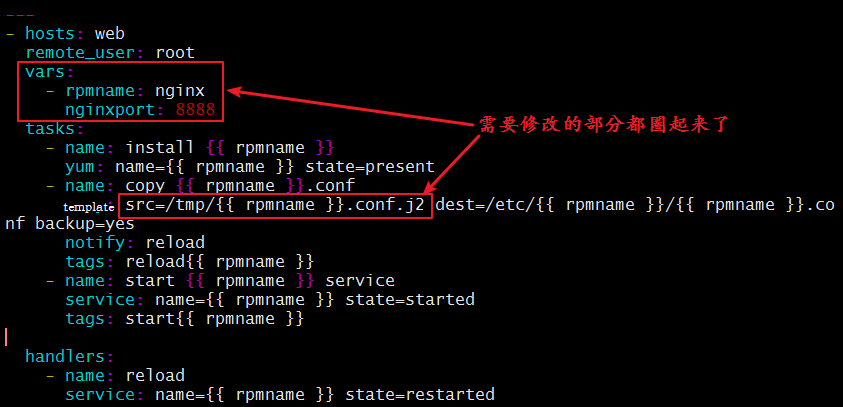

# 自动化运维工具—ansible详解

## 一、ansible 简介

### 1、ansible 是什么？

　　ansible是目前最受运维欢迎的自动化运维工具，基于Python开发，集合了众多运维工具（SaltStack puppet、chef、func、fabric）的优点，实现了批量系统配置、批量程序部署、批量运行命令等功能。
 　　ansible是基于 paramiko 开发的,并且基于模块化工作，本身没有批量部署的能力。真正具有批量部署的是ansible所运行的模块，ansible只是提供一种框架。ansible不需要在远程主机上安装client/agents，因为它们是基于ssh来和远程主机通讯的。ansible目前已经已经被红帽官方收购，是自动化运维工具中大家认可度最高的，并且上手容易，学习简单。是每位运维工程师必须掌握的技能之一。

### 2、ansible 特点

1. 部署简单，只需在主控端部署Ansible环境，被控端无需做任何操作；
2. 默认使用SSH协议对设备进行管理；
3. 有大量常规运维操作模块，可实现日常绝大部分操作；
4. 配置简单、功能强大、扩展性强；
5. 支持API及自定义模块，可通过Python轻松扩展；
6. 通过Playbooks来定制强大的配置、状态管理；
7. 轻量级，无需在客户端安装agent，更新时，只需在操作机上进行一次更新即可；
8. 提供一个功能强大、操作性强的Web管理界面和REST API接口——AWX平台。

### 3、ansible 架构图


 　　上图中我们看到的主要模块如下：

> `Ansible`：Ansible核心程序。
> `HostInventory`：记录由Ansible管理的主机信息，包括端口、密码、ip等。
> `Playbooks`：“剧本”YAML格式文件，多个任务定义在一个文件中，定义主机需要调用哪些模块来完成的功能。
> `CoreModules`：**核心模块**，主要操作是通过调用核心模块来完成管理任务。
> `CustomModules`：自定义模块，完成核心模块无法完成的功能，支持多种语言。
> `ConnectionPlugins`：连接插件，Ansible和Host通信使用

## 二、ansible 任务执行

### 1、ansible 任务执行模式

　　Ansible 系统由控制主机对被管节点的操作方式可分为两类，即`ad-hoc`和`playbook`：

- ad-hoc模式(**点对点模式**)
  　　使用单个模块，支持批量执行单条命令。ad-hoc 命令是一种可以快速输入的命令，而且不需要保存起来的命令。**就相当于bash中的一句话shell。**
- playbook模式(剧本模式)
  　　是Ansible主要管理方式，也是Ansible功能强大的关键所在。**playbook通过多个task集合完成一类功能**，如Web服务的安装部署、数据库服务器的批量备份等。可以简单地把playbook理解为通过组合多条ad-hoc操作的配置文件。

### 2、ansible 执行流程


 　　简单理解就是Ansible在运行时， 首先读取`ansible.cfg`中的配置， 根据规则获取`Inventory`中的管理主机列表， 并行的在这些主机中执行配置的任务， 最后等待执行返回的结果。

### 3、ansible 命令执行过程

1. 加载自己的配置文件，默认`/etc/ansible/ansible.cfg`；
2. 查找对应的主机配置文件，找到要执行的主机或者组；
3. 加载自己对应的模块文件，如 command；
4. 通过ansible将模块或命令生成对应的临时py文件(python脚本)， 并将该文件传输至远程服务器；
5. 对应执行用户的家目录的`.ansible/tmp/XXX/XXX.PY`文件；
6. 给文件 +x 执行权限；
7. 执行并返回结果；
8. 删除临时py文件，`sleep 0`退出；

## 三、ansible 配置详解

### 1、ansible 安装方式

　　ansible安装常用两种方式，`yum 安装` 和 `pip 程序安装`。下面我们来详细介绍一下这两种安装方式。

### 2、使用 pip（python的包管理模块）安装

　　首先，我们需要安装一个`python-pip`包，安装完成以后，则直接使用`pip`命令来安装我们的包，具体操作过程如下：

```
    yum install python-pip
    pip install ansible
```

### 4、使用 yum 安装

　　yum 安装是我们很熟悉的安装方式了。我们需要先安装一个`epel-release`包，然后再安装我们的 ansible 即可。

```
    yum install epel-release -y
    yum install ansible –y
```

### 5、ansible 程序结构

安装目录如下(yum安装)：
 　   配置文件目录：/etc/ansible/
　　执行文件目录：/usr/bin/
　　Lib库依赖目录：/usr/lib/pythonX.X/site-packages/ansible/
　　Help文档目录：/usr/share/doc/ansible-X.X.X/
　　Man文档目录：/usr/share/man/man1/

### 6、ansible配置文件查找顺序

　　ansible与我们其他的服务在这一点上有很大不同，这里的配置文件查找是从多个地方找的，顺序如下：

1. 检查环境变量`ANSIBLE_CONFIG`指向的路径文件(export ANSIBLE_CONFIG=/etc/ansible.cfg)；
2. `~/.ansible.cfg`，检查当前目录下的ansible.cfg配置文件；
3. `/etc/ansible.cfg`检查etc目录的配置文件。

### 7、ansible配置文件

　　ansible 的配置文件为`/etc/ansible/ansible.cfg`，ansible 有许多参数，下面我们列出一些常见的参数：

```shell
    inventory = /etc/ansible/hosts #这个参数表示资源清单inventory文件的位置
    library = /usr/share/ansible   #指向存放Ansible模块的目录，支持多个目录方式，只要用冒号（：）隔开就可以
    forks = 5       #并发连接数，默认为5
    sudo_user = root        #设置默认执行命令的用户
    remote_port = 22        #指定连接被管节点的管理端口，默认为22端口，建议修改，能够更加安全
    host_key_checking = False #设置是否检查SSH主机的密钥，值为True/False。关闭后第一次连接不会提示配置实例
    timeout = 60        #设置SSH连接的超时时间，单位为秒
    log_path = /var/log/ansible.log     #指定一个存储ansible日志的文件（默认不记录日志）
```

```bash
# config file for ansible -- https://ansible.com/
# ===============================================

# nearly all parameters can be overridden in ansible-playbook
# or with command line flags. ansible will read ANSIBLE_CONFIG,
# ansible.cfg in the current working directory, .ansible.cfg in
# the home directory or /etc/ansible/ansible.cfg, whichever it
# finds first

[defaults]

# some basic default values...

#inventory      = /etc/ansible/hosts  # 主机清单位置
#library        = /usr/share/my_modules/ #指向存放Ansible模块的目录，支持多个目录方式，只要用冒号（：）隔开就可以
#module_utils   = /usr/share/my_module_utils/ # 指向存放Ansible模块工具的目录
#remote_tmp     = ~/.ansible/tmp  # 远程机器文件，用来存放模块和命令执行生成的.py文件，临时存放，执行结束被回收
#local_tmp      = ~/.ansible/tmp  # 本地机器文件，用来存放模块和命令执行生成的.py文件，临时存放，执行结束被回收
#plugin_filters_cfg = /etc/ansible/plugin_filters.yml # 过滤算子的文件
#forks          = 5 # 并发连接数，默认是5，可以根据需要改变
#poll_interval  = 15  # 轮询间隔， 默认是15秒
#sudo_user      = root #设置默认执行命令的用户
#ask_sudo_pass = True
#ask_pass      = True
#transport      = smart
#remote_port    = 22 #指定连接被管节点的管理端口，默认为22端口，建议修改，能够更加安全
#module_lang    = C
#module_set_locale = False

# plays will gather facts by default, which contain information about
# the remote system.
#
# smart - gather by default, but don't regather if already gathered
# implicit - gather by default, turn off with gather_facts: False
# explicit - do not gather by default, must say gather_facts: True
#gathering = implicit

# This only affects the gathering done by a play's gather_facts directive,
# by default gathering retrieves all facts subsets
# all - gather all subsets
# network - gather min and network facts
# hardware - gather hardware facts (longest facts to retrieve)
# virtual - gather min and virtual facts
# facter - import facts from facter
# ohai - import facts from ohai
# You can combine them using comma (ex: network,virtual)
# You can negate them using ! (ex: !hardware,!facter,!ohai)
# A minimal set of facts is always gathered.
#gather_subset = all

# some hardware related facts are collected
# with a maximum timeout of 10 seconds. This
# option lets you increase or decrease that
# timeout to something more suitable for the
# environment.
# gather_timeout = 10

# Ansible facts are available inside the ansible_facts.* dictionary
# namespace. This setting maintains the behaviour which was the default prior
# to 2.5, duplicating these variables into the main namespace, each with a
# prefix of 'ansible_'.
# This variable is set to True by default for backwards compatibility. It
# will be changed to a default of 'False' in a future release.
# ansible_facts.
# inject_facts_as_vars = True

# additional paths to search for roles in, colon separated
#roles_path    = /etc/ansible/roles

# uncomment this to disable SSH key host checking
#host_key_checking = False  #设置是否检查SSH主机的密钥，值为True/False。关闭后第一次连接不会提示配置实例

# change the default callback, you can only have one 'stdout' type  enabled at a time.
#stdout_callback = skippy


## Ansible ships with some plugins that require whitelisting,
## this is done to avoid running all of a type by default.
## These setting lists those that you want enabled for your system.
## Custom plugins should not need this unless plugin author specifies it.

# enable callback plugins, they can output to stdout but cannot be 'stdout' type.
#callback_whitelist = timer, mail

# Determine whether includes in tasks and handlers are "static" by
# default. As of 2.0, includes are dynamic by default. Setting these
# values to True will make includes behave more like they did in the
# 1.x versions.
#task_includes_static = False
#handler_includes_static = False

# Controls if a missing handler for a notification event is an error or a warning
#error_on_missing_handler = True

# change this for alternative sudo implementations
#sudo_exe = sudo

# What flags to pass to sudo
# WARNING: leaving out the defaults might create unexpected behaviours
#sudo_flags = -H -S -n

# SSH timeout
#timeout = 10 #设置SSH连接的超时时间，单位为秒

# default user to use for playbooks if user is not specified
# (/usr/bin/ansible will use current user as default)
#remote_user = root #远程机器执行命令的用户

# logging is off by default unless this path is defined
# if so defined, consider logrotate
#log_path = /var/log/ansible.log  #指定一个存储ansible日志的文件（默认不记录日志）

# default module name for /usr/bin/ansible
#module_name = command # 默认执行命令的模块是command

# use this shell for commands executed under sudo
# you may need to change this to bin/bash in rare instances
# if sudo is constrained
#executable = /bin/sh

# if inventory variables overlap, does the higher precedence one win
# or are hash values merged together?  The default is 'replace' but
# this can also be set to 'merge'.
#hash_behaviour = replace

# by default, variables from roles will be visible in the global variable
# scope. To prevent this, the following option can be enabled, and only
# tasks and handlers within the role will see the variables there
#private_role_vars = yes

# list any Jinja2 extensions to enable here:
#jinja2_extensions = jinja2.ext.do,jinja2.ext.i18n

# if set, always use this private key file for authentication, same as
# if passing --private-key to ansible or ansible-playbook
#private_key_file = /path/to/file

# If set, configures the path to the Vault password file as an alternative to
# specifying --vault-password-file on the command line.
#vault_password_file = /path/to/vault_password_file

# format of string {{ ansible_managed }} available within Jinja2
# templates indicates to users editing templates files will be replaced.
# replacing {file}, {host} and {uid} and strftime codes with proper values.
#ansible_managed = Ansible managed: {file} modified on %Y-%m-%d %H:%M:%S by {uid} on {host}
# {file}, {host}, {uid}, and the timestamp can all interfere with idempotence
# in some situations so the default is a static string:
#ansible_managed = Ansible managed

# by default, ansible-playbook will display "Skipping [host]" if it determines a task
# should not be run on a host.  Set this to "False" if you don't want to see these "Skipping"
# messages. NOTE: the task header will still be shown regardless of whether or not the
# task is skipped.
#display_skipped_hosts = True

# by default, if a task in a playbook does not include a name: field then
# ansible-playbook will construct a header that includes the task's action but
# not the task's args.  This is a security feature because ansible cannot know
# if the *module* considers an argument to be no_log at the time that the
# header is printed.  If your environment doesn't have a problem securing
# stdout from ansible-playbook (or you have manually specified no_log in your
# playbook on all of the tasks where you have secret information) then you can
# safely set this to True to get more informative messages.
#display_args_to_stdout = False

# by default (as of 1.3), Ansible will raise errors when attempting to dereference
# Jinja2 variables that are not set in templates or action lines. Uncomment this line
# to revert the behavior to pre-1.3.
#error_on_undefined_vars = False

# by default (as of 1.6), Ansible may display warnings based on the configuration of the
# system running ansible itself. This may include warnings about 3rd party packages or
# other conditions that should be resolved if possible.
# to disable these warnings, set the following value to False:
#system_warnings = True

# by default (as of 1.4), Ansible may display deprecation warnings for language
# features that should no longer be used and will be removed in future versions.
# to disable these warnings, set the following value to False:
#deprecation_warnings = True

# (as of 1.8), Ansible can optionally warn when usage of the shell and
# command module appear to be simplified by using a default Ansible module
# instead.  These warnings can be silenced by adjusting the following
# setting or adding warn=yes or warn=no to the end of the command line
# parameter string.  This will for example suggest using the git module
# instead of shelling out to the git command.
# command_warnings = False


# set plugin path directories here, separate with colons
#action_plugins     = /usr/share/ansible/plugins/action
#become_plugins     = /usr/share/ansible/plugins/become
#cache_plugins      = /usr/share/ansible/plugins/cache
#callback_plugins   = /usr/share/ansible/plugins/callback
#connection_plugins = /usr/share/ansible/plugins/connection
#lookup_plugins     = /usr/share/ansible/plugins/lookup
#inventory_plugins  = /usr/share/ansible/plugins/inventory
#vars_plugins       = /usr/share/ansible/plugins/vars
#filter_plugins     = /usr/share/ansible/plugins/filter
#test_plugins       = /usr/share/ansible/plugins/test
#terminal_plugins   = /usr/share/ansible/plugins/terminal
#strategy_plugins   = /usr/share/ansible/plugins/strategy


# by default, ansible will use the 'linear' strategy but you may want to try
# another one
#strategy = free

# by default callbacks are not loaded for /bin/ansible, enable this if you
# want, for example, a notification or logging callback to also apply to
# /bin/ansible runs
#bin_ansible_callbacks = False


# don't like cows?  that's unfortunate.
# set to 1 if you don't want cowsay support or export ANSIBLE_NOCOWS=1
#nocows = 1

# set which cowsay stencil you'd like to use by default. When set to 'random',
# a random stencil will be selected for each task. The selection will be filtered
# against the `cow_whitelist` option below.
#cow_selection = default
#cow_selection = random

# when using the 'random' option for cowsay, stencils will be restricted to this list.
# it should be formatted as a comma-separated list with no spaces between names.
# NOTE: line continuations here are for formatting purposes only, as the INI parser
#       in python does not support them.
#cow_whitelist=bud-frogs,bunny,cheese,daemon,default,dragon,elephant-in-snake,elephant,eyes,\
#              hellokitty,kitty,luke-koala,meow,milk,moofasa,moose,ren,sheep,small,stegosaurus,\
#              stimpy,supermilker,three-eyes,turkey,turtle,tux,udder,vader-koala,vader,www

# don't like colors either?
# set to 1 if you don't want colors, or export ANSIBLE_NOCOLOR=1
#nocolor = 1

# if set to a persistent type (not 'memory', for example 'redis') fact values
# from previous runs in Ansible will be stored.  This may be useful when
# wanting to use, for example, IP information from one group of servers
# without having to talk to them in the same playbook run to get their
# current IP information.
#fact_caching = memory

#This option tells Ansible where to cache facts. The value is plugin dependent.
#For the jsonfile plugin, it should be a path to a local directory.
#For the redis plugin, the value is a host:port:database triplet: fact_caching_connection = localhost:6379:0

#fact_caching_connection=/tmp


# retry files
# When a playbook fails a .retry file can be created that will be placed in ~/
# You can enable this feature by setting retry_files_enabled to True
# and you can change the location of the files by setting retry_files_save_path

#retry_files_enabled = False
#retry_files_save_path = ~/.ansible-retry

# squash actions
# Ansible can optimise actions that call modules with list parameters
# when looping. Instead of calling the module once per with_ item, the
# module is called once with all items at once. Currently this only works
# under limited circumstances, and only with parameters named 'name'.
#squash_actions = apk,apt,dnf,homebrew,pacman,pkgng,yum,zypper

# prevents logging of task data, off by default
#no_log = False

# prevents logging of tasks, but only on the targets, data is still logged on the master/controller
#no_target_syslog = False

# controls whether Ansible will raise an error or warning if a task has no
# choice but to create world readable temporary files to execute a module on
# the remote machine.  This option is False by default for security.  Users may
# turn this on to have behaviour more like Ansible prior to 2.1.x.  See
# https://docs.ansible.com/ansible/become.html#becoming-an-unprivileged-user
# for more secure ways to fix this than enabling this option.
#allow_world_readable_tmpfiles = False

# controls the compression level of variables sent to
# worker processes. At the default of 0, no compression
# is used. This value must be an integer from 0 to 9.
#var_compression_level = 9

# controls what compression method is used for new-style ansible modules when
# they are sent to the remote system.  The compression types depend on having
# support compiled into both the controller's python and the client's python.
# The names should match with the python Zipfile compression types:
# * ZIP_STORED (no compression. available everywhere)
# * ZIP_DEFLATED (uses zlib, the default)
# These values may be set per host via the ansible_module_compression inventory
# variable
#module_compression = 'ZIP_DEFLATED'

# This controls the cutoff point (in bytes) on --diff for files
# set to 0 for unlimited (RAM may suffer!).
#max_diff_size = 1048576

# This controls how ansible handles multiple --tags and --skip-tags arguments
# on the CLI.  If this is True then multiple arguments are merged together.  If
# it is False, then the last specified argument is used and the others are ignored.
# This option will be removed in 2.8.
#merge_multiple_cli_flags = True

# Controls showing custom stats at the end, off by default
#show_custom_stats = True

# Controls which files to ignore when using a directory as inventory with
# possibly multiple sources (both static and dynamic)
#inventory_ignore_extensions = ~, .orig, .bak, .ini, .cfg, .retry, .pyc, .pyo

# This family of modules use an alternative execution path optimized for network appliances
# only update this setting if you know how this works, otherwise it can break module execution
#network_group_modules=eos, nxos, ios, iosxr, junos, vyos

# When enabled, this option allows lookups (via variables like {{lookup('foo')}} or when used as
# a loop with `with_foo`) to return data that is not marked "unsafe". This means the data may contain
# jinja2 templating language which will be run through the templating engine.
# ENABLING THIS COULD BE A SECURITY RISK
#allow_unsafe_lookups = False

# set default errors for all plays
#any_errors_fatal = False

[inventory]
# enable inventory plugins, default: 'host_list', 'script', 'auto', 'yaml', 'ini', 'toml'
#enable_plugins = host_list, virtualbox, yaml, constructed

# ignore these extensions when parsing a directory as inventory source
#ignore_extensions = .pyc, .pyo, .swp, .bak, ~, .rpm, .md, .txt, ~, .orig, .ini, .cfg, .retry

# ignore files matching these patterns when parsing a directory as inventory source
#ignore_patterns=

# If 'true' unparsed inventory sources become fatal errors, they are warnings otherwise.
#unparsed_is_failed=False

[privilege_escalation]
#become=True
#become_method=sudo
#become_user=root
#become_ask_pass=False

[paramiko_connection]

# uncomment this line to cause the paramiko connection plugin to not record new host
# keys encountered.  Increases performance on new host additions.  Setting works independently of the
# host key checking setting above.
#record_host_keys=False

# by default, Ansible requests a pseudo-terminal for commands executed under sudo. Uncomment this
# line to disable this behaviour.
#pty=False

# paramiko will default to looking for SSH keys initially when trying to
# authenticate to remote devices.  This is a problem for some network devices
# that close the connection after a key failure.  Uncomment this line to
# disable the Paramiko look for keys function
#look_for_keys = False

# When using persistent connections with Paramiko, the connection runs in a
# background process.  If the host doesn't already have a valid SSH key, by
# default Ansible will prompt to add the host key.  This will cause connections
# running in background processes to fail.  Uncomment this line to have
# Paramiko automatically add host keys.
#host_key_auto_add = True

[ssh_connection]

# ssh arguments to use
# Leaving off ControlPersist will result in poor performance, so use
# paramiko on older platforms rather than removing it, -C controls compression use
#ssh_args = -C -o ControlMaster=auto -o ControlPersist=60s

# The base directory for the ControlPath sockets.
# This is the "%(directory)s" in the control_path option
#
# Example:
# control_path_dir = /tmp/.ansible/cp
#control_path_dir = ~/.ansible/cp

# The path to use for the ControlPath sockets. This defaults to a hashed string of the hostname,
# port and username (empty string in the config). The hash mitigates a common problem users
# found with long hostnames and the conventional %(directory)s/ansible-ssh-%%h-%%p-%%r format.
# In those cases, a "too long for Unix domain socket" ssh error would occur.
#
# Example:
# control_path = %(directory)s/%%h-%%r
#control_path =

# Enabling pipelining reduces the number of SSH operations required to
# execute a module on the remote server. This can result in a significant
# performance improvement when enabled, however when using "sudo:" you must
# first disable 'requiretty' in /etc/sudoers
#
# By default, this option is disabled to preserve compatibility with
# sudoers configurations that have requiretty (the default on many distros).
#
#pipelining = False

# Control the mechanism for transferring files (old)
#   * smart = try sftp and then try scp [default]
#   * True = use scp only
#   * False = use sftp only
#scp_if_ssh = smart

# Control the mechanism for transferring files (new)
# If set, this will override the scp_if_ssh option
#   * sftp  = use sftp to transfer files
#   * scp   = use scp to transfer files
#   * piped = use 'dd' over SSH to transfer files
#   * smart = try sftp, scp, and piped, in that order [default]
#transfer_method = smart

# if False, sftp will not use batch mode to transfer files. This may cause some
# types of file transfer failures impossible to catch however, and should
# only be disabled if your sftp version has problems with batch mode
#sftp_batch_mode = False

# The -tt argument is passed to ssh when pipelining is not enabled because sudo 
# requires a tty by default. 
#usetty = True

# Number of times to retry an SSH connection to a host, in case of UNREACHABLE.
# For each retry attempt, there is an exponential backoff,
# so after the first attempt there is 1s wait, then 2s, 4s etc. up to 30s (max).
#retries = 3

[persistent_connection]

# Configures the persistent connection timeout value in seconds.  This value is
# how long the persistent connection will remain idle before it is destroyed.
# If the connection doesn't receive a request before the timeout value
# expires, the connection is shutdown. The default value is 30 seconds.
#connect_timeout = 30

# The command timeout value defines the amount of time to wait for a command
# or RPC call before timing out. The value for the command timeout must
# be less than the value of the persistent connection idle timeout (connect_timeout)
# The default value is 30 second.
#command_timeout = 30

[accelerate]
#accelerate_port = 5099
#accelerate_timeout = 30
#accelerate_connect_timeout = 5.0

# The daemon timeout is measured in minutes. This time is measured
# from the last activity to the accelerate daemon.
#accelerate_daemon_timeout = 30

# If set to yes, accelerate_multi_key will allow multiple
# private keys to be uploaded to it, though each user must
# have access to the system via SSH to add a new key. The default
# is "no".
#accelerate_multi_key = yes

[selinux]
# file systems that require special treatment when dealing with security context
# the default behaviour that copies the existing context or uses the user default
# needs to be changed to use the file system dependent context.
#special_context_filesystems=nfs,vboxsf,fuse,ramfs,9p

# Set this to yes to allow libvirt_lxc connections to work without SELinux.
#libvirt_lxc_noseclabel = yes

[colors]
#highlight = white
#verbose = blue
#warn = bright purple
#error = red
#debug = dark gray
#deprecate = purple
#skip = cyan
#unreachable = red
#ok = green
#changed = yellow
#diff_add = green
#diff_remove = red
#diff_lines = cyan


[diff]
# Always print diff when running ( same as always running with -D/--diff )
# always = no

# Set how many context lines to show in diff
# context = 3

```


### 8、ansible主机清单

　　在配置文件中，我们提到了资源清单，这个清单就是我们的主机清单，里面保存的是一些 ansible 需要连接管理的主机列表。我们可以来看看他的定义方式：

```shell
1、 直接指明主机地址或主机名：
    # green.example.com
    # blue.example.com
    # 192.168.100.1
    # 192.168.100.10
2、 定义一个主机组[组名]把地址或主机名加进去
    [mysql_test]
    192.168.253.159
    192.168.253.160
    192.168.253.153
3、定义组内包含组
	[web]
	192.168.11.128
	192.168.11.129
	[db]
	192.168.11.130
	192.168.11.131
	[webs:children]
	web
	db
```

　　需要注意的是，这里的组成员可以使用通配符来匹配，这样对于一些标准化的管理来说就很轻松方便了。
 　　我们可以根据实际情况来配置我们的主机列表，具体操作如下：

```bash
[root@server ~]# vim /etc/ansible/hosts
    [web]
    192.168.37.122
    192.168.37.133
```

## 四、ansible 常用命令

### 1、ansible 命令集

> `/usr/bin/ansible`　　Ansibe AD-Hoc 临时命令执行工具，常用于临时命令的执行
> `/usr/bin/ansible-doc` 　　Ansible 模块功能查看工具
> `/usr/bin/ansible-galaxy`　　下载/上传优秀代码或Roles模块 的官网平台，基于网络的
> `/usr/bin/ansible-playbook`　　Ansible 定制自动化的任务集编排工具
> `/usr/bin/ansible-pull`　　Ansible远程执行命令的工具，拉取配置而非推送配置（使用较少，海量机器时使用，对运维的架构能力要求较高）
> `/usr/bin/ansible-vault`　　    Ansible 文件加密工具
> `/usr/bin/ansible-console`　　Ansible基于Linux Console界面可与用户交互的命令执行工具

　　其中，我们比较常用的是`/usr/bin/ansible`和`/usr/bin/ansible-playbook`。

### 2、ansible-doc 命令

　　ansible-doc 命令常用于获取模块信息及其使用帮助，一般用法如下：

```bash
    ansible-doc -l              #获取全部模块的信息
    ansible-doc -s MOD_NAME     #获取指定模块的使用帮助
```

　　我们也可以查看一下ansible-doc的全部用法：

```bash
[root@server ~]# ansible-doc
Usage: ansible-doc [options] [module...]

Options:
  -h, --help            show this help message and exit　　# 显示命令参数API文档
  -l, --list            List available modules　　#列出可用的模块
  -M MODULE_PATH, --module-path=MODULE_PATH　　#指定模块的路径
                        specify path(s) to module library (default=None)
  -s, --snippet         Show playbook snippet for specified module(s)　　#显示playbook指定模块的用法
  -v, --verbose         verbose mode (-vvv for more, -vvvv to enable　　# 显示ansible-doc的版本号查看模块列表：
                        connection debugging)
  --version             show program's version number and exit
```

　　我们可以来看一下，以mysql相关的为例：

```bash
[root@server ~]# ansible-doc -l |grep mysql
mysql_db                           Add or remove MySQL databases from a remote...
mysql_replication                  Manage MySQL replication                   
mysql_user                         Adds or removes a user from a MySQL databas...
mysql_variables                    Manage MySQL global variables      
[root@server ~]# ansible-doc -s mysql_user
```



### 2、ansible 命令详解

　　命令的具体格式如下：

```
ansible <host-pattern> [-f forks] [-m module_name] [-a args]
```

　　也可以通过`ansible -h`来查看帮助，下面我们列出一些比较常用的选项，并解释其含义：

`-a MODULE_ARGS` #模块的参数，如果执行默认COMMAND的模块，即是命令参数，如： “date”，“pwd”等等
`-k`，`--ask-pass` #ask for SSH password。登录密码，提示输入SSH密码而不是假设基于密钥的验证
`--ask-su-pass` #ask for su password。su切换密码`-K`，`--ask-sudo-pass` #ask for sudo password。提示密码使用sudo，sudo表示提权操作
`--ask-vault-pass` #ask for vault password。假设我们设定了加密的密码，则用该选项进行访问
`-B SECONDS` #后台运行超时时间
`-C` #模拟运行环境并进行预运行，可以进行查错测试
`-c CONNECTION` #连接类型使用
`-f FORKS` #并行任务数，默认为5
`-i INVENTORY` #指定主机清单的路径，默认为`/etc/ansible/hosts`

`--list-hosts` #查看有哪些主机组
`-m MODULE_NAME` #执行模块的名字，默认使用 command 模块，所以如果是只执行单一命令可以不用 -m参数
`-o` #压缩输出，尝试将所有结果在一行输出，一般针对收集工具使用
`-S` #用 su 命令
`-R SU_USER` #指定 su 的用户，默认为 root 用户
`-s` #用 sudo 命令
`-U SUDO_USER` #指定 sudo 到哪个用户，默认为 root 用户
`-T TIMEOUT` #指定 ssh 默认超时时间，默认为10s，也可在配置文件中修改
`-u REMOTE_USER` #远程用户，默认为 root 用户
`-v` #查看详细信息，同时支持`-vvv`，`-vvvv`可查看更详细信息

### 3、ansible 配置公私钥

　　上面我们已经提到过 ansible 是基于 ssh 协议实现的，所以其配置公私钥的方式与 ssh 协议的方式相同，具体操作步骤如下：

```bash
#1.生成私钥
[root@server ~]# ssh-keygen 
#2.向主机分发私钥
[root@server ~]# ssh-copy-id root@192.168.37.122
[root@server ~]# ssh-copy-id root@192.168.37.133
```

　　这样的话，就可以实现无密码登录，我们的实验过程也会顺畅很多。
 　　注意，如果出现了以下报错：

```
    -bash: ssh-copy-id: command not found
```

　　那么就证明我们需要安装一个包：

```
    yum -y install openssh-clientsansible
```

　　把包安装上即可。

## 五、ansible 常用模块

### 1、主机连通性测试

　　我们使用`ansible web -m ping`命令来进行主机连通性测试，效果如下：

```bash
[root@0608872f0f2d ansible]# ansible webservers -m ping
172.17.0.5 | SUCCESS => {
    "ansible_facts": {
        "discovered_interpreter_python": "/usr/bin/python"
    }, 
    "changed": false, 
    "ping": "pong"
}
172.17.0.3 | SUCCESS => {
    "ansible_facts": {
        "discovered_interpreter_python": "/usr/bin/python"
    }, 
    "changed": false, 
    "ping": "pong"
}
172.17.0.4 | SUCCESS => {
    "ansible_facts": {
        "discovered_interpreter_python": "/usr/bin/python"
    }, 
    "changed": false, 
    "ping": "pong"
}
[root@server ~]# ansible web -m ping
192.168.37.122 | SUCCESS => {
    "changed": false, 
    "ping": "pong"
}
192.168.37.133 | SUCCESS => {
    "changed": false, 
    "ping": "pong"
}
```

　　这样就说明我们的主机是连通状态的。接下来的操作才可以正常进行。

### 2、command 模块

　　这个模块可以直接在远程主机上执行命令，并将结果返回本主机。
 　　举例如下：

```bash
[root@0608872f0f2d ansible]# ansible webservers -m command -a "cat /etc/hostname"
172.17.0.4 | CHANGED | rc=0 >>
dd9bce6d51e3

172.17.0.3 | CHANGED | rc=0 >>
d58c022ccd22

172.17.0.5 | CHANGED | rc=0 >>
63f8652f1826
 
```

　　命令模块接受命令名称，后面是空格分隔的列表参数。给定的命令将在所有选定的节点上执行。它不会通过shell进行处理，比如$HOME和操作如"<"，">"，"|"，";"，"&" 工作（需要使用（shell）模块实现这些功能）。注意，该命令不支持`| 管道命令`。
 　　下面来看一看该模块下常用的几个命令：

chdir　　　   # 在执行命令之前，先切换到该目录
executable    # 切换shell来执行命令，需要使用命令的绝对路径
free_form 　 # 要执行的Linux指令，一般使用Ansible的-a参数代替。
creates 　      # 一个文件名，当这个文件存在，则该命令不执行,可以用来做判断
removes        # 一个文件名，这个文件不存在，则该命令不执行

　　下面我们来看看这些命令的执行效果：

```bash
[root@server ~]# ansible web -m command -a 'chdir=/data/ ls'  #先切换到/data/ 目录，再执行“ls”命令
192.168.37.122 | SUCCESS | rc=0 >>
aaa.jpg
fastdfs
mogdata
tmp
web
wKgleloeYoCAMLtZAAAWEekAtkc497.jpg

192.168.37.133 | SUCCESS | rc=0 >>
aaa.jpg
fastdfs
mogdata
tmp
web
wKgleloeYoCAMLtZAAAWEekAtkc497.jpg
[root@server ~]# ansible web -m command -a 'creates=/data/aaa.jpg ls'  #如果/data/aaa.jpg存在，则不执行“ls”命令
192.168.37.122 | SUCCESS | rc=0 >>                                                                              
skipped, since /data/aaa.jpg exists

192.168.37.133 | SUCCESS | rc=0 >>
skipped, since /data/aaa.jpg exists
[root@server ~]# ansible web -m command -a 'removes=/data/aaa.jpg cat /data/a' #如果/data/aaa.jpg存在，则执行“cat /data/a”命令
192.168.37.122 | SUCCESS | rc=0 >>
hello

192.168.37.133 | SUCCESS | rc=0 >>
hello
```

### 3、shell 模块

　　shell模块可以在远程主机上调用shell解释器运行命令，支持shell的各种功能，例如管道等。

```bash
[root@0608872f0f2d ansible]# ansible webservers -m shell -a 'cat /etc/passwd | grep "root"'#这里注意单双引号
172.17.0.4 | CHANGED | rc=0 >>
root:x:0:0:root:/root:/bin/bash
operator:x:11:0:operator:/root:/sbin/nologin

172.17.0.5 | CHANGED | rc=0 >>
root:x:0:0:root:/root:/bin/bash
operator:x:11:0:operator:/root:/sbin/nologin

172.17.0.3 | CHANGED | rc=0 >>
root:x:0:0:root:/root:/bin/bash
operator:x:11:0:operator:/root:/sbin/nologin

```

　　只要是我们的shell命令，都可以通过这个模块在远程主机上运行，这里就不一一举例了。

### 4、copy 模块

　　这个模块用于将文件复制到远程主机，同时支持给定内容生成文件和修改权限等。
 　　其相关选项如下：

> `src`　　　　 #被复制到远程主机的本地文件。可以是绝对路径，也可以是相对路径。如果路径是一个目录，则会递归复制，用法类似于"rsync"
> `content`　　#用于替换"src"，可以直接指定文件的值
> `dest`　　　   #必选项，将源文件复制到的远程主机的**绝对路径**
> `backup`　　　#当文件内容发生改变后，在覆盖之前把源文件备份，备份文件包含时间信息
> `directory_mode`　　　　#递归设定目录的权限，默认为系统默认权限
> `force`　　　　#当目标主机包含该文件，但内容不同时，设为"yes"，表示强制覆盖；设为"no"，表示目标主机的目标位置不存在该文件才复制。默认为"yes"
> `others`　　　　#所有的 file 模块中的选项可以在这里使用

用法举例如下：
**① 复制文件：**

```bash
[root@0608872f0f2d ~]# ansible webservers -m copy -a 'src=~/data dest=/'
172.17.0.5 | CHANGED => {
    "ansible_facts": {
        "discovered_interpreter_python": "/usr/bin/python"
    }, 
    "changed": true, 
    "checksum": "22596363b3de40b06f981fb85d82312e8c0ed511", 
    "dest": "/data/hello.txt", 
    "gid": 0, 
    "group": "root", 
    "md5sum": "6f5902ac237024bdd0c176cb93063dc4", 
    "mode": "0644", 
    "owner": "root", 
    "size": 12, 
    "src": "/root/.ansible/tmp/ansible-tmp-1570806763.92-87967815831850/source", 
    "state": "file", 
    "uid": 0
}
172.17.0.4 | CHANGED => {
    "ansible_facts": {
        "discovered_interpreter_python": "/usr/bin/python"
    }, 
    "changed": true, 
    "checksum": "22596363b3de40b06f981fb85d82312e8c0ed511", 
    "dest": "/data/hello.txt", 
    "gid": 0, 
    "group": "root", 
    "md5sum": "6f5902ac237024bdd0c176cb93063dc4", 
    "mode": "0644", 
    "owner": "root", 
    "size": 12, 
    "src": "/root/.ansible/tmp/ansible-tmp-1570806763.92-162136476313245/source", 
    "state": "file", 
    "uid": 0
}
172.17.0.3 | CHANGED => {
    "ansible_facts": {
        "discovered_interpreter_python": "/usr/bin/python"
    }, 
    "changed": true, 
    "checksum": "22596363b3de40b06f981fb85d82312e8c0ed511", 
    "dest": "/data/hello.txt", 
    "gid": 0, 
    "group": "root", 
    "md5sum": "6f5902ac237024bdd0c176cb93063dc4", 
    "mode": "0644", 
    "owner": "root", 
    "size": 12, 
    "src": "/root/.ansible/tmp/ansible-tmp-1570806763.9-43489469127035/source", 
    "state": "file", 
    "uid": 0
}

```

**② 给定内容生成文件，并制定权限**

```bash
[root@server ~]# ansible web -m copy -a 'content="I am keer\n" dest=/data/name mode=666'
192.168.37.122 | SUCCESS => {
    "changed": true, 
    "checksum": "0421570938940ea784f9d8598dab87f07685b968", 
    "dest": "/data/name", 
    "gid": 0, 
    "group": "root", 
    "md5sum": "497fa8386590a5fc89090725b07f175c", 
    "mode": "0666", 
    "owner": "root", 
    "size": 10, 
    "src": "/root/.ansible/tmp/ansible-tmp-1512437327.37-199512601767687/source", 
    "state": "file", 
    "uid": 0
}
192.168.37.133 | SUCCESS => {
    "changed": true, 
    "checksum": "0421570938940ea784f9d8598dab87f07685b968", 
    "dest": "/data/name", 
    "gid": 0, 
    "group": "root", 
    "md5sum": "497fa8386590a5fc89090725b07f175c", 
    "mode": "0666", 
    "owner": "root", 
    "size": 10, 
        "src": "/root/.ansible/tmp/ansible-tmp-1512437327.55-218104039503110/source", 
    "state": "file", 
    "uid": 0
}
```

　　我们现在可以去查看一下我们生成的文件及其权限：

```bash
[root@server ~]# ansible web -m shell -a 'ls -l /data/'
192.168.37.122 | SUCCESS | rc=0 >>
total 28
-rw-rw-rw-   1 root root   12 Dec  6 09:45 name

192.168.37.133 | SUCCESS | rc=0 >>
total 40
-rw-rw-rw- 1 root     root       12 Dec  5 09:45 name
```

　　可以看出我们的name文件已经生成，并且权限为666。
**③ 关于覆盖**
 　　我们把文件的内容修改一下，然后选择覆盖备份：

```
[root@server ~]# ansible web -m copy -a 'content="I am keerya\n" backup=yes dest=/data/name mode=666'
192.168.37.122 | SUCCESS => {
    "backup_file": "/data/name.4394.2017-12-06@09:46:25~", 
    "changed": true, 
    "checksum": "064a68908ab9971ee85dbc08ea038387598e3778", 
    "dest": "/data/name", 
    "gid": 0, 
    "group": "root", 
    "md5sum": "8ca7c11385856155af52e560f608891c", 
    "mode": "0666", 
    "owner": "root", 
    "size": 12, 
    "src": "/root/.ansible/tmp/ansible-tmp-1512438383.78-228128616784888/source", 
    "state": "file", 
    "uid": 0
}
192.168.37.133 | SUCCESS => {
    "backup_file": "/data/name.5962.2017-12-05@09:46:24~", 
    "changed": true, 
    "checksum": "064a68908ab9971ee85dbc08ea038387598e3778", 
    "dest": "/data/name", 
    "gid": 0, 
    "group": "root", 
    "md5sum": "8ca7c11385856155af52e560f608891c", 
    "mode": "0666", 
    "owner": "root", 
    "size": 12, 
    "src": "/root/.ansible/tmp/ansible-tmp-1512438384.0-170718946740009/source", 
    "state": "file", 
    "uid": 0
}
```

　　现在我们可以去查看一下：

```
[root@server ~]# ansible web -m shell -a 'ls -l /data/'
192.168.37.122 | SUCCESS | rc=0 >>
total 28
-rw-rw-rw-   1 root root   12 Dec  6 09:46 name
-rw-rw-rw-   1 root root   10 Dec  6 09:45 name.4394.2017-12-06@09:46:25~

192.168.37.133 | SUCCESS | rc=0 >>
total 40
-rw-rw-rw- 1 root     root       12 Dec  5 09:46 name
-rw-rw-rw- 1 root     root       10 Dec  5 09:45 name.5962.2017-12-05@09:46:24~
```

　　可以看出，我们的源文件已经被备份，我们还可以查看一下`name`文件的内容：

```
[root@server ~]# ansible web -m shell -a 'cat /data/name'
192.168.37.122 | SUCCESS | rc=0 >>
I am keerya

192.168.37.133 | SUCCESS | rc=0 >>
I am keerya
```

　　证明，这正是我们新导入的文件的内容。


### 5、file 模块

　　该模块主要用于设置文件的属性，比如创建文件、创建链接文件、删除文件等。
 　　下面是一些常见的命令：

> `force`　　#需要在两种情况下强制创建软链接，一种是源文件不存在，但之后会建立的情况下；另一种是目标软链接已存在，需要先取消之前的软链，然后创建新的软链，有两个选项：yes|no
> `group`　　#定义文件/目录的属组。后面可以加上`mode`：定义文件/目录的权限
> `owner`　　#定义文件/目录的属主。后面必须跟上`path`：定义文件/目录的路径
> `recurse`　　#递归设置文件的属性，只对目录有效，后面跟上`src`：被链接的源文件路径，只应用于`state=link`的情况
> `dest`　　#被链接到的路径，只应用于`state=link`的情况
> `state`　　#状态，有以下选项：
>
> `directory`：如果目录不存在，就创建目录
> `file`：即使文件不存在，也不会被创建
> `link`：创建软链接
> `hard`：创建硬链接
> `touch`：如果文件不存在，则会创建一个新的文件，如果文件或目录已存在，则更新其最后修改时间
> `absent`：删除目录、文件或者取消链接文件

　　用法举例如下：
**① 创建目录：**

```
[root@server ~]# ansible web -m file -a 'path=/data/app state=directory'
192.168.37.122 | SUCCESS => {
    "changed": true, 
    "gid": 0, 
    "group": "root", 
    "mode": "0755", 
    "owner": "root", 
    "path": "/data/app", 
    "size": 6, 
    "state": "directory", 
    "uid": 0
}
192.168.37.133 | SUCCESS => {
    "changed": true, 
    "gid": 0, 
    "group": "root", 
    "mode": "0755", 
    "owner": "root", 
    "path": "/data/app", 
    "size": 4096, 
    "state": "directory", 
    "uid": 0
}
```

　　我们可以查看一下：

```
[root@server ~]# ansible web -m shell -a 'ls -l /data'
192.168.37.122 | SUCCESS | rc=0 >>
total 28
drwxr-xr-x   2 root root    6 Dec  6 10:21 app

192.168.37.133 | SUCCESS | rc=0 >>
total 44
drwxr-xr-x 2 root     root     4096 Dec  5 10:21 app
```

　　可以看出，我们的目录已经创建完成。
**② 创建链接文件**

```
[root@server ~]# ansible web -m file -a 'path=/data/bbb.jpg src=aaa.jpg state=link'
192.168.37.122 | SUCCESS => {
    "changed": true, 
    "dest": "/data/bbb.jpg", 
    "gid": 0, 
    "group": "root", 
    "mode": "0777", 
    "owner": "root", 
    "size": 7, 
    "src": "aaa.jpg", 
    "state": "link", 
    "uid": 0
}
192.168.37.133 | SUCCESS => {
    "changed": true, 
    "dest": "/data/bbb.jpg", 
    "gid": 0, 
    "group": "root", 
    "mode": "0777", 
    "owner": "root", 
    "size": 7, 
    "src": "aaa.jpg", 
    "state": "link", 
    "uid": 0
}
```

　　我们可以去查看一下：

```
[root@server ~]# ansible web -m shell -a 'ls -l /data'
192.168.37.122 | SUCCESS | rc=0 >>
total 28
-rw-r--r--   1 root root 5649 Dec  5 13:49 aaa.jpg
lrwxrwxrwx   1 root root    7 Dec  6 10:25 bbb.jpg -> aaa.jpg

192.168.37.133 | SUCCESS | rc=0 >>
total 44
-rw-r--r-- 1 root     root     5649 Dec  4 14:44 aaa.jpg
lrwxrwxrwx 1 root     root        7 Dec  5 10:25 bbb.jpg -> aaa.jpg
```

　　我们的链接文件已经创建成功。
**③ 删除文件**

```
[root@server ~]# ansible web -m file -a 'path=/data/a state=absent'
192.168.37.122 | SUCCESS => {
    "changed": true, 
    "path": "/data/a", 
    "state": "absent"
}
192.168.37.133 | SUCCESS => {
    "changed": true, 
    "path": "/data/a", 
    "state": "absent"
}
```

　　我们可以查看一下：

```
[root@server ~]# ansible web -m shell -a 'ls /data/a'
192.168.37.122 | FAILED | rc=2 >>
ls: cannot access /data/a: No such file or directory

192.168.37.133 | FAILED | rc=2 >>
ls: cannot access /data/a: No such file or directory
```

　　发现已经没有这个文件了。

### 6、fetch 模块

　　该模块用于从远程某主机获取（复制）文件到本地。
 　　有两个选项：

> `dest`：用来存放文件的目录
> `src`：在远程拉取的文件，并且必须是一个**file**，不能是**目录**

　　具体举例如下：

```
[root@server ~]# ansible web -m fetch -a 'src=/data/hello dest=/data'  
192.168.37.122 | SUCCESS => {
    "changed": true, 
    "checksum": "22596363b3de40b06f981fb85d82312e8c0ed511", 
    "dest": "/data/192.168.37.122/data/hello", 
    "md5sum": "6f5902ac237024bdd0c176cb93063dc4", 
    "remote_checksum": "22596363b3de40b06f981fb85d82312e8c0ed511", 
    "remote_md5sum": null
}
192.168.37.133 | SUCCESS => {
    "changed": true, 
    "checksum": "22596363b3de40b06f981fb85d82312e8c0ed511", 
    "dest": "/data/192.168.37.133/data/hello", 
    "md5sum": "6f5902ac237024bdd0c176cb93063dc4", 
    "remote_checksum": "22596363b3de40b06f981fb85d82312e8c0ed511", 
    "remote_md5sum": null
}
```

　　我们可以在本机上查看一下文件是否复制成功。要注意，文件保存的路径是我们设置的接收目录下的`被管制主机ip`目录下：

```
[root@server ~]# cd /data/
[root@server data]# ls
1  192.168.37.122  192.168.37.133  fastdfs  web
[root@server data]# cd 192.168.37.122
[root@server 192.168.37.122]# ls
data
[root@server 192.168.37.122]# cd data/
[root@server data]# ls
hello
[root@server data]# pwd
/data/192.168.37.122/data
```

### 7、cron 模块

　　该模块适用于管理`cron`计划任务的。
 　　其使用的语法跟我们的`crontab`文件中的语法一致，同时，可以指定以下选项：

> `day=`      	 #日应该运行的工作( 1-31, *,* /2, )
> `hour=` 	    # 小时 ( 0-23, *,* /2, )
> `minute=` 	#分钟( 0-59, *,* /2, )
> `month=`	   # 月( 1-12, *, /2, )
> `weekday=`       # 周 ( 0-6 for Sunday-Saturday,, )
> `job=` 	      #指明运行的命令是什么
> `name=`  	  #定时任务描述
> `reboot`  	# 任务在重启时运行，不建议使用，建议使用special_time
> `special_time` #特殊的时间范围，参数：reboot（重启时），annually（每年），monthly（每月），weekly（每周），daily（每天），hourly（每小时）
> `state` 	   #指定状态，present表示添加定时任务，也是默认设置，absent表示删除定时任务
> `user` 	     # 以哪个用户的身份执行

　　举例如下：
**① 添加计划任务**

```
[root@server ~]# ansible web -m cron -a 'name="ntp update every 5 min" minute=*/5 job="/sbin/ntpdate 172.17.0.1 &> /dev/null"'
192.168.37.122 | SUCCESS => {
    "changed": true, 
    "envs": [], 
    "jobs": [
        "ntp update every 5 min"
    ]
}
192.168.37.133 | SUCCESS => {
    "changed": true, 
    "envs": [], 
    "jobs": [
        "ntp update every 5 min"
    ]
}
```

　　我们可以去查看一下：

```
[root@server ~]# ansible web -m shell -a 'crontab -l'
192.168.37.122 | SUCCESS | rc=0 >>
#Ansible: ntp update every 5 min
*/5 * * * * /sbin/ntpdate 172.17.0.1 &> /dev/null

192.168.37.133 | SUCCESS | rc=0 >>
#Ansible: ntp update every 5 min
*/5 * * * * /sbin/ntpdate 172.17.0.1 &> /dev/null
```

　　可以看出，我们的计划任务已经设置成功了。
**② 删除计划任务**
 　　如果我们的计划任务添加错误，想要删除的话，则执行以下操作：
 　　首先我们查看一下现有的计划任务：

```
[root@server ~]# ansible web -m shell -a 'crontab -l'
192.168.37.122 | SUCCESS | rc=0 >>
#Ansible: ntp update every 5 min
*/5 * * * * /sbin/ntpdate 172.17.0.1 &> /dev/null
#Ansible: df everyday
* 15 * * * df -lh >> /tmp/disk_total &> /dev/null

192.168.37.133 | SUCCESS | rc=0 >>
#Ansible: ntp update every 5 min
*/5 * * * * /sbin/ntpdate 172.17.0.1 &> /dev/null
#Ansible: df everyday
* 15 * * * df -lh >> /tmp/disk_total &> /dev/null
```

　　然后执行删除操作：

```
[root@server ~]# ansible web -m cron -a 'name="df everyday" hour=15 job="df -lh >> /tmp/disk_total &> /dev/null" state=absent'
192.168.37.122 | SUCCESS => {
    "changed": true, 
    "envs": [], 
    "jobs": [
        "ntp update every 5 min"
    ]
}
192.168.37.133 | SUCCESS => {
    "changed": true, 
    "envs": [], 
    "jobs": [
        "ntp update every 5 min"
    ]
}
```

　　删除完成后，我们再查看一下现有的计划任务确认一下：

```
[root@server ~]# ansible web -m shell -a 'crontab -l'
192.168.37.122 | SUCCESS | rc=0 >>
#Ansible: ntp update every 5 min
*/5 * * * * /sbin/ntpdate 172.17.0.1 &> /dev/null

192.168.37.133 | SUCCESS | rc=0 >>
#Ansible: ntp update every 5 min
*/5 * * * * /sbin/ntpdate 172.17.0.1 &> /dev/null
```

　　我们的删除操作已经成功。

### 8、yum 模块

　　顾名思义，该模块主要用于软件的安装。
 　　其选项如下：

> `name=`　　  #所安装的包的名称
> `state=`　　#`present`--->安装， `latest`--->安装最新的, `absent`---> 卸载软件。
> `update_cache`　　#强制更新yum的缓存
> `conf_file`　　#指定远程yum安装时所依赖的配置文件（安装本地已有的包）。
> `disable_pgp_check`　　#是否禁止GPG checking，只用于`present`or `latest`。
> `disablerepo`　　#临时禁止使用yum库。 只用于安装或更新时。
> `enablerepo`　　 #临时使用的yum库。只用于安装或更新时。

　　下面我们就来安装一个包试试看：

```
[root@server ~]# ansible web -m yum -a 'name=htop state=present'
192.168.37.122 | SUCCESS => {
    "changed": true, 
    "msg": "", 
    "rc": 0, 
    "results": [
        "Loaded plugins: fastestmirror, langpacks\nLoading mirror speeds from cached hostfile\nResolving Dependencies\n--> Running transaction check\n---> Package htop.x86_64 0:2.0.2-1.el7 will be installed\n--> Finished Dependency Resolution\n\nDependencies Resolved\n\n================================================================================\n Package         Arch              Version                Repository       Size\n================================================================================\nInstalling:\n htop            x86_64            2.0.2-1.el7            epel             98 k\n\nTransaction Summary\n================================================================================\nInstall  1 Package\n\nTotal download size: 98 k\nInstalled size: 207 k\nDownloading packages:\nRunning transaction check\nRunning transaction test\nTransaction test succeeded\nRunning transaction\n  Installing : htop-2.0.2-1.el7.x86_64                                      1/1 \n  Verifying  : htop-2.0.2-1.el7.x86_64                                      1/1 \n\nInstalled:\n  htop.x86_64 0:2.0.2-1.el7                                                     \n\nComplete!\n"
    ]
}
192.168.37.133 | SUCCESS => {
    "changed": true, 
    "msg": "Warning: RPMDB altered outside of yum.\n** Found 3 pre-existing rpmdb problem(s), 'yum check' output follows:\nipa-client-4.4.0-12.el7.centos.x86_64 has installed conflicts freeipa-client: ipa-client-4.4.0-12.el7.centos.x86_64\nipa-client-common-4.4.0-12.el7.centos.noarch has installed conflicts freeipa-client-common: ipa-client-common-4.4.0-12.el7.centos.noarch\nipa-common-4.4.0-12.el7.centos.noarch has installed conflicts freeipa-common: ipa-common-4.4.0-12.el7.centos.noarch\n", 
    "rc": 0, 
    "results": [
        "Loaded plugins: fastestmirror, langpacks\nLoading mirror speeds from cached hostfile\nResolving Dependencies\n--> Running transaction check\n---> Package htop.x86_64 0:2.0.2-1.el7 will be installed\n--> Finished Dependency Resolution\n\nDependencies Resolved\n\n================================================================================\n Package         Arch              Version                Repository       Size\n================================================================================\nInstalling:\n htop            x86_64            2.0.2-1.el7            epel             98 k\n\nTransaction Summary\n================================================================================\nInstall  1 Package\n\nTotal download size: 98 k\nInstalled size: 207 k\nDownloading packages:\nRunning transaction check\nRunning transaction test\nTransaction test succeeded\nRunning transaction\n  Installing : htop-2.0.2-1.el7.x86_64                                      1/1 \n  Verifying  : htop-2.0.2-1.el7.x86_64                                      1/1 \n\nInstalled:\n  htop.x86_64 0:2.0.2-1.el7                                                     \n\nComplete!\n"
    ]
}
```

　　安装成功。

### 9、service 模块

　　该模块用于服务程序的管理。
 　　其主要选项如下：

> `arguments` #命令行提供额外的参数
> `enabled`     #设置开机启动。
> `name=` #服务名称
> `runlevel` #开机启动的级别，一般不用指定。
> `sleep` #在重启服务的过程中，是否等待。如在服务关闭以后等待2秒再启动。(定义在剧本中。)
> `state` #有四种状态，分别为：`started`--->启动服务， `stopped`--->停止服务， `restarted`--->重启服务， `reloaded`--->重载配置

　　下面是一些例子：
**① 开启服务并设置自启动**

```
[root@server ~]# ansible web -m service -a 'name=nginx state=started enabled=true' 
192.168.37.122 | SUCCESS => {
    "changed": true, 
    "enabled": true, 
    "name": "nginx", 
    "state": "started", 
    ……
}
192.168.37.133 | SUCCESS => {
    "changed": true, 
    "enabled": true, 
    "name": "nginx", 
    "state": "started", 
    ……
}
```

　　我们可以去查看一下端口是否打开：

```
[root@server ~]# ansible web -m shell -a 'ss -ntl'
192.168.37.122 | SUCCESS | rc=0 >>
State      Recv-Q Send-Q Local Address:Port               Peer Address:Port              
LISTEN     0      128          *:80                       *:*                                  

192.168.37.133 | SUCCESS | rc=0 >>
State      Recv-Q Send-Q Local Address:Port               Peer Address:Port                    
LISTEN     0      128          *:80                       *:*                  
```

　　可以看出我们的80端口已经打开。
**② 关闭服务**
 　　我们也可以通过该模块来关闭我们的服务：

```
[root@server ~]# ansible web -m service -a 'name=nginx state=stopped'
192.168.37.122 | SUCCESS => {
    "changed": true, 
    "name": "nginx", 
    "state": "stopped", 
    ……
}
192.168.37.133 | SUCCESS => {
    "changed": true, 
    "name": "nginx", 
    "state": "stopped", 
    ……
}
```

　　一样的，我们来查看一下端口：

```
[root@server ~]# ansible web -m shell -a 'ss -ntl | grep 80'
192.168.37.122 | FAILED | rc=1 >>

192.168.37.133 | FAILED | rc=1 >>
```

　　可以看出，我们已经没有80端口了，说明我们的nginx服务已经关闭了。

### 10、user 模块

　　该模块主要是用来管理用户账号。
 　　其主要选项如下：

> `comment`　　      # 用户的描述信息
> `createhome`　　# 是否创建家目录
> `force`　　# 在使用state=absent时, 行为与userdel –force一致.
> `group`　　# 指定基本组
> `groups`　　# 指定附加组，如果指定为(groups=)表示删除所有组
> `home`　　    # 指定用户家目录
> `move_home`　　# 如果设置为home=时, 试图将用户主目录移动到指定的目录
> `name`　　     # 指定用户名
> `non_unique`　　# 该选项允许改变非唯一的用户ID值
> `password`　　# 指定用户密码
> `remove`　　# 在使用state=absent时, 行为是与userdel –remove一致
> `shell`　　# 指定默认shell
> `state`　　# 设置帐号状态，不指定为创建，指定值为absent表示删除
> `system`　  # 当创建一个用户，设置这个用户是系统用户。这个设置不能更改现有用户
> `uid`　　    # 指定用户的uid

　　举例如下：
**① 添加一个用户并指定其 uid**

```
[root@server ~]# ansible web -m user -a 'name=keer uid=11111'
192.168.37.122 | SUCCESS => {
    "changed": true, 
    "comment": "", 
    "createhome": true, 
    "group": 11111, 
    "home": "/home/keer", 
    "name": "keer", 
    "shell": "/bin/bash", 
    "state": "present", 
    "stderr": "useradd: warning: the home directory already exists.\nNot copying any file from skel directory into it.\nCreating mailbox file: File exists\n", 
    "system": false, 
    "uid": 11111
}
192.168.37.133 | SUCCESS => {
    "changed": true, 
    "comment": "", 
    "createhome": true, 
    "group": 11111, 
    "home": "/home/keer", 
    "name": "keer", 
    "shell": "/bin/bash", 
    "state": "present", 
    "stderr": "useradd: warning: the home directory already exists.\nNot copying any file from skel directory into it.\nCreating mailbox file: File exists\n", 
    "system": false, 
    "uid": 11111
}
```

　　添加完成，我们可以去查看一下：

```
[root@server ~]# ansible web -m shell -a 'cat /etc/passwd |grep keer'
192.168.37.122 | SUCCESS | rc=0 >>
keer:x:11111:11111::/home/keer:/bin/bash

192.168.37.133 | SUCCESS | rc=0 >>
keer:x:11111:11111::/home/keer:/bin/bash
```

**② 删除用户**

```
[root@server ~]# ansible web -m user -a 'name=keer state=absent'
192.168.37.122 | SUCCESS => {
    "changed": true, 
    "force": false, 
    "name": "keer", 
    "remove": false, 
    "state": "absent"
}
192.168.37.133 | SUCCESS => {
    "changed": true, 
    "force": false, 
    "name": "keer", 
    "remove": false, 
    "state": "absent"
}
```

　　一样的，删除之后，我们去看一下：

```
[root@server ~]# ansible web -m shell -a 'cat /etc/passwd |grep keer'
192.168.37.122 | FAILED | rc=1 >>

192.168.37.133 | FAILED | rc=1 >>
```

　　发现已经没有这个用户了。

### 11、group 模块

　　该模块主要用于添加或删除组。
 　　常用的选项如下：

> `gid=`　　#设置组的GID号
> `name=`　　#指定组的名称
> `state=`　　#指定组的状态，默认为创建，设置值为`absent`为删除
> `system=`　　#设置值为`yes`，表示创建为系统组

　　举例如下：
**① 创建组**

```
[root@server ~]# ansible web -m group -a 'name=sanguo gid=12222'
192.168.37.122 | SUCCESS => {
    "changed": true, 
    "gid": 12222, 
    "name": "sanguo", 
    "state": "present", 
    "system": false
}
192.168.37.133 | SUCCESS => {
    "changed": true, 
    "gid": 12222, 
    "name": "sanguo", 
    "state": "present", 
    "system": false
}
```

　　创建过后，我们来查看一下：

```
[root@server ~]# ansible web -m shell -a 'cat /etc/group | grep 12222' 
192.168.37.122 | SUCCESS | rc=0 >>
sanguo:x:12222:

192.168.37.133 | SUCCESS | rc=0 >>
sanguo:x:12222:
```

　　可以看出，我们的组已经创建成功了。
**② 删除组**

```
[root@server ~]# ansible web -m group -a 'name=sanguo state=absent'
192.168.37.122 | SUCCESS => {
    "changed": true, 
    "name": "sanguo", 
    "state": "absent"
}
192.168.37.133 | SUCCESS => {
    "changed": true, 
    "name": "sanguo", 
    "state": "absent"
}
```

　　照例查看一下：

```
[root@server ~]# ansible web -m shell -a 'cat /etc/group | grep 12222' 
192.168.37.122 | FAILED | rc=1 >>

192.168.37.133 | FAILED | rc=1 >>
```

　　已经没有这个组的相关信息了。

### 12、script 模块

　　该模块用于将本机的脚本在被管理端的机器上运行。
 　　该模块直接指定脚本的路径即可，我们通过例子来看一看到底如何使用的：
 　　首先，我们写一个脚本，并给其加上执行权限：

```
[root@server ~]# vim /tmp/df.sh
    #!/bin/bash
    date >> /tmp/disk_total.log
    df -lh >> /tmp/disk_total.log 
[root@server ~]# chmod +x /tmp/df.sh 
```

　　然后，我们直接运行命令来实现在被管理端执行该脚本：

```
[root@server ~]# ansible web -m script -a '/tmp/df.sh'
192.168.37.122 | SUCCESS => {
    "changed": true, 
    "rc": 0, 
    "stderr": "Shared connection to 192.168.37.122 closed.\r\n", 
    "stdout": "", 
    "stdout_lines": []
}
192.168.37.133 | SUCCESS => {
    "changed": true, 
    "rc": 0, 
    "stderr": "Shared connection to 192.168.37.133 closed.\r\n", 
    "stdout": "", 
    "stdout_lines": []
}
```

　　照例查看一下文件内容：

```repl
[root@server ~]# ansible web -m shell -a 'cat /tmp/disk_total.log'
192.168.37.122 | SUCCESS | rc=0 >>
Tue Dec  5 15:58:21 CST 2017
Filesystem      Size  Used Avail Use% Mounted on
/dev/sda2        47G  4.4G   43G  10% /
devtmpfs        978M     0  978M   0% /dev
tmpfs           993M   84K  993M   1% /dev/shm
tmpfs           993M  9.1M  984M   1% /run
tmpfs           993M     0  993M   0% /sys/fs/cgroup
/dev/sda3        47G   33M   47G   1% /app
/dev/sda1       950M  153M  798M  17% /boot
tmpfs           199M   16K  199M   1% /run/user/42
tmpfs           199M     0  199M   0% /run/user/0

192.168.37.133 | SUCCESS | rc=0 >>
Tue Dec  5 15:58:21 CST 2017
Filesystem      Size  Used Avail Use% Mounted on
/dev/sda2        46G  4.1G   40G  10% /
devtmpfs        898M     0  898M   0% /dev
tmpfs           912M   84K  912M   1% /dev/shm
tmpfs           912M  9.0M  903M   1% /run
tmpfs           912M     0  912M   0% /sys/fs/cgroup
/dev/sda3       3.7G   15M  3.4G   1% /app
/dev/sda1       1.9G  141M  1.6G   9% /boot
tmpfs           183M   16K  183M   1% /run/user/42
tmpfs           183M     0  183M   0% /run/user/0
```

　　可以看出已经执行成功了。

### 13、setup 模块

　　该模块主要用于收集信息，是通过调用facts组件来实现的。
 　　facts组件是Ansible用于采集被管机器设备信息的一个功能，我们可以使用setup模块查机器的所有facts信息，可以使用filter来查看指定信息。整个facts信息被包装在一个JSON格式的数据结构中，ansible_facts是最上层的值。
 　　facts就是变量，内建变量 。每个主机的各种信息，cpu颗数、内存大小等。会存在facts中的某个变量中。调用后返回很多对应主机的信息，在后面的操作中可以根据不同的信息来做不同的操作。如redhat系列用yum安装，而debian系列用apt来安装软件。
**① 查看信息**
 　　我们可以直接用命令获取到变量的值，具体我们来看看例子：

```
[root@server ~]# ansible web -m setup -a 'filter="*mem*"'   #查看内存
192.168.37.122 | SUCCESS => {
    "ansible_facts": {
        "ansible_memfree_mb": 1116, 
        "ansible_memory_mb": {
            "nocache": {
                "free": 1397, 
                "used": 587
            }, 
            "real": {
                "free": 1116, 
                "total": 1984, 
                "used": 868
            }, 
            "swap": {
                "cached": 0, 
                "free": 3813, 
                "total": 3813, 
                "used": 0
            }
        }, 
        "ansible_memtotal_mb": 1984
    }, 
    "changed": false
}
192.168.37.133 | SUCCESS => {
    "ansible_facts": {
        "ansible_memfree_mb": 1203, 
        "ansible_memory_mb": {
            "nocache": {
                "free": 1470, 
                "used": 353
            }, 
            "real": {
                "free": 1203, 
                "total": 1823, 
                "used": 620
            }, 
            "swap": {
                "cached": 0, 
                "free": 3813, 
                "total": 3813, 
                "used": 0
            }
        }, 
        "ansible_memtotal_mb": 1823
    }, 
    "changed": false
}
```

　　我们可以通过命令查看一下内存的大小以确认一下是否一致：

```
[root@server ~]# ansible web -m shell -a 'free -m'
192.168.37.122 | SUCCESS | rc=0 >>
              total        used        free      shared  buff/cache   available
Mem:           1984         404        1122           9         457        1346
Swap:          3813           0        3813

192.168.37.133 | SUCCESS | rc=0 >>
              total        used        free      shared  buff/cache   available
Mem:           1823         292        1207           9         323        1351
Swap:          3813           0        3813
```

　　可以看出信息是一致的。
**② 保存信息**
 　　我们的setup模块还有一个很好用的功能就是可以保存我们所筛选的信息至我们的主机上，同时，文件名为我们被管制的主机的IP，这样方便我们知道是哪台机器出的问题。
 　　我们可以看一看例子：

```
[root@server tmp]# ansible web -m setup -a 'filter="*mem*"' --tree /tmp/facts
192.168.37.122 | SUCCESS => {
    "ansible_facts": {
        "ansible_memfree_mb": 1115, 
        "ansible_memory_mb": {
            "nocache": {
                "free": 1396, 
                "used": 588
            }, 
            "real": {
                "free": 1115, 
                "total": 1984, 
                "used": 869
            }, 
            "swap": {
                "cached": 0, 
                "free": 3813, 
                "total": 3813, 
                "used": 0
            }
        }, 
        "ansible_memtotal_mb": 1984
    }, 
    "changed": false
}
192.168.37.133 | SUCCESS => {
    "ansible_facts": {
        "ansible_memfree_mb": 1199, 
        "ansible_memory_mb": {
            "nocache": {
                "free": 1467, 
                "used": 356
            }, 
            "real": {
                "free": 1199, 
                "total": 1823, 
                "used": 624
            }, 
            "swap": {
                "cached": 0, 
                "free": 3813, 
                "total": 3813, 
                "used": 0
            }
        }, 
        "ansible_memtotal_mb": 1823
    }, 
    "changed": false
}
```

　　然后我们可以去查看一下：

```
[root@server ~]# cd /tmp/facts/
[root@server facts]# ls
192.168.37.122  192.168.37.133
[root@server facts]# cat 192.168.37.122 
{"ansible_facts": {"ansible_memfree_mb": 1115, "ansible_memory_mb": {"nocache": {"free": 1396, "used": 588}, "real": {"free": 1115, "total": 1984, "used": 869}, "swap": {"cached": 0, "free": 3813, "total": 3813, "used": 0}}, "ansible_memtotal_mb": 1984}, "changed": false}
```

## 六、Ansible playbook 简介

　　**playbook 是 ansible 用于配置，部署，和管理被控节点的剧本。**
　　通过 playbook 的详细描述，执行其中的一系列 tasks ，可以让远端主机达到预期的状态。playbook 就像 Ansible 控制器给被控节点列出的的一系列 to-do-list ，而被控节点必须要完成。
　　也可以这么理解，playbook 字面意思，即剧本，现实中由演员按照剧本表演，在Ansible中，这次由计算机进行表演，由计算机安装，部署应用，提供对外服务，以及组织计算机处理各种各样的事情。

## 七、Ansible playbook使用场景

　　执行一些简单的任务，使用ad-hoc命令可以方便的解决问题，但是有时一个设施过于复杂，需要大量的操作时候，执行的ad-hoc命令是不适合的，这时最好使用playbook。
　　就像执行shell命令与写shell脚本一样，也可以理解为批处理任务，不过playbook有自己的语法格式。
　　使用playbook你可以方便的重用这些代码，可以移植到不同的机器上面，像函数一样，最大化的利用代码。在你使用Ansible的过程中，你也会发现，你所处理的大部分操作都是编写playbook。可以把常见的应用都编写成playbook，之后管理服务器会变得十分简单。

## 八、Ansible playbook格式

### 1、格式简介

　　**playbook由YMAL语言编写。**YAML( /ˈjæməl/ )参考了其他多种语言，包括：XML、C语言、Python、Perl以及电子邮件格式RFC2822，Clark Evans在2001年5月在首次发表了这种语言，另外Ingy döt Net与OrenBen-Kiki也是这语言的共同设计者。
　　YMAL格式是类似于JSON的文件格式，便于人理解和阅读，同时便于书写。首先学习了解一下YMAL的格式，对我们后面书写playbook很有帮助。以下为playbook常用到的YMAL格式：
　　1、文件的第一行应该以 "---" (三个连字符)开始，表明YMAL文件的开始。
　　2、在同一行中，#之后的内容表示注释，类似于shell，python和ruby。
　　3、YMAL中的列表元素以”-”开头然后紧跟着一个空格，后面为元素内容。
　　4、同一个列表中的元素应该保持相同的缩进。否则会被当做错误处理。
　　5、play中hosts，variables，roles，tasks等对象的表示方法都是键值中间以":"分隔表示，":"后面还要增加一个空格。
　　下面是一个举例：

```
---
#安装与运行mysql服务
- hosts: node1
  remote_user: root
  tasks:  
    - name: install mysql-server package
      yum: name=mysql-server state=present
    - name: starting mysqld service
      service: name=mysql state=started
```

　　我们的文件名称应该以`.yml`结尾，像我们上面的例子就是`mysql.yml`。其中，有三个部分组成：

> `host部分`：使用 hosts 指示使用哪个主机或主机组来运行下面的 tasks ，每个 playbook 都必须指定 hosts ，hosts也**可以使用通配符格式**。主机或主机组在 inventory 清单中指定，可以使用系统默认的`/etc/ansible/hosts`，也可以自己编辑，在运行的时候加上`-i`选项，指定清单的位置即可。在运行清单文件的时候，`–list-hosts`选项会显示那些主机将会参与执行 task 的过程中。
> `remote_user`：指定远端主机中的哪个用户来登录远端系统，在远端系统执行 task 的用户，可以任意指定，也可以使用 sudo，但是用户必须要有执行相应 task 的权限。
> `tasks`：指定远端主机将要执行的一系列动作。tasks 的核心为 ansible 的模块，前面已经提到模块的用法。tasks 包含 `name` 和`要执行的模块`，name 是可选的，只是为了便于用户阅读，不过还是建议加上去，模块是必须的，同时也要给予模块相应的参数。

　　使用ansible-playbook运行playbook文件，得到如下输出信息，输出内容为JSON格式。并且由不同颜色组成，便于识别。一般而言
| 绿色代表执行成功，系统保持原样
| 黄色代表系统代表系统状态发生改变
| 红色代表执行失败，显示错误输出
　　执行有三个步骤：1、收集facts  2、执行tasks  3、报告结果


### 2、核心元素

　　Playbook的核心元素：

> `Hosts`：主机组；
> `Tasks`：任务列表；
> `Variables`：变量，设置方式有四种；
> `Templates`：包含了模板语法的文本文件；
> `Handlers`：由特定条件触发的任务；

### 3、基本组件

　　Playbooks配置文件的基础组件：

> `Hosts`：运行指定任务的目标主机
> `remoute_user`：在远程主机上执行任务的用户；
> `sudo_user`：
> `tasks`：任务列表
>
> 　　格式：
> 　　　　tasks：
> 　　　　　　– name: TASK_NAME
> 　　　　　　 module: arguments
> 　　　　　　 notify: HANDLER_NAME
> 　　　　　　 handlers:
> 　　　　　　– name: HANDLER_NAME
> 　　　　　　 module: arguments

> `模块，模块参数`：
>
> 　　格式：
> 　　　　(1) action: module arguments
> 　　　　(2) module: arguments
> 　　　　注意：shell和command模块后面直接跟命令，而非key=value类的参数列表；

> `handlers`：任务，在特定条件下触发；接收到其它任务的通知时被触发；

　　(1) 某任务的状态在运行后为changed时，可通过“notify”通知给相应的handlers；
　　(2) 任务可以通过“tags“打标签，而后可在ansible-playbook命令上使用-t指定进行调用；

##### 举例

**① 定义playbook**

```
[root@server ~]# cd /etc/ansible
[root@server ansible]# vim nginx.yml
---
- hosts: web
  remote_user: root
  tasks:
    - name: install nginx
      yum: name=nginx state=present
    - name: copy nginx.conf
      copy: src=/tmp/nginx.conf dest=/etc/nginx/nginx.conf backup=yes
      notify: reload　　　　 #当nginx.conf发生改变时，通知给相应的handlers
      tags: reloadnginx　　　#打标签
    - name: start nginx service
      service: name=nginx state=started
      tags: startnginx　　　 #打标签

  handlers:　#注意，前面没有-，是两个空格
    - name: reload
      service: name=nginx state=restarted　　#为了在进程中能看出来
```

```
---
- hosts: node1
  remote_user: root
  tasks:
    - name: install epel
      yum: name=epel-release state=present
    - name: install nginx
      yum: name=nginx state=present
    - name: copy nginx.conf
      copy: src=./nginx.conf dest=/etc/nginx/nginx.conf backup=yes
      notify: reload
      tags: reloadnginx
    - name: create dir
      file: path=/usr/share/nginx/app1 state=directory
    - name: cp index.html
      copy: src=./index.html dest=/usr/share/nginx/app1 backup=yes
    - name: start nginx service
      service: name=nginx state=started
      tags: startnginx
  handlers:
    - name: reload
      service: name=nginx state=restarted

```


**② 测试运行结果**
　　写完了以后，我们就可以运行了：

```
[root@server ansible]# ansible-playbook nginx.yml
```


　　现在我们可以看看两台机器的端口是否开启：

```
[root@server ansible]# ansible web -m shell -a 'ss -nutlp |grep nginx'
192.168.37.122 | SUCCESS | rc=0 >>
tcp    LISTEN     0      128       *:80                    *:*                   users:(("nginx",pid=8304,fd=6),("nginx",pid=8303,fd=6))

192.168.37.133 | SUCCESS | rc=0 >>
tcp    LISTEN     0      128       *:80                    *:*                   users:(("nginx",pid=9671,fd=6),("nginx",pid=9670,fd=6))
```

**③ 测试标签**
　　我们在里面已经打上了一个标签，所以可以直接引用标签。但是我们需要先把服务关闭，再来运行剧本并引用标签：

```
[root@server ansible]# ansible web -m shell -a 'systemctl stop nginx'
[root@server ansible]# ansible-playbook nginx.yml -t startnginx
```


**④ 测试notify**
　　我们还做了一个`notify`，来测试一下：
　　首先，它的触发条件是配置文件被改变，所以我们去把配置文件中的端口改一下：

```
[root@server ansible]# vim /tmp/nginx.conf
    listen       8080;
```

　　然后我们重新加载一下这个剧本：

　　发现我们执行的就是reload段以及我们定义的`notify`部分。
　　我们来看一看我们的端口号：

```
[root@server ansible]# ansible web -m shell -a 'ss -ntlp | grep nginx'
192.168.37.122 | SUCCESS | rc=0 >>
LISTEN     0      128          *:8080                     *:*                   users:(("nginx",pid=2097,fd=6),("nginx",pid=2096,fd=6))

192.168.37.133 | SUCCESS | rc=0 >>
LISTEN     0      128          *:8080                     *:*                   users:(("nginx",pid=3061,fd=6),("nginx",pid=3060,fd=6))
```

　　可以看出，我们的nginx端口已经变成了8080。　　

### 4、variables 部分

　　上文中，我们说到了`variables`是变量，有四种定义方法，现在我们就来说说这四种定义方法：

#### ① facts ：可直接调用

　　上一篇中，我们有说到`setup`这个模块，这个模块就是通过调用facts组件来实现的。我们这里的`variables`也可以直接调用`facts`组件。
　　具体的`facters`我们可以使用`setup`模块来获取，然后直接放入我们的剧本中调用即可。

```
ansible_all_ipv4_addresses：仅显示ipv4的信息 ---> [u'192.168.95.143']
ansible_eth0['ipv4']['address']：仅显示ipv4的信息 ---> eth0 的ip地址
ansible_devices：仅显示磁盘设备信息
ansible_distribution：显示是什么系统，例：centos,suse等
ansible_distribution_version：仅显示系统版本
ansible_machine：显示系统类型，例：32位，还是64位
ansible_eth0：仅显示eth0的信息
ansible_hostname：仅显示主机名
ansible_kernel：仅显示内核版本
ansible_lvm：显示lvm相关信息
ansible_memtotal_mb：显示系统总内存
ansible_memfree_mb：显示可用系统内存
ansible_memory_mb：详细显示内存情况
ansible_swaptotal_mb：显示总的swap内存
ansible_swapfree_mb：显示swap内存的可用内存
ansible_mounts：显示系统磁盘挂载情况
ansible_processor：显示cpu个数(具体显示每个cpu的型号)
ansible_processor_vcpus：显示cpu个数(只显示总的个数)
ansible_python_version：显示python版本
```

例如：批量修改主机 host 文件

```yaml
---
- hosts: web  
  vars:        
    IP: "{{ ansible_eth0['ipv4']['address'] }}"  
  tasks:        
  - name: 将原有的hosts文件备份          
    shell: cp /etc/hosts /etc/hosts_bak        
  - name: 将ansible端的hosts复制到各自机器上          
    copy: src=/root/hosts dest=/etc/ force=yes owner=root group=root mode=0644        
  - name: 在新的hosts文件后面追加各自机器内网ip和hostname          
    lineinfile: dest=/etc/hosts line="{{ IP }}  {{ ansible_hostname }}"

```

#### ② 用户自定义变量

　　我们也可以直接使用用户自定义变量，想要自定义变量有以下两种方式：

> 通过命令行传入

　　`ansible-playbook`命令的命令行中的`-e VARS, --extra-vars=VARS`，这样就可以直接把自定义的变量传入。

> 在playbook中定义变量

　　我们也可以直接在playbook中定义我们的变量：

```
vars:
　　- var1: value1
　　- var2: value2
```

##### 举例

**① 定义剧本**
　　我们就使用全局替换把我们刚刚编辑的文件修改一下：

```
[root@server ansible]# vim nginx.yml
```



　　这样一来，我们的剧本就定义完成了。
**② 拷贝配置文件**
　　我们想要在被监管的机器上安装什么服务的话，就直接在我们的server端上把该服务的配置文件拷贝到我们的`/tmp/`目录下。这样我们的剧本才能正常运行。
　　我们就以`keepalived`服务为例：

```shell
[root@server ansible]# cp /etc/keepalived/keepalived.conf /tmp/keepalived.conf
```

**③ 运行剧本，变量由命令行传入**

```
[root@server ansible]# ansible-playbook nginx.yml -e rpmname=keepalived
```


**④ 修改剧本，直接定义变量**
　　同样的，我们可以直接在剧本中把变量定义好，这样就不需要在通过命令行传入了。以后想要安装不同的服务，直接在剧本里把变量修改一下即可。

```
[root@server ansible]# vim nginx.yml
```


**⑤ 运行定义过变量的剧本**
　　我们刚刚已经把变量定义在剧本里面了。现在我们来运行一下试试看：

```
[root@server ansible]# ansible-playbook nginx.yml
```


　　发现这样也是可以的~

#### ③ 通过roles传递变量

　　具体的，我们下文中说到 roles 的时候再详细说明。

#### ④ Host Inventory

　　我们也可以直接在主机清单中定义。
　　定义的方法如下：

> 向不同的主机传递不同的变量：

```
　　IP/HOSTNAME varaiable=value var2=value2
```

> 向组中的主机传递相同的变量：

```
　　[groupname:vars]
　　variable=value
```

Ansible Inventory 内置参数


使用内置变量把用户名密码写在Inventory中，也就是/etc/ansible/hosts文件里，缺点就是**暴露了账号密码**，不安全。如果有多个主机需要使用同样的变量，可以用组变量的形式，书写格式如下：

```yaml
[web]
192.168.100.10
192.168.100.11
192.168.100.12 
[web:vars]  #给名为webservers的组定义一个变量，:vars是固定格式
ansible_ssh_port=22
ansible_ssh_user='root'
ansible_ssh_pass='1234.com'
```

### 5、模板 templates

　　模板是一个文本文件，嵌套有脚本（使用模板编程语言编写）。
　　`Jinja2`：Jinja2是python的一种模板语言，以Django的模板语言为原本。
模板支持：

```
　　字符串：使用单引号或双引号；
　　数字：整数，浮点数；
　　列表：[item1, item2, ...]
　　元组：(item1, item2, ...)
　　字典：{key1:value1, key2:value2, ...}
　　布尔型：true/false
　　算术运算：
　　　　+, -, *, /, //, %, **
　　比较操作：
　　　　==, !=, >, >=, <, <=
　　逻辑运算：
　　　　and, or, not
```

　　通常来说，模板都是通过引用变量来运用的。

##### 举例

**① 定义模板**
　　我们直接把之前定义的`/tmp/nginx.conf`改个名，然后编辑一下，就可以定义成我们的模板文件了：

```
[root@server ansible]# cd /tmp
[root@server tmp]# mv nginx.conf nginx.conf.j2
[root@server tmp]# vim nginx.conf.j2
    worker_processes  {{ ansible_processor_vcpus }};
    listen       {{ nginxport }};
```

**② 修改剧本**
　　我们现在需要去修改剧本来定义变量：

```
[root@server ansible]# vim nginx.yml
```


　　template 复制模板到目标文件，不能copy模块

需要修改的部分如图所示。
**③ 运行剧本**
　　上面的准备工作完成后，我们就可以去运行剧本了：

```
[root@server ansible]# ansible-playbook nginx.yml -t reloadnginx

PLAY [web] *********************************************************************

TASK [setup] *******************************************************************
ok: [192.168.37.122]
ok: [192.168.37.133]

TASK [copy nginx.conf] *********************************************************
ok: [192.168.37.122]
ok: [192.168.37.133]

PLAY RECAP *********************************************************************
192.168.37.122             : ok=2    changed=0    unreachable=0    failed=0   
192.168.37.133             : ok=2    changed=0    unreachable=0    failed=0 
```

### 6、条件测试

when语句：在task中使用，jinja2的语法格式。
举例如下：

```
tasks:
- name: install conf file to centos7
  template: src=files/nginx.conf.c7.j2
  when: ansible_distribution_major_version == "7"
- name: install conf file to centos6
  template: src=files/nginx.conf.c6.j2
  when: ansible_distribution_major_version == "6"
```

循环：迭代，需要重复执行的任务；
　　对迭代项的引用，固定变量名为"item"，而后，要在task中使用with_items给定要迭代的元素列表；
举例如下：

```
tasks:
- name: unstall web packages
  yum: name={{ item }} state=absent
  with_items:
  - httpd
  - php
  - php-mysql
```

### 7、字典

　　ansible playbook 还支持字典功能。举例如下：

```
- name: install some packages
  yum: name={{ item }} state=present
  with_items:
    - nginx
    - memcached
    - php-fpm
- name: add some groups
  group: name={{ item }} state=present
  with_items:
    - group11
    - group12
    - group13
- name: add some users
  user: name={{ item.name }} group={{ item.group }} state=present
  with_items:
    - { name: 'user11', group: 'group11' }
    - { name: 'user12', group: 'group12' }
    - { name: 'user13', group: 'group13' }
```

### 8、角色订制：roles

#### ① 简介

　　对于以上所有的方式有个弊端就是无法实现复用假设在同时部署Web、db、ha 时或不同服务器组合不同的应用就需要写多个yml文件。很难实现灵活的调用。
　　roles 用于层次性、结构化地组织playbook。roles 能够根据层次型结构自动装载变量文件、tasks以及handlers等。要使用roles只需要在playbook中使用include指令即可。简单来讲，roles就是通过分别将变量(vars)、文件(file)、任务(tasks)、模块(modules)及处理器(handlers)放置于单独的目录中，并可以便捷地include它们的一种机制。角色一般用于基于主机构建服务的场景中，但也可以是用于构建守护进程等场景中。

#### ② 角色集合

角色集合：roles/
mysql/
httpd/
nginx/
files/：存储由copy或script等模块调用的文件；
tasks/：此目录中至少应该有一个名为main.yml的文件，用于定义各task；其它的文件需要由main.yml进行“包含”调用；
handlers/：此目录中至少应该有一个名为main.yml的文件，用于定义各handler；其它的文件需要由main.yml进行“包含”调用；
vars/：此目录中至少应该有一个名为main.yml的文件，用于定义各variable；其它的文件需要由main.yml进行“包含”调用；
templates/：存储由template模块调用的模板文本；
meta/：此目录中至少应该有一个名为main.yml的文件，定义当前角色的特殊设定及其依赖关系；其它的文件需要由main.yml进行“包含”调用；
default/：此目录中至少应该有一个名为main.yml的文件，用于设定默认变量；

#### ③ 角色定制实例

**1. 在roles目录下生成对应的目录结构**

```
[root@server ansible]# cd roles/
[root@server roles]# ls
[root@server roles]# mkdir -pv ./{nginx,mysql,httpd}/{files,templates,vars,tasks,handlers,meta,default}
[root@server roles]# tree
.
├── httpd
│   ├── default
│   ├── files
│   ├── handlers
│   ├── meta
│   ├── tasks
│   ├── templates
│   └── vars
├── mysql
│   ├── default
│   ├── files
│   ├── handlers
│   ├── meta
│   ├── tasks
│   ├── templates
│   └── vars
└── nginx
    ├── default
    ├── files
    ├── handlers
    ├── meta
    ├── tasks
    ├── templates
    └── vars

24 directories, 0 files
```

**2. 定义配置文件**
　　我们需要修改的配置文件为`/tasks/main.yml`，下面，我们就来修改一下：

```
[root@server roles]# vim nginx/tasks/main.yml
- name: cp
  copy: src=nginx-1.10.2-1.el7.ngx.x86_64.rpm dest=/tmp/nginx-1.10.2-1.el7.ngx.x86_64.rpm
- name: install
  yum: name=/tmp/nginx-1.10.2-1.el7.ngx.x86_64.rpm state=latest
- name: conf
  template: src=nginx.conf.j2 dest=/etc/nginx/nginx.conf
  tags: nginxconf
  notify: new conf to reload
- name: start service
  service: name=nginx state=started enabled=true
```

**3. 放置我们所需要的文件到指定目录**
　　因为我们定义的角色已经有了新的组成方式，所以我们需要把文件都放到指定的位置，这样，才能让配置文件找到这些并进行加载。
　　rpm包放在`files`目录下，模板放在`templates`目录下：

```
[root@server nginx]# cp /tmp/nginx-1.10.2-1.el7.ngx.x86_64.rpm ./files/
[root@server nginx]# cp /tmp/nginx.conf.j2 ./templates/
[root@server nginx]# tree
.
├── default
├── files
│   └── nginx-1.10.2-1.el7.ngx.x86_64.rpm
├── handlers
├── meta
├── tasks
│   └── main.yml
├── templates
│   └── nginx.conf.j2
└── vars

7 directories, 3 files
```

**4. 修改变量文件**
　　我们在模板中定义的变量，也要去配置文件中加上：

```
[root@server nginx]# vim vars/main.yml
nginxprot: 9999
```

**5. 定义handlers文件**
　　我们在配置文件中定义了`notify`，所以我么也需要定义`handlers`，我们来修改配置文件：

```
[root@server nginx]# vim handlers/main.yml
- name: new conf to reload
  service: name=nginx state=restarted
```

**6. 定义剧本文件**
　　接下来，我们就来定义剧本文件，由于大部分设置我们都单独配置在了roles里面，所以，接下来剧本就只需要写一点点内容即可：

```
[root@server ansible]# vim roles.yml 
- hosts: web
  remote_user: root
  roles:
    - nginx
```

**7. 启动服务**
　　剧本定义完成以后，我们就可以来启动服务了：

```
[root@server ansible]# ansible-playbook roles.yml

PLAY [web] *********************************************************************

TASK [setup] *******************************************************************
ok: [192.168.37.122]
ok: [192.168.37.133]

TASK [nginx : cp] **************************************************************
ok: [192.168.37.122]
ok: [192.168.37.133]

TASK [nginx : install] *********************************************************
changed: [192.168.37.122]
changed: [192.168.37.133]

TASK [nginx : conf] ************************************************************
changed: [192.168.37.122]
changed: [192.168.37.133]

TASK [nginx : start service] ***************************************************
changed: [192.168.37.122]
changed: [192.168.37.133]

RUNNING HANDLER [nginx : new conf to reload] ***********************************
changed: [192.168.37.122]
changed: [192.168.37.133]

PLAY RECAP *********************************************************************
192.168.37.122             : ok=6    changed=4    unreachable=0    failed=0   
192.168.37.133             : ok=6    changed=4    unreachable=0    failed=0   
```

　　启动过后照例查看端口号：

```
[root@server ansible]# ansible web -m shell -a "ss -ntulp |grep 9999"
192.168.37.122 | SUCCESS | rc=0 >>
tcp    LISTEN     0      128       *:9999                  *:*                   users:(("nginx",pid=7831,fd=6),("nginx",pid=7830,fd=6),("nginx",pid=7829,fd=6))

192.168.37.133 | SUCCESS | rc=0 >>
tcp    LISTEN     0      128       *:9999                  *:*                   users:(("nginx",pid=9654,fd=6),("nginx",pid=9653,fd=6),("nginx",pid=9652,fd=6))
```

　　可以看出我们的剧本已经执行成功。

## 九、Ansible使用jinja2管理配置文件以及jinja2语法简介

### 1、Jinja2介绍

Jinja2是基于python的模板引擎，功能比较类似于PHP的smarty，J2ee的Freemarker和velocity。它能完全支持unicode，并具有集成的沙箱执行环境，应用广泛。jinja2使用BSD授权

Jinja2的语法是由variables(变量)和statement(语句)组成，如下；

#### 1、variables：可以输出数据

```
 my_variables 
```

{{ some_dudes_name | capitalize }}

#### 2、statements: 可以用来创建条件和循环等

```bash
if语句：
 
...

for 语句：

`item` 
……

```

从上面第二个variables的例子中可以看出，jinja2支持使用带过滤器的Unix型管道操作符，有很多的内置过滤器可供使用。我们可以仅仅用一堆简单if和for就可以建立几乎任何的常规配置文件，不过如果你有意更进一步，jinja2 documentation （http://jinja.pocoo.org/docs/dev/）包含了很多有趣的东西可供了解。我们可以看到ansible允许在模板中使用诸如绘制时间此类的一些额外的模板变量

第一个例子：引用变量

```bash
#cd roles/template/
.
├── meta
│   └── main.yml
├── tasks
│   ├── template.yml  
│   └── main.yml
├── templates
│   ├── order.j2
└── vars
    └── main.yml
```

总调度yml文件：

```bash
#cat templates.yml
---
- hosts: 10.0.90.27
  user: root
  gather_facts: false
  roles:
   - role: template
```

注意:这里 - role: template 和 - template 是一样的！

其他yml文件，如下：

```bash
#cat tasks/main.yml
- include: template.yml

#cat tasks/template.yml
- name: create {{ PROJECT }} directory
  file: dest=/data/{{ PROJECT }} state=directory
- name: template transfor java dir
  template: src=order.j2 dest=/data/{{ PROJECT }}/order.conf
  
#cat templates/order.j2
project: {{ PROJECT }}
switch: {{ SWITCH }}
dbport: {{ DBPORT }}

#cat vars/main.yml
PROJECT: "JAVA"
SWITCH: "ON"
DBPORT: "8080"

测试：
# ansible-playbook templates.yml --syntax-check
playbook: templates.yml

执行：
# ansible-playbook templates.yml 
PLAY [10.0.90.27] **************************************************************
TASK [template : include] ***************************************************
included: /etc/ansible/roles/template/tasks/template.yml for 10.0.90.27
TASK [template : create JAVA directory] *************************************
changed: [10.0.90.27]
TASK [template : template transfor java dir] ********************************
changed: [10.0.90.27]
PLAY RECAP *********************************************************************
10.0.90.27                 : ok=3    changed=2    unreachable=0    failed=0   
#到10.0.90.27查看结果

#cat /data/JAVA/order.conf
project: JAVA
switch: ON
dbport: 8080
```

第二个例子：for 语句

为远程主机生成服务器列表，加入该列表从192.168.13.201 web01.test.com 到192.168.13.211 web11.test.com 结束，如果手动添加就很不科学了，这里需要使用jinja2语法的for循环通过模板批量生成对应的配置文件，如下：

ansible目录结构：

```bash
#cd /etc/ansible/roles/test_hosts
.
├── meta
│   └── main.yml
├── tasks
│   ├── file1.yml
│   └── main.yml
├── templates
│   └── test1.j2
└── vars
    └── main.yml
```

各个目录下yml文件内容：

```bash
# cat tasks/file1.yml 
- name: ansible jinja2 template for hosts config
  template: src=test1.j2 dest=/etc/httpd/conf/httpd.conf.test
  
# cat tasks/main.yml 
- include: file1.yml

# cat templates/test1.j2 

192.168.13.{{ id }} web{{ "%03d" |format(id-200) }}.test.com

解释：
{{ id }} 提取for循环中对应的变量id值
"%02d"   调用的是python内置的字符串格式化输出（%d格式化整数）因为是01,02这种格式，所以是保留2位，故用02
然后将结果通过管道符 “|” 传递给format 函数做二次处理。
```

执行结果：

```bash
#cat httpd.conf.test
192.168.13.201 web01.test.com
192.168.13.202 web02.test.com
192.168.13.203 web03.test.com
192.168.13.204 web04.test.com
192.168.13.205 web05.test.com
192.168.13.206 web06.test.com
192.168.13.207 web07.test.com
192.168.13.208 web08.test.com
192.168.13.209 web09.test.com
192.168.13.210 web10.test.com
192.168.13.211 web11.test.com
```

第三个例子：if语句

说明：如果定义端口号，就绑定定义的端口号，如果不定义端口号，就绑定默认端口号

```bash
ansible目录结果
#cd /etc/ansible/roles/mysql_cnf
#tree
.
├── meta
│   └── main.yml
├── tasks
│   └── main.yml
├── templates
│   └── test3.j2
└── vars
```

主要的yml文件是templates目录下面的test3.j2

```bash
# cat templates/test3.j2 

bind_address=10.0.90.27:{{ PORT }}

bind_address=10.0.90.27:3306

```

playbook主文件

```bash
# cat jinj2_test.yml 
---
- hosts: 10.0.90.27
  user: root
  gather_facts: false
  vars:
    PORT: 3136
  tasks:
    - name: copy file to client
      template: src=/etc/ansible/roles/mysql_cnf/templates/test3.j2 dest=/root/my.cnf
```

执行：

```bash
# ansible-playbook jinj2_test.yml
PLAY [10.0.90.27] **************************************************************
TASK [copy file to client] *****************************************************
changed: [10.0.90.27]
PLAY RECAP *********************************************************************
10.0.90.27                 : ok=1    changed=1    unreachable=0    failed=0
```

查看

```bash
# cat my.cnf 
bind_address=10.0.90.27:3136
```

如果将vars变量去掉，执行结果：

```bash
# cat jinj2_test.yml 
---
- hosts: 10.0.90.27
  user: root
  gather_facts: false
  vars:
    PORT: false
  tasks:
    - name: copy file to client
      template: src=/etc/ansible/roles/mysql_cnf/templates/test3.j2 dest=/root/my.cnf
```

查看：

```bash
# cat my.cnf 
bind_address=10.0.90.27:3306
```

#### 3、Jinja default()设定

精通程序编码的朋友皆知，default()默认值的设定有助于程序的健壮性和简洁性。所幸Jinja也支持该功能，上面的例子中生成Mysql配置文件中的端口定义，如果指定则PORT=3136，否则PORT=3306，我们将该案例改造为使用default()试试

编辑/etc/ansible/roles/mysql_cnf/templates/test3.j2内容如下,这种方法更简介。

bind_address=10.0.90.27:{{ PORT | default(3306) }}

### 2、ansible使用jiaja2生成apache多主机配置

#### 1、创建目录，创建好之后如下：

```bash
#cd /etc/ansible/roles/apache_conf
# tree ./
./
├── meta
│   └── main.yml
├── tasks
│   ├── file.yml
│   └── main.yml
├── templates
│   └── apache.config.j2
└── vars
    └── main.yml

4 directories, 5 files
```

#### 2、创建tasks调度文件，如下：

```bash
#cat file.yml 
- name: ansible jinja2 template for apache config
  template: src=apache.config.j2 dest=/etc/httpd/conf/httpd.conf.template
  
#cat main.yml 
- include: file.yml
```

#### 3、创建apache的jinja2模板文件，如下：

```cpp
#cat apache.config.j2 
NameVirtualHost *:80

<VirtualHost *:80>
ServerName {{ vhost.servername }}
DocumentRoot {{ vhost.documentroot }}

ServerAdmin {{ vhost.serveradmin }}

<Directory "{{ vhost.documentroot }}">
AllowOverride All
Options -Indexes FollowSymLinks
Order allow,deny
Allow from all
</Directory>
</VirtualHost>

```

#### 4、创建变量，如下：

```bash
#cat vars/main.yml
apache_vhost:
- {servername: "apache.test1.com", documentroot: "/data/test1/"}
- {servername: "apache.test2.com", documentroot: "/data/test2/"}
```

#### 5、创建总调度yml文件，如下：

```bash
#cat /etc/ansible/apache_test.yml 
---
- hosts: 10.0.90.27
  user: root
  gather_facts: no
  roles:
   - { role: apache_conf }
```

#### 6、测试：

```bash
#ansible-playbook apache_test.yml --syntax-check

playbook: apache_test.yml
```

#### 7、执行测试

```bash
#ansible-playbook apache_test.yml 
PLAY [10.0.90.27] **************************************************************
TASK [apache_conf : include] ***************************************************
included: /etc/ansible/roles/apache_conf/tasks/file.yml for 10.0.90.27
TASK [apache_conf : ansible jinja2 template for apache config] *****************
changed: [10.0.90.27]
PLAY RECAP *********************************************************************
10.0.90.27                 : ok=2    changed=1    unreachable=0    failed=0
```

#### 8、到客户端查看

```bash
#cat httpd.conf.template 
NameVirtualHost *:80
<VirtualHost *:80>
ServerName apache.test1.com
DocumentRoot /data/test1/
<Directory "/data/test1/">
AllowOverride All
Options -Indexes FollowSymLinks
Order allow,deny
Allow from all
</Directory>
</VirtualHost>
<VirtualHost *:80>
ServerName apache.test2.com
DocumentRoot /data/test2/
<Directory "/data/test2/">
AllowOverride All
Options -Indexes FollowSymLinks
Order allow,deny
Allow from all
</Directory>
</VirtualHost>
```

## 3、ansible使用jiaja2生成nginx一个模板多种不同配置

说明：为2台Nginx Proxy，1台Nginx Web通过一套模板生成对应的配置

#### 1、ansible目录结构：

```bash
# cd roles/nginx_conf/
#tree
.
├── files
├── meta
│   └── main.yml
├── tasks
│   ├── file.yml
│   └── main.yml
├── templates
│   └── nginx.conf.j2
└── vars
    └── main.yml
```

#### 2、tasks目录下文件内容：

```bash
#cat tasks/file.yml 
- name: nginx.j2 template transfer example 
  template: src=nginx.conf.j2 dest=/etc/nginx/nginx.conf.template
  
#cat tasks/main.yml 
- include: file.yml
```

#### 3、nginx模板文件

```bash
#cat templates/nginx.conf.j2 


upstream {{ proxy.name }}
   #server 127.0.0.1:{{ proxy.port }};
   server {{ ansible_eth0.ipv4.address }}:{{ proxy.port }};
}


server {
    listen 80;
    servername {{ nginx_server_name }};
    access_log off;
    error_log /etc/nginx/nginx_error.log;
    rewrite ^ https://$server_name$request_uri? permanent;
}
server {
    listen 443 ssl;
    server_name {{ nginx_server_name }};
    ssl_certificate /etc/nginx/ssl/{{ nginx_ssl_cert_name }};
    ssl_certificate_key /etc/nginx/ssl/{{ nginx_ssl_cert_key }};
    root {{ nginx_web_root }};
    index index.html index.html;

   auth_basic  "Restricted";
   auth_basic_user_file /etc/nginx/{{ project_name }}.htpasswd;



   location {{ proxy.location }} {
      proxy_set_header X-Real-IP $remote_addr;
      proxy_set_header X-Forwarded-Proto http;
      proxy_set_header X-Url-Scheme $scheme;
      proxy_set_header X-Forwarded-For $proxy_add_x_forwarded_for;
      proxy_set_header Host $http_host;
      proxy_set_header X-NginX-Proxy true;
      proxy_redirect off;
      proxy_pass http://{{ proxy.name }};
      break;
}



   location / {
       try_files $url $url/ =404;
}

}
```

#### 4、ansible变量文件

```bash
cat vars/main.yml 
nginx_server_name: www.testnginx.com
nginx_web_root: /data/html/
nginx_proxies:
- name: suspicious
  location: /
  port: 1234
- name: suspicious-api
  location: /api
  port: 4567
```

#### 5、ansible主playbook文件

```bash
#cat nginx_test.yml 
##The first roles
- name: Nginx Proxy Server's Config Dynamic Create
  hosts: "10.0.90.25:10.0.90.26"
  remote_user: root
  vars:
    nginx_use_proxy: true
    nginx_ssl_cert_name: ifa.crt
    nginx_ssl_cert_key: ifa.key
    nginx_use_auth: true
    project_name: suspicious
    nginx_server_static: true
  gather_facts: true
  roles:
     -  role: nginx_conf
##The second roles
- name: Nginx WebServer's Config Dynamic Create
  hosts: 10.0.90.27
  remote_user: root
  vars:
    nginx_use_proxy: false
    nginx_ssl_cert_name: ifa.crt
    nginx_ssl_cert_key: ifa.crt
    nginx_use_auth: false
    project_name: suspicious
    nginx_server_static: false
  gather_facts: false
  roles:
     -  role: nginx_conf
```

#### 6、测试并执行：

```bash
#ansible-playbook nginx_test.yml --syntax-check
playbook: nginx_test.yml

执行：
# ansible-playbook nginx_test.yml
PLAY [Nginx Proxy Server's Config Dynamic Create] ******************************

TASK [setup] *******************************************************************
ok: [10.0.90.25]
ok: [10.0.90.26]

TASK [nginx_conf : include] ****************************************************
included: /etc/ansible/roles/nginx_conf/tasks/file.yml for 10.0.90.25, 10.0.90.26

TASK [nginx_conf : nginx.j2 template transfer example] *************************
changed: [10.0.90.26]
changed: [10.0.90.25]

PLAY [Nginx WebServer's Config Dynamic Create] *********************************

TASK [nginx_conf : include] ****************************************************
included: /etc/ansible/roles/nginx_conf/tasks/file.yml for 10.0.90.27

TASK [nginx_conf : nginx.j2 template transfer example] *************************
changed: [10.0.90.27]

PLAY RECAP *********************************************************************
10.0.90.25                 : ok=3    changed=1    unreachable=0    failed=0   
10.0.90.26                 : ok=3    changed=1    unreachable=0    failed=0   
10.0.90.27                 : ok=2    changed=1    unreachable=0    failed=0
```

#### 7、查看检测执行结果

到Nginx Proxy 服务器查看配置文件

```bash
#cat nginx.conf.template 
upstream suspicious
   #server 127.0.0.1:1234;
   server 10.0.90.26:1234;
}
upstream suspicious-api
   #server 127.0.0.1:4567;
   server 10.0.90.26:4567;
}
server {
    listen 80;
    servername www.testnginx.com;
    access_log off;
    error_log /etc/nginx/nginx_error.log;
    rewrite ^ https://$server_name$request_uri? permanent;
}
server {
    listen 443 ssl;
    server_name www.testnginx.com;
    ssl_certificate /etc/nginx/ssl/ifa.crt;
    ssl_certificate_key /etc/nginx/ssl/ifa.key;
    root /data/html/;
    index index.html index.html;
   auth_basic  "Restricted";
   auth_basic_user_file /etc/nginx/suspicious.htpasswd;
   location / {
      proxy_set_header X-Real-IP $remote_addr;
      proxy_set_header X-Forwarded-Proto http;
      proxy_set_header X-Url-Scheme $scheme;
      proxy_set_header X-Forwarded-For $proxy_add_x_forwarded_for;
      proxy_set_header Host $http_host;
      proxy_set_header X-NginX-Proxy true;
      proxy_redirect off;
      proxy_pass http://suspicious;
      break;
}
   location /api {
      proxy_set_header X-Real-IP $remote_addr;
      proxy_set_header X-Forwarded-Proto http;
      proxy_set_header X-Url-Scheme $scheme;
      proxy_set_header X-Forwarded-For $proxy_add_x_forwarded_for;
      proxy_set_header Host $http_host;
      proxy_set_header X-NginX-Proxy true;
      proxy_redirect off;
      proxy_pass http://suspicious-api;
      break;
}
   location / {
       try_files $url $url/ =404;
}
}
```

到Nginx Web 服务器上查看配置文件

```bash
#cat nginx.conf.template 
server {
    listen 80;
    servername www.testnginx.com;
    access_log off;
    error_log /etc/nginx/nginx_error.log;
    rewrite ^ https://$server_name$request_uri? permanent;
}
server {
    listen 443 ssl;
    server_name www.testnginx.com;
    ssl_certificate /etc/nginx/ssl/ifa.crt;
    ssl_certificate_key /etc/nginx/ssl/ifa.crt;
    root /data/html/;
    index index.html index.html;
}
```

到这里，就结束了。用同样的模板通过简单的if和变量设置就可以完成不同类型主机的Nginx conf配置，所以一方面在了解Ansible强大的模板功能的同时，也需要看到模板质量的重要性。

