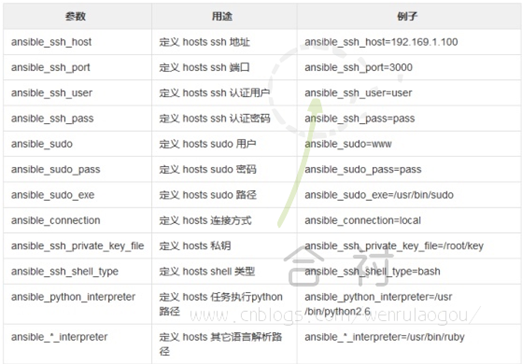

# CentOS7.5 -- Ansible部署与应用

## 第1章 Ansible概述

Ansible是一个配置管理系统configuration management system

python 语言是运维人员必须会的语言

ansible 是一个基于python 开发的自动化运维工具

其功能实现基于ssh远程连接服务

ansible 可以实现批量系统配置，批量软件部署，批量文件拷贝，批量运行命令等功能

除了ansible之外，还有saltstack 等批量管理软件


### 1.1 Ansible能做什么

ansible可以帮助我们完成一些批量任务，或者完成一些需要经常重复的工作。
比如：同时在100台服务器上安装nginx服务，并在安装后启动服务。
比如：将某个文件一次性拷贝到100台服务器上。
比如：每当有新服务器加入工作环境时，你都要为新服务器部署某个服务，也就是说你需要经常重复的完成相同的工作。
这些场景中我们都可以使用到ansible。


### 1.2 Ansible软件特点

1.ansible不需要单独安装客户端，SSH相当于ansible客户端。
2.ansible不需要启动任何服务，仅需安装对应工具即可。
3.ansible依赖大量的python模块来实现批量管理。
4.ansible配置文件/etc/ansible/ansible.cfg


### 1.3 Ansible基础架构


 

1.连接插件(`connectior plugins`) 用于连接主机 用来连接被管理端
2.核心模块(`core modules`) 连接主机实现操作，它依赖于具体的模块来做具体的事情
3.自定义模块(`custom modules`) 根据自己的需求编写具体的模块
4.插件(`plugins`) 完成模块功能的补充
5.剧本(`playbooks`)ansible的配置文件,将多个任务定义在剧本中,由ansible自动执行
6.主机清单(`host inventory`)定义ansible需要操作主机的范围
最重要的一点是 ansible是模块化的 它所有的操作都依赖于模块

不需要单独安装客户端（no agents），基于系统自带的sshd服务，sshd就相当于ansible的客户端

不需要服务端（no sever）

需要依靠大量的模块实现批量管理

配置文件 /etc/ansible/ansible.cfg (前期不用配置)


### 1.4 ansible中查看模块

```
[root@m01 ~]# ansible-doc -l

列出所有模块信息

[root@m01 ~]# ansible-doc -s cron

参看指定模块的帮助
```

## 第2章 Ansible部署与使用


### 2.1 ansible命令语法格式


 

```
[root@m01 ~]# ansible oldboy -m command -a "hostname"

10.0.0.31 | SUCCESS | rc=0 >>
backup

10.0.0.41 | SUCCESS | rc=0 >>

nfs01
```

### 2.2 Ansible清单管理

inventory文件通常用于定义要管理主机的认证信息， 例如ssh登录用户名、密码以及key相关信息。如何配置Inventory文件

#### 主机

1.支持主机名通配以及正则表达式，例如web[1:3].oldboy.com
2.支持基于非标准的ssh端口，例如web1.oldboy.com:6666
3.支持指定变量，可对个别主机的特殊配置，如登陆用户，密码等

#### 主机组

1.支持嵌套组，例如[game:children],那么在game模块下面的组都会被game所包含
2.支持指定变量，例如[game:vars]在下面指定变量

 

以下操作都是在/etc/ansible/hosts 完成的

```
添加三台主机至webserver

[webservers]

web1.oldboy.com

web2.oldboy.com

web3.oldboy.com

添加三台主机至webserver[low改良版]

[webservers]

web[1:3].oldboy.com

添加三台主机至webserver[密码版]

[webservers]

web1.oldboy.com ansible_ssh_pass='123456'

web2.oldboy.com ansible_ssh_pass='123456'

web3.oldboy.com ansible_ssh_pass='123456'

添加三台主机至webserver[密码改良版]

[webservers]

web[1:3].oldboy.com ansible_ssh_pass='123456'

添加三台主机至webserver[密码拆分版]

[webservers]

web1.oldboy.com

web2.oldboy.com

web3.oldboy.com

[webservers:vars]

ansible_ssh_pass='123456'

定义多组，多组汇总整合

[apache]

web1.oldboy.com

web2.oldboy.com

web3.oldboy.com

[apache:vars]

ansible_ssh_pass='123456'

[nginx]

10.0.0.7

10.0.0.31

10.0.0.41

10.0.0.61

[nginx:vars]

ansible_ssh_pass='123456'

webservers组包括两个子组[apapche,nginx]

[webservers:children]

apache

nginx

 

ansible nginx --list-hosts

ansible apache --list-hosts

ansible websers --list-hosts
```

### 2.3 Ansible安装配置

实现从管理机m01到其他机器的密钥认证

说明：

ansible其功能实现基于SSH远程连接服务

使用ansible需要首先实现ssh密钥连接

ansible借助公钥批量管理

ssh服务分发公钥实质执行过程

```
①. 管理服务器创建私钥和公钥（密钥对）

②. 将公钥文件远程传送复制到被管理服务器相应用户~/.ssh/id_dsa.pub下，并修改.ssh目录权限为700

③. 修改公钥文件文件名称为authorized_keys，授权权限为600

④. 利用ssh服务配置文件的配置参数，进行识别公钥文件authorized_keys

⑤. 进而实现基于密钥远程登录服务器（免密码登录/非交互方式登录）
```


```
-P指定密码 -f指定存放的位置

[root@m01 ~]# ssh-keygen -t rsa

一直回车直到结束即可

Generating public/private dsa key pair.

Enter file in which to save the key (/root/.ssh/id_dsa):  #私钥创建后保存的路径

Created directory '/root/.ssh'.

Enter passphrase (empty for no passphrase):               #私钥需不需进行加密，设置密码

Enter same passphrase again:                              #私钥需不需进行加密，再次输入密码确认

 

ssh-keygen -P "" -f ~/.ssh/id_rsa  非交互式创建密码

[root@m01 ~]# ll .ssh/

total 8

-rw------- 1 root root 1679 Sep 11 03:15 id_rsa          #创建出来的私钥

-rw-r--r-- 1 root root  390 Sep 11 03:15 id_rsa.pub      #创建出来的公钥

#利用非交换式工具实现批量分发公钥与批量管理服务器

[root@m01 ~]# ssh-copy-id -i ~/.ssh/id_rsa.pub root@172.16.1.41

[root@m01 ~]# ssh-copy-id -i ~/.ssh/id_rsa.pub root@172.16.1.21

-i       指定要分发的公钥文件以及路径信息

[user@] 以什么用户身份进行分发

machine 将公钥分发到哪台主机上，远程主机IP地址
```

#### 2.3.1 安装ansible

```
[root@m01 ~]# yum install ansible -y # 这种方式需要安装epel源

检查ansible版本

[root@m01 ~]# ansible --version

ansible 2.6.1
```

#### 2.3.2 配置ansible

软件安装完成，进行修改ansible下的hosts文件，**注意文件的路径**

```
[root@m01 ~]# vim /etc/ansible/hosts

[oldboy]

172.16.1.31

172.16.1.41
```

【】中的名字代表组名

主机(hosts)部分可以使用域名、主机名、IP地址表示；一般此类配置中多使用IP地址；

组名下的主机地址就是ansible可以管理的地址

至此ansible 服务就部署完成

#### 2.3.3 验证ansible

ansible是通过ssh端口探测通信

```
[root@m01 ~]# ansible oldboy -m ping

10.0.0.30 | SUCCESS => {

    "changed": false,

    "ping": "pong"

}

10.0.0.40 | SUCCESS => {

    "changed": false,

    "ping": "pong"

}
```

### 2.4 /etc/ansible下的文件

```
[root@m01 ansible]# ll

total 28

-rw-r--r-- 1 root root 18066 Sep  6 06:38 ansible.cfg  #ansible配置文件

-rw-r--r-- 1 root root  1016 Sep  6 06:38 hosts        #定义ansible可以管理的主机信息

drwxr-xr-x 2 root root  4096 Sep  6 06:38 roles        #主要在自动化的时候部署多台主机时使用
```

### **2.5 Ansible内置变量**

 

 

### 2.6 Ansible常用模块

在ansible中是指需要快速执行一条命令， 并且不需要保存的命令，对于复杂的命令则为playbook

Ansible注意事项->提示颜色信息说明

黄色：对远程节点进行相应修改
绿色：对远程节点不进行相应修改，或者只是对远程节点信息进行查看
红色：操作执行命令有异常
紫色：表示对命令执行发出警告信息（可能存在的问题，给你一下建议）

#### 2.6.1 command与shell

```
 command模块
默认模块, 执行命令

[root@m01 ~]# ansible oldboy  -a "hostname"

 shell模块
如果需要一些管道操作，则使用shell

[root@m01 ~]# ansible oldboy -m shell -a "ifconfig|grep eth0" -f 50

 

# -f =forks   /etc/ansible/ansible.cfg #结果返回的数量
```

#### 2.6.2 yum安装模块

推送脚本文件至远程，远程执行脚本文件

```
[root@m01 ~]# ansible oldboy -m yum -a "name=httpd state=installed"

name    ---指定要安装的软件包名称

state   ---指定使用yum的方法

    installed，present   ---安装软件包

    removed，absent      ---移除软件包

    latest               ---安装最新软件包
```

#### 2.6.3 copy模块

推送文件模块

```
[root@m01 ~]# ansible oldboy -m copy -a "src=/etc/hosts dest=/tmp/test.txt"
```

在推送覆盖远程端文件前，对远端已有文件进行备份，按照时间信息备份

```
[root@m01 ~]# ansible oldboy -m copy -a "src=/etc/hosts dest=/tmp/test.txt backup=yes"
```

直接向远端文件内写入数据信息，并且会覆盖远端文件内原有数据信息

```
[root@m01 ~]# ansible oldboy -m copy -a "content='bgx' dest=/tmp/oldboy"
```

src           --- 推送数据的源文件信息

dest          --- 推送数据的目标路径

backup        --- 对推送传输过去的文件，进行备份

content       --- 直接批量在被管理端文件中添加内容

group         --- 将本地文件推送到远端，指定文件属组信息

owner         --- 将本地文件推送到远端，指定文件属主信息

mode          --- 将本地文件推送到远端，指定文件权限信息

#### 2.6.4 service服务模块

```
[root@m01 ~]# ansible oldboy -m service -a "name=crond state=stopped enabled=yes"
```

​	name        --- 定义要启动服务的名称

​	state       --- 指定服务状态是停止或是运行，停止和运行指令要写成过去时

​    started       --- 启动

​    stopped     --- 停止

​    restarted    --- 重启

​    reloaded    --- 重载

​	enabled         --- 是否让服务开启自启动

#### 2.6.5 script模块

编写脚本

```
[root@m01 ~]# mkdir -p /server/scripts

[root@m01 ~]# cat /server/scripts/yum.sh

#!/usr/bin/bash

yum install -y iftop
```

在本地运行模块，等同于在远程执行，不需要将脚本文件进行推送目标主机执行

```
[root@m01 ~]# ansible oldboy -m script -a "/server/scripts/yum.sh"
```

#### 2.6.6 file配置模块

```
[root@m01 ~]# ansible oldboy -m file -a "path=/tmp/oldboy state=diretory"

[root@m01 ~]# ansible oldboy -m file -a "path=/tmp/tt state=touch mode=555 owner=root group=root"

[root@m01 ~]# ansible oldboy -m file -a "src=/tmp/tt path=/tmp/tt_link state=link"
```

​	path        --- 指定远程主机目录或文件信息

​	recurse     --- 递归授权

​	state       ---

​    directory   --- 在远端创建目录

​    touch       --- 在远端创建文件

​    link        --- link或hard表示创建链接文件

​    absent      --- 表示删除文件或目录

​    mode        --- 设置文件或目录权限

​    owner       --- 设置文件或目录属主信息

​    group       --- 设置文件或目录属组信息

#### 2.6.7 group模块

​	name            --- 指定创建的组名

​	gid             --- 指定组的gid

​	state

​    absent      --- 移除远端主机的组

​	present     --- 创建远端主机的组（默认）

创建组，指定gid

```
[root@m01 ~]# ansible oldboy -m group -a "name=oldgirl gid=888"
```

#### 2.6.8 user模块

```
[root@m01 ~]# echo "bgx"| openssl passwd -1 -stdin

$1$1KmeCnsK$HGnBE86F/XkXufL.n6sEb.

[root@m01 ~]# ansible oldboy -m user -a 'name=xlw password="$1$1KmeCnsK$HGnBE86F/XkXufL.n6sEb."'

创建oldgirl，设定uid为888，并加入gid为888

[root@m01 ~]# ansible oldboy -m user -a "name=oldgirl uid=888 group=888 shell=/sbin/nologin create_home=no"

随机生成加密字符串（-1使用MD5进行加密 -stdin 非交互式 -salt 加密参数）

[root@m01 ~]# echo "bgx" | openssl passwd -1 -stdin

固定加密字符串

[root@m01 ~]# echo "123"| openssl passwd -1 -stdin -salt 'salt

创建普通用户，并配置对应的用户密码

[root@m01 ~]# echo "bgx" | openssl passwd -1 -stdin

$1$1KmeCnsK$HGnBE86F/XkXufL.n6sEb.

[root@m01 ~]# ansible oldboy -m user -a 'name=xlw password="$1$765yDGau$diDKPRoCIPMU6KEVEaPTZ0"'
```

uid             --- 指定用户的uid

group           --- 指定用户组名称

groups          --- 指定附加组名称

password        --- 给用户添加密码

shell           --- 指定用户登录shell

create_home     --- 是否创建家目录

#### 2.6.9 crond模块

正常使用crond服务

```
[root@m01 ~]# crontab -l

* * * * *  /bin/sh /server/scripts/yum.sh
```

使用ansible添加一条定时任务

```
[root@m01 ~]# ansible oldboy -m cron -a "minute=* hour=* day=* month=* weekday=*  job='/bin/sh /server/scripts/test.sh'"

[root@m01 ~]# ansible oldboy -m cron -a "job='/bin/sh /server/scripts/test.sh'"
```

设置定时任务注释信息，防止重复，name设定

```
[root@m01 ~]# ansible oldboy -m cron -a "name='cron01' job='/bin/sh /server/scripts/test.sh'"
```

删除相应定时任务

```
[root@m01 ~]# ansible oldboy -m cron -a "name='ansible cron02' minute=0 hour=0 job='/bin/sh /server/scripts/test.sh' state=absent"
```

注释相应定时任务，使定时任务失效   

```
[root@m01 scripts]# ansible oldboy -m cron -a "name='ansible cron01' minute=0 hour=0 job='/bin/sh /server/scripts/test.sh' disabled=no"
```

minute   分           Minute when the job should run ( 0-59, *, */2, etc )

hour     时           Hour when the job should run ( 0-23, *, */2, etc )

day      日           Day of the month the job should run ( 1-31, *, */2, etc )

month    月           Month of the year the job should run ( 1-12, *, */2, etc )

weekday  周           Day of the week that the job should run ( 0-6 for Sunday-Saturday, *, etc )

job      工作 ;要做的事情

name     定义定时任务的描述信息

disabled 注释定时任务

state

absent             删除定时任务

present            创建定时任务（默认为present）

#### 2.6.10 mount模块

仅将挂载的配置写入/etc/fstab，并不会执行挂载操作

```
[root@m01 ~]# ansible oldboy -m mount -a "src=172.16.1.31:/data path=/data fstype=nfs opts=defaults state=present"
```

临时挂载设备，并将挂载信息写入/etc/fstab

```
[root@m01 ~]# ansible web -m mount -a "src=172.16.1.31:/data path=/data fstype=nfs opts=defaults state=mounted"
```

临时卸载，不会清理/etc/fstab

```
[root@m01 ~]# ansible web -m mount -a "src=172.16.1.31:/data path=/data fstype=nfs opts=defaults state=unmounted"
```

卸载，不仅临时卸载，同时会清理/etc/fstab

```
[root@m01 ~]# ansible web -m mount -a "src=172.16.1.31:/data path=/data fstype=nfs opts=defaults state=absent"
```

present     ---开机挂载，仅将挂载配置写入/etc/fstab（不常用）

mounted     ---挂载设备，并将配置写入/etc/fstab

unmounted   ---卸载设备，不会清除/etc/fstab写入的配置

absent      ---卸载设备，会清理/etc/fstab写入的配置

## 第3章 ansible-playbook

playbook是由一个或多个模块组成的，使用多个不同的模块，完成一件事情。

### 3.1 ansible软件特点

可以实现批量管理

可以实现批量部署

```
ad-hoc(批量执行命令)---针对临时性的操作

ansible clsn -m command -a "hostname"   <- 批量执行命令举例
```

编写剧本-脚本(playbook)---针对重复性的操作

### 3.2 ansible核心功能

```
pyYAML-----用于ansible编写剧本所使用的语言格式（saltstack---python） 

rsync-ini语法  sersync-xml语法  ansible-pyYAML语法

paramiko---远程连接与数据传输  

Jinja2-----用于编写ansible的模板信息 
```

## 第4章 剧本编写规则说明

### 4.1 YAML三板斧

缩进

YAML使用一个固定的缩进风格表示层级结构,每个缩进由两个空格组成, 不能使用tabs

冒号

以冒号结尾的除外，其他所有冒号后面所有必须有空格。

短横线

表示列表项，使用一个短横杠加一个空格。

多个项使用同样的缩进级别作为同一列表。

### 4.2 剧本书写格式

\- hosts: 172.16.1.7       处理指定服务器         (空格)hosts:(空格)172.16.1.7

  task:                剧本所要干的事情;              (空格)(空格)task:

  \- name:            （两个空格）-（空格）name:

​    command: echo hello clsn linux   （四个空格）command:(空格)                   

剧本格式示例

```
[root@m01 ansible-playbook]# vim rsync.yaml

- hosts: 172.16.1.41

  tasks:

    - name: Install Rsync

      yum: name=rsync state=installed
```

### 4.3 剧本检查方法

```
ansible-playbook --syntax-check 01.yml 

     　　 --- 进行剧本配置信息语法检查

ansible-playbook -C 01.yml             

        --- 模拟剧本执行（彩排）
```

#### 4.3.1 语法检查

```
ansible-playbook --syntax-check

[root@m01 ansible-playbook]# ansible-playbook --syntax-check 01.yml

playbook: 01.yml
```


```
ansible-playbook -C

[root@m01 ansible-playbook]# ansible-playbook -C 01.yml

PLAY [all] ****************************************************************

 

TASK [Gathering Facts] ****************************************************

ok: [172.16.1.41]

ok: [172.16.1.8]

此处省略………..

PLAY RECAP ****************************************************************

172.16.1.31                : ok=2    changed=0    unreachable=0    failed=0

172.16.1.41                : ok=2    changed=0    unreachable=0    failed=0

172.16.1.8                 : ok=2    changed=0    unreachable=0    failed=0
```

### 4.4 剧本示例

剧本编写内容扩展：剧本任务编写多个任务)

```
- hosts: all

  tasks:

    - name: restart-network

      cron: name='restart network' minute=00 hour=00 job='/usr/sbin/ntpdate time.nist.gov >/dev/null 2>&1'

    - name: sync time

      cron: name='sync time' minute=*/5 job="/usr/sbin/ntpdate pool.ntp.com >/dev/null 2>&1"
```

剧本编写内容扩展：剧本任务编写多个主机

```
- hosts: 172.16.1.7

  tasks:

    - name: restart-network

      cron: name='restart network' minute=00 hour=00 job='/usr/sbin/ntpdate time.nist.gov >/dev/null 2>&1'

    - name: sync time

      cron: name='sync time' minute=*/5 job="/usr/sbin/ntpdate pool.ntp.com >/dev/null 2>&1"

- hosts: 172.16.1.31

  tasks:

    - name: show ip addr to file

      shell: echo $(hostname -i) >> /tmp/ip.txt
```

### 4.5 剧本编写方式

多主机单任务编写方式

多主机多任务编写方式

不同主机多任务编写方式

## 第5章 Ansible项目案例

### 5.1 环境规划

全网备份

实时备份

| 角色   | 外网IP(NAT)    | 内网IP(LAN)      | 部署软件     |
| ------ | -------------- | ---------------- | ------------ |
| m01    | eth0:10.0.0.61 | eth1:172.16.1.61 | ansible      |
| backup | eth0:10.0.0.41 | eth1:172.16.1.41 | rsync        |
| nfs    | eth0:10.0.0.31 | eth1:172.16.1.31 | nfs、Sersync |
| web01  | eth0:10.0.0.7  | eth1:172.16.1.7  | httpd        |

### 5.2 目录规划

```
[root@m01 ~]# mkdir /etc/ansible/ansible_playbook/{file,conf,scripts} -p

[root@m01 ~]# tree /etc/ansible/ansible_playbook/

/etc/ansible/ansible_playbook/

├── conf

└── file

└── scripts
```

### 5.3 需提前准备好的文件

#### 5.3.1 rsync配置文件

准备对应的配置文件存放至/etc/ansible/ansible_playbook/conf/

```
[root@m01 conf]# cat /etc/ansible/ansible_playbook/conf/rsyncd.conf

uid = www

gid = www

port = 873

fake super = yes

use chroot = no

max connections = 200

timeout = 600

ignore errors

read only = false

list = false

auth users = rsync_backup

secrets file = /etc/rsync.password

log file = /var/log/rsyncd.log

#####################################

[backup]

path = /backup

 

[data]

path = /data
```

#### 5.3.2 nfs配置文件

准备nfs配置文件exports

```
[root@m01 ansible_playbook]# cat /etc/ansible/ansible_playbook/conf/nfs_exports

/data/ 172.16.1.0/24(rw,sync,all_squash,anonuid=666,anongid=666)
```

#### 5.3.3 Sersync软件包

下载Sersync软件包

```
[root@m01 ansible_playbook]# ll /etc/ansible/ansible_playbook/file/

-rw-r--r-- 1 root root 727290 Aug  1 12:04 sersync.tar.gz
```

#### 5.3.4 sersync配置文件

准备sersync实时同步的配置文件

```
[root@m01 ansible_playbook]# cat /etc/ansible/ansible_playbook/conf/confxml.xml.nfs

<?xml version="1.0" encoding="ISO-8859-1"?>

<head version="2.5">

    <host hostip="localhost" port="8008"></host>

    <debug start="false"/>

    <fileSystem xfs="true"/>

    <filter start="false">

    <exclude expression="(.*)\.svn"></exclude>

    <exclude expression="(.*)\.gz"></exclude>

    <exclude expression="^info/*"></exclude>

    <exclude expression="^static/*"></exclude>

    </filter>

    <inotify>

    <delete start="true"/>

    <createFolder start="true"/>

    <createFile start="true"/>

    <closeWrite start="true"/>

    <moveFrom start="true"/>

    <moveTo start="true"/>

    <attrib start="false"/>

    <modify start="false"/>

    </inotify>

 

    <sersync>

    <localpath watch="/data">

        <remote ip="172.16.1.41" name="data"/>

    </localpath>

 

    <rsync>

        <commonParams params="-az"/>

        <auth start="true" users="rsync_backup" passwordfile="/etc/rsync.pass"/>

        <userDefinedPort start="false" port="874"/><!-- port=874 -->

        <timeout start="true" time="100"/><!-- timeout=100 -->

        <ssh start="false"/>

    </rsync>

    <failLog path="/tmp/rsync_fail_log.sh" timeToExecute="60"/><!--default every 60mins execute once-->

    <crontab start="false" schedule="600"><!--600mins-->

        <crontabfilter start="false">

        <exclude expression="*.php"></exclude>

        <exclude expression="info/*"></exclude>

        </crontabfilter>

    </crontab>

    <plugin start="false" name="command"/>

    </sersync>

 

    <plugin name="command">

    <param prefix="/bin/sh" suffix="" ignoreError="true"/>  <!--prefix /opt/tongbu/mmm.sh suffix-->

    <filter start="false">

        <include expression="(.*)\.php"/>

        <include expression="(.*)\.sh"/>

    </filter>

    </plugin>

 

    <plugin name="socket">

    <localpath watch="/opt/tongbu">

        <deshost ip="192.168.138.20" port="8009"/>

    </localpath>

    </plugin>

    <plugin name="refreshCDN">

    <localpath watch="/data0/htdocs/cms.xoyo.com/site/">

        <cdninfo domainname="ccms.chinacache.com" port="80" username="xxxx" passwd="xxxx"/>

        <sendurl base="http://pic.xoyo.com/cms"/>

        <regexurl regex="false" match="cms.xoyo.com/site([/a-zA-Z0-9]*).xoyo.com/images"/>

    </localpath>

    </plugin>

</head>
```

### 5.4 基础环境部署

基础环境：所有机器统一的配置

1.需要关闭firewalld以及selinux、epel仓库、ssh端口、优化基础配置

2.需要安装rsync和nfs-utils

3.准备www用户

4.需要准备/etc/rsync.pass密码文件

5.需要准备全网备份脚本

```
基础的playbook剧本

[root@m01 ansible_playbook]# cat base.yaml

- hosts: all

  tasks:

 

    - name: Install Epel Repos

      get_url: url=http://mirrors.aliyun.com/repo/epel-7.repo dest=/etc/yum.repos.d/epel.repo

 

    - name: Install Rsync Nfs-Utils

      yum: name=rsync,nfs-utils state=installed

 

    - name: Create Group WWW

      group: name=www gid=666

 

    - name: Create User WWW

      user: name=www uid=666 group=666 create_home=no shell=/sbin/nologin

 

    - name: Create Rsync_Client_Pass

      copy: content='1' dest=/etc/rsync.pass mode=600

 

    - name: Create Scripts Directory

      file: path=/server/scripts recurse=yes state=directory

 

    - name: Push File Scripts

      copy: src=./scripts/rsync_backup_md5.sh dest=/server/scripts/

 

    - name: Crontable Scripts

      cron: name="backup scripts" hour=01 minute=00 job="/bin/bash /server/scripts/rsync_backup_md5.sh &>/dev/null"
```

### 5.5 应用环境：Rsync

1.安装rsync

2.配置rsync（配置变更，一定要进行重载操作）

3.创建虚拟用户，权限调整

4.创建目录/data/  /backup

5.启动rsync

6.配置邮箱->邮箱的发件人->校验的脚本

```
[root@m01 ansible_playbook]# cat rsync.yaml

- hosts: backup

  tasks:

    - name: Installed Rsync Server

      yum: name=rsync,mailx state=installed

 

    - name: configure Rsync Server

      copy: src=./conf/rsyncd.conf dest=/etc/rsyncd.conf

      notify: Restart Rsync Server

 

    - name: Create Virt User

      copy: content='rsync_backup:1' dest=/etc/rsync.password mode=600

 

    - name: Create Data

      file: path=/data state=directory recurse=yes owner=www group=www mode=755

 

    - name: Create Backup

      file: path=/backup state=directory recurse=yes owner=www group=www mode=755

 

    - name: Start RsyncServer

      service: name=rsyncd state=started enabled=yes

 

    - name: Push Check Scripts

      copy: src=./scripts/rsync_check_backup.sh dest=/server/scripts/

 

    - name: Crond Check Scripts

      cron: name="check scripts" hour=05 minute=00 job="/bin/bash /server/scripts/rsync_check_backup.sh &>/dev/null"
```

### 5.6 应用环境：NFS

1.安装nfs-utils

2.配置nfs     （当修改了配置，触发重载操作）

3.创建目录，授权

4.启动

```
[root@m01 ansible_playbook]# cat nfs.yaml

- hosts: nfs

  tasks:

 

    - name: Installed Nfs Server

      yum: name=nfs-utils state=installed

 

    - name: Configure Nfs Server

      copy: src=./conf/exports dest=/etc/exports

      notify: Restart Nfs Server

 

    - name: Create Share Data

      file: path=/data state=directory recurse=yes owner=www group=www mode=755

 

    - name: Start Nfs Server

      service: name=nfs-server state=started enabled=yes

 

  handlers:

    - name: Restart Nfs Server

      service: name=nfs-server state=restarted
```

### 5.7 应用环境：Sersync

1.下载sersync

2.解压，改名，配置

3.启动

```
[root@m01 ansible_playbook]# cat sersync.yaml

- hosts: nfs

  tasks:

    - name: Scp Sersync

      copy: src=./file/sersync2.5.4_64bit_binary_stable_final.tar.gz dest=/usr/local/sersync.tar.gz

 

    - name: Zip

      shell: cd /usr/local && tar xf sersync.tar.gz && mv GNU-Linux-x86 sersync

      args:

        creates: /usr/local/sersync

   

    - name: configure Sersync

      copy: src=./conf/confxml.xml dest=/usr/local/sersync/

 

    - name: Start Sersync

      shell: /usr/local/sersync/sersync2 -dro /usr/local/sersync/confxml.xml
```

### 5.8 应用环境：WEB

挂载nfs共享的目录

```
[root@m01 ansible_playbook]# cat web.yaml

- hosts: web

  tasks:

 

    - name: Mount NFS Server Share Data

      mount: src=172.16.1.31:/data path=/data fstype=nfs opts=defaults state=mounted
```

### 5.9 包含include

```
[root@m01 ansible_playbook]# cat mail.yaml

- import_playbook: base.yaml

- import_playbook: rsync.yaml

- import_playbook: nfs.yaml

- import_playbook: sersync.yaml

- import_playbook: web.yaml
```

### 5.10 操作后测试步骤

快照还原
推送公钥
使用ping模块测试
执行ansible-playbook测试
测试全网备份，测试是否能发邮件，并校验结果
测试nfs的挂载
测试实时同步