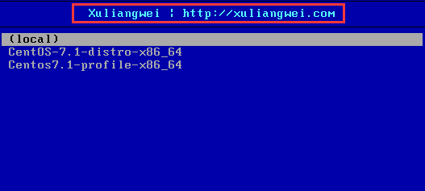

# Cobbler批量安装操作系统(基于Centos7.x )


## 1.1 cobbler简介

　　Cobbler是一个Linux服务器安装的服务，可以通过网络启动(PXE)的方式来快速安装、重装物理服务器和虚拟机，同时还可以管理DHCP，DNS等。

　　Cobbler可以使用命令行方式管理，也提供了基于Web的界面管理工具(cobbler-web)，还提供了API接口，可以方便二次开发使用。

　　Cobbler是较早前的kickstart的升级版，优点是比较容易配置，还自带web界面比较易于管理。

　　Cobbler内置了一个轻量级配置管理系统，但它也支持和其它配置管理系统集成，如Puppet，暂时不支持SaltStack。

　　Cobbler官网[http://cobbler.github.io](http://cobbler.github.io/)

　　在使用cobbler之前需要了解kickstart的使用： <http://www.cnblogs.com/clsn/p/7833333.html>

### 1.1.1 cobbler集成的服务

 　　 PXE服务支持

 　　 DHCP服务管理

 　　 DNS服务管理(可选bind,dnsmasq)

  　　电源管理

  　　Kickstart服务支持

  　　YUM仓库管理

  　　TFTP(PXE启动时需要)

  　　Apache**(****提供kickstart****的安装源，并提供定制化的kickstart****配置)**

## 1.2 安装cobbler

### 1.2.1 环境说明

```
[root@Cobbler ~]# cat /etc/redhat-release
CentOS Linux release 7.4.1708 (Core)

[root@Cobbler ~]# uname -r
3.10.0-693.el7.x86_64

[root@Cobbler ~]# getenforce
Disabled

[root@Cobbler ~]# systemctl status firewalld.service
● firewalld.service - firewalld - dynamic firewall daemon
   Loaded: loaded (/usr/lib/systemd/system/firewalld.service; disabled; vendor preset: enabled)
   Active: inactive (dead)
     Docs: man:firewalld(1)

[root@Cobbler ~]# hostname -I
10.0.0.202 172.16.1.202
```

*yum**源说明：*

```
curl -o /etc/yum.repos.d/CentOS-Base.repo http://mirrors.aliyun.com/repo/Centos-7.repo
curl -o /etc/yum.repos.d/epel.repo http://mirrors.aliyun.com/repo/epel-7.repo
```

### 1.2.2 使用yum安装cobbler

```
yum -y install cobbler cobbler-web dhcp tftp-server pykickstart httpd
```

   *说明：cobbler**是依赖与epel**源下载*

### 1.2.3 cobbler语法检查前先启动http与cobbler

```
systemctl start httpd.service
systemctl start cobblerd.service
cobbler check
```

### 1.2.4 进行语法检查

```
[root@Cobbler ~]# cobbler check
The following are potential configuration items that you may want to fix:

1 : The 'server' field in /etc/cobbler/settings must be set to something other than localhost, or kickstarting features will not work.  This should be a resolvable hostname or IP for the boot server as reachable by all machines that will use it.

2 : For PXE to be functional, the 'next_server' field in /etc/cobbler/settings must be set to something other than 127.0.0.1, and should match the IP of the boot server on the PXE network.

3 : change 'disable' to 'no' in /etc/xinetd.d/tftp

4 : Some network boot-loaders are missing from /var/lib/cobbler/loaders, you may run 'cobbler get-loaders' to download them, or, if you only want to handle x86/x86_64 netbooting, you may ensure that you have installed a *recent* version of the syslinux package installed and can ignore this message entirely.  Files in this directory, should you want to support all architectures, should include pxelinux.0, menu.c32, elilo.efi, and yaboot. The 'cobbler get-loaders' command is the easiest way to resolve these requirements.

5 : enable and start rsyncd.service with systemctl

6 : debmirror package is not installed, it will be required to manage debian deployments and repositories

7 : The default password used by the sample templates for newly installed machines (default_password_crypted in /etc/cobbler/settings) is still set to 'cobbler' and should be changed, try: "openssl passwd -1 -salt 'random-phrase-here' 'your-password-here'" to generate new one

8 : fencing tools were not found, and are required to use the (optional) power management features. install cman or fence-agents to use them

Restart cobblerd and then run 'cobbler sync' to apply changes.
```

### 1.2.5 解决当中的报错

命令集

```
sed -i 's/server: 127.0.0.1/server: 192.168.152.174/' /etc/cobbler/settings
sed -i 's/next_server: 127.0.0.1/next_server: 192.168.152.174/' /etc/cobbler/settings
sed -i 's/manage_dhcp: 0/manage_dhcp: 1/' /etc/cobbler/settings
sed -i 's/pxe_just_once: 0/pxe_just_once: 1/' /etc/cobbler/settings
sed -ri "/default_password_crypted/s#(.*: ).*#\1\"`openssl passwd -1 -salt 'cobbler' '123456'`\"#" /etc/cobbler/settings
sed -i 's#yes#no#' /etc/xinetd.d/tftp

systemctl start rsyncd
systemctl enable rsyncd
systemctl enable tftp.socket
systemctl start tftp.socket
systemctl restart cobblerd.service

sed -i.ori 's#192.168.1#192.168.152#g;22d;23d' /etc/cobbler/dhcp.template

cobbler sync
```

详解

解决1、2

```
cp /etc/cobbler/settings{,.ori}
sed -i 's/server: 127.0.0.1/server: 172.16.1.202/' /etc/cobbler/settings
sed -i 's/next_server: 127.0.0.1/next_server: 172.16.1.202/' /etc/cobbler/settings
```

问题3

```
sed 's#yes#no#g' /etc/xinetd.d/tftp -i
```

4下载包所需的软件包

```
# cobbler get-loaders
task started: 2019-07-24_021430_get_loaders
task started (id=Download Bootloader Content, time=Wed Jul 24 02:14:30 2019)
downloading https://cobbler.github.io/loaders/README to /var/lib/cobbler/loaders/README
downloading https://cobbler.github.io/loaders/COPYING.elilo to /var/lib/cobbler/loaders/COPYING.elilo
downloading https://cobbler.github.io/loaders/COPYING.yaboot to /var/lib/cobbler/loaders/COPYING.yaboot
downloading https://cobbler.github.io/loaders/COPYING.syslinux to /var/lib/cobbler/loaders/COPYING.syslinux
downloading https://cobbler.github.io/loaders/elilo-3.8-ia64.efi to /var/lib/cobbler/loaders/elilo-ia64.efi

downloading https://cobbler.github.io/loaders/yaboot-1.3.17 to /var/lib/cobbler/loaders/yaboot
downloading https://cobbler.github.io/loaders/pxelinux.0-3.86 to /var/lib/cobbler/loaders/pxelinux.0
downloading https://cobbler.github.io/loaders/menu.c32-3.86 to /var/lib/cobbler/loaders/menu.c32
downloading https://cobbler.github.io/loaders/grub-0.97-x86.efi to /var/lib/cobbler/loaders/grub-x86.efi
downloading https://cobbler.github.io/loaders/grub-0.97-x86_64.efi to /var/lib/cobbler/loaders/grub-x86_64.efi
*** TASK COMPLETE ***
```

5启动rsync服务

```
# systemctl start rsyncd.service
# systemctl enable rsyncd.service
```

6 debian相关

安装 debmirro，如果用不到可以忽略

```
# yum -y install debmirror
# sed -i  's|@dists=.*|#@dists=|'  /etc/debmirror.conf
# sed -i  's|@arches=.*|#@arches=|'  /etc/debmirror.conf
```

7、修改安装完成后的root密码

```
openssl passwd -1 -salt 'random-phrase-here' 'your-password-here'
random-phrase-here  随机字符串
your-password-here 密码
```

示例

```
[root@Cobbler ~]# openssl passwd -1 -salt 'cobbler' '123456'
$1$CLSN$LpJk4x1cplibx3q/O4O/K/
```

使用生成的字符串，替换default_password_crypted默认的密码

```
# vim /etc/cobbler/settings
default_password_crypted: "$1$cobble$K03Q.A2lkupK0pGFt6f46/"
```

8，我没有用到是可以直接忽略的，但是见到提示就不爽，还是解决一下吧

```
#  yum -y install fence-agent
```

管理dhcp  1为开启，默认为0

```
sed -i 's/manage_dhcp: 0/manage_dhcp: 1/' /etc/cobbler/settings
```

防止循环装系统，适用于服务器第一启动项是PXE启动。
该选项作用:

- 防止机器循环安装配置始终从网络引导
- 激活此选项，机器回传Cobbler安装完成
- Cobbler将系统对象的netboot标志更改为false，强制要求机器从本地磁盘引导。

```
sed -i 's/pxe_just_once: 0/pxe_just_once: 1/' /etc/cobbler/settings
```

修改dhcp模板

```
sed -i.ori 's#192.168.1#172.16.1#g;22d;23d' /etc/cobbler/dhcp.template

或者
# cp /etc/cobbler/dhcp.template{,.bak}
# vim /etc/cobbler/dhcp.template
subnet 10.10.0.0 netmask 255.255.252.0 {
     option routers             10.10.3.254;  # 网关
     option domain-name-servers 10.10.1.250;  # dns
     option subnet-mask         255.255.252.0; # 子网
     range dynamic-bootp        10.10.0.100 10.10.0.254; # 可分配的ip范围
     default-lease-time         21600;
     max-lease-time             43200;
```

cobbler 组配置文件位置

```
/etc/cobbler/settings
```

**注意：修改完成之后重启cobbler服务,使用cobbler sync 进行同步，否则不生效。**

同步cobbler配置，会修改tftp，dhcp等服务的配置并重启，可以仔细看一下下面的输出

```
# systemctl restart cobblerd.service

# cobbler sync
task started: 2019-07-24_043113_sync
task started (id=Sync, time=Wed Jul 24 04:31:13 2019)
running pre-sync triggers
cleaning trees
removing: /var/lib/tftpboot/pxelinux.cfg/default
removing: /var/lib/tftpboot/grub/images
removing: /var/lib/tftpboot/grub/efidefault
removing: /var/lib/tftpboot/s390x/profile_list
copying bootloaders
trying hardlink /var/lib/cobbler/loaders/pxelinux.0 -> /var/lib/tftpboot/pxelinux.0
copying: /var/lib/cobbler/loaders/pxelinux.0 -> /var/lib/tftpboot/pxelinux.0
trying hardlink /var/lib/cobbler/loaders/menu.c32 -> /var/lib/tftpboot/menu.c32
copying: /var/lib/cobbler/loaders/menu.c32 -> /var/lib/tftpboot/menu.c32
trying hardlink /var/lib/cobbler/loaders/yaboot -> /var/lib/tftpboot/yaboot
trying hardlink /var/lib/cobbler/loaders/grub-x86.efi -> /var/lib/tftpboot/grub/grub-x86.efi
trying hardlink /var/lib/cobbler/loaders/grub-x86_64.efi -> /var/lib/tftpboot/grub/grub-x86_64.efi
copying distros to tftpboot
copying images
generating PXE configuration files
generating PXE menu structure
rendering DHCP files
generating /etc/dhcp/dhcpd.conf
rendering TFTPD files
generating /etc/xinetd.d/tftp
cleaning link caches
running post-sync triggers
running python triggers from /var/lib/cobbler/triggers/sync/post/*
running python trigger cobbler.modules.sync_post_restart_services
running: dhcpd -t -q
received on stdout:
received on stderr:
running: service dhcpd restart
received on stdout:
received on stderr: Redirecting to /bin/systemctl restart dhcpd.service

running shell triggers from /var/lib/cobbler/triggers/sync/post/*
running python triggers from /var/lib/cobbler/triggers/change/*
running python trigger cobbler.modules.manage_genders
running python trigger cobbler.modules.scm_track
running shell triggers from /var/lib/cobbler/triggers/change/*
*** TASK COMPLETE ***
```

### 1.2.6 修改之后

再次检查语法：

```
# cobbler check
No configuration problems found.  All systems go.
```

重启所有服务

```
systemctl restart httpd.service
systemctl restart cobblerd.service
systemctl restart dhcpd.service
systemctl restart rsyncd.service
systemctl restart tftp.socket
```

1. 导入镜像

先自行下载一个centos7镜像，然后挂载到本地，之后导入到cobbler

```
# mkdir /mnt/centos7.5
# mount -t iso9660 -o loop CentOS-7-x86_64-Minimal-1804.iso  /mnt/centos7.5
# cobbler import --path=/mnt/centos7.5 --name=CentOS-7.5-1804-x86_64 --arch=x86_64
task started: 2019-07-24_050656_import
task started (id=Media import, time=Wed Jul 24 05:06:56 2019)
Found a candidate signature: breed=redhat, version=rhel6
Found a candidate signature: breed=redhat, version=rhel7
Found a matching signature: breed=redhat, version=rhel7
Adding distros from path /var/www/cobbler/ks_mirror/CentOS-7.5-1804-x86_64:
creating new distro: CentOS-7.5-1804-x86_64
trying symlink: /var/www/cobbler/ks_mirror/CentOS-7.5-1804-x86_64 -> /var/www/cobbler/links/CentOS-7.5-1804-x86_64
creating new profile: CentOS-7.5-1804-x86_64
associating repos
checking for rsync repo(s)
checking for rhn repo(s)
checking for yum repo(s)
starting descent into /var/www/cobbler/ks_mirror/CentOS-7.5-1804-x86_64 for CentOS-7.5-1804-x86_64
processing repo at : /var/www/cobbler/ks_mirror/CentOS-7.5-1804-x86_64
need to process repo/comps: /var/www/cobbler/ks_mirror/CentOS-7.5-1804-x86_64
looking for /var/www/cobbler/ks_mirror/CentOS-7.5-1804-x86_64/repodata/*comps*.xml
Keeping repodata as-is :/var/www/cobbler/ks_mirror/CentOS-7.5-1804-x86_64/repodata
*** TASK COMPLETE ***
```

- –path 镜像路径
- –name 指定安装源的名字
- –arch 指定导入镜像的体系结构

查看镜像列表

```
# cobbler distro list
   CentOS-7.5-1804-x86_64
```

镜像保存在http的目录内

```
# ls /var/www/cobbler/ks_mirror/
```

使用cobbler查看，此处的一些变量我们在写 kickstarts 配置的时候可能会用到，例如tree

```
# cobbler distro  report
Name                           : CentOS-7.5-1804-x86_64
Architecture                   : x86_64
TFTP Boot Files                : {}
Breed                          : redhat
Comment                        :
Fetchable Files                : {}
Initrd                         : /var/www/cobbler/ks_mirror/CentOS-7.5-1804-x86_64/images/pxeboot/initrd.img
Kernel                         : /var/www/cobbler/ks_mirror/CentOS-7.5-1804-x86_64/images/pxeboot/vmlinuz
Kernel Options                 : {}
Kernel Options (Post Install)  : {}
Kickstart Metadata             : {'tree': 'http://@@http_server@@/cblr/links/CentOS-7.5-1804-x86_64'}
Management Classes             : []
OS Version                     : rhel7
Owners                         : ['admin']
Red Hat Management Key         : <<inherit>>
Red Hat Management Server      : <<inherit>>
Template Files                 : {}
```

1. kickstarts文件配置

> 在传统安装操作系统时，需要大量的交互操作，为了减少交互的过程，kickstart就产生了，我们需要提前定义好这个kickstart的配置文件，并让安装程序知道kickstart配置文件的位置，在安装过程中读取kickstart配置即可实现无人值守的自动化安装操作系统。

默认的kickstarts文件放在/var/lib/cobbler/kickstarts/目录下，默认有一些示例

```
# ls /var/lib/cobbler/kickstarts/
default.ks    esxi5-ks.cfg      legacy.ks     sample_autoyast.xml  sample_esx4.ks   sample_esxi5.ks  sample.ks        sample.seed
esxi4-ks.cfg  install_profiles  pxerescue.ks  sample_end.ks        sample_esxi4.ks  sample_esxi6.ks  sample_old.seed
```

一般centos系统安装完成后会在/root/anaconda-ks.cfg
产生一个ks配置文件，记录安装过程，我们可以根据这个文件修改一下，修改好后放到/var/lib/cobbler/kickstarts目录

```
default.ks    esxi5-ks.cfg      legacy.ks     sample_autoyast.xml  sample_esx4.ks   sample_esxi5.ks  sample.ks        sample.seed
esxi4-ks.cfg  install_profiles  pxerescue.ks  sample_end.ks        sample_esxi4.ks  sample_esxi6.ks  sample_old.seed
一般centos系统安装完成后会在/root/anaconda-ks.cfg
产生一个ks配置文件，记录安装过程，我们可以根据这个文件修改一下，修改好后放到/var/lib/cobbler/kickstarts目录
# cat /var/lib/cobbler/kickstarts/centos7.5.ks
# Cobbler kickstart config
# centos 7.5
install
url --url=$tree  # 这里是distro report里的变量
text
lang zh_CN.UTF-8
keyboard --vckeymap=cn --xlayouts='cn'
zerombr
bootloader --append=" crashkernel=auto" --location=mbr --boot-drive=xvda   # 这里的硬盘需要根据实际情况更改，我这里用的xenserver创建的虚拟机，硬盘名为xvda
timezone Asia/Shanghai --isUtc
authconfig --enableshadow --passalgo=sha512
rootpw  --iscrypted $default_password_crypted
clearpart --all --initlabel

part biosboot --fstype="biosboot" --ondisk=xvda --size=1
part /boot --fstype="xfs" --ondisk=xvda --size=476
part pv.585 --fstype="lvmpv" --ondisk=xvda --size=51200 --grow
volgroup centos --pesize=4096 pv.585
logvol swap  --fstype="swap" --size=2048 --name=swap --vgname=centos
logvol /  --fstype="xfs" --size=20000 --name=root --vgname=centos --grow
firstboot --disable
selinux --disabled
firewall --disabled
logging --level=info

%pre
$SNIPPET('log_ks_pre')
$SNIPPET('kickstart_start')
$SNIPPET('pre_install_network_config')
# Enable installation monitoring
$SNIPPET('pre_anamon')
%end

%packages
@^minimal
@core
chrony
kexec-tools
%end

%post
systemctl disable postfix.service
%end
```

查看一下profile的配置

```
# cobbler profile  report  --name=Centos-7.5-1804-x86_64
Name                           : Centos-7.5-1804-x86_64
TFTP Boot Files                : {}
Comment                        :
DHCP Tag                       : default
Distribution                   : CentOS-7.5-1804-x86_64
Enable gPXE?                   : 0
Enable PXE Menu?               : 1
Fetchable Files                : {}
Kernel Options                 : {}
Kernel Options (Post Install)  : {}
Kickstart                      : /var/lib/cobbler/kickstarts/sample_end.ks  # 这里还是默认的ks配置文件
Kickstart Metadata             : {}
Management Classes             : []
Management Parameters          : <<inherit>>
Name Servers                   : []
Name Servers Search Path       : []
Owners                         : ['admin']
Parent Profile                 :
Internal proxy                 :
Red Hat Management Key         : <<inherit>>
Red Hat Management Server      : <<inherit>>
Repos                          : []
Server Override                : <<inherit>>
Template Files                 : {}
Virt Auto Boot                 : 1
Virt Bridge                    : xenbr0
Virt CPUs                      : 1
Virt Disk Driver Type          : raw
Virt File Size(GB)             : 5
Virt Path                      :
Virt RAM (MB)                  : 512
Virt Type                      : kvm
```

修改指定的kickstart文件

```
# cobbler profile edit --name=Centos-7.5-1804-x86_64  --kickstart=/var/lib/cobbler/kickstarts/centos7.5.ks
```

在查看一下,kickstart已经关联到了我们自己的ks文件

```
# cobbler profile  report  --name=Centos-7.5-1804-x86_64 | grep -i kickstart
Kickstart                      : /var/lib/cobbler/kickstarts/centos7.5.ks
Kickstart Metadata             : {}
```

启动菜单，local是默认选项，之后才是我们自己定义的启动项，在下面的模板中可以看出ONTIMEOUT 超时后会以$pxe_timeout_profile这个变量的值来启动

```
# cat /etc/cobbler/pxe/pxedefault.template
DEFAULT menu
PROMPT 0
MENU TITLE Cobbler | http://cobbler.github.io/
TIMEOUT 200
TOTALTIMEOUT 6000
ONTIMEOUT $pxe_timeout_profile


LABEL local
        MENU LABEL (local)
        MENU DEFAULT
        LOCALBOOT -1

$pxe_menu_items


MENU end
```

查看源代码，pxe_timeout_profile是从system中取的，如果没有设置话默认会设置为local

```
def make_pxe_menu(self):
    """
    Generates both pxe and grub boot menus.
    """
    # only do this if there is NOT a system named default.
    default = self.systems.find(name="default")

    if default is None:
        timeout_action = "local"
    else:
        timeout_action = default.profile

    menu_items = self.get_menu_items()

    # Write the PXE menu:
    metadata = {"pxe_menu_items": menu_items['pxe'], "pxe_timeout_profile": timeout_action}
    outfile = os.path.join(self.bootloc, "pxelinux.cfg", "default")
    template_src = open(os.path.join(self.settings.boot_loader_conf_template_dir, "pxedefault.template"))
    template_data = template_src.read()
    self.templar.render(template_data, metadata, outfile, None)
    template_src.close()

    # Write the grub menu:
    outfile = os.path.join(self.bootloc, "grub", "menu_items.cfg")
    fd = open(outfile, "w+")
    fd.write(menu_items['grub'])
    fd.close()
```

这里在捊一下distro，profile，system三者间的关系

- distro 可以理解为“操作系统”，我们之前导入iso时会生成distro
- profile 我理解的是这里定义的是操作系统安装时的一些参数？（理解可能有误，欢迎指正）
- system 这里就是定义启动时的菜单选项了

根据上面的代码我们需要加一个system的配置

```
# cobbler system add  --name=default --profile=CentOS-7.5-1804-x86_64
# cobbler  system list
   default
# cobbler sync   # 同步，然后在查看一下default的配置
# cat /var/lib/tftpboot/pxelinux.cfg/default
DEFAULT menu
PROMPT 0
MENU TITLE Cobbler | http://cobbler.github.io/
TIMEOUT 200
TOTALTIMEOUT 6000
ONTIMEOUT CentOS-7.5-1804-x86_64


LABEL local
        MENU LABEL (local)
        MENU DEFAULT
        LOCALBOOT -1

LABEL Centos-7.5-1804-x86_64
        kernel /images/CentOS-7.5-1804-x86_64/vmlinuz
        MENU LABEL Centos-7.5-1804-x86_64
        append initrd=/images/CentOS-7.5-1804-x86_64/initrd.img ksdevice=bootif lang=  kssendmac text  ks=http://10.10.1.13/cblr/svc/op/ks/profile/Centos-7.5-1804-x86_64
        ipappend 2


MENU end
```

这里的顺序更改一定要注意，要么就是自动化安装操作系统时划分vlan防止有原来的服务器重启将服务器重新安装，或者安装完后将cobbler服务停止。

1. 自动安装系统

以上cobbler算是都配置完成了，现在可以愉快的安装操作系统了，新建一台虚拟机，这步略过了没啥可介绍的，虚拟机指定用pxe 网络启动即可，后边都是图片了，我就不上传了，只要ks文件没问题，几乎不会出问题。如果有问题，自行拆招吧。。

可以用以下命令查看安装状态

```
# cobbler status
ip             |target              |start            |state
10.10.0.103    |profile:Centos-7.5-1804-x86_64|Thu Jul 25 03:59:58 2019|installing (59m 35s)
```

到此cobbler就安装完成，

## 1.3 cobbler的web及界面操作

浏览器访问**https://10.0.0.202/cobbler_web**

   注意CentOS7中cobbler只支持https访问。

**注意:** 浏览器报500错误的解决方法

```
查看httpd的日志，是python导入一个模块的时候报错了，没办法google一下吧

​```
# cat /var/log/httpd/ssl_error_log
[Wed Jul 24 04:40:38.165085 2019] [ssl:warn] [pid 3734] AH01909: RSA certificate configured for 10.10.1.13:443 does NOT include an ID which matches the server name
[Wed Jul 24 04:44:34.035706 2019] [:error] [pid 3735] [remote 10.10.1.12:0] mod_wsgi (pid=3735): Exception occurred processing WSGI script '/usr/share/cobbler/web/cobbler.wsgi'.
[Wed Jul 24 04:44:34.035806 2019] [:error] [pid 3735] [remote 10.10.1.12:0] Traceback (most recent call last):
[Wed Jul 24 04:44:34.035842 2019] [:error] [pid 3735] [remote 10.10.1.12:0]   File "/usr/share/cobbler/web/cobbler.wsgi", line 26, in application
[Wed Jul 24 04:44:34.035914 2019] [:error] [pid 3735] [remote 10.10.1.12:0]     _application = get_wsgi_application()
[Wed Jul 24 04:44:34.035937 2019] [:error] [pid 3735] [remote 10.10.1.12:0]   File "/usr/lib/python2.7/site-packages/django/core/wsgi.py", line 13, in get_wsgi_application
[Wed Jul 24 04:44:34.035977 2019] [:error] [pid 3735] [remote 10.10.1.12:0]     django.setup(set_prefix=False)
[Wed Jul 24 04:44:34.035997 2019] [:error] [pid 3735] [remote 10.10.1.12:0]   File "/usr/lib/python2.7/site-packages/django/__init__.py", line 22, in setup
[Wed Jul 24 04:44:34.036077 2019] [:error] [pid 3735] [remote 10.10.1.12:0]     configure_logging(settings.LOGGING_CONFIG, settings.LOGGING)
[Wed Jul 24 04:44:34.036114 2019] [:error] [pid 3735] [remote 10.10.1.12:0]   File "/usr/lib/python2.7/site-packages/django/conf/__init__.py", line 56, in __getattr__
[Wed Jul 24 04:44:34.036217 2019] [:error] [pid 3735] [remote 10.10.1.12:0]     self._setup(name)
[Wed Jul 24 04:44:34.036235 2019] [:error] [pid 3735] [remote 10.10.1.12:0]   File "/usr/lib/python2.7/site-packages/django/conf/__init__.py", line 41, in _setup
[Wed Jul 24 04:44:34.036262 2019] [:error] [pid 3735] [remote 10.10.1.12:0]     self._wrapped = Settings(settings_module)
[Wed Jul 24 04:44:34.036275 2019] [:error] [pid 3735] [remote 10.10.1.12:0]   File "/usr/lib/python2.7/site-packages/django/conf/__init__.py", line 110, in __init__
[Wed Jul 24 04:44:34.036286 2019] [:error] [pid 3735] [remote 10.10.1.12:0]     mod = importlib.import_module(self.SETTINGS_MODULE)
[Wed Jul 24 04:44:34.036295 2019] [:error] [pid 3735] [remote 10.10.1.12:0]   File "/usr/lib64/python2.7/importlib/__init__.py", line 37, in import_module
[Wed Jul 24 04:44:34.036356 2019] [:error] [pid 3735] [remote 10.10.1.12:0]     __import__(name)
[Wed Jul 24 04:44:34.036371 2019] [:error] [pid 3735] [remote 10.10.1.12:0]   File "/usr/share/cobbler/web/settings.py", line 89, in <module>
[Wed Jul 24 04:44:34.036425 2019] [:error] [pid 3735] [remote 10.10.1.12:0]     from django.conf.global_settings import TEMPLATE_CONTEXT_PROCESSORS
[Wed Jul 24 04:44:34.036450 2019] [:error] [pid 3735] [remote 10.10.1.12:0] ImportError: cannot import name TEMPLATE_CONTEXT_PROCESSORS
​```

[算是一个bug，原文地址](https://github.com/cobbler/cobbler/issues/1717)，
解决方案也很简单,将python2-django-1.11.21-2.el7删除，然后安装python2-django16在访问就正常了

​```
# rpm -e --nodeps python2-django-1.11.21-2.el7
# yum -y install python2-django16
​```
或者

[root@localhost /]# rpm -qa | grep "python2-django"
python2-django-1.11.13-4.el7.noarch
这个包只要在1.8以上，就有问题
TEMPLATE_CONTEXT_PROCESSORS was deprecated in Django 1.8 and removed in Django 1.10. It's not possible to import it anymore.

解决方法
1、rpm -e --nodeps python2-django
2、yum install python2-pip
3、pip install --upgrade pip
4、pip install Django==1.8.17
```

   账号密码默认均为cobbler

​                                                                         

### 1.3.1 操作说明--导入镜像


1）在虚拟机上添加上镜像

​                                                                                   

2)挂载上镜像

```
[root@Cobbler ~]# mount /dev/cdrom  /mnt/
mount: /dev/sr0 is write-protected, mounting read-only

[root@Cobbler ~]# df -h |grep mnt
/dev/sr0        4.3G  4.3G     0 100% /mnt
```

   3)进行导入镜像

   选择*Import DVD*  输入Prefix(文件前缀)，Arch（版本），Breed（品牌），Path(要从什么地方导入)

   在导入镜像的时候要注意路径，防止循环导入。

   信息配置好后，点击run，即可进行导入。

​                                                                                        

导入过程使用rsync进行导入，三个进程消失表示导入完毕

```
[root@Cobbler mnt]# ps -ef |grep rsync
root   12026      1  0 19:04 ?   00:00:00 /usr/bin/rsync --daemon --no-detach
root  13554  11778 12 19:51 ?    00:00:06 rsync -a /mnt/ /var/www/cobbler/ks_mirror/CentOS7.4-x86_64 --progress
root   13555  13554  0 19:51 ?     00:00:00 rsync -a /mnt/ /var/www/cobbler/ks_mirror/CentOS7.4-x86_64 --progress
root   13556  13555 33 19:51 ?        00:00:17 rsync -a /mnt/ /var/www/cobbler/ks_mirror/CentOS7.4-x86_64 --progress
root   13590  10759  0 19:52 pts/1    00:00:00 grep --color=auto rsync
```

查看日志可以发现右running进程

​      日志位于 **Events**

​                                                                                         

导入完成后生成的文件夹

```
[root@Cobbler ks_mirror]# pwd
/var/www/cobbler/ks_mirror

[root@Cobbler ks_mirror]# ls
CentOS7.4-x86_64  config
```

方式二：　

1. cobbler import --path=/mnt/ --name=CentOS-7.1-x86_64 --arch=x86_64
2. --path 镜像路径
3.  --name 为安装源定义一个名字
4.  --arch 指定安装源是32位、64位、ia64, 目前支持的选项有: x86│x86_64│ia64
5. 安装源的唯一标示就是根据name参数来定义，本例导入成功后，安装源的唯一标示就是：CentOS-7.1-x86_64，如果重复，系统会提示导入失败。

导入完成后生成的文件夹

```
[root@Cobbler ks_mirror]# pwd
/var/www/cobbler/ks_mirror

[root@Cobbler ks_mirror]# ls
CentOS7.4-x86_64  config
```

cd /var/lib/cobbler/kickstarts/

CentOS-6.8-x86_64文件

```
#Kickstart Configurator for cobbler by Jason Zhao
#platform=x86, AMD64, or Intel EM64T
key --skip
#System  language
lang en_US
#System keyboard
keyboard us
#Sytem timezone
timezone Asia/Shanghai
#Root password
rootpw --iscrypted $default_password_crypted
#Use text mode install
text
#Install OS instead of upgrade
install
#Use NFS installation Media
url --url=$tree
#System bootloader configuration
bootloader --location=mbr
#Clear the Master Boot Record
zerombr yes
#Partition clearing information
clearpart --all --initlabel
#Disk partitioning information
part /boot --fstype ext4 --size 1024 --ondisk sda
part swap --size 16384 --ondisk sda
part / --fstype ext4 --size 1 --grow --ondisk sda
#System authorization infomation
auth  --useshadow  --enablemd5
#Network information
$SNIPPET('network_config')
#network --bootproto=dhcp --device=em1 --onboot=on
#Reboot after installation
reboot
#Firewall configuration
firewall --disabled
#SELinux configuration
selinux --disabled
#Do not configure XWindows
skipx
#Package install information
%packages
@ base
@ chinese-support
@ core
sysstat
iptraf
ntp
e2fsprogs-devel
keyutils-libs-devel
krb5-devel
libselinux-devel
libsepol-devel
lrzsz
ncurses-devel
openssl-devel
zlib-devel
OpenIPMI-tools
mysql
lockdev
minicom
nmap
 
%post
#/bin/sed -i 's/#Protocol 2,1/Protocol 2/' /etc/ssh/sshd_config
/bin/sed  -i 's/^ca::ctrlaltdel:/#ca::ctrlaltdel:/' /etc/inittab
/sbin/chkconfig --level 3 diskdump off
/sbin/chkconfig --level 3 dc_server off
/sbin/chkconfig --level 3 nscd off
/sbin/chkconfig --level 3 netfs off
/sbin/chkconfig --level 3 psacct off
/sbin/chkconfig --level 3 mdmpd off
/sbin/chkconfig --level 3 netdump off
/sbin/chkconfig --level 3 readahead off
/sbin/chkconfig --level 3 wpa_supplicant off
/sbin/chkconfig --level 3 mdmonitor off
/sbin/chkconfig --level 3 microcode_ctl off
/sbin/chkconfig --level 3 xfs off
/sbin/chkconfig --level 3 lvm2-monitor off
/sbin/chkconfig --level 3 iptables off
/sbin/chkconfig --level 3 nfs off
/sbin/chkconfig --level 3 ipmi off
/sbin/chkconfig --level 3 autofs off
/sbin/chkconfig --level 3 iiim off
/sbin/chkconfig --level 3 cups off
/sbin/chkconfig --level 3 openibd off
/sbin/chkconfig --level 3 saslauthd off
/sbin/chkconfig --level 3 ypbind off
/sbin/chkconfig --level 3 auditd off
/sbin/chkconfig --level 3 rdisc off
/sbin/chkconfig --level 3 tog-pegasus off
/sbin/chkconfig --level 3 rpcgssd off
/sbin/chkconfig --level 3 kudzu off
/sbin/chkconfig --level 3 gpm off
/sbin/chkconfig --level 3 arptables_jf off
/sbin/chkconfig --level 3 dc_client off
/sbin/chkconfig --level 3 lm_sensors off
/sbin/chkconfig --level 3 apmd off
/sbin/chkconfig --level 3 sysstat off
/sbin/chkconfig --level 3 cpuspeed off
/sbin/chkconfig --level 3 rpcidmapd off
/sbin/chkconfig --level 3 rawdevices off
/sbin/chkconfig --level 3 rhnsd off
/sbin/chkconfig --level 3 nfslock off
/sbin/chkconfig --level 3 winbind off
/sbin/chkconfig --level 3 bluetooth off
/sbin/chkconfig --level 3 isdn off
/sbin/chkconfig --level 3 portmap off
/sbin/chkconfig --level 3 anacron off
/sbin/chkconfig --level 3 irda off
/sbin/chkconfig --level 3 NetworkManager off
/sbin/chkconfig --level 3 acpid off
/sbin/chkconfig --level 3 pcmcia off
/sbin/chkconfig --level 3 atd off
/sbin/chkconfig --level 3 sendmail off
/sbin/chkconfig --level 3 haldaemon off
/sbin/chkconfig --level 3 smartd off
/sbin/chkconfig --level 3 xinetd off
/sbin/chkconfig --level 3 netplugd off
/sbin/chkconfig --level 3 readahead_early off
/sbin/chkconfig --level 3 xinetd off
/sbin/chkconfig --level 3 ntpd on
/sbin/chkconfig --level 3 avahi-daemon off
/sbin/chkconfig --level 3 ip6tables off
/sbin/chkconfig --level 3 restorecond off
/sbin/chkconfig --level 3 postfix off
```

CentOS-7-x86_64.cfg文件

```
#Kickstart Configurator for cobbler by Jason Zhao
#platform=x86, AMD64, or Intel EM64T
#System  language
lang en_US
#System keyboard
keyboard us
#Sytem timezone
timezone Asia/Shanghai
#Root password
rootpw --iscrypted $default_password_crypted
#Use text mode install
text
#Install OS instead of upgrade
install
#Use NFS installation Media
url --url=$tree
#System bootloader configuration
bootloader --location=mbr
#Clear the Master Boot Record
zerombr
#Partition clearing information
clearpart --all --initlabel
#Disk partitioning information
part /boot --fstype xfs --size 1024 --ondisk sda
part swap --size 16384 --ondisk sda
part / --fstype xfs --size 1 --grow --ondisk sda
#System authorization infomation
auth  --useshadow  --enablemd5
#Network information
$SNIPPET('network_config')
#network --bootproto=dhcp --device=em1 --onboot=on
# Reboot after installation
reboot
#Firewall configuration
firewall --disabled
#SELinux configuration
selinux --disabled
#Do not configure XWindows
skipx
#Package install information
%pre
$SNIPPET('log_ks_pre')
$SNIPPET('kickstart_start')
$SNIPPET('pre_install_network_config')
# Enable installation monitoring
$SNIPPET('pre_anamon')
%end
 
%packages
@ base
@ core
sysstat
iptraf
ntp
lrzsz
ncurses-devel
openssl-devel
zlib-devel
OpenIPMI-tools
mysql
nmap
screen
%end
 
%post
systemctl disable postfix.service
%end
```

cobbler profile edit --name=CentOS-7.1-x86_64 --kickstart=/var/lib/cobbler/kickstarts/CentOS-7-x86_64.cfg 

cobbler profile edit --name=CentOS-6.8-x86_64 --kickstart=/var/lib/cobbler/kickstarts/CentOS-6-x86_64.cfg

修改安装系统的内核参数，在CentOS7系统有一个地方变了，就是网卡名变成eno16777736这种形式，但是为了运维标准化，我们需要将它变成我们常用的eth0，因此使用下面的参数。但要注意是CentOS7才需要下面的步骤，CentOS6不需要。

```
[root@linux-node1 ~]# cobbler profile edit --name=CentOS-7.1-x86_64 --kopts='net.ifnames=0 biosdevname=0' 
```

查看安装镜像文件信息

```
[root@linux-node1 ~]# cobbler distro report --name=CentOS-7.1-x86_64
```

 查看所有的profile设置

```
[root@linux-node1 ~]# cobbler profile report
```

查看指定的profile设置

```
[root@linux-node1 ~]# cobbler profile report --name=CentOS-7.1-x86_64
```

cobbler sync   每次修改profile都需要同步

### 1.3.2 创建一台空白虚拟机，进行测试网路安装

注意：虚拟机的内存不能小于2G,网卡的配置要保证网络互通

**启动虚拟机**

   启动虚拟机即可发现会有cobbler的选择界面


选择CentOS7.4即可进行安装，安装过程与光盘安装一致，这里就不在复述。

## 1.4 定制化安装操作系统

### 1.4.1 添加内核参数

1）查看导入的镜像，点击edit

​                                                                               

2）在内核参数中添加net.ifnames=0 biosdevname=0

   能够让显示的网卡变为eth0 ，而不是CentOS7中的ens33

   修改完成后点击保存


### 1.4.2 查看镜像属性

​                                                                               

### 1.4.3 编写ks文件

1)创建新的ks文件

​                                                                               

2）添加ks文件，并配置文件名

​      创建完成后点击Save进行保存


CentOS7  ks配置文件参考

```
# Cobbler for Kickstart Configurator for CentOS 7 by clsn
install
url --url=$tree
text
lang en_US.UTF-8
keyboard us
zerombr
bootloader --location=mbr --driveorder=sda --append="crashkernel=auto rhgb quiet"
#Network information
$SNIPPET('network_config')
#network --bootproto=dhcp --device=eth0 --onboot=yes --noipv6 --hostname=CentOS7
timezone --utc Asia/Shanghai
authconfig --enableshadow --passalgo=sha512
rootpw  --iscrypted $default_password_crypted
clearpart --all --initlabel
part /boot --fstype xfs --size 1024
part swap --size 1024
part / --fstype xfs --size 1 --grow
firstboot --disable
selinux --disabled
firewall --disabled
logging --level=info
reboot

%pre
$SNIPPET('log_ks_pre')
$SNIPPET('kickstart_start')
$SNIPPET('pre_install_network_config')
# Enable installation monitoring
$SNIPPET('pre_anamon')
%end

%packages
@^minimal
@compat-libraries
@core
@debugging
@development
bash-completion
chrony
dos2unix
kexec-tools
lrzsz
nmap
sysstat
telnet
tree
vim
wget
%end

%post
systemctl disable postfix.service
%end
```

### 1.4.4 自定义安装系统

1)选择systems 创建一个新的系统


2)定义系统信息


3)配置全局网络信息

​      主机名、网关、DNS


4)配置网卡信息，eth0，eth1

   需要注意，选择static静态，

​                                                                                

   以上的所有配置完成后，点击Save进行保存

**附录：**

   VMware workstation中查看虚拟机mac地址的方法。在虚拟机设置中。

​                                                                                

 cobbler web 界面说明


## 1.5 安装虚拟机

### 1.5.1 开启虚拟机

如果之前的设置就显示安装进度

​                                                                                       

### 1.5.2 安装完成进行检查

​                                                                                     

## 1.6 cobbler使用常见错误

### 1.6.1 cobbler check报错

```
[root@Cobbler ~]# cobbler sync
Traceback (most recent call last):
  File "/usr/bin/cobbler", line 36, in <module>
    sys.exit(app.main())
  File "/usr/lib/python2.7/site-packages/cobbler/cli.py", line 662, in main
    rc = cli.run(sys.argv)
  File "/usr/lib/python2.7/site-packages/cobbler/cli.py", line 269, in run
    self.token         = self.remote.login("", self.shared_secret)
  File "/usr/lib64/python2.7/xmlrpclib.py", line 1233, in __call__
    return self.__send(self.__name, args)
  File "/usr/lib64/python2.7/xmlrpclib.py", line 1587, in __request
    verbose=self.__verbose
  File "/usr/lib64/python2.7/xmlrpclib.py", line 1273, in request
    return self.single_request(host, handler, request_body, verbose)
  File "/usr/lib64/python2.7/xmlrpclib.py", line 1306, in single_request
    return self.parse_response(response)
  File "/usr/lib64/python2.7/xmlrpclib.py", line 1482, in parse_response
    return u.close()
  File "/usr/lib64/python2.7/xmlrpclib.py", line 794, in close
    raise Fault(**self._stack[0])
xmlrpclib.Fault: <Fault 1: "<class 'cobbler.cexceptions.CX'>:'login failed'">
```

解决办法

```
systemctl restart httpd.service
systemctl restart cobblerd.service
cobbler check
```

### 1.6.2 No space left on device

​                                                                                 

   出现这个错误的原因是虚拟机的内存不足2G，

   将内存调为2G即可（这个错误只会出现在CentOS7.3之上）

## 1.7 附录cobbler_CentOS6.x_ks配置文件

```
# Cobbler for Kickstart Configurator for CentOS 6  by clsn
install
url --url=$tree
text
lang en_US.UTF-8
keyboard us
zerombr
bootloader --location=mbr --driveorder=sda --append="crashkernel=auto rhgb quiet"
$SNIPPET('network_config')
timezone --utc Asia/Shanghai
authconfig --enableshadow --passalgo=sha512
rootpw  --iscrypted $default_password_crypted
clearpart --all --initlabel
part /boot --fstype=ext4 --asprimary --size=200
part swap --size=1024
part / --fstype=ext4 --grow --asprimary --size=200
firstboot --disable
selinux --disabled
firewall --disabled
logging --level=info
reboot

%pre
$SNIPPET('log_ks_pre')
$SNIPPET('kickstart_start')
$SNIPPET('pre_install_network_config')
# Enable installation monitoring
$SNIPPET('pre_anamon')
%end

%packages
@base
@compat-libraries
@debugging
@development
tree
nmap
sysstat
lrzsz
dos2unix
telnet
%end

%post --nochroot
$SNIPPET('log_ks_post_nochroot')
%end

%post
$SNIPPET('log_ks_post')
# Start yum configuration
$yum_config_stanza
# End yum configuration
$SNIPPET('post_install_kernel_options')
$SNIPPET('post_install_network_config')
$SNIPPET('func_register_if_enabled')
$SNIPPET('download_config_files')
$SNIPPET('koan_environment')
$SNIPPET('redhat_register')
$SNIPPET('cobbler_register')
# Enable post-install boot notification
$SNIPPET('post_anamon')
# Start final steps
$SNIPPET('kickstart_done')
# End final steps
%end
```

### 1.8自定义登陆界面

有时候需要给个人打广告,可以通过这种方式

[root@cobbler-node1 ~]# grep "xuliangwei" /etc/cobbler/pxe/pxedefault.template #自定义装机页面

MENU TITLE Xuliangwei | [http://xuliangwei.com](http://xuliangwei.com/)

[root@cobbler-node1 ~]# cobbler sync #同步


​                                                                            

## 1.8 cobbler koan自动重装系统

```
介绍
koan是kickstart-over-a-network的缩写，它是cobbler的客户端帮助程序，koan允许你通过网络提供虚拟机，也允许你重装已经存在的客户端。当运行时，koan会从远端的cobbler server获取安装信息，然后根据获取的安装信息进行安装。
1、在客户端安装koan
[root@localhost ~]# yum install -y koan
2、执行安装命令
[root@localhost ~]# koan --server=192.168.56.133 --list=profiles
- looking for Cobbler at http://192.168.56.133:80/cobbler_api
centos-7-x86_64
3、
在指定要重装的系统上执行要重装的哪个系统
[root@localhost ~]# koan --replace-self --server=192.168.56.133 --profile=centos-7-x86_64
- looking for Cobbler at http://192.168.56.130:80/cobbler_api
- reading URL: http://192.168.56.130/cblr/svc/op/ks/profile/CentOS-7-x86_64
install_tree: http://192.168.56.130/cblr/links/CentOS-7-x86_64
downloading initrd initrd.img to /boot/initrd.img_koan
url=http://192.168.56.130/cobbler/images/CentOS-7-x86_64/initrd.img
- reading URL: http://192.168.56.130/cobbler/images/CentOS-7-x86_64/initrd.img
downloading kernel vmlinuz to /boot/vmlinuz_koan
url=http://192.168.56.130/cobbler/images/CentOS-7-x86_64/vmlinuz
- reading URL: http://192.168.56.130/cobbler/images/CentOS-7-x86_64/vmlinuz
- ['/sbin/grubby', '--add-kernel', '/boot/vmlinuz_koan', '--initrd', '/boot/initrd.img_koan', '--args', '"ksdevice=link lang= text net.ifnames=0 ks=http://192.168.56.130/cblr/svc/op/ks/profile/CentOS-7-x86_64 biosdevname=0 kssendmac "', '--copy-default', '--make-default', '--title=kick1489851371']
- ['/sbin/grubby', '--update-kernel', '/boot/vmlinuz_koan', '--remove-args=root']
- reboot to apply changes
4、然后重启就会自动安装新系统了

修改安装引导界面提示符（小技巧）
[root@localhost ~]# vim /etc/cobbler/pxe/pxedefault.template
```

## 1.9 自定义yum源

```
1.添加yum源
cobbler repo add --name=openstack-mitaka --mirror=https://mirrors.aliyun.com/centos-vault/7.2.1511/cloud/Source/openstack-mitaka/ --arch=x86_64 --breed=yum

2.同步repo

cobbler reposync

3.添加repo到对应的profile

cobbler profile edit --name=Centos-7-x86_64 --repo=https://mirrors.aliyun.com/centos-vault/7.2.1511/cloud/Source/openstack-mitaka/

4.修改kickstart文件，添加这些到%post %end之间
%post
systemctl disable postfix.service
$yum_config_stanza 
%end
5.添加定时任务，定期同步repo
echo '1 3 * * * /usr/bin/cobbler reposync --tries=3 --no--fail' >> /var/spool/cron/root
```

## 1.10参考文档

　　http://blog.oldboyedu.com/autoinstall-cobbler/

　　http://www.zyops.com/autoinstall-cobbler

　　https://www.xuliangwei.com

