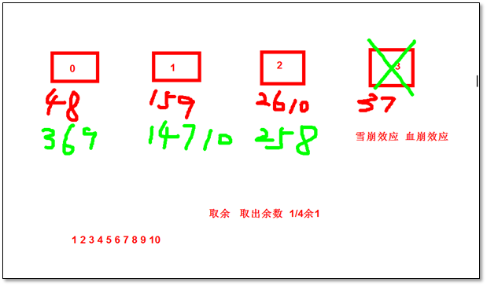
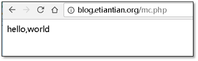
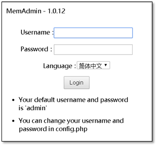
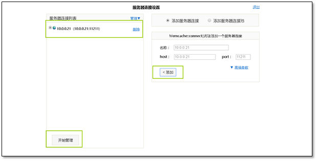
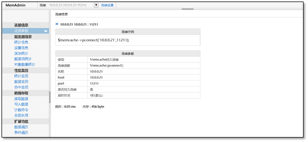
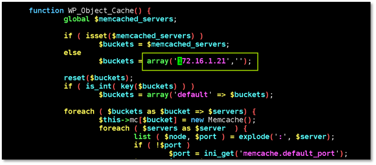

# 一、Memcached 缓存数据库应用实践


## 1.1 数据库对比

**缓存：** 将数据存储到内存中，只有当磁盘胜任不了的时候，才会启用缓存

缺点：断电数据丢失(双电)，用缓存存储数据的目的只是为了应付大并发的业务。

**数据库：** mysql(关系型数据库，能够保证数据一致性，保证数据不丢失，当因为功能太多，导致性能不高) ===数据参考

**缓存数据库：**  memcache redis(非关系型数据库，性能极高，但不保证数据完整性) === 业务的数据提供者

memcachedb 会将内存的数据写入到磁盘中

redis 主要工作场所是内存中，但是定期备份内存数据到硬盘

### 1.1.1 数据库的选择

　　数据存储，数据仓库选择mysql这种磁盘的数据库

　　高并发，业务大的应用选择memcache这种内存数据库

### 1.1.2 数据库分类

　　关系型数据库  mysql

　　非关系型数据库（NOSQL） memcached redis MongoDB

## 1.2 memcached介绍

​      Memcached是一款开源的、高性能的纯内存缓存服务软件。Mem是内存的意思，cache是缓存的意思，d是daemon的意思。

　　memcache 是项目名称，也是一款软件，其架构是**C/S** **架构**。

​       memcached官网：http://memcached.org/

### 1.2.1 memcache优点

①   对于用户来讲，用户访问网站更快了，体验更好了。

②对网站来说，数据库压力降低了。只有当内存没有数据时才会去请求数据库。第一次写入的数据也会请求数据库。一般公司没有预热，只有当用户读取过数据库才会放到Memcached中。

②   提升了网站的并发访问，减少服务器数量。

## 1.3 Memcached在企业中使用场景

### 1.3.1 作为数据库的前端缓存应用

　　　当数据库（mysql）承受不了大并发的请求时，可以将数据缓存到内存中（缓存数据库），然后就可以解决

​    　　作为数据库的前端缓存最大目的：减少数据库被大量访问的压力

### 1.3.2 作为集群后端的session会话保持

​    　  session存储在文件，数据库，memcache，或内存等的服务端上，

  　　 cookie  存放在客户端浏览器上。

  　　 session是一个存在服务器上的类似于一个散列表格的文件。里面存有我们需要的信息，在我们需要用的时候可以从里面取出来。

　　　**session** **依赖cookie** **存在**，请求客户端到达服务端后，服务端会随机生成一个字符串，作为该用户的标识，该字符串通过cookie返回给客户端，客户端浏览器会以该字符串为key放到session id里面，随机字符串的key里面可以先没有值。如果用户再次提交，请求信息中的用户名密码等用户信息保存在随机字符串的value中，请求到达服务端，用户名密码正确，随机字符串会被授权，提一个标记给到sessionid中的随机字符串的value中，证明该用户已经是登录状态，客户端再次带着该随机字符串访问服务端，服务端会知道该用户已经登录不需验证，直接返回请求的信息。

**session** **和cookie** **区别**

　　1、cookie数据存放在用户的浏览器上，session数据存储在服务器上

　　2、cookie在本地的浏览器中，可以被提取分析，安全性差。为了安全，登录账户等信息可以缓存在session中。

　　3、session会在一定时间内保存在服务器上，访问量增大会给服务器带来压力，可以使用缓存工具，如memcache等

### 1.3.3 网站开发如何判断用户信息

　　最开始的技术方法：服务器在你的浏览器中写一个cookies，这个cookies就包含了你的用户名及登录信息。因为cookies是存储在本地浏览器中，所以第三方工具很容易盗取cookies信息。

**最开始：**

​      cookies   cookies名字：内容（用户名，登录信息）

**改进后：**

​      本地浏览器存放：

​      cookies   cookies名字：内容（session id 编号）

​      服务器存放：

​      session   session id：内容（用户名，登录信息）

**主流使用场景：cookies + session**

### 1.3.4 session共享的不同解决方案

  　　 1、session文件提供NFS共享

 　　  2、session文件提供rsync  scp共享

  　　 3、将session的内容存放在数据库（mysql）中，所有的机器都可以通过ip：port读取

　   　4、将session的内容存放在缓存数据库中，所有的机器都可以通过ip：port读取

  　　 好处：利用断电、重启丢失数据的特性。定时清理数据；提高并发

### 1.3.5 memcache原理优点

　　启动Memcached吋，根据指定的内存大小参数，会被分配一个内存空间。当我们读取数据库的各类业务数据后，数据会同吋放入Memcached缓存中，，下一次用户请求同样的数据，程序直接去Memcached取数据返回给用户。

 优点：

　　①    对于用户来讲，用户访问网站更快了，体验更好了。

　　②   对网站来说，数据库压力降低了。只有当内存没有数据时才会去请求数据库。第一次写入的数据 也会请求数据库。一般公司没有预热，只有，用户读取过数据库才会放到Memcached中。

　　③   提升了网站的并发访问，减少服务器数最。

 

**原理图**

## 1.4 Memcached分布式缓存集群

　　memcached天生不支持分布式集群,需要通过程序支持分布式存储

### 1.4.1 Memcached分布式缓存集群的特点

  　　 1. 所有MC服务器内存的内容都是不一样的。这些服务器内容加起来接近数据库的容量。比如1T的数据库，一台缓存数据库的内存没有那么大，因此分成10台缓存服务器。

 　　  2. 通过在客户端(Web)程序或者MC的负载均衡器上用HASH算法，让同一内容都分配到一个MC服务器。

　　   3. 普通的HASH算法对于节点宕机会带来大量的数据流动(失效)，可能会引起雪崩效应。

 　　  4. 一致性HASH可以让节点宕机对节点的数据流动(失效)降到最低。

`普通的hash算法`

 

　　首先将key处理为一个32位字符串，取前8位，在经过hash计算处理成整数并返回，然后映射到其中一台服务器这样得到其中一台服务器的配置，利用这个配置完成分布式部署。在服务器数量不发生变化的情况下，普通hash分布可以很好的运作，当服务器的数量发生变化，问题就来了。试想，增加一台服务器，同一个key经过hash之后，与服务器取模的结果和没增加之前的结果肯定不一样，这就导致了，之前保存的数据丢失。

`一致性hash算法`

 

一致性哈希算法

　　优点：在分布式的cache缓存中，其中一台宕机，迁移key效率最高

　　将服务器列表进行排序，根据mHash($key) 匹配相邻服务器

**一致性hash算法**  **将数据流动降到最低**

参考资料

```
http://blog.csdn.net/cywosp/article/details/23397179
http://blog.csdn.net/zhangskd/article/details/50256111
```

## 2、Memcached使用

### 2.1 安装 memcached

#### 2.1.1 环境说明

```shell
[root@centos703 ~]# cat /etc/redhat-release 
CentOS Linux release 7.7.1908 (Core)
[root@centos703 ~]# uname -a
Linux centos703 3.10.0-1062.el7.x86_64 #1 SMP Wed Aug 7 18:08:02 UTC 2019 x86_64 x86_64 x86_64 GNU/Linux
systemctl disable firewalld
systemctl stop firewalld
sed -i 's/SELINUX=enforcing/SELINUX=disabled/' /etc/selinux/config 
setenforce 0
```

#### 2.1.2 安装memcached

```
[root@centos703 ~]# yum -y install memcached
```

#### 2.1.3 查看配置

```shell
[root@centos703 ~]# cat /etc/sysconfig/memcached 
PORT="11211" # 端口号
USER="memcached" # memcached的用户
MAXCONN="1024" # 最大连接数
CACHESIZE="64" # 缓存大小
OPTIONS=""
```

#### 2.1.4 查看启动脚本

```shell
[root@centos703 ~]# cat /usr/lib/systemd/system/memcached.service 
[Unit]
Description=Memcached 
Before=httpd.service
After=network.target

[Service]
Type=simple
EnvironmentFile=-/etc/sysconfig/memcached
ExecStart=/usr/bin/memcached -u $USER -p $PORT -m $CACHESIZE -c $MAXCONN $OPTIONS

[Install]
WantedBy=multi-user.target
```

#### 2.1.5 启动服务

```shell
[root@centos703 ~]# systemctl start memcached.service

[root@centos703 ~]# systemctl status memcached.service
● memcached.service - Memcached
   Loaded: loaded (/usr/lib/systemd/system/memcached.service; disabled; vendor preset: disabled)
   Active: active (running) since Thu 2019-10-17 04:40:53 EDT; 1min 9s ago
 Main PID: 11655 (memcached)
   CGroup: /system.slice/memcached.service
           └─11655 /usr/bin/memcached -u memcached -p 11211 -m 64 -c 1024

Oct 17 04:40:53 centos703 systemd[1]: Started Memcached.
```

### 2.2 管理memcached

### 2.2.1 memcached数据库语法格式

```
set              key   0        0           10

<command name>  <key> <flags> <exptime> <bytes>\r\n
```

>   \n 换行且光标移至行首
>
>   \r 光标移至行首，但不换行
>

| **参数**             | **说明**                                                     |
| -------------------- | ------------------------------------------------------------ |
| **<flags>**          | 是在取回内容时，与数据和发送块一同保存服务器上的任意16位无符号整形（用十进制来书写）。客户端可以用它作为“位域”来存储一些特定的信息；它对服务器是不透明的。 |
| **<exptime>**        | 是终止时间。如果为0，该项永不过期(虽然它可能被删除，以便为其他缓存项目腾出位置)。如果非0（Unix时间戳或当前时刻的秒偏移），到达终止时间后，客户端无法再获得这项内容 |
| **<bytes>**          | 是随后的数据区块的字节长度，不包括用于分页的“\r\n”。它可以是0（这时后面跟随一个空的数据区块）。 |
| **<data block>\r\n** | <data block> 是大段的8位数据，其长度由前面的命令行中的<bytes>指定。 |

### 2.2.2 数据库使用

写入读取数据

```
# 这里需要装一下nc工具： yum -y install nc
[root@centos703 ~]# printf "set key008 0 0 10\r\noldboy0987\r\n" | nc 192.168.122.102 11211
STORED

[root@centos703 ~]# printf "get key008\r\n"|nc 192.168.122.102 11211
VALUE key008 0 10
oldboy0987
END
```

写入数据长度不符合，定义过大

```
[root@centos703 ~]#  printf "set key009 0 0 11\r\noldboy0987\r\n"|nc 192.168.122.102 11211
[root@centos703 ~]# printf "get key009\r\n" | nc 192.168.122.102 11211
END
```

写入数据长度不符合，定义过小

```
[root@centos703 ~]#  printf "set key009 0 0 9\r\noldboy0987\r\n"|nc 192.168.122.102 11211
CLIENT_ERROR bad data chunk
ERROR
[root@centos703 ~]# printf "get key009\r\n"|nc 192.168.122.102 11211
END
```

时效性

```
[root@cache01 ~]# printf "set key011 0 10 10\r\noldboy0987\r\n"|nc 10.0.0.21 11211
STORED
[root@cache01 ~]# printf "get key011\r\n"|nc 10.0.0.21 11211
VALUE key011 0 10
oldboy0987
END
[root@cache01 ~]# printf "get key011\r\n"|nc 10.0.0.21 11211
END
```

删除数据

```
[root@cache01 ~]# printf "delete key008\r\n"|nc 10.0.0.21 11211
DELETED
[root@cache01 ~]# printf "get key008\r\n"|nc 10.0.0.21 11211
END
```

### 2.3 memcache php版本客户端安装使用

*命令集*

```shell
#编译进去php_mem
tar zxvf memcache-2.2.5.tgz
cd memcache-2.2.5

/application/php/bin/phpize
./configure --enable-memcache --with-php-config=/application/php/bin/php-config --with-zlib-dir

make
make install
# 激活php_memcached
sed -i '$a extension=memcache.so' /application/php/lib/php.ini
pkill php
/application/php/sbin/php-fpm -t
/application/php/sbin/php-fpm
/application/php/bin/php -m|grep memcache
```

检查当前环境

查看php的模块

 View Code 查看php的模块

**执行过程**

编译安装

```
[root@web06 memcache-2.2.5]# make install
Installing shared extensions:     /application/php-5.5.32/lib/php/extensions/no-debug-non-zts-20121212/
[root@web06 memcache-2.2.5]# ls /application/php/lib/php/extensions/no-debug-non-zts-20121212/
memcache.so
[root@web06 memcache-2.2.5]# sed -i '$a extension=memcache.so' /application/php/lib/php.ini
[root@web06 memcache-2.2.5]# pkill php
[root@web06 memcache-2.2.5]# /application/php/sbin/php-fpm -t
[17-Nov-2017 11:39:13] NOTICE: configuration file /application/php-5.5.32/etc/php-fpm.conf test is successful

[root@web06 memcache-2.2.5]# /application/php/sbin/php-fpm
[root@web06 memcache-2.2.5]# /application/php/bin/php -m|grep memcache
memcache
```

### 2.3.1 编写测试文件

```
[root@web01 blog]# cat /application/nginx/html/blog/mc.php
<?php
    $memcache = new Memcache;
    $memcache->connect('10.0.0.21', 11211) or die ("Could not connect");
    $memcache->set('key20171117', 'hello,world');
    $get_value = $memcache->get('key20171117');
    echo $get_value;
?>
```

浏览器访问

 

数据库读取测试

```
[root@cache01 ~]# printf "get key20171117 \r\n"|nc 10.0.0.21 11211 
VALUE key20171117 0 11
hello,world
END
```

### 2.4 web管理memcached

使用的软件memadmin

官网：http://www.junopen.com/memadmin/

将程序包放如站点目录，浏览器进行访问即可

```
[root@web06 tools]# tar xf memadmin-1.0.12.tar.gz -C /application/nginx/html/blog/
```

   默认用户名密码为admin

 

   添加一个新的memcached服务器

 

   web界面管理全中文，较为简单

 

### 2.5 memcached数据缓存

通过程序实现

### 2.5.1 blog站点实现memcached存储

```
[root@web06 ~]# cat /application/nginx/html/blog/wp-content/object-cache.php
```

 

### 2.6 memcached session共享

方法1：

　　通过程序实现，web01只需要往memcahce写session，web02从memcahce读session**（更具有通用性）**

方法2：

　　通过php的配置文件，让php默认将session存储在文件中，修改为存储在memcached中

```
sed -i 's#session.save_handler = files#session.save_handler = memcache#;$a session.save_path = "tcp://10.0.0.21:11211"' /application/php/lib/php.ini
```

　　使用这个功能，需要使用php的session函数

# 二、企业级Memcached部署(session共享)


## **服务端部署**

   ##### 安装依赖关系

​      Memcache用到了libevent这个库用于Socket的处理。

```shell
[root@centos703 ~]# yum install libevent libevent-devel nc -y
```

   ##### 安装memcache

```bash
[root@centos703 ~]# yum -y install memcached
[root@centos703 ~]# which memcached
/usr/bin/memcached
```

 ##### 启动memcached服务

```shell
[root@centos703 ~]# memcached -m 16m -p 11211 -d -u root -c 8192
[root@centos703 ~]# netstat -lntup |grep memca
tcp        0      0 0.0.0.0:11211           0.0.0.0:*               LISTEN      11655/memcached     
tcp6       0      0 :::11211                :::*                    LISTEN      11655/memcached     
udp        0      0 0.0.0.0:11211           0.0.0.0:*                           11655/memcached     
udp6       0      0 :::11211                :::*                                11655/memcached    
```

注：`memcached`可以同时启动多个实例，端口不一致即可。

```shell
[root@centos703 ~]# memcached -m 16m -p 11212 -d -u root -c 8192

[root@centos703 ~]# netstat -lntup |grep memca
tcp        0      0 0.0.0.0:11211           0.0.0.0:*               LISTEN      11655/memcached     
tcp        0      0 0.0.0.0:11212           0.0.0.0:*               LISTEN      11820/memcached     
tcp6       0      0 :::11211                :::*                    LISTEN      11655/memcached     
tcp6       0      0 :::11212                :::*                    LISTEN      11820/memcached     
udp        0      0 0.0.0.0:11211           0.0.0.0:*                           11655/memcached     
udp        0      0 0.0.0.0:11212           0.0.0.0:*                           11820/memcached     
udp6       0      0 :::11211                :::*                                11655/memcached     
udp6       0      0 :::11212                :::*                                11820/memcached     

```

　　　　参数说明：

| 参数   | 参数说明                                                  |
| ------ | --------------------------------------------------------- |
| **-m** | max memory to use for items in megabytes (default: 64 MB) |
| **-p** | TCP port number to listen on (default: 11211)             |
| **-d** | run as a daemon                                           |
| **-u** | assume identity of <username> (only when run as root)     |
| **-c** | max simultaneous connections (default: 1024)              |

   **第写入开机自启动**

```shell
[root@centos703 ~]# echo 'memcached -m 16m -p 11211 -d -u root -c 8192' >>/etc/rc.local

```

## **客户端部署**（web服务器）

   **安装PHP memcache扩展插件**

```

[root@centos703 tools]# tar xf latest 
[root@centos703 tools]# ls
latest  memcached-1.5.19

5 /application/php/bin/phpize
6 ./configure -enable-memcache --with-php-config=/application/php/bin/php-config
7 make && make install
```

*完整操作过程：*

```
[root@centos703]# mkdir -p /server/tools
[root@centos703]# cd /server/tools
[root@centos703 tools]# wget http://memcached.org/latest
[root@centos703 tools]# ls
latest

[root@web01 memcache-2.2.7]# /application/php/bin/phpize
Configuring for:
PHP Api Version:         20121113
Zend Module Api No:      20121212
Zend Extension Api No:   220121212
[root@web01 memcache-2.2.7]# ./configure -enable-memcache --with-php-config=/application/php/bin/php-config
[root@web01 memcache-2.2.7]# make && make install
```

**查看是否安装成功**

```
1 [root@web01 memcache-2.2.7]# ls -l /application/php/lib/php/extensions/no-debug-non-zts-20121212/
2 total 252
3 
4 -rwxr-xr-x 1 root root 258048 Nov  7 10:03 memcache.so
```

   *memcache.so**表示插件安装成功。*

配置memcache****客户端使其生效**

```
1 [root@web01 memcache-2.2.7]# cd /application/php/lib/
2 [root@web01 lib]# vim php.ini
3 ……
4 [root@web01 lib]# tail -2 php.ini
5 extension_dir = "/application/php/lib/php/extensions/no-debug-non-zts-20121212/"
6 extension = memcache.so
```

检测语法，重启服务

```
1 [root@web01 lib]# /application/php/sbin/php-fpm  -t
2 [07-Nov-2017 10:20:44] NOTICE: configuration file /application/php-5.5.32/etc/php-fpm.conf test is successful
```

重启服务 

```
1 killall php-fpm
2 killall php-fpm
3 /application/php/sbin/php-fpm
```

   浏览器*访问**phpinfo**页面出现memcache**信息表示配置成功*。

 

   **第四个里程碑：编写测试memcache****文件**

```
1 [root@web01 blog]# cat  test_memcache.php
2 <?php
3      $memcache = new Memcache;
4      $memcache->connect('172.16.1.31', 11211) or die ("Could not connect NFS server");
5      $memcache->set('key', 'Memcache connect OK');
6      $get = $memcache->get('key');
7      echo $get;
8 ?>
```

   *测试出现Memcache connect OK* *表示连接成功*

```
1 [root@web01 blog]# /application/php/bin/php   test_memcache.php 
2 Memcache connect OK
```

   **第五个里程碑：修改php****配置***(**设置session**共享)*

```
1 [root@web01 ~]# vim /application/php/lib/php.ini
```

*原配置*

```
1 session.save_handler = files
2 session.save_path = "/tmp"
```

**修改为：**

```
1 session.save_handler = memcache
2 session.save_path = "tcp://172.16.1.31:11211"
```

⚠修改完成之后要重启php服务

```
1 killall php-fpm
2 killall php-fpm
3 /application/php/sbin/php-fpm
```

*修改之前phpinfo**信息*


*修改之后phpinfo**信息*

 

到此企业级memcache(session共享)部署完毕

## Memcached在集群中session共享存储的优缺点

**优点：**

 　　 1）读写速度上会比普通文件files速度快很多。

   　　2）可以解决多个服务器共用session的难题。

**缺点：**

 　　  1）session数据都保存在memory中，持久化方面有所欠缺，但对session数据来说不是问题。

　　   2）一般是单台，如果部署多台，多台之间数据无法同步。通过hash算法分配依然有session丢失的问题。

**替代方案：**

　　   1）可以用其他的持久化系统存储session，例如redis，ttserver来替代memcached.

  　　 2)高性能并发场景,cookies效率比session要好很多,因此,大网站都会用cookies解决会话共享的问题.

　　   3)一些不好的方法:lvs-p,nginx  ip_hash,不推荐使用.

##  DedeCMS使用memcache问题

```
`问题:``    ``上述文件进行修改后,DedeCMS发现无法访问后台 http:``//www``.etiantia.org``/dede`
```

**解决办法:**

   修改文件一:

```
1 [root@web01 include]# pwd
2 /application/nginx/html/www/include
3 
4 [root@web01 include]# vim common.inc.php
5 135 //Session保存路径
6 136 $enkey = substr(md5(substr($cfg_cookie_encode,0,5)),0,10);
7 137 //$sessSavePath = DEDEDATA."/sessions_{$enkey}";
8 138 $sessSavePath = "tcp://172.16.1.31:11211";
9 139 if ( !is_dir($sessSavePath) ) mkdir($sessSavePath);
```

   修改文件二:

```
1 [root@web01 include]# vim vdimgck.php
2 24 $enkey = substr(md5(substr($cfg_cookie_encode,0,5)),0,10);
3 25 //$sessSavePath = DEDEDATA."/sessions_{$enkey}";
4 26 $sessSavePath = "tcp://172.16.1.31:11211";
5 27 if ( !is_dir($sessSavePath) ) mkdir($sessSavePath);
```

   让DedeCMS直接使用memcache的共享.解决问题.