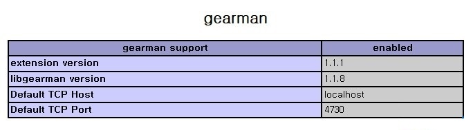
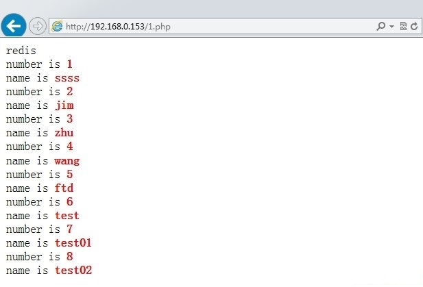

## redis 作为 mysql的缓存服务器(读写分离)

一、redis简介
Redis是一个key-value存储系统。和Memcached类似，为了保证效率，数据都是缓存在内存中。区别的是redis会周期性的把更新的数据写入磁盘或者把修改操作写入追加的记录文件，并且在此基础上实现了master-slave(主从)同步。在部分场合可以对关系数据库起到很好的补充作用。它提供了Java，C/C++(hiredis)，C#，PHP，JavaScript，Perl，Object-C，Python，Ruby等客户端，使用很方便。

二、架构图


大致结构就是读写分离，将mysql中的数据通过触发器同步到redis中


三、安装LNMP环境(这里为了省事，就是用yum来安装)

1、修改yum源

```
[iyunv@redis ~]# vim /etc/yum.repos.d/epel.repo    #添加这个文件
[epel]
name=Extra Packages for Enterprise Linux 6 - $basearch
baseurl=http://download.fedoraproject.org/pub/epel/6/$basearch
failovermethod=priority
enabled=1
gpgcheck=0

[nginx]
name=nginx repo
baseurl=http://nginx.org/packages/centos/6/$basearch/
gpgcheck=0
enabled=1
```

2、yum安装

```
[iyunv@redis ~]# yum -y install nginx php php-fpm php-cli php-common php-gd php-mbstring php-mysql php-pdo php-devel php-xmlrpc php-xml php-bcmath php-dba php-enchant mysql mysql-server
```

3、简单配置一下nginx

```
[iyunv@redis ~]# vim /etc/nginx/nginx.conf
server {
        listen       80;
        #定义使用www.xx.com访问
        server_name  www.xx.com;

        #设定本虚拟主机的访问日志
        access_log  /logs/www.xx.com.access.log  main;

        #默认请求
        location / {
          root   /www/;      #定义服务器的默认网站根目录位置
          index index.php index.html index.htm;   #定义首页索引文件的名称
        }
        location ~ \.php$ {
        root /www/;
        fastcgi_pass 127.0.0.1:9000;
        fastcgi_index index.php;
        fastcgi_param SCRIPT_FILENAME /www/$fastcgi_script_name;
        include fastcgi_params;
        }
    }
```

4、启动服务

```
[iyunv@redis ~]# sed -i 's/apache/nginx/g' /etc/php-fpm.d/www.conf
[iyunv@redis ~]# /etc/init.d/php-fpm start
正在启动 php-fpm：                                         [确定]

[iyunv@redis ~]# /etc/init.d/mysqld start
正在启动 mysqld：                                          [确定]

[iyunv@redis ~]# mkdir /{logs,www}
[iyunv@redis ~]# chown -R nginx:nginx /{logs,www}
[iyunv@redis ~]# /etc/init.d/nginx start
正在启动 nginx：                                           [确定]

[iyunv@redis www]# service iptables stop
iptables: Flushing firewall rules:                         [  OK  ]
iptables: Setting chains to policy ACCEPT: filter          [  OK  ]
iptables: Unloading modules:                               [  OK  ]

[iyunv@redis redis]# netstat -tnlp      #查看监听
Active Internet connections (only servers)
Proto Recv-Q Send-Q Local Address               Foreign Address             State       PID/Program name   
tcp        0      0 0.0.0.0:80                  0.0.0.0:*                   LISTEN      2101/nginx                   
tcp        0      0 127.0.0.1:9000              0.0.0.0:*                   LISTEN      7544/php-fpm        
tcp        0      0 0.0.0.0:3306                0.0.0.0:*                   LISTEN      1871/mysqld
```

5、给mysql授权

```
[iyunv@redis ~]# mysql
mysql> grant all privileges on *.* to root@localhost identified by '123456';

mysql> flush privileges;
```

6、测试

```
[iyunv@redis ~]# vim /www/index.php 
<?php
     phpinfo();
?>
```

然后访问页面看到php的相关信息，基础环境就算搭建完成了。

四、安装redis

1、安装redis

```
[iyunv@redis ~]# wget -c -t 0 http://download.redis.io/releases/redis-2.8.19.tar.gz
  
[iyunv@redis ~]# mkdir /usr/local/redis

[iyunv@redis ~]# tar xvf redis-2.8.19.tar.gz 
#安装很简单、直接make就可以了
[iyunv@redis ~]# cd redis-2.8.19
[iyunv@redis redis-2.8.19]# make 

#编译完成后，将src中的可执行文件拷贝到刚刚创建的目录中
[iyunv@redis src]# cp redis-benchmark redis-check-aof redis-check-dump redis-cli redis-sentinel redis-server /usr/local/redis/
[iyunv@redis redis-2.8.19]# cp redis.conf sentinel.conf /usr/local/redis/
```

Redis-benchmark      压力测试工具
Redis-check-aof      检查redis持久化命令文件的完整性
Redis-check-dump     检查redis持久化数据文件的完整性
Redis-cli            redis在linux上的客户端
Redis-sentinel       redis-sentinel是集群管理工具,主要负责主从切换。
Redis-server         Redis服务器的daemon启动程序

2、安装php的redis扩展

```
[iyunv@redis ~]# wget -c -t 0 https://github.com/owlient/phpredis/archive/master.zip
[iyunv@redis ~]# unzip master.zip

[iyunv@redis ~]# cd phpredis-master/
[iyunv@redis phpredis-master]# phpize 
[iyunv@redis phpredis-master]# ./configure --with-php-config=/usr/bin/php-config
[iyunv@redis phpredis-master]# make && make install 

#修改php的配置文件，如果没有“extension=redis.so”，就加上这一行
[iyunv@redis ~]# vim /etc/php.ini 
extension=redis.so

[iyunv@redis ~]# /etc/init.d/php-fpm restart
停止 php-fpm：                                             [确定]
正在启动 php-fpm：                                         [确定]
```

3、是否安装成功

还是访问phpinfo的那个界面


看到这个就是安装完成了。

五、读写分离
这里只是简单的做了一下读，没有写操作的相关代码，过一会测试，直接到数据库里执行update来模拟写操作。
1、在mysql中插入一些测试数据

```
[iyunv@redis ~]# mysql -u root -p123456
mysql> create database mytest;
mysql> CREATE TABLE `test` (`id` int(7) NOT NULL AUTO_INCREMENT, `name` char(8) DEFAULT NULL, PRIMARY KEY (`id`)) ENGINE=InnoDB AUTO_INCREMENT=10 DEFAULT CHARSET=utf8;
mysql> INSERT INTO `test` VALUES (1,'sven'),(2,'jim'),(3,'zhu'),(4,'wang'),(5,'ftd'),(6,'test'),(7,'test01'),(8,'test02'),(9,'test03');
mysql> select * from mytest.test;
+----+--------+
| id | name   |
+----+--------+
|  1 | sven   |
|  2 | jim    |
|  3 | zhu    |
|  4 | wang   |
|  5 | ftd    |
|  6 | test   |
|  7 | test01 |
|  8 | test02 |
|  9 | test03 |
+----+--------+
```

2、编写php的测试代码

```
<?php
        $redis = new Redis();
        $redis->connect('127.0.0.1',6379) or die ("could net connect redis server");
        $query = "select * from test limit 8";
        //为了简单一点，这里就读取了8条数据
        for ($key = 1; $key < 9; $key++)
        {
                if (!$redis->get($key))
                {
                        $connect = mysql_connect('127.0.0.1','root','123456');
                        mysql_select_db(mytest);
                        $result = mysql_query($query);
                        //如果没有找到$key,就将该查询sql的结果缓存到redis
                        while ($row = mysql_fetch_assoc($result))
                        {
                                $redis->set($row['id'],$row['name']);
                        }
                        $myserver = 'mysql';
                        break;
                }
                else
                {
                        $myserver = "redis";
                        $data[$key] = $redis->get($key);
                }
        }

        echo $myserver;
        echo "<br>";
        for ($key = 1; $key < 9; $key++)
        {
                echo "number is <b><font color=#FF0000>$key</font></b>";

                echo "<br>";

                echo "name is <b><font color=#FF0000>$data[$key]</font></b>";

                echo "<br>";
        }
?>
```

第一次访问，redis中没有对应的KEY时


再次访问，此时redis中已有相关数据


到这里，我们已经实现了redis作为mysql的缓存服务器，但是如果更新了mysql，redis中仍然会有对应的KEY，数据就不会更新，此时就会出现mysql和redis数据不一致的情况。所以接下来就要通过mysql触发器将改变的数据同步到redis中。

六、通过gearman实现同步

1、介绍

   Gearman是一个支持分布式的任务分发框架：
   Gearman Job Server：Gearman核心程序，需要编译安装并以守护进程形式运行在后台。
   Gearman Client：可以理解为任务的请求者。
   Gearman Worker：任务的真正执行者，一般需要自己编写具体逻辑并通过守护进程方式运行，Gearman Worker接收到Gearman Client传递的任务内容后，会按顺序处理。

大致流程：

下面要编写的mysql触发器，就相当于Gearman的客户端。修改表,插入表就相当于直接下发任务。然后通过lib_mysqludf_json UDF库函数将关系数据映射为JSON格式，然后在通过gearman-mysql-udf插件将任务加入到Gearman的任务队列中，最后通过redis_worker.php，也就是Gearman的worker端来完成redis数据库的更新。

2、安装启动

```
[iyunv@redis ~]# yum -y install gearmand libgearman-devel
[iyunv@redis ~]# /etc/init.d/gearmand start
正在启动 gearmand：                                        [确定]
[iyunv@redis ~]# /etc/init.d/gearmand status
gearmand (pid  7702) 正在运行...
```

3、安装php的gearman扩展

```
[iyunv@redis ~]# wget -c -t 0 https://pecl.php.net/get/gearman-1.1.1.tgz
  
[iyunv@redis ~]# tar xvf gearman-1.1.1.tgz 
[iyunv@redis ~]# cd gearman-1.1.1
[iyunv@redis gearman-1.1.1]# phpize 
[iyunv@redis gearman-1.1.1]# ./configure --with-php-config=/usr/bin/php-config
[iyunv@redis gearman-1.1.1]# make 
[iyunv@redis gearman-1.1.1]# make install

#如果php的配置文件中没有extension = gearman.so，就加上此行
[iyunv@redis ~]# vim /etc/php.ini 
extension = gearman.so
[iyunv@redis ~]# /etc/init.d/php-fpm restart
停止 php-fpm：                                             [确定]
正在启动 php-fpm：                                         [确定]
```



这样就是安装成功了

4、安装lib_mysqludf_json
lib_mysqludf_json UDF库函数将关系数据映射为JSON格式。通常，数据库中的数据映射为JSON格式，是通过程序来转换的。

```
[iyunv@redis ~]# wget -c -t 0 https://github.com/mysqludf/lib_mysqludf_json/archive/master.zip
[iyunv@redis ~]# unzip master.zip 
[iyunv@redis ~]# cd lib_mysqludf_json-master/
[iyunv@redis lib_mysqludf_json-master]# gcc $(mysql_config --cflags) -shared -fPIC -o lib_mysqludf_json.so lib_mysqludf_json.c
lib_mysqludf_json.c:40:23: 错误：my_global.h：没有那个文件或目录
lib_mysqludf_json.c:41:20: 错误：my_sys.h：没有那个文件或目录
lib_mysqludf_json.c:43:19: 错误：mysql.h：没有那个文件或目录
lib_mysqludf_json.c:44:21: 错误：m_ctype.h：没有那个文件或目录
lib_mysqludf_json.c:45:22: 错误：m_string.h：没有那个文件或目录

#这里编译报错是因为没有安装mysql的开发包，如果是源码安装的mysql，需要在/etc/ld.so.conf.d/
#目录下新建一个文件告诉系统mysql的头文件在哪里
[iyunv@redis lib_mysqludf_json-master]# yum -y install mysql-devel
[iyunv@redis lib_mysqludf_json-master]# gcc $(mysql_config --cflags) -shared -fPIC -o lib_mysqludf_json.so lib_mysqludf_json.c

mysql> show global variables like 'plugin_dir';
+---------------+-------------------------+
| Variable_name | Value                   |
+---------------+-------------------------+
| plugin_dir    | /usr/lib64/mysql/plugin |
+---------------+-------------------------+

#将模块拷贝到插件目录下
[iyunv@redis lib_mysqludf_json-master]# cp lib_mysqludf_json.so /usr/lib64/mysql/plugin/

#注册UDF函数
mysql> CREATE FUNCTION json_object RETURNS STRING SONAME 'lib_mysqludf_json.so';
```

5、安装gearman-mysql-udf
这个插件是用来管理调用 Gearman 的分布式的队列。 


6、编写mysql触发器(根据实际情况编写)

```
DELIMITER $$
CREATE TRIGGER datatoredis AFTER UPDATE ON test FOR EACH ROW BEGIN
    SET @RECV=gman_do_background('syncToRedis', json_object(NEW.id as `id`, NEW.name as `name`)); 
  END$$
DELIMITER ;
```

7、编写gearman的worker端

```
[iyunv@redis ~]# vim /www/redis_worker.php
<?php
$worker = new GearmanWorker();
$worker->addServer();
$worker->addFunction('syncToRedis', 'syncToRedis');

$redis = new Redis();
$redis->connect('127.0.0.1', 6379);

while($worker->work());
function syncToRedis($job)
{
        global $redis;
        $workString = $job->workload();
        $work = json_decode($workString);
        if(!isset($work->id)){
                return false;
        }
        $redis->set($work->id, $work->name);
}
?>

#后台运行
[iyunv@redis www]# nohup php redis_worker.php &
```

"$redis->set($work->id, $work->name);"这条语句就是将id作KEY和name作VALUE分开存储，需要和前面写的php测试代码的存取一致。

8、更新mysql中的数据

```
mysql> set @RECV = 1;
mysql> select @RECV;
+------+
| @RECV|
+------+
|    1 |
+------+
mysql> update test set name = 'ssss' where id = 1;
mysql> select @RECV;
+------+
| @RECV|
+------+
| NULL |
+------+
```

从返回值可以看到，触发器是触发成功的(这里的@RECV是上面mysql TIGGER的返回值)。我们在redis中查看数据：

```
[iyunv@redis redis]# ./redis-cli 
127.0.0.1:6379> get 1
"sven"
```

这里的数据居然没有变化，这是我们就要排错了。

设置完成以后，再次执行update，进入redis进行查看

```
127.0.0.1:6379> get 1
"ssss"
```

刷新一下刚刚的php界面



到这里就基本算是大功告成了，只要application将数据写到mysql中，mysql触发器检测到更新，就会通过Gearman将数据同步到redis中。然后读取的话，就直接从redis中进行读取。当然这只是个实验环境，实际上还有很多细节要调整。
