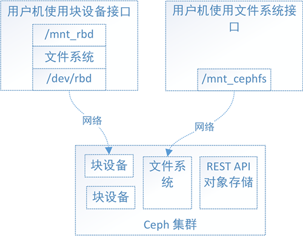
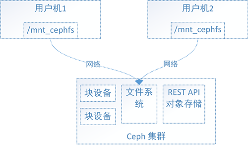
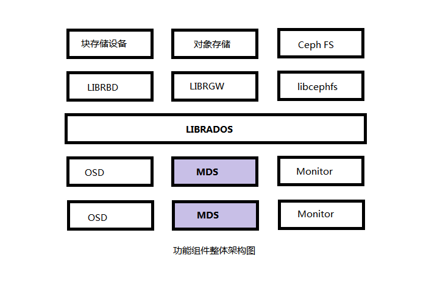
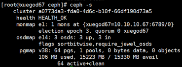

# 企业 Ceph 分布式存储架构


## 一、概述

​        Ceph是可靠的、可扩展的、统一的、开源分布式的存储系统。可以同时提供对象存RADOSGW（Reliable、Autonomic、Distributed、Object Storage Gateway）、块存储RBD（Rados Block Device）、文件系统存储Ceph FS（Ceph Filesystem）3种功能。  

　　Ceph是一个开源的分布式文件系统。因为它还支持块存储、对象存储，所以很自然的被用做云计算框架openstack或cloudstack整个存储后端。当然也可以单独作为存储，例如部署一套集群作为对象存储、SAN存储、NAS存储等。

　　ceph官方文档 http://docs.ceph.org.cn/
　　ceph中文开源社区 http://ceph.org.cn/

### 1、Ceph支持

#### 1、Ceph的块设备存储接口

**首先，什么是块设备？**

块设备是i/o设备中的一类，是将信息存储在固定大小的块中，每个块都有自己的地址，还可以在设备的任意位置读取一定长度的数据。看不懂？那就暂且认为块设备就是硬盘或虚拟硬盘吧。

查看下Linux环境中的设备：

```
[root@seph ~] ls /dev/
/dev/sda/ dev/sda1 /dev/sda2 /dev/sdb /dev/sdb1 /dev/hda 
/dev/rbd1 /dev/rbd2 …
```

**上面的/dev/sda、/dev/sdb和/dev/hda都是块设备文件，这些文件是怎么出现的呢？**

当给计算机连接块设备（硬盘）后，系统检测的有新的块设备，该类型块设备的驱动程序就在/dev/下创建个对应的块设备设备文件，用户就可以通过设备文件使用该块设备了。

**它们怎么有的叫 sda？有的叫 sdb？有的叫 hda？**

以sd开头的块设备文件对应的是SATA接口的硬盘，而以hd开头的块设备文件对应的是IDE接口的硬盘。那SATA接口的硬盘跟IDE接口的硬盘有啥区别？你只需要知道，IDE接口硬盘已经很少见到了，逐渐被淘汰中，而SATA接口的硬盘是目前的主流。而sda和sdb的区别呢？当系统检测到多个SATA硬盘时，会根据检测到的顺序对硬盘设备进行字母顺序的命名。PS：系统按检测顺序命名硬盘会导致了**盘符漂移**的问题。

**怎么还有的叫 rbd1 和 rbd2 呢?**

被你发现了，rbd*就是我们压轴主角了。rbd*就是由Ceph集群提供出来的块设备。可以这样理解，sda和hda都是通过数据线连接到了真实的硬盘，而rbd是通过网络连接到了Ceph集群中的一块存储区域，往rbd设备文件写入数据，最终会被存储到Ceph集群的这块区域中。

那么块设备怎么用呢？这里举个例子：

```
打个比方，一个块设备是一个粮仓，数据就是粮食。农民伯伯可以存粮食（写数据）了，需要存100斤玉米，粮仓（块设备）这么大放哪里呢，就挨着放（顺序写）吧。又需要存1000斤花生，还是挨着放吧。又需要存……

后来，农民伯伯来提粮食（读数据）了，他当时存了1000斤小麦，哎呀妈呀，粮仓这么大，小麦在哪里啊？仓库管理员找啊找，然后哭晕在了厕所……

新管理员到任后，想了个法子来解决这个问题，用油漆把仓库划分成了方格状，并且编了号，在仓库门口的方格那挂了个黑板，当农民伯伯来存粮食时，管理员在黑板记录，张三存了1000斤小麦在xx方格处。后来，农民伯伯张三来取粮食时，仓库管理员根据小黑板的记录很快提取了粮食。
```

故事到此为止了，没有方格和黑板的仓库（块设备）称为**裸设备**。由上例可见，裸设备对于用户使用是很不友好的，直接导致了旧仓库管理员的狗带。例子中划分方格和挂黑板的过程其实是在块设备上构建文件系统的过程，文件系统可以帮助块设备对存储空间进行条理的组织和管理，于是新管理员通过文件系统（格子和黑板）迅速找到了用户（农民伯伯张三）存储的数据（1000斤小麦）。针对多种多样的使用场景，衍生出了很多的文件系统。有的文件系统能够提供更好的读性能，有的文件系统能提供更好的写性能。我们平时常用的文件系统如xfs、ext4是读写性能等各方面比较均衡的通用文件系统。

**能否直接使用不含有文件系统块设备呢？**

可以的，xfs和ext4等通用的文件系统旨在满足大多数用户的存储需求，所以在数据存储的各方面的性能比较均衡。然而，很多应用往往并不需要这种均衡，而需要突出某一方面的性能，如小文件的存储性能。此时，xfs、ext4等通用文件系统如果不能满足应用的需求，应用往往会在裸设备上实现自己的数据组织和管理方式。简单的说，就是应用为了强化某种存储特性而实现自己定制的数据组织和管理方式，而不使用通用的文件系统。

**Ceph块设备接口怎么使用？**

在Ceph集群中创建块设备：

```
// 保证/etc/ceph目录下有Ceph集群的配置文件ceph.conf和ceph.client.admin.keyring 
rbd create -s 1G myrbd
在用户机上挂载该Ceph块设备，可以理解为往用户机上插入硬盘：
rbdmap myrbd
// 输出: 
/dev/rbd1
```

将Ceph块设备格式化成文件系统并挂载：

```
mkfs.xfs /dev/rbd1
mkdir -p /mnt/ceph_rbd
mount /dev/rbd1 /mnt/ceph_rbd
```

**通过/mnt/ceph_rbd读写数据，都是在读写Ceph集群中该块设备对应的存储区域**

总结一下，块设备可理解成一块硬盘，用户可以直接使用不含文件系统的块设备，也可以将其格式化成特定的文件系统，由文件系统来组织管理存储空间，从而为用户提供丰富而友好的数据操作支持。

#### 2、Ceph的文件系统存储接口

**什么是Ceph的文件系统接口？**

还记得上面说的块设备上的文件系统吗，用户可以在块设备上创建xfs文件系统，也可以创建ext4等其他文件系统。如图1，Ceph集群实现了自己的文件系统来组织管理集群的存储空间，用户可以直接将Ceph集群的文件系统挂载到用户机上使用。



​                                                                 图1 Ceph的块设备接口和文件系统接口对比

**Ceph有了块设备接口，在块设备上完全可以构建一个文件系统，那么Ceph为什么还需要文件系统接口呢？**

主要是因为应用场景的不同，Ceph的块设备具有优异的读写性能，但不能多处挂载同时读写，目前主要用在OpenStack上作为虚拟磁盘，而Ceph的文件系统接口读写性能较块设备接口差，但具有优异的共享性。

PS：想了解更多？快去查查**SAN**和**NAS**。

**为什么Ceph的块设备接口不具有共享性，而Ceph的文件系统接口具有呢？**

对于Ceph的块设备接口，如图2，文件系统的结构状态是维护在**各用户机内存**中的，假设Ceph块设备同时挂载到了用户机1和用户机2，当在用户机1上的文件系统中写入数据后，更新了用户机1的内存中文件系统状态，最终数据存储到了Ceph集群中，但是此时用户机2内存中的文件系统并不能得知底层Ceph集群数据已经变化而维持数据结构不变，因此用户无法从用户机2上读取用户机1上新写入的数据。

对于Ceph的文件系统接口，如图3，文件系统的结构状态是维护在远端Ceph集群中的，Ceph文件系统同时挂载到了用户机1和用户机2，当往用户机1的挂载点写入数据后，远端Ceph集群中的文件系统状态结构随之更新，当从用户机2的挂载点访问数据时会去远端Ceph集群取数据，由于远端Ceph集群已更新，所有用户机2能够获取最新的数据。


​                                                                             图2  Ceph块设备接口共享性



​                                                                           图3  Ceph文件系统接口共享性

**Ceph的文件系统接口使用方式?**

将Ceph的文件系统挂载到用户机目录

```
/* 保证/etc/ceph目录下有Ceph集群的配置文件ceph.conf和ceph.client.admin.keyring */
mkdir -p /mnt/ceph_fuse 
ceph-fuse /mnt/ceph_fuse
```

**大功告成，在/mnt/ceph_fuse下读写数据，都是读写远程Ceph集群**

总结一下，Ceph的文件系统接口弥补了Ceph的块设备接口在共享性方面的不足，Ceph的文件系统接口符合POSIX标准，用户可以像使用本地存储目录一样使用Ceph的文件系统的挂载目录。还是不懂？这样理解吧，无需修改你的程序，就可以将程序的底层存储换成空间无限并可多处共享读写的Ceph集群文件系统。

#### 3、Ceph的对象存储接口

**首先，通过图4来看下对象存储接口是怎么用的？**

简单了说，使用方式就是通过http协议上传下载删除对象（文件即对象）。


 **老问题来了，有了块设备接口存储和文件系统接口存储，为什么还整个对象存储呢?**

往简单了说，Ceph的块设备存储具有优异的存储性能但不具有共享性，而Ceph的文件系统具有共享性然而性能较块设备存储差，为什么不权衡一下存储性能和共享性，整个具有共享性而存储性能好于文件系统存储的存储呢，对象存储就这样出现了。

**对象存储为什么性能会比文件系统好？**

原因是多方面的，主要原因是对象存储组织数据的方式相对简单，只有bucket和对象两个层次（对象存储在bucket中），对对象的操作也相对简单。而文件系统存储具有复杂的数据组织方式，目录和文件层次可具有无限深度，对目录和文件的操作也复杂的多，因此文件系统存储在维护文件系统的结构数据时会更加繁杂，从而导致文件系统的存储性能偏低。

```
存储空间（Bucket）所谓的桶
存储空间是您用于存储对象（Object）的容器，所有的对象都必须隶属于某个存储空间。您可以设置和修改存储空间属性用来控制地域、访问权限、生命周期等，这些属性设置直接作用于该存储空间内所有对象，因此您可以通过灵活创建不同的存储空间来完成不同的管理功能。

同一个存储空间的内部是扁平的，没有文件系统的目录等概念，所有的对象都直接隶属于其对应的存储空间。
每个用户可以拥有多个存储空间
存储空间的名称在 OSS 范围内必须是全局唯一的，一旦创建之后无法修改名称。
存储空间内部的对象数目没有限制。

存储空间的命名规范如下：
只能包括小写字母、数字和短横线（-）。
必须以小写字母或者数字开头和结尾。
长度必须在3-63字节之间
```

**Ceph的对象存储接口怎么用呢？**

Ceph的对象接口符合亚马逊S3接口标准和OpenStack的Swift接口标准，可以自行学习这两种接口。

总结一下，文件系统存储具有复杂的数据组织结构，能够提供给用户更加丰富的数据操作接口，而对象存储精简了数据组织结构，提供给用户有限的数据操作接口，以换取更好的存储性能。对象接口提供了REST API，非常适用于作为web应用的存储。

#### 4、总结

概括一下，块设备速度快，对存储的数据没有进行组织管理，但在大多数场景下，用户数据读写不方便（以块设备**位置offset + 数据的length**来记录数据位置，读写数据）。而在块设备上构建了文件系统后，文件系统帮助块设备组织管理数据，数据存储对用户更加友好（以**文件名**来读写数据）。Ceph文件系统接口解决了“Ceph块设备+本地文件系统”不支持多客户端共享读写的问题，但由于文件系统结构的复杂性导致了存储性能较Ceph块设备差。对象存储接口是一种折中，保证一定的存储性能，同时支持多客户端共享读写。

### 2、Ceph 优点

　　1、统一存储
　　　　虽然ceph底层是一个分布式文件系统，但由于在上层开发了支持对象和块的接口。所以在开源存储软件中，能够一统江湖。至于能不能千秋万代，就不知了。

　　2、高扩展性
　　　　扩容方便、容量大。能够管理上千台服务器、EB级的容量。

　　3、可靠性强
　　　　支持多份强一致性副本，EC。副本能够垮主机、机架、机房、数据中心存放。所以安全可靠。存储节点可以自管理、自动修复。无单点故障，容错性强。

　　4、高性能
　　　　因为是多个副本，因此在读写操作时候能够做到高度并行化。理论上，节点越多，整个集群的IOPS和吞吐量越高。另外一点ceph客户端读写数据直接与存储设备(osd) 交互。

### 3、Ceph应用场景

Ceph可以提供对象存储、块设备存储和文件系统服务，其对象存储可以对接网盘（owncloud）应用业务等；其块设备存储可以对接（IaaS），当前主流的IaaS运平台软件，如：OpenStack、CloudStack、Zstack、Eucalyptus等以及kvm等。

### 4、ceph功能组件



#### Ceph各组件介绍

**OSD（Object Storage Device）：** Ceph OSD 守护进程（ Ceph OSD ）的功能是存储数据，处理数据的复制、恢复、回填、再均衡，并通过检查其他OSD 守护进程的心跳来向 Ceph Monitors 提供一些监控信息。当 Ceph 存储集群设定为有2个副本时，至少需要2个 OSD 守护进程，集群才能达到 active+clean 状态（ Ceph 默认有3个副本，但你可以调整副本数）。
**Monitor：** Ceph Monitor维护着展示集群状态的各种图表，包括监视器图、 OSD 图、归置组（ PG ）图、和 CRUSH 图。 Ceph 保存着发生在Monitors 、 OSD 和 PG上的每一次状态变更的历史信息（称为 epoch ）。
**MDS（Metadata Server）：**Ceph 元数据服务器（ MDS ）为 Ceph 文件系统存储元数据（也就是说，Ceph 块设备和 Ceph 对象存储不使用MDS ）。元数据服务器使得 POSIX 文件系统的用户们，可以在不对 Ceph 存储集群造成负担的前提下，执行诸如 ls、find 等基本命令。

### 5、Ceph架构


1）基础存储系统 RADOS
RADOS：可靠自主分布式对象存储。它是ceph存储的基础，保证一切都以对象形式存储。
2） 基础库LIBRADOS
LIBADOS：功能是对RADOS进行抽象和封装，并向上层提供API，以便直接基于RADOS进行应用开发。

## 二、Ceph实验集群部署

###  1. 主机准备 (CentOS7  禁用selinux, 关闭防火墙)

```shell
ceph01 　　 192.168.11.128 　　 admin,osd, mon   作为管理和监控节点
ceph02 　　 192.168.11.129 　　 osd,mds
ceph03 　　 192.168.11.130 　　 osd,mds
ceph04 　　 192.168.11.131 　　 client
```

　　#ceph01作管理. osd. mon节点;   ceph02和ceph03作osd mds;  ceph04客户端
　　前三台服务器增加一块硬盘/dev/sdb实验, 创建目录并挂载到/var/local/osd{0,1,2}

```shell
[root@ceph01 ~]# mkfs.xfs  /dev/vdb
[root@ceph01 ~]# mkdir -p /var/local/osd0
[root@ceph01 ~]# mount /dev/vdb  /var/local/osd0/
[root@ceph02 ~]# mkfs.xfs  /dev/vdb
[root@ceph02 ~]# mkdir -p /var/local/osd1
[root@ceph02 ~]# mount /dev/vdb  /var/local/osd1/
[root@ceph03 ~]# mkfs.xfs  /dev/vdb
[root@ceph03 ~]# mkdir -p /var/local/osd2
[root@ceph03 ~]# mount /dev/vdb  /var/local/osd2/
```

### 2. 编辑hosts文件

(规范系统主机名添加hosts文件实现集群主机名与主机名之间相互能够解析（host 文件添加主机名不要使用fqdn方式）可用hostnamectl set-hostname name设置
分别打开各节点的/etc/hosts文件，加入这四个节点ip与名称的对应关系

```shell
192.168.11.128 　　 ceph01
192.168.11.129 　　 ceph02
192.168.11.130 　　 ceph03
192.168.11.131 　　 ceph04
```

SSH免密码登录（多机互信）
在管理节点使用ssh-keygen 生成ssh keys 发布到各节点

```shell
[root@ceph01 ~]# ssh-keygen 				#所有的输入选项都直接回车生成。
[root@ceph01 ~]# ssh-copy-id ceph01
[root@ceph01 ~]# ssh-copy-id ceph02
[root@ceph01 ~]# ssh-copy-id ceph03
[root@ceph01 ~]# ssh-copy-id ceph04
```

### 3. 管理节点安装ceph-deploy工具

第一步：增加 yum配置文件（各个节点都需要增加yum源）

```shell
[root@ceph01 ~]#vim /etc/yum.repos.d/ceph.repo
 
添加以下内容：(ceph国内阿里源)
[Ceph-SRPMS]
name=Ceph SRPMS packages
baseurl=https://mirrors.aliyun.com/ceph/rpm-jewel/el7/SRPMS/
enabled=1
gpgcheck=0
type=rpm-md
 
[Ceph-aarch64]
name=Ceph aarch64 packages
baseurl=https://mirrors.aliyun.com/ceph/rpm-jewel/el7/aarch64/
enabled=1
gpgcheck=0
type=rpm-md
 
[Ceph-noarch]
name=Ceph noarch packages
baseurl=https://mirrors.aliyun.com/ceph/rpm-jewel/el7/noarch/
enabled=1
gpgcheck=0
type=rpm-md
 
[Ceph-x86_64]
name=Ceph x86_64 packages
baseurl=https://mirrors.aliyun.com/ceph/rpm-jewel/el7/x86_64/
enabled=1
gpgcheck=0
 
第二步：更新软件源并安装ceph-deploy 管理工具
[root@ceph01 ~]# yum clean all && yum list
[root@ceph01 ~]# yum -y install ceph-deploy
```

### 4.创建monitor服务

```shell
[root@ceph01 ~]# mkdir /etc/ceph && cd /etc/ceph
[root@ceph01 ceph]#  ceph-deploy new ceph01    #mon安装在ceph01节点
[root@ceph01 ceph]# ls                                #生成配置文件在当前目录下
ceph.conf  ceph.log  ceph.mon.keyring
Ceph配置文件、一个monitor密钥环和一个日志文件
```

### 5.修改副本数

```shell
[root@ceph01 ceph]# vim ceph.conf 配置文件的默认副本数从3改成2，这样只有两个osd也能达到active+clean状态，把下面这行加入到[global]段（可选配置）
[global]
fsid = 92f5581d-79d2-4c9f-a523-4965eedc846b
mon_initial_members = ceph01
mon_host = 192.168.11.128
auth_cluster_required = cephx
auth_service_required = cephx
auth_client_required = cephx
osd_pool_default_size = 2
```

### 6.在ceph01执行安装所有节点ceph

(如果网络源安装失败，手工安装epel-release 然后安装 yum –y install ceph-release 再 yum –y install ceph ceph-radosgw)

```shell
[root@ceph01 ceph]# ceph-deploy install ceph01 ceph02 ceph03 ceph04
安装ceph monitor
[root@ceph01 ceph]# ceph-deploy mon create ceph01
收集节点的keyring文件
[root@ceph01 ceph]# ceph-deploy gatherkeys ceph01
```

### 7.部署osd服务

添加osd节点 (所有osd节点执行)

我们实验准备时已经创建目录/var/local/osd{id}

### 8.创建激活osd

```shell
#创建osd 
[root@ceph01 ceph]# ceph-deploy osd prepare ceph01:/var/local/osd0 ceph02:/var/local/osd1 ceph03:/var/local/osd2
#添加权限
[root@ceph01 ~]# chown -R ceph.ceph /var/local/osd0/
[root@ceph02 ~]# chown -R ceph.ceph /var/local/osd1/
[root@ceph03 ~]# chown -R ceph.ceph /var/local/osd2/
#激活osd 
[root@ceph01 ceph]# ceph-deploy osd activate ceph01:/var/local/osd0 ceph02:/var/local/osd1 ceph03:/var/local/osd2
```


```shell
查看状态：
[root@ceph01 ceph]# ceph-deploy osd list ceph01 ceph02 ceph03
```

### 9.统一配置

```shell
（用ceph-deploy把配置文件和admin密钥拷贝到所有节点，这样每次执行Ceph命令行时就无需指定monitor地址和ceph.client.admin.keyring了）
[root@ceph01 ceph]# ceph-deploy admin ceph01 ceph02 ceph03
 
各节点修改ceph.client.admin.keyring权限：

[root@ceph01 ceph]#chmod +r /etc/ceph/ceph.client.admin.keyring
```

### 10.查看osd状态

```shell
[root@ceph01 ceph]# ceph health 或 ceph -s
HEALTH_OK
```

### 11.部署mds服务

```shell
[root@ceph01 ceph]# ceph-deploy mds create ceph02 ceph03 #我们MDS安装2台
[root@ceph01 ceph]# ceph mds stat #查看状态
```

### 12.集群状态

```shell
[root@ceph01 ceph]# ceph -s
```



以上基本上完成了ceph存储集群的搭建。  

##  三 、创建ceph文件系统

```shell
[root@ceph01 ceph]# ceph fs ls   #创建之前
No filesystems enabled
创建存储池
[root@ceph01 ceph]# ceph osd pool create cephfs_data <pg_num> 
[root@ceph01 ceph]# ceph osd pool create cephfs_metadata <pg_num>
```

其中：**<pg_num> = 128 ,**
关于创建存储池
确定 pg_num 取值是强制性的，因为不能自动计算。下面是几个常用的值：
　　*少于 5 个 OSD 时可把 pg_num 设置为 128
　　*OSD 数量在 5 到 10 个时，可把 pg_num 设置为 512
　　*OSD 数量在 10 到 50 个时，可把 pg_num 设置为 4096
　　*OSD 数量大于 50 时，你得理解权衡方法、以及如何自己计算 pg_num 取值
　　*自己计算 pg_num 取值时可借助 pgcalc 工具
随着 OSD 数量的增加，正确的 pg_num 取值变得更加重要，因为它显著地影响着集群的行为、以及出错时的数据持久性（即灾难性事件导致数据丢失的概率）。 

### 1. 创建文件系统

创建好存储池后，你就可以用 fs new 命令创建文件系统了

```shell
[root@ceph01 ceph]# ceph fs new <fs_name> cephfs_metadata cephfs_data 
其中：<fs_name> = cephfs  可自定义
 
[root@ceph01 ceph]# ceph fs ls              #查看创建后的cephfs
[root@ceph01 ceph]# ceph mds stat          #查看mds节点状态
e6: 1/1/1  up  {0=ceph03=up:active}, 1  up:standby
active是活跃的，另1个是处于热备份的状态
```

### 2.挂载Ceph文件系统

有不同挂载方式

#### A.内核驱动挂载Ceph文件系统

```shell
[root@ceph04 ceph]# mkdir /opt #创建挂载点
存储密钥（如果没有在管理节点使用ceph-deploy拷贝ceph配置文件）
[root@ceph04 ceph]# cat /etc/ceph/ceph.client.admin.keyring
[client.admin]
	key = AQC9+c9cW7snMBAAJ/vKwhiU6v2sbIMrtYuPbA==
将key对应的值复制下来保存到文件：/etc/ceph/admin.secret中。
注意：
/etc/ceph/admin.secret中只保留key的值
[root@ceph04 ceph]# cat/etc/ceph/admin.secret
AQC9+c9cW7snMBAAJ/vKwhiU6v2sbIMrtYuPbA==

挂载
[root@ceph04 ceph]# mount -t ceph 192.168.11.128:6789:/ /opt -o name=admin,secretfile=/etc/ceph/admin.secret
取消挂载
[root@ceph04 ceph]# umount /opt
```

#### B.用户控件挂载Ceph文件系统

```shell
安装ceph-fuse
[root@ceph04 ceph]# yum install -y ceph-fuse

挂载ceph时记得添加keyring，本机添加的是/etc/ceph/ceph.client.admin.keyring:(复制主节点/etc/ceph/ceph.client.admin.keyring)
[client.admin]
    key = xxxxxxxxxxxxxxx
然后通过ceph-fuse挂载:
挂载
[root@ceph04 ceph]# ceph-fuse -m 192.168.11.128:6789 /opt
取消挂载
[root@ceph04 ceph]# fusermount -u /opt
```

　　ceph在开源社区还是比较热门的，但是更多的是应用于云计算的后端存储。所以大多数在生产环境中使用ceph的公司都会有专门的团队对ceph进行二次开发，ceph的运维难度也比较大。但是经过合理的优化之后，ceph的性能和稳定性都是值得期待的。

关于其他：
　　清理机器上的ceph相关配置：
　　停止所有进程： stop ceph-all
　　卸载所有ceph程序：ceph-deploy uninstall [{ceph-node}]
　　删除ceph相关的安装包：ceph-deploy purge {ceph-node} [{ceph-data}]
　　删除ceph相关的配置：ceph-deploy purgedata {ceph-node} [{ceph-data}]
　　删除key：ceph-deploy forgetkeys

　　卸载ceph-deploy管理：yum -y remove ceph-deploy

## 附录：集群维护常用命令概览

### 1：检查集群健康状况

启动集群后、读写数据前，先检查下集群的健康状态。你可以用下面的命令检查：

ceph health   或者 ceph health detail （输出信息更详细）

要观察集群内正发生的事件，打开一个新终端，然后输入：

ceph -w

输出信息里包含：

集群唯一标识符

集群健康状况

监视器图元版本和监视器法定人数状态

OSD 版本和 OSD 状态摘要

其内存储的数据和对象数量的粗略统计，以及数据总量等。

 

新版本新增选项如下：

  -s, --status          show cluster status

  -w, --watch           watch live cluster changes

  --watch-debug         watch debug events

  --watch-info          watch info events

  --watch-sec           watch security events

  --watch-warn          watch warn events

  --watch-error         watch error events

  --version, -v         display version

  --verbose             make verbose

  --concise             make less verbose

使用方法演示：

ceph -w --watch-info

### 2：检查集群的使用情况

检查集群的数据用量及其在存储池内的分布情况，可以用 df 选项，它和 Linux 上的 df 相似。如下：

ceph df

输出的 GLOBAL 段展示了数据所占用集群存储空间的概要。

SIZE: 集群的总容量；

AVAIL: 集群的空闲空间总量；

RAW USED: 已用存储空间总量；

% RAW USED: 已用存储空间比率。用此值参照 full ratio 和 near full \ ratio 来确保不会用尽集群空间。

详情见存储容量。

输出的 POOLS 段展示了存储池列表及各存储池的大致使用率。没有副本、克隆品和快照占用情况。例如，如果你把 1MB 的数据存储为对象，理论使用率将是 1MB ，但考虑到副本数、克隆数、和快照数，实际使用率可能是 2MB 或更多。

NAME: 存储池名字；

ID: 存储池唯一标识符；

USED: 大概数据量，单位为 KB 、 MB 或 GB ；

%USED: 各存储池的大概使用率；

Objects: 各存储池内的大概对象数。

新版本新增ceph osd df  命令，可以详细列出集群每块磁盘的使用情况，包括大小、权重、使用多少空间、使用率等等

 

### 3：检查集群状态

要检查集群的状态，执行下面的命令：:

ceph status

 

### 4：检查MONITOR状态

查看监视器图，执行下面的命令：:

ceph mon stat

或者：

ceph mon dump

要检查监视器的法定人数状态，执行下面的命令：

ceph quorum_status

### 5：检查 MDS 状态:

元数据服务器为 Ceph 文件系统提供元数据服务，元数据服务器有两种状态： up | \ down 和 active | inactive ，执行下面的命令查看元数据服务器状态为 up 且 active ：

ceph mds stat

要展示元数据集群的详细状态，执行下面的命令：

ceph mds dump

 

### 6：集群命令详解

#### 1、mon 相关

##### 1：查看mon的状态信息

[root@ceph01~]# ceph mon stat

 

##### 2：查看mon的选举状态

[root@ceph01~]# ceph quorum_status

 

##### 3：查看mon的映射信息

[root@ceph01~]# ceph mon dump

 

##### 4：删除一个mon节点

[root@ceph01~]# ceph mon remove cs1

 

##### 5：获得一个正在运行的mon map，并保存在1.txt文件中

[root@ceph01~]# ceph mon getmap -o 1.txt

 

##### 6：读取上面获得的map

[root@ceph01~]# monmaptool --print 1.txt 

 

##### 7：把上面的mon map注入新加入的节点

[root@ceph01~]# ceph-mon -i nc3 --inject-monmap 1.txt

 

##### 8：查看mon的amin socket

[root@ceph01~]# ceph-conf --name mon.nc3 --show-config-value admin_socket

  

##### 9：查看ceph mon log日志所在的目录

[root@ceph01~]# ceph-conf --name mon.nc1 --show-config-value log_file    

/var/log/ceph/ceph-mon.nc1.log

 

##### 10：查看一个集群ceph-mon.nc3参数的配置

输出信息特别详细，集群所有配置生效可以在此参数下确认

[root@ceph01~]# ceph --admin-daemon /var/run/ceph/ceph-mon.nc3.asok config show | less


#### 2、msd 相关 

##### 1：查看msd状态

[root@ceph01~]# ceph mds stat

 

##### 2：删除一个mds节点

[root@ceph01~]# ceph  mds rm 0 mds.nc1

 

##### 3：设置mds状态为失败

[root@ceph01~]# ceph mds rmfailed <int[0-]>   

 

##### 4：新建pool 

[root@ceph01~]# ceph mds add_data_pool <poolname>

 

##### 5：关闭mds集群

[root@ceph01~]# mds cluster_down

 

##### 6：启动mds集群

[root@ceph01~]# mds cluster_up

 

##### 7：设置cephfs文件系统存储方式最大单个文件尺寸

[root@ceph01~]# ceph mds set max_file_size 1024000000000

 

#### 3、清除 cephfs 文件系统步骤 

强制mds状态为featrue

[root@ceph01~]# ceph mds fail 0

删除mds文件系统

[root@ceph01~]# ceph fs rm leadorfs --yes-i-really-mean-it

\#删除fs数据文件夹

[root@ceph01~]# ceph osd pool delete cephfs_data cephfs_data --yes-i-really-really-mean-it 

\#删除元数据文件夹

[root@ceph01~]# ceph osd pool delete cephfs_metadata cephfs_metadata --yes-i-really-really-mean-it 

然后再删除 mds key  ，残留文件等

拆除文件系统前推荐先删除节点，待验证

[root@ceph01~]# ceph  mds rm 0 mds.node242

 

#### 4、ceph auth 相关

1：查看ceph集群中的认证用户及相关的key

[root@ceph01~]# ceph auth list

 

2：为ceph创建一个admin用户并为admin用户创建一个密钥，把密钥保存到/etc/ceph目录下：

[root@ceph01~]# ceph auth get-or-create client.admin mds 'allow' osd 'allow *' mon 'allow *' > /etc/ceph/ceph.client.admin.keyring

或

[root@ceph01~]# ceph auth get-or-create client.admin mds 'allow' osd 'allow *' mon 'allow *' -o /etc/ceph/ceph.client.admin.keyring

 

3：为osd.0创建一个用户并创建一个key

[root@ceph01~]# ceph auth get-or-create osd.0 mon 'allow rwx' osd 'allow *' -o /var/lib/ceph/osd/ceph-0/keyring

 

4：为mds.nc3创建一个用户并创建一个key

[root@ceph01~]# ceph auth get-or-create mds.nc3 mon 'allow rwx' osd 'allow *' mds 'allow *' -o /var/lib/ceph/mds/ceph-cs1/keyring

 

5：导入key信息

[root@ceph01~]# ceph auth import   /var/lib/ceph/mds/ceph-cs1/keyring

 

6：删除集群中的一个认证用户

[root@ceph01~]# ceph auth del osd.0

 

5、osd  相关

1：查看osd列表

[root@ceph01~]# ceph osd tree

 

2：查看数据延迟

[root@ceph01~]# ceph osd perf 

osd fs_commit_latency(ms) fs_apply_latency(ms) 

  0                     3                    4 

  1                   333                  871 

  2                    33                   49 

  3                     1                    2 

。。。。。。。。。。。。

 

3：详细列出集群每块磁盘的使用情况，包括大小、权重、使用多少空间、使用率等等

[root@ceph01~]# ceph osd df 

 

4：down掉一个osd硬盘

[root@ceph01~]# ceph osd down 0   #down掉osd.0节点

 

5：在集群中删除一个osd硬盘

[root@ceph01~]# ceph osd rm 0

 

6：在集群中删除一个osd 硬盘 crush map

[root@ceph01~]# ceph osd crush rm osd.0

 

7：在集群中删除一个osd的host节点

[root@ceph01~]# ceph osd crush rm cs1

 

8：查看最大osd的个数 

 [root@ceph01~]# ceph osd getmaxosd

max_osd = 90 in epoch 1202     #默认最大是90个osd节点

 

9：设置最大的osd的个数（当扩大osd节点的时候必须扩大这个值）

 [root@ceph01~]# ceph osd setmaxosd 2048

 

10：设置osd crush的权重为1.0

ceph osd crush set {id} {weight} [{loc1} [{loc2} ...]]

例如：

[root@ceph01~]# ceph osd crush set osd.1 0.5 host=node241

 

11：设置osd的权重

[root@ceph01~]# ceph osd reweight 3 0.5

reweighted osd.3 to 0.5 (8327682)

或者用下面的方式

[root@ceph01~]# ceph osd crush reweight osd.1 1.0

 

12：把一个osd节点逐出集群

[root@ceph01~]# ceph osd out osd.3:

3       1    osd.3   up      0      # osd.3的reweight变为0了就不再分配数据，但是设备还是存活的

 

13：把逐出的osd加入集群

[root@ceph01~]# ceph osd in osd.3

marked in osd.3. 

 

14：暂停osd （暂停后整个集群不再接收数据）

[root@ceph01~]# ceph osd pause

​      

15：再次开启osd （开启后再次接收数据） 

[root@ceph01~]# ceph osd unpause

 

16：查看一个集群osd.0参数的配置、输出信息特别详细，集群所有配置生效可以在此参数下确认

[root@ceph01~]# ceph --admin-daemon /var/run/ceph/ceph-osd.0.asok config show | less

 

17：设置标志 flags ，不允许关闭osd、解决网络不稳定，osd 状态不断切换的问题

[root@ceph01~]# ceph osd set nodown 

取消设置

[root@ceph01~]# ceph osd unset nodown

 

#### 6、pool  相关

1：查看ceph集群中的pool数量

[root@ceph01~]# ceph osd lspools   或者 ceph osd pool ls

 

2：在ceph集群中创建一个pool

[root@ceph01~]# ceph osd pool create rbdtest 100            #这里的100指的是PG组:

 

3：查看集群中所有pool的副本尺寸

[root@ceph01~]# ceph osd dump | grep 'replicated size'

 

4：查看pool 最大副本数量

[root@ceph01~]# ceph osd pool get rbdpool size

size: 3

 

5：查看pool 最小副本数量

[root@node241 ~]# ceph osd pool get rbdpool min_size

min_size: 2

 

6：设置一个pool的pg数量

[root@ceph01~]# ceph osd pool set rbdtest pg_num 100

 

7：设置一个pool的pgp数量

[root@ceph01~]# ceph osd pool set rbdtest pgp_num 100

 

8: 修改ceph，数据最小副本数、和副本数

ceph osd pool set $pool_name min_size 1

ceph osd pool set $pool_name size 2

示例：

[root@ceph01~]# ceph osd pool set rbdpool min_size 1

[root@ceph01~]# ceph osd pool set rbdpool size 2

验证：

[root@ceph01~]# ceph osd dump

pool 3 'rbdpool' replicated size 2 min_size 1 

 

9:设置rbdtest池的最大存储空间为100T（默认是1T)

[root@ceph01~]# ceph osd pool set rbdtest target_max_bytes 100000000000000


10: 为一个ceph pool配置配额、达到配额前集群会告警，达到上限后无法再写入数据

[root@ceph01~]# ceph osd pool set-quota rbdtest max_objects 10000

 

11: 在集群中删除一个pool,注意删除poolpool 映射的image 会直接被删除，线上操作要谨慎。

[root@ceph01~]# ceph osd pool delete rbdtest  rbdtest  --yes-i-really-really-mean-it  #集群名字需要重复两次

 

12: 给一个pool创建一个快照

[root@ceph01~]# ceph osd pool mksnap rbdtest   rbdtest-snap20150924

 

13: 查看快照信息

[root@ceph01~]# rados lssnap -p rbdtest

1       rbdtest-snap20150924    2015.09.24 19:58:55

2       rbdtest-snap2015092401  2015.09.24 20:31:21

2 snaps

 

14:删除pool的快照

[root@ceph01~]# ceph osd pool rmsnap rbdtest  rbdtest-snap20150924

验证，剩余一个snap

[root@ceph01~]# rados lssnap -p rbdtest

2       rbdtest-snap2015092401  2015.09.24 20:31:21

1 snaps

 

#### 7、rados命令相关

rados 是和Ceph的对象存储集群（RADOS），Ceph的分布式文件系统的一部分进行交互是一种实用工具。

 

1：查看ceph集群中有多少个pool （只是查看pool)

[root@ceph01~]# rados lspools    同  ceph osd pool ls 输出结果一致

 

2：显示整个系统和被池毁掉的使用率统计，包括磁盘使用（字节）和对象计数

[root@ceph01~]# rados df 

 

3：创建一个pool

[root@ceph01~]# rados mkpool test

 

4：创建一个对象object 

[root@ceph01~]# rados create test-object -p test

 

5：查看对象文件

[root@ceph01~]# rados -p test ls

test-object

 

6：删除一个对象

[root@ceph01~]# rados rm test-object-1 -p test

 

7：删除foo池 (和它所有的数据)

[root@ceph01~]# rados rmpool test test –yes-i-really-really-mean-it 

 

8：查看ceph pool中的ceph object （这里的object是以块形式存储的）

[root@ceph01~]# rados ls -p test | more

 

9：为test pool创建快照

[root@ceph01~]# rados -p test mksnap testsnap

created pool test snap testsnap

 

10：列出给定池的快照

[root@ceph01~]# rados -p test lssnap         

1       testsnap        2015.09.24 21:14:34

 

11：删除快照

[root@ceph01~]# rados -p test rmsnap testsnap

removed pool test snap testsnap

 

12：上传一个对象到test pool

[root@ceph01~]# rados -p test put myobject blah.txt

 

13：使用rados 进行性能测试

测试用例如下：

rados bench 600 write  rand -t 100 -b 4K -p datapool

选项解释：

测试时间 :600

支持测试类型：write/read ，加rand就是随机,不加就是顺序

 并发数（ -t选项）：100 

pool的名字是：datapool

 

#### 8、PG 相关

PG =“放置组”。当集群中的数据，对象映射到编程器，被映射到这些PGS的OSD。

1：查看pg组的映射信息

[root@ceph01~]# ceph pg dump    或者 ceph pg ls

 

2：查看一个PG的map

[root@ceph01~]# ceph pg map 0.3f

osdmap e88 pg 0.3f (0.3f) -> up [0,2] acting [0,2]   #其中的[0,2]代表存储在osd.0、osd.2节点，osd.0代表主副本的存储位置

 

3：查看PG状态

[root@ceph01~]# ceph pg stat

 

4：查询一个pg的详细信息

[root@ceph01~]# ceph pg  0.26 query

 

5：要洗刷一个pg组，执行命令：

[root@ceph01~]# ceph pg scrub {pg-id}

 

6：查看pg中stuck的状态

要获取所有卡在某状态的归置组统计信息，执行命令：

ceph pg dump_stuck inactive|unclean|stale [--format <format>] [-t|--threshold <seconds>]

[root@ceph01~]# ceph pg dump_stuck unclean

[root@ceph01~]# ceph pg dump_stuck inactive

[root@ceph01~]# ceph pg dump_stuck stale

Inactive （不活跃）归置组不能处理读写，因为它们在等待一个有最新数据的 OSD 复活且进入集群。

Unclean （不干净）归置组含有复制数未达到期望数量的对象，它们应该在恢复中。

Stale （不新鲜）归置组处于未知状态：存储它们的 OSD 有段时间没向监视器报告了（由 mon_osd_report_timeout 配置）。

可用格式有 plain （默认）和 json 。阀值定义的是，归置组被认为卡住前等待的最小时间（默认 300 秒）

 

7：显示一个集群中的所有的pg统计

[root@ceph01~]# ceph pg dump --format plain

 

8：恢复一个丢失的pg

如果集群丢了一个或多个对象，而且必须放弃搜索这些数据，你就要把未找到的对象标记为丢失（ lost ）。

如果所有可能的位置都查询过了，而仍找不到这些对象，你也许得放弃它们了。这可能是罕见的失败组合导致的，集群在写入完成前，未能得知写入是否已执行。

当前只支持 revert 选项，它使得回滚到对象的前一个版本（如果它是新对象）或完全忽略它。要把 unfound 对象标记为 lost ，执行命令：

ceph pg {pg-id} mark_unfound_lost revert|delete

 

9：查看某个PG内分布的数据状态，具体状态可以使用选项过滤输出

ceph pg ls {<int>} {active|clean|down|replay|splitting|scrubbing|scrubq|degraded|inconsistent|peering|repair|recovering|backfill_wait|incomplete|stale|remapped|deep_scrub|backfill|

backfill_toofull|recovery_wait|undersized [active|clean|down|replay|splitting|scrubbing|scrubq|degraded|inconsistent|peering|repair|recovering|backfill_wait|incomplete|stale|remapped|

deep_scrub|backfill|backfill_toofull|recovery_wait|undersized...]} :  list pg with specific pool, osd, state

实例如下：

​                    pg号   过滤输出的状态

[root@ceph01~]# ceph   pg   ls       1     clean

 

10：查询osd 包含pg 的信息，过滤输出pg的状态信息

pg ls-by-osd <osdname (id|osd.id)>       list pg on osd [osd]

 {<int>} {active|clean|down|replay|splitting|scrubbing|scrubq|degraded|    

 inconsistent|peering|repair|recovering| backfill_wait|incomplete|stale|remapped|deep_scrub|backfill|backfill_toofull|recovery_wait|undersized[active|clean|down|replay|splitting|    

 scrubbing|scrubq|degraded|inconsistent| peering|repair|recovering|backfill_ wait|incomplete|stale|remapped|deep_scrub|backfill|backfill_toofull|recovery_wait|undersized...]} 

实例如下：

[root@ceph01~]# ceph pg ls-by-osd osd.5 

 

11：查询pool包含pg 的信息，过滤输出pg的状态信息

ceph pg  ls-by-pool   poolname   选项

ceph pg ls-by-pool   <poolstr>  {active|clean| down|replay|splitting|scrubbing|scrubq|  degraded|inconsistent|peering|repair| recovering|backfill_wait|incomplete|  stale|remapped|deep_scrub|backfill|     

 backfill_toofull|recovery_wait| undersized [active|clean|down|replay|  splitting|scrubbing|scrubq|degraded| inconsistent|peering|repair|recovering| backfill_wait|incomplete|stale| remapped|deep_scrub|backfill|backfill_ 

实例如下：

[root@ceph01~]# ceph pg ls-by-pool test  

 

12：查询某个osd状态为 primary pg ，可以根据需要过滤状态

pg ls-by-primary <osdname (id|osd.id)> {<int>} {active|clean|down|replay|splitting|scrubbing|scrubq|degraded|inconsistent|peering|repair|recovering|backfill_wait|incomplete|stale|remapped|deep_scrub|backfill|

backfill_toofull|recovery_wait|undersized [active|clean|down|replay|splitting|scrubbing|scrubq|degraded|inconsistent|peering|repair|recovering|backfill_wait|incomplete|stale|remapped|deep_scrub|backfill|

backfill_toofull|recovery_wait|undersized...]} :  list pg with primary = [osd]

 

 实例如下：

​                         osd号   过滤输出的状态

[root@ceph01~]# ceph pg ls-by-primary    osd.3    clean 

 

#### 10、rbd命令相关

 

1：在test池中创建一个命名为kjh的10000M的镜像

[root@ceph01~]# rbd create -p test --size 10000 kjh

 

2：查看ceph中一个pool里的所有镜像

[root@ceph01~]# rbd ls test

kjh

 

3：查看新建的镜像的信息

[root@ceph01~]# rbd -p test info kjh    

 

4：查看ceph pool中一个镜像的信息

[root@ceph01~]# rbd info -p test  --image kjh

rbd image 'kjh':

​        size 1000 MB in 250 objects

​        order 22 (4096 kB objects)

​        block_name_prefix: rb.0.92bd.74b0dc51

​        format: 1

 

5：删除一个镜像

[root@ceph01~]# rbd rm  -p test  kjh

 

6：调整一个镜像的尺寸

[root@ceph01~]# rbd resize -p test --size 20000 kjh

[root@ceph01~]# rbd -p test info kjh   #调整后的镜像大小

rbd image 'kjh':

​        size 2000 MB in 500 objects

​        order 22 (4096 kB objects)

​        block_name_prefix: rb.0.92c1.74b0dc51

​        format: 1

 

rbd pool 快照功能测试

 

1：新建个pool叫’ptmindpool’同时在下面创建一个’kjhimage’

[root@ceph01~]# ceph osd pool create ptmindpool 256 256

pool 'ptmindpool' created

  

2:创建镜像

[root@ceph01~]# rbd create kjhimage --size 1024 --pool ptmindpool

 

3:查看镜像

[root@ceph01~]# rbd --pool ptmindpool ls

kjhimage

 

4:创建snap,快照名字叫’snapkjhimage’

[root@ceph01~]# rbd snap create ptmindpool/kjhimage@snapkjhimage

 

5:查看kjhimage的snap

[root@ceph01~]# rbd snap ls ptmindpool/kjhimage

SNAPID NAME         SIZE

​     2 snapkjhimage 1024 MB


6:回滚快照，

[root@ceph01~]# rbd snap rollback ptmindpool/kjhimage@snapkjhimage

 

7:删除snap 删除snap报（rbd: snapshot 'snapshot-xxxx' is protected from removal.）写保护 ，使用 rbd snap unprotect volumes/snapshot-xxx' 解锁，然后再删除

[root@ceph01~]# rbd snap rm ptmindpool/kjhimage@snapkjhimage

 

8:删除kjhimage的全部snapshot

[root@ceph01~]# rbd snap purge ptmindpool/kjhimage

 

9: 把ceph pool中的一个镜像导出

导出镜像

[root@ceph01~]# rbd export -p ptmindpool --image kjhimage /tmp/kjhimage.img            

Exporting image: 100% complete...done. 

验证查看导出文件

l /tmp/kjhimage.img        

-rw-r--r-- 1 root root 1073741824 Sep 24 23:15 /tmp/kjhimage.img

 

10:把一个镜像导入ceph中

[root@ceph01~]# rbd import /tmp/kjhimage.img  -p ptmindpool --image importmyimage1

Importing image: 100% complete...done 

验证查看导入镜像文件

rbd -pptmindpool ls

importmyimage1