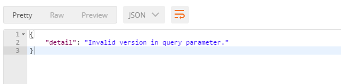
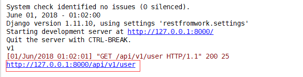

# [Django Rest Framework源码剖析(四)-----API版本](https://www.cnblogs.com/wdliu/p/9119874.html)


在我们给外部提供的API中，可会存在多个版本，不同的版本可能对应的功能不同，所以这时候版本使用就显得尤为重要，django rest framework也为我们提供了多种版本使用方法。


版本使用方式：

1.在url中传递版本:如http://www.example.com/api?version=v1

和其他组建一样，我们在utils里面建立version.py,添加版本类

```
#!/usr/bin/env python3
#_*_ coding:utf-8 _*_
#Author:wd
from  rest_framework.versioning import BaseVersioning

class Myversion(BaseVersioning):
    def determine_version(self, request, *args, **kwargs):
        myversion=request.query_params.get('version')
        return myversion
```

在订单视图中应用版本,(当然直接可以使用request.get获取)

```
class OrderView(APIView):
    '''查看订单'''
    from utils.permissions import MyPremission
    from utils.version import Myversion
    authentication_classes = [Authentication,]    #添加认证
    permission_classes = [MyPremission,]           #添加权限控制
    versioning_class = Myversion   #添加版本
    def get(self,request,*args,**kwargs):
        print(request.version)#获取版本
         #当然使用request._request.get('version')也可以
        ret = {'code':1000,'msg':"你的订单已经完成",'data':"买了一个mac"}
        return JsonResponse(ret,safe=True)
```

[](javascript:void(0);)

models.py

[](javascript:void(0);)

```
from django.db import models

class UserInfo(models.Model):
    user_type_choice = (
        (1,"普通用户"),
        (2,"会员"),
    )
    user_type = models.IntegerField(choices=user_type_choice)
    username = models.CharField(max_length=32,unique=True)
    password = models.CharField(max_length=64)


class UserToken(models.Model):
    user = models.OneToOneField(to=UserInfo)
    token = models.CharField(max_length=64)
```

[](javascript:void(0);)

urls.py

[](javascript:void(0);)

```
from django.conf.urls import url
from django.contrib import admin
from app01 import views

urlpatterns = [

    url(r'^api/v1/auth', views.AuthView.as_view()),
    url(r'^api/v1/order', views.OrderView.as_view()),
]
```

[](javascript:void(0);)

views.py

[](javascript:void(0);)

```
from django.shortcuts import  HttpResponse
from django.http import JsonResponse
from rest_framework.views import APIView
from rest_framework.authentication import BaseAuthentication
from . import models
from rest_framework import exceptions
import hashlib
import time


class Authentication(BaseAuthentication):
    """
    认证类
    """

    def authenticate(self, request):
        token = request._request.GET.get("token")
        toke_obj = models.UserToken.objects.filter(token=token).first()
        if not toke_obj:
            raise exceptions.AuthenticationFailed("用户认证失败")
        return (toke_obj.user, toke_obj)  # 这里返回值一次给request.user,request.auth

    def authenticate_header(self, val):
        pass


def md5(user):
    ctime = str(time.time())
    m = hashlib.md5(bytes(user,encoding="utf-8"))
    m.update(bytes(ctime,encoding="utf-8"))
    return m.hexdigest()

class AuthView(APIView):
    """登陆认证"""
    def dispatch(self, request, *args, **kwargs):
        return super(AuthView, self).dispatch(request, *args, **kwargs)

    def get(self, request, *args, **kwargs):
        return HttpResponse('get')

    def post(self, request, *args, **kwargs):

        ret = {'code': 1000, 'msg': "登录成功"}
        try:
            user = request._request.POST.get("username")
            pwd = request._request.POST.get("password")
            obj = models.UserInfo.objects.filter(username=user, password=pwd).first()
            if not obj:
                ret['code'] = 1001
                ret['msg'] = "用户名或密码错误"
            else:
                token = md5(user)
                models.UserToken.objects.update_or_create(user=obj, defaults={"token": token})
                ret['token'] = token

        except Exception as e:
            ret['code'] = 1002
            ret['msg'] = "请求异常"

        return JsonResponse(ret)


class OrderView(APIView):
    '''查看订单'''
    from utils.permissions import MyPremission
    from utils.version import Myversion
    authentication_classes = [Authentication,]    #添加认证
    permission_classes = [MyPremission,]           #添加权限控制
    versioning_class = Myversion
    def get(self,request,*args,**kwargs):
        print(request.version)

        ret = {'code':1000,'msg':"你的订单已经完成",'data':"买了一个mac"}
        return JsonResponse(ret,safe=True)
```

[](javascript:void(0);)

使用postman发送请求：http://127.0.0.1:8000/api/v1/order?token=7c191332ba452abefe516ff95ea9994a&version=v1，后台可获取版本。

当然上面获取版本方式还有更为简单的获取版本方法，使用QueryParameterVersioning，其就是封装的以上过程。

[](javascript:void(0);)

```
class OrderView(APIView):
    '''查看订单'''
    from utils.permissions import MyPremission
    from utils.version import Myversion
    from rest_framework.versioning import QueryParameterVersioning
    authentication_classes = [Authentication,]    #添加认证
    permission_classes = [MyPremission,]           #添加权限控制
    versioning_class = QueryParameterVersioning #该方法获取参数的key为version
    def get(self,request,*args,**kwargs):
        print(request.version)

        ret = {'code':1000,'msg':"你的订单已经完成",'data':"买了一个mac"}
        return JsonResponse(ret,safe=True)
```

[](javascript:void(0);)

当然，DRF也提供了可配置的版本，并且还能控制版本使用

settings.py

[](javascript:void(0);)

```
REST_FRAMEWORK = {#版本配置
     "DEFAULT_VERSION":'v1',               #默认的版本
     "ALLOWED_VERSIONS":['v1','v2'],       #允许的版本,这里只允许V1和v2
     "VERSION_PARAM":'version' ,            #get方式url中参数的名字 如?version=v1


}
```

[](javascript:void(0);)

使用postman验证，发送带token和版本http://127.0.0.1:8000/api/v1/order?token=7c191332ba452abefe516ff95ea9994a&version=v3

结果：



可见版本配置生效。

2.使用url路径传递版本，如http://www.example.com/api/v1，django rest framework 当然也为我们提供了类：URLPathVersioning

为了区分，这里新建url和view，如下：

urls.py

[](javascript:void(0);)

```
from django.conf.urls import url
from django.contrib import admin
from app01 import views

urlpatterns = [

    url(r'^api/v1/auth', views.AuthView.as_view()),
    url(r'^api/v1/order', views.OrderView.as_view()),
    url(r'^api/(?P<version>[v1|v2]+)/user', views.UserView.as_view()), # 新建的url
]
```

[](javascript:void(0);)

UserView

[](javascript:void(0);)

```
class UserView(APIView):
    '''查看用户信息'''

    from rest_framework.versioning import URLPathVersioning

    versioning_class =URLPathVersioning
    def get(self,request,*args,**kwargs):
        print(request.version)  #获取版本

        res={"name":"wd","age":22}
        return JsonResponse(res,safe=True)
```

[](javascript:void(0);)

使用postman请求：http://127.0.0.1:8000/api/v1/user,同样后台能拿到版本结果。


和[认证](https://www.cnblogs.com/wdliu/p/8747372.html)流程一样，请求进来，同样走APIview的dispatch的方法，请阅读注解部分：

1.APIView类的dispatch源码：

[](javascript:void(0);)

```
def dispatch(self, request, *args, **kwargs):
        """
        `.dispatch()` is pretty much the same as Django's regular dispatch,
        but with extra hooks for startup, finalize, and exception handling.
        """
        self.args = args
        self.kwargs = kwargs
        #对原始request进行加工，丰富了一些功能
        #Request(
        #     request,
        #     parsers=self.get_parsers(),
        #     authenticators=self.get_authenticators(),
        #     negotiator=self.get_content_negotiator(),
        #     parser_context=parser_context
        # )
        #request(原始request,[BasicAuthentications对象，])
        #获取原生request,request._request
        #获取认证类的对象，request.authticators
        #1.封装request
        request = self.initialize_request(request, *args, **kwargs)
        self.request = request
        self.headers = self.default_response_headers  # deprecate?

        try:
            self.initial(request, *args, **kwargs)

            # Get the appropriate handler method
            if request.method.lower() in self.http_method_names:
                handler = getattr(self, request.method.lower(),
                                  self.http_method_not_allowed)
            else:
                handler = self.http_method_not_allowed

            response = handler(request, *args, **kwargs)

        except Exception as exc:
            response = self.handle_exception(exc)

        self.response = self.finalize_response(request, response, *args, **kwargs)
        return self.response
```

[](javascript:void(0);)

2.接着执行self.inital方法：

[](javascript:void(0);)

```
def initial(self, request, *args, **kwargs):
        """
        Runs anything that needs to occur prior to calling the method handler.
        """
        self.format_kwarg = self.get_format_suffix(**kwargs)

        # Perform content negotiation and store the accepted info on the request
        neg = self.perform_content_negotiation(request)
        request.accepted_renderer, request.accepted_media_type = neg

        # Determine the API version, if versioning is in use.
        ####版本控制
        version, scheme = self.determine_version(request, *args, **kwargs)
        request.version, request.versioning_scheme = version, scheme

        # Ensure that the incoming request is permitted
        #2.实现认证
        self.perform_authentication(request)
        #3.权限判断
        self.check_permissions(request)
        #4.频率限制
        self.check_throttles(request)  
```

[](javascript:void(0);)

3.可以看到版本控制是在认证之前，首先下执行version, scheme = self.determine_version(request, *args, **kwargs)，以下是self.determine_version源码：

[](javascript:void(0);)

```
    def determine_version(self, request, *args, **kwargs):
        """
        If versioning is being used, then determine any API version for the
        incoming request. Returns a two-tuple of (version, versioning_scheme)
        """
        if self.versioning_class is None:  #先判断版本类是否存在(self.versioning_class 是否为存在)，不存在返回tuple，（none,none）
            return (None, None)            
        scheme = self.versioning_class()   #存在返回版本类对象
        return (scheme.determine_version(request, *args, **kwargs), scheme) #版本类存在，最后返回版本类对象的determine_version方法结果（也就是返回的版本号），和类对象，                                                                             这也就是每个版本类必须要有的方法，用来获取版本。
```

[](javascript:void(0);)

4.承接 self.determine_version方法执行完成以后，接着执行request.version, request.versioning_scheme = version, scheme，这个不用多说，无非将版本号赋值给request.version属性，版本类对象赋值给request.versioning_scheme,这也就是我们为什么能通过request.version获取版本号的原因。

5.同认证源码一样，self.determine_version方法中使用的版本类self.versioning_class()，在全局中也有配置

[](javascript:void(0);)

```
class APIView(View):

    # The following policies may be set at either globally, or per-view.
    renderer_classes = api_settings.DEFAULT_RENDERER_CLASSES
    parser_classes = api_settings.DEFAULT_PARSER_CLASSES
    authentication_classes = api_settings.DEFAULT_AUTHENTICATION_CLASSES
    throttle_classes = api_settings.DEFAULT_THROTTLE_CLASSES
    permission_classes = api_settings.DEFAULT_PERMISSION_CLASSES
    content_negotiation_class = api_settings.DEFAULT_CONTENT_NEGOTIATION_CLASS
    metadata_class = api_settings.DEFAULT_METADATA_CLASS
    versioning_class = api_settings.DEFAULT_VERSIONING_CLASS  #版本处理类配置
```

[](javascript:void(0);)

6.基于以上源码分析完成以后，下面我们来剖析下，我们示例中所使用的两个版本处理类，具体分析请看注解：

QueryParameterVersioning(BaseVersioning)

[](javascript:void(0);)

```
class QueryParameterVersioning(BaseVersioning):
    """
    GET /something/?version=0.1 HTTP/1.1
    Host: example.com
    Accept: application/json
    """
    invalid_version_message = _('Invalid version in query parameter.')  ## 当setting.py配置了允许的版本时候，不匹配版本返回的错误信息，可以自己定义

    def determine_version(self, request, *args, **kwargs):           ## 获取版本方法
        version = request.query_params.get(self.version_param, self.default_version) # 通过request.query_paras方法获取（本质request.MATE.get），                                                                                       default_version默认是version，是在settings中配置的
        if not self.is_allowed_version(version):     #不允许的版本抛出异常
            raise exceptions.NotFound(self.invalid_version_message)
        return version  #无异常则返回版本号

    def reverse(self, viewname, args=None, kwargs=None, request=None, format=None, **extra):  #url 反解析，可以通过该方法生成请求的url，后面会有示例
        url = super(QueryParameterVersioning, self).reverse(
            viewname, args, kwargs, request, format, **extra
        )
        if request.version is not None:
            return replace_query_param(url, self.version_param, request.version)   
        return url
```

[](javascript:void(0);)

URLPathVersioning

[](javascript:void(0);)

```
class URLPathVersioning(BaseVersioning):
    """
    To the client this is the same style as `NamespaceVersioning`.
    The difference is in the backend - this implementation uses
    Django's URL keyword arguments to determine the version.

    An example URL conf for two views that accept two different versions.

    urlpatterns = [
        url(r'^(?P<version>[v1|v2]+)/users/$', users_list, name='users-list'),
        url(r'^(?P<version>[v1|v2]+)/users/(?P<pk>[0-9]+)/$', users_detail, name='users-detail')
    ]

    GET /1.0/something/ HTTP/1.1
    Host: example.com
    Accept: application/json
    """
    invalid_version_message = _('Invalid version in URL path.')  # 不允许的版本信息，可定制

    def determine_version(self, request, *args, **kwargs):    ## 同样实现determine_version方法获取版本
        version = kwargs.get(self.version_param, self.default_version) # 由于传递的版本在url的正则中，所以从kwargs中获取，self.version_param默认是version
        if not self.is_allowed_version(version):
            raise exceptions.NotFound(self.invalid_version_message)     # 没获取到，抛出异常
        return version                                                  # 正常获取，返回版本号

    def reverse(self, viewname, args=None, kwargs=None, request=None, format=None, **extra): # url反解析，后面会有示例
        if request.version is not None:
            kwargs = {} if (kwargs is None) else kwargs
            kwargs[self.version_param] = request.version

        return super(URLPathVersioning, self).reverse(
            viewname, args, kwargs, request, format, **extra
```

[](javascript:void(0);)

这个版本类都继承了BaseVersioning：

[](javascript:void(0);)

```
class BaseVersioning(object):
    default_version = api_settings.DEFAULT_VERSION            #默默人版本配置
    allowed_versions = api_settings.ALLOWED_VERSIONS　　　　　　#允许版本配置
    version_param = api_settings.VERSION_PARAM                #版本key配置

    def determine_version(self, request, *args, **kwargs):
        msg = '{cls}.determine_version() must be implemented.'
        raise NotImplementedError(msg.format(
            cls=self.__class__.__name__
        ))

    def reverse(self, viewname, args=None, kwargs=None, request=None, format=None, **extra):
        return _reverse(viewname, args, kwargs, request, format, **extra)

    def is_allowed_version(self, version):
        if not self.allowed_versions:
            return True
        return ((version is not None and version == self.default_version) or
                (version in self.allowed_versions))
```

[](javascript:void(0);)


以URLPathVersioning为例，其本质也是用的django的url反向解析方法，实现过程这里就不用过多说明，有兴趣可以自己看源码。

1.配置url，为view取别名

```
urlpatterns = [

    url(r'^api/v1/auth', views.AuthView.as_view()),
    url(r'^api/v1/order', views.OrderView.as_view()),
    url(r'^api/(?P<version>[v1|v2]+)/user', views.UserView.as_view(),name="user_view"),
]
```

2.利用reverse方法反向生成请求的url,UserView视图。

[](javascript:void(0);)

```
class UserView(APIView):
    '''查看用户信息'''

    from rest_framework.versioning import URLPathVersioning

    versioning_class =URLPathVersioning
    def get(self,request,*args,**kwargs):
        print(request.version)

        url = request.versioning_scheme.reverse(viewname='user_view', request=request)
        #versioning_scheme已经在源码中分析过了，就是版本类实例化的对象
        print(url)
        res={"name":"wd","age":22}
        return JsonResponse(res,safe=True)
```

[](javascript:void(0);)

使用postman发请求：http://127.0.0.1:8000/api/v1/user查看结果如下：




 

对于版本控制来说，其实没必要自己去定义或自己写版本处理的类，推荐使用全局配置，以及URLPathVersioning类。

具体配置：

[](javascript:void(0);)

```
# 全局配置
 REST_FRAMEWORK = {
     "DEFAULT_VERSIONING_CLASS":"rest_framework.versioning.URLPathVersioning",  #类的路径
    "DEFAULT_VERSION":'v1',               #默认的版本
    "ALLOWED_VERSIONS":['v1','v2'],       #允许的版本
   #  "VERSION_PARAM":'version'             #使用QueryParameterVersioning时候进行的配置，get请求时候传递的参数的key  
}

#单一视图
versioning_class =URLPathVersioning
```