# 企业级 Docker 容器


## 一、Docker 出现的背景

　　在平常的研发和项目场景中，以下情况普遍存在：

- **个人开发环境**
  为了做大数据相关项目，需要安装一套大数据集群，常见的做法是在自己电脑里搭建3台与大数据版本对应的虚拟机，把大数据集群装起来后，考虑到以后很有可能还要使用一个干净的大数据集群，为了避免以后重复安装环境，通常会对整套大数据集群做一个备份，这样电脑里就有6个虚拟机镜像了。另外，后面在学习其他技术时，比如学习Ambari大数据集群，那么为了不破坏已有的虚拟机环境，又要重新搭建3台虚拟机，本机磁盘很快被一大堆的虚拟机镜像占满。
- **公司内部开发环境**
  公司里往往会以小团队的方式来做项目，一般由运维部门从他们管理的服务器资源中分配出虚拟机供团队内部开发测试使用。比如做一个与机器学习相关的项目：
  - 小明在运维部门分配的虚拟机上搭建了一套Ambari集群，拿来跑大数据相关业务
  - 小刚用python3写了一个机器学习算法，放到虚拟机上运行发现虚拟机里是python2，算法不兼容，于是把虚拟机里的python版本升级了，算法跑通了，但Ambari用到python的部分功能可能就报错了
  - 小李开发了应用，放到虚拟机上启动tomcat，发现虚拟机里的是OpenJDK，导致tomcat起不来，于是又安装了一个JDK，这时候可能Ambari里的Java代码可能就报错了
  - 小赵想利用服务器资源做性能测试，发现虚拟机严重削减了性能，最终还是要直接找物理机来跑测试，破坏了物理机原来的环境
  - 做完项目后，这些虚拟机上安装的东西往往变得没用了，下个项目组来还是得新申请虚拟机重新部署软件
- **开发/测试/现场环境**
  研发人员在开发环境里写好了代码做好测试后，提交给测试部门，测试人员在测试环境跑起来发现有BUG，研发人员说在开发环境没这个BUG，和测试人员多次扯皮解决BUG后发布版本，发到现场在生产环境部署后，又发现有BUG，这下轮到工程人员和测试人员扯皮。有时候为了兼容特殊的现场环境，还需要对代码进行定制化修改，拉出分支，这样导致了每次到现场升级都是一场噩梦
- **升级或迁移项目**
  在每次发版本要升级到现场时，如果现场起了多个tomcat应用，那么需要对每个tomcat都先停掉，替换war包，然后再起起来，轮流着做，不仅繁琐而且很容易出错，如果遇到升级后出现严重BUG，还要手工做回退。另外，如果项目想上云，那么在云上部署后要重新进行一轮测试，如果后面考虑其他云厂商，可能相同的测试还要再进行一次（比如更换了数据存储组件），费时费力。

　　总结以上列举的所有场景，他们存在的一个共同的问题是：没有一种既能够屏蔽操作系统差异，又能够以不降低性能的方式来运行应用的技术，来解决环境依赖的问题。Docker应运而生。

## 二、Docker 是什么

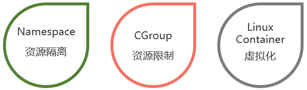

　　Docker 是一种应用容器引擎。首先说一下何为容器，Linux系统提供了`Namespace`和`CGroup`技术实现**环境隔离**和**资源控制**，其中Namespace是Linux提供的一种内核级别环境隔离的方法，能使一个进程和该进程创建的子进程的运行空间都与Linux的超级父进程相隔离，注意Namespace只能实现运行空间的隔离，物理资源还是所有进程共用的，为了实现资源隔离，Linux系统提供了CGroup技术来控制一个进程组群可使用的资源（如CPU、内存、磁盘IO等），把这两种技术结合起来，就能构造一个用户空间独立且限定了资源的对象，这样的对象称为容器。`Linux Container`是Linux系统提供的容器化技术，简称`LXC`，它结合 Namespace 和 CGroup 技术为用户提供了更易用的接口来实现容器化。LXC仅为一种轻量级的容器化技术，它仅能对部分资源进行限制，无法做到诸如网络限制、磁盘空间占用限制等。dotCloud公司结合LXC和`以下列出的技术`实现了Docker容器引擎，相比于LXC，Docker具备更加全面的资源控制能力，是一种应用级别的容器引擎。

- **Chroot：**该技术能在container里构造完整的Linux文件系统；Chroot 就是Change Root，也就是改变程序执行时所参考的根目录位置。Chroot 可以增进系统的安全性，限制使用者能做的事
- **Veth：**该技术能够在主机上虚拟出一张网卡与container里的eth0网卡进行桥接，实现容器与主机、容器之间的网络通信；
- **UnionFS：**联合文件系统，Docker利用该技术“Copy on Write”的特点实现容器的快速启动和极少的资源占用，后面会专门介绍该文件系统；
- **Iptables/netfilter：**通过这两个技术实现控制container网络访问策略；
- **TC：**该技术主要用来做流量隔离，限制带宽；（Tc 命令用于Linux内核的流量控制）
- **Quota：**该技术用来限制磁盘读写空间的大小；
- **Setrlimit：**该技术用来限制 container 中打开的进程数，限制打开的文件个数等

> 也正是因为Docker依赖Linux内核的这些技术，至少使用3.8或更高版本的内核才能运行Docker容器，官方建议使用3.10以上的内核版本。

### 　　1、docker和openstack的几项对比


### 　　2、容器在内核中支持2种重要技术

​	docker本质就是宿主机的一个进程，docker是通过namespace实现资源隔离，通过cgroup实现资源限制，通过写时复制技术（copy-on-write）实现了高效的文件操作（类似虚拟机的磁盘比如分配500g并不是实际占用物理磁盘500g）

#### 　　　　1、namespaces 名称空间


#### 　　　　2、control Group 控制组

** cgroup的特点是: **　　　　　　　

cgroup的api以一个伪文件系统的实现方式，用户的程序可以通过文件系统实现cgroup的组件管理
cgroup的组件管理操作单元可以细粒度到线程级别，另外用户可以创建和销毁cgroup，从而实现资源载分配和再利用, 所有资源管理的功能都以子系统的方式实现，接口统一子任务创建之初与其父任务处于同一个cgroup的控制组

 **四大功能：**　　　　　　　　

**资源限制**：可以对任务使用的资源总额进行限制
**优先级分配**：通过分配的cpu时间片数量以及磁盘IO带宽大小，实际上相当于控制了任务运行优先级
**资源统计**：可以统计系统的资源使用量，如cpu时长，内存用量等
**任务控制**：cgroup可以对任务执行挂起、恢复等操作

## 三、Docker 与传统虚拟化技术的区别

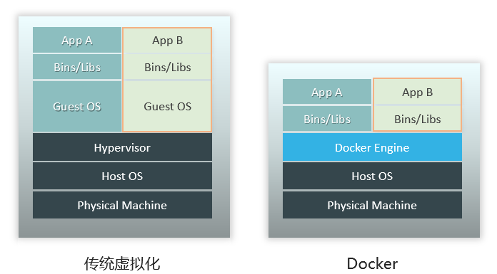

传统的虚拟化技术在虚拟机（VM）和硬件之间加了一个软件层Hypervisor，或者叫做**虚拟机管理程序**。

Hypervisor的运行方式分为两类：

- 直接运行在物理硬件之上。如基于内核的KVM虚拟机，这种虚拟化需要CPU支持虚拟化技术；
- 运行在另一个操作系统。如VMWare和VitrualBox等虚拟机。

　　因为运行在虚拟机上的操作系统是通过Hypervisor来最终分享硬件，所以虚拟机Guest OS发出的指令都需要被Hypervisor捕获，然后翻译为物理硬件或宿主机操作系统能够识别的指令。VMWare和VirtualBox等虚拟机在性能方面远不如裸机，但基于硬件虚拟机的KVM约能发挥裸机80%的性能。这种虚拟化的优点是不同虚拟机之间实现了完全隔离，安全性很高，并且能够在一台物理机上运行多种内核的操作系统（如Linux和Window），但每个虚拟机都很笨重，占用资源多而且启动很慢。

　　Docker引擎运行在操作系统上，是基于内核的LXC、Chroot等技术实现容器的环境隔离和资源控制，在容器启动后，容器里的进程直接与内核交互，无需经过Docker引擎中转，因此几乎没有性能损耗，能发挥出裸机的全部性能。但由于Docker是基于Linux内核技术实现容器化的，因此使得容器内运行的应用只能运行在Linux内核的操作系统上。目前在Window上安装的docker引擎其实是利用了Window自带的Hyper-V虚拟化工具自动创建了一个Linux系统，容器内的操作实际上是间接使用这个虚拟系统实现的。

## 四、Docker 基本概念


　　Docker主要有如下几个概念：

- **引擎：**创建和管理容器的工具，通过读取镜像来生成容器，并负责从仓库拉取镜像或提交镜像到仓库中；
- **镜像：**类似于虚拟机镜像，一般由一个基本操作系统环境和多个应用程序打包而成，是创建容器的模板；
- **容器：**可看作一个简易版的Linxu系统环境（包括root用户权限、进程空间、用户空间和网络空间等）以及运行在其中的应用程序打包而成的盒子；
- **仓库：**集中存放镜像文件的场所，分为公共仓库和私有仓库，目前最大的公共仓库是官方提供的Docker Hub，此外国内的阿里云、腾讯云等也提供了公共仓库；
- **宿主机：**运行引擎的操作系统所在服务器。

## 五、Docker 与虚拟机、Git、JVM的类比

　　为了让大家对Docker有更直观的认识，下面分别进行三组类比：

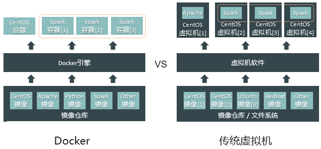

　　上图中Docker的镜像仓库类似于传统虚拟机的镜像仓库或存放镜像的本地文件系统，Docker引擎启动容器来运行Spark集群（容器内包含基础的Linux操作系统环境），类比于虚拟机软件启动多个虚拟机，在虚拟机内分别运行Spark进程，两者区别在于Docker容器内的应用在使用物理资源时，直接与内核打交道，无需经过Docker引擎。

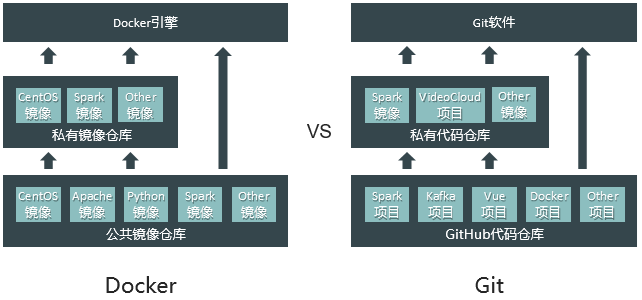

　　Docker的仓库思想与Git是相同的。

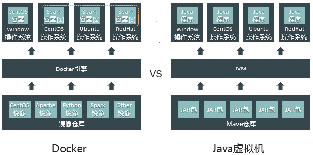

　　Docker的口号是“Build，Ship，and Run Any App，Anywhere”，也就是可以基于Docker构建、装载和运行应用程序，一次构建到处运行。Java的口号是“Write Once,Run Anywhere”，即一次编写到处运行。Java是基于JVM适配操作系统的特点来屏蔽系统的差异，Docker则是利用内核版本兼容性的特点来实现一次构建导出运行，只要Linux系统的内核是3.8或更高的版本，就都能把容器跑起来。

> 当然，正如Java中如果应用代码使用了JDK10的新特性，基于JDK8就无法运行一样，如果容器内的应用使用了4.18版本的内核特性，那么在CentOS7（内核版本为3.10）启动容器时，虽然容器能够启动，但里面应用的功能是无法正常运行的，除非把宿主机的操作系统内核升级到4.18版本。

## 六、Docker 基础操作系统


　　以上系统镜像分别适用于不同的场景：

- **BusyBox：**一个极简版的Linux系统，集成了100多种常用Linux命令，大小不到2MB，被称为“Linux系统的瑞士军刀”，适用于简单测试场景；
- **Alpine：**一个面向安全的轻型Linux发行版系统，比BusyBox功能更完善，大小不到5MB，是官网推荐的基础镜像，由于其包含了足够的基础功能和体积较小，在生产环境中最常用；
- **Debian/Ubuntu：** Debian系列操作系统，功能完善，大小约170MB，适合研发环境；
- **CentOS/Fedora：**都是基于Redhat的Linux发行版，企业级服务器常用操作系统，稳定性高，大小约200MB，适合生产环境使用。

## 七、Docker 的使用场景

　　Docker作为一种轻量级的虚拟化方案，应用场景十分丰富，下面收集了一些常见的场景：

- **作为轻量级虚拟机使用**
  可以使用Ubuntu等系统镜像创建容器，当作虚拟机来使用，相比于传统虚拟机，启动速度更快，资源占用更少，单机可以启动大量的操作系统容器，方便进行各种测试；
- **作为云主机使用**
  结合Kubernetes这样的容器管理系统，可以在大量服务器上动态分配和管理容器，在公司内部，甚至可以取代VMWare这样的虚拟机管理平台，使用Docker容器作为云主机使用；
- **应用服务打包**
  在Web应用服务开发场景，可以把Java运行环境、Tomcat服务器打包为一个基础镜像，在修改了代码包后加入到基础镜像来构建一个新的镜像，能很方便的升级服务和控制版本；
- **容器云平台CaaS**
  Docker的出现，使得很多云平台供应商开始提供容器云的服务，简称容器即服务CaaS，以下对比一下IaaS、PaaS和SaaS：
  - **IaaS（基础设施即服务）：**提供虚拟机或者其他基础资源作为服务提供给用户。用户可以从供应商那里获得虚拟机或者存储等资源来装载相关的应用，同时这些基础设施的繁琐的管理工作将由IaaS供应商来处理。其主要的用户是企业的系统管理员和运维人员；
  - **PaaS（平台即服务）：**把开发平台作为服务提供给用户。用户可以在一个包括SDK，文档和测试环境等在内的开发平台上非常方便地编写应用，而且不论是在部署，或者在运行的时候，用户都无需为服务器、操作系统、网络和存储等资源的管理操心，这些繁琐的工作都由PaaS供应商负责处理。其主要的用户是企业开发人员。
  - **SaaS（软件即服务）：**将应用作为服务提供给客户。用户只要接上网络，并通过浏览器，就能直接使用在云端上运行的应用，而不需要顾虑类似安装等琐事，并且免去初期高昂的软硬件投入。SaaS主要面对的是普通的用户。
  - **CaaS（容器即服务）：**完成IaaS和PaaS两个层级的功能。相对于传统的IaaS和PaaS服务，CaaS对底层的支持比PaaS更灵活，而对上层应用的操控又比IaaS更容易。同时因为Docker是比VM更细粒度的虚拟化服务，所以能够对计算资源做到更高效的利用。CaaS可以部署在任何物理机，虚拟机或IaaS云之上。
- **持续集成和持续部署**
  互联网行业提倡敏捷开发，持续集成部署CI/CD便是最典型的开发模式。使用Docker容器云平台，就能实现从代码编写完成推送到Git/SVN后，自动触发后端CaaS平台将代码下载、编译并构建成测试Docker镜像，再替换测试环境容器服务，自动在Jenkins或者Hudson中运行单元/集成测试，测试通过后，马上就能自动将新版本镜像更新到线上，完成服务升级。整个过程全自动化，一气呵成，最大程度地简化了运维，而且保证线上、线下环境完全一致，而且线上服务版本与Git/SVN发布分支也实现统一。
- **解决微服务架构的实施难题**
  基于Spring Cloud这样的微服务框架，能够实现微服务的管理，但微服务本身还是需要运行在操作系统上。一个采用微服务架构开发的应用中，微服务的个数往往很多，这就导致了一台服务器上往往需要启动多个微服务来提高资源的利用率，而微服务本身可能就只能兼容部分操作系统，这就导致了就算有大量的服务器资源（操作系统可能不一样），但由于微服务本身与操作系统可能相关，就不能做到让微服务在任意服务器上运行，这就带来了资源的浪费和运维的困难。利用Docker容器的环境隔离能力，让微服务运行在容器内，就能够解决以上所说的问题。
- **执行临时任务**
  有时候用户只是想执行一次性的任务，但如果用传统虚拟机的方式就要搭建环境，执行完任务后还要释放资源，比较麻烦。使用Docker容器就可以构建临时的运行环境，执行完任务后关闭容器即可，方便快捷。
- **多租户环境**
  利用Docker的环境隔离能力，可以为不同的租户提供独占的容器，实现简单而且成本较低。

## 八、Docker 总结

　　Docker的技术并不神秘，只是整合了前人积累的各种成果实现的应用级的容器化技术，它利用各种Linux发行版中使用了版本兼容的内核容器化技术，来实现镜像一次构建到处运行的效果，并且利用了容器内的基础操作系统镜像层，屏蔽了实际运行环境的操作系统差异，使用户在开发应用程序时，只需确保在选定的操作系统和内核版本上能正确运行即可，几乎不需要关心实际的运行环境的系统差异，大大提高效率和兼容性。但随着容器运行得越来越多，容器管理将会称为另一个运维的难题，这时候就需要引入Kubernetes、Mesos或Swarm这些容器管理系统，后面有机会再介绍这些技术。

## 九、Docker 的初体验

### 1、环境说明

```shell
# 需要两台进行安装
[root@docker01 ~]# cat /etc/redhat-release 
CentOS Linux release 7.2.1511 (Core) 
[root@docker01 ~]# uname  -r 
3.10.0-327.el7.x86_64
[root@docker01 ~]# hostname -I
10.0.0.100 172.16.1.100 
[root@docker02 ~]# hostname -I
10.0.0.101 172.16.1.101
```

### 2、安装

#### 1、安装 docker 源 （在**两个节点**上都进行操作）

```shell
# step 1: 安装必要的一些系统工具
yum install -y yum-utils device-mapper-persistent-data lvm2
# Step 2: 添加软件源信息
yum-config-manager --add-repo http://mirrors.aliyun.com/docker-ce/linux/centos/docker-ce.repo
# Step 3: 更新并安装 Docker-CE
yum makecache fast
yum -y install docker-ce
# Step 4: 开启Docker服务
service docker start

注意：其他注意事项在下面的注释中
# 官方软件源默认启用了最新的软件，您可以通过编辑软件源的方式获取各个版本的软件包。例如官方并没有将测试版本的软件源置为可用，你可以通过以下方式开启。同理可以开启各种测试版本等。
# vim /etc/yum.repos.d/docker-ce.repo
#   将 [docker-ce-test] 下方的 enabled=0 修改为 enabled=1
#
# 安装指定版本的Docker-CE:
# Step 1: 查找Docker-CE的版本:
# yum list docker-ce.x86_64 --showduplicates | sort -r
#   Loading mirror speeds from cached hostfile
#   Loaded plugins: branch, fastestmirror, langpacks
#   docker-ce.x86_64            17.03.1.ce-1.el7.centos            docker-ce-stable
#   docker-ce.x86_64            17.03.1.ce-1.el7.centos            @docker-ce-stable
#   docker-ce.x86_64            17.03.0.ce-1.el7.centos            docker-ce-stable
#   Available Packages
# Step2 : 安装指定版本的Docker-CE: (VERSION 例如上面的 17.03.0.ce.1-1.el7.centos)
# sudo yum -y install docker-ce-[VERSION]
# 注意：在某些版本之后，docker-ce安装出现了其他依赖包，如果安装失败的话请关注错误信息。例如 docker-ce 17.03 之后，需要先安装 docker-ce-selinux。
# yum list docker-ce-selinux- --showduplicates | sort -r
# sudo yum -y install docker-ce-selinux-[VERSION]

# 通过经典网络、VPC网络内网安装时，用以下命令替换Step 2中的命令
# 经典网络：
# sudo yum-config-manager --add-repo http://mirrors.aliyuncs.com/docker-ce/linux/centos/docker-ce.repo
# VPC网络：
# sudo yum-config-manager --add-repo http://mirrors.could.aliyuncs.com/docker-ce/linux/centos/docker-ce.repo
```

#### 2、修改在 docker01 配置

```shell
# 修改启动文件，监听远程端口
vim /usr/lib/systemd/system/docker.service
ExecStart=/usr/bin/dockerd -H unix:///var/run/docker.sock -H tcp://10.0.0.100:2375
systemctl daemon-reload
systemctl enable docker.service 
systemctl restart docker.service
# ps -ef检查进行，是否启动
```

####  3、在 docker02 测试

```shell
[root@docker02 ~]# docker -H 10.0.0.100 info
Containers: 0
 Running: 0
 Paused: 0
 Stopped: 0
Images: 0
Server Version: 17.12.0-ce
Storage Driver: devicemapper
···
```

### 3、Docker 基础命令操作

#### 1、查看 docker 相关信息

```shell
[root@docker01 ~]#docker version  
Client:  # docker客户端相关信息
 Version:    17.12.0-ce
 API version:    1.35
 Go version:    go1.9.2
 Git commit:    c97c6d6
 Built:    Wed Dec 27 20:10:14 2017
 OS/Arch:    linux/amd64
Server: # docker服务端相关信息
 Engine:
  Version:    17.12.0-ce
  API version:    1.35 (minimum version 1.12)
  Go version:    go1.9.2
  Git commit:    c97c6d6
  Built:    Wed Dec 27 20:12:46 2017
  OS/Arch:    linux/amd64
  Experimental:    false
```

#### 2、配置docker镜像加速

```shell
vim /etc/docker/daemon.json # 一般在这个目录下都会有这个文件，如果没有自行创建一个，一般去阿里云申请一个即可：
{                        （我的阿里云加速账号："registry-mirrors": ["https://4p8hh31b.mirror.aliyuncs.com"]）
  "registry-mirrors": ["https://mb8n4btz.mirror.aliyuncs.com"],
}
```

### 4、启动第一个容器

```shell
# 测试docker是否正常安装和运行
docker run hello-world

# 查看结果
Hello from Docker!
This message shows that your installation appears to be working correctly.


[root@docker01 ~]# docker run -d -p 80:80 nginx
Unable to find image 'nginx:latest' locally
latest: Pulling from library/nginx
e7bb522d92ff: Pull complete 
6edc05228666: Pull complete 
cd866a17e81f: Pull complete 
Digest: sha256:285b49d42c703fdf257d1e2422765c4ba9d3e37768d6ea83d7fe2043dad6e63d
Status: Downloaded newer image for nginx:latest
8d8f81da12b5c10af6ba1a5d07f4abc041cb95b01f3d632c3d638922800b0b4d
# 容器启动后，在浏览器进行访问测试
```

参数说明

| **参数**  | **说明**           |
| --------- | ------------------ |
| **run**   | 创建并运行一个容器 |
| **-d**    | 放入后台           |
| **-p**    | 端口映射           |
| **nginx** | 镜像名称           |

### 5、Docker镜像生命周期

 

### 6、Docker 镜像管理

#### 1、搜索官方仓库镜像

```shell
[root@docker01 ~]# docker search centos
NAME                      DESCRIPTION                    STARS    OFFICIAL               AUTOMATED
centos                    The official build of CentOS.  3992     [OK]      
ansible/centos7-ansible   Ansible on Centos7             105                              [OK]
```

列表说明

| **参数**        | **说明**         |
| --------------- | ---------------- |
| **NAME**        | 镜像名称         |
| **DESCRIPTION** | 镜像说明         |
| **STARS**       | 点赞数量         |
| **OFFICIAL**    | 是否是官方的     |
| **AUTOMATED**   | 是否是自动构建的 |

#### 2、获取镜像

根据镜像名称拉取镜像

```shell
[root@docker01 ~]# docker pull centos
Using default tag: latest
latest: Pulling from library/centos
af4b0a2388c6: Downloading  34.65MB/73.67MB
```

查看当前主机镜像列表

```shell
[root@docker01 ~]# docker image list 
REPOSITORY          TAG                 IMAGE ID            CREATED             SIZE
centos              latest              ff426288ea90        3 weeks ago         207MB
nginx               latest              3f8a4339aadd        5 weeks ago         108MB
```

拉第三方镜像方法

```shell
docker pull index.tenxcloud.com/tenxcloud/httpd
```

#### 3、导出镜像

```shell
[root@docker01 ~]# docker image list 
REPOSITORY          TAG                 IMAGE ID            CREATED             SIZE
centos              latest              ff426288ea90        3 weeks ago         207MB
nginx               latest              3f8a4339aadd        5 weeks ago         108MB
# 导出
[root@docker01 ~]# docker image save centos > docker-centos.tar.gz

# 批量导出镜像
# 将机器上的所有镜像打包到images.tar文件里面
[root@docker01 ~]# docker save $(docker images | grep -v REPOSITORY | awk 'BEGIN{OFS=":";ORS=" "}{print $1,$2}') -o images.tar
```

#### 4、删除镜像

```shell
# 添加 -f 强制删除
[root@docker01 ~]# docker image rmi centos:latest
[root@docker01 ~]# docker image list 
REPOSITORY          TAG                 IMAGE ID            CREATED             SIZE
nginx               latest              3f8a4339aadd        5 weeks ago         108MB
```

#### 5、导入镜像

```shell
[root@docker01 ~]# docker image load -i docker-centos.tar.gz  
e15afa4858b6: Loading layer  215.8MB/215.8MB
Loaded image: centos:latest
[root@docker01 ~]# docker image list 
REPOSITORY          TAG                 IMAGE ID            CREATED             SIZE
centos              latest              ff426288ea90        3 weeks ago         207MB
nginx               latest              3f8a4339aadd        5 weeks ago         108MB
```

#### 6 、查看镜像的详细信息

```shell
[root@docker01 ~]# docker image inspect centos
```

## 十、Docker 日常管理

### 1、最简单的运行一个容器

```shell
[root@docker01 ~]# docker run nginx
# 开启内核网络转发
[root@docker01 ~]# vim /etc/sysctl.conf
net.ipv4.ip_forward = 1
[root@docker01 ~]# sysctl -p
```

### 2、分步创建容器（不常用）

```shell
[root@docker01 ~]# docker create -t -i nginx /bin/bash
bb7f32368ecf0492adb59e20032ab2e6cf6a563a0e6751e58930ee5f7aaef204
[root@docker01 ~]# docker start -a -i 13d4953e48c3 
nginx

[root@docker01 ~]# docker create -p 80:80 nginx
bb7f32368ecf0492adb59e20032ab2e6cf6a563a0e6751e58930ee5f7aaef204
[root@docker01 ~]# docker start 13d4953e48c3 
nginx
```

### 3、快速启动容器

```shell
[root@docker01 ~]# docker run  centos:latest  /usr/bin/sleep 20;
```

   **注意： 容器内的第一个进程必须一直处于运行的状态，否则这个容器，就会处于退出状态！**

### 4、查看正在运行的容器

```shell
[root@docker01 ~]# docker run -d -p 80:80 --name nginx nginx
[root@docker01 ~]# docker container ls
    或
[root@docker01 ~]# docker ps 
CONTAINER ID        IMAGE               COMMAND                  CREATED             STATUS              PORTS               NAMES
8708e93fd767        nginx               "nginx -g 'daemon of…"   6 seconds ago       Up 4 seconds        80/tcp              keen_lewin
```

### 5、查看你容器详细信息/ip

```shell
[root@docker01 ~]# docker container  inspect  容器名称/id
```

### 6、查看你所有容器（包括未运行的）

```shell
[root@docker01 ~]# docker ps -a
CONTAINER ID        IMAGE               COMMAND                  CREATED             STATUS                      PORTS               NAMES
8708e93fd767        nginx               "nginx -g 'daemon of…"   4 minutes ago       Exited (0) 59 seconds ago                       keen_lewin
f9f3e6af7508        nginx               "nginx -g 'daemon of…"   5 minutes ago       Exited (0) 5 minutes ago                        optimistic_haibt
8d8f81da12b5        nginx               "nginx -g 'daemon of…"   3 hours ago         Exited (0) 3 hours ago                          lucid_bohr
```

### 7、停止容器

```shell
[root@docker01 ~]# docker stop 容器名称/id 
或
[root@docker01 ~]# docker container  kill  容器名称/id
```

### 8、进入容器方法

#### 1、启动时进去方法

```shell
# 参数说明
-i –interactive=true | false，默认是false
-t –tty=true | false，默认是false
--name  给启动的容器自定义名称，方便后续的容器选择操作

[root@docker01 ~]# docker run -it  #参数：-it 可交互终端
[root@docker01 ~]# docker run -it nginx:latest  /bin/bash
root@79241093859e:/#

[root@docker01 ~]# docker run -it  -d  -p 9090:80 --name web4 nginx /bin/bash

```

退出/离开容器

```shell
ctrl+p & ctrl+q & exit
```

#### 2、启动后进入容器的方法

##### 1、启动一个docker

```shell
[root@docker01 ~]# docker run -it centos:latest 
[root@1bf0f43c4d2f /]# ps -ef 
UID         PID   PPID  C STIME TTY          TIME CMD
root          1      0  0 15:47 pts/0    00:00:00 /bin/bash
root         13      1  0 15:47 pts/0    00:00:00 ps -ef
```

##### 2、attach进入容器

使用pts/0 ，会让所用通过此方法进如放入用户看到同样的操作。

```shell
[root@docker01 ~]# docker attach 1bf0f43c4d2f
[root@1bf0f43c4d2f /]# ps -ef 
UID         PID   PPID  C STIME TTY          TIME CMD
root          1      0  0 15:47 pts/0    00:00:00 /bin/bash
root         14      1  0 15:49 pts/0    00:00:00 ps -ef
```

自命名启动一个容器 --name

```shell
[root@docker01 ~]# docker attach 1bf0f43c4d2f
[root@1bf0f43c4d2f /]# ps -ef 
UID         PID   PPID  C STIME TTY          TIME CMD
root          1      0  0 15:47 pts/0    00:00:00 /bin/bash
root         14      1  0 15:49 pts/0    00:00:00 ps -ef
```

##### 3、exec进入容器方法（推荐使用）

```shell
[root@docker01 ~]# docker exec -it clsn1  /bin/bash 
[root@b20fa75b4b40 /]# 重新分配一个终端
[root@b20fa75b4b40 /]# ps -ef 
UID         PID   PPID  C STIME TTY          TIME CMD
root          1      0  0 16:11 pts/0    00:00:00 /bin/bash
root         13      0  0 16:14 pts/1    00:00:00 /bin/bash
root         26     13  0 16:14 pts/1    00:00:00 ps -ef
```

### 9、删除所有容器

```shell
[root@docker01 ~]# docker rm -f  `docker ps -a -q`
# -f 强制删除
```

### 10、启动时进行端口映射

-p参数端口映射

```shell
[root@docker01 ~]# docker run -d -p 8888:80  nginx:latest 
287bec5c60263166c03e1fc5b0b8262fe76507be3dfae4ce5cd2ee2d1e8a89a9
```

不同指定映射方法

| **参数**                          | **说明**                           |
| --------------------------------- | ---------------------------------- |
| **-p hostPort:containerPort**     | 端口映射  -p 8080:80               |
| **-p ip:hostPort:containerPort**  | 配置监听地址 -p 10.0.0.100:8080:80 |
| **-p ip::containerPort**          | 随机分配端口 -p 10.0.0.100::80     |
| **-p hostPort:containerPort:udp** | 指定协议 -p 8080:80:tcp            |
| **-p 81:80 –p 443:443**           | 指定多个                           |

随机映射

```shell
docker run -P （大P）# 需要镜像支持
```

### 11、容器与进程

​        容器其实是一种沙盒技术。顾名思义，沙盒就是能够像一个集装箱一样，把你的应用“装”起来的技术。这样，应用与应用之间，就因为有了边界而不至于相互干扰；而被装进集装箱的应用，也可以被方便地搬来搬去，这不就是PaaS最理想的状态嘛。

​		不过，这两个能力说起来简单，但要用技术手段去实现它们，可能大多数人就无从下手了。

**所以，先来跟你说说这个“边界”的实现手段。**

​		假如，现在你要写一个计算加法的小程序，这个程序需要的输入来自于一个文件，计算完成后的结果则输出到另一个文件中。

​		由于计算机只认识0和1，所以无论用哪种语言编写这段代码，最后都需要通过某种方式翻译成二进制文件，才能在计算机操作系统中运行起来。

​		而为了能够让这些代码正常运行，我们往往还要给它提供数据，比如我们这个加法程序所需要的输入文件。这些数据加上代码本身的二进制文件，放在磁盘上，就是我们平常所说的一个“程序”，也叫代码的可执行镜像（executable image）。

​		然后，我们就可以在计算机上运行这个“程序”了。

​		首先，操作系统从“程序”中发现输入数据保存在一个文件中，所以这些数据就会被加载到内存中待命。同时，操作系统又读取到了计算加法的指令，这时，它就需要指示CPU完成加法操作。而CPU与内存协作进行加法计算，又会使用寄存器存放数值、内存堆栈保存执行的命令和变量。同时，计算机里还有被打开的文件，以及各种各样的I/O设备在不断地调用中修改自己的状态。

​		就这样，一旦“程序”被执行起来，它就从磁盘上的二进制文件，变成了计算机内存中的数据、寄存器里的值、堆栈中的指令、被打开的文件，以及各种设备的状态信息的一个集合。**像这样一个程序运行起来后的计算机执行环境的总和，就是我们今天的主角：进程。**

​		所以，对于进程来说，它的静态表现就是程序，平常都安安静静地待在磁盘上；而一旦运行起来，它就变成了计算机里的数据和状态的总和，这就是它的动态表现。

而**容器技术的核心功能，就是通过约束和修改进程的动态表现，从而为其创造出一个“边界”。**

​		对于Docker等大多数Linux容器来说，**Cgroups技术**是用来制造约束的主要手段，而**Namespace技术**则是用来修改进程视图的主要方法。

​		你可能会觉得Cgroups和Namespace这两个概念很抽象，别担心，接下来我们一起动手实践一下，你就很容易理解这两项技术了。

​		假设你已经有了一个Linux操作系统上的Docker项目在运行，比如我的环境是 centos7和Docker CE 18.05。

接下来，让我们首先创建一个容器来试试。

```shell
 $ docker run -it busybox /bin/sh
 / #
```

​		这个命令是Docker项目最重要的一个操作，即大名鼎鼎的docker run。

​		而-it参数告诉了Docker项目在启动容器后，需要给我们分配一个文本输入/输出环境，也就是TTY，跟容器的标准输入相关联，这样我们就可以和这个Docker容器进行交互了。而/bin/sh就是我们要在Docker容器里运行的程序。

​		所以，上面这条指令翻译成人类的语言就是：请帮我启动一个容器，在容器里执行/bin/sh，并且给我分配一个命令行终端跟这个容器交互。

​		这样，我的 centos7 机器就变成了一个宿主机，而一个运行着/bin/sh的容器，就跑在了这个宿主机里面。

​		上面的例子和原理，如果你已经玩过Docker，一定不会感到陌生。此时，如果我们在容器里执行一下ps指令，就会发现一些更有趣的事情：

```shell
 / # ps
 PID  USER   TIME COMMAND
   1 root   0:00 /bin/sh
   10 root   0:00 ps
```

​		可以看到，我们在Docker里最开始执行的/bin/sh，就是这个容器内部的第1号进程（PID=1），而这个容器里一共只有两个进程在运行。这就意味着，前面执行的/bin/sh，以及我们刚刚执行的ps，已经被Docker隔离在了一个跟宿主机完全不同的世界当中。

**这究竟是怎么做到的呢？**

​		本来，每当我们在宿主机上运行了一个/bin/sh程序，操作系统都会给它分配一个进程编号，比如PID=100。这个编号是进程的唯一标识，就像员工的工牌一样。所以PID=100，可以粗略地理解为这个/bin/sh是我们公司里的第100号员工，而第1号员工就自然是比尔 · 盖茨这样统领全局的人物。

​		而现在，我们要通过Docker把这个/bin/sh程序运行在一个容器当中。这时候，Docker就会在这个第100号员工入职时给他施一个“障眼法”，让他永远看不到前面的其他99个员工，更看不到比尔 · 盖茨。这样，他就会错误地以为自己就是公司里的第1号员工。

​		这种机制，其实就是对被隔离应用的进程空间做了手脚，使得这些进程只能看到重新计算过的进程编号，比如PID=1。可实际上，他们在宿主机的操作系统里，还是原来的第100号进程。

**这种技术，就是Linux里面的Namespace机制。**

​		而Namespace的使用方式也非常有意思：它其实只是Linux创建新进程的一个可选参数。我们知道，在Linux系统中创建线程的系统调用是clone()，比如：

```c
int pid = clone(main_function, stack_size, SIGCHLD, NULL);
```

​		这个系统调用就会为我们创建一个新的进程，并且返回它的进程号pid。

​		而当我们用clone()系统调用创建一个新进程时，就可以在参数中指定CLONE_NEWPID参数，比如：

```c
int pid = clone(main_function, stack_size, CLONE_NEWPID | SIGCHLD, NULL);
```

​		这时，新创建的这个进程将会“看到”一个全新的进程空间，在这个进程空间里，它的PID是1。之所以说“看到”，是因为这只是一个“障眼法”，在宿主机真实的进程空间里，这个进程的PID还是真实的数值，比如100。

​		当然，我们还可以多次执行上面的clone()调用，这样就会创建多个PID Namespace，而每个Namespace里的应用进程，都会认为自己是当前容器里的第1号进程，它们既看不到宿主机里真正的进程空间，也看不到其他PID Namespace里的具体情况。

而**除了我们刚刚用到的PID Namespace，Linux操作系统还提供了Mount、UTS、IPC、Network和User这些Namespace，用来对各种不同的进程上下文进行“障眼法”操作。**

​		比如，Mount Namespace，用于让被隔离进程只看到当前Namespace里的挂载点信息；Network Namespace，用于让被隔离进程看到当前Namespace里的网络设备和配置。

**这，就是Linux容器最基本的实现原理了。**

​		所以，Docker容器这个听起来玄而又玄的概念，实际上是在创建容器进程时，指定了这个进程所需要启用的一组Namespace参数。这样，容器就只能“看”到当前Namespace所限定的资源、文件、设备、状态，或者配置。而对于宿主机以及其他不相关的程序，它就完全看不到了。

**所以说，容器其实是一种特殊的进程而已。**

​		谈到为“进程划分一个独立空间”的思想，相信你一定会联想到虚拟机。而且，你应该还看过一张虚拟机和容器的对比图。


​		这幅图的左边，画出了虚拟机的工作原理。其中，名为Hypervisor的软件是虚拟机最主要的部分。它通过硬件虚拟化功能，模拟出了运行一个操作系统需要的各种硬件，比如CPU、内存、I/O设备等等。然后，它在这些虚拟的硬件上安装了一个新的操作系统，即Guest OS。

​		这样，用户的应用进程就可以运行在这个虚拟的机器中，它能看到的自然也只有Guest OS的文件和目录，以及这个机器里的虚拟设备。这就是为什么虚拟机也能起到将不同的应用进程相互隔离的作用。

​        而这幅图的右边，则用一个名为Docker Engine的软件替换了Hypervisor。这也是为什么，很多人会把Docker项目称为“轻量级”虚拟化技术的原因，实际上就是把虚拟机的概念套在了容器上。

**可是这样的说法，却并不严谨。**

​        在理解了Namespace的工作方式之后，你就会明白，跟真实存在的虚拟机不同，在使用Docker的时候，并没有一个真正的“Docker容器”运行在宿主机里面。Docker项目帮助用户启动的，还是原来的应用进程，只不过在创建这些进程时，Docker为它们加上了各种各样的Namespace参数。

​        这时，这些进程就会觉得自己是各自PID Namespace里的第1号进程，只能看到各自Mount Namespace里挂载的目录和文件，只能访问到各自Network Namespace里的网络设备，就仿佛运行在一个个“容器”里面，与世隔绝。

## 十一、Docker 中的镜像

Docker 支持通过扩展现有镜像，创建新的镜像。实际上，Docker Hub 中 99% 的镜像都是通过在 base 镜像中安装和配置需要的软件构建出来的。

 

   从上图可以看到，新镜像是从 base 镜像一层一层叠加生成的。每安装一个软件，就在现有镜像的基础上增加一层。

### 1、Docker 镜像为什么分层

镜像分层最大的一个好处就是共享资源。

比如说有多个镜像都从相同的 base 镜像构建而来，那么 Docker Host 只需在磁盘上保存一份 base 镜像；同时内存中也只需加载一份 base 镜像，就可以为所有容器服务了。而且镜像的每一层都可以被共享。

如果多个容器共享一份基础镜像，当某个容器修改了基础镜像的内容，比如 /etc 下的文件，这时其他容器的 /etc 是不会被修改的，修改只会被限制在单个容器内。这就是容器 **Copy-on-Write** 特性。

### 2、可写的容器层

当容器启动时，一个新的可写层被加载到镜像的顶部。这一层通常被称作“容器层”，“容器层”之下的都叫“镜像层”。

 

所有对容器的改动 - 无论添加、删除、还是修改文件都只会发生在容器层中。只有**容器层是可写的，容器层下面的所有镜像层都是只读的**。

### 3、容器层的细节说明

镜像层数量可能会很多，所有镜像层会联合在一起组成一个统一的文件系统。如果不同层中有一个相同路径的文件，比如 /a，上层的 /a 会覆盖下层的 /a，也就是说用户只能访问到上层中的文件 /a。在容器层中，用户看到的是一个叠加之后的文件系统。

文件操作的

| **文件操作** | **说明**                                                     |
| ------------ | ------------------------------------------------------------ |
| **添加文件** | 在容器中创建文件时，新文件被添加到容器层中。                 |
| **读取文件** | 在容器中读取某个文件时，Docker 会从上往下依次在各镜像层中查找此文件。一旦找到，立即将其复制到容器层，然后打开并读入内存。 |
| **修改文件** | 在容器中修改已存在的文件时，Docker 会从上往下依次在各镜像层中查找此文件。一旦找到，立即将其复制到容器层，然后修改之。 |
| **删除文件** | 在容器中删除文件时，Docker 也是从上往下依次在镜像层中查找此文件。找到后，会在容器层中**记录下此删除操作**。（只是记录删除操作） |

只有当需要修改时才复制一份数据，这种特性被称作 Copy-on-Write。可见，容器层保存的是镜像变化的部分，不会对镜像本身进行任何修改。

这样就解释了我们前面提出的问题：容器层记录对镜像的修改，所有镜像层都是只读的，不会被容器修改，所以镜像可以被多个容器共享。

### 4、Docker 镜像文件系统

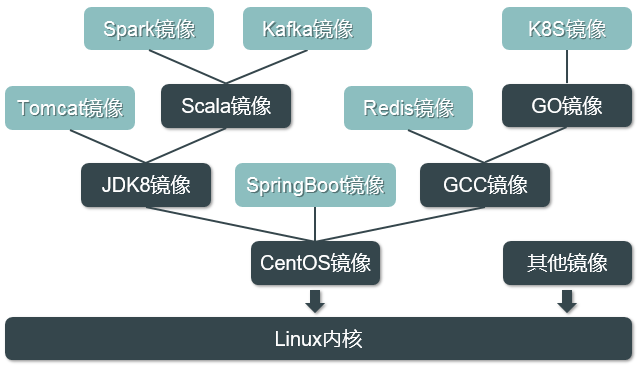

　　Docker镜像采用分层存储格式，每个镜像可依赖其他镜像进行构建，每一层的镜像可被多个镜像引用，上图的镜像依赖关系，K8S镜像其实是CentOS+GCC+GO+K8S这四个软件结合的镜像。这种分层结构能充分共享镜像层，能大大减少镜像仓库占用的空间，而对用户而言，他们所看到的容器，其实是Docker利用UnionFS（联合文件系统）把相关镜像层的目录“联合”到同一个挂载点呈现出来的一个整体，这里需要简单介绍一个UnionFS是什么：

> UnionFS可以把多个物理位置独立的目录（也叫分支）内容联合挂载到同一个目录下，UnionFS允许控制这些目录的读写权限，此外对于只读的文件和目录，它具有“Copy on Write（写时复制）”的特点，即如果对一个只读的文件进行修改，在修改前会先把文件复制一份到可写层（可能是磁盘里的一个目录），所有的修改操作其实都是对这个文件副本进行修改，原来的只读文件并不会变化。其中一个使用UnionFS的例子是：Knoppix，一个用于Linux演示、光盘教学和商业产品演示的Linux发行版，它就是把一个CD/DVD和一个存在在可读写设备（例如U盘）联合挂载，这样在演示过程中任何对CD/DVD上文件的改动都会在被应用在U盘上，不改变原来的CD/DVD上的内容。

　　**UnionFS有很多种，其中Docker中常用的是Overlay2，这是UnionFS的升级版，除此之外还有DeviceMapper、Overlay2、ZFS和 VFS等。Docker镜像的每一层默认存放在`/var/lib/docker/Overlay2/diff`目录中，当用户启动一个容器时，Docker引擎首先在`/var/lib/docker/Overlay2/diff`中新建一个可读写层目录，然后使用UnionFS把该可读写层目录和指定镜像的各层目录联合挂载到`/var/lib/docker/aufs/mnt`里的一个目录中（其中指定镜像的各层目录都以只读方式挂载），通过LXC等技术进行环境隔离和资源控制，使容器里的应用仅依赖mnt目录中对应的挂载目录和文件运行起来**。

　　利用UnionFS写时复制的特点，在启动一个容器时， Docker引擎实际上只是增加了一个可写层和构造了一个Linux容器，这两者都几乎不消耗系统资源，因此Docker容器能够做到秒级启动，一台服务器上能够启动上千个Docker容器，而传统虚拟机在一台服务器上启动几十个就已经非常吃力了，而且虚拟机启动很慢，这是Docker相比于传统虚拟机的两个巨大的优势。

　　当应用只是直接调用了内核功能来运作的情况下，应用本身就能直接作为最底层的层来构建镜像，但因为容器本身会隔绝环境，因此容器内部是无法访问宿主机里文件的（除非指定了某些目录或文件映射到容器内），这种情况下应用代码就只能使用内核的功能。但是Linux内核仅提供了进程管理、内存管理、文件系统管理等一些基础且底层的管理功能，在实际的场景中，几乎所有软件都是基于操作系统来开发的，因此往往都需要依赖操作系统的软件和运行库等，如果这些应用的下一层直接是内核，那么应用将无法运行。所以实际上应用镜像往往底层都是基于一个操作系统镜像来补足运行依赖的。

　　Docker中的操作系统镜像，与平常安装系统时用的ISO镜像不同。ISO镜像里包含了操作系统内核及该发行版系统包含的所有目录和软件，而Docker中的操作系统镜像，不包含系统内核，仅包含系统必备的一些目录（如/etc /proc等）和常用的软件和运行库等，可把操作系统镜像看作内核之上的一个应用，一个封装了内核功能，并为用户编写的应用提供运行环境的工具。应用基于这样的镜像构建，就能够利用上相应操作系统的各种软件的功能和运行库，此外，由于应用是基于操作系统镜像来构建的，就算换到另外的服务器，只要操作系统镜像中被应用使用到的功能能适配宿主机的内核，应用就能正常运行，这就是一次构建到处运行的原因。

　　下图形象的表现出了镜像和容器的关系：

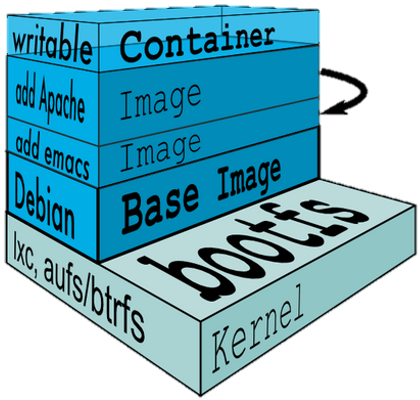

　　上图中Apache应用基于emacs镜像构建，emacs基于Debian系统镜像构建，在启动为容器时，在Apache镜像层之上构造了一个可写层，对容器本身的修改操作都在可写层中进行。Debian是该镜像的基础镜像（Base Image），它提供了内核Kernel的更高级的封装。同时其他的镜像也是基于同一个内核来构建的（以下的BusyBox是一个精简版的操作系统镜像）：


　　这时候就会有一个问题，应用基于操作系统镜像来构建，那如果操作系统镜像本身就很占空间，岂不是镜像的分发不方便，而且镜像仓库占用的空间也会很大。有人已经考虑到这一点，针对不同的场景分别构造了不同的操作系统镜像，下面介绍几种最常用的系统镜像。

## 十二、Docker 数据卷的管理

### 1、Docker 持久化存储

　　根据前面介绍的容器UnionFS写时复制的特点，可知在容器里增加、删除或修改文件，其实都是对可写层里的文件副本进行了操作。在容器关闭后，该可写层也会被删除，对容器的所有修改都会失效，因此需要解决容器内文件持久化的问题。Docker提供了两种方案来实现：

- 把宿主机文件系统里的目录映射到容器内的目录，`如下图所示`。如此一来，容器内在该目录里创建的所有文件，都存储到宿主机的对应目录中，在关闭容器后，宿主机的目录依然存在，再次启动容器时还能读取到之前创建的文件，因此实现了容器的文件持久化。当然同时要明白，如果是对镜像自带文件进行了修改，由于镜像是只读的，该修改操作无法在关闭容器时保存下来，除非在修改了文件后构建一个新的镜像。

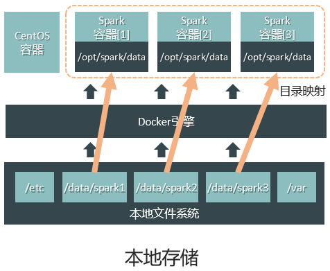

- 把多台宿主机的磁盘目录通过网络联合为共享存储，然后把共享存储中的特定目录映射给特定的容器，`如下图所示`。这样容器在重启时，还是能读取到关闭前创建的文件。生产环境中常用NFS作为共享存储方案。

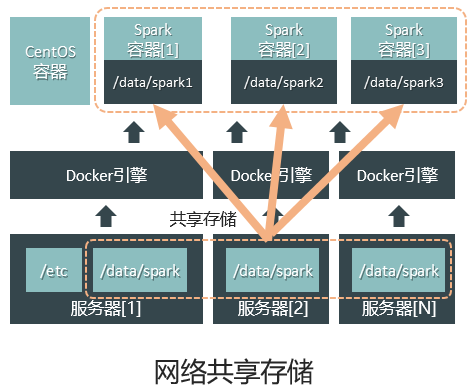

### 2、Docker 挂载时创建卷

#### 1、Docker 挂载卷

```shell
[root@docker01 ~]# docker run -d -p 80:80 -v /data:/usr/share/nginx/html nginx:latest
079786c1e297b5c5031e7a841160c74e91d4ad06516505043c60dbb78a259d09
```

容器内站点目录: /usr/share/nginx/html

#### 2、宿主机写入数据验证

```shell
[root@docker01 ~]# echo "http://www.qianfeng.com" >/data/index.html
[root@docker01 ~]# curl 10.0.0.100
http://www.qianfeng.com
```

#### 3、设置共享卷

 使用同一个卷启动一个新的容器

```shell
[root@docker01 ~]# docker run -d -p 8080:80 -v /data:/usr/share/nginx/html nginx:latest 
351f0bd78d273604bd0971b186979aa0f3cbf45247274493d2490527babb4e42
[root@docker01 ~]# curl 10.0.0.100:8080
http://www.qianfeng.com
```

#### 4、查看卷列表

```shell
[root@docker01 ~]# docker volume ls
DRIVER              VOLUME NAME
```

### 3、Docker 创建卷后挂载

#### 1、创建一个简单卷

```shell
[root@docker01 ~]# docker volume create 
f3b95f7bd17da220e63d4e70850b8d7fb3e20f8ad02043423a39fdd072b83521
[root@docker01 ~]# docker volume ls 
DRIVER              VOLUME NAME
local               f3b95f7bd17da220e63d4e70850b8d7fb3e20f8ad02043423a39fdd072b83521
```

#### 2、创建指定卷名的卷

```shell
[root@docker01 ~]# docker volume create --name nginx
[root@docker01 ~]# docker volume ls 
DRIVER              VOLUME NAME
local               nginx
```

#### 3、查看卷路径

```shell
[root@docker01 ~]# docker volume inspect nginx
[
    {
        "CreatedAt": "2018-02-01T00:39:25+08:00",
        "Driver": "local",
        "Labels": {},
        "Mountpoint": "/var/lib/docker/volumes/nginx/_data",
        "Name": "clsn",
        "Options": {},
        "Scope": "local"
    }
]
```

#### 4、创建 Docker 时挂载卷

```shell
[root@docker01 ~]# docker run -d -p 9000:80 -v clsn:/usr/share/nginx/html nginx:latest 
1434559cff996162da7ce71820ed8f5937fb7c02113bbc84e965845c219d3503
# 宿主机测试
[root@docker01 ~]# echo 'blog.qf.com' >/var/lib/docker/volumes/nginx/_data/index.html 
[root@docker01 ~]# curl 10.0.0.100:9000
blog.qf.com
```

#### 5、实现 Docker 共享卷挂载

```shell
# 共享卷
[root@docker01 ~]# docker run  -d  -P  --volumes-from 079786c1e297 nginx:latest 
b54b9c9930b417ab3257c6e4a8280b54fae57043c0b76b9dc60b4788e92369fb

--volumes-from # 指定共享卷的容器
```

#### 6、查看使用的端口

```shell
[root@docker01 ~]# netstat -lntup 
Active Internet connections (only servers)
Proto Recv-Q Send-Q Local Address           Foreign Address         State       PID/Program name    
tcp        0      0 0.0.0.0:22              0.0.0.0:*               LISTEN      1400/sshd           
tcp        0      0 10.0.0.100:2375         0.0.0.0:*               LISTEN      26218/dockerd       
tcp6       0      0 :::9000                 :::*                    LISTEN      32015/docker-proxy  
tcp6       0      0 :::8080                 :::*                    LISTEN      31853/docker-proxy  
tcp6       0      0 :::80                   :::*                    LISTEN      31752/docker-proxy  
tcp6       0      0 :::22                   :::*                    LISTEN      1400/sshd           
tcp6       0      0 :::32769                :::*                    LISTEN      32300/docker-proxy  
[root@docker01 ~]# curl 10.0.0.100:32769
http://www.nmtui.com
```

### 4、Docker 镜像制作方法

**镜像制作方法有两种：**

#### 1、通过正在运行的容器生成新镜像

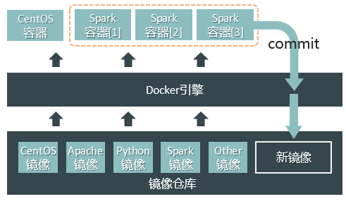

　　当一个容器在运行时，在里面所有的修改都会体现在容器的可写层，Docker提供了commit命令，可以把正在运行的容器，叠加上可写层的修改内容，生成一个新镜像。如上图所示，在容器里新安装Spark组件的，如果关闭容器，Spark组件会随着可写层的消失而消失，如果在关闭容器之前使用commit命令生成新镜像，那么使用新镜像启动为容器时，容器里就会包含Spark组件。

　　这种方式比较简单，但无法直观的设置环境变量、监听端口等内容，适合在简单使用的场景运用。

#### 2、通过 Dockerfile 文件来生成新镜像

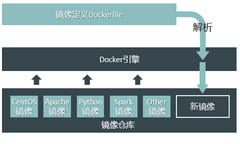

　　Dockerfile是一个定义了镜像创建步骤的文件，Docker引擎通过build命令读取Dockerfile，按定义的步骤来一步步构造镜像。在研发和实施环境中，通过Dockerfile 创建容器是主流做法。下面是一个Dockerfile的例子：

```
FROM ubuntu/14.04                                # 基础镜像
MAINTAINER guest                                 # 制作者签名
RUN apt-get install openssh-server -y            # 安装ssh服务
RUN mkdir /var/run/sshd                          # 创建目录
RUN useradd -s /bin/bash -m -d /home/guest guest # 创建用户
RUN echo ‘guest:123456’| chpasswd                # 修改用户密码
ENV RUNNABLE_USER_DIR /home/guest                # 设置环境变量
EXPOSE 22                                        # 容器内默认开启的端口
CMD ["/usr/sbin/sshd -D"]                        # 启动容器时自动启动ssh服务
```

　　Docker引擎可以根据以上Dockerfile定义的步骤，构造出一个带有ssh服务的Ubuntu镜像。

### 5、手动将正在运行的 Docker 生成新镜像

#### 1、基于 docker 官方 centos 6.8 镜像创建

   官方镜像列表：<https://hub.docker.com/explore/>

##### 1、启动一个 centos6.8 的镜像

```shell
[root@docker01 ~]# docker pull  centos:6.8
[root@docker01 ~]# docker run -it -p 1022:22 centos:6.8  /bin/bash
# 在容器种安装sshd服务，并修改系统密码
[root@582051b2b92b ~]# yum install  openssh-server -y 
[root@582051b2b92b ~]# echo "root:123456" |chpasswd
[root@582051b2b92b ~]#  /etc/init.d/sshd start
```

   启动完成后镜像ssh连接测试

##### 2、将容器提交为镜像

```shell
[root@docker01 ~]# docker commit brave_mcclintock  centos6-ssh
```

##### 3、使用新的镜像启动容器

```shell
[root@docker01 ~]# docker run -d  -p 1122:22  centos6-ssh:latest  /usr/sbin/sshd -D 
5b8161fda2a9f2c39c196c67e2eb9274977e7723fe51c4f08a0190217ae93094
```

##### 4、在容器安装httpd服务

```shell
[root@5b8161fda2a9 /]#  yum install httpd -y
```

##### 5、编写启动脚本脚本

```shell
[root@5b8161fda2a9 /]# cat  init.sh 
#!/bin/bash 
/etc/init.d/httpd start 
/usr/sbin/sshd -D
[root@5b8161fda2a9 /]# chmod +x init.sh 
# 注意执行权限
# -D 将 sshd 启动在前台运行 
```

##### 6、再次提交为新的镜像

```shell
[root@docker01 ~]# docker commit  5b8161fda2a9 centos6-httpd 
sha256:705d67a786cac040800b8485cf046fd57b1828b805c515377fc3e9cea3a481c1
```

##### 7、启动镜像

做好端口映射。并在浏览器中测试访问

```shell
[root@docker01 ~]# docker run -d -p 1222:22 -p 80:80  centos6-httpd /init.sh 
46fa6a06644e31701dc019fb3a8c3b6ef008d4c2c10d46662a97664f838d8c2c
```

#### **2、基于 centos-ssh 编译制作 httpd 镜像**

##### 1、从制作的 centos-ssh 镜像运行一个容器

```shell
docker run -d  -p 2222:22  centos-ssh  /usr/sbin/sshd -D
# -D 将 sshd 启动在前台运行 
```

##### 2、宿主机上通过 ssh 连接容器

```shell
ssh  localhost -p  2222
```

##### 3、下载 httpd 包

```shell
wget http://apache.fayea.com/httpd/httpd-2.4.41.tar.gz
```

##### 4、编译安装 httpd

获取到 apache 的源码包后

我们在 /usr/local/ 目录下面进行解压,然后 cd 到 httpd 目录里面

```shell
tar xf httpd-2.4.41.tar.gz -C /usr/local/
cd /usr/local/httpd-2.4.41
```

接下来我们需要安装一些安装 apache 源码包的依赖包  gcc  make  arp等

```shell
yum  install   gcc  make   apr  apr-util  apr-util-devel  pcre-devel  -y
```

然后我们进行编译

```shell
./configure  --prefix=/usr/local/apache  --enable-mods-shared=most --enable-so
```

安装

```shell
make && make install
```

##### 5、修改配置文件

```shell
vim /usr/local/apache/conf/httpd.conf
# 将里面的 ServerName 改为 localhost:80
```

##### 6、启动 httpd 服务

```shell
/usr/local/apache/bin/httpd
```

##### 7、编写启动 httpd 和 sshd 服务的脚本

```shell
cd /usr/local/sbin

vim run.sh
#!/bin/bash
/usr/sbin/sshd &
/usr/local/apache/bin/httpd  -D FOREGROUND

chmod 755 run.sh                ##修改脚本权限 ，让脚本可以运行

# -D 是让进程在前台运行而不是从shell中分离（到后台运行） 
# FOREGROUND 选项是让Apache不会fork
```

##### 8、提交镜像

```shell
# 然后在宿主机里面进行docker  ps查看容器ID
docker  commit  容器ID  apache：centos
```

##### 9、使用新提交的镜像启动容器

新生成的镜像映射容器的 80 和 22 端口到 2223 8080

```shell
docker run -d  -p  8080:80 -p  2223:22  apache:centos  /usr/local/sbin/run.sh
```

##### 10、宿主机测试访问

验证 apache 环境和 ssh服务

```shell
curl  localhost:8080            # 可以看到httpd服务发布文件里面写的
ssh  localhost  -p  2223        # 测试可不可以连接容器 ，输入密码后，进入容器
```

实现本地文件挂载，在宿主机里面创建/www目录，创建index.html文件

```shell
mkdir /www
echo 'hello world' > /www/index.html
docker  run  -d  -p  2224:22 -p  7070:80  -v  /www:/usr/local/apache/htdocs:ro apache:centos  /usr/local/sbin/run.sh
```

宿主机访问测试：

```shell
curl  localhost:7070            ##可以看到我们从宿主机上面导入到容器发布文件里面的内容
```

### 6、* Dockerfile 自动构建 Docker 镜像

官方构建 dockerffile文件参考

<https://github.com/CentOS/CentOS-Dockerfiles>

#### 1、Dockerfile 指令集

##### 1、什么是 dockerfile?

Dockerfile是一个包含用于组合映像的命令的文本文档。可以使用在命令行中调用任何命令。 Docker通过读取`Dockerfile`中的指令自动生成映像。

`docker build`命令用于从Dockerfile构建映像。可以在`docker build`命令中使用`-f`标志指向文件系统中任何位置的Dockerfile。

例：

```shell
docker build -f /path/to/a/Dockerfile
```

##### 2、Dockerfile 的基本结构

Dockerfile 一般分为四部分：基础镜像信息、维护者信息、镜像操作指令和容器启动时执行指令，

’#’ 为 Dockerfile 中的注释。

##### 3、Dockerfile 文件说明

Docker以从上到下的顺序运行Dockerfile的指令。为了指定基本映像，第一条指令必须是 FROM。一个声明以`＃`字符开头则被视为注释。可以在Docker文件中使用`RUN`，`CMD`，`FROM`，`EXPOSE`，`ENV`等指令。

**在这里列出了一些常用的指令。**

**FROM：指定基础镜像，必须为第一个命令**

```shell
格式：
　　FROM <image>
　　FROM <image>:<tag>
　　FROM <image>@<digest>
示例：
　　FROM mysql:5.6
注：
　　tag或digest是可选的，如果不使用这两个值时，会使用latest版本的基础镜像
```

**MAINTAINER: 维护者信息**

```shell
格式：
    MAINTAINER <name>
示例：
    MAINTAINER mr_eden
    MAINTAINER mr_eden@163.com
    MAINTAINER mr_eden <mr_eden@163.com>
```

**RUN：构建镜像时执行的命令**

```shell
RUN用于在镜像容器中执行命令，其有以下两种命令执行方式：
shell执行
格式：
    RUN <command>
exec执行
格式：
    RUN ["executable", "param1", "param2"]
示例：
    RUN ["executable", "param1", "param2"]
    RUN yum update
    RUN ["/etc/execfile", "arg1", "arg1"]
注：
　　RUN 指令创建的中间镜像会被缓存，并会在下次构建中使用。如果不想使用这些缓存镜像，可以在构建时指定 --no-cache 参数，如：docker build --no-cache
```

**ADD：将本地文件添加到容器中，tar类型文件会自动解压(网络压缩资源不会被解压)，可以访问网络资源，类似 wget**

```shell
格式：
    ADD <src>... <dest>
    ADD ["<src>",... "<dest>"] 用于支持包含空格的路径
示例：
    ADD hom* /mydir/          # 添加所有以"hom"开头的文件
    ADD hom?.txt /mydir/      # ? 替代一个单字符,例如："home.txt"
    ADD test relativeDir/     # 添加 "test" 到 `WORKDIR`/relativeDir/
    ADD test /absoluteDir/    # 添加 "test" 到 /absoluteDir/
```

**COPY：功能类似ADD，但是是不会自动解压文件，也不能访问网络资源**

**CMD：构建容器后调用，也就是在容器启动时才进行调用。**

```shell
格式：
    CMD ["executable","param1","param2"] (执行可执行文件，优先)
    CMD ["param1","param2"] (设置了ENTRYPOINT，则直接调用ENTRYPOINT添加参数)
    CMD command param1 param2 (执行shell内部命令)
示例：
    CMD echo "This is a test." | wc -
    CMD ["/usr/bin/wc","--help"]
注：
 　　CMD不同于RUN，CMD用于指定在容器启动时所要执行的命令，而RUN用于指定镜像构建时所要执行的命令。
```

**ENTRYPOINT：配置容器，使其可执行化。配合CMD可省去"application"，只使用参数。**

```shell
格式：
    ENTRYPOINT ["executable", "param1", "param2"] (可执行文件, 优先)
    ENTRYPOINT command param1 param2 (shell内部命令)
示例：
    FROM ubuntu
    ENTRYPOINT ["top", "-b"]
    CMD ["-c"]
注：
　　　ENTRYPOINT与CMD非常类似，不同的是通过docker run执行的命令不会覆盖ENTRYPOINT，而docker run命令中指定的任何参数，都会被当做参数再次传递给ENTRYPOINT。Dockerfile中只允许有一个ENTRYPOINT命令，多指定时会覆盖前面的设置，而只执行最后的ENTRYPOINT指令。
```

**LABEL：用于为镜像添加元数据**

```shell
格式：
   LABEL <key>=<value> <key>=<value> <key>=<value> ...
示例：
　　LABEL version="1.0" description="这是一个Web服务器" by="IT笔录"
注：
　　使用LABEL指定元数据时，一条LABEL指定可以指定一或多条元数据，指定多条元数据时不同元数据之间通过空格分隔。推荐将所有的元数据通过一条LABEL指令指定，以免生成过多的中间镜像。
```

**ENV：设置环境变量**

```shell
格式：
    ENV <key> <value>  #<key>之后的所有内容均会被视为其<value>的组成部分，因此，一次只能设置一个变量
    ENV <key>=<value> ...  #可以设置多个变量，每个变量为一个"<key>=<value>"的键值对，如果<key>中包含空格，可以使用\来进行转义，也可以通过""来进行标示；另外，反斜线也可以用于续行
示例：
    ENV myName "John Doe"
    ENV myDog "Rex The Dog"
    ENV myCat=fluffy
```

**EXPOSE：指定于外界交互的端口**

```shell
格式：
    EXPOSE <port> [<port>...]
示例：
    EXPOSE 80 443
    EXPOSE 8080
    EXPOSE 11211/tcp 11211/udp
注：
　　EXPOSE并不会让容器的端口访问到主机。要使其可访问，需要在docker run运行容器时通过-p来发布这些端口，或通过-P参数来发布EXPOSE导出的所有端口
```

**VOLUME：用于指定持久化目录**

```shell
格式：
    VOLUME ["/path/to/dir"]
示例：
    VOLUME ["/data"]
    VOLUME ["/var/www", "/var/log/apache2", "/etc/apache2"]
注：
　　一个卷可以存在于一个或多个容器的指定目录，该目录可以绕过联合文件系统，并具有以下功能：
1 卷可以在容器间共享和重用
2 容器并不一定要和其它容器共享卷
3 修改卷后会立即生效
4 对卷的修改不会对镜像产生影响
5 卷会一直存在，直到没有任何容器在使用它
```

**WORKDIR：工作目录，类似于cd命令**

```shell
格式：
    WORKDIR /path/to/workdir
示例：
    WORKDIR /a  (这时工作目录为/a)
    WORKDIR b  (这时工作目录为/a/b)
    WORKDIR c  (这时工作目录为/a/b/c)
注：
　　通过WORKDIR设置工作目录后，Dockerfile中其后的命令RUN、CMD、ENTRYPOINT、ADD、COPY等命令都会在该目录下执行。在使用docker run运行容器时，可以通过-w参数覆盖构建时所设置的工作目录。
```

**USER:指定运行容器时的用户名或 UID，后续的 RUN 也会使用指定用户。使用USER指定用户时，可以使用用户名、UID或GID，或是两者的组合。当服务不需要管理员权限时，可以通过该命令指定运行用户。并且可以在之前创建所需要的用户**

 ```shell
格式:
　　USER user
　　USER user:group
　　USER uid
　　USER uid:gid
　　USER user:gid
　　USER uid:group

 示例：
　　USER www

 注：

　　使用USER指定用户后，Dockerfile中其后的命令RUN、CMD、ENTRYPOINT都将使用该用户。镜像构建完成后，通过`docker run`运行容器时，可以通过-u参数来覆盖所指定的用户。
 ```

**ARG：用于指定传递给构建运行时的变量**

```shell
格式：
    ARG <name>[=<default value>]
示例：
    ARG site
    ARG build_user=www
```

**ONBUILD：用于设置镜像触发器**

```shell
格式：
　　ONBUILD [INSTRUCTION]
示例：
　　ONBUILD ADD . /app/src
　　ONBUILD RUN /usr/local/bin/python-build --dir /app/src
注：
　　当所构建的镜像被用做其它镜像的基础镜像，该镜像中的触发器将会被钥触发 
```

**Dockerfile 例子：**

```shell
# This my first nginx Dockerfile
# Version 1.0

# Base images 基础镜像
FROM centos

#MAINTAINER 维护者信息
MAINTAINER luoyinsheng 

#ENV 设置环境变量
ENV PATH /usr/local/nginx/sbin:$PATH

#ADD  文件放在当前目录下，拷过去会自动解压
ADD nginx-1.16.1.tar.gz /usr/local/   

#RUN 执行以下命令 
RUN yum -y install epel-release.noarch
RUN yum install -y wget lftp gcc gcc-c++ make openssl-devel pcre-devel pcre && yum clean all
RUN useradd -s /sbin/nologin -M www

#WORKDIR 相当于cd
WORKDIR /usr/local/nginx-1.16.1 

RUN ./configure --prefix=/usr/local/nginx --user=www --group=www --with-http_ssl_module --with-pcre && make && make install

#EXPOSE 映射端口
EXPOSE 80

#CMD 运行以下命令
CMD ["nginx","-g","daemon off;"]

docker build -t nginx:v1  .
```

**Dockerfile 图解**


  

#### 2、使用 Dockerfile 来制作 httpd 镜像

##### 1、在宿主机上准备的文件清单

```shell
Dockerfile
#启动ssh和apache服务的角本
run.sh
```

以上文件都放到/root/apache_centos目录下

```shell
mkdir -p /root/apache_centos
cd /root/apache_centos
```

基础镜像：以镜像centos为基础的开放SSH服务的镜像

```
[root@localhost apache_centos]# docker images
REPOSITORY          TAG                 IMAGE ID            CREATED             VIRTUAL SIZE
sshd                dockerfile          411d5fb16366        23 hours ago        278 MB
centos              latest              0f73ae75014f        5 weeks ago         172.3 MB
```

##### 2、准备 run.sh 文件 

在/root/apache_centos目录新建run.sh

```shell
vim run.sh
```

内容如下：

```shell
#!/bin/bash
/usr/sbin/sshd &
/usr/local/apache2/bin/httpd -D FOREGROUND
```

##### 3、准备Dockerfile 

在/root/apache_centos目录新建Dockerfile

```shell
vim Dockerfile
```

文件内容如下：

```dockerfile
#新生成的镜像是基于sshd:dockerfile镜像
FROM centos
MAINTAINER eden
#安装wget
RUN yum install -y wget
WORKDIR /usr/local/src
#下载并解压源码包
RUN wget http://apache.fayea.com/httpd/httpd-2.4.41.tar.gz
RUN tar -zxvf httpd-2.4.41.tar.gz
WORKDIR httpd-2.4.41
#编译安装apache
RUN yum -y install epel-release.noarch && yum makecache fast
RUN yum install -y gcc make apr-devel apr apr-util apr-util-devel pcre-devel
RUN ./configure --prefix=/usr/local/apache2  --enable-mods-shared=most  --enable-so
RUN make
RUN make install
#修改apache配置文件
RUN sed -i 's/#ServerName www.example.com:80/ServerName localhost:80/g' /usr/local/apache2/conf/httpd.conf
#启动apache服务
RUN /usr/local/apache2/bin/httpd
#复制服务启动脚本并设置权限
ADD run.sh /usr/local/sbin/run.sh
RUN chmod 755 /usr/local/sbin/run.sh
#开放80端口
EXPOSE 80
CMD ["/usr/local/sbin/run.sh"]
```

##### 4、生成镜像

```sh
docker build -t apache_dockerfile:centos .
```

查看生成的镜像：

```
[root@localhost apache_centos]# docker images
REPOSITORY          TAG                 IMAGE ID            CREATED             VIRTUAL SIZE
apache_dockerfile   centos              f8f30b4a0ee8        24 minutes ago      440 MB
apache              centos              f92c55dddd07        17 hours ago        423.9 MB
sshd                dockerfile          411d5fb16366        23 hours ago        278 MBZ
centos              latest              0f73ae75014f        5 weeks ago         172.3 MB
```

##### 5、根据镜像生成的容器并进行测试 

###### 1、生成新的容器

```
 docker run -d -p 2222:22 -p 8000:80 apache_dockerfile:centos /usr/local/sbin/run.sh
```

将容器的22端口和80端口分别映射到到宿主机上的2222端口和8000端口,并运行服务脚本。

###### 2、查看新生成的容器

```
[root@localhost apache_centos]# docker ps -a

CONTAINER ID        IMAGE                      COMMAND                CREATED             STATUS                      PORTS                                        NAMES

ae560e497f39        apache_dockerfile:centos   "/usr/local/sbin/run   45 seconds ago      Up 44 seconds               0.0.0.0:2222->22/tcp, 0.0.0.0:8000->80/tcp   condescending_bardeen

6490cd244c10        apache:centos              "/usr/local/apache2/   17 hours ago        Exited (0) 17 hours ago                                                  loving_wright

673e946b57e4        sshd:dockerfile            "/usr/local/sbin/run   18 hours ago        Exited (137) 17 hours ago                                                reverent_bell
```

###### 3、测试 

测试apache

```
[root@localhost apache_centos]# curl localhost:8000

<html><body><h1>It works!</h1></body></html>
```

成功！ 
测试ssh

```
[root@localhost apache_centos]# ssh localhost -p 2222
```

## 十三、Docker 镜像仓库

### 1、创建一个普通仓库

#### 1、创建仓库

```shell
docker run -d -p 5000:5000 --restart=always --name registry -v /opt/myregistry:/var/lib/registry  registry 
```

#### 2、修改配置文件，使之支持http

```shell
[root@docker01 ~]# cat  /etc/docker/daemon.json 
{
  "registry-mirrors": ["https://registry.docker-cn.com"],
  "insecure-registries": ["10.0.0.100:5000"]
}
```

重启docker让修改生效

```shell
[root@docker01 ~]# systemctl restart  docker.service
```

#### 3、修改镜像标签

```shell
[root@docker01 ~]# docker tag  busybox:latest  10.0.0.100:5000/clsn/busybox:1.0
[root@docker01 ~]# docker images
REPOSITORY                      TAG                 IMAGE ID            CREATED             SIZE
centos6-ssh                     latest              3c2b1e57a0f5        18 hours ago        393MB
httpd                           2.4                 2e202f453940        6 days ago          179MB
10.0.0.100:5000/clsn/busybox    1.0                 5b0d59026729        8 days ago          1.15MB
```

#### 4、将新打标签的镜像上传镜像到仓库

```shell
[root@docker01 ~]# docker push 10.0.0.100:5000/clsn/busybox
```

#### 5、将新的镜像拉取下来(**拉取需要带版本**)

```shell
[root@docker01 ~]# docker pull 10.0.0.100:5000/clsn/busybox:1.0
```

#### 6、查看仓库镜像

```shell
[root@docker01 ~]# curl 10.0.0.100:5000/v2/_catalog
[root@docker01 ~]# curl 127.0.0.1:5000/v2/_catalog
```

### 2、创建带 basic 认证的仓库

#### 1、安装加密工具

```shell
[root@docker01 eden]# yum install httpd-tools  -y
```

#### 2、设置认证密码

```shell
mkdir /opt/registry-var/auth/ -p
htpasswd  -Bbn eden 123456  > /opt/registry-var/auth/htpasswd
```

#### 3、启动容器，在启动时传入认证参数

```shell
docker run -d -p 5000:5000 -v /opt/registry-var/auth/:/auth/ -e "REGISTRY_AUTH=htpasswd" -e "REGISTRY_AUTH_HTPASSWD_REALM=Registry Realm" -e "REGISTRY_AUTH_HTPASSWD_PATH=/auth/htpasswd" registry

REGISTRY_AUTH=htpasswd #以htpasswd 的方式认证
REGISTRY_AUTH_HTPASSWD_REALM=Registry Realm  # 注册认证
REGISTRY_AUTH_HTPASSWD_PATH=/auth/htpasswd  # 认证的用户密码
```

#### 4、使用验证用户测试

```shell
# 登陆用户
[root@docker01 ~]# docker login 10.0.0.100:5000 
Username: eden  
Password: 123456
Login Succeeded
# 推送镜像到仓库
[root@docker01 ~]# docker push 10.0.0.100:5000/eden/busybox 
The push refers to repository [10.0.0.100:5000/eden/busybox]
4febd3792a1f: Pushed 
1.0: digest: sha256:4cee1979ba0bf7db9fc5d28fb7b798ca69ae95a47c5fecf46327720df4ff352d size: 527
#认证文件的保存位置
[root@docker01 ~]# cat .docker/config.json 
{
    "auths": {
        "10.0.0.100:5000": {
            "auth": "Y2xzbjoxMjM0NTY="
        },
        "https://index.docker.io/v1/": {
            "auth": "Y2xzbjpIenNAMTk5Ng=="
        }
    },
    "HttpHeaders": {
        "User-Agent": "Docker-Client/17.12.0-ce (linux)"
    }
}

[root@docker01 ~]# docker pull 10.0.0.100:5000/eden/busybox:v1 
```

   至此，包含认证的 docker 镜像仓库搭建完成

### 3、docker 私有仓库增加 webUI 访问

#### 1、为什么要增加webUI

​    1、增加仓库的可读性

​    2、方便所有使用仓库的人查看

#### 2、用哪个WEBUI来做

​     [docker-registry-web](https://hub.docker.com/r/hyper/docker-registry-web/)

#### 3、具体步骤

#####     1、拉取镜像

```shell
docker pull hyper/docker-registry-web
```

#####     2、启动 webui 同时连接仓库

```shell
docker run -d --restart=always -p 8080:8080 --name registry-web --link docker-repo -e REGISTRY_URL=http://10.0.0.246:5000/v2 -e REGISTRY_NAME=localhost:5000 hyper/docker-registry-web
```

#####     3、访问验证

http://10.0.0.246:8080

#### 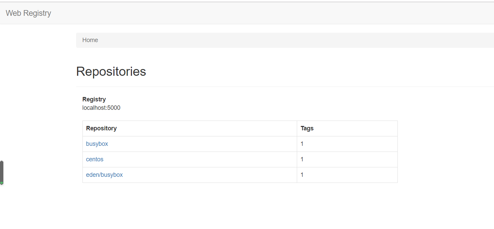4、参考文献

https://hub.docker.com/r/hyper/docker-registry-web/

### 4、Docker 企业级镜像仓库 Harbor

#### 1、容器管理

```shell
[root@docker01 ~]# mkdir /opt/harbor
[root@docker01 ~]# cd /opt/harbor
[root@docker01 harbor]# pwd
/opt/harbor
[root@docker01 harbor]# docker-compose stop
```

#### 2、安装docker、docker-compose

下载 harbor

```shell
cd /opt/harbor && wget https://storage.googleapis.com/harbor-releases/harbor-offline-installer-v1.6.1.tgz
tar xf harbor-offline-installer-v1.6.1.tgz
```

```shell
# 快速安装compose
curl -L https://get.daocloud.io/docker/compose/releases/download/1.3.1/docker-compose-`uname -s`-`uname -m` > /usr/local/bin/docker-compose
chmod +x /usr/local/bin/docker-compose
```

#### 3、修改主机及web界面密码

```shell
[root@docker01 harbor]# vim harbor.cfg 
    ···
    hostname = 10.0.0.100
    harbor_admin_password = Harbor12345
    ···
```

#### 4、执行安装脚本

```shell
[root@docker01 harbor]# ./install.sh
```

#### 5、浏览器访问

 http://10.0.0.100

 

#### 6、添加一个项目

 

#### 7、准备推送镜像环境

```shell
[root@docker02 ~]# docker tag centos:6.8  10.0.0.100/library/busybox:v1
[root@docker02 ~]#  
[root@docker02 ~]# docker images 
REPOSITORY                  TAG                 IMAGE ID            CREATED             SIZE
busybox                     latest              5b0d59026729        8 days ago          1.15MB
10.0.0.100/clsn/centos6.8   1.0                 6704d778b3ba        2 months ago        195MB
centos                      6.8                 6704d778b3ba        2 months ago        195MB

vim /etc/docker/daemon.json
{
  "registry-mirrors": ["https://mb8n4btz.mirror.aliyuncs.com"],
  "insecure-registries": ["https://10.0.0.100"]
}

[root@docker02 ~]# docker login 10.0.0.100
Username: admin
Password: 
WARNING! Your password will be stored unencrypted in /root/.docker/config.json.
Configure a credential helper to remove this warning. See
https://docs.docker.com/engine/reference/commandline/login/#credentials-store

Login Succeeded
```

#### 8、推送镜像到指定项目

```shell
[root@docker02 ~]# docker push 10.0.0.100/library/busybox:v1
The push refers to repository [10.0.0.100/library/busybox]
0d315111b484: Pushed 
v1: digest: sha256:895ab622e92e18d6b461d671081757af7dbaa3b00e3e28e12505af7817f73649 size: 527
```

#### 9、在 web 界面里查看

 

## 十四、Docker-compose 编排工具

### 1、安装 docker-compose

安装 docker-compose (**两种安装方式**)

```shell
# 安装 pip 软件
yum install -y python2-pip
# 安装 docker-compose
pip install docker-compose

# 快速安装 docker-compose
curl -L https://get.daocloud.io/docker/compose/releases/download/1.24.0/docker-compose-`uname -s`-`uname -m` > /usr/local/bin/docker-compose
chmod +x /usr/local/bin/docker-compose
```

国内开启 pip 下载加速：<http://mirrors.aliyun.com/help/pypi>

```shell
mkdir ~/.pip/
cat > ~/.pip/pip.conf <<'EOF'
[global]
index-url = https://mirrors.aliyun.com/pypi/simple/
[install]
trusted-host=mirrors.aliyun.com
EOF
```

### 2、编排启动镜像

#### 1、创建文件目录

```shell
[root@docker01 ~]# mkdir /opt/my_wordpress/
[root@docker01 ~]# cd /opt/my_wordpress/
```

#### 2、编写编排文件（让脚本自动拉取镜像）

```yaml
[root@docker01 my_wordpress]# vim docker-compose.yml
version: '3'
services:
   db:
     image: mysql:5.7
     volumes:
       - /data/db_data:/var/lib/mysql
     restart: always
     environment:
       MYSQL_ROOT_PASSWORD: somewordpress
       MYSQL_DATABASE: wordpress
       MYSQL_USER: wordpress
       MYSQL_PASSWORD: wordpress
   wordpress:
     depends_on:
       - db
     image: wordpress:latest
     volumes:
       - /data/web_data:/var/www/html
     ports: 
       - "8000:80"
     restart: always
     environment:
       WORDPRESS_DB_HOST: db:3306
       WORDPRESS_DB_USER: wordpress
       WORDPRESS_DB_PASSWORD: wordpress
```

#### 3、启动

```shell
[root@docker01 my_wordpress]# docker-compose up
　　#启动方法：docker-compose up
　　#后台启动方法：docker-compose up -d
```

#### 4、浏览器上访问

[http://10.0.0.100:8000](http://10.0.0.100:8000/)

   **注意： 不要选择中文，很慢**

   **进行 wordpress 的安装即可**

### 3、haproxy 代理后端 docker容器

#### 1、修改编排脚本

```yaml
[root@docker01 my_wordpress]# cat docker-compose.yml 
---
version: '3'
services:
   db:
     image: mysql:5.7
     volumes:
       - /data/db_data:/var/lib/mysql
     restart: always
     environment:
       MYSQL_ROOT_PASSWORD: somewordpress
       MYSQL_DATABASE: wordpress
       MYSQL_USER: wordpress
       MYSQL_PASSWORD: wordpress
   wordpress:
     depends_on:
       - db
     image: wordpress:latest
     volumes:
       - /data/web_data:/var/www/html
     ports: 
       - "80"
     restart: always
     environment:
       WORDPRESS_DB_HOST: db:3306
       WORDPRESS_DB_USER: wordpress
       WORDPRESS_DB_PASSWORD: wordpress
```

#### 2、同时启动**两台** wordpress

```shell
[root@docker01 my_wordpress]# docker-compose scale db=1 wordpress=2 
WARNING: The scale command is deprecated. Use the up command with the --scale flag instead.
Creating my_wordpress_db_1 ... done
Creating my_wordpress_wordpress_1 ... done
Creating my_wordpress_wordpress_2 ... done
```

#### 3、安装 haproxy

```shell
[root@docker01 ~]# yum install haproxy -y
```

#### 4、修改haproxy配置文件

   关于配置文件的详细说明，参考：<https://www.cnblogs.com/MacoLee/p/5853413.html>

```shell
[root@docker01 ~]#cp /etc/haproxy/haproxy.cfg{,.bak}
[root@docker01 ~]# vim /etc/haproxy/haproxy.cfg
global
    log         127.0.0.1 local2
    chroot      /var/lib/haproxy
    pidfile     /var/run/haproxy.pid
    maxconn     4000
    user        haproxy
    group       haproxy
    daemon
    stats socket /var/lib/haproxy/stats level admin  #支持命令行控制
defaults
    mode                    http
    log                     global
    option                  httplog
    option                  dontlognull
    option http-server-close
    option forwardfor       except 127.0.0.0/8
    option                  redispatch
    retries                 3
    timeout http-request    10s
    timeout queue           1m
    timeout connect         10s
    timeout client          1m
    timeout server          1m
    timeout http-keep-alive 10s
    timeout check           10s
    maxconn                 3000
listen stats
    mode http
    bind 0.0.0.0:8888
    stats enable
    stats uri     /haproxy-status 
    stats auth    admin:123456
frontend frontend_www_example_com
    bind 10.0.0.100:8000
    mode http
    option httplog
    log global
    default_backend backend_www_example_com
backend backend_www_example_com
    option forwardfor header X-REAL-IP
    option httpchk HEAD / HTTP/1.0
    balance roundrobin
    server web-node1  10.0.0.100:32768 check inter 2000 rise 30 fall 15
    server web-node2  10.0.0.100:32769 check inter 2000 rise 30 fall 15
    
      2）check  健康检测 默认是向服务器对应端口做健康检查
           检查的方法有：
                 addr：检测使用ip地址
                 port：针对端口检测
                 inter  <delay>  连续两次的检测之间的时间间隔默认为2000ms
                 rise  <count> 连续检测多少次，结果成功则服务器标记ok 默认2次
　　　　          fall  <count> 连续检测多次，结果为失败，则标记不可用默认3次
　　详情移步：　https://www.cnblogs.com/huxl1/p/9497665.html　
　　          https://www.cnblogs.com/kevingrace/p/6138150.html
```

#### 5、启动 haproxy

```shell
systemctl start haproxy
systemctl enable haproxy
```

#### 6、编写php测试页

放到/data/web_data下，在浏览器中访问可以查看当前访问节点信息

```php
[root@docker01 web_data]# vim check.php
<html>
    <head>
        <title>PHP测试</title>
    </head>
    <body>
        <?php  echo '<p>Hello World </p>'; ?>
        <?php  echo "访问的服务器地址是:"."<fontcolor=red>".$_SERVER['SERVER_ADDR']."</font>"."<br>";
        echo"访问的服务器域名是:"."<fontcolor=red>".$_SERVER['SERVER_NAME']."</font>"."<br>";
        ?>
    </body>
</html>
```

#### 7、使用浏览器访问测试页面

hapeoxy 监听的8000端口可以看到负载的情况


#### 7、使用浏览器访问状态页面

####  <http://10.0.0.100:8888/haproxy-status>

   可以看到后端节点的监控状况，

​                                                            

#### 8、安装 socat 直接操作 socket 控制 haproxy

##### 1、安装软件

```shell
yum install socat.x86_64 -y
```

##### 2、查看帮助

```shell
[root@docker01 web_data]# echo "help"|socat stdio /var/lib/haproxy/stats
```

##### 3、下线后端节点

```shell
echo "disable server backend_www_example_com/web-node2"|socat stdio /var/lib/haproxy/stats
```

##### 4、上线后端节点

```shell
echo "enable server backend_www_example_com/web-node3"|socat stdio /var/lib/haproxy/stats
```

## 十五、Docker 网络类型

​                                                            


### 1、docker的网络类型

| **类型**      | **说明**                                                     |
| ------------- | ------------------------------------------------------------ |
| **None**      | 不为容器配置任何网络功能，没有网络 --net=none                |
| **Container** | 与另一个运行中的容器共享Network Namespace，--net=container:containerID |
| **Host**      | 与主机共享Network Namespace，--net=host                      |
| **Bridge**    | Docker设计的NAT网络模型**（默认类型）**                      |

**Bridge**默认docker网络隔离基于网络命名空间，在物理机上创建docker容器时会为每一个docker容器分配网络命名空间，并且把容器IP桥接到物理机的虚拟网桥上。

### 2、不为容器配置网络功能

此模式下创建容器是不会为容器配置任何网络参数的，如：容器网卡、IP、通信路由等，全部需要自己去配置。

```shell
[root@docker01 ~]# docker run  -it --network none busybox:latest  /bin/sh 
/ # ip a
1: lo: <LOOPBACK,UP,LOWER_UP> mtu 65536 qdisc noqueue 
    link/loopback 00:00:00:00:00:00 brd 00:00:00:00:00:00
    inet 127.0.0.1/8 scope host lo
       valid_lft forever preferred_lft forever
```

### 3、与其他容器共享网络配置(Container）

此模式和host模式很类似，只是此模式创建容器共享的是其他容器的IP和端口而不是物理机，此模式容器自身是不会配置网络和端口，创建此模式容器进去后，你会发现里边的IP是你所指定的那个容器IP并且端口也是共享的，而且其它还是**互相隔离**的，如进程等。

```shell
[root@docker01 ~]# docker run  -it --network container:mywordpress_db_1  busybox:latest  /bin/sh 
/ # ip a
1: lo: <LOOPBACK,UP,LOWER_UP> mtu 65536 qdisc noqueue 
    link/loopback 00:00:00:00:00:00 brd 00:00:00:00:00:00
    inet 127.0.0.1/8 scope host lo
       valid_lft forever preferred_lft forever
105: eth0@if106: <BROADCAST,MULTICAST,UP,LOWER_UP,M-DOWN> mtu 1500 qdisc noqueue 
    link/ether 02:42:ac:12:00:03 brd ff:ff:ff:ff:ff:ff
    inet 172.18.0.3/16 brd 172.18.255.255 scope global eth0
       valid_lft forever preferred_lft forever
```

### 4、使用宿主机网络

此模式创建的容器没有自己独立的网络命名空间，是和物理机共享一个Network Namespace，并且共享物理机的所有端口与IP，并且这个模式认为是不安全的。

```shell
[root@docker01 ~]# docker run  -it --network host  busybox:latest  /bin/sh
```

### 5、查看网络列表

```shell
[root@docker01 ~]# docker network list 
NETWORK ID          NAME                  DRIVER              SCOPE
b15e8a720d3b        bridge                bridge              local
345d65b4c2a0        host                  host                local
bc5e2a32bb55        mywordpress_default   bridge              local
ebf76eea91bb        none                  null                local
```

### 6、用 PIPEWORK 为 docker 容器配置独立 IP

官方网站：<https://github.com/jpetazzo/pipework>

宿主环境：centos7.4

#### 1、安装 pipework

```shell
wget https://github.com/jpetazzo/pipework/archive/master.zip
unzip master.zip 
cp pipework-master/pipework  /usr/local/bin/
chmod +x /usr/local/bin/pipework
```

#### 2、配置桥接网卡

安装桥接工具

```shell
yum install bridge-utils.x86_64 -y
```

修改网卡配置，实现桥接

```shell
# 修改eth0配置，让br0实现桥接
[root@docker01 ~]# cat /etc/sysconfig/network-scripts/ifcfg-eth0 
TYPE=Ethernet
BOOTPROTO=static
NAME=eth0
DEVICE=eth0
ONBOOT=yes
BRIDGE=br0
[root@docker01 ~]# cat /etc/sysconfig/network-scripts/ifcfg-br0 
TYPE=Bridge
BOOTPROTO=static
NAME=br0
DEVICE=br0
ONBOOT=yes
IPADDR=10.0.0.100
NETMASK=255.255.255.0
GATEWAY=10.0.0.254
DNS1=223.5.5.5
# 重启网络
[root@docker01 ~]# systemctl restart network
```

#### 3、pipework 配置 Docker 的三个简单场景

##### 1、pipework+linux bridge：配置 Docker 单主机容器（临时配置，容器重启失效）

```shell
#主机A：192.168.187.143
#清理主机A上的容器并创建两个容器nginx1、nginx2
docker rm  -f `docker ps -a -q`
docker run -itd --name nginx1 -p 8081:80  --net=none nginx
docker run -itd --name nginx2 -p 8082:80  --net=none nginx

#使用 pipework 建立网桥 br0，为容器 nginx1 和 nginx2 添加新的网卡，并将它们连接到br0上
pipework br0 nginx1 10.31.165.84/24@10.31.165.1
pipework br0 nginx2 10.31.165.184/24@10.31.165.1

#在容器nginx1和nginx2内部可以看到有一个网卡地址分别如上，可以访问并ping通
curl -I 10.31.165.184
curl -I 10.31.165.84
```

##### 2、pipework+OVS：单主机 Docker 容器 VLAN 划分（了解）

pipework 不仅可以使用 Linux bridge 连接 Docker 容器，还可以与 OpenVswitch 结合，实现 Docker 容器的 VLAN 划分。

```shell
#主机A的IP地址为:192.168.187.147
#在主机A上创建4个Docker容器，test1、test2、test3、test4

docker run -itd --name test1 --net=none busybox sh
docker run -itd --name test2 --net=none busybox sh
docker run -itd --name test3 --net=none busybox sh
docker run -itd --name test4 --net=none busybox sh

#安装 openvswitch
yum -y install openvswitch
systemctl start openvswitch

#将test1，test2划分到一个vlan中，vlan在mac地址后加@指定，此处mac地址省略
pipework ovs0 test1 192.168.0.1/24 @100
pipework ovs0 test2 192.168.0.2/24 @100

#将test3，test4划分到另一个vlan中
pipework ovs0 test3 192.168.0.3/24 @200
pipework ovs0 test4 192.168.0.4/24 @200
 
#此时进入容器test1
ping 10.0.0.2    # 可以通信
ping 10.0.0.3    # 不可以通信
```

这个功能其实是由于 OpenVSwitch 本身支持 VLAN 功能，在将 veth pair 的一端加入ovs0 网桥时，指定了tag。底层的操作是

```shell
ovs-vsctl add-port ovs0 veth* tag=100
```

##### 3、Docker pipework  跨主机通信

1、配置跨主机通信

```shell
pipework br0 $(docker run -d -it -p 80:80 --name nginx nginx) 10.0.0.220/24@10.0.0.254
```

2、在其他主机上测试端口及连通性

```shell
[root@docker01 ~]# curl 10.0.0.220
<html><body><h1>It works!</h1></body></html>
[root@docker01 ~]# ping 10.0.0.220 -c 1
PING 10.0.0.220 (10.0.0.220) 56(84) bytes of data.
64 bytes from 10.0.0.220: icmp_seq=1 ttl=64 time=0.043 ms
```

### 7、Docker 跨主机通信之 macvlan（附加）

#### 1、简介

macvlan接口类型简单说类似于子接口，但相比子接口来说，macvlan接口拥有自己独立的mac地址，因此使用macvlan接口可以允许更多的二层操作。macvlan有四种模式：**VEPA**，**bridge**，**Private** 和 **Passthru**

macvlan 接口会监听并接收链路上到达本mac地址的报文，因此macvlan（除bridge外）仅能向外部网络发送报文，并接受目的为本机mac的报文。

```
                                    +---------------+
                                    | network stack |
                                    +---------------+
                                        |  |  |  |
                              +---------+  |  |  +------------------+
                              |            |  +------------------+  |
                              |            +------------------+  |  |
                              |                               |  |  |
                              |            aa  +----------+   |  |  |
                              | eth0     +-----| macvlan0 |---+  |  |
                              |         /      +----------+      |  |
 Wire   +------+       +---------------+   bb  +----------+      |  |
--------| eth0 |------/ if dst mac is /--------| macvlan1 |------+  |
        +------+     +---------------+ \       +----------+         |
                                        \  cc  +----------+         |
                                         +-----| macvlan2 |---------+
                                               +----------+
```

#### 2、模拟环境

**windows主机上安装 vmware centos虚拟机作为host主机，centos上安装docker**

#### 3、VEPA模式

在这种模式下，macvlan设备不能直接接收在同一个物理网卡的其他macvlan设备的数据包，但是其他macvlan设备可以将数据包通过物理网卡发送出去，然后通过 hairpin 设备返回的给其他 macvlan 设备，用于管理内部 vm 直接的流量，并且需要特殊设备支持。

```
nat hairpin 也可以叫端口回流或者NAT回环
内网：192.168.1.2，内网服务器：192.168.1.254
外网：10.0.0.2
不开启nat hairpin，访问流量路径是：从192.168.1.2直接走内网访问服务器192.168.1.254。
在端口开启nat hairpin enable后，路径就是192.168.1.2到NAT端口10.0.0.2转换后再访问192.168.1.254。相当于从外网NAT接口绕了一圈再访问192.168.1.254。
这样做的好处就是，所有访问服务器的流量都是经过防火墙控制，从而拒绝了来自内网的内部攻击（防止内鬼）
```

使用如下命令创建一个容器的 vepa模式的 macvlan，名称为 vepamv,其中192.168.128.0和192.168.128.2 分别为docker所在的host主机eth0的网段和网关。

```shell
docker network create -d macvlan --subnet=192.168.128.0/24 --gateway=192.168.128.2 -o parent=eth0 -o macvlan_mode=vepa vepamv
```

使用上述网络运行2个容器

```shell
docker run -itd --net=vepamv --ip=192.168.128.222 --name=centos1-2 f322035379ab /bin/bash
docker run -itd --net=vepamv --ip=192.168.128.233 --name=centos1-3 f322035379ab /bin/bash
```

查看网络信息，可以看到驱动类型为macvlan，macvlan模型为vepa，两个网卡有独立的mac地址，底层物理网卡为eth0

```shell
[root@localhost ~]# docker network inspect evapmv
[
    {
        "Name": "vepamv",
        "Id": "84af6a040cf1e1063c122ed9b80b421ef2896d31100c87bec9cde7a0e8690833",
        "Created": "2018-09-16T22:16:23.938521926+08:00",
        "Scope": "local",
        "Driver": "macvlan",
        "EnableIPv6": false,
        "IPAM": {
            "Driver": "default",
            "Options": {},
            "Config": [
                {
                    "Subnet": "192.168.128.0/24",
                    "Gateway": "192.168.128.2"
                }
            ]
        },
        "Internal": false,
        "Attachable": false,
        "Containers": {
            "49eb565de8f9ec41ba69285c6ced2971a861a104247dc10c257ce3dd7a74d006": {
                "Name": "centos1-3",
                "EndpointID": "adc576f3cfa1c5b6649f3d322ba11487e8ef3eadebeed72eb830f55a8a5768f6",
                "MacAddress": "02:42:c0:a8:80:e9",
                "IPv4Address": "192.168.128.233/24",
                "IPv6Address": ""
            },
            "5f0fe3a769ca17717afea9f1d444b00a4380289b2744d02d5ade260e7e687868": {
                "Name": "centos1-2",
                "EndpointID": "caa0766bb243e43986c1ee435b9d2666c615b92c06964c749d5e93ba7ef8849f",
                "MacAddress": "02:42:c0:a8:80:de",
                "IPv4Address": "192.168.128.222/24",
                "IPv6Address": ""
            }
        },
        "Options": {
            "macvlan_mode": "vepa",
            "parent": "eth0"
        },
        "Labels": {}
    }
]
```

在centos1-2中ping centos1-3发现无法ping通，因为本地环境上并没有开启hairpin模式的交换机或路由器，报文发送到链路上之后无法返回来。即无法在internal内部进行报文传输

```shell
[root@0dd61dcf26f3 /]# ping 192.168.128.222
PING 192.168.128.222 (192.168.128.222) 56(84) bytes of data.
From 192.168.128.233 icmp_seq=1 Destination Host Unreachable
From 192.168.128.233 icmp_seq=2 Destination Host Unreachable
```

但在external network的机器（192.168.128.1）是可以直接访问该容器的（首先该容器的IP属于external network）

```shell
D:/> ping 192.168.128.222
PING 192.168.128.222 (192.168.128.222) 56(84) bytes of data.
64 bytes from 192.168.128.222: icmp_seq=1 ttl=64 time=0.080 ms
64 bytes from 192.168.128.222: icmp_seq=1 ttl=64 time=0.080 ms
```

#### 4、private模式

该模式类似于VEPA，但在 VEPA 基础上添加了新的特性，即如果两个 macvlan 在同一个网卡上，这两个macvlan接口无法通信，即使使用启用 hairpin 的交换机或路由器。仍然使用上述条件构造从192.168.128.222 到192.168.128.233 的arp请求报文，可以看到192.168.128.222并没有回复192.168.128.233的arp请求。但是从windows 机器直接ping 192.168.128.222是可以ping通的。

private模式下隔离了来自同网卡的 macvlan 的广播报文。


####  5、passthru模式

该模式仅允许一块网卡上面部署一个macvlan接口，其他使用macvlan的容器将启动失败，但只要不使用macvlan，该容器还是可以正常启动。如果需要在单个物理网卡上启动多个macvlan_mode=passthru的容器，可以使用子接口方式，参见 https://blog.csdn.net/daye5465/article/details/77412619。

```sh
[root@localhost home]# docker run -itd --net=passmv f322 /bin/bash
17b0f2c446671f716bcf136e9c9d8c781ec84901c87e1d4ae0a20aa98e5fb710
/usr/bin/docker-current: Error response from daemon: failed to create the macvlan port: invalid argument.
[root@localhost home]# docker run -itd f322 /bin/bash
6aac5b6a284b1d5c2294936d7943007947a602fc7cdcc133c32b5e861ed17865
```

#### 6、bridge 模式（docker默认模式）

在这种模式下，寄生在同一个物理设备的 macvlan 设备可以直接通讯，不需要外接的 hairpin 设备帮助，使用如下的命令创建一个bridge 的 macvlan网络

```shell
docker network create -d macvlan --subnet=192.168.226.0/24 --gateway=192.168.226.2 -o parent=eth0 -o macvlan_mode=bridge bridmv
```

使用 bridge 可以保证在不使用 hairpin 设备的前提下实现 inter-network 和 external-network 的连通，查看docker的 bridge 信息如下

```shell
[root@localhost netns]# docker network inspect bridmv
[
    {
        "Name": "bridmv",
        "Id": "b2920c8721701d47ac891aa8528d95f60e6a71a1a7485d0e2f21bae30f8604bf",
        "Created": "2018-09-18T09:16:34.549499448+08:00",
        "Scope": "local",
        "Driver": "macvlan",
        "EnableIPv6": false,
        "IPAM": {
            "Driver": "default",
            "Options": {},
            "Config": [
                {
                    "Subnet": "192.168.226.0/24",
                    "Gateway": "192.168.226.2"
                }
            ]
        },
        "Internal": false,
        "Attachable": false,
        "Containers": {
            "031e1de7ed2cf13c25083e98d9cee131ea00a466fd169a0531c70818a25c7a7f": {
                "Name": "centos2",
                "EndpointID": "b95efe7ddb8d2c4ce9228c06f019601c18daedbf7fc79462939efba128e84936",
                "MacAddress": "02:42:c0:a8:80:e9",
                "IPv4Address": "192.168.128.233/24",
                "IPv6Address": ""
            },
            "8e23e7011f7cbc0962ba975974ae313dd4dab10a4114775b689ba70ae88dac72": {
                "Name": "centos1",
                "EndpointID": "d2fb36b842f89128e3a862fc70624d4946b703bf0bb921fd11839d7f775fa8e0",
                "MacAddress": "02:42:c0:a8:80:de",
                "IPv4Address": "192.168.128.222/24",
                "IPv6Address": ""
            }
        },
        "Options": {
            "macvlan_mode": "bridge",
            "parent": "eth0"
        },
        "Labels": {}
    }
]
```

查看/var/run/docker/netns，有2个ns，这两个就是192.168.128.222和192.168.128.233的容器网络空间

```shell
[root@localhost netns]# ll /var/run/docker/netns/
total 0
-r--r--r--. 1 root root 0 Sep 18 09:18 59b305d0d01e
-r--r--r--. 1 root root 0 Sep 18 09:18 a41362fa7ed2
```

macvlan的bridge无法使用brctl show获得相关信息。查看容器网卡信息如下，可以看到Ip地址是与两个容器对应的，在容器的eth后面有一个@if2，表示有一个接口与该接口对应，根据macvlan的原理，该接口为macvlan所在的host主机的eth0接口

```shell
[root@localhost netns]# ip netns exec 59b305d0d01e ip a
1: lo: <LOOPBACK,UP,LOWER_UP> mtu 65536 qdisc noqueue state UNKNOWN group default qlen 1000
    link/loopback 00:00:00:00:00:00 brd 00:00:00:00:00:00
    inet 127.0.0.1/8 scope host lo
       valid_lft forever preferred_lft forever
    inet6 ::1/128 scope host
       valid_lft forever preferred_lft forever
18: eth0@if2: <BROADCAST,MULTICAST,UP,LOWER_UP> mtu 1500 qdisc noqueue state UNKNOWN group default
    link/ether 02:42:c0:a8:80:e9 brd ff:ff:ff:ff:ff:ff link-netnsid 0
    inet 192.168.226.233/24 scope global eth0
       valid_lft forever preferred_lft forever
    inet6 fe80::42:c0ff:fea8:e2e9/64 scope link
       valid_lft forever preferred_lft forever
[root@localhost netns]# ip netns exec a41362fa7ed2 ip a
1: lo: <LOOPBACK,UP,LOWER_UP> mtu 65536 qdisc noqueue state UNKNOWN group default qlen 1000
    link/loopback 00:00:00:00:00:00 brd 00:00:00:00:00:00
    inet 127.0.0.1/8 scope host lo
       valid_lft forever preferred_lft forever
    inet6 ::1/128 scope host
       valid_lft forever preferred_lft forever
19: eth0@if2: <BROADCAST,MULTICAST,UP,LOWER_UP> mtu 1500 qdisc noqueue state UNKNOWN group default
    link/ether 02:42:c0:a8:80:de brd ff:ff:ff:ff:ff:ff link-netnsid 0
    inet 192.168.226.222/24 scope global eth0
       valid_lft forever preferred_lft forever
    inet6 fe80::42:c0ff:fea8:e2de/64 scope link
       valid_lft forever preferred_lft forever
```

在host主机上查看，网卡序号为2的正是macvlan接口所在的网卡eth0，即使用host的eth0作为了bridge(--parent指定)

```shell
[root@localhost netns]# ip link
1: lo: <LOOPBACK,UP,LOWER_UP> mtu 65536 qdisc noqueue state UNKNOWN mode DEFAULT group default qlen 1000
    link/loopback 00:00:00:00:00:00 brd 00:00:00:00:00:00
2: eth0: <BROADCAST,MULTICAST,UP,LOWER_UP> mtu 1500 qdisc pfifo_fast state UP mode DEFAULT group default qlen 1000
    link/ether 00:0c:29:f1:38:bf brd ff:ff:ff:ff:ff:ff
3: virbr0: <NO-CARRIER,BROADCAST,MULTICAST,UP> mtu 1500 qdisc noqueue state DOWN mode DEFAULT group default qlen 1000
    link/ether 52:54:00:51:d1:17 brd ff:ff:ff:ff:ff:ff
4: virbr0-nic: <BROADCAST,MULTICAST> mtu 1500 qdisc pfifo_fast master virbr0 state DOWN mode DEFAULT group default qlen 1000
    link/ether 52:54:00:51:d1:17 brd ff:ff:ff:ff:ff:ff
5: docker0: <NO-CARRIER,BROADCAST,MULTICAST,UP> mtu 1500 qdisc noqueue state DOWN mode DEFAULT group default 
    link/ether 02:42:71:8b:5a:6e brd ff:ff:ff:ff:ff:ff
```

相比与docker 的bridge，macvlan类型的bridge下，只要多个容器在同一个子网IP范围内就可以通信，而无需在同一个bridge下，也即macvlan模拟真实物理网卡的功能。macvlan同bridge一样，都是linux原生支持的，可以手动实现自己的macvlan通信，具体配置操作参见：[linux 网络虚拟化：macvlan](https://cizixs.com/2017/02/14/network-virtualization-macvlan/)

#### 7、总结

通过以上示例可以看出，macvlan类型的接口可以当作正常的host接口使用，如果要组建跨网络访问，则需要路由器或交换机的支持，如hairpin，以及路由等。

## 十六、Docker 监控

### 1、容器间的互联

在运行zabbix之前务必要了解容器间互联的方法

```shell
# 创建一个nginx容器
docker run -d -p 80:80 --name web01 nginx
# 创建容器，做link，定义别名，并进入容器中
docker run -it --name centos --link web01:centos centos /bin/bash
# 创建容器，做link，并进入容器中(没有定义别名)
docker run -it --name centos --link web01 centos /bin/bash
# 在容器中访问nginx容器可以ping通
ping web01  

# 理解参考
# https://www.jianshu.com/p/21d66ca6115e

docker run -d --name node --link selenium_hub:hub selenium/node-chrome-debug
创建并启动名为node的容器，并把该容器和名为selenium_hub的容器链接起来。其中：
--link selenium_hub:hub
selenium_hub是上面启动的1cbbf6f07804容器的名字，这里作为源容器，hub是该容器在link下的别名（alias），通俗易懂的讲，站在node容器的角度，selenium_hub和hub都是1cbbf6f07804容器的名字，并且作为容器的hostname，node用这2个名字中的哪一个都可以访问到1cbbf6f07804容器并与之通信（docker通过DNS自动解析）
```

命令执行过程

```shell
# 启动apache容器
[root@docker01 ~]# docker run -d httpd:2.4  
3f1f7fc554720424327286bd2b04aeab1b084a3fb011a785b0deab6a34e56955
[root@docker01 ~]# docker ps -a
CONTAINER ID        IMAGE               COMMAND              CREATED             STATUS              PORTS               NAMES
3f1f7fc55472        httpd:2.4           "httpd-foreground"   6 seconds ago       Up 5 seconds        80/tcp              determined_clarke
# 拉取一个busybox 镜像
[root@docker01 ~]# docker pull busybox 
# 启动容器
[root@docker01 ~]# docker run -it --name busybox --link determined_clarke:web busybox:latest   /bin/sh 
# 使用新的容器访问最初的web容器
/ # ping web 
PING web (172.17.0.2): 56 data bytes
64 bytes from 172.17.0.2: seq=0 ttl=64 time=0.058 ms
^C
--- web ping statistics ---
1 packets transmitted, 1 packets received, 0% packet loss
round-trip min/avg/max = 0.058/0.058/0.058 ms
```

### 2、Docker 中运行 Zabbix-Server（扩展）

#### 1、启动一个mysql的容器

```shell
docker run --name mysql-server -t \
      -e MYSQL_DATABASE="zabbix" \
      -e MYSQL_USER="zabbix" \
      -e MYSQL_PASSWORD="zabbix_pwd" \
      -e MYSQL_ROOT_PASSWORD="root_pwd" \
      -d mysql:5.7 \
      --character-set-server=utf8 --collation-server=utf8_bin
      
--collation-server=utf8_bin # 数据库区分大小写      
```

#### 2、启动java-gateway容器监控java服务

```shell
docker run --name zabbix-java-gateway -t \
      -d zabbix/zabbix-java-gateway:latest
```

#### 3、启动zabbix-mysql容器使用link连接mysql与java-gateway

```shell
docker run --name zabbix-server-mysql -t \
      -e DB_SERVER_HOST="mysql-server" \
      -e MYSQL_DATABASE="zabbix" \
      -e MYSQL_USER="zabbix" \
      -e MYSQL_PASSWORD="zabbix_pwd" \
      -e MYSQL_ROOT_PASSWORD="root_pwd" \
      -e ZBX_JAVAGATEWAY="zabbix-java-gateway" \
      --link mysql-server:mysql \
      --link zabbix-java-gateway:zabbix-java-gateway \
      -p 10051:10051 \
      -d zabbix/zabbix-server-mysql:latest
```

#### 4、启动zabbix web显示，使用link连接zabbix-mysql与mysql

```shell
docker run --name zabbix-web-nginx-mysql -t \
      -e DB_SERVER_HOST="mysql-server" \
      -e MYSQL_DATABASE="zabbix" \
      -e MYSQL_USER="zabbix" \
      -e MYSQL_PASSWORD="zabbix_pwd" \
      -e MYSQL_ROOT_PASSWORD="root_pwd" \
      --link mysql-server:mysql \
      --link zabbix-server-mysql:zabbix-server \
      -p 80:80 \
      -d zabbix/zabbix-web-nginx-mysql:latest
```

### 3、关于 zabbix API

关于zabbix API可以参考官方文档：<https://www.zabbix.com/documentation/3.4/zh/manual/api>

1、获取 token 方法

```shell
# 获取token
[root@docker02 ~]# curl -s -X POST -H 'Content-Type:application/json' -d '
{
"jsonrpc": "2.0",
"method": "user.login",
"params": {
"user": "Admin",
"password": "zabbix"
},
"id": 1
}' http://10.0.0.100/api_jsonrpc.php
{"jsonrpc":"2.0","result":"d3be707f9e866ec5d0d1c242292cbebd","id":1}

curl -s -X POST -H 'Content-Type:application/json' -d '{"jsonrpc": "2.0","method": "user.login","params": {"user": "Admin","password": "zabbix"},"id": 1}' http://192.168.152.192/api_jsonrpc.php{"jsonrpc":"2.0","result":"d3be707f9e866ec5d0d1c242292cbebd","id":1}
```

### 4、关于 Docker 容器的监控

#### **1、容器的基本信息**

包括容器的数量、ID、名称、镜像、启动命令、端口等信息

#### **2、容器的运行状态**

统计各状态的容器的数量，包括运行中、暂停、停止及异常退出

#### **3、容器的用量信息**

统计容器的CPU使用率、内存使用量、块设备I/O使用量、网络使用情况等资源的使用情况

## 十七、重启 Docker 服务，容器全部退出的解决办法

**注意： systemctl enable docker**

### 1、在启动是指定自动重启

```shell
docker run  --restart=always
```

### 2、修改 docker 默认配置文件

```shell
# 添加上下面这行
"live-restore": true
```

docker server配置文件/etc/docker/daemon.json参考

```shell
[root@docker02 ~]# cat  /etc/docker/daemon.json 
{
  "registry-mirrors": ["https://registry.docker-cn.com"],
  "graph": "/opt/mydocker", # 修改数据的存放目录到/opt/mydocker/，原/var/lib/docker/
  "insecure-registries": ["10.0.0.100:5000"],
  "live-restore": true
}
```

重启生效，只对在此之后启动的容器生效

```shell
[root@docker01 ~]# systemctl restart  docker.service
```

## 十八、使用容器的建议

1. 不要以拆分方式进行应用程序发布
2. 不要创建大型镜像
3. 不要在单个容器中运行多个进程
4. 不要再镜像内保存凭证，不要依赖IP地址
5. 以非root用户运行进程
6. 不要使用“最新”标签
7. 不要利用运行中的容器创建镜像
8. 不要使用单层镜像
9. 不要将数据存放在容器内