[TOC]

### 一、git、github、gitlab的区别

Git是版本控制系统，Github是在线的基于Git的代码托管服务。 GitHub是2008年由Ruby on Rails编写而成。GitHub同时提供付费账户和免费账户。这两种账户都可以创建公开的代码仓库，只有付费账户可以创建私有的代码仓库。 Gitlab解决了这个问题, 可以在上面创建免费的私人repo。 

### 二、Github 远程仓库

1、github.com 注册账户


2、在github上创建仓库


3、生成本地ssh key
```shell
# 下方邮箱要与github上注册的相同，并且要真实有效，使用你自己的邮箱。
[root@localhost ~]# ssh-keygen -t rsa -C 'meteor@163.com'
Generating public/private rsa key pair.
Enter file in which to save the key (/root/.ssh/id_rsa): 
Enter passphrase (empty for no passphrase): 
Enter same passphrase again: 
Your identification has been saved in /root/.ssh/id_rsa.
Your public key has been saved in /root/.ssh/id_rsa.pub.
The key fingerprint is:
SHA256:RiE6UR1BtzV5avyE2uz6TNPsVHa2D2eHprghrJEkd/g meteor@163.com
The key's randomart image is:
+---[RSA 2048]----+
|    ..oo=o. o.   |
|     o ..o o...  |
|    o   . .. +   |
|     . o    = .  |
|    . + S  = o  =|
|     + *  . oo.=o|
|      o E ..o B.+|
|       o . =.* +o|
|      .   +++ . .|
+----[SHA256]-----+
[root@localhost ~]#
[root@localhost ~]# cat .ssh/id_rsa.pub 
ssh-rsa AAAAB3NzaC1yc2EAAAADAQABAAABAQDVThfq4brrlsPGtAknVB0TLPx+7Dd3qlxTbSIrUOsGC5Y8JuNqVTlIntZB4oNj8cSQrWvec9CKm0a8o7WwaJIiqpxurz+YpQHP2KbapftKIxsX4hPf/z+p0El1U6arQa35/xmNsq+cJLH/bDdRG+EMDhuCBmjVZOlLj/hEdeIT6s56AnnCkaWoF+sq58KCF7Tk54jRbs/YiyE4SN7FuA70r+07sA/uj0+lmuk4E190KtQUELhjX/E9stivlqiRhxnKvVUqXDywsjfM8Rtvbi4Fg9R8Wt9fpd4QwnWksYUoR5qZJFYXO4hSZrUnSMruPK14xXjDJcFDcP2eHIzKgLD1 meteor@163.com
```
4、复制以上的公钥，在github 中添加ssh key

5、测试
```shell
[root@localhost ~]# yum install git
........
[root@localhost ~]# ssh -T git@github.com  # 测试连通性
The authenticity of host 'github.com (13.250.177.223)' can't be established.
RSA key fingerprint is SHA256:nThbg6kXUpJWGl7E1IGOCspRomTxdCARLviKw6E5SY8.
RSA key fingerprint is MD5:16:27:ac:a5:76:28:2d:36:63:1b:56:4d:eb:df:a6:48.
Are you sure you want to continue connecting (yes/no)? yes
Warning: Permanently added 'github.com,13.250.177.223' (RSA) to the list of known hosts.
Hi meteor! You've successfully authenticated, but GitHub does not provide shell access.
[root@localhost ~]#
```
7、在本地添加远程仓库
```shell
[root@localhost ~]# git config --global user.name 'meteor_by'
[root@localhost ~]# git config --global user.email 'meteor@163.com'
[root@localhost ~]# git config --global color.ui true
[root@localhost ~]# git config --global color.status auto
[root@localhost ~]# git config --global color.diff auto
[root@localhost ~]# git config --global color.branch auto
[root@localhost ~]# git config --global color.interactive auto
[root@localhost ~]# git config --list | tail -3
user.name=meteor_by
user.email=meteor@163.com
color.ui=true
[root@localhost ~]#
[root@localhost ~]# ls .gitconfig 
.gitconfig
[root@localhost ~]# cat .gitconfig 
[user]
	name = meteor_by
	email = meteor@163.com
[color]
	ui = true
[root@localhost ~]#
```
8、连接远程仓库的方法

```shell
[root@localhost python1804]# git remote -v 
origin	git@github.com:meteor/python1804.git (fetch)
origin	git@github.com:meteor/python1804.git (push)
[root@localhost python1804]#
[root@localhost python1804]#  git remote rm origin  (如果连接远程的方式不是ssh,可以删除重新添加)
[root@localhost ~]# git remote add origin git@github.com:meteor/python1804.git
或
git remote add origin https://github.com/meteor/python1804.git
git push -u origin master
```


### 三、本地Git 服务器

```bash
[root@localhost ~]# useradd git
[root@localhost ~]# mkdir /git-root/
[root@localhost ~]# cd /git-root/

# 初始化本地仓库，并且没有工作区
[root@localhost git-root]# git init --bare shell.git
Initialized empty Git repository in /git-root/shell.git/
[root@localhost git-root]# chown -R git:git shell.git
[root@localhost git-root]# su - git

# 创建密钥对
[git@localhost ~]$ ssh-keygen -t rsa
Generating public/private rsa key pair.
Enter file in which to save the key (/home/git/.ssh/id_rsa): Created directory '/home/git/.ssh'.
Enter passphrase (empty for no passphrase): 
Enter same passphrase again: 
Your identification has been saved in /home/git/.ssh/id_rsa.
Your public key has been saved in /home/git/.ssh/id_rsa.pub.
The key fingerprint is:
SHA256:fWnqJTR7uMvajcOELlrcz/cGxZHtLZbPfo7ROT3in5Q git@localhost.localdomain
The key's randomart image is:
+---[RSA 2048]----+
|               o |
|              o .|
|             . +.|
|         .   .* o|
|        S.+ +o + |
|     . ....B.  .*|
|      o..o= oo.Eo|
|     .. .*oBo +o*|
|    .. ...X+.+++o|
+----[SHA256]-----+
[git@localhost ~]$ 
[git@localhost ~]$ cd .ssh/
[git@localhost .ssh]$ cp id_rsa.pub authorized_keys
[git@localhost .ssh]$ vim authorized_keys 
[git@localhost .ssh]$ logout

# 为 git 用户指定 shell
[root@localhost git-root]# usermod -s /usr/bin/git-shell git
[root@localhost git-root]# cd
[root@localhost ~]# cd /opt/

# 192.168.1.102 是 git 本地服务器的 IP
[root@localhost opt]#  git clone git@192.168.1.102:/git-root/shell.git
Cloning into 'shell'...
The authenticity of host '192.168.1.102 (192.168.1.102)' can't be established.
ECDSA key fingerprint is SHA256:mytNPhHxff0nDGl3LGorCnwAscYkBONVssV44ntQFjw.
ECDSA key fingerprint is MD5:a4:30:b9:1c:35:4a:3b:9c:e5:3d:24:7c:62:26:c7:35.
Are you sure you want to continue connecting (yes/no)? yes
Warning: Permanently added '192.168.1.102' (ECDSA) to the list of known hosts.
warning: You appear to have cloned an empty repository.
[root@localhost opt]# ls
rh  shell
[root@localhost opt]# cd shell/
[root@localhost shell]# touch test1.sh
[root@localhost shell]# git add test1.sh
[root@localhost shell]# git commit -m 'first commit'
[master (root-commit) 33c5fbf] first commit
 1 file changed, 2 insertions(+)
 create mode 100644 test1.sh
[root@localhost shell]# git push origin master
Counting objects: 3, done.
Writing objects: 100% (3/3), 230 bytes | 0 bytes/s, done.
Total 3 (delta 0), reused 0 (delta 0)
To git@192.168.1.102:/git-root/shell.git
 * [new branch]      master -> master
[root@localhost shell]# 
```


### 四、gitlab server搭建过程

``` shell
[root@vm1 ~]#  yum install -y curl openssh-server \
openssh-clients postfix cronie policycoreutils-python

# 10.x以后开始依赖 policycoreutils-python
[root@vm1 ~]# systemctl start postfix
[root@vm1 ~]# systemctl enable postfix
```

gitlab的下载地址：https://mirrors.tuna.tsinghua.edu.cn/gitlab-ce/yum/el7/

打开网址，找到相应的版本后，右键复制连接地址

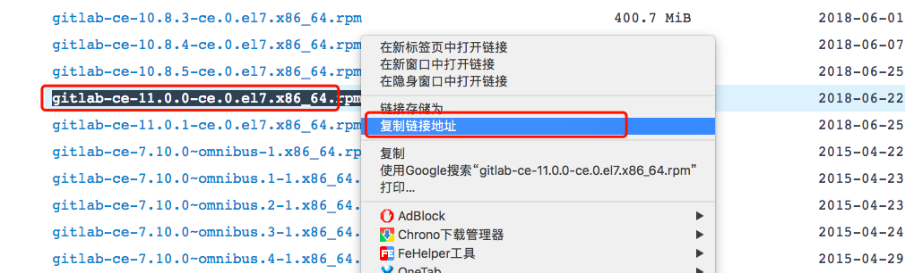


使用 `wget` 下载到本地

```bash
# 下面是一行
wget https://mirrors.tuna.tsinghua.edu.cn/gitlab-ce/yum/el7/gitlab-ce-11.0.0-ce.0.el7.x86_64.rpm
```


#### 1、安装gitlab

``` shell
[root@git ~]# rpm -ivh gitlab-ce-11.0.0-ce.0.el7.x86_64.rpm
警告：gitlab-ce-11.0.0-ce.0.el7.x86_64.rpm: 头V4 RSA/SHA1 Signature, 密钥 ID f27eab47: NOKEY
准备中...                          ################################# [100%]
正在升级/安装...
   1:gitlab-ce-11.0.0-ce.0.el7        ################################# [100%]
It looks like GitLab has not been configured yet; skipping the upgrade script.r

       *.                  *.
      ***                 ***
     *****               *****
    .******             *******
    ********            ********
   ,,,,,,,,,***********,,,,,,,,,
  ,,,,,,,,,,,*********,,,,,,,,,,,
  .,,,,,,,,,,,*******,,,,,,,,,,,,
      ,,,,,,,,,*****,,,,,,,,,.
         ,,,,,,,****,,,,,,
            .,,,***,,,,
                ,*,.
  


     _______ __  __          __
    / ____(_) /_/ /   ____ _/ /_
   / / __/ / __/ /   / __ `/ __ \
  / /_/ / / /_/ /___/ /_/ / /_/ /
  \____/_/\__/_____/\__,_/_.___/
  

Thank you for installing GitLab!
GitLab was unable to detect a valid hostname for your instance.
Please configure a URL for your GitLab instance by setting `external_url`
configuration in /etc/gitlab/gitlab.rb file.
Then, you can start your GitLab instance by running the following command:
  sudo gitlab-ctl reconfigure

For a comprehensive list of configuration options please see the Omnibus GitLab readme
https://gitlab.com/gitlab-org/omnibus-gitlab/blob/master/README.md

[root@vm1 ~]#
```

#### 2、**配置gitlab**

**gitlab的配置文件 /etc/gitlab/gitlab.rb， 编辑如下：**

配置时区

```bash
gitlab_rails['time_zone'] = 'Asia/Shanghai'
```


绑定监听的域名或IP

``` shell
external_url 'http://192.168.60.119'
```


**使用gitlab-ctl  reconfigure 自动配置，并安装数据库，初始化信息，如下所示(第一次使用配置时间较长)：**

``` shell
[root@vm1 ~]# gitlab-ctl reconfigure   
.....
```


**使用gitlab-ctl start 启动gitlab服务，如下所示：**

``` shell
[root@vm1 ~]# gitlab-ctl start
ok: run: gitaly: (pid 22896) 2922s
ok: run: gitlab-monitor: (pid 22914) 2921s
ok: run: gitlab-workhorse: (pid 22882) 2922s
ok: run: logrotate: (pid 22517) 2987s
ok: run: nginx: (pid 22500) 2993s
ok: run: node-exporter: (pid 22584) 2974s
ok: run: postgres-exporter: (pid 22946) 2919s
ok: run: postgresql: (pid 22250) 3047s
ok: run: prometheus: (pid 22931) 2920s
ok: run: redis: (pid 22190) 3053s
ok: run: redis-exporter: (pid 22732) 2962s
ok: run: sidekiq: (pid 22472) 3005s
ok: run: unicorn: (pid 22433) 3011s
[root@vm1 ~]# 
[root@vm1 ~]# lsof -i:80
COMMAND   PID       USER   FD   TYPE DEVICE SIZE/OFF NODE NAME
nginx   22500       root    7u  IPv4  50923      0t0  TCP *:http (LISTEN)
nginx   22501 gitlab-www    7u  IPv4  50923      0t0  TCP *:http (LISTEN)
[root@vm1 ~]# 
```


**修改配置文件，添加 smtp 邮件功能**

假如你想让互联网的邮箱服务提供商，帮你的 `gitlab` 发送邮件，就需要在配置文件中设置，并且需要在邮件服务提供商那里开通 `SMTP`和`POP3` 功能。

关于 SMTP 和 POP3 的区别，访问 https://www.zhihu.com/question/24605584

这里简单说一下， `SMTP` 用于发邮件, `POP3` 用于收邮件。


这里我以 `126` 邮箱为例，演示一下

1. 首先我们在邮箱服务提供商那里开通 `SMTP` 。


2. 配置系统使用的发件邮箱地址等信息

在配置文件： /etc/gitlab/gitlab.rb 中做如下修改

这部分，不管是使用postmail或者SMTP都需要做如下的配置。

```bash
# 是否开启系统邮箱，默认开启
gitlab_rails['gitlab_email_enabled'] = true

# 用这个账号去发送邮件
gitlab_rails['gitlab_email_from'] = 'my@126.cn'

# 发送邮件中要显示的发件人名称
gitlab_rails['gitlab_email_display_name'] = 'Admin'

# 系统接收邮件的地址，一般系统发送的邮件都不要对其回复邮件
gitlab_rails['gitlab_email_reply_to'] = 'noreply@example.com'

# 邮件的标题前缀，如下图
gitlab_rails['gitlab_email_subject_suffix'] = '[gitlab]'
```


3. 配置完系统的发件信息，接下来设置邮件服务提供商的账户登录验证信息。

   要想使用邮件服务商为 gitlab 系统发送邮件，是需要进行登录， 登录就需要先验证的。

   所以要填写相关用于登录验证的信息

   值的注意的是，上面 `gitlab_email_from` 的账户必须和这里的用户名(`smtp_user_name`)一致。

   ```bash
   gitlab_rails['smtp_enable'] = true
   
   # 这个配置的密码不是邮箱的登陆密码而是网易邮箱的客户端授权密码, 
   # 在网易邮箱web页面的设置-POP3/SMTP/IMAP-客户端授权密码查看。
   # 见下图
   gitlab_rails['smtp_enable'] = true
   gitlab_rails['smtp_address'] = "smtp.126.com"
   gitlab_rails['smtp_port'] = 25
   
   # 使用这个账号发送邮件
   gitlab_rails['smtp_user_name'] = "my@126.com"
   gitlab_rails['smtp_password'] = "xxx"
   gitlab_rails['smtp_domain'] = "126.com"
   gitlab_rails['smtp_authentication'] = "login"
   gitlab_rails['smtp_enable_starttls_auto'] = true
   gitlab_rails['smtp_openssl_verify_mode'] = 'peer'
   
   # 发件人账号
   user['git_user_email'] = "username@domain.cn"
   # 更多查看下方网址
   # https://docs.gitlab.com/omnibus/settings/smtp.html
   
   # 如果你不配置发件人, 有些邮件服务器会发送失败, 
   # 所以我们最好把账号和发件人都配置了, 并且保持一致, 这样保证兼容问题
   ```

   

   **SMTP 客户端授权码**

   


4. 重器相关服务，使最新的配置文件生效

```bash
[root@vm1 ~]# gitlab-ctl reconfigure

# 再重启一下
[root@vm1 ~]# gitlab-ctl restart
```


**使用gitlab-rails console命令进行发送邮件测试，如下所示：**

```bash
irb(main):003:0> Notify.test_email('收件人邮箱', '邮件标题', '邮件正文').deliver_now
```


示例

``` shell
[root@vm1 ~]# gitlab-rails console 
Loading production environment (Rails 4.2.10)
irb(main):001:0>  Notify.test_email('86000153@qq.com', 'Message Subject', 'Message Body').deliver_now
...
irb(main):002:0>quit
[root@vm1 ~]# 
```

#### 3、gitlab的使用

**在浏览器中输入 http://192.168.60.119/ ，然后 change password:  ，并使用root用户登录 即可 (后续动作根据提示操作)**
修改密码也可以：gitlab-rails console production
irb(main):001:0> user = User.where(id: 1).first     // id为1的是超级管理员
irb(main):002:0>user.password = 'yourpassword'      // 密码必须至少8个字符
irb(main):003:0>user.save!                          // 如没有问题 返回true
exit                                                // 退出


**如果需要手工修改nginx的port ，可以在gitlab.rb中设置 nginx['listen_port'] = 8000 ，然后再次 gitlab-ctl reconfigure即可**

**登录gitlab 如下所示：**


**创建 group ，组名为plat-sp ,如下所示: **


**去掉用户的自动注册功能：**
admin are -> settings -> Sign-up Restrictions 去掉钩钩，然后拉到最下面保存，重新登录

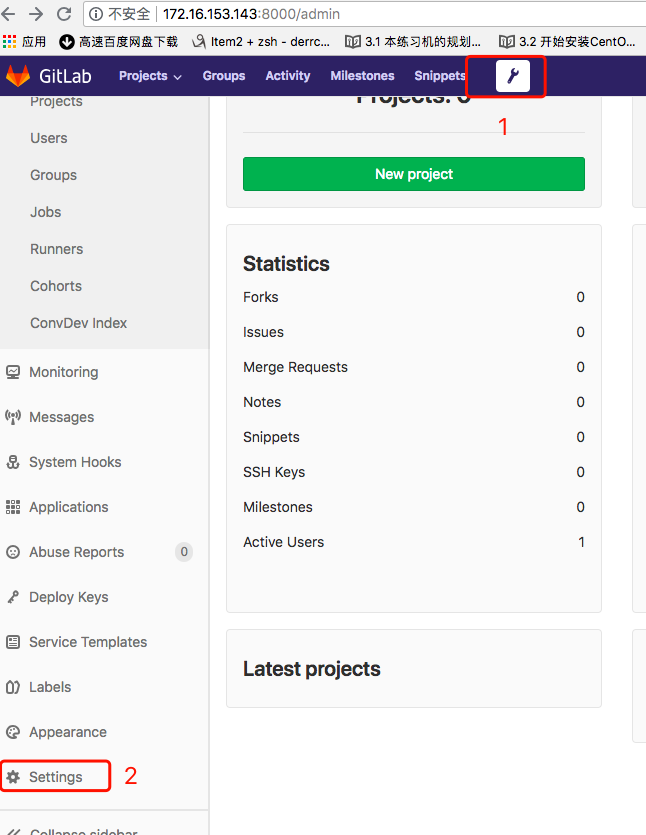


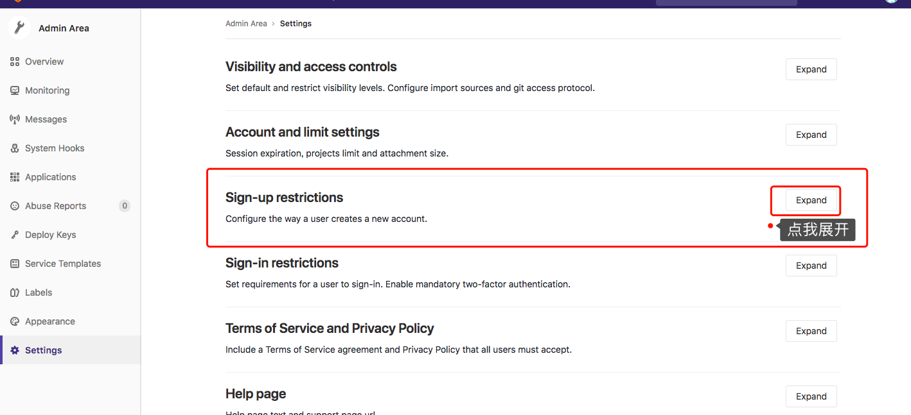


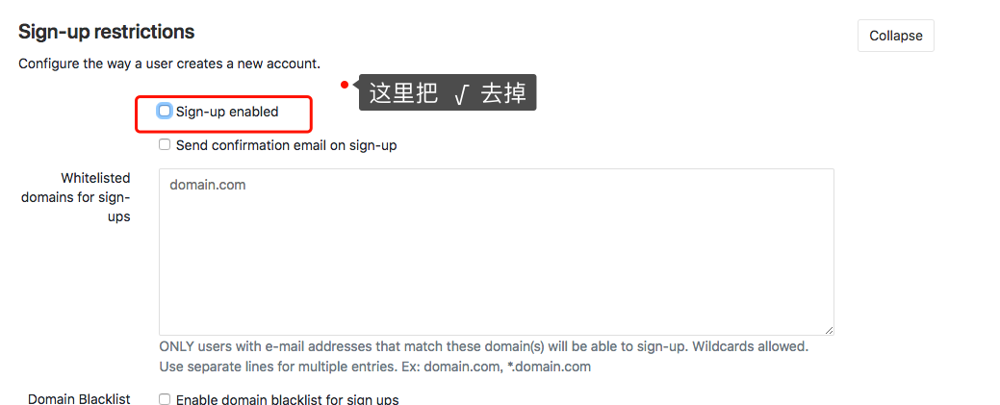


最后往下拉页面，点击`Save changes` 进行保存更改

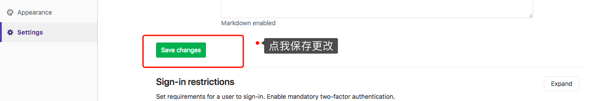


**创建用户Tompson如下所示：**

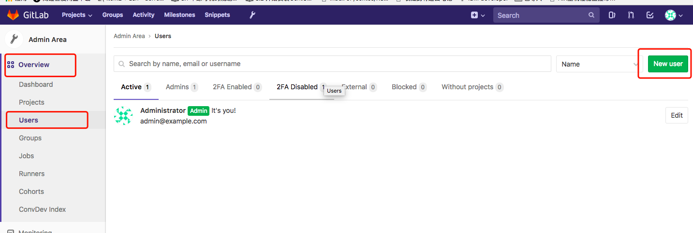


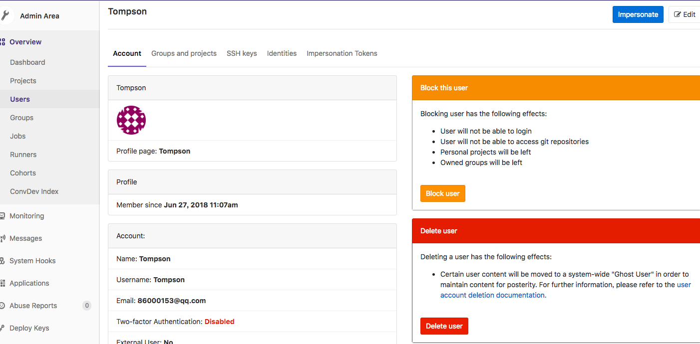


信息填写完成后，点页面下面的 `Cereate user` 绿色按钮创建用户

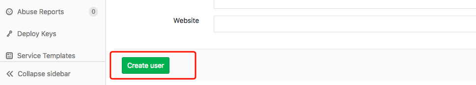


再次点击左侧 `Users` ，就可看到刚才创建的用户了

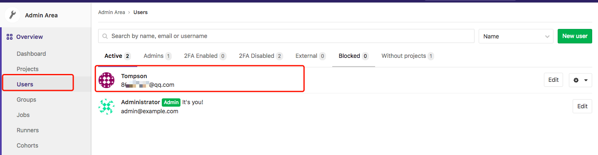


同样的方法，再创建Eric 、Hellen 用户，注意邮箱不能重复。用户添加完毕后，gitlab会给用户发一封修改密码的邮件，各用户需要登录自己的邮箱，并点击相关的链接，设置新密码。

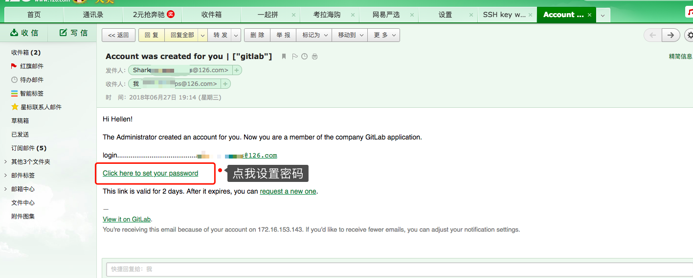


假如你修改了 Nginx 的端口，就需要在访问时，手动修改为正确的端口

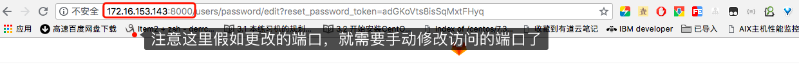


**将用户添加到组中，并指定Tompson为本组的owner：**

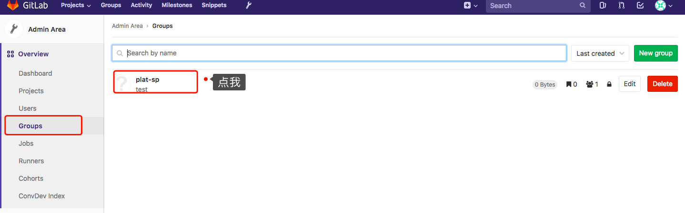


**同样的方法将用户Eric、Hellen也添加到组中，并指定他们为Developer：**


**使用Tompson用户的身份与密码登录到gitlab界面中，并创建Project ，如下所示：**


**指定项目的存储路径和项目名称，如下所示**


**为项目创建Dev分支，如下所示：**

首先需要先给项目创建一个新的文件

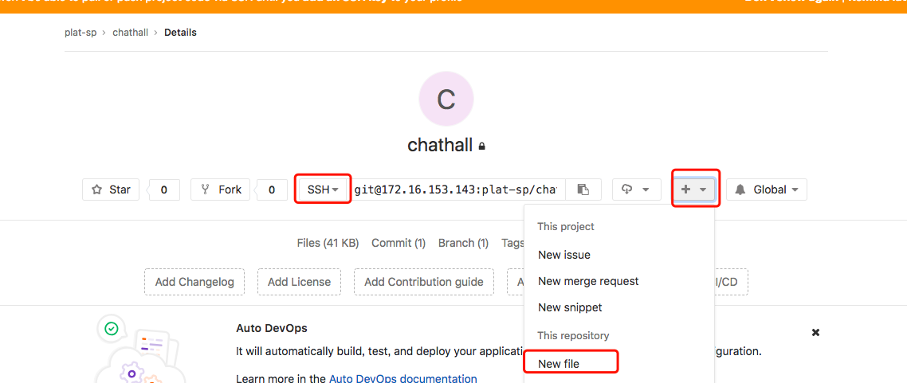


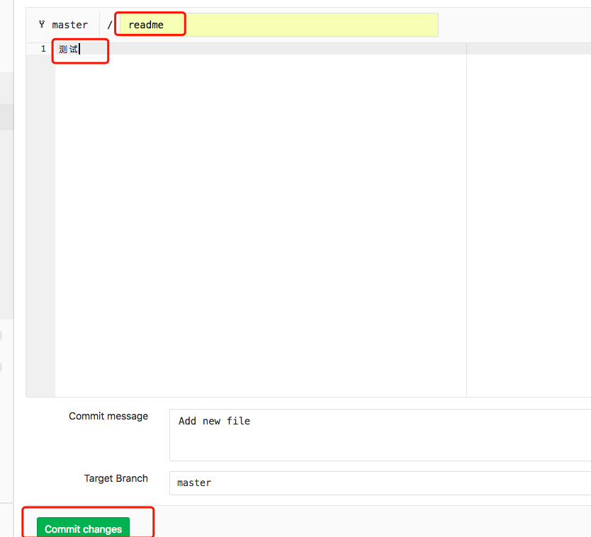


**在 client 上添加Tompsond等 用户：**
``` shell
[root@vm2 ~]# useradd Tompson
[root@vm2 ~]# useradd Eric
[root@vm2 ~]# useradd Hellen
[root@vm2 ~]# su - Tompson
[Tompson@vm2 ~]$ ssh-keygen -C Tompson@domain.cn
Generating public/private rsa key pair.
Enter file in which to save the key (/home/Tompson/.ssh/id_rsa): 
Created directory '/home/Tompson/.ssh'.
Enter passphrase (empty for no passphrase): 
Enter same passphrase again: 
Your identification has been saved in /home/Tompson/.ssh/id_rsa.
Your public key has been saved in /home/Tompson/.ssh/id_rsa.pub.
The key fingerprint is:
SHA256:SAoAH2zSxqEJqVgKKrxM5XMi6tKe61JMRdwMhwBNIrE Tompson@domain.cn
The key's randomart image is:
+---[RSA 2048]----+
|XX==o=.          |
|*BOo+.o          |
|E*=.  .          |
|*+.= + .         |
|=oo = . S        |
|.oo              |
|.o               |
|o...             |
|.+=.             |
+----[SHA256]-----+
[Tompson@vm2 ~]$ cat .ssh/id_rsa.pub 
ssh-rsa AAAAB3NzaC1yc2EAAAADAQABAAABAQDZ8cRGHej+sZzlmK36W5MUXMLOGdTwFI9Jj44mGuabZCrlYW4GDpL6ppezN+Sur0wHtnKonYJzm8ntqS0S0UHyaPPQPl9Mrs/6Z4VrXZ/4RlqHdWeSrmOwCBQld0l8HvrmP4TyGHrOreO8uZqimd/Z+OiMqnYRZzENX11Pti/Px5g1MtJcoCi9uLtF42QYrt1X/fzAyPU9C5/5ZUq4Jln3EF20bzcA52oAzZIl0jrhI0TeTeW6zYq+KxdHGshL+qG7+Ne+akPOe4Ma5BQjcMZ2dQ2kbGuozXmLT8RDcj9YRKceQsUdTI71lJpwrWKGn8Vhra0EaK3hgoTuvMYaGfOF Tompson@domain.cn
```

**将Tompson的公钥复制到gitlab中： 使用Tompson用户的身份与密码登录到gitlab界面中，然后在ssh-key中添加 相关的key ，如下所示：**


**为Tompson用户配置git ，如下所示：**
``` shell
[Tompson@vm2 ~]$ git config --global user.email "Tompson@domain.cn"
[Tompson@vm2 ~]$ git config --global user.name "Tompson"

[Tompson@vm2 ~]$ git clone git@192.168.60.119:plat-sp/chathall.git
Cloning into 'chathall'...
The authenticity of host '192.168.60.119 (192.168.60.119)' can't be established.
ECDSA key fingerprint is SHA256:CDxAQmj6gUkIxB6XUofbZ853GuPM5LS2QO4a5dD7jRo.
ECDSA key fingerprint is MD5:4e:20:72:a7:46:c6:d7:5d:bb:9d:ce:c3:f3:da:43:f9.
Are you sure you want to continue connecting (yes/no)? yes
Warning: Permanently added '192.168.60.119' (ECDSA) to the list of known hosts.
remote: Counting objects: 3, done.
remote: Total 3 (delta 0), reused 0 (delta 0)
Receiving objects: 100% (3/3), done.
[Tompson@vm2 ~]$ 
[Tompson@vm2 ~]$ cd chathall/
[Tompson@vm2 chathall]$ ls
Readme.txt
[Tompson@vm2 chathall]$
```


**创建一个新文件，添加内容，并提交到master分支:**

``` shell
[Tompson@vm2 chathall]$ vim test.sh
[Tompson@vm2 chathall]$ cat test.sh 
#!/bin/bash
echo "gitlab test"
[Tompson@vm2 chathall]$ git add . 
[Tompson@vm2 chathall]$ git commit -m '201805101649'
[master 80edf6b] 201805101649
 1 file changed, 2 insertions(+)
 create mode 100644 test.sh
[Tompson@vm2 chathall]$ 
[Tompson@vm2 chathall]$ git push -u origin master 
Counting objects: 4, done.
Compressing objects: 100% (2/2), done.
Writing objects: 100% (3/3), 305 bytes | 0 bytes/s, done.
Total 3 (delta 0), reused 0 (delta 0)
To git@192.168.60.119:plat-sp/chathall.git
   4611654..80edf6b  master -> master
Branch master set up to track remote branch master from origin.
[Tompson@vm2 chathall]$ 
```

**使用Eric用户登录，并clone 项目，如下所示：**
``` shell
[root@vm2 ~]# su - Eric
[Eric@vm2 ~]$ ssh-keygen -C Eric@domain.cn
Generating public/private rsa key pair.
Enter file in which to save the key (/home/Eric/.ssh/id_rsa): 
Created directory '/home/Eric/.ssh'.
Enter passphrase (empty for no passphrase): 
Enter same passphrase again: 
Your identification has been saved in /home/Eric/.ssh/id_rsa.
Your public key has been saved in /home/Eric/.ssh/id_rsa.pub.
The key fingerprint is:
SHA256:VZaJvjA5SJZEB+yuRpDBNHCECCZ5R8X0DYcNE0f1B6E Eric@domain.cn
The key's randomart image is:
+---[RSA 2048]----+
|*O=..B*o**+o+oo. |
|*.+.. *o.*oooo . |
| . + + ..oo E . .|
|  o   o =..    . |
|   . .  S+ .     |
|    . .   .      |
|   . .           |
|    o            |
|   .             |
+----[SHA256]-----+

[Eric@vm2 ~]$ cat .ssh/id_rsa.pub 
ssh-rsa AAAAB3NzaC1yc2EAAAADAQABAAABAQDxQcn4UjRW/5PT5witeV9+S2w8WK5ouawHxEF7s9wuWsT4pqhcu5BN74NG3CPaq1jJZnkV+aQsTw+60BAd1gOK0FBbKWxmohmE61n9vfpUT5igJ72t2jpXjfKwLIHw+Iq5yM4yUhkwSsoBuZkxYSEltnj8OvXaOlCDYnXuGBa9+xO8f5yVIcOtiwRvv+Y1PRRzSIcazPVZax9FLK26t1R4NPiY4xWkIJyK2OrKMeiaBBzyMfWzHdmsCWa51oSrYSmz3PDBXpzIBs3OdKxcaJs9Lc5u87YCV5RMUjLrPcA7nPK6crOabLXhz3d5GSYggMTOByQkyKOo7WlYpARCHOt/ Eric@domain.cn
[Eric@vm2 ~]$ 
```

**同样需要使用Eric用户登录gitlab web 界面，并添加相应的ssh-key。然后设置git ，并clone项目：**
``` shell
[Eric@vm2 ~]$ git config --global user.email "Eric@domain.cn"
[Eric@vm2 ~]$ git config --global user.name "Eric"
[Eric@vm2 ~]$ git clone git@192.168.60.119:plat-sp/chathall.git
Cloning into 'chathall'...
The authenticity of host '192.168.60.119 (192.168.60.119)' can't be established.
ECDSA key fingerprint is SHA256:CDxAQmj6gUkIxB6XUofbZ853GuPM5LS2QO4a5dD7jRo.
ECDSA key fingerprint is MD5:4e:20:72:a7:46:c6:d7:5d:bb:9d:ce:c3:f3:da:43:f9.
Are you sure you want to continue connecting (yes/no)? yes
remote: Counting objects: 6, done.
remote: Compressing objects: 100% (3/3), done.
remote: Total 6 (delta 0), reused 0 (delta 0)
Receiving objects: 100% (6/6), done.
[Eric@vm2 ~]$ 
```

**切换到dev分支，修改文件内容，并将新code提交到dev分支(Developer角色默认并没有提交master的权限)：**

``` shell
[Eric@vm2 chathall]$ cd chathall
[Eric@vm2 chathall]$ git checkout dev 
Branch dev set up to track remote branch dev from origin.
Switched to a new branch 'dev'
[Eric@vm2 chathall]$ ls
Readme.txt  test.sh
[Eric@vm2 chathall]$ vim test.sh 
[Eric@vm2 chathall]$ cat test.sh 
#!/bin/bash
echo "gitlab test"
echo "brahch test"
[Eric@vm2 chathall]$ git add . 
[Eric@vm2 chathall]$ git commit -m '201805101658'
[dev 6687039] 201805101658
 1 file changed, 1 insertion(+)
[Eric@vm2 chathall]$ git push -u origin dev 
Counting objects: 5, done.
Compressing objects: 100% (3/3), done.
Writing objects: 100% (3/3), 306 bytes | 0 bytes/s, done.
Total 3 (delta 0), reused 0 (delta 0)
remote: 
remote: To create a merge request for dev, visit:
remote:   http://192.168.60.119/plat-sp/chathall/merge_requests/new?merge_request%5Bsource_branch%5D=dev
remote: 
To git@192.168.60.119:plat-sp/chathall.git
   80edf6b..6687039  dev -> dev
Branch dev set up to track remote branch dev from origin.
[Eric@vm2 chathall]$
[Eric@vm2 chathall]$ git checkout master 
Switched to branch 'master'
[Eric@vm2 chathall]$ git branch 
  dev
* master
[Eric@vm2 chathall]$
```

**使用Eric 用户登录gitlab web，在界面中 创建一个合并请求：**


**提交合并请求：**


**然后使用Tompson用户登录 gitlab web ，找到“合并请求” ，然后将dev分支合并到master分支，如下所示：**


### 五、大部分公司的处理流程如下

  PM在gitlab创建任务，分配给开发人员
  开发人员领取任务后，在本地使用git clone拉取代码库
  开发人员创建开发分支（git checkout -b dev），并进行开发
  开发人员完成之后，提交到本地仓库（git commit ）

  开发人员接着把本地仓库的 dev 分支提交到远程仓库的 dev 分支

  开发人员在gitlab登录自己的账户，在gitlab界面上申请分支合并请求（Merge request）
  PM在gitlab上查看提交和代码修改情况，确认无误后，确认将开发人员的分支合并到主分支（master）
  开发人员在gitlab上Mark done确认开发完成，并关闭issue。这一步在提交合并请求时可以通过描述中填写"close #1"等字样，可以直接关闭issue

### 六、Git基本常用命令

```shell
git init
git add XX
git commit -m "XX"
git status
git diff  XX 
git log
git reset  --hard HEAD^ 
git reset  --hard HEAD~
git reset --hard HEAD~100
git reflog
git checkout -- XX
git rm XX 
git remote add origin https://github.com/RTplay/testgit.git
git push -u(第一次要用-u 以后不需要) origin master 
git clone https://github.com/RTplay/testgit.git
git checkout -b dev
git branch
git checkout master
git merge dev
git branch -d dev
git branch name
git stash
git stash list
git stash apply
git stash drop
git stash pop
git remote
git remote -v
git push origin master
git tag "tag_name"
git push -u origin "tag_name"
```


### 七 其他功能

#### 设置通告

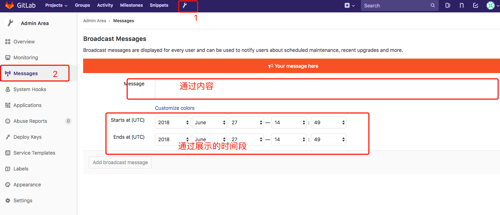


#### 自定义登录首页

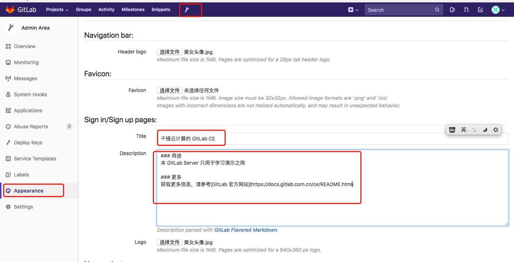