# 一、企业级堡垒机 jumpserver

## 环境准备

- 系统：CentOS 7
- IP：192.168.10.101
- 关闭selinux 和防火墙

```
# CentOS 7
$ setenforce 0  # 可以设置配置文件永久关闭
$ systemctl stop iptables.service
$ systemctl stop firewalld.service

# CentOS6
$ setenforce 0
$ service iptables stop
```

 

## **1、准备 Python3 和 Python 虚拟环境**

### **1、安装依赖包**

[root@centos7-1 opt]# yum -y install wget sqlite-devel xz gcc automake zlib-devel openssl-devel epel-release git

### **2、编译安装**

[root@centos7-1 opt]# wget https://www.python.org/ftp/python/3.6.1/Python-3.6.1.tar.xz

[root@centos7-1 opt]# tar xvf Python-3.6.1.tar.xz  && cd Python-3.6.1

[root@centos7-1 opt]# ./configure && make && make install

### **3、建立 Python 虚拟环境**

因为 CentOS 6/7 自带的是 Python2，而 Yum 等工具依赖原来的 Python，为了不扰乱原来的环境我们来使用 Python 虚拟环境

[root@centos7-1 opt]# cd /opt

[root@centos7-1 opt]# python3 -m venv py3

[root@centos7-1 opt]# source /opt/py3/bin/activate

注：看到下面的提示符代表成功，以后运行 Jumpserver 都要先运行以上 source 命令，以下所有命令均在该虚拟环境中运行

(py3) [root@centos7-1 opt]#

## **2、安装 Jumpserver 1.0.0**

### **1、下载或 Clone 项目**

项目提交较多 git clone 时较大，你可以选择去 Github 项目页面直接下载zip包。

(py3) [root@centos7-1 opt]# cd /opt/

(py3) [root@centos7-1 opt]# git clone --depth=1 https://github.com/jumpserver/jumpserver.git && cd jumpserver && git checkout master

### **2、安装依赖 RPM 包**

(py3) [root@centos7-1 jumpserver]# cd /opt/jumpserver/requirements

(py3) [root@centos7-1 jumpserver]# yum -y install $(cat rpm_requirements.txt)  # 如果没有任何报错请继续

### **3、安装 Python 库依赖**

(py3) [root@centos7-1 requirements]# pip install -r requirements.txt  # 不要指定-i参数，因为镜像上可能没有最新的包，如果没有任何报错请继续

成功如下图：

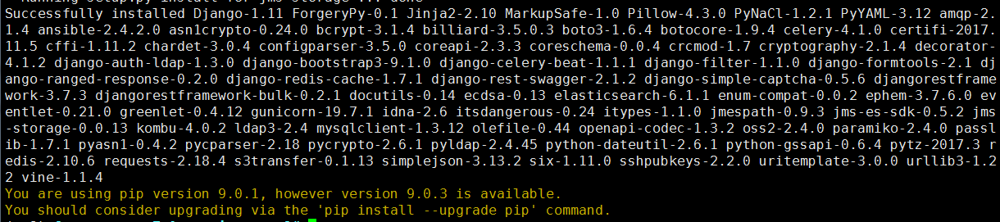 

### **4、安装 Redis, Jumpserver 使用 Redis 做 cache 和 celery broke**

(py3) [root@centos7-1 requirements]# yum -y install redis

(py3) [root@centos7-1 requirements]# systemctl start redis

### **5、安装 MySQL**

本教程使用 Mysql 作为数据库，如果不使用 Mysql 可以跳过相关 Mysql 安装和配置

（1）# centos7

(py3) [root@centos7-1 requirements]# yum -y install mariadb mariadb-devel mariadb-server  # centos7下安装的是mariadb

(py3) [root@centos7-1 requirements]# systemctl start mariadb.service

（2）# centos6

$ yum -y install mysql mysql-devel mysql-server

$ service mysqld start

### **6、创建数据库 Jumpserver 并授权**

(py3) [root@centos7-1 requirements]# mysql

MariaDB [(none)]>  create database jumpserver default charset 'utf8';

Query OK, 1 row affected (0.00 sec)

MariaDB [(none)]>  grant all on jumpserver.* to 'jumpserver'@'127.0.0.1' identified by 'along';

Query OK, 0 rows affected (0.00 sec) 

### **7、修改 Jumpserver 配置文件**

(py3) [root@centos7-1 requirements]# cd /opt/jumpserver

(py3) [root@centos7-1 jumpserver]# cp config_example.py config.py

(py3) [root@centos7-1 jumpserver]# vim config.py   # 我们计划修改 DevelopmentConfig中的配置，因为默认jumpserver是使用该配置，它继承自Config

```
class DevelopmentConfig(Config):    #找到这一段，进行下面的配置
    DEBUG = True
    DB_ENGINE = 'mysql'
    DB_HOST = '127.0.0.1'
    DB_PORT = 3306
    DB_USER = 'jumpserver'
    DB_PASSWORD = 'along'
    DB_NAME = 'jumpserver'
```

**注意:** 配置文件是 Python 格式，不要用 TAB，而要用空格

### **8、生成数据库表结构和初始化数据**

(py3) [root@centos7-1 jumpserver]# cd /opt/jumpserver/utils

(py3) [root@centos7-1 utils]# bash make_migrations.sh

成功如下图：

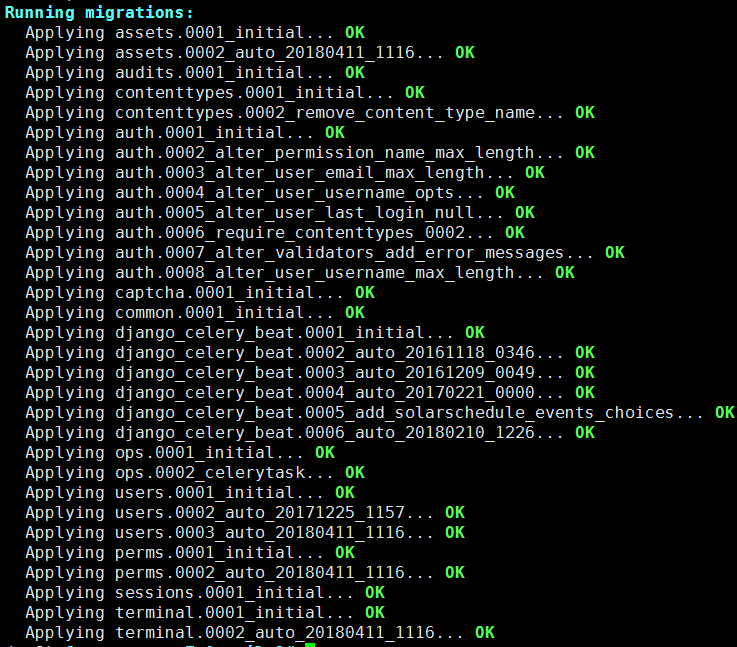

### **9、运行 Jumpserver**

（1）老版本启动方法

(py3) [root@centos7-1 utils]# cd /opt/jumpserver

(py3) [root@centos7-1 jumpserver]# python run_server.py all

 （2）新版本启动方法

(py3) [root@centos7-1 jumpserver]# ./jms start all     # 后台运行使用-d 如：参数./jms start all -d

\# 新版本更新了运行脚本，使用方式./jms start|stop|status|restart all 后台运行请添加 -d 参数

### **10、浏览器访问**[**http://192.168.10.101:8080/**](http://192.168.10.101:8080/)

注意：

① 第一次运行时可能报错，(这里只是 Jumpserver, 没有 Web Terminal，所以访问 Web Terminal 会报错)

② 终止程序，再次执行，就可以登录了

(py3) [root@centos7-1 jumpserver]# ./jms start all 

账号: admin 密码: admin

③ 登录成功

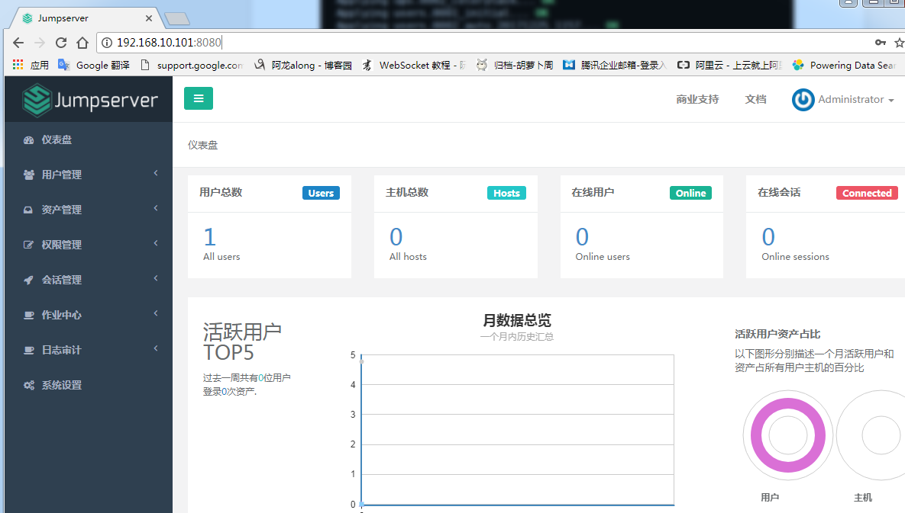

## **3、安装 SSH Server 和 WebSocket Server: Coco**

### **1、下载或 Clone 项目**

新开一个终端，连接测试机，别忘了 source /opt/py3/bin/activate

[root@centos7-1 ~]# source /opt/py3/bin/activate

(py3) [root@centos7-1 ~]# cd /opt/

(py3) [root@centos7-1 opt]# git clone https://github.com/jumpserver/coco.git && cd coco && git checkout master

### 2、安装依赖

(py3) [root@centos7-1 coco]# cd /opt/coco/requirements

(py3) [root@centos7-1 requirements]# yum -y  install $(cat rpm_requirements.txt)

(py3) [root@centos7-1 requirements]# pip install -r requirements.txt

成功如下图：

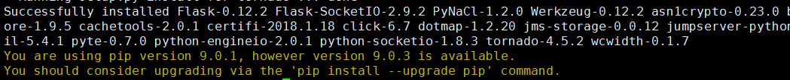

### **3、查看配置文件并运行**

（1）运行

(py3) [root@centos7-1 requirements]# cd /opt/coco

(py3) [root@centos7-1 coco]# cp conf_example.py conf.py

(py3) [root@centos7-1 coco]# ./cocod start   # 后台运行使用 -d 参数./cocod start -d

\# 新版本更新了运行脚本，使用方式./cocod start|stop|status|restart 后台运行请添加 -d 参数

 

（2）这时需要去 Jumpserver 管理后台-会话管理-终端管理（[http://192.168.10.101：8080/terminal/terminal/](http://192.168.244.144:8080/terminal/terminal/)）接受 Coco 的注册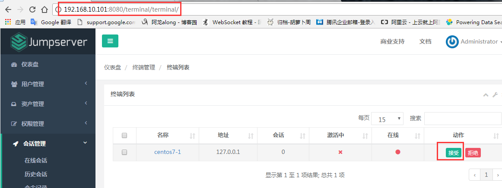

 

（3）命令行终端显示连接成功

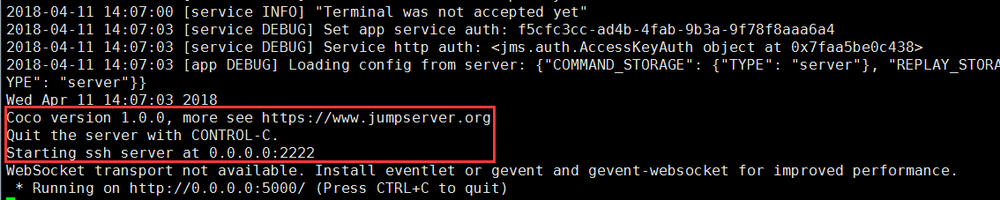

 

### **4、测试连接**

（1）linux 连接

[root@centos7-1 ~]# ssh -p2222 admin@192.168.10.101   #新开一个终端去连接密码: admin

（2）如果是用在 Windows 下，Xshell Terminal 登录语法如下

$ssh admin@192.168.244.144 2222

密码: admin

如果能登陆代表部署成功

（3）登录成功如下图：

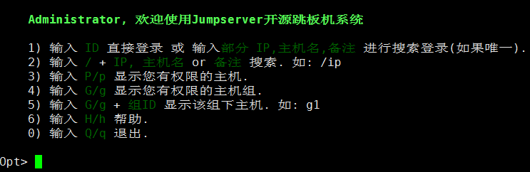 

## **4、安装 Web Terminal 前端: Luna**

### **1、下载 Luna**

Luna 已改为纯前端，需要 Nginx 来运行访问

访问（<https://github.com/jumpserver/luna/releases>）下载对应版本的 release 包，直接解压，不需要编译

[root@centos7-1 ~]# cd /opt/

[root@centos7-1 opt]# wget https://github.com/jumpserver/luna/releases/download/v1.0.0/luna.tar.gz

### **2、解压 Luna**

[root@centos7-1 opt]# tar xvf luna.tar.gz

[root@centos7-1 opt]# ls /opt/luna

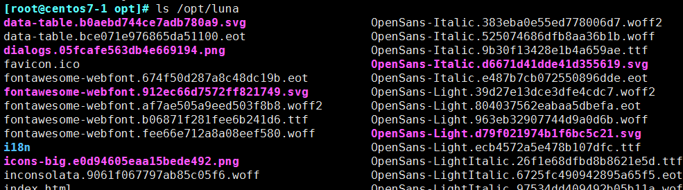

 

## **5、安装 Windows 支持组件（如果不需要管理 windows 资产，可以直接跳过这一步）**

因为手动安装 guacamole 组件比较复杂，这里提供打包好的 docker 使用, 启动 guacamole

### 1、Docker安装 (仅针对CentOS7，CentOS6，安装Docker相对比较复杂)

```
① 安装依赖
[root@centos7-1 ~]# yum remove docker-latest-logrotate  docker-logrotate  docker-selinux dockdocker-engine
[root@centos7-1 ~]# yum install -y yum-utils  device-mapper-persistent-data   lvm2

② 安装docker
添加docker官方源
[root@centos7-1 ~]# yum-config-manager --add-repo https://download.docker.com/linux/centos/docker-ce.repo
[root@centos7-1 ~]# yum makecache fast
[root@centos7-1 ~]# yum install docker-ce

③ 国内部分用户可能无法连接docker官网提供的源，这里提供阿里云的镜像节点供测试使用
[root@centos7-1 ~]# yum-config-manager --add-repo http://mirrors.aliyun.com/docker-ce/linux/centos/docker-ce.repo
[root@centos7-1 ~]# rpm --import http://mirrors.aliyun.com/docker-ce/linux/centos/gpg
[root@centos7-1 ~]# yum makecache fast
[root@centos7-1 ~]# yum -y install docker-ce

④ 启动docker
[root@centos7-1 ~]# systemctl start docker
[root@centos7-1 ~]# systemctl status docker
```

### 2、启动 Guacamole

① 这里所需要注意的是 guacamole 暴露出来的端口是 8081，若与主机上其他端口冲突请自定义

修改 JUMPSERVER_SERVER 环境变量的配置，填上 Jumpserver 的内网地址

```
# 注意：这里一定要改写一下本机的IP地址, 否则会出错, 带宽有限, 下载时间可能有点长，可以喝杯咖啡，撩撩对面的妹子
docker run --name jms_guacamole -d \
  -p 8081:8080 -v /opt/guacamole/key:/config/guacamole/key \
  -e JUMPSERVER_KEY_DIR=/config/guacamole/key \
  -e JUMPSERVER_SERVER=http://<填写本机的IP地址>:8080 \
  registry.jumpserver.org/public/guacamole:1.0.0 
```

② 执行过程截图

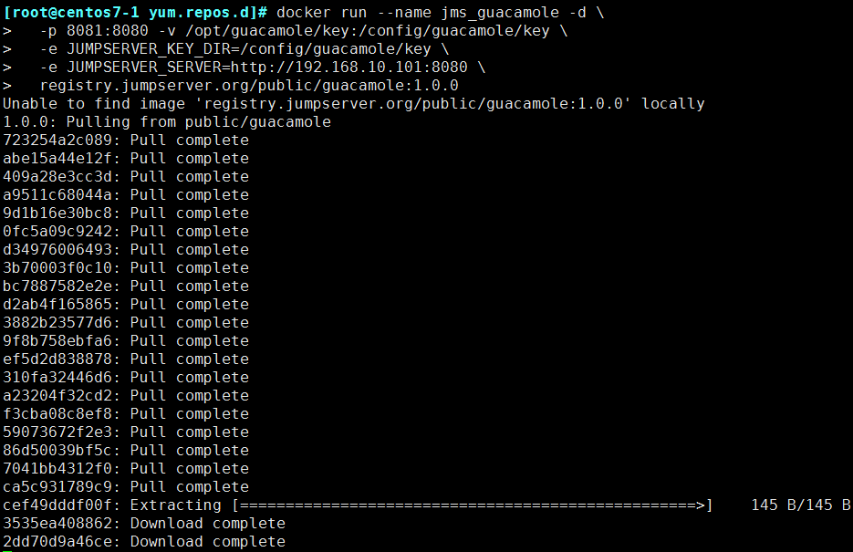

 

### 3、在jumpserver 接受注册

启动成功后去 Jumpserver 会话管理-终端管理（http://192.168.10.101:8080/terminal/terminal/）接受[Gua]开头的一个注册，如果页面显示不正常可以等部署完成后再处理 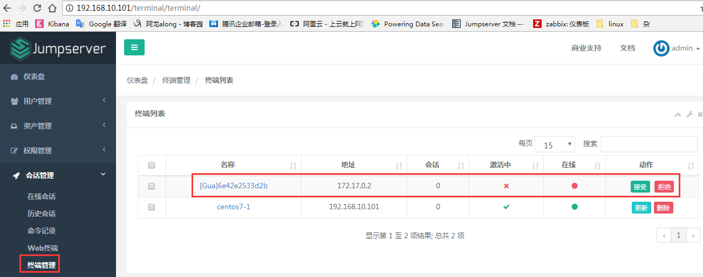

 

## **6、配置 Nginx 整合各组件**

### **1、安装 Nginx 根据喜好选择安装方式和版本**

nginx 官网<https://nginx.org/en/download.html>

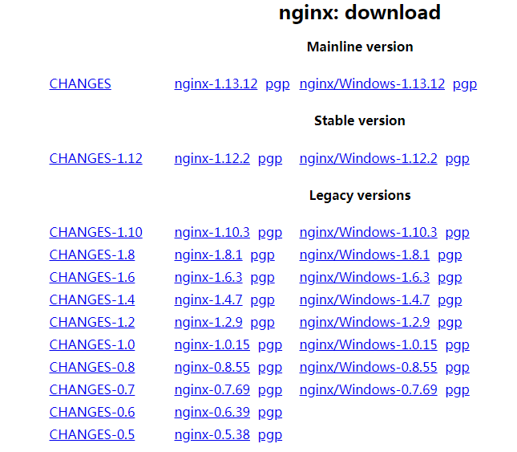

（1）安装前准备

① 下载版本包，我以nginx-1.12.2为例

[root@centos7-1 nginx]# wget -c https://nginx.org/download/nginx-1.12.2.tar.gz

[root@centos7-1 nginx]# tar -xvf nginx-1.12.2.tar.gz

② 下载依赖包

[root@centos7-1 nginx]# yum install gc gcc gcc-c++ pcre-devel zlib-devel openssl-devel

③ 创建nginx用户、组

[root@centos7-1 nginx-1.12.2]# groupadd nginx

[root@centos7-1 nginx-1.12.2]# useradd -s /sbin/nologin -g nginx -M nginx

 

（2）编译安装

[root@centos7-1 nginx-1.12.2]# ./configure --user=nginx --group=nginx --prefix=/mnt/nginx --with-http_stub_status_module --with-http_ssl_module --with-http_gzip_static_module

[root@centos7-1 nginx-1.12.2]# make && make install

[root@centos7-1 nginx-1.12.2]# cd /mnt/nginx/    # 完成

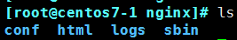

注释：#指定运行权限的用户

--user=nginx

\#指定运行的权限用户组

--group=nginx

\#指定安装路径

--prefix=/usr/local/nginx

\#支持nginx状态查询

--with-http_stub_status_module

\#开启ssl支持

--with-http_ssl_module

\#开启GZIP功能

--with-http_gzip_static_module

 

（3）使systemctl 控制nginx 服务

[root@centos7-1 nginx]# vim /usr/lib/systemd/system/nginx.service

```
[Unit]
Description=nginx - high performance web server
Documentation=http://nginx.org/en/docs/
After=network.target remote-fs.target nss-lookup.target

[Service]
Type=forking
PIDFile=/mnt/nginx/logs/nginx.pid
ExecStartPre=/mnt/nginx/sbin/nginx -t -c /mnt/nginx/conf/nginx.conf
ExecStart=/mnt/nginx/sbin/nginx -c /mnt/nginx/conf/nginx.conf
ExecReload=/bin/kill -s HUP $MAINPID
ExecStop=/bin/kill -s QUIT $MAINPID
PrivateTmp=true

[Install]
WantedBy=multi-user.target
```

### **2、准备配置文件**

[root@centos7-1 ~]# vim /mnt/nginx/conf/nginx.conf   清除已有的server段

```
server {
    listen 80;

    proxy_set_header X-Real-IP $remote_addr;
    proxy_set_header Host $host;
    proxy_set_header X-Forwarded-For $proxy_add_x_forwarded_for;

    location /luna/ {
        try_files $uri / /index.html;
        alias /opt/luna/;
    }

    location /media/ {
        add_header Content-Encoding gzip;
        root /opt/jumpserver/data/;
    }

    location /static/ {
        root /opt/jumpserver/data/;
    }

    location /socket.io/ {
        proxy_pass       http://localhost:5000/socket.io/;
        proxy_buffering off;
        proxy_http_version 1.1;
        proxy_set_header Upgrade $http_upgrade;
        proxy_set_header Connection "upgrade";
    }

    location /guacamole/ {
        proxy_pass       http://localhost:8081/;
        proxy_buffering off;
        proxy_http_version 1.1;
        proxy_set_header X-Forwarded-For $proxy_add_x_forwarded_for;
        proxy_set_header Upgrade $http_upgrade;
        proxy_set_header Connection $http_connection;
        access_log off;
    }

    location / {
        proxy_pass http://localhost:8080;
    }
}
```

 

### **3、运行 Nginx**

[root@centos7-1 ~]# /mnt/nginx/sbin/nginx -t   # 检查配置文件

[root@centos7-1 ~]# service nginx start

 

### **4、访问** **http://192.168.10.101**

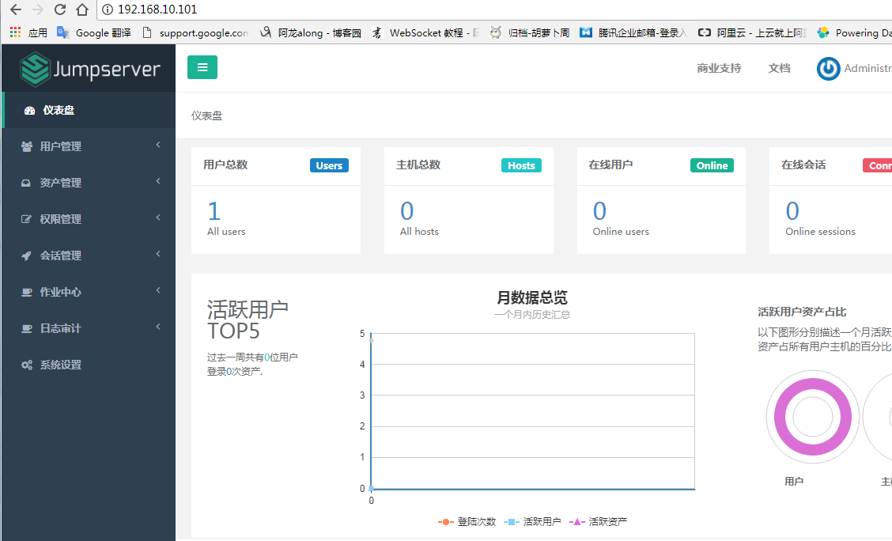

 

**如果您认为这篇**

# 二、企业级堡垒机 jumpserver快速入门

- **硬件条件**

① 一台安装好 Jumpserver 系统的可用主机（堡垒机）

② 一台或多台可用的 Linux、Windows资产设备（被管理的资产）

- **服务条件**

（1）coco服务

① 鉴于心态检测存在延迟，也可以直接在 Jumpserver 主机上执行如下命令检测 Coco 是否存活，Coco 服务默认使用 2222 端口:

[root@centos7-1 ~]# ss -nutlp |grep 2222

效果如下：

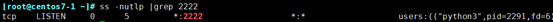

② 如 coco 不在线或者服务不正常，可以尝试重启 coco

$ cd /opt/coco

$ ./cocod restart   # 请确保 jumpserver 已经正常运行。

（2）guacamole 服务

如果 guacamole 不在线或者服务不正常，可以尝试重启docker 容器

① $ docker ps   # 查询正在运行的容器，记录下容器的 <CONTAINER ID> ，可以附加 -a 参数查询所有容器

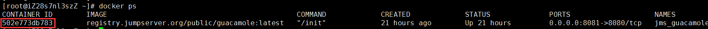

② $ docker restart 6b15fcf0e5f3   # 6b15fcf0e5f3 是通过docker ps查询到的，请不要直接复制。

\# docker 用法： docker start|stop|restart|rm|rmi <CONTAINER ID> 

## **1、系统设置**

### **1.1 基本设置**

可以设置用户向导url，如果不设置，jumpserver产生的链接都默认为www.localhost.com

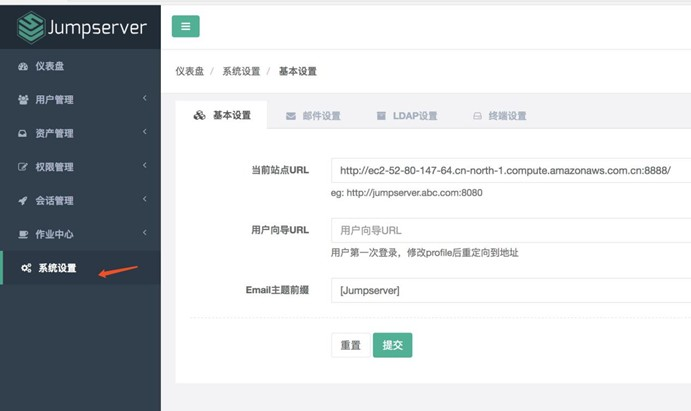

### **1.2 配置邮件发送服务器**

点击页面上边的"邮件设置" ，进入邮件设置页面：

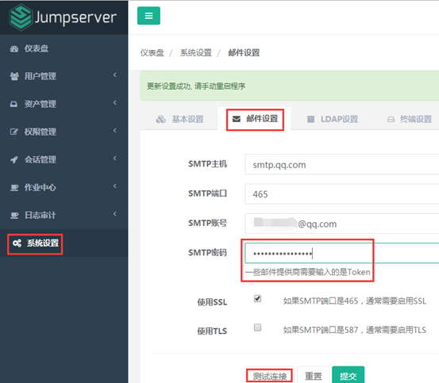

注：

① 配置 QQ 邮箱的 SMTP 服务可参考（<http://blog.csdn.net/Aaron133/article/details/78363844>），仅使用只需要看完第二部分即可。

② SMTP 密码是你打开qq邮箱SMTP 时腾讯给你发送的密码。

③ 配置邮件服务后，点击页面的"测试连接"按钮，如果配置正确，Jumpserver 会发送一条测试邮件到您的 SMTP 账号邮箱里面：

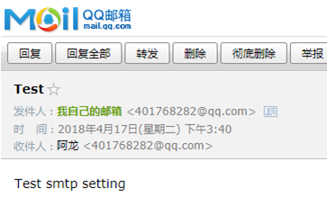

## **2、创建用户**

### **2.1 创建 Jumpserver 用户**

① 点击页面左侧"用户列表"菜单下的"用户列表"，进入用户列表页面。

② 点击页面左上角"创建用户"按钮，进入创建用户页面，填写账户，角色安全，个人等信息。

其中，用户名即 Jumpserver 登录账号。用户组是用于资产授权，当某个资产对一个用户组授权后，这个用户组下面的所有用户就都可以使用这个资产了。角色用于区分一个用户是管理员还是普通用户。

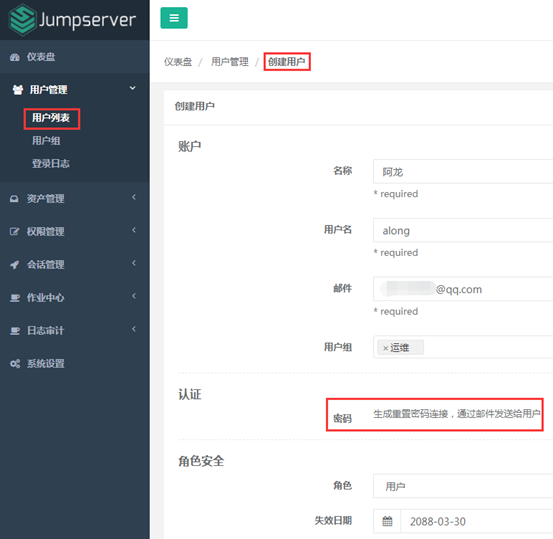

③ 成功提交用户信息后，Jumpserver 会发送一条设置"用户密码"的邮件到您填写的用户邮箱。

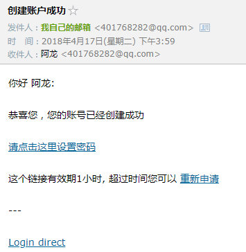

④ 点击邮件中的设置密码链接，设置好密码后，您就可以用户名和密码登录 Jumpserver 了。

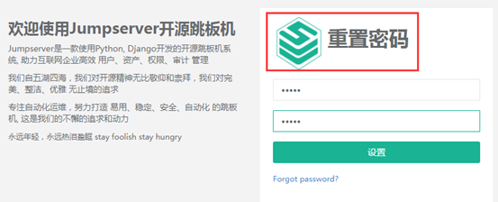

### **2.2 登录 Jumpserver 用户**

（1）web 页面登录

① 用户首次登录 Jumpserver，会被要求完善用户信息。

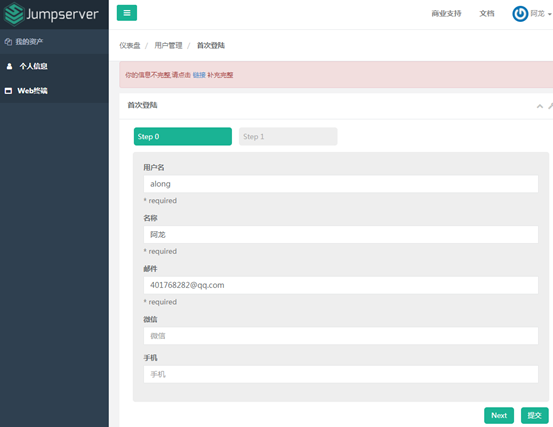

② 生成ssh 公钥

Linux/Unix 生成 SSH 密钥可以参考（<https://www.cnblogs.com/horanly/p/6604104.html>)

Windows 生成 SSH 密钥可以参考（<https://www.cnblogs.com/horanly/p/6604104.html>)

查看公钥信息

[root@centos7-1 ~]# cat .ssh/id_rsa.pub$ cat ~/.ssh/id_rsa.pub

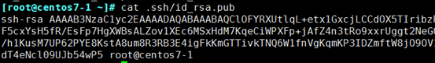

③ 复制 SSH 公钥，添加到 Jumpserver 中。

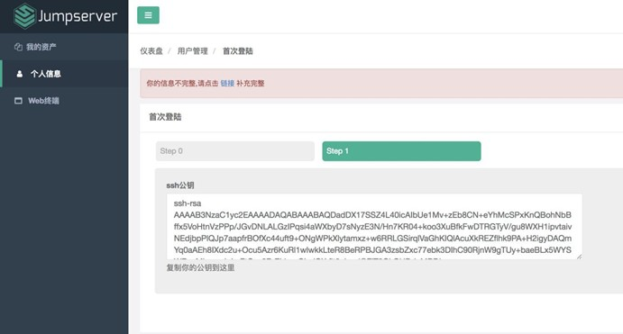

 

（2）除了使用浏览器登录 Jumpserver 外，还可使用命令行登录：

① 确保 Coco 服务正常

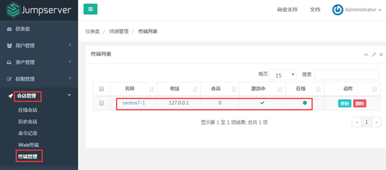

 ② 命令行登录 Jumpserver 使用如下命令：

$ ssh -p 2222 用户名@Jumpserver IP地址

登录成功后界面如下:

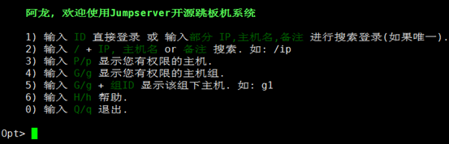

 

## **3、创建资产**

### **3.1 创建 Linux 资产**

（1）编辑资产树

节点不能重名，右击节点可以添加、删除和重命名节点，以及进行资产相关的操作。

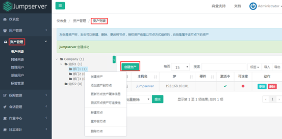

（2）创建管理用户

　　**管理用户是服务器的 root，或拥有 NOPASSWD: ALL sudo 权限的用户**，Jumpserver 使用该用户来推送系统用户、获取资产硬件信息等。

　　**注意：**资产管理里面的所以信息，都是和资产有关，包括创建的所有用户；jumpserver的root用户密码，只给jumpserver管理员登录安装了jumpserver的服务器使用。除此之外不用在任何地方；不用搞混了（我就搞混了）

　　如果使用ssh私钥，需要先在资产上设置，这里举个例子供参考（本例登录资产使用root为例）

① 在资产上生成 root 账户的公钥和私钥

[root@centos7-1 ~]# ssh-keygen -t rsa   # 默认会输入公钥和私钥文件到 ~/.ssh 目录

② 将公钥输出到文件 authorized_keys 文件，并修改权限

[root@centos7-1 ~]# cat ~/.ssh/id_rsa.pub >> ~/.ssh/authorized_keys

[root@centos7-1 ~]# chmod 400 ~/.ssh/authorized_keys

③ 打开RSA验证相关设置

[root@centos7-1 ~]# vim /etc/ssh/sshd_config

```
  RSAAuthentication yes
  PubkeyAuthentication yes
  AuthorizedKeysFile     .ssh/authorized_keys
```

④ 重启 ssh 服务

[root@centos7-1 ~]# systemctl restart sshd

⑤ 上传 ~/.ssh 目录下的 id_rsa 私钥到 jumpserver 的管理用户中

 

（3）这样就可以使用 ssh私钥 进行管理服务器。

名称可以按资产树来命名。用户名root。密码和 SSH 私钥必填一个。

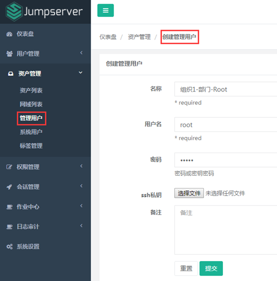

 

（4）创建系统用户

**① 系统用户是 Jumpserver 跳转登录资产时使用的用户，可以理解为登录资产用户**，如 web, sa, dba(ssh web@some-host), 而不是使用某个用户的用户名跳转登录服务器(ssh xiaoming@some-host); 简单来说是 用户使用自己的用户名登录Jumpserver, Jumpserver使用系统用户登录资产。

② 系统用户的 Sudo 栏填写允许当前系统用户免sudo密码执行的程序路径，如默认的/sbin/ifconfig，意思是当前系统用户可以直接执行 ifconfig 命令或 sudo ifconfig 而不需要输入当前系统用户的密码，执行其他的命令任然需要密码，以此来达到权限控制的目的。

③ 这里简单举几个例子：

```
Sudo /bin/su  # 当前系统用户可以免sudo密码执行sudo su命令（也就是可以直接切换到root，生产环境不建议这样操作）
Sudo /usr/bin/git,/usr/bin/php,/bin/cat,/bin/more,/bin/less,/usr/bin/head,/usr/bin/tail  # 当前系统用户可以免sudo密码执行git php cat more less head tail
# 此处的权限应该根据使用用户的需求汇总后定制，原则上给予最小权限即可。
```

④ 系统用户创建时，如果选择了自动推送 Jumpserver 会使用 Ansible 自动推送系统用户到资产中，**如果资产(交换机、Windows )不支持 Ansible, 请手动填写账号密码。**

Linux 系统协议项务必选择 ssh 。如果用户在系统中已存在，请去掉自动生成密钥、自动推送勾选。

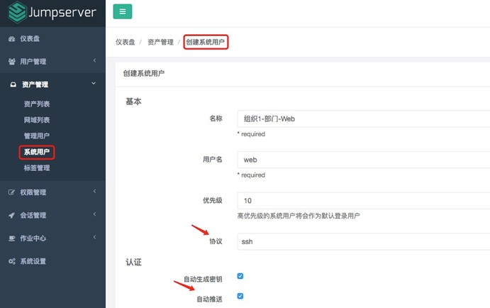

 

（5）创建资产

① 点击页面左侧的"资产管理"菜单下的"资产列表"按钮，查看当前所有的资产列表。

点击页面左上角的"创建资产"按钮，进入资产创建页面，填写资产信息。

IP 地址和管理用户要确保正确，确保所选的管理用户的用户名和密码能"牢靠"地登录指定的 IP 主机上。资产的系统平台也务必正确填写。公网 IP 信息只用于展示，可不填，Jumpserver 连接资产使用的是 IP 信息。

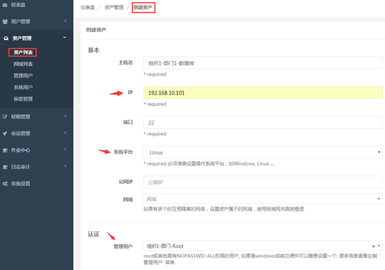

② 资产创建信息填写好保存之后，可测试资产是否能正确连接：

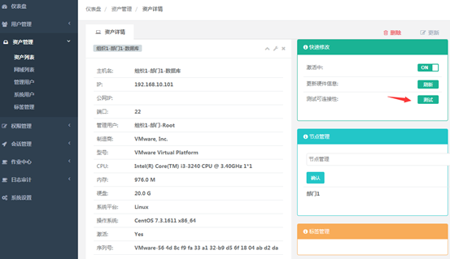

③ 测试成功；如果资产不能正常连接，请检查管理用户的用户名和密钥是否正确以及该管理用户是否能使用 SSH 从 Jumpserver 主机正确登录到资产主机上。

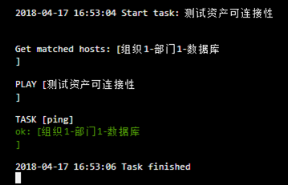

 

（6）网域列表（如果有需要的话）

网域功能是为了解决部分环境无法直接连接而新增的功能，原理是通过网关服务器进行跳转登录。

点击页面左侧的"网域列表"按钮，查看所有网域列表。

① 点击页面左上角的"创建网域"按钮，进入网域创建页面，选择资产里用作网域的网关服务器。

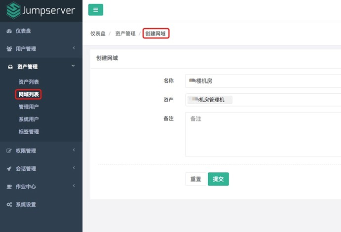

② 点击网域的名称，进入网域详情列表。

点击页面的"网关"按钮，选择网关列表的"创建网关"按钮，进入网关创建页面，填写网关信息。

IP信息一般默认填写网域资产的IP即可（如用作网域的资产有多块网卡和IP地址，选能与jumpserer通信的任一IP即可），用户名与密码可以在资产上面创建亦可使用jumpserver的推送功能（需要手动输入密码），确认该用户拥有执行ssh命令的权限。

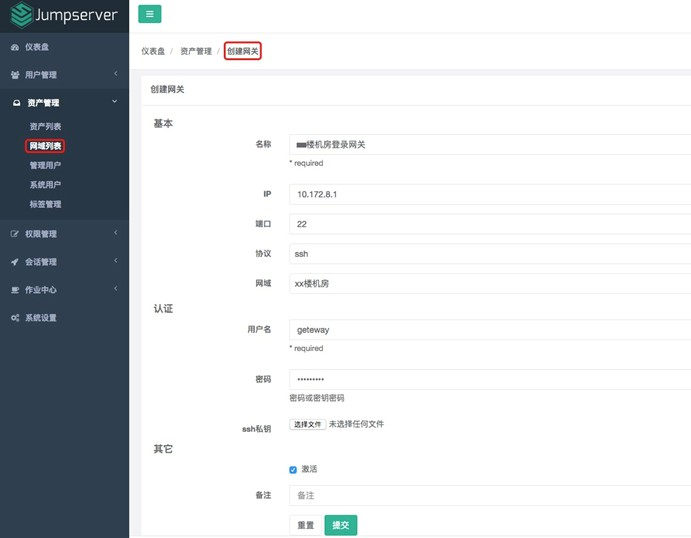

③ 保存信息后点击测试连接，确定设置无误后到资产列表添加需要使用网关登录的资产即可。

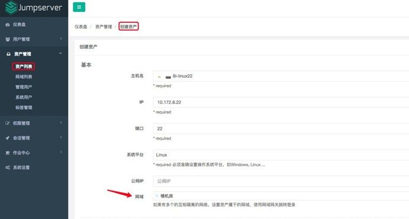

 

### **3.1 创建 Windows 资产（很容易出错，多注意）**

（1）创建 Windows 系统管理用户

同 Linux 系统的管理用户一样，名称可以按资产树来命名，用户名是管理员用户名，密码是管理员的密码。

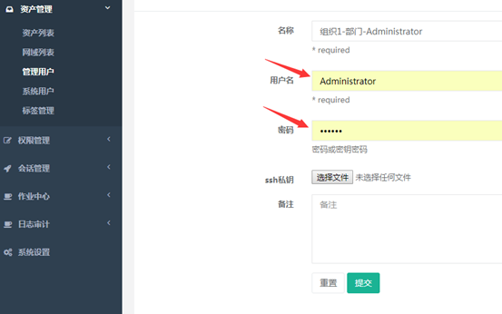

（2）创建 Windows 系统系统用户

目前 Windows 暂不支持自动推送，用户必须在系统中存在且有权限使用远程连接，请去掉自动生成密钥、自动推送勾选；请确认 windows 资产的 rdp 防火墙已经开放。

Windows 资产协议务必选择 rdp。

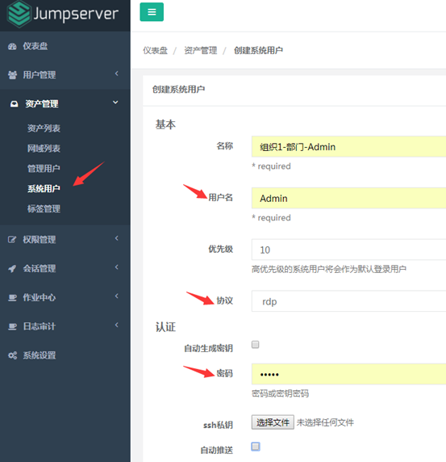

（3）创建 Windows 资产

同创建 Linux 资产一样。

创建 Windows 资产，系统平台请选择正确的 Windows，端口号为3389，IP 和 管理用户请正确选择，确保管理用户能正确登录到指定的 IP 主机上。

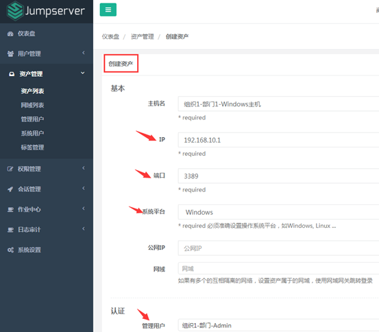

 

## **4、资产节点管理**

### **4.1 为资产树节点分配资产**

在资产列表页面，选择要添加资产的节点，右键，选择添加资产到节点。

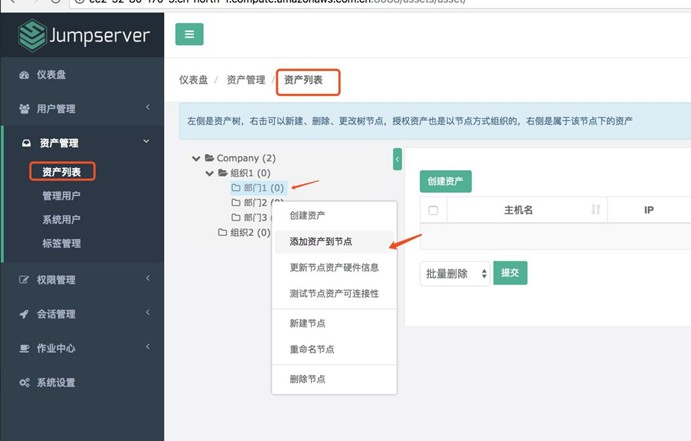

选择要被添加的资产，点击"确认"即可。

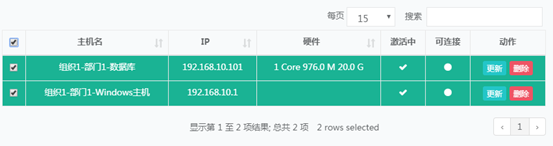

### **4.2 删除节点资产**

选择要被删除的节点，选择"从节点删除"，点击"提交"即可。

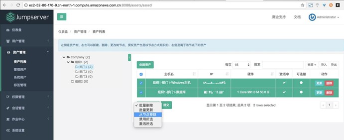

 

## **5、创建授权规则**

① 节点，对应的是资产，代表该节点下的所有资产。

② 用户组，对应的是用户，代表该用户组下所有的用户。

③ 系统用户，及所选的用户组下的用户能通过该系统用户使用所选节点下的资产。

④ 节点，用户组，系统用户是一对一的关系，所以当拥有 Linux、Windows 不同类型资产时，应该分别给 Linux 资产和 Windows 资产创建授权规则。

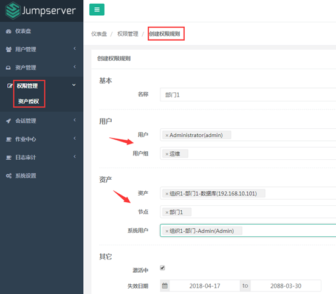

创建的授权规节点要与资产所在的节点一致。

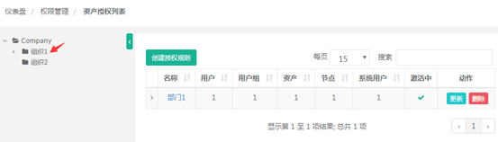

## **6、用户使用资产**

### **6.1 登录 Jumpserver**

创建授权规则的时候，选择了用户组，所以这里需要登录所选用户组下面的用户才能看见相应的资产。

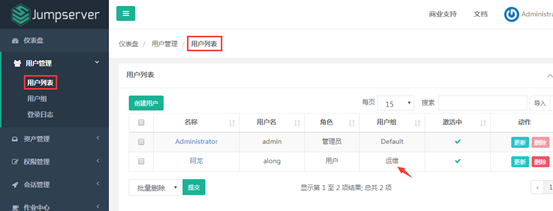

用户正确登录后的页面：

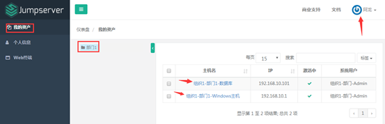

 

### **6.2 使用资产**

（1）连接资产

① 点击页面左边的 Web 终端：

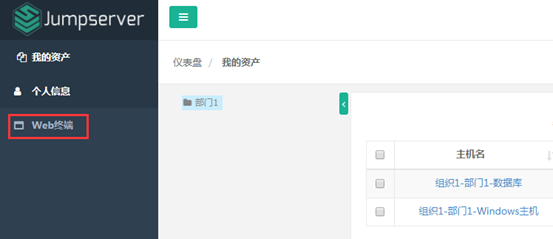

② 打开资产所在的节点：

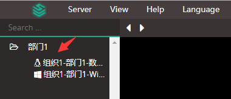

③ 双击资产名字，就连上资产了：

如果显示连接超时，请检查为资产分配的系统用户用户名和密钥是否正确，是否正确选择 Windows 操作系统，协议 rdp，端口3389，是否正确选择 Linux 操作系统，协议 ssh，端口22，以及资产的防火墙策略是否正确配置等信息。接下来，就可以对资产进行操作了。

④ 测试

创建一个test

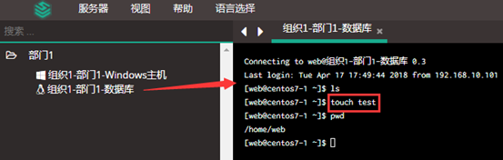

在服务器上，确实有test 文件

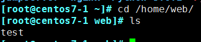

（2）连接windows 资源

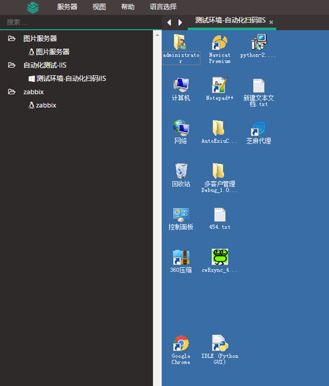

 

### **6.2.2 断开资产**

点击页面顶部的 Server 按钮会弹出选个选项，第一个断开所选的连接，第二个断开所有连接。

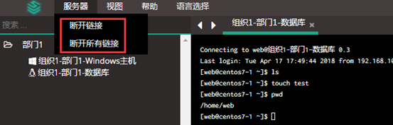

以上就是 Jumpserver 的简易入门了，在使用过程中，如果遇到什么问题，可以与我讨论。