# KVM 虚拟化技术

## 一、前言

### 1、什么是虚拟化？

在计算机技术中，虚拟化（技术）或虚拟技术（英语：Virtualization）是一种资源管理技术，是将计算机的各种实体资源（CPU、内存、磁盘空间、网络适配器等），予以抽象、转换后呈现出来并可供分区、组合为一个或多个电脑配置环境。

 

图 - 虚拟化示意图

由此，打破实体结构间的不可切割的障碍，使用户可以比原本的配置更好的方式来应用这些电脑硬件资源。这些资源的新虚拟部分是不受现有资源的架设方式，地域或物理配置所限制。

一般所指的虚拟化资源包括计算能力和数据存储。

由于目前信息技术领域的很多企业都曾在宣传中将该企业的某种技术称为虚拟化技术，这些技术涵盖的范围可以从Java虚拟机技术到系统管理软件，这就使得准确的界定虚拟技术变得困难。因此各种相关学术论文在谈到虚拟技术时常常提到的便是如前面所提到的那个不严格的定义。

### 2、为什么要用虚拟化

　　同一台物理机运行多个不同版本应用软件

　　硬件依赖性较低和便于数据迁移

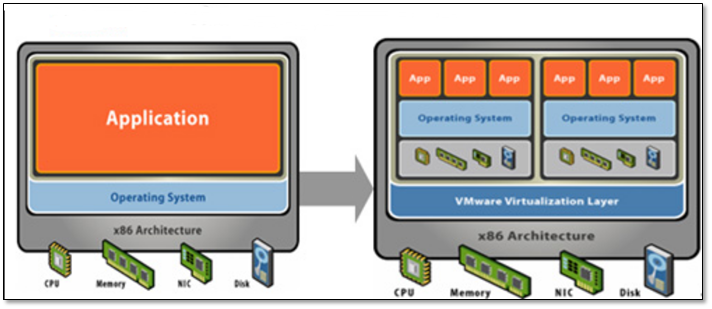

图 - 虚拟化前后对比

### 3、虚拟化技术的优势

　　**1.降低运营成本**

　　服务器虚拟化降低了IT基础设施的运营成本，令系统管理员摆脱了繁重的物理服务器、OS、中间件及兼容性的管理工作，减少人工干预频率，使管理更加强大、便捷。

　　**2.提高应用兼容性**

　　服务器虚拟化提供的封装性和隔离性使大量应用独立运行于各种环境中，管理人员不需频繁根据底层环境调整应用，只需构建一个应用版本并将其发布到虚拟化后的不同类型平台上即可。

　　**3.加速应用部署**

　　采用服务器虚拟化技术只需输入激活配置参数、拷贝虚拟机、启动虚拟机、激活虚拟机即可完成部署，大大缩短了部署时间，免除人工干预，降低了部署成本。

　　**4.提高服务可用性**

　　用户可以方便地备份虚拟机，在进行虚拟机动态迁移后，可以方便的恢复备份，或者在其他物理机上运行备份，大大提高了服务的可用性。

　　**5.提升资源利用率**

　　通过服务器虚拟化的整合，提高了CPU、内存、存储、网络等设备的利用率，同时保证原有服务的可用性，使其安全性及性能不受影响。

　　**6.动态调度资源**

　　在服务器虚拟化技术中，数据中心从传统的单一服务器变成了统一的资源池，用户可以即时地调整虚拟机资源，同时数据中心管理程序和数据中心管理员可以灵活根据虚拟机内部资源使用情况灵活分配调整给虚拟机的资源。

　　**7.降低能源消耗**

　　通过减少运行的物理服务器数量，减少CPU以外各单元的耗电量，达到节能减排的目的。

### 4、KVM简介


　　KVM，基于内核的虚拟机（英语：Kernel-based Virtual Machine，缩写为 KVM），是一种用于Linux内核中的虚拟化基础设施，可以将Linux内核转化为一个hypervisor。KVM在2007年2月被导入Linux 2.6.20核心中，以可加载核心模块的方式被移植到 FreeBSD 及 illumos 上。

　　KVM 在具备 Intel VT 或 AMD-V 功能的 x86 平台上运行。它也被移植到 S/390，PowerPC 与 IA-64 平台上。在 Linux 内核3.9版中，加入 ARM 架构的支持。

　　KVM 目前由 Red Hat 等厂商开发，对 CentOS/Fedora/RHEL 等 Red Hat 系发行版支持极佳。

### 5、关于KVM

> - KVM是开源软件，全称是 kernel-based virtual machine（基于内核的虚拟机）。
> - 是 x86 架构且硬件支持虚拟化技术（如 intel VT 或 AMD-V）的 Linux 全虚拟化解决方案。
> - 它包含一个为处理器提供底层虚拟化 可加载的核心模块 kvm.ko（kvm-intel.ko或kvm-AMD.ko）。
> - KVM 还需要一个经过修改的 QEMU 软件（qemu-kvm），作为虚拟机上层控制和界面。
> - KVM 能在不改变 linux 或 windows 镜像的情况下同时运行多个虚拟机，（它的意思是多个虚拟机使用同一镜像）并为每一个虚拟机配置个性化硬件环境（网卡、磁盘、图形适配器……）同时KVM还能够使用 ksm 技术帮助宿主服务器节约内存。
> - 在主流的 Linux 内核，如 2.6.20 以上的内核均已包含了 KVM 核心。

### 6、关于 Virtual Machine Manager

　　在电脑运算中，红帽公司的 Virtual Machine Manager 是一个虚拟机管理员，可以让用户管理多个虚拟机。

　　基于内核的虚拟机 libvirt 与 Virtual Machine Manager。 

​        **Virtual Machine Manager可以让用户**：

　　创建、编辑、引导或停止虚拟机。

　　查看并控制每个虚拟机的控制台。

　　查看每部虚拟机的性能以及使用率。

　　查看每部正在运行中的虚拟机以及主控端的即时性能及使用率信息。

　　不论是在本机或远程，皆可使用 KVM、Xen、QEMU。

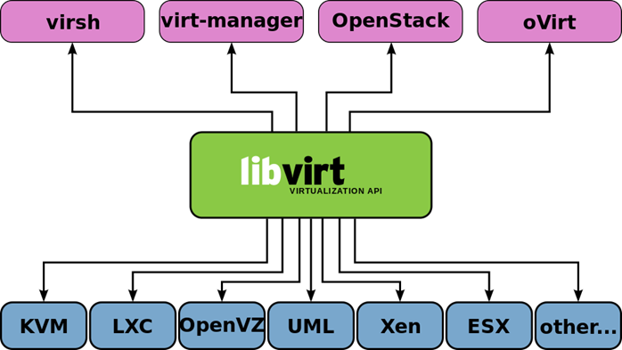

图 -  libvirt服务

### 7、其他虚拟化软件

**Xen**

　　Xen是一个开放源代码虚拟机监视器，由 XenProject 开发。它打算在单个计算机上运行多达128个有完全功能的操作系统。

　　在旧（无虚拟硬件）的处理器上执行 Xen，操作系统必须进行显式地修改后（“移植”）在Xen上运行（提供对用户应用的兼容性）。这使得Xen无需特殊硬件支持，就能达到高性能的虚拟化。

**QEMU**

　　QEMU是一套由 Fabrice Bellard（法布里斯·贝拉） 所编写的模拟处理器的自由软件。它与Bochs，PearPC（模拟器）近似，但其具有某些后两者所不具备的特性，如高速度及跨平台的特性。经由KVM（早期为 kqemu 加速器，现在 kqemu 已被 KVM 取代）这个开源的加速器，QEMU能模拟至接近真实电脑的速度。QEMU有两种主要运作模式：

　　**User mode模拟模式**，亦即是用户模式。

　　QEMU 能引导那些为不同中央处理器编译的 Linux 程序。而 Wine 及 Dosemu 是其主要目标。

　　**System mode模拟模式**，亦即是系统模式。

　　QEMU 能模拟整个电脑系统，包括中央处理器及其他周边设备。它使得为系统源代码进行测试及除错工作变得容易。其亦能用来在一部主机上模拟数部不同虚拟电脑。

## 二、KVM部署与使用

系统环境说明

```shell
[root@kvm ~]# cat /etc/redhat-release 
CentOS Linux release 7.4.1708 (Core) 
[root@kvm ~]# uname -r
3.10.0-693.el7.x86_64
[root@kvm ~]# sestatus 
SELinux status:                 disabled
[root@kvm ~]# systemctl status firewalld.service 
● firewalld.service - firewalld - dynamic firewall daemon
   Loaded: loaded (/usr/lib/systemd/system/firewalld.service; disabled; vendor preset: enabled)
   Active: inactive (dead)
     Docs: man:firewalld(1)
[root@kvm ~]# hostname -I
172.16.1.240 10.0.0.240
# kvm主机内存不能低于4GB
```

### 1、qemu-kvm 介绍、准备工作和命令详解

#### 1、介绍

　　KVM 是个"怪胎"，原本是类型2 的主机虚拟化；但一旦在OS 上加载了kvm.ko 模块，就会"感染"OS，使其变为hypervisor（kvm），原本的软件空间作为控制台，转化成类型1 模式的主机虚拟化

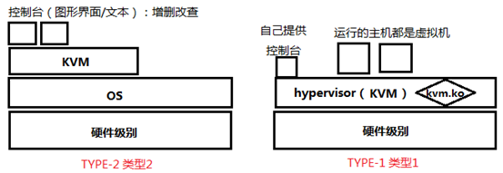

（2）KVM的组件

① kvm.ko：模块

　　API 应用程序编程接口

② qemu-kvm：用户空间的工具程序；

　　qemu-KVM 是一种开源虚拟器，它为KVM管理程序提供硬件仿真。

　　 运行中的一个 kvm 虚拟机就是一个 qemu-kvm 进程，运行 qemu-kvm 程序并传递给它合适的选项及参数即能完成虚拟机启动，终止此进程即能关闭虚拟机；

③ libvirt 虚拟化库：Libvirt是一个C工具包，可以与最近版本的Linux(以及其他操作系统)的虚拟化功能进行交互。主包包含了导出虚拟化支持的libvirtd服务器。

　　C/S：

　　　　Client：

　　　　　　libvirt-client

　　　　　　virt-manager

　　Daemon：

　　　　libvirt-daemon

（3）KVM模块load进内存之后，系统的运行模式：

　　内核模式：GuestOS 执行 IO 类的操作时，或其它的特殊指令操作时的模式；它也被称为"Guest-Kernel"模式；

　　用户模式：Host OS的用户空间，用于代为GuestOS发出IO请求；

　　来宾模式：GuestOS 的用户模式；所有的非IO类请求

#### 2、使用KVM 的准备

（1）前提：

① 必须跑在 x86 系统的架构上

② 必须支持硬件级虚拟化

　　vmx： Intel VT-x

　　svm： AMD AMD-v

③ 在虚拟机上再虚拟化，需开启虚拟化 Intel VT-x/EPT


 

（2）判断CPU是否支持硬件虚拟化：

```
[root@kvm ~]# grep -i -E '(vmx|svm|lm)' /proc/cpuinfo
```

注意：vmx 或 svm 必须出现一个，表示是支持的

　　   vmx： Intel VT-x

　　   svm： AMD AMD-v

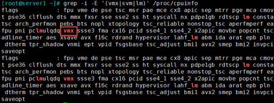

 

（3）安装前准备

① 装载KVM 模块

[root@kvm ~]# **modprobe kvm** 

② 检测kvm 模块是否装载

[root@kvm ~]# lsmod |grep kvm

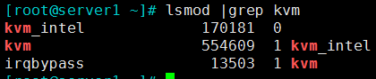

[root@kvm ~]# ll /dev/kvm 字符设备

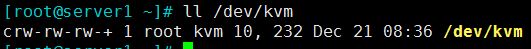

 ③ 安装用户端工具 qemu-kvm

```
[root@kvm ~]# yum install libvirt* virt-* qemu-kvm* -y
```

​    安装软件说明内容：

```
libvirt    # 虚拟机管理
virt       # 虚拟机安装克隆
qemu-kvm   # 管理虚拟机磁盘
```

​    启动服务

```
[root@kvm ~]# systemctl start libvirtd.service
[root@kvm ~]# systemctl status libvirtd.servic
```

### 2、图形化工具virt-manager 创建虚拟机

#### 1、创建物理桥桥接接口br0（注意：使用网络安装的时候创建）

[root@kvm ~]# systemctl start libvirtd.service

[root@kvm ~]# virsh iface-bridge eth0 br0

分析：把自己的物理网卡eth0 作为交换机，把br0 当网卡，提供IP

注意：命令可能会卡死或出错，终端被强制退出；等一会，在登录就OK 了

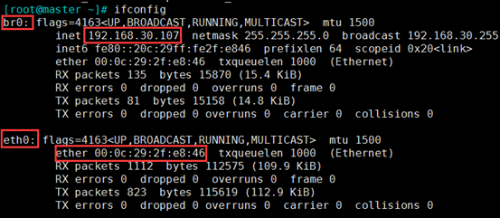

 

#### 2、图形化工具创建虚拟机

（1）打开窗口

[root@kvm ~]# virt-manager

注意：这个命令需在支持图形化界面的机器才能执行， 用其他机器 ssh -X 连接，再执行

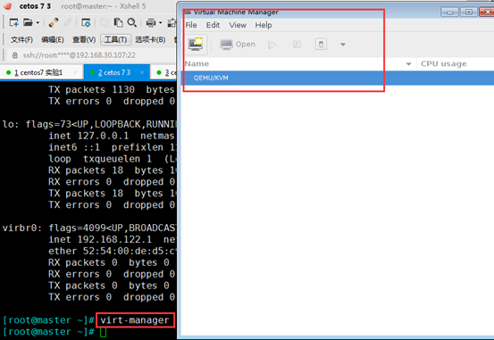

 

（2）创建虚拟机

① 创建新的虚拟机

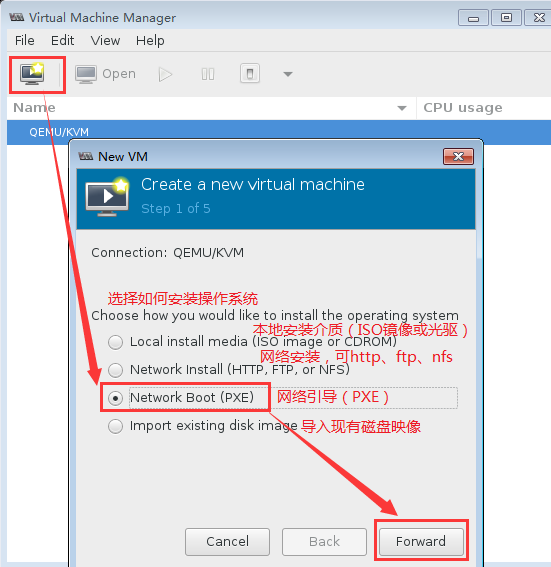

② 选择操作系统类型和版本

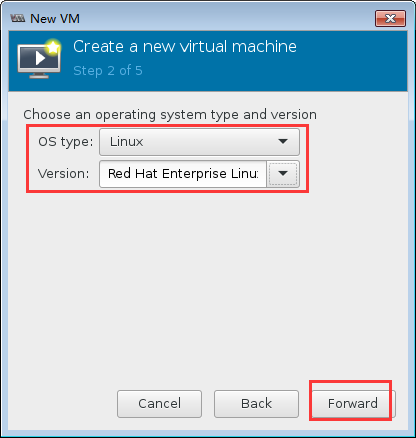

③ 选择内存和CPU 设置

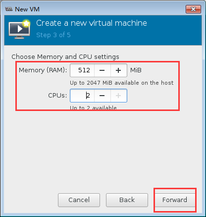

④ 虚拟硬盘有多大

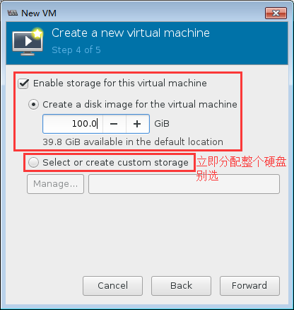

⑤ 网络选择

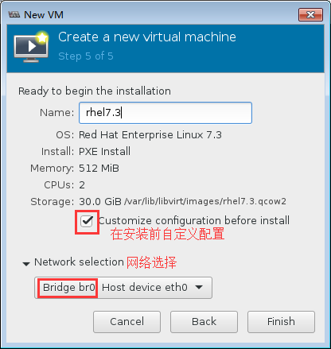

⑥ 详细配置，开始安装

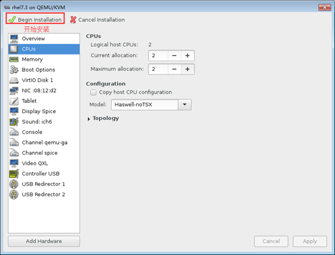

⑦ 进入虚拟化图形管理窗口，选择安装系统版本

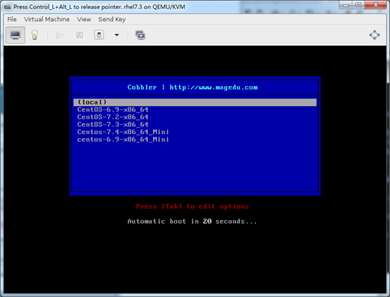

 

### 3、命令行安装KVM虚拟化软件

安装依赖包(可以使用本地yum源)

```
[root@kvm ~]# yum install libvirt* virt-* qemu-kvm* -y
```

安装软件说明内容：

```
libvirt    # 虚拟机管理
virt       # 虚拟机安装克隆
qemu-kvm   # 管理虚拟机磁盘
```

启动服务

```
[root@kvm ~]# systemctl start libvirtd.service
[root@kvm ~]# systemctl status libvirtd.servic
```

安装VNC软件

　　下载vnc软件方法，tightvnc官网：[http://www.tightvnc.com](http://www.tightvnc.com/)

　　VNC软件，用于VNC（Virtual Network Computing），为一种使用RFB协议的显示屏画面分享及远程操作软件。此软件借由网络，可发送键盘与鼠标的动作及即时的显示屏画面。

　　VNC与操作系统无关，因此可跨平台使用，例如可用Windows连接到某Linux的电脑，反之亦同。甚至在没有安装客户端程序的电脑中，只要有支持JAVA的浏览器，也可使用。

　　安装VNC时，使用默认安装即可，无需安装server端。

```
安装：
yum -y install tightvnc
启动
vncviewer
```

 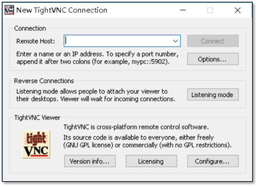

图 - vnc软件

### 2、配置第一台KVM虚拟机

使用命令

```
[root@kvm ~]# virt-install --virt-type kvm --os-type=linux --os-variant rhel7 --name centos7 --memory 1024 --vcpus 1 --disk /data/eden.raw,format=raw,size=10 --cdrom /data/CentOS-7-x86_64-DVD-1511.iso --network network=default --graphics vnc,listen=0.0.0.0,port=5900 --noautoconsole
```

　　**注意：**需要先将镜像文件拷贝到 /data/CentOS-7-x86_64-DVD-1511.iso 。

使用参数说明：

| **参数**                                    | **参数说明**                                                 |
| ------------------------------------------- | ------------------------------------------------------------ |
| **--virt-type HV_TYPE**                     | 要使用的管理程序名称 (kvm, qemu, xen, ...)                   |
| **--os-type**                               | 系统类型                                                     |
| **--os-variant DISTRO_VARIANT**             | 在客户机上安装的操作系统，例如：'fedora18'、'rhel6'、'winxp' 等。 |
| **-n NAME, --name NAME**                    | 客户机实例名称                                               |
| **--memory MEMORY**                         | 配置客户机虚拟内存大小                                       |
| **--vcpus VCPUS**                           | 配置客户机虚拟 CPU(vcpu) 数量。                              |
| **--disk DISK**                             | 指定存储的各种选项。                                         |
| **-cdrom CDROM**                            | 光驱安装介质                                                 |
| **-w NETWORK, --network NETWORK**           | 配置客户机网络接口。                                         |
| **--graphics GRAPHICS**                     | 配置客户机显示设置。                                         |
| **虚拟化平台选项:**                         |                                                              |
| **-v, --hvm**                               | 这个客户机应该是一个全虚拟化客户机                           |
| **-p, --paravirt**                          | 这个客户机应该是一个半虚拟化客户机                           |
| **--container**                             | 这个客户机应该是一个容器客户机                               |
| **--virt-type HV_TYPE**                     | 要使用的管理程序名称 (kvm, qemu, xen, ...)                   |
| **--arch ARCH**                             | 模拟 CPU 架构                                                |
| **--machine MACHINE**                       | 机器类型为仿真类型                                           |
| **其它选项:**                               |                                                              |
| **--noautoconsole**                         | 不要自动尝试连接到客户端控制台                               |
| **--autostart**                             | 主机启动时自动启动域。                                       |
| **--noreboot**                              | 安装完成后不启动客户机。                                     |
| 以上信息通过 " virt-install --help " 获得。 |                                                              |

 　　在启动的同时使用vnc连接

 **用宿主机 IP 地址加端口**

 

   下面就进入到安装系统的操作

### 3、KVM虚拟机管理操作

#### 1、virsh命令常用参数总结

| **参数**                                | **参数说明**                                 |
| --------------------------------------- | -------------------------------------------- |
| **基础操作**                            |                                              |
| **list**                                | 查看虚拟机列表，列出域                       |
| **start**                               | 启动虚拟机，开始一个（以前定义的）非活跃的域 |
| **shutdown**                            | 关闭虚拟机，关闭一个域                       |
| **destroy(危险)**                       | 强制关闭虚拟机，销毁（停止）域               |
| **vncdisplay**                          | 查询虚拟机vnc端口号                          |
| **配置管理操作**                        |                                              |
| **dumpxml**                             | 导出主机配置信息                             |
| **undefine**                            | 删除主机                                     |
| **define**                              | 导入主机配置                                 |
| **domrename**                           | 对虚拟机进行重命名                           |
| **挂起与恢复**                          |                                              |
| **suspend**                             | 挂起虚拟机                                   |
| **resume**                              | 恢复虚拟机                                   |
| **自启动管理**                          |                                              |
| **autostart**                           | 虚拟机开机启动                               |
| **autostart --disable**                 | 取消虚拟机开机启动                           |
| **以上参数通过  “virsh  --help 获得。** |                                              |

#### 2、操作过程

##### 1、KVM虚拟机配置文件位置

```
[root@kvm ~]# ll /etc/libvirt/qemu/centos7.xml

a. 开启子机
virsh start test01
也可以在开启的同时连上控制台
virsh start test01 --console

b. 关闭子机
virsh shutdown test01 （这个需要借助子机上的acpid服务）
另外一种方法是
virsh destroy test01

c. 删除子机
virsh destroy clone1
virsh undefine clone1
rm -f /data/clone1.img
```

##### 2、修改KVM虚拟机配置的方法

```
[root@kvm ~]# virsh edit centos7
```

   使用该命令修改可以对文件进行语法校验。

##### **3、备份虚拟机配置(关机时备份):**

```
[root@kvm ~]# virsh dumpxml centos7  > centos7.xml
```

##### **4、删除虚拟机配置**

```
# 查看
[root@kvm ~]# virsh list --all 
 Id    名称                         状态
----------------------------------------------------
 -     centos7                        关闭
 # 删除
[root@kvm ~]# virsh undefine centos7 
域 centos7 已经被取消定义
[root@kvm ~]# virsh list --all 
 Id    名称                         状态
----------------------------------------------------
```

##### **5、导入虚拟机**

```
# 导入
[root@kvm ~]# virsh define centos7-off.xml 
定义域 centos7（从 centos7-off.xml）
# 查看
[root@kvm ~]# virsh list --all 
 Id    名称                         状态
----------------------------------------------------
 -     centos7                        关闭
```

##### **6、修改虚拟机名称**

```
# 重命名
[root@kvm ~]# virsh domrename centos7 eden7
Domain successfully renamed
# 查看
[root@kvm ~]# virsh list
 Id    名称                         状态
----------------------------------------------------
 9     eden7                          关闭
```

##### **7、虚拟机挂起与恢复**

```
# 挂起虚拟机
[root@kvm ~]# virsh suspend eden7
域 eden7 被挂起
# 查看状态
[root@kvm ~]# virsh list --all
 Id    名称                         状态
----------------------------------------------------
 9     eden7                          暂停
```

##### 8、恢复虚拟机

```
[root@kvm ~]# virsh resume eden7 
域 eden7 被重新恢复
```

##### **9、查询虚拟机vnc端口**

```
[root@kvm ~]# virsh vncdisplay eden7 
:0  
# :0 即 为 5900 端口，以此类推 :1为5901 。
```

##### **10、开机自启动设置**

```
# 设置 libvirtd 服务开机自启动。
[root@kvm ~]# systemctl is-enabled libvirtd.service 
enabled
```

###### 1、设置宿主机开机虚拟机在其他

```
[root@kvm ~]# virsh autostart eden7 
域 eden7标记为自动开始
# 实质为创建软连接
[root@kvm ~]# ll /etc/libvirt/qemu/autostart/eden7.xml 
lrwxrwxrwx 1 root root 27 1月  22 12:17 /etc/libvirt/qemu/autostart/eden7.xml -> /etc/libvirt/qemu/eden7.xml
```

###### 2、取消开机自启动

```
[root@kvm ~]# virsh autostart --disable eden7 
域 eden7取消标记为自动开始
```

## 三、kvm 虚拟机 console 登录

### 1、CentOS 7.X 版本 console 登录

#### 1、配置console登录 

**在 eden7 虚拟机内部操作 (该操作仅限 centos7)：**

```
[root@eden7 ~]# grubby --update-kernel=ALL --args="console=ttyS0,115200n8"
[root@eden7 ~]# reboot
# 115200n8：能显示虚拟机的启动过程
```

#### 2、重启完成后，使用 virsh console 连接虚拟机

```
[root@kvm ~]# virsh console eden7 
连接到域 eden7
换码符为 ^]
CentOS Linux 7 (Core)
Kernel 3.10.0-327.el7.x86_64 on an x86_64

eden7 login: root
Password: 
Last login: Mon Jan 22 12:24:48 from 192.168.122.1
[root@eden7 ~]# w
 12:26:11 up 0 min,  1 user,  load average: 0.09, 0.03, 0.01
USER     TTY      FROM             LOGIN@   IDLE   JCPU   PCPU WHAT
root     ttyS0                     12:26    3.00s  0.02s  0.01s w
```

### 2、CentOS 6.X 版本 console 登录

使用virsh console连接CentOS 6虚拟主机方法：

#### 1、安装一台 centos6 的 kvm 虚拟机

```
virt-install --virt-type kvm --os-type=linux --os-variant rhel6 \
--name eden6 --memory 1124 --vcpus 1 \
--disk /data/eden6/eden-6.raw,format=raw,size=10 \
--cdrom /data/CentOS-6.9-x86_64-bin-DVD1.iso \
--network network=default --graphics vnc,listen=0.0.0.0,port=5901 \
--noautoconsole
```

　　新安装一台虚拟机后，是无法通过virsh console 命令连入虚拟机中的，这时我们需要开启虚拟机的console功能。

　　以下操作都在虚拟机中进行

#### 2、添加 ttyS0 的许可，允许 root 登陆

```
[root@eden6 ~]# echo "ttyS0" >> /etc/securetty 
```

#### 3、编辑 /etc/grub.conf 中加入 console=ttyS0

   在该文件的第16行。kernel选项后添加

```shell
[root@eden6 ~]# sed -i '/\tkernel/s#.*#& console=ttyS0#g' /etc/grub.conf
[root@eden6 ~]# sync  # 同步配置到 /boot/grub/grub.conf
[root@eden6 ~]# cat -n  /etc/grub.conf 
# grub.conf generated by anaconda
#
# Note that you do not have to rerun grub after making changes to this file
# NOTICE:  You have a /boot partition.  This means that
#          all kernel and initrd paths are relative to /boot/, eg.
#          root (hd0,0)
#          kernel /vmlinuz-version ro root=/dev/vda3
#          initrd /initrd-[generic-]version.img
#boot=/dev/vda
default=0
timeout=5
splashimage=(hd0,0)/grub/splash.xpm.gz
hiddenmenu
title CentOS 6 (2.6.32-696.el6.x86_64)
    root (hd0,0)
    kernel /vmlinuz-2.6.32-696.el6.x86_64 ro root=UUID=48532582-c271-4c0a-b55f-395fe16cd8aa rd_NO_LUKS rd_NO_LVM LANG=en_US.UTF-8 rd_NO_MD SYSFONT=latarcyrheb-sun16 crashkernel=auto  KEYBOARDTYPE=pc KEYTABLE=us rd_NO_DM rhgb quiet console=ttyS0
    initrd /initramfs-2.6.32-696.el6.x86_64.img
```

#### 4、编辑/etc/inittab

　　在最后一行加入内容 S0:12345:respawn:/sbin/agetty ttyS0 115200

```
[root@eden6 ~]# echo 'S0:12345:respawn:/sbin/agetty ttyS0 115200' >>/etc/inittab
```

#### 5、以上操作都完成后，重启虚拟机

```
[root@eden6 ~]# reboot
```

以下操作在kvm宿主机上执行

##### 1、检查虚拟机的状态

```
[root@kvm ~]# virsh list --all
 Id    名称                         状态
----------------------------------------------------
 11    eden7                          running
 21    eden6                          running
```

##### 2、进行连接测试

```
[root@kvm ~]# virsh console eden6 
连接到域 eden6
换码符为 ^]  # 注：退出virsh console连接的方法，使用组合键Ctrl+]即可

CentOS release 6.9 (Final)
Kernel 2.6.32-696.el6.x86_64 on an x86_64

eden6 login: root
Password: 
Last login: Mon Jan 22 05:44:25 on ttyS0
[root@eden6 ~]# who
root     ttyS0        2018-01-22 05:50
# 登陆成功，查看登陆接口为之前设置的ttyS0
```

## 四、KVM虚拟机磁盘、快照与克隆

### 1、磁盘管理

#### 1、KVM qcow2、raw、vmdk等镜像格式说明

```
目前主要有那些格式来作为虚拟机的镜像：

raw

老牌的格式了，用一个字来说就是裸，也就是赤裸裸，你随便dd一个file就模拟了一个raw格式的镜像。由于裸的彻底，性能上来说的话还是不错的。目前来看，KVM和XEN默认的格式好像还是这个格式。因为其原始，有很多原生的特性，例如直接挂载也是一件简单的事情。 裸的好处还有就是简单，支持转换成其它格式的虚拟机镜像对裸露的它来说还是很简单的（如果其它格式需要转换，有时候还是需要它做为中间格式），空间使用来看，这个很像磁盘，使用多少就是多少（du -h看到的大小就是使用大小），但如果你要把整块磁盘都拿走的话得全盘拿了（copy镜像的时候），会比较消耗网络带宽和I/O。接下来还有个有趣的问题，如果那天你的硬盘用着用着不够用了，你咋办，在买一块盘。但raw格式的就比较犀利了，可以在原来的盘上追加空间：

dd if=/dev/zero of=zeros.raw bs=1024k count=4096   # 先创建4G的空间

catforesight.img zeros.raw > new-foresight.img    # 追加到原有的镜像之后

当然，好东西不是吹出来的，谁用谁知道，还是有挺多问题的。由于原生的裸格式，不支持snapshot也是很正常的。传说有朋友用版本管理软件对raw格式的文件做版本管理从而达到snapshot的能力，估计可行，但没试过，这里也不妄加评论。但如果你使用LVM的裸设备，那就另当别论。说到LVM还是十分的犀利的，当年用LVM做虚拟机的镜像，那性能杠杠的。而且现在好多兄弟用虚拟化都采用LVM来做的。在LVM上做了很多的优化，国外听说也有朋友在LVM增量备份方面做了很多的工作。目前来LVM的snapshot、性能、可扩展性方面都还是有相当的效果的。目前来看的话，备份的话也问题不大。就是在虚拟机迁移方面还是有很大的限制。但目前虚拟化的现状来看，真正需要热迁移的情况目前需求还不是是否的强烈。虽然使用LVM做虚拟机镜像的相关公开资料比较少，但目前来看牺牲一点灵活性，换取性能和便于管理还是不错的选择。

对于LVM相关的特性及使用可以参考如下链接：http://www.ibm.com/developerworks/linux/library/l-lvm2/index.html

cow
copy-on-write format, supported for historical reasons only and not available to QEMU on Windows

曾经qemu的写时拷贝的镜像格式，目前由于历史遗留原因不支持窗口模式。从某种意义上来说是个弃婴，还没等它成熟就死在腹中，后来被qcow格式所取代。

qcow
the old QEMU copy-on-write format, supported for historical reasons and superseded by qcow2

一代的qemu的cow格式，刚刚出现的时候有比较好的特性，但其性能和raw格式对比还是有很大的差距，目前已经被新版本的qcow2取代。其性能可以查看如下链接：http://www.linux-kvm.org/page/Qcow2

qcow2

现在比较主流的一种虚拟化镜像格式，经过一代的优化，目前qcow2的性能上接近raw裸格式的性能，这个也算是redhat的官方渠道了，哈哈，希望有朋友能拍他们砖：https://fedoraproject.org/wiki/Features/KVM_qcow2_Performance

对于qcow2的格式，几点还是比较突出的，qcow2的snapshot，可以在镜像上做N多个快照：

更小的存储空间，即使是不支持holes的文件系统也可以（这下du -h和ls -lh看到的就一样了）
Copy-on-write support, where the image only represents changes made to an underlying disk image（这个特性SUN ZFS表现的淋漓尽致）
支持多个snapshot，对历史snapshot进行管理
支持zlib的磁盘压缩
支持AES的加密

vmdk

VMware的格式，这个格式说的蛋疼一点就有点牛X，原本VMware就是做虚拟化起家，自己做了一个集群的VMDK的pool，做了自己的虚拟机镜像格式。又拉着一些公司搞了一个OVF的统一封包。从性能和功能上来说，vmdk应该算最出色的，由于vmdk结合了VMware的很多能力，目前来看，KVM和XEN使用这种格式的情况不是太多。但就VMware的Esxi来看，它的稳定性和各方面的能力还是可圈可点。

vdi
VirtualBox 1.1 compatible image format, for exchanging images with VirtualBox.

SUN收购了VirtualBox，Oracle又收购了SUN，这么说呢，vdi也算虚拟化这方面的一朵奇葩，可惜的是入主的两家公司。SUN太专注于技术（可以说是IT技术最前端也不为过），Oracle又是开源杀手（mysql的没落）。单纯从能力上来说vdi在VirtualBox上的表现还是不错的。也是不错的workstation级别的产品。

说了这么多虚拟机镜像格式，这么多虚拟化，做云计算的伤不起呀，得为长期发展考虑，也有朋友对镜像的转换做了很多事情，简单看看几种镜像的转化：

转换工具
VMDK–>qcow2
qemu-img convert -f vmdk -O qcow2 SLES11SP1-single.vmdk SLES11SP1-single.img
http://www.ibm.com/developerworks/cn/linux/l-cn-mgrtvm3/index.html
qcow2–>raw
qemu-img convert -O raw eden.qcow2 bb.raw
raw-> qcow2
qemu-img convert -f raw -O qcow2 eden.raw  eden-1.qcow2                    
 
将OVA或VMDK格式转换为Xen可运行格式
将VMDK转换为Xen可运行格式
假设待转换vmdk格式的硬盘为origin.vmdk
要有qemu-img和vmware-vdiskmanager两个工具
安装qemu来获得qemu-img工具
安装vmware server来获得vmware-vdiskmanager工具
首先运行:vmware-vdiskmanager -r origin.vmdk -t 0 temp.vmdk
然后运行:qemu-img convert -f vmdk temporary_image.vmdk -O raw xen_compatible.img

将 ova 格式转换为 Xen 可读格式
假设待转换文件为origin.ova,在windows下将其改为origin.rar直接解压缩或在Linux下使用tar xvf oringin.ova解压缩。
解压缩后生成三个文件:
xxx.vmdk
xxx.mf
xxx.ovf
使用上文方法一的步骤将xxx.vmdk转为Xen可运行格式。
转换VMWare的image让KVM能使用
我们先要安装一个小软件virt-goodies: sudo apt-get install virt-goodies
然后使用vmware2libvirt来给VMWare VM的基本资料vmx转成KVM可以读入的XML. 如: vmware2libvirt -f myvm.vmx > myvm.xml
使用qemu-img将VMWare VM的disk image转成KVM能读的文件: qemu-img convert -f vmdk myvm.vmdk -O qcow2 myvm.qcow2
可能还需要修改一下vmx转成的xml
disk中的target dev,在VMWARE是ide(target dev=’hda’ bus=’ide’)可能要修改成scsi(target dev=’sda’ bus=’scsi’),我们看能不能找到ROOT就知道是不是用对了;
bridge mode, 给interface type=’network’修改成interface type=’bridge’, 而source network=’default’修改成source bridge=’br0′.
qcow选项，则会创建QCOW（写时复制）格式
修改后给VM的配置加入到libvirtd中.
virsh -c qemu:///system define myvm.xml
virsh -c qemu:///system list --all 
```

```
# 创建一块qcow2的虚拟硬盘(仅测试使用，无实际意义)
[root@kvm data]# qemu-img create -f qcow2 eden.qcow2 2G
[root@kvm data]# ls -l
```

#### 2、查看当前虚拟机硬盘信息

```shell
[root@kvm ~]# qemu-img info /data/eden.raw 
image: /data/eden.raw
file format: raw
virtual size: 10G (10737418240 bytes)
disk size: 1.1G
```

#### **3、磁盘格式转换：**

```shell
# 参数说明
[root@kvm data]# qemu-img  --help | grep convert 
qemu-img convert [-f fmt] [-O output_fmt] input_filename  output_filename
-f 指定当前文件格式
-O 指定输出文件格式 output文件的格式
input_filename  要进行转换的磁盘名称
output_filename  要转换成的磁盘名称
```

​     **qcow2 转 raw 格式：**

  ```shell
[root@kvm data]# qemu-img convert -O raw eden.qcow2  eden.raw
  ```

​    **raw 转 qcow2 格式**：

```shell
[root@kvm data]# qemu-img convert -f raw -O qcow2 eden.raw eden.qcow2
```

##### 1、修改 eden7 虚拟机配置文件

```xml
[root@kvm data]# virsh edit eden7 
修改前：
    <disk type='file' device='disk'>
      <driver name='qemu' type='raw'/>
      <source file='/data/eden.raw'/>
      <target dev='vda' bus='virtio'/>
      <address type='pci' domain='0x0000' bus='0x00' slot='0x06' function='0x0'/>
    </disk>
修改后：
    <disk type='file' device='disk'>
      <driver name='qemu' type='qcow2'/>
      <source file='/data/eden.qcow2'/>
      <target dev='vda' bus='virtio'/>
      <address type='pci' domain='0x0000' bus='0x00' slot='0x06' function='0x0'/>
    </disk>
```

#### 2、删除原磁盘文件

```
[root@kvm data]# \rm eden.raw
```

#### 3、启动虚拟机

```
[root@kvm data]# virsh start eden7 

[root@kvm data]# virsh list --all 
 Id    名称                         状态
----------------------------------------------------
 22    eden7                          running
```

### 2、KVM 虚拟机添加硬盘

#### 1、进入硬盘存放目录

```
[root@kvm ~]# cd /data
```

#### 2、创建一块新的硬盘

```
[root@kvm data]# qemu-img create -f qcow2 eden7-add01.qcow2 5G 
Formatting 'eden7-add01.qcow2', fmt=qcow2 size=5368709120 encryption=off cluster_size=65536 lazy_refcounts=off 
```

#### 3、查看创建的硬盘信息

```
[root@kvm data]# qemu-img info eden7-add01.qcow2 
image: eden7-add01.qcow2
file format: qcow2
virtual size: 5.0G (5368709120 bytes)
disk size: 196K
cluster_size: 65536
Format specific information:
    compat: 1.1
    lazy refcounts: false
```

#### 4、为虚拟机添加硬盘

```
[root@kvm data]# virsh attach-disk eden7 /data/eden7-add01.qcow2 vdb --live --cache=none --subdriver=qcow2
# 成功附加磁盘
```

参数说明：

| **参数**        | **参数说明** |
| --------------- | ------------ |
| **vdb**         | 第二块硬盘   |
| **--live**      | 热添加       |
| **--subdriver** | 驱动类型     |

```
qemu-kvm磁盘读写的缓冲(cache)的五种模

qemu-kvm磁盘读写的缓冲(cache)模式一共有五种，分别是
writethrough, writeback, none, unsafe, directsync
当你对VM读写磁盘的性能有不同的要求的时候，你可以在其启动的参数(cache=xxxx)
里面进行一个合理的选择.
现在来简单说一说这五种模式的各自的特点(默认的是writeback)

cache=writethrough:
　　该模式对应的标志位是O_DSYNC，仅当数据被提交到了存储设备里面的时候，写操作
　　才会被完整的通告。此时host的页缓存可以被用在一种被称为writethrough缓存的模式。
　　guest的虚拟存储设备被告知没有回写缓存(writeback cache)，因此guest不需要为了
　　操纵整块数据而发送刷新缓存的指令了。此时的存储功能如同有一个直写缓存(writethrough cache)一样

cache=none:
　　所对应的标志位是O_DIRECT,在 none 模式下，VM的IO操作直接
　　在qemu-kvm的userspace缓冲和存储设备之间进行，绕开了host的页缓冲。
　　这个过程就相当于让vm直接访问了你的host的磁盘，从而性能得到了提升。

cache=writeback:
　　对应的标志位既不是 O_DSYNC 也不是 O_DIRECT ,在writeback模式下，IO操作会经过
　　host的页缓冲，存放在host页缓冲里的写操作会完整地通知给guest.
　　除此之外,guest的虚拟存贮适配器会被告知有回写缓存(writeback cache),所以为了能够
　　整体地管理数据，guest将会发送刷新缓存的指令.类似于带有RAM缓存的磁盘阵列(RAID)管理器.

cache=unsafe:
　　该模式与writeback差不多，不过从guest发出的刷新缓存指令将会被忽视掉，这意味着使用者
　　将会以牺牲数据的完整性来换取性能的提升。

cache=directsync:
　　该模式所对应的标志位是O_DSYNC和O_DIRECT,仅当数据被提交到了存储设备的时候，写
　　操作才会被完整地通告,并且可以放心地绕过host的页缓存。
　　就像writethrough模式,有时候不发送刷新缓存的指令时很有用的.该模式是最新添加的一种cache模式，
　　使得缓存与直接访问的结合成为了可能.
```

#### 6、调整已添加硬盘的大小

```
[root@kvm data]# virsh --help |grep disk 
    attach-disk                    #附加磁盘设备
    detach-disk                    #分离磁盘设备
```

#### 7、将已挂载的磁盘卸载下来

```
[root@kvm data]# virsh detach-disk eden7  vdb 
成功分离磁盘
```

#### 8、调整磁盘大小

```
# 使用参数
[root@kvm data]# qemu-img --help |grep resize
resize [-q] filename [+ | -]size
```

#### 9、增加 1G 容量

```
[root@kvm data]# qemu-img resize eden7-add01.qcow2 +1G
Image resized.
[root@kvm data]# qemu-img info eden7-add01.qcow2 
image: eden7-add01.qcow2
file format: qcow2
virtual size: 6.0G (6442450944 bytes)
disk size: 260K
cluster_size: 65536
Format specific information:
    compat: 1.1
    lazy refcounts: false
```

#### 10、重新将磁盘添加到虚拟机

```
[root@kvm data]# virsh attach-disk eden7 /data/eden7-add01.qcow2 vdb --live --cache=none --subdriver=qcow2
```

#### 11、在虚拟机中操作

##### 1、格式化磁盘

```
[root@eden7 ~]# mkfs.xfs /dev/vdb 
```

##### 2、挂载磁盘

```
[root@eden7 ~]# df -h |grep /dev/vdb
/dev/vdb        6.0G   33M  6.0G   1% /opt    
```

##### 3、使用 **xfs_growfs** 刷新磁盘的信息

```
[root@eden7 ~]# xfs_growfs --help 
xfs_growfs: invalid option -- '-'
Usage: xfs_growfs [options] mountpoint
```

### 3、快照管理

```
命令行：
virsh list                                   # 显示本地活动虚拟机
virsh list –all                              # 显示本地所有的虚拟机（活动的+不活动的）
virsh define eden7.xml                       # 通过配置文件定义一个虚拟机（这个虚拟机还不是活动的）
virsh start eden7                            # 启动名字为ubuntu的非活动虚拟机
virsh create eden7.xml                       # 创建虚拟机（创建后，虚拟机立即执行，成为活动主机）
virsh suspend eden7                          # 暂停虚拟机
virsh resume eden7                           # 启动暂停的虚拟机
virsh shutdown eden7                         # 正常关闭虚拟机
virsh destroy eden7                          # 强制关闭虚拟机
virsh dominfo ubuneden7tu                    # 显示虚拟机的基本信息
virsh domname 2                              # 显示id号为2的虚拟机名
virsh domid eden7                            # 显示虚拟机id号
virsh domuuid eden7                          # 显示虚拟机的uuid
virsh domstate eden7                         # 显示虚拟机的当前状态
virsh dumpxml eden7                          # 显示虚拟机的当前配置文件（可能和定义虚拟机时的配置不同，因为当虚拟机启动时，需要给虚拟机分配id号、uuid、vnc端口号等等）
virsh setmem eden7 512000                    # 给不活动虚拟机设置内存大小
virsh setvcpus eden7 4                       # 给不活动虚拟机设置cpu个数
virsh edit eden7                             # 编辑配置文件（一般是在刚定义完虚拟机之后）
```

**注意:** raw 格式的磁盘无法创建快照

#### 1、创建快照

```
[root@kvm data]# virsh snapshot-create eden7 
已生成域快照 1516607756
```

#### 2、查看主机快照列表

```
[root@kvm data]# virsh snapshot-list  eden7
 名称               生成时间              状态
------------------------------------------------------------
 1516607756           2018-01-22 15:55:56 +0800 running
# 注：该名称为unix时间戳(格林威治时间)
```

#### 3、查看快照信息

```
[root@kvm data]# virsh snapshot-info  eden7 --snapshotname 1516607756
```

#### 4、登陆虚拟机，进行删除操作

```
[root@eden7 /]# ls -1|egrep -v 'proc|sys|run' |rm -rf
```

#### 5、还原快照

```
[root@kvm data]# virsh snapshot-revert eden7 --snapshotname 1516607756
```

#### 6、删除快照

```
[root@kvm data]# virsh snapshot-delete  eden7 --snapshotname 1516607756
```

##### 7、快照配置文件位置

```
[root@kvm data]# cd  /var/lib/libvirt/qemu/snapshot/
[root@kvm snapshot]# tree
.
└── eden7
    └── 1516607756.xml
```

### 4、kvm虚拟机克隆

　　复制一个虚拟机，需修改如 MAC 地址，名称等所有主机端唯一的配置。

　　虚拟机的内容并没有改变：virt-clone 不修改任何客户机系统内部的配置，它只复制磁盘和主机端的修改。所以像修改密码，修改静态 IP 地址等操作都在本工具复制范围内。如何修改此类型的配置，请参考 virt-sysprep。

#### 1、克隆常用命令

```
[root@kvm ~]# virt-clone --auto-clone -o eden7 
WARNING  设置图形设备端口为自动端口，以避免相互冲突。
正在分配 ‘eden-clone.ra 4% [-                 ] 1.5 MB/s | 464 MB  01:50:18 ETA
```

#### 2、参数说明

| **参数**                                        | **参数说明**                                   |
| ----------------------------------------------- | ---------------------------------------------- |
| **--auto-clone**                                | 从原始客户机配置中自动生成克隆名称和存储路径。 |
| **-o ORIGINAL_GUEST,--original ORIGINAL_GUEST** | 原始客户机名称；必须为关闭或者暂停状态。       |

## 五、kvm 虚拟机网络管理

### 1、桥接网络配置

#### 1、设置桥接网络

```
[root@kvm ~]# virsh iface-bridge eth0 br0
使用附加设备 br0 生成桥接 eth0 失败
已启动桥接接口 br0
```

#####  **1、查看网卡配置文件**

```
# 查看 eth0 配置文件
[root@kvm ~]# cat /etc/sysconfig/network-scripts/ifcfg-eth0
DEVICE=eth0
ONBOOT=yes
BRIDGE="br0"
# 查看 br0 配置文件
[root@kvm ~]# cat /etc/sysconfig/network-scripts/ifcfg-br0 
DEVICE="br0"
ONBOOT="yes"
TYPE="Bridge"
BOOTPROTO="none"
IPADDR="10.0.0.240"
NETMASK="255.255.255.0"
GATEWAY="10.0.0.254"
IPV6INIT="yes"
IPV6_AUTOCONF="yes"
DHCPV6C="no"
STP="on"
DELAY="0"
```

##### 2、修改虚拟机网络配置

```
[root@kvm ~]# virsh edit eden7 
修改前：
    <interface type='network'>
      <mac address='52:54:00:42:bf:bc'/>
      <source network='default'/>
      <model type='virtio'/>
      <address type='pci' domain='0x0000' bus='0x00' slot='0x03' function='0x0'/>
    </interface>
修改后：
    <interface type='bridge'>
      <mac address='52:54:00:42:bf:bc'/>
      <source bridge='br0'/>
      <model type='virtio'/>
      <address type='pci' domain='0x0000' bus='0x00' slot='0x03' function='0x0'/>
    </interface>
```

##### 3、查看宿主机网桥

```
[root@kvm ~]# brctl show 
bridge name    bridge id        STP enabled    interfaces
br0        8000.000c294d551b    yes        eth0
virbr0     8000.5254006aaa40    yes        virbr0-nic
                                vnet0
                                vnet1
```

#####  4、查看防火墙规则

```
    [root@kvm ~]# iptables -t nat  -nvL
    Chain PREROUTING (policy ACCEPT 195 packets, 24665 bytes)
     pkts bytes target     prot opt in     out     source               destination         

    Chain INPUT (policy ACCEPT 131 packets, 16209 bytes)
     pkts bytes target     prot opt in     out     source               destination         

    Chain OUTPUT (policy ACCEPT 272 packets, 24045 bytes)
     pkts bytes target     prot opt in     out     source               destination         

    Chain POSTROUTING (policy ACCEPT 272 packets, 24045 bytes)
     pkts bytes target     prot opt in     out     source               destination         
        0     0 RETURN     all  --  *      *       192.168.122.0/24     224.0.0.0/24        
        1   328 RETURN     all  --  *      *       192.168.122.0/24     255.255.255.255     
       29  1740 MASQUERADE  tcp  --  *      *       192.168.122.0/24    !192.168.122.0/24     masq ports: 1024-65535
        0     0 MASQUERADE  udp  --  *      *       192.168.122.0/24    !192.168.122.0/24     masq ports: 1024-65535
        3   252 MASQUERADE  all  --  *      *       192.168.122.0/24    !192.168.122.0/24 
```

##### 5、修改kvm虚拟机网卡配置文件

```
[root@eden7 ~]# cat /etc/sysconfig/network-scripts/ifcfg-eth0 
TYPE=Ethernet
BOOTPROTO=static
NAME=eth0
DEVICE=eth0
ONBOOT=yes
IPADDR=10.0.0.110
NETMASK=255.255.255.0
GATEWAY=10.0.0.254
DNS1=223.5.5.5
```

##### 6、测试网络连通性

```
[root@eden7 ~]# ping 223.5.5.5 -c1 
PING 223.5.5.5 (223.5.5.5) 56(84) bytes of data.
64 bytes from 223.5.5.5: icmp_seq=1 ttl=128 time=94.4 ms
```

## 六、KVM虚拟机冷/热迁移（扩展）

在进行迁移之前需要准备一台与KVM配置相同的机器（KVM02）,部署好kvm环境。

### 1、虚拟机冷迁移

#### 1、在 kvm02 中安装 kvm 组件

```
[root@kvm02 ~]# yum install libvirt* virt-* qemu-kvm* -y
```

#### 2、配置桥接网络

```
[root@kvm02 ~]# virsh iface-bridge eth0 br0
```

#### 3、将虚拟机关机，导出配置文件

```
[root@kvm01 ~]# virsh dumpxml eden7 > eden7.xml
```

#### 4、将虚拟机文件传输到kvm02上

```
1, 传输配置文件
[root@kvm01]# scp -rp  eden7.xml  10.0.0.201:/root/
2，传输磁盘文件
[root@kvm01]# scp -rp  /var/lib/libvirt/imagers/eden.qcow2 10.0.0.201:/var/lib/libvirt/imagers
```

#### 5、导入配置文件

```
[root@kvm02 ~]# virsh define eden7.xml
```

#### 6、启动虚拟机

```
[root@kvm02 ~]# virsh start eden7
```

#### 7、查看虚拟机状态

```
[root@kvm02 ~]# virsh list --all 
 Id    名称                         状态
----------------------------------------------------
 5     eden7                          running
```

 　  至此，一次KVM冷迁移就完成了

### 2、virt-manager 和 kvm 虚拟机热迁移

　　实现kvm虚拟机热迁移核心：共享存储。在这里使用的时NFS共享存储，

#### 1、NFS（存储端）

```
[root@nfs ~]# vim /etc/hosts [可选]
192.168.122.59  nfs
192.168.122.85  client

[root@nfs ~]# yum -y install nfs-utils
[root@nfs ~]# mkdir /data                                            //存储目录

[root@nfs ~]# vim /etc/exports
/data        192.168.122.0/24(rw,sync,no_root_squash)    //不压制root(当client端使用root挂载时，也有root权限)
[root@nfs ~]# systemctl start nfs-server
[root@nfs ~]# systemctl enable nfs-server
[root@nfs ~]# exportfs -v
/data     192.168.122.0/24(rw,wdelay,no_root_squash,no_subtree_check,sec=sys,rw,secure,no_root_squash,no_all_squash)
```

#### 2、nfs 客户端

```
[root@client ~]# vim /etc/hosts [可选]
192.168.122.59  nfs
192.168.122.85  client

[root@client ~]# yum -y install nfs-utils
1. 查看存储端共享 [可选]
   [root@client ~]# showmount -e nas
   Export list for nas:
   /data 192.168.122.0/24
2. 手动挂载 [可选]
   [root@client ~]# mount -t nfs nas:/data /data
   [root@client ~]# umount /data
3. 自动挂载到网站主目录
   [root@client ~]# vim /etc/fstab
   nas:/data      /data           nfs     defaults        0 0
   [root@client ~]# mount -a
4. 查看挂载
   [root@client ~]# df
   nas:/data     7923136 692416   6821568  10% /data
```

#### 3、安装 virt-manager 所需桌面及 vnc-server

```
[root@kvm ~]# yum groupinstall "GNOME Desktop" -y
# vnc-server端
[root@kvm ~]# yum install tigervnc-server -y
# virt-manager需要软件
[root@kvm ~]# yum install openssh-askpass -y
```

#### 4、配置 vnc 服务

复制vnc配置文件

```
[root@kvm ~]# vi /usr/lib/systemd/system/vncserver@.service
[root@kvm ~]# \cp /usr/lib/systemd/system/vncserver@.service  /usr/lib/systemd/system/vncserver@\:1.service
```

修改配置文件，主要修改<USER>参数。

```
[root@kvm ~]# egrep -v "^#|^$" /usr/lib/systemd/system/vncserver@\:1.service
[Unit]
Description=Remote desktop service (VNC)
After=syslog.target network.target
[Service]
Type=forking
User=root
ExecStartPre=-/usr/bin/vncserver -kill %i
ExecStart=/usr/bin/vncserver %i
PIDFile=/root/.vnc/%H%i.pid
ExecStop=-/usr/bin/vncserver -kill %i
[Install]
WantedBy=multi-user.target
# 用户为root，家目录为root
```

官方提供修改方法

```
# Quick HowTo:
# 1. Copy this file to /etc/systemd/system/vncserver@.service
# 2. Replace <USER> with the actual user name and edit vncserver
#    parameters appropriately
#   ("User=<USER>" and "/home/<USER>/.vnc/%H%i.pid")
# 3. Run `systemctl daemon-reload`
# 4. Run `systemctl enable vncserver@:<display>.service`
```

设置vnc连接时的密码，

```
[root@kvm ~]# vncpasswd 
Password:
Verify:
Would you like to enter a view-only password (y/n)? n  
# y为创建只读用户，n为非只读用户。
```

启动vnc服务，设置开机自启动

```
[root@kvm ~]# systemctl daemon-reload
[root@kvm ~]# systemctl start vncserver@\:1.service
[root@kvm ~]# systemctl enable vncserver@\:1.service
```

查看密码文件及其他配置文件位置

```
[root@kvm ~]# ll ~/.vnc/
```

#### 5、配置NFS存储

安装软件

```
[root@kvm ~]# yum install nfs-utils rpcbind -y
```

修改配置文件

```
[root@kvm ~]# cat /etc/exports
/data   172.16.1.0/24(rw,sync,all_squash,anonuid=0,anongid=0)
```

启动nfs程序

```
[root@kvm ~]# systemctl restart rpcbind 
[root@kvm ~]# systemctl restart nfs
# 设置开机自启动
[root@kvm ~]# systemctl enable rpcbind 
[root@kvm ~]# systemctl enable nfs
```

在kvm02上安装nfs

```
[root@kvm02 ~]#  yum install nfs-utils rpcbind -y
```

   查看共享信息

```
[root@kvm02 ~]# showmount -e 10.0.0.240
Export list for 10.0.0.240:
/data 10.0.0.0/24
```

   挂载目录

```
[root@kvm02 ~]# mount.nfs 10.0.0.240:/data /data
# 加入开机自启动
[root@kvm02 ~]# echo  'mount.nfs 10.0.0.240:/data /data' >>/etc/rc.local
[root@kvm02 ~]# chmod +x /etc/rc.d/rc.local
```

### 3、KVM虚拟机热迁移（实现）

vnc连接KVM01宿主机：

 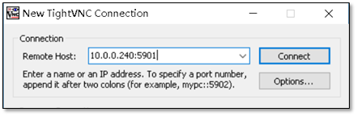

图 - 连接地址

 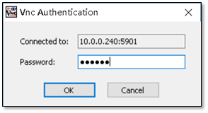

图 - 输入vnc密码

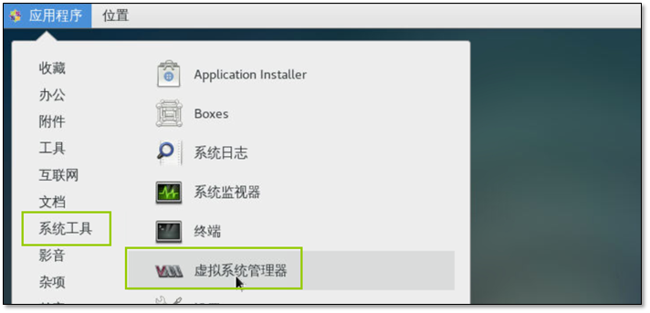

图 - 使用vmm 虚拟系统管理器

**添加 KVM02 宿主机**

 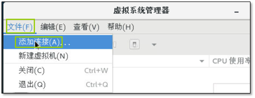

图 - 添加新连接

注：连接上KVM02机器即可

 

图 - 添加上kvm02主机

 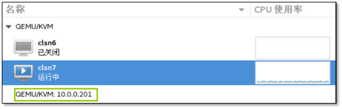

图 - 主机添加完成

**主机热迁移**

 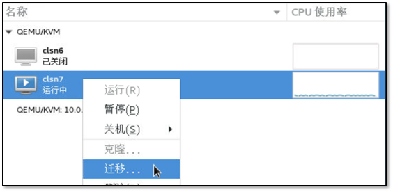

图 - 迁移1

 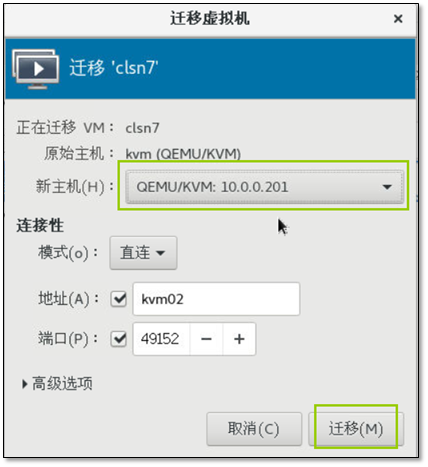

图 - 迁移2，选择要迁移到目的主机

 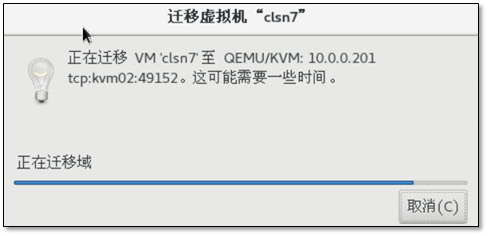

图 - 迁移过程

 

图 - 迁移完成

在kvm02上查看虚拟机状态

```
[root@kvm02 ~]# virsh list --all 
 Id    名称                         状态
----------------------------------------------------
 7     eden7                          running
```

虚拟机配置查看方法：

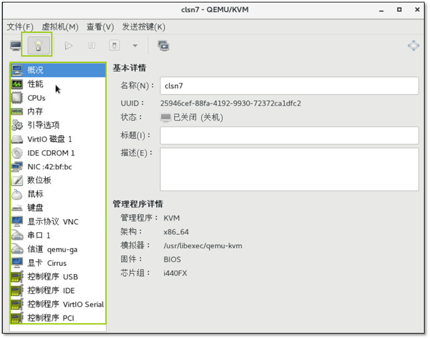

图 - eden7 虚拟机配置信息

说明：在热迁移的过程中可能会参数丢包的情况，一般不会超过1个包。

```
[C:\~]$ ping 10.0.0.110 -t
来自 10.0.0.110 的回复: 字节=32 时间=1ms TTL=64
来自 10.0.0.110 的回复: 字节=32 时间=13ms TTL=64
来自 10.0.0.110 的回复: 字节=32 时间=11ms TTL=64
请求超时。
来自 10.0.0.110 的回复: 字节=32 时间=4ms TTL=64
来自 10.0.0.110 的回复: 字节=32 时间<1ms TTL=64
来自 10.0.0.110 的回复: 字节=32 时间<1ms TTL=64
```

　　至此，一次热迁移就完成了

## 七、KVM 链接克隆

链接克隆脚本

```
#!/bin/bash
# kvm link clone scripts  
# user eden 

# init
if [ $# -ne 2 ]
  then 
    echo "Usage: $0 OLD_VMNAME NEW_VMNAME"
    exit 2
fi
LOG=/var/log/messages
old_vm=$1
new_vm=$2
new_xml="/tmp/${new_vm}.xml"
. /etc/init.d/functions

# dump old xmlfile 
virsh dumpxml $old_vm >$new_xml
old_disk=`awk -F "'" '/source file/{print $2}'  $new_xml`
tmp_dir=`dirname $old_disk`
new_disk=${tmp_dir}/${new_vm}.qcow2

# make link disk 
qemu-img create -f qcow2 -b $old_disk $new_disk &>> $LOG

# make over xml info 
sed -i '/uuid/d' $new_xml
sed -i '/mac address/d' $new_xml
sed -i '2s#'$old_vm'#'$new_vm'#' $new_xml
sed -i "s#$old_disk#$new_disk#g" $new_xml
sed -i '/source mode/d' $new_xml

# import new xml file
virsh define $new_xml &>> $LOG

# start new vm 
virsh start $new_vm &>> $LOG
if [ $? -eq 0 ]
  then 
   action "vmhost $new_vm start"  /bin/true 
else 
   action "vmhost $new_vm start"  /bin/false
   echo "log info : $LOG"
fi

# END
\rm $new_xml
```

说明:

### 1、手动克隆（完整克隆）

第一步：复制虚拟磁盘文件
第二步：修改xml配置文件
　　1）name
　　2）uuid
　　3）虚拟磁盘存储路径
　　4）mac地址

### 2、脚本实现思路

```
1) 备份old_vm的配置文件，并重定向生成一个新的虚拟机配置文件
2）取出old_vm的磁盘路径
3）创建新的链接磁盘文件
4) 修改xml配置文件
5) 导入新虚拟机
6）启动测试
```

## 八、图形化管理虚拟机的工具

（1）图形管理工具：

　　kimchi：基于H5 研发的web GUI；virt-king； 网上搜索kimchi kvm 有安装使用教程

　　OpenStack： IaaS 非常重量级，非常吃资源；至少10台以上的虚拟机才用它

　　oVirt：比kimchi 功能强大的多，比OpenStack轻量；但配置也较麻烦

　　proxmox VE

（2）kvm 官方的管理工具栈：<https://www.linux-kvm.org/page/Management_Tools>

### 1、Kvm web 管理工具使用 wok kimchi

#### 1、简介

#####    1、Wok

- Wok基于cherry py 的web框架，可以通过一些插件来进行扩展，例如：虚拟化管理、主机管理、系统管理。它可以在任何支持HTML5的网页浏览器中运行。

#####   2、Kimchi

- Kimchi 是一个基于 HTML5 的KVM管理工具，是Wok的一个插件（使用Kimchi前一定要先安装了wok），通过Kimchi可以更方便的管理KVM。

github地址：<https://github.com/kimchi-project>

#### 2、安装

##### **1、关闭 selinxu，防火墙**

##### **2、安装 epel 源**

```
yum install epel-release
```

##### 3、下载wok和kimchi

```
 wget https://github.com/kimchi-project/wok/releases/download/2.5.0/wok-2.5.0-0.el7.centos.noarch.rpm
 wget https://github.com/kimchi-project/kimchi/releases/download/2.5.0/kimchi-2.5.0-0.el7.centos.noarch.rpm
```

##### 4、安装rpm

```
yum install *.rpm -y
```

##### 3、配置文件

```
#主配置文件
/etc/wok/wok.conf
#页面配置文件
/etc/nginx/conf.d/wok.conf
#只是简单应用，这里使用默认配置即可
```

#### 4、启动

```
systemctl daemon-reload
systemctl start wokd
systemctl enable wokd
```

程序包会自动安装nginx，并配置好文件，启动的同时nginx也一起启动。

```
ss -tnl
LISTEN      0      128            172.16.16.1:8001                                                                                                     *:*    
```

#### 3、登录


登录


登录日志


kvm虚拟机管理


### 2、CentOS7 安装并使用 Ovirt （扩展练习）

#### 1 、部署 GlusterFS

至少两个节点

- 两台CentOS7，主机名为： server1 server2
- 两台主机网络互通
- 至少有两个虚拟磁盘，一个用于OS安装，另一个用于服务GlusterFS存储（sdb）（笔者使用 lvm卷）

##### 1、格式化并安装 bricks

```
# server1，server2 执行
pvcreate /dev/vdb
vgcreate vg_data /dev/vdb
lvcreate -n glusterfs -l +100%free vg_data
mkfs.xfs  /dev/mapper/vg_data-glusterfs 
mkdir -p /data/brick1
echo '/dev/mapper/vg_data-glusterfs  /data/brick1 xfs defaults 1 2' >> /etc/fstab # fstab https://www.cnblogs.com/qiyebao/p/4484047.html
mount -a && mount

pvcreate  /dev/sdb
vgcreate vg_data /dev/sdb
lvcreate  -l 100%free  -n lv_data vg_data
mkfs.xfs /dev/vg_data/lv_data
mkdir -p /data
echo "/dev/vg_data/lv_data      /data           xfs             defaults                0 0" >> /etc/fstab
mount -a
```

##### 2、安装GlusterFS

- 每个节点都安装 GlusterFS

```
yum install centos-release-gluster
yum install glusterfs-server -y
```

- 启动GlusterFS

```
[root@ovirt ~]# systemctl start glusterd
[root@ovirt ~]# systemctl status glusterd
```

- 如果开启防火需要配置防火墙

```
# iptables
iptables -I INPUT -p all -s <ip-address> -j ACCEPT

# firewalld
firewall-cmd --add-service=glusterfs --permanent  && firewall-cmd --reload
```

##### 3、配置可信池

- server1

```
vim /etc/hosts
192.168.122.230 server1
192.168.122.201 server2

gluster peer probe server2
```

- 检查server1,server2上的对等状态

```
# server1
# gluster peer status
Number of Peers: 1

Hostname: server2
Uuid: 7529b9d2-f0c5-4702-9417-8d4cf6ca3247
State: Peer in Cluster (Connected)

# server2
# gluster peer status
Number of Peers: 1

Hostname: server1
Uuid: 7dcde0ed-f2fc-4940-a193-d69d02f356a5
State: Peer in Cluster (Connected)
```

##### 4、设置一个GlusterFS卷

- 在server1和 server2上执行

```
mkdir -p /data/brick1/gv0

chown vdsm:kvm /data/brick1 -R # 为了ovirt挂载使用
```

- 从任意节点上执行：

```
# 在server1上执行
[root@ovirt ~]# gluster volume create gv0 replica 2 server1:/data/brick1/gv0 server2:/data/brick1/gv0
Replica 2 volumes are prone to split-brain. Use Arbiter or Replica 3 to avoid this. See: http://docs.gluster.org/en/latest/Administrator%20Guide/Split%20brain%20and%20ways%20to%20deal%20with%20it/.
Do you still want to continue?
 (y/n) y
volume create: gv0: success: please start the volume to access data
[root@ovirt ~]# gluster volume start gv0
volume start: gv0: success
```

- 确认volume“已启动”

```
[root@ovirt ~]# gluster volume info # 每个节点都可以执行
Volume Name: gv0
Type: Replicate
Volume ID: caab8c47-3617-4d13-900a-5d6ca300e034
Status: Started
Snapshot Count: 0
Number of Bricks: 1 x 2 = 2
Transport-type: tcp
Bricks:
Brick1: server1:/data/brick1/gv0
Brick2: server2:/data/brick1/gv0
Options Reconfigured:
transport.address-family: inet
nfs.disable: on
performance.client-io-threads: off
```

##### 5、测试GlusterFS volume

- 在另外一台服务器上测试

```
# 安装glusterfs客户端软件
yum -y install glusterfs glusterfs-fuse
# 挂载
mount -t glusterfs server1:gv0 /mnt
for i in `seq -w 1 100`; do cp -rp /var/log/messages /mnt/copy-test-$i; done
```

- 检查挂载点

```
ls -lA /mnt/copy* | wc -l
```

你应该看到100个文件返回。接下来，检查每台服务器上的GlusterFS砖安装点：

```
# server1,server2上分别执行
ls -lA /data/brick1/gv0/copy* | wc -l
```

使用我们在此列出的方法在每台服务器上看到100个文件。如果没有复制，在分发卷（这里没有详细说明）中，每个卷上应该会看到大约50个文件。

#### 2、Ovirt 安装

##### 1、环境准备，两台主机

> 禁用selinux，关闭防火墙
>
> **注意：**
>
> 需要部署 GlusterFS
>
> - 192.168.11.128（ovirt-engine+GlusterFS）
> - 192.168.11.129（GlusterFS+nfs）

##### 2、hosts设置

```
192.168.11.128 ovirt.aniu.so server1
192.168.11.129 nfs.aniu.so docker.aniu.so server2
```

##### 3、oVirt安装

- Ovirt官网文档：

> http://www.ovirt.org/documentation/

```
yum install http://resources.ovirt.org/pub/yum-repo/ovirt-release43.rpm
yum -y install ovirt-engine
```

> 安装过程全部使用默认，建议使用默认

- 在两台主机server1,server2上安装ovirt node

```
yum install http://resources.ovirt.org/pub/yum-repo/ovirt-release43.rpm
yum -y install vdsm
```

##### 4、配置oVirt引擎

安装`ovirt-engine`软件包和依赖项后，必须使用该`engine-setup`命令配置oVirt引擎。此命令会询问您一系列问题，并在为所有问题提供所需值后，应用该配置并启动该`ovirt-engine`服务。

默认情况下，`engine-setup`在Engine计算机上本地创建和配置Engine数据库。或者，您可以将Engine配置为使用远程数据库或手动配置的本地数据库; 但是，您必须在运行之前设置该数据库`engine-setup`。

要设置远程数据库，请参阅[准备远程PostgreSQL数据库](https://www.ovirt.org/documentation/install-guide/appe-Preparing_a_Remote_PostgreSQL_Database)。要设置手动配置的本地数据库，请参阅[准备本地手动配置的PostgreSQL数据库](https://www.ovirt.org/documentation/install-guide/appe-Preparing_a_Local_Manually-Configured_PostgreSQL_Database)。

默认情况下，`engine-setup`将在Engine上配置websocket代理。但是，出于安全性和性能原因，用户可以选择在单独的主机上进行配置。有关说明，请参阅[在其他主机上安装Websocket代理](https://www.ovirt.org/documentation/install-guide/appe-Installing_the_Websocket_Proxy_on_a_different_host)。

**要点：**该`engine-setup`命令将指导您完成几个不同的配置阶段，每个阶段都包含需要用户输入的几个步骤。建议的配置默认值在方括号中提供; 如果建议值对于给定步骤是可接受的，请按**Enter键**接受该值。

您可以运行`engine-setup --accept-defaults`以自动接受所有具有默认答案的问题。只有熟悉发动机安装时，才应谨慎使用此选项。

**配置oVirt引擎**

1. 运行`engine-setup`命令以开始配置oVirt引擎：

   ```
    # engine-setup
   ```

2. 按**Enter键**配置引擎：

   ```
    Configure Engine on this host (Yes, No) [Yes]:
   ```

3. （可选）允许`engine-setup`配置Image I / O Proxy（`ovirt-imageio-proxy`）以允许Engine将虚拟磁盘上载到存储域。

   ```
    Configure Image I/O Proxy on this host? (Yes, No) [Yes]:
   ```

4. （可选）允许 `engine-setup` 配置 websocket 代理服务器，以允许用户通过 noVNC 或 HTML 5 控制台连接到虚拟机：

   ```
    Configure WebSocket Proxy on this machine? (Yes, No) [Yes]:
   ```

   要在单独的计算机上配置 websocket 代理，请选择`No`并参考在单独的计算机上[安装Websocket代理以](https://www.ovirt.org/documentation/install-guide/appe-Installing_the_Websocket_Proxy_on_a_Separate_Machine)获取配置说明。

5. 选择是否在引擎计算机上配置数据仓库。

   ```
    Please note: Data Warehouse is required for the engine. If you choose to not configure it on this host, you have to configure it on a remote host, and then configure the engine on this host so that it can access the database of the remote Data Warehouse host.
    Configure Data Warehouse on this host (Yes, No) [Yes]:
   ```

6. （可选）允许从命令行访问虚拟机的串行控制台。

   ```
    Configure VM Console Proxy on this host (Yes, No) [Yes]:
   ```

   客户端计算机上需要其他配置才能使用此功能。请参见“ [虚拟机管理指南](https://www.ovirt.org/documentation/vmm-guide/Virtual_Machine_Management_Guide/) ”中的“打开串行控制台到虚拟机” 。

7. （可选）安装开放虚拟网络（OVN）。选择“是”将在引擎计算机上安装OVN中央服务器，并将其作为外部网络提供商添加到oVirt。默认群集将使用OVN作为其默认网络提供程序，添加到默认群集的主机将自动配置为与OVN通信。

   ```
    Configure ovirt-provider-ovn (Yes, No) [Yes]:
   ```

8. 按**Enter键**接受自动检测到的主机名，或输入备用主机名，然后按**Enter键**。请注意，如果您使用的是虚拟主机，则自动检测到的主机名可能不正确。

   ```
    Host fully qualified DNS name of this server [*autodetected host name*]:
   ```

9. 该`engine-setup`命令检查您的防火墙配置并提供修改该配置以打开引擎用于外部通信的端口，例如TCP端口80和443.如果您不允许`engine-setup`修改防火墙配置，则必须手动打开所使用的端口由引擎。Firewalld将被配置为防火墙管理器，因为`iptables`已弃用。

   ```
    Setup can automatically configure the firewall on this system.
    Note: automatic configuration of the firewall may overwrite current settings.
    NOTICE: iptables is deprecated and will be removed in future releases
    Do you want Setup to configure the firewall? (Yes, No) [Yes]:
   ```

   如果您选择自动配置防火墙，并且没有防火墙管理器处于活动状态，系统将提示您从支持的选项列表中选择所选的防火墙管理器。**输入**防火墙管理器的名称，然后按**Enter键**。即使在仅列出一个选项的情况下，这也适用。

10. 选择使用本地或远程PostgreSQL数据库作为数据仓库数据库：

    ```
    Where is the DWH database located? (Local, Remote) [Local]:
    ```

    - 如果选择`Local`，该`engine-setup`命令可以自动配置数据库（包括添加用户和数据库），也可以连接到预配置的本地数据库：

      ```
        Setup can configure the local postgresql server automatically for the DWH to run. This may conflict with existing applications.
        Would you like Setup to automatically configure postgresql and create DWH database, or prefer to perform that manually? (Automatic, Manual) [Automatic]:
      ```

    - 如果`Automatic`按**Enter键进行**选择，则此处无需进一步操作。

    - 如果选择`Manual`，请为手动配置的本地数据库输入以下值：

      ```
        DWH database secured connection (Yes, No) [No]:
        DWH database name [ovirt_engine_history]:
        DWH database user [ovirt_engine_history]:
        DWH database password:
      ```

      **注意：** `engine-setup`在下一步中配置Engine数据库后请求这些值。

    - 如果选择`Remote`，请为预配置的远程数据库主机输入以下值：

      ```
        DWH database host [localhost]:
        DWH database port [5432]:
        DWH database secured connection (Yes, No) [No]:
        DWH database name [ovirt_engine_history]:
        DWH database user [ovirt_engine_history]:
        DWH database password:
      ```

      **注意：** `engine-setup`在下一步中配置Engine数据库后请求这些值。

11. 选择使用本地或远程PostgreSQL数据库作为Engine数据库：

    ```
    Where is the Engine database located? (Local, Remote) [Local]:
    ```

    - 如果选择`Local`，该`engine-setup`命令可以自动配置数据库（包括添加用户和数据库），也可以连接到预配置的本地数据库：

      ```
        Setup can configure the local postgresql server automatically for the engine to run. This may conflict with existing applications.
        Would you like Setup to automatically configure postgresql and create Engine database, or prefer to perform that manually? (Automatic, Manual) [Automatic]:
      ```

      - 如果`Automatic`按**Enter键进行**选择，则此处无需进一步操作。

      - 如果选择`Manual`，请为手动配置的本地数据库输入以下值：

        ```
          Engine database secured connection (Yes, No) [No]:
          Engine database name [engine]:
          Engine database user [engine]:
          Engine databuase password:
        ```

      - 如果选择`Remote`，请为预配置的远程数据库主机输入以下值：

        ```
          Engine database host [localhost]:
          Engine database port [5432]:
          Engine database secured connection (Yes, No) [No]:
          Engine database name [engine]:
          Engine database user [engine]:
          Engine database password:
        ```

12. 为自动创建的oVirt Engine管理用户设置密码：

    ```
    Engine admin password:
    Confirm engine admin password:
    ```

13. 选择**Gluster**，**Virt**或**Both**：

    ```
    Application mode (Both, Virt, Gluster) [Both]:
    ```

    **两者都**提供最大的灵活性。在大多数情况下，请选择`Both`。Virt应用程序模式允许您在环境中运行虚拟机; Gluster应用程序模式仅允许您从管理门户管理GlusterFS。

14. 如果安装了OVN提供程序，则可以选择使用默认凭据，或指定备用凭据。

    ```
    Use default credentials (admin@internal) for ovirt-provider-ovn (Yes, No) [Yes]:
    oVirt OVN provider user[admin@internal]:
    oVirt OVN provider password:
    ```

15. 设置`wipe_after_delete`标志的默认值，该标志在删除磁盘时擦除虚拟磁盘的块。

    ```
    Default SAN wipe after delete (Yes, No) [No]:
    ```

16. 引擎使用证书与其主机安全通信。此证书还可以选择用于保护与引擎的HTTPS通信。提供证书的组织名称：

    ```
    Organization name for certificate [*autodetected domain-based name*]:
    ```

17. （可选）允许`engine-setup`将引擎的登录页面设置为Apache Web服务器提供的默认页面：

    ```
    Setup can configure the default page of the web server to present the application home page. This may conflict with existing applications.
    Do you wish to set the application as the default web page of the server? (Yes, No) [Yes]:
    ```

18. 默认情况下，使用配置中先前创建的自签名证书保护与引擎的外部SSL（HTTPS）通信，以便与主机进行安全通信。或者，为外部HTTPS连接选择另一个证书; 这不会影响引擎与主机的通信方式：

    ```
    Setup can configure apache to use SSL using a certificate issued from the internal CA.
    Do you wish Setup to configure that, or prefer to perform that manually? (Automatic, Manual) [Automatic]:
    ```

19. 选择数据仓库将保留收集数据的时间：

    **注意：**如果您选择不在引擎计算机上配置数据仓库，则会跳过此步骤。

    ```
    Please choose Data Warehouse sampling scale:
    (1) Basic
    (2) Full
    (1, 2)[1]:
    ```

    `Full`使用“ [数据仓库指南”中](https://www.ovirt.org/documentation/data-warehouse/Data_Warehouse_Guide/)列出的数据存储设置的默认值（在远程主机上安装数据仓库时建议使用）。

    `Basic`减少`DWH_TABLES_KEEP_HOURLY`to `720`和`DWH_TABLES_KEEP_DAILY`to 的值`0`，减轻Engine机器上的负载（建议在同一台机器上安装Engine和Data Warehouse时）。

20. 查看安装设置，然后按**Enter键**接受这些值并继续安装：

    ```
    Please confirm installation settings (OK, Cancel) [OK]:
    ```

    配置环境后，将`engine-setup`显示有关如何访问环境的详细信息。如果选择手动配置防火墙`engine-setup`，请根据安装期间选择的选项提供需要打开的端口的自定义列表。该`engine-setup`命令还将您的答案保存到可用于使用相同值重新配置Engine的文件，并输出oVirt Engine配置过程的日志文件的位置。

21. 如果要将oVirt环境与目录服务器链接，请配置与目录服务器使用的系统时钟同步的日期和时间，以避免意外的帐户过期问题。

22. 根据浏览器提供的说明安装证书颁发机构。您可以通过导航到`http://your-manager-fqdn/ovirt-engine/services/pki-resource?resource=ca-certificate&format=X509-PEM-CA`使用您在安装期间提供的完全限定域名（FQDN）替换your-manager-fqdn 来获取证书颁发机构的证书。

继续下一部分以`admin@internal`用户身份连接到管理门户。然后，继续设置主机并附加存储。

##### 5、连接到管理门户

使用Web浏览器访问管理门户。

1. 在Web浏览器中，导航到`https://your-manager-fqdn/ovirt-engine`，替换*your-manager-fqdn*为在安装期间提供的完全限定的域名。

   **注意：**您可以使用备用主机名或IP地址访问管理门户。为此，您需要在**/etc/ovirt-engine/engine.conf.d/**下添加配置文件。例如：

   ```
      # vi /etc/ovirt-engine/engine.conf.d/99-custom-sso-setup.conf
      SSO_ALTERNATE_ENGINE_FQDNS="alias1.example.com alias2.example.com"
   ```

   备用主机名列表需要用空格分隔。您还可以将引擎的IP地址添加到列表中，但不建议使用IP地址而不是DNS可解析的主机名。

2. 单击**管理门户**。将显示SSO登录页面。通过SSO登录，您可以同时登录管理和VM门户。

3. 输入您的**用户名**和**密码**。如果您是第一次登录，请将用户名`admin`与安装期间指定的密码一起使用。

4. 从“ **域”**列表中选择要对其进行身份验证的**域**。如果使用内部`admin`用户名登录，请选择`internal`域。

5. 单击“ **登录”**。

6. 您可以使用多种语言查看管理门户。将根据Web浏览器的区域设置选择默认选择。如果要以默认语言以外的其他语言查看管理门户，请从欢迎页面的下拉列表中选择首选语言。

要注销oVirt管理门户，请在标题栏中单击您的用户名，然后单击“ **注销”**。您将退出所有门户，并显示引擎欢迎屏幕。

下一章包含可选的其他与引擎相关的任务。如果任务不适用于您的环境，请继续执行**第III部分：安装主机**。

##### 6、配置 Ovirt 图形

- 安装完成，通过浏览器访问[https://ovirt.aniu.so/ovirt-engine/](https://link.jianshu.com?t=https%3A%2F%2Fovirt.aniu.so%2Fovirt-engine%2F)

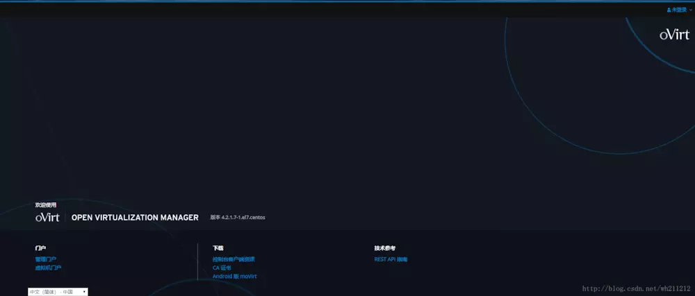

这里写图片描述

- 登录ovirt UI，用户名 admin，密码是安装过程中设置的密码

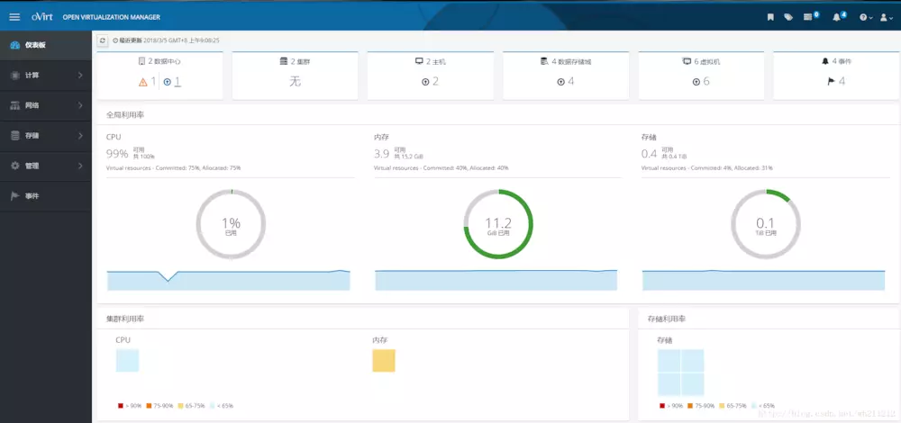

这里写图片描述

##### 5、使用Ovirt创建虚拟机

- 创建数据中心

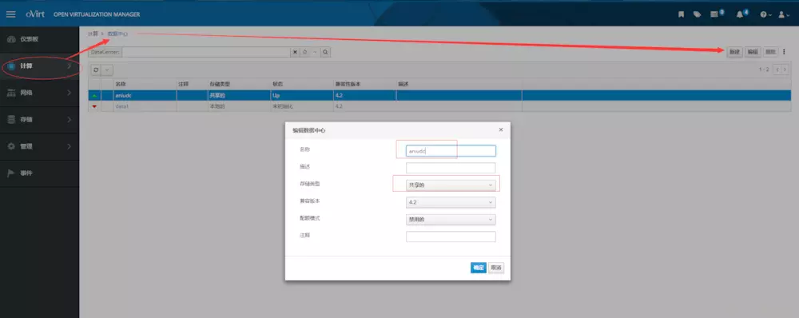

这里写图片描述

存储类型选择共享的，类型选择本地，每个数据中心下面只能添加一个主机，不采用这种方式

- 创建集群

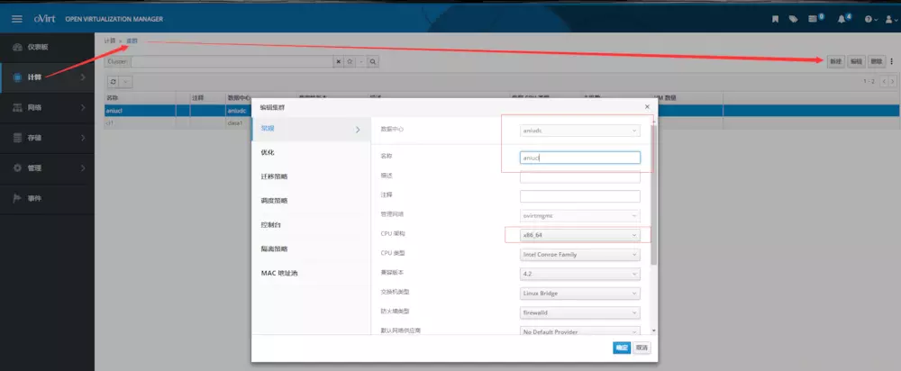

这里写图片描述

假如有多个数据中心，创建集群的时候选择在那个数据中心下面创建，根据使用选择CPU架构，其他默认即可

- 添加主机

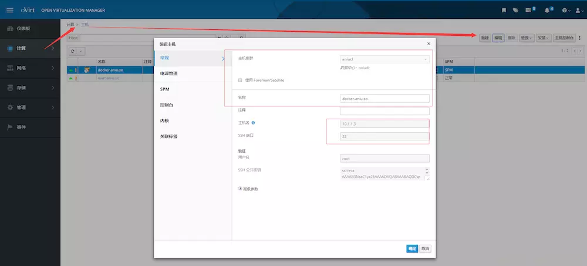

这里写图片描述

添加主机时注意关闭自动配置防火墙选项，在高级设置里面，使用root账号 密码即可，添加主机过程可以查看，事件查看安装过程

- 查看添加完成的主机


这里写图片描述


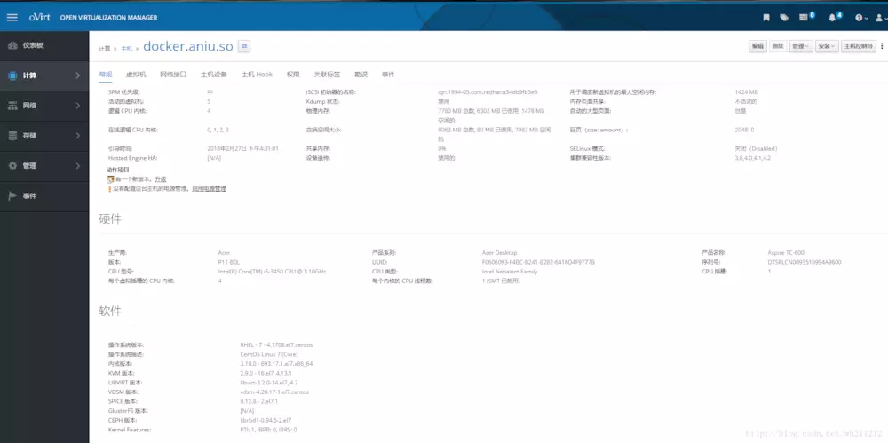

这里写图片描述

##### 6、添加存储

- 添加 nfs data存储域，用于创建虚拟机

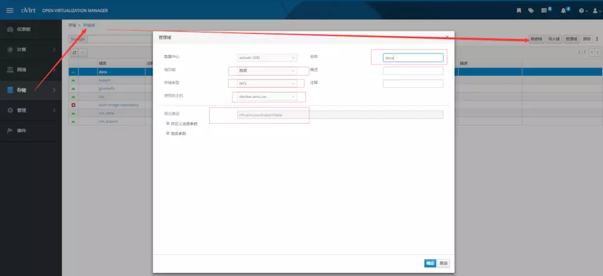

这里写图片描述

标注的地方都需要修改，注意根据自己的配置填入对应的

- 添加iso存储域，用于存放镜像文件

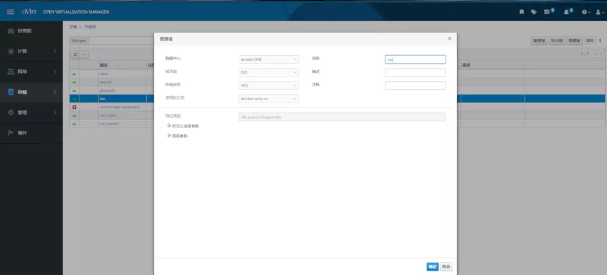

这里写图片描述

- 添加glusterfs data 存储域，高可用 用于创建虚拟机

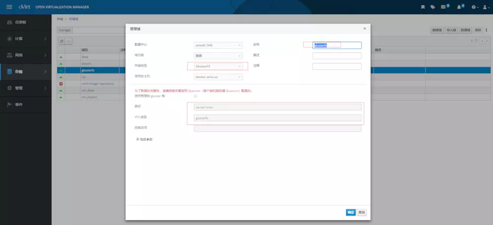

这里写图片描述

- 添加系统镜像文件

\# 使用命令先把镜像文件上传到服务器上，执行上传命令engine-iso-uploader --nfs-server=nfs.aniu.so:/export/iso upload /usr/local/src/CentOS-7-x86_64-Minimal-1611.iso# 或者通过filezilla上传到服务的 data存储域目录下。然后到移动到正确的位置

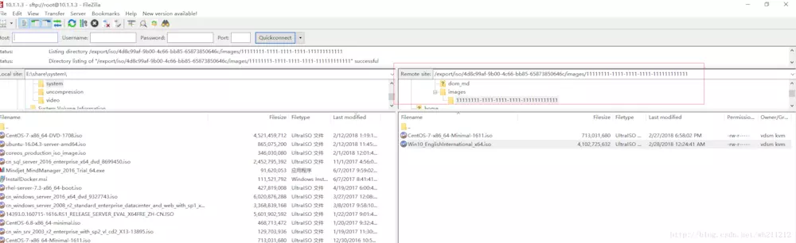

这里写图片描述

##### 7、创建虚拟机

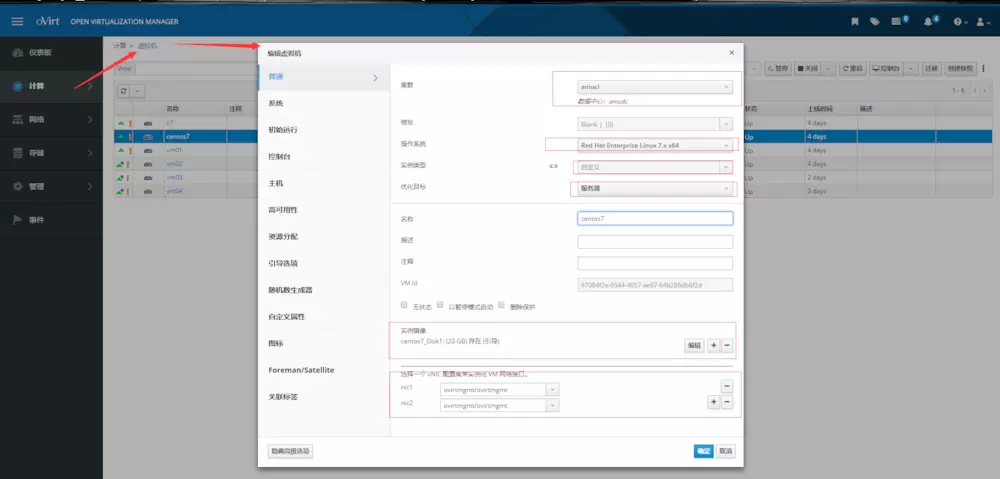

这里写图片描述

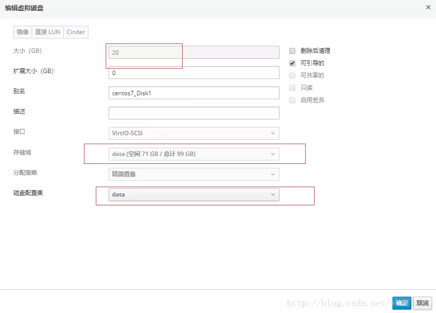

这里写图片描述

添加硬盘的时候可以选择不同的data存储域

- 运行虚拟机

这里笔者安装ovirt-engine的服务器安装了桌面环境，然后通过VNC远程进行虚拟的安装，不安装系统桌面时，笔者配置完虚拟机运行后，通过console不能连上去，会让下载vv格式的文件，很烦，安装桌面配置VNC笔者这里不过多赘述

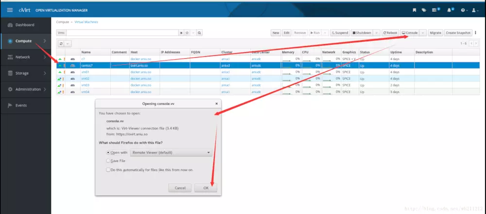

这里写图片描述


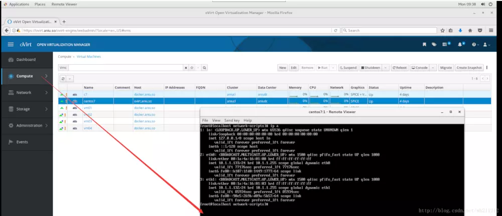

这里写图片描述

- 虚拟机在线迁移

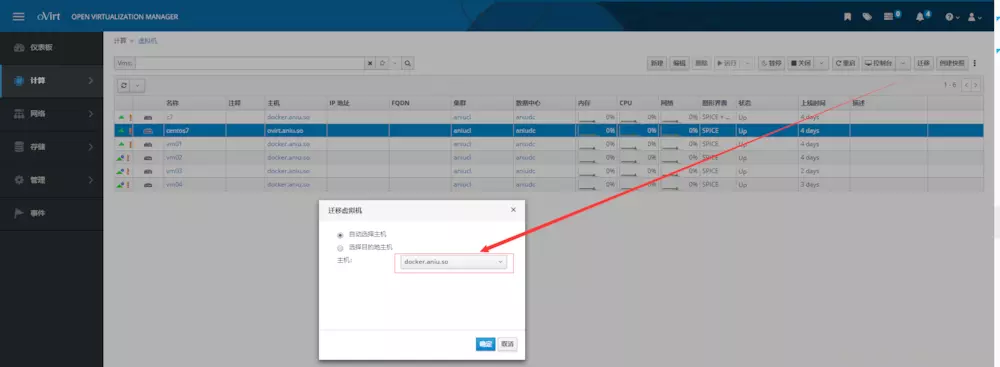

这里写图片描述

迁移的时候选择要迁移到的主机，**注意**：**不同数据中心下面的虚拟机不能迁移**

##### 8、Ovirt 备份

```
engine-backup --scope=all --mode=backup --file=ovirt-backup.txt --log=/var/log/ovirt-engine/ovirt-engine.log
```

- 参考：：[https://www.ovirt.org/documentation/admin-guide/chap-Backups_and_Migration/

## 九、自动化脚本管理 kvm

