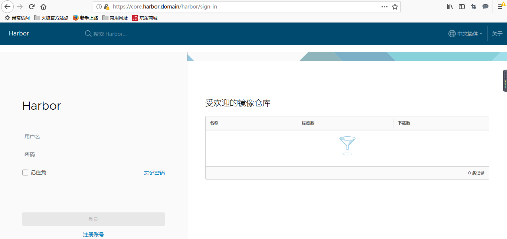
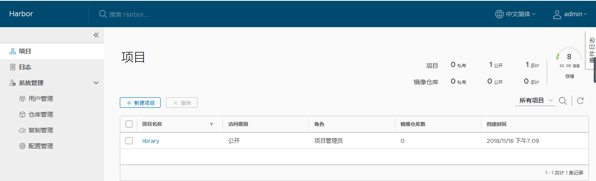
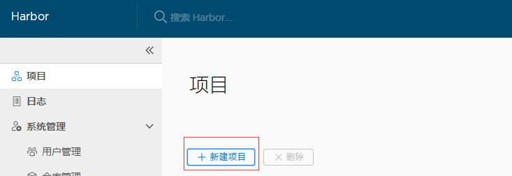
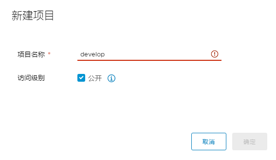
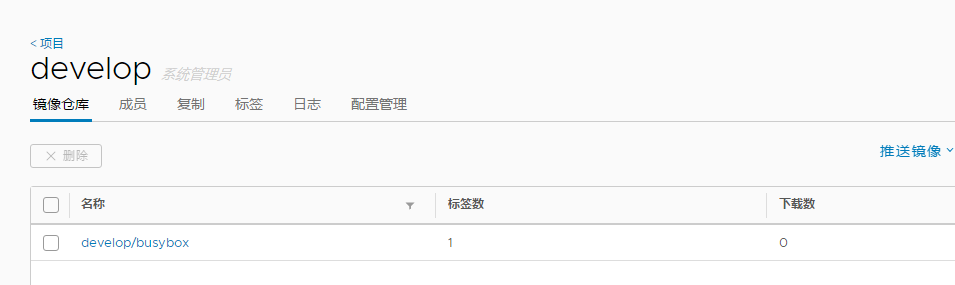

# Kubeadm部署Kubernetes1.14.1集群

## **一、环境说明**

**注意： IP地址必须十静态地址**

| 主机名     | IP地址          | 角色       | 系统      |
| ---------- | --------------- | ---------- | --------- |
| k8s-node-1 | 192.168.120.128 | k8s-master | Centos7.6 |
| k8s-node-2 | 192.168.120.129 | k8s-node   | Centos7.6 |
| k8s-node-3 | 192.168.120.130 | k8s-node   | Centos7.6 |

注意：官方建议每台机器至少双核2G内存，同时需确保MAC和product_uuid唯一（参考下面的命令查看）

```
ip link
cat /sys/class/dmi/id/product_uuid
```

## **二、环境配置**

**以下命令在三台主机上均需运行**

### **1、设置阿里云yum源（可选）**

```bash
curl -o /etc/yum.repos.d/CentOS-Base.repo http://mirrors.aliyun.com/repo/Centos-7.repo
rm -rf /var/cache/yum && yum makecache && yum -y update && yum -y autoremove
```

### **2、安装依赖包**

```shell
yum install -y epel-release conntrack ipvsadm ipset jq sysstat curl iptables libseccomp
```

### **3、关闭防火墙**

```shell
systemctl stop firewalld && systemctl disable firewalld
iptables -F && iptables -X && iptables -F -t nat && iptables -X -t nat && iptables -P FORWARD ACCEPT
```

### **4、关闭SELinux**

```shell
setenforce 0
sed -i "s/SELINUX=enforcing/SELINUX=disabled/g" /etc/selinux/config
```

### **5、关闭swap分区**

```shell
swapoff -a
sed -i '/ swap / s/^\(.*\)$/#\1/g' /etc/fstab
```

### **6、加载内核模块**

从`k8s`的1.8版本开始，`kube-proxy`引入了`IPVS`模式，`IPVS`模式与`iptables`同样基于`Netfilter`，但是采用的`hash`表，因此当`service`数量达到一定规模时，hash查表的速度优势就会显现出来，从而提高`service`的服务性能。

```shell
modprobe  br_netfilter
modprobe ip_vs
modprobe ip_vs_rr
modprobe ip_vs_wrr
modprobe ip_vs_sh
modprobe  nf_conntrack_ipv4   # 连接跟踪模块

cat > /etc/sysconfig/modules/ipvs.modules <<EOF
#!/bin/bash
modprobe -- ip_vs
modprobe -- ip_vs_rr
modprobe -- ip_vs_wrr
modprobe -- ip_vs_sh
modprobe -- nf_conntrack_ipv4
modprobe -- br_netfilter
EOF

chmod 755 /etc/sysconfig/modules/ipvs.modules && bash /etc/sysconfig/modules/ipvs.modules

lsmod |egrep ip_vs
```

### **7、设置内核参数**

```shell
cat << EOF | tee /etc/sysctl.d/k8s.conf
net.bridge.bridge-nf-call-iptables=1
net.bridge.bridge-nf-call-ip6tables=1
net.ipv4.ip_forward=1
net.ipv4.tcp_tw_recycle=0
vm.swappiness=0
vm.overcommit_memory=1
vm.panic_on_oom=0
fs.inotify.max_user_watches=89100  
fs.file-max=52706963
fs.nr_open=52706963
net.ipv6.conf.all.disable_ipv6=1
net.netfilter.nf_conntrack_max=2310720
EOF

sysctl -p /etc/sysctl.d/k8s.conf

1.  overcommit_memory是什么？  
    overcommit_memory是一个内核对内存分配的一种策略。 具体可见/proc/sys/vm/overcommit_memory下的值
      
2.  overcommit_memory有什么作用？  
    overcommit_memory取值又三种分别为0， 1， 2
    overcommit_memory=0， 表示内核将检查是否有足够的可用内存供应用进程使用；如果有足够的可用内存，内存申请允许；否则，内存申请失败，并把错误返回给应用进程。
    overcommit_memory=1， 表示内核允许分配所有的物理内存，而不管当前的内存状态如何。
    overcommit_memory=2， 表示内核允许分配超过所有物理内存和交换空间总和的内存

net.bridge.bridge-nf-call-iptables # 设置网桥iptables网络过滤通告
net.ipv4.tcp_tw_recycle # 设置 IP_TW 回收
vm.swappiness  # 禁用swap    
vm.panic_on_oom   # 设置系统oom（内存溢出）
fs.inotify.max_user_watches # 允许用户最大监控目录数
fs.file-max  # 允许系统打开的最大文件数
fs.nr_open   # 允许单个进程打开的最大文件数
net.ipv6.conf.all.disable_ipv6 # 禁用ipv6
net.netfilter.nf_conntrack_max # 系统的最大连接数
```

### **8、安装Docker**

1、首先卸载旧版：（官方建议）

```shell
yum remove docker \
           docker-client \
           docker-client-latest \
           docker-common \
           docker-latest \
           docker-latest-logrotate \
           docker-logrotate \
           docker-selinux \
           docker-engine-selinux \
           docker-engine
```

2、安装依赖包：

```shell
yum install -y yum-utils device-mapper-persistent-data lvm2
```

3、设置安装源（阿里云）：

```shell
yum-config-manager --add-repo http://mirrors.aliyun.com/docker-ce/linux/centos/docker-ce.repo
```

4、启用测试库（可选）：

```shell
yum-config-manager --enable docker-ce-edge
yum-config-manager --enable docker-ce-test
```

5、安装：

```shell
yum makecache fast
yum install -y docker-ce
```

6、启动：

```shell
systemctl start docker
```

开机自启

```shell
systemctl enable docker
```

Docker建议配置阿里云镜像加速

安装完成后配置启动时的命令，否则docker会将iptables FORWARD chain的默认策略设置为DROP

另外Kubeadm建议将systemd设置为cgroup驱动，所以还要修改daemon.json

```shell
sed -i "13i ExecStartPost=/usr/sbin/iptables -P FORWARD ACCEPT" /usr/lib/systemd/system/docker.service

tee /etc/docker/daemon.json <<-'EOF'
{
  "registry-mirrors": ["https://bk6kzfqm.mirror.aliyuncs.com"],
  "exec-opts": ["native.cgroupdriver=systemd"],
  "log-driver": "json-file",
  "log-opts": {
    "max-size": "100m"
  },
  "storage-driver": "overlay2",
  "storage-opts": [
    "overlay2.override_kernel_check=true"
  ]
}
EOF

systemctl daemon-reload
systemctl restart docker
```

### **9、安装 kubeadm 和 kubelet**

配置源

```shell
cat <<EOF > /etc/yum.repos.d/kubernetes.repo
[kubernetes]
name=Kubernetes
baseurl=https://mirrors.aliyun.com/kubernetes/yum/repos/kubernetes-el7-x86_64/
enabled=1
gpgcheck=0
repo_gpgcheck=0
gpgkey=https://mirrors.aliyun.com/kubernetes/yum/doc/yum-key.gpg https://mirrors.aliyun.com/kubernetes/yum/doc/rpm-package-key.gpg
EOF

yum makecache fast
```

安装

```shell
yum install -y kubelet kubeadm kubectl
systemctl enable kubelet
```

### **10、拉取所需镜像**

先从阿里云拉取所需的镜像，不然会从谷歌拉取，导致拉取失败。

拉取镜像：

```shell
kubeadm config images list | sed -e 's/^/docker pull /g' -e 's#k8s.gcr.io#registry.cn-hangzhou.aliyuncs.com/google_containers#g' | sh -x
docker images | grep registry.cn-hangzhou.aliyuncs.com/google_containers | awk '{print "docker tag",$1":"$2,$1":"$2}' | sed -e 's/registry.cn-hangzhou.aliyuncs.com\/google_containers/k8s.gcr.io/2' | sh -x
docker images | grep registry.cn-hangzhou.aliyuncs.com/google_containers | awk '{print "docker rmi """$1""":"""$2}' | sh -x 
```

## **三、初始化集群**

**以下命令如无特殊说明，均在k8s-node-1上执行**

### **1、使用kubeadm init初始化集群（注意修改最后为本机IP）**

```shell
kubeadm init \
  --kubernetes-version=v1.15.3 \
  --pod-network-cidr=10.244.0.0/16 \
  --apiserver-advertise-address=192.168.152.193
```

初始化成功后会输出类似下面的加入命令，暂时无需运行，先记录。

```shell
kubeadm join 192.168.120.128:6443 --token duz8m8.njvafly3p2jrshfx --discovery-token-ca-cert-hash sha256:60e15ba0f562a9f29124914a1540bd284e021a37ebdbcea128f4e257e25002db
```

- - **添加节点**

  - 记住上面返回值的添加节点命令，到其他节点上执行即可。

  - 如果忘记了，重新获取上面的命令，运行：

    ```shell
     kubeadm token create --print-join-command --ttl 0
    ```

  - 可以使用kubeadm token -h 查看token操作。

- 重新生成CA授权码：

```shell
openssl x509 -pubkey -in /etc/kubernetes/pki/ca.crt | openssl rsa -pubin -outform der 2>/dev/null | openssl dgst -sha256 -hex | sed 's/^.* //'
```

- 参见讨论：https://github.com/kubernetes/kubeadm/issues/26  

### 2、为需要使用kubectl的用户进行配置**

```shell
mkdir -p $HOME/.kube
sudo cp -i /etc/kubernetes/admin.conf $HOME/.kube/config
sudo chown $(id -u):$(id -g) $HOME/.kube/config
```

检查集群状态

```shell
kubectl get cs
```

### **3、安装 Pod Network（使用七牛云镜像）**

创建 kube-flannel.yml 文件

```yaml
vim kube-flannel.yml
---
apiVersion: policy/v1beta1
kind: PodSecurityPolicy
metadata:
  name: psp.flannel.unprivileged
  annotations:
    seccomp.security.alpha.kubernetes.io/allowedProfileNames: docker/default
    seccomp.security.alpha.kubernetes.io/defaultProfileName: docker/default
    apparmor.security.beta.kubernetes.io/allowedProfileNames: runtime/default
    apparmor.security.beta.kubernetes.io/defaultProfileName: runtime/default
spec:
  privileged: false
  volumes:
    - configMap
    - secret
    - emptyDir
    - hostPath
  allowedHostPaths:
    - pathPrefix: "/etc/cni/net.d"
    - pathPrefix: "/etc/kube-flannel"
    - pathPrefix: "/run/flannel"
  readOnlyRootFilesystem: false
  # Users and groups
  runAsUser:
    rule: RunAsAny
  supplementalGroups:
    rule: RunAsAny
  fsGroup:
    rule: RunAsAny
  # Privilege Escalation
  allowPrivilegeEscalation: false
  defaultAllowPrivilegeEscalation: false
  # Capabilities
  allowedCapabilities: ['NET_ADMIN']
  defaultAddCapabilities: []
  requiredDropCapabilities: []
  # Host namespaces
  hostPID: false
  hostIPC: false
  hostNetwork: true
  hostPorts:
  - min: 0
    max: 65535
  # SELinux
  seLinux:
    # SELinux is unsed in CaaSP
    rule: 'RunAsAny'
---
kind: ClusterRole
apiVersion: rbac.authorization.k8s.io/v1beta1
metadata:
  name: flannel
rules:
  - apiGroups: ['extensions']
    resources: ['podsecuritypolicies']
    verbs: ['use']
    resourceNames: ['psp.flannel.unprivileged']
  - apiGroups:
      - ""
    resources:
      - pods
    verbs:
      - get
  - apiGroups:
      - ""
    resources:
      - nodes
    verbs:
      - list
      - watch
  - apiGroups:
      - ""
    resources:
      - nodes/status
    verbs:
      - patch
---
kind: ClusterRoleBinding
apiVersion: rbac.authorization.k8s.io/v1beta1
metadata:
  name: flannel
roleRef:
  apiGroup: rbac.authorization.k8s.io
  kind: ClusterRole
  name: flannel
subjects:
- kind: ServiceAccount
  name: flannel
  namespace: kube-system
---
apiVersion: v1
kind: ServiceAccount
metadata:
  name: flannel
  namespace: kube-system
---
kind: ConfigMap
apiVersion: v1
metadata:
  name: kube-flannel-cfg
  namespace: kube-system
  labels:
    tier: node
    app: flannel
data:
  cni-conf.json: |
    {
      "name": "cbr0",
      "plugins": [
        {
          "type": "flannel",
          "delegate": {
            "hairpinMode": true,
            "isDefaultGateway": true
          }
        },
        {
          "type": "portmap",
          "capabilities": {
            "portMappings": true
          }
        }
      ]
    }
  net-conf.json: |
    {
      "Network": "10.244.0.0/16",
      "Backend": {
        "Type": "vxlan"
      }
    }
---
apiVersion: apps/v1
kind: DaemonSet
metadata:
  name: kube-flannel-ds-amd64
  namespace: kube-system
  labels:
    tier: node
    app: flannel
spec:
  selector:
    matchLabels:
      app: flannel
  template:
    metadata:
      labels:
        tier: node
        app: flannel
    spec:
      hostNetwork: true
      nodeSelector:
        beta.kubernetes.io/arch: amd64
      tolerations:
      - operator: Exists
        effect: NoSchedule
      serviceAccountName: flannel
      initContainers:
      - name: install-cni
        image: quay-mirror.qiniu.com/coreos/flannel:v0.11.0-amd64
        command:
        - cp
        args:
        - -f
        - /etc/kube-flannel/cni-conf.json
        - /etc/cni/net.d/10-flannel.conflist
        volumeMounts:
        - name: cni
          mountPath: /etc/cni/net.d
        - name: flannel-cfg
          mountPath: /etc/kube-flannel/
      containers:
      - name: kube-flannel
        image: quay-mirror.qiniu.com/coreos/flannel:v0.11.0-amd64
        command:
        - /opt/bin/flanneld
        args:
        - --ip-masq
        - --kube-subnet-mgr
        resources:
          requests:
            cpu: "100m"
            memory: "50Mi"
          limits:
            cpu: "100m"
            memory: "50Mi"
        securityContext:
          privileged: false
          capabilities:
             add: ["NET_ADMIN"]
        env:
        - name: POD_NAME
          valueFrom:
            fieldRef:
              fieldPath: metadata.name
        - name: POD_NAMESPACE
          valueFrom:
            fieldRef:
              fieldPath: metadata.namespace
        volumeMounts:
        - name: run
          mountPath: /run/flannel
        - name: flannel-cfg
          mountPath: /etc/kube-flannel/
      volumes:
        - name: run
          hostPath:
            path: /run/flannel
        - name: cni
          hostPath:
            path: /etc/cni/net.d
        - name: flannel-cfg
          configMap:
            name: kube-flannel-cfg
---
apiVersion: apps/v1
kind: DaemonSet
metadata:
  name: kube-flannel-ds-arm64
  namespace: kube-system
  labels:
    tier: node
    app: flannel
spec:
  selector:
    matchLabels:
      app: flannel
  template:
    metadata:
      labels:
        tier: node
        app: flannel
    spec:
      hostNetwork: true
      nodeSelector:
        beta.kubernetes.io/arch: arm64
      tolerations:
      - operator: Exists
        effect: NoSchedule
      serviceAccountName: flannel
      initContainers:
      - name: install-cni
        image: quay-mirror.qiniu.com/coreos/flannel:v0.11.0-arm64
        command:
        - cp
        args:
        - -f
        - /etc/kube-flannel/cni-conf.json
        - /etc/cni/net.d/10-flannel.conflist
        volumeMounts:
        - name: cni
          mountPath: /etc/cni/net.d
        - name: flannel-cfg
          mountPath: /etc/kube-flannel/
      containers:
      - name: kube-flannel
        image: quay-mirror.qiniu.com/coreos/flannel:v0.11.0-arm64
        command:
        - /opt/bin/flanneld
        args:
        - --ip-masq
        - --kube-subnet-mgr
        resources:
          requests:
            cpu: "100m"
            memory: "50Mi"
          limits:
            cpu: "100m"
            memory: "50Mi"
        securityContext:
          privileged: false
          capabilities:
             add: ["NET_ADMIN"]
        env:
        - name: POD_NAME
          valueFrom:
            fieldRef:
              fieldPath: metadata.name
        - name: POD_NAMESPACE
          valueFrom:
            fieldRef:
              fieldPath: metadata.namespace
        volumeMounts:
        - name: run
          mountPath: /run/flannel
        - name: flannel-cfg
          mountPath: /etc/kube-flannel/
      volumes:
        - name: run
          hostPath:
            path: /run/flannel
        - name: cni
          hostPath:
            path: /etc/cni/net.d
        - name: flannel-cfg
          configMap:
            name: kube-flannel-cfg
---
apiVersion: apps/v1
kind: DaemonSet
metadata:
  name: kube-flannel-ds-arm
  namespace: kube-system
  labels:
    tier: node
    app: flannel
spec:
  selector:
    matchLabels:
      app: flannel
  template:
    metadata:
      labels:
        tier: node
        app: flannel
    spec:
      hostNetwork: true
      nodeSelector:
        beta.kubernetes.io/arch: arm
      tolerations:
      - operator: Exists
        effect: NoSchedule
      serviceAccountName: flannel
      initContainers:
      - name: install-cni
        image: quay-mirror.qiniu.com/coreos/flannel:v0.11.0-arm
        command:
        - cp
        args:
        - -f
        - /etc/kube-flannel/cni-conf.json
        - /etc/cni/net.d/10-flannel.conflist
        volumeMounts:
        - name: cni
          mountPath: /etc/cni/net.d
        - name: flannel-cfg
          mountPath: /etc/kube-flannel/
      containers:
      - name: kube-flannel
        image: quay-mirror.qiniu.com/coreos/flannel:v0.11.0-arm
        command:
        - /opt/bin/flanneld
        args:
        - --ip-masq
        - --kube-subnet-mgr
        resources:
          requests:
            cpu: "100m"
            memory: "50Mi"
          limits:
            cpu: "100m"
            memory: "50Mi"
        securityContext:
          privileged: false
          capabilities:
             add: ["NET_ADMIN"]
        env:
        - name: POD_NAME
          valueFrom:
            fieldRef:
              fieldPath: metadata.name
        - name: POD_NAMESPACE
          valueFrom:
            fieldRef:
              fieldPath: metadata.namespace
        volumeMounts:
        - name: run
          mountPath: /run/flannel
        - name: flannel-cfg
          mountPath: /etc/kube-flannel/
      volumes:
        - name: run
          hostPath:
            path: /run/flannel
        - name: cni
          hostPath:
            path: /etc/cni/net.d
        - name: flannel-cfg
          configMap:
            name: kube-flannel-cfg
---
apiVersion: apps/v1
kind: DaemonSet
metadata:
  name: kube-flannel-ds-ppc64le
  namespace: kube-system
  labels:
    tier: node
    app: flannel
spec:
  selector:
    matchLabels:
      app: flannel
  template:
    metadata:
      labels:
        tier: node
        app: flannel
    spec:
      hostNetwork: true
      nodeSelector:
        beta.kubernetes.io/arch: ppc64le
      tolerations:
      - operator: Exists
        effect: NoSchedule
      serviceAccountName: flannel
      initContainers:
      - name: install-cni
        image: quay-mirror.qiniu.com/coreos/flannel:v0.11.0-ppc64le
        command:
        - cp
        args:
        - -f
        - /etc/kube-flannel/cni-conf.json
        - /etc/cni/net.d/10-flannel.conflist
        volumeMounts:
        - name: cni
          mountPath: /etc/cni/net.d
        - name: flannel-cfg
          mountPath: /etc/kube-flannel/
      containers:
      - name: kube-flannel
        image: quay-mirror.qiniu.com/coreos/flannel:v0.11.0-ppc64le
        command:
        - /opt/bin/flanneld
        args:
        - --ip-masq
        - --kube-subnet-mgr
        resources:
          requests:
            cpu: "100m"
            memory: "50Mi"
          limits:
            cpu: "100m"
            memory: "50Mi"
        securityContext:
          privileged: false
          capabilities:
             add: ["NET_ADMIN"]
        env:
        - name: POD_NAME
          valueFrom:
            fieldRef:
              fieldPath: metadata.name
        - name: POD_NAMESPACE
          valueFrom:
            fieldRef:
              fieldPath: metadata.namespace
        volumeMounts:
        - name: run
          mountPath: /run/flannel
        - name: flannel-cfg
          mountPath: /etc/kube-flannel/
      volumes:
        - name: run
          hostPath:
            path: /run/flannel
        - name: cni
          hostPath:
            path: /etc/cni/net.d
        - name: flannel-cfg
          configMap:
            name: kube-flannel-cfg
---
apiVersion: apps/v1
kind: DaemonSet
metadata:
  name: kube-flannel-ds-s390x
  namespace: kube-system
  labels:
    tier: node
    app: flannel
spec:
  selector:
    matchLabels:
      app: flannel
  template:
    metadata:
      labels:
        tier: node
        app: flannel
    spec:
      hostNetwork: true
      nodeSelector:
        beta.kubernetes.io/arch: s390x
      tolerations:
      - operator: Exists
        effect: NoSchedule
      serviceAccountName: flannel
      initContainers:
      - name: install-cni
        image: quay-mirror.qiniu.com/coreos/flannel:v0.11.0-s390x
        command:
        - cp
        args:
        - -f
        - /etc/kube-flannel/cni-conf.json
        - /etc/cni/net.d/10-flannel.conflist
        volumeMounts:
        - name: cni
          mountPath: /etc/cni/net.d
        - name: flannel-cfg
          mountPath: /etc/kube-flannel/
      containers:
      - name: kube-flannel
        image: quay-mirror.qiniu.com/coreos/flannel:v0.11.0-s390x
        command:
        - /opt/bin/flanneld
        args:
        - --ip-masq
        - --kube-subnet-mgr
        resources:
          requests:
            cpu: "100m"
            memory: "50Mi"
          limits:
            cpu: "100m"
            memory: "50Mi"
        securityContext:
          privileged: false
          capabilities:
             add: ["NET_ADMIN"]
        env:
        - name: POD_NAME
          valueFrom:
            fieldRef:
              fieldPath: metadata.name
        - name: POD_NAMESPACE
          valueFrom:
            fieldRef:
              fieldPath: metadata.namespace
        volumeMounts:
        - name: run
          mountPath: /run/flannel
        - name: flannel-cfg
          mountPath: /etc/kube-flannel/
      volumes:
        - name: run
          hostPath:
            path: /run/flannel
        - name: cni
          hostPath:
            path: /etc/cni/net.d
        - name: flannel-cfg
          configMap:
            name: kube-flannel-cfg
```

去网上下载 kube-flannel.yml

```shell
curl -o kube-flannel.yml https://raw.githubusercontent.com/coreos/flannel/master/Documentation/kube-flannel.yml
sed -i "s/quay.io\/coreos\/flannel/quay-mirror.qiniu.com\/coreos\/flannel/g" kube-flannel.yml
kubectl apply -f kube-flannel.yml
rm -f kube-flannel.yml
```

使用下面的命令确保所有的Pod都处于Running状态，可能要等到许久。

```shell
kubectl get pod --all-namespaces -o wide
```

### **4、向Kubernetes集群中添加Node节点**

在k8s-node-2和k8s-node-3上运行之前在k8s-node-1输出的命令

```shell
kubeadm join 192.168.120.128:6443 --token duz8m8.njvafly3p2jrshfx --discovery-token-ca-cert-hash sha256:60e15ba0f562a9f29124914a1540bd284e021a37ebdbcea128f4e257e25002db
```

查看集群中的节点状态，可能要等等许久才Ready

```shell
kubectl get nodes
```

### **5、kube-proxy 开启 ipvs**

```shell
kubectl get configmap kube-proxy -n kube-system -o yaml > kube-proxy-configmap.yaml
sed -i 's/mode: ""/mode: "ipvs"/' kube-proxy-configmap.yaml
kubectl apply -f kube-proxy-configmap.yaml
rm -f kube-proxy-configmap.yaml
kubectl get pod -n kube-system | grep kube-proxy | awk '{system("kubectl delete pod "$1" -n kube-system")}' 
```

## 四、部署kubernetes-dashboard

### **1、生成访问证书**

```shell
grep 'client-certificate-data' ~/.kube/config | head -n 1 | awk '{print $2}' | base64 -d >> kubecfg.crt
grep 'client-key-data' ~/.kube/config | head -n 1 | awk '{print $2}' | base64 -d >> kubecfg.key
openssl pkcs12 -export -clcerts -inkey kubecfg.key -in kubecfg.crt -out kubecfg.p12 -name "kubernetes-client"

注意： 
pkcs12 # 生成证书的文件格式
-export # 导出为pkcs12类型
-clcerts # 只输出客户端证书
```

将生成的kubecfg.p12证书导入到Windows中，直接双击打开，下一步导入即可。

注意：导入完成后需重启浏览器。 

### **2、生成访问Token**

新建文件admin-user.yaml：

```shell
apiVersion: v1
kind: ServiceAccount
metadata:
  name: admin-user
  namespace: kube-system

---

apiVersion: rbac.authorization.k8s.io/v1beta1
kind: ClusterRoleBinding
metadata:
  name: admin-user
roleRef:
  apiGroup: rbac.authorization.k8s.io
  kind: ClusterRole
  name: cluster-admin
subjects:
- kind: ServiceAccount
  name: admin-user
  namespace: kube-system
```

创建角色及绑定账号

```shell
kubectl create -f admin-user.yaml
```

获取Token

```shell
kubectl describe secret admin-user --namespace=kube-system
```

此次先记录下生成的Token

### **3、部署kubernetes-dashboard**

创建 dashboard 配置文件

vim kubernetes-dashboard.yaml

```yaml
apiVersion: v1
kind: Secret
metadata:
  labels:
    k8s-app: kubernetes-dashboard
  name: kubernetes-dashboard-certs
  namespace: kube-system
type: Opaque
---
apiVersion: v1
kind: ServiceAccount
metadata:
  labels:
    k8s-app: kubernetes-dashboard
  name: kubernetes-dashboard
  namespace: kube-system
---
kind: Role
apiVersion: rbac.authorization.k8s.io/v1
metadata:
  name: kubernetes-dashboard-minimal
  namespace: kube-system
rules:
- apiGroups: [""]
  resources: ["secrets"]
  verbs: ["create"]
- apiGroups: [""]
  resources: ["configmaps"]
  verbs: ["create"]
- apiGroups: [""]
  resources: ["secrets"]
  resourceNames: ["kubernetes-dashboard-key-holder", "kubernetes-dashboard-certs"]
  verbs: ["get", "update", "delete"]
- apiGroups: [""]
  resources: ["configmaps"]
  resourceNames: ["kubernetes-dashboard-settings"]
  verbs: ["get", "update"]
- apiGroups: [""]
  resources: ["services"]
  resourceNames: ["heapster"]
  verbs: ["proxy"]
- apiGroups: [""]
  resources: ["services/proxy"]
  resourceNames: ["heapster", "http:heapster:", "https:heapster:"]
  verbs: ["get"]
---
apiVersion: rbac.authorization.k8s.io/v1
kind: RoleBinding
metadata:
  name: kubernetes-dashboard-minimal
  namespace: kube-system
roleRef:
  apiGroup: rbac.authorization.k8s.io
  kind: Role
  name: kubernetes-dashboard-minimal
subjects:
- kind: ServiceAccount
  name: kubernetes-dashboard
  namespace: kube-system
---
kind: Deployment
apiVersion: apps/v1beta2
metadata:
  labels:
    k8s-app: kubernetes-dashboard
  name: kubernetes-dashboard
  namespace: kube-system
spec:
  replicas: 1
  revisionHistoryLimit: 10
  selector:
    matchLabels:
      k8s-app: kubernetes-dashboard
  template:
    metadata:
      labels:
        k8s-app: kubernetes-dashboard
    spec:
      containers:
      - name: kubernetes-dashboard
        image: mirrorgooglecontainers/kubernetes-dashboard-amd64:v1.10.1
        ports:
        - containerPort: 8443
          protocol: TCP
        args:
          - --auto-generate-certificates
        volumeMounts:
        - name: kubernetes-dashboard-certs
          mountPath: /certs
        - mountPath: /tmp
          name: tmp-volume
        livenessProbe:
          httpGet:
            scheme: HTTPS
            path: /
            port: 8443
          initialDelaySeconds: 30
          timeoutSeconds: 30
      volumes:
      - name: kubernetes-dashboard-certs
        secret:
          secretName: kubernetes-dashboard-certs
      - name: tmp-volume
        emptyDir: {}
      serviceAccountName: kubernetes-dashboard
      tolerations:
      - key: node-role.kubernetes.io/master
        effect: NoSchedule
---
kind: Service
apiVersion: v1
metadata:
  labels:
    k8s-app: kubernetes-dashboard
  name: kubernetes-dashboard
  namespace: kube-system
spec:
  ports:
    - port: 443
      targetPort: 8443
  selector:
    k8s-app: kubernetes-dashboard
```

```shell
vim kubernetes-dashboard.yaml
修改image: k8s.gcr.io/kubernetes-dashboard-amd64:v1.10.1为：
image: mirrorgooglecontainers/kubernetes-dashboard-amd64:v1.10.1
kubectl apply -f kubernetes-dashboard.yaml
```

### **4、访问**

https://192.168.120.128:6443/api/v1/namespaces/kube-system/services/https:kubernetes-dashboard:/proxy/

```shell
# 获取登录令牌
kubectl describe secret admin-user --namespace=kube-system
```

192.168.120.128为MasterIP，6443为 apiserver-port

然后在登录选项中选择令牌登录，复制进刚刚生成的令牌即可。

## 五、kubernetes 使用 Helm安装 harbor

1、基本概念

　　对于复杂的应用中间件，需要设置镜像运行的需求、环境变量，并且需要定制存储、网络等设置，最后设计和编写Deployment、Configmap、Service及Ingress等相关yaml配置文件，再提交给kubernetes进行部署。这些复杂的过程将逐步被Helm应用包管理工具实现。

　　Helm是一个由CNCF孵化和管理的项目，用于对需要在k8s上部署复杂应用进行定义、安装和更新。Helm以Chart的方式对应用软件进行描述，可以方便地创建、版本化、共享和发布复杂的应用软件。

　　Chart：一个Helm包，其中包含了运行一个应用所需要的工具和资源定义，还可能包含kubernetes集群中的服务定义，类似于Homebrew中的formula、apt中的dpkg或者yum中的rpm文件。

　　Release：在K8S集群上运行一个Chart实例。在同一个集群上，一个Chart可以安装多次，例如有一个MySQL Chart，如果想在服务器上运行两个数据库，就可以基于这个Chart安装两次。每次安装都会生成新的Release，会有独立的Release名称。

　　Repository：用于存放和共享Chart的仓库。

　　简单来说，Helm的任务是在仓库中查找需要的Chart，然后将Chart以Release的形式安装到K8S集群中。

 　　Harbor基本概念：[此篇文章很不错](https://blog.csdn.net/u010278923/article/details/77941995/)

2、Helm安装

　　Helm由两个组件组成：

　　- HelmClinet：客户端，拥有对Repository、Chart、Release等对象的管理能力。

　　  TillerServer：负责客户端指令和k8s集群之间的交互，根据Chart定义，生成和管理各种k8s的资源对象。

　　安装HelmClient：可以通过二进制文件或脚本方式进行安装。

　　下载最新版二进制文件：https://github.com/helm/helm/releases

```shell
[root@k8s-master01 ~]# tar xf helm-v2.13.1-linux-amd64.tar.gz
[root@k8s-master01 ~]# cp linux-amd64/helm linux-amd64/tiller /usr/local/bin/
[root@k8s-master01 ~]# helm version
Client: &version.Version{SemVer:"v2.13.1", GitCommit:"2e55dbe1fdb5fdb96b75ff144a339489417b146b", GitTreeState:"clean"}
Error: could not find tiller
# 因为没有安装tillerServer所以会报找不到tiller
```

　　安装TillerServer

　　所有节点下载tiller:v[helm-version]镜像，helm-version为上面helm的版本2.11.0

```shell
docker pull registry.aliyuncs.com/google_containers/tiller:v2.13.1
```

　　使用helm init安装tiller

```shell
[root@k8s-master01 ~]# helm init --tiller-image registry.aliyuncs.com/google_containers/tiller:v2.13.1
Creating /root/.helm 
Creating /root/.helm/repository 
Creating /root/.helm/repository/cache 
Creating /root/.helm/repository/local 
Creating /root/.helm/plugins 
Creating /root/.helm/starters 
Creating /root/.helm/cache/archive 
Creating /root/.helm/repository/repositories.yaml 
Adding stable repo with URL: https://kubernetes-charts.storage.googleapis.com 
Adding local repo with URL: http://127.0.0.1:8879/charts 
$HELM_HOME has been configured at /root/.helm.

Tiller (the Helm server-side component) has been installed into your Kubernetes Cluster.

Please note: by default, Tiller is deployed with an insecure 'allow unauthenticated users' policy.
To prevent this, run `helm init` with the --tiller-tls-verify flag.
For more information on securing your installation see: https://docs.helm.sh/using_helm/#securing-your-helm-installation
Happy Helming!
```

　　再次查看helm version及pod状态

```shell
[root@k8s-master01 ~]# helm version
Client: &version.Version{SemVer:"v2.11.0", GitCommit:"2e55dbe1fdb5fdb96b75ff144a339489417b146b", GitTreeState:"clean"}
Server: &version.Version{SemVer:"v2.11.0", GitCommit:"2e55dbe1fdb5fdb96b75ff144a339489417b146b", GitTreeState:"clean"}
[root@k8s-master01 ~]# kubectl get pod -n kube-system | grep tiller
tiller-deploy-5d7c8fcd59-d4djx          1/1       Running   0          49s
[root@k8s-master01 ~]# kubectl get pod,svc -n kube-system | grep tiller
pod/tiller-deploy-5d7c8fcd59-d4djx          1/1       Running   0          3m
service/tiller-deploy          ClusterIP   10.106.28.190    <none>        44134/TCP        5m
```

3、Helm使用

3.1 helm search：搜索可用的Chart

　　Helm初始化完成之后，默认配置为使用官方的k8s chart仓库

　　通过search查找可用的Chart

```shell
[root@k8s-master01 ~]# helm search gitlab
NAME                CHART VERSION    APP VERSION    DESCRIPTION              
stable/gitlab-ce    0.2.2            9.4.1          GitLab Community Edition 
stable/gitlab-ee    0.2.2            9.4.1          GitLab Enterprise Edition
[root@k8s-master01 ~]# helm search | more
NAME                                     CHART VERSION    APP VERSION                     DESCRIPTION    
                                             
stable/acs-engine-autoscaler             2.2.0            2.1.1                           Scales worker n
odes within agent pools                      
stable/aerospike                         0.1.7            v3.14.1.2                       A Helm chart fo
r Aerospike in Kubernetes                    
stable/anchore-engine                    0.9.0            0.3.0                           Anchore contain
er analysis and policy evaluation engine s...
stable/apm-server                        0.1.0            6.2.4                           The server rece
ives data from the Elastic APM agents and ...
stable/ark                               1.2.2            0.9.1                           A Helm chart fo
r ark                                        
stable/artifactory                       7.3.1            6.1.0                           DEPRECATED Univ
ersal Repository Manager supporting all ma...
stable/artifactory-ha                    0.4.1            6.2.0                           DEPRECATED Univ
ersal Repository Manager supporting all ma...
stable/auditbeat                         0.3.1            6.4.3                           A lightweight s
hipper to audit the activities of users an...
--More--
```

　　查看详细信息

```shell
[root@k8s-master01 ~]# helm search gitlab
NAME                CHART VERSION    APP VERSION    DESCRIPTION              
stable/gitlab-ce    0.2.2            9.4.1          GitLab Community Edition 
stable/gitlab-ee    0.2.2            9.4.1          GitLab Enterprise Edition
[root@k8s-master01 ~]# helm inspect stable/gitlab-ce 
```

3.2 Helm install harbor

　　使用helm repo remove和add删除repository和添加aliyun的repository

```shell
[root@k8s-master01 harbor-helm]# helm repo list
NAME      URL                                                   
aliyun    https://kubernetes.oss-cn-hangzhou.aliyuncs.com/charts
```

　　下载harbor，并checkout到0.3.0分支

```shell
git clone https://github.com/goharbor/harbor-helm.git
```

　　更改requirement.yaml如下

```shell
[root@k8s-master01 harbor-helm]# cat requirements.yaml 
dependencies:
- name: redis
  version: 1.1.15
  repository: https://kubernetes.oss-cn-hangzhou.aliyuncs.com/charts 
  #repository: https://kubernetes-charts.storage.googleapis.com
```

　　下载依赖

```shell
[root@k8s-master01 harbor-helm]# helm dependency update
Hang tight while we grab the latest from your chart repositories...
...Successfully got an update from the "aliyun" chart repository
Update Complete. ⎈Happy Helming!⎈
Saving 1 charts
Downloading redis from repo https://kubernetes.oss-cn-hangzhou.aliyuncs.com/charts
Deleting outdated charts
```

　　所有节点下载相关镜像

```shell
docker pull goharbor/chartmuseum-photon:v0.7.1-v1.6.0
docker pull goharbor/harbor-adminserver:v1.6.0
docker pull goharbor/harbor-jobservice:v1.6.0
docker pull goharbor/harbor-ui:v1.6.0
docker pull goharbor/harbor-db:v1.6.0
docker pull goharbor/registry-photon:v2.6.2-v1.6.0
docker pull goharbor/chartmuseum-photon:v0.7.1-v1.6.0
docker pull goharbor/clair-photon:v2.0.5-v1.6.0
docker pull goharbor/notary-server-photon:v0.5.1-v1.6.0
docker pull goharbor/notary-signer-photon:v0.5.1-v1.6.0
docker pull bitnami/redis:4.0.8-r2
```

　　更改values.yaml所有的storageClass为storageClass: "gluster-heketi"

　　注意修改values.yaml的redis默认配置，添加port至master

```shell
master:
    port: 6379
```

　　注意修改charts/redis-1.1.15.tgz 里面的redis的values.yaml的storageClass也为"gluster-heketi"，usePassword为 false

　　注意修改charts/redis-1.1.15.tgz 里面的redis下template下的svc的name: {{ template "redis.fullname" . }}-master

　　注意修改相关存储空间的大小，比如registry。

　　安装harbor

```shell
helm install --name harbor-v1 .  --wait --timeout 1500 --debug --namespace harbor
```

　　如果报forbidden的错误，需要创建serveraccount

```shell
[root@k8s-master01 harbor-helm]# helm install --name harbor-v1 .  --set externalDomain=harbor.xxx.net --wait --timeout 1500 --debug --namespace harbor
[debug] Created tunnel using local port: '35557'

[debug] SERVER: "127.0.0.1:35557"

[debug] Original chart version: ""
[debug] CHART PATH: /root/harbor-helm

Error: release harbor-v1 failed: namespaces "harbor" is forbidden: User "system:serviceaccount:kube-system:default" cannot get namespaces in the namespace "harbor"
```

　　解决：

```shell
kubectl create serviceaccount --namespace kube-system tiller

kubectl create clusterrolebinding tiller-cluster-rule --clusterrole=cluster-admin --serviceaccount=kube-system:tiller

kubectl patch deploy --namespace kube-system tiller-deploy -p '{"spec":{"template":{"spec":{"serviceAccount":"tiller"}}}}' 
```

 　　再次部署：

```shell
......
==> v1/Pod(related)

NAME                                             READY  STATUS   RESTARTS  AGE
harbor-v1-redis-84dffd8574-xzrsh                 0/1    Running  0         <invalid>
harbor-v1-harbor-adminserver-5b59c684b4-g6cjc    1/1    Running  0         <invalid>
harbor-v1-harbor-chartmuseum-699cf6599-q6vfw     1/1    Running  0         <invalid>
harbor-v1-harbor-clair-6d9bb84485-2p52v          1/1    Running  0         <invalid>
harbor-v1-harbor-jobservice-5c9496775d-sj6mb     1/1    Running  0         <invalid>
harbor-v1-harbor-notary-server-5fb65b6866-dnnnk  1/1    Running  0         <invalid>
harbor-v1-harbor-notary-signer-5bfcfcd5cf-j774t  1/1    Running  0         <invalid>
harbor-v1-harbor-registry-75c9b6b457-pqxj6       1/1    Running  0         <invalid>
harbor-v1-harbor-ui-5974bd5549-zl9nj             1/1    Running  0         <invalid>
harbor-v1-harbor-database-0                      1/1    Running  0         <invalid>

==> v1/Secret

NAME                          AGE
harbor-v1-harbor-adminserver  <invalid>
harbor-v1-harbor-chartmuseum  <invalid>
harbor-v1-harbor-database     <invalid>
harbor-v1-harbor-ingress      <invalid>
harbor-v1-harbor-jobservice   <invalid>
harbor-v1-harbor-registry     <invalid>
harbor-v1-harbor-ui           <invalid>


NOTES:
Please wait for several minutes for Harbor deployment to complete.
Then you should be able to visit the UI portal at https://core.harbor.domain. 
For more details, please visit https://github.com/goharbor/harbor.

......
```

　　查看pod

```shell
[root@k8s-master01 harbor-helm]# kubectl get pod -n harbor
NAME                                              READY     STATUS    RESTARTS   AGE
harbor-v1-harbor-adminserver-5b59c684b4-g6cjc     1/1       Running   1          2m
harbor-v1-harbor-chartmuseum-699cf6599-q6vfw      1/1       Running   0          2m
harbor-v1-harbor-clair-6d9bb84485-2p52v           1/1       Running   1          2m
harbor-v1-harbor-database-0                       1/1       Running   0          2m
harbor-v1-harbor-jobservice-5c9496775d-sj6mb      1/1       Running   1          2m
harbor-v1-harbor-notary-server-5fb65b6866-dnnnk   1/1       Running   0          2m
harbor-v1-harbor-notary-signer-5bfcfcd5cf-j774t   1/1       Running   0          2m
harbor-v1-harbor-registry-75c9b6b457-pqxj6        1/1       Running   0          2m
harbor-v1-harbor-ui-5974bd5549-zl9nj              1/1       Running   2          2m
harbor-v1-redis-84dffd8574-xzrsh                  1/1       Running   0          2m
```

　　查看service

```shell
[root@k8s-master01 harbor-helm]# kubectl get svc -n harbor
NAME                                                          TYPE        CLUSTER-IP       EXTERNAL-IP   PORT(S)    AGE
glusterfs-dynamic-database-data-harbor-v1-harbor-database-0   ClusterIP   10.101.10.82     <none>        1/TCP      2h
glusterfs-dynamic-harbor-v1-harbor-chartmuseum                ClusterIP   10.97.114.51     <none>        1/TCP      36s
glusterfs-dynamic-harbor-v1-harbor-registry                   ClusterIP   10.98.207.16     <none>        1/TCP      36s
glusterfs-dynamic-harbor-v1-redis                             ClusterIP   10.105.214.102   <none>        1/TCP      31s
harbor-v1-harbor-adminserver                                  ClusterIP   10.99.152.38     <none>        80/TCP     3m
harbor-v1-harbor-chartmuseum                                  ClusterIP   10.99.237.224    <none>        80/TCP     3m
harbor-v1-harbor-clair                                        ClusterIP   10.98.217.176    <none>        6060/TCP   3m
harbor-v1-harbor-database                                     ClusterIP   10.111.182.188   <none>        5432/TCP   3m
harbor-v1-harbor-jobservice                                   ClusterIP   10.98.202.61     <none>        80/TCP     3m
harbor-v1-harbor-notary-server                                ClusterIP   10.110.72.98     <none>        4443/TCP   3m
harbor-v1-harbor-notary-signer                                ClusterIP   10.106.234.19    <none>        7899/TCP   3m
harbor-v1-harbor-registry                                     ClusterIP   10.98.80.141     <none>        5000/TCP   3m
harbor-v1-harbor-ui                                           ClusterIP   10.98.240.15     <none>        80/TCP     3m
harbor-v1-redis                                               ClusterIP   10.107.234.107   <none>        6379/TCP   3m
```

　　查看pv和pvc

```shell
[root@k8s-master01 harbor-helm]# kubectl get pv,pvc -n harbor | grep harbor
persistentvolume/pvc-080d1242-e990-11e8-8a89-000c293ad492   1Gi        RWO            Delete           Bound       harbor/database-data-harbor-v1-harbor-database-0          gluster-heketi                          2h
persistentvolume/pvc-f573b165-e9a3-11e8-882f-000c293bfe27   8Gi        RWO            Delete           Bound       harbor/harbor-v1-redis                                    gluster-heketi                          1m
persistentvolume/pvc-f575855d-e9a3-11e8-882f-000c293bfe27   5Gi        RWO            Delete           Bound       harbor/harbor-v1-harbor-chartmuseum                       gluster-heketi                          1m

persistentvolume/pvc-f577371b-e9a3-11e8-882f-000c293bfe27   10Gi       RWO            Delete           Bound       harbor/harbor-v1-harbor-registry                          gluster-heketi                          1m
persistentvolumeclaim/database-data-harbor-v1-harbor-database-0   Bound     pvc-080d1242-e990-11e8-8a89-000c293ad492   1Gi        RWO            gluster-heketi   2h
persistentvolumeclaim/harbor-v1-harbor-chartmuseum                Bound     pvc-f575855d-e9a3-11e8-882f-000c293bfe27   5Gi        RWO            gluster-heketi   4m
persistentvolumeclaim/harbor-v1-harbor-registry                   Bound     pvc-f577371b-e9a3-11e8-882f-000c293bfe27   10Gi       RWO            gluster-heketi   4m
persistentvolumeclaim/harbor-v1-redis                             Bound     pvc-f573b165-e9a3-11e8-882f-000c293bfe27   8Gi        RWO            gluster-heketi   4m
```

 　　查看ingress

```shell
[root@k8s-master01 harbor-helm]# vim values.yaml 
[root@k8s-master01 harbor-helm]# kubectl get ingress -n harbor
NAME                       HOSTS                                     ADDRESS   PORTS     AGE
harbor-v1-harbor-ingress   core.harbor.domain,notary.harbor.domain             80, 443   53m
```

　　安装时也可以指定域名：--set externalURL=xxx.com

　　卸载：helm del --purge harbor-v1

4、Harbor使用

　　访问测试，需要解析上述域名core.harbor.domain至k8s任意节点



 　　默认账号密码：admin/Harbor12345



　　创建开发环境仓库：



 

5、在k8s中使用harbor

　　查看harbor自带证书

```shell
[root@k8s-master01 ~]# kubectl get secrets/harbor-v1-harbor-ingress -n harbor -o jsonpath="{.data.ca\.crt}" | base64 --decode
-----BEGIN CERTIFICATE-----
MIIC9DCCAdygAwIBAgIQffFj8E2+DLnbT3a3XRXlBjANBgkqhkiG9w0BAQsFADAU
MRIwEAYDVQQDEwloYXJib3ItY2EwHhcNMTgxMTE2MTYwODA5WhcNMjgxMTEzMTYw
ODA5WjAUMRIwEAYDVQQDEwloYXJib3ItY2EwggEiMA0GCSqGSIb3DQEBAQUAA4IB
DwAwggEKAoIBAQDw1WP6S3O+7zrhVAAZGcrAEdeQxr0c53eyDGcPL6my/h+FhZ1Y
KBvY5CLDVES957u/GtEXFfZr9aQT/PZECcccPcyZvt8NscEAuQONfrQFH/VLCvwm
XOcbFDR5BXDJR8nqGT6DVq8a1HUEOxiY39bp/Jz2HrDIfD9IMwEuyh/2IVXYHwD0
deaBpOY1slSylpOYWPFfy9UMfCsd+Jc7UCzRaiP3XWP9HMFKc4JTU8CDRR80s9UM
siU8QheVXn/Y9SxKaDfrYjaVUkEfJ6cAZkkDLmM1OzSU73N7I4nmm1SUS99vdSiZ
yu/R4oDFMezOkvYGBeDhLmmkK3sqWRh+dNoNAgMBAAGjQjBAMA4GA1UdDwEB/wQE
AwICpDAdBgNVHSUEFjAUBggrBgEFBQcDAQYIKwYBBQUHAwIwDwYDVR0TAQH/BAUw
AwEB/zANBgkqhkiG9w0BAQsFAAOCAQEAJjANauFSPZ+Da6VJSV2lGirpQN+EnrTl
u5VJxhQQGr1of4Je7aej6216KI9W5/Q4lDQfVOa/5JO1LFaiWp1AMBOlEm7FNiqx
LcLZzEZ4i6sLZ965FdrPGvy5cOeLa6D8Vx4faDCWaVYOkXoi/7oH91IuH6eEh+1H
u/Kelp8WEng4vfEcXRKkq4XTO51B1Mg1g7gflxMIoeSpXYSO5qwIL5ZqvoAD9H7J
CnQFO2xO3wrLq6TXH5Z7+0GWNghGk0GIOvF/ULHLWpsyhU5asKLK//MvORwQNHzL
b5LHG9uYeI+Jf12X4TI9qDaTCstiqM8vk1JPvgtSPJ9M62nRKY4ang==
-----END CERTIFICATE-----
```

　　创建证书

```shell
cat <<EOF > /etc/docker/certs.d/core.harbor.domain/ca.crt
-----BEGIN CERTIFICATE-----
MIIC9DCCAdygAwIBAgIQffFj8E2+DLnbT3a3XRXlBjANBgkqhkiG9w0BAQsFADAU
MRIwEAYDVQQDEwloYXJib3ItY2EwHhcNMTgxMTE2MTYwODA5WhcNMjgxMTEzMTYw
ODA5WjAUMRIwEAYDVQQDEwloYXJib3ItY2EwggEiMA0GCSqGSIb3DQEBAQUAA4IB
DwAwggEKAoIBAQDw1WP6S3O+7zrhVAAZGcrAEdeQxr0c53eyDGcPL6my/h+FhZ1Y
KBvY5CLDVES957u/GtEXFfZr9aQT/PZECcccPcyZvt8NscEAuQONfrQFH/VLCvwm
XOcbFDR5BXDJR8nqGT6DVq8a1HUEOxiY39bp/Jz2HrDIfD9IMwEuyh/2IVXYHwD0
deaBpOY1slSylpOYWPFfy9UMfCsd+Jc7UCzRaiP3XWP9HMFKc4JTU8CDRR80s9UM
siU8QheVXn/Y9SxKaDfrYjaVUkEfJ6cAZkkDLmM1OzSU73N7I4nmm1SUS99vdSiZ
yu/R4oDFMezOkvYGBeDhLmmkK3sqWRh+dNoNAgMBAAGjQjBAMA4GA1UdDwEB/wQE
AwICpDAdBgNVHSUEFjAUBggrBgEFBQcDAQYIKwYBBQUHAwIwDwYDVR0TAQH/BAUw
AwEB/zANBgkqhkiG9w0BAQsFAAOCAQEAJjANauFSPZ+Da6VJSV2lGirpQN+EnrTl
u5VJxhQQGr1of4Je7aej6216KI9W5/Q4lDQfVOa/5JO1LFaiWp1AMBOlEm7FNiqx
LcLZzEZ4i6sLZ965FdrPGvy5cOeLa6D8Vx4faDCWaVYOkXoi/7oH91IuH6eEh+1H
u/Kelp8WEng4vfEcXRKkq4XTO51B1Mg1g7gflxMIoeSpXYSO5qwIL5ZqvoAD9H7J
CnQFO2xO3wrLq6TXH5Z7+0GWNghGk0GIOvF/ULHLWpsyhU5asKLK//MvORwQNHzL
b5LHG9uYeI+Jf12X4TI9qDaTCstiqM8vk1JPvgtSPJ9M62nRKY4ang==
-----END CERTIFICATE-----
EOF
```

　　重启docker然后使用docker login 登录

```shell
[root@k8s-master01 ~]# docker login core.harbor.domain 
Username: admin
Password: 
Login Succeeded
```

　　如果报证书不信任错误x509: certificate signed by unknown authority

　　可以添加信任

```shell
chmod 644 /etc/pki/ca-trust/extracted/pem/tls-ca-bundle.pem
```

　　将上述ca.crt添加到/etc/pki/tls/certs/ca-bundle.crt即可

```shell
chmod 444 /etc/pki/ca-trust/extracted/pem/tls-ca-bundle.pem
```

　　上次镜像，随便找一个镜像打上tag，然后上传

```shell
[root@k8s-master01 ~]# docker push core.harbor.domain/develop/busybox
The push refers to a repository [core.harbor.domain/develop/busybox]
8ac8bfaff55a: Pushed 
latest: digest: sha256:540f2e917216c5cfdf047b246d6b5883932f13d7b77227f09e03d42021e98941 size: 527
```



 6、总结

　　部署过程中遇到的问题：

　　1) 由于某种原因无法访问https://kubernetes-charts.storage.googleapis.com，也懒得FQ，就使用阿里的helm仓库。(如果FQ了，就没有以下问题)

　　2) 由于换成了阿里云的仓库，找不到源requirement.yaml中的redis版本，故修改阿里云仓库中有的redis。

　　3) 使用了GFS动态存储，持久化了Harbor，需要更改values.yaml和redis里面的values.yaml中的storageClass。

　　4) 阿里云仓库中的redis启用了密码验证，但是harbor chart的配置中未启用密码，所以干脆禁用了redis的密码。

　　5) 使用Helm部署完Harbor以后，jobservice和harbor-ui的pods不断重启，通过日志发现未能解析Redis的service，原因是harbor chart里面配置Redis的service是harbor-v1-redis-master，而通过helm dependency update下载的Redis Chart service配置的harbor-v1-redis，为了方便，直接改了redis的svc.yaml文件。

　　6) 更改完上述文件以后pods还是处于一直重启的状态，且报错：Failed to load and run worker pool: connect to redis server timeout: dial tcp 10.96.137.238:0: i/o timeout，发现Redis的地址+端口少了端口，最后经查证是harbor chart的values的redis配置port的参数，加上后重新部署即成功。

　　7) 由于Helm安装的harbor默认启用了https，故直接配置证书以提高安全性。

　　8) 将Harbor安装到k8s上，原作者推荐的是Helm安装，详情见：https://github.com/goharbor/harbor/blob/master/docs/kubernetes_deployment.md，文档见：https://github.com/goharbor/harbor-helm

　　9) 个人认为Harbor应该独立于k8s集群之外使用[docker-compose单独部署](https://github.com/goharbor/harbor/blob/master/docs/installation_guide.md)，这也是最常见的方式，我目前使用的是此种方式(此文档为第一次部署harbor到k8s,也为了介绍Helm)，而且便于维护及扩展，以及配置LDAP等都很方便。

　　10) Helm是非常强大的k8s包管理工具。

　　11) Harbor集成openLDAP[点击](https://www.cnblogs.com/dukuan/p/10033164.html)

 