# Kubernetes 架构

## 一、简介

Kubernetes代码托管在GitHub上：<https://github.com/kubernetes/kubernetes>


### 1、什么是 Kubernetes

1、Kubernetes (通常称为K8s，K8s是将8个字母“ubernete”替换为“8”的缩写) 是用于**自动部署、扩展和管理容器化（containerized）应用程序的开源系统**。Google设计并捐赠给Cloud Native Computing Foundation（云原生计算基金会，今属Linux基金会）来使用的。它旨在提供“跨主机集群的自动部署、扩展以及运行应用程序容器的平台”。它支持一系列容器工具, 包括Docker等。CNCF于2017年宣布首批Kubernetes认证服务提供商（KCSPs），包含IBM、MIRANTIS、华为、inwinSTACK迎栈科技等服务商。

2、Kubernetes是一个**开源的，容器集群管理系统**，Kubernetes的目标是让部署容器化的应用简单并且高效（powerful）,Kubernetes提供了**应用部署，规划，更新，维护的一种机制**。通过 Kubernetes 你可以：

- 快速部署应用
- 快速扩展应用
- 无缝对接新的应用功能
- 节省资源，优化硬件资源的使用

3、Kubernetes一个核心的特点就是能够**自主的管理容器**来保证云平台中的容器按照用户的期望状态运行着（比如用户想让apache一直运行，用户不需要关心怎么去做，Kubernetes会自动去监控，然后去重启，新建，总之，让apache一直提供服务），管理员可以加载一个微型服务，让规划器来找到合适的位置，同时，Kubernetes也系统提升工具以及人性化方面，让用户能够方便的部署自己的应用（就像canary deployments）。

4、现在Kubernetes着重于**不间断的服务状态**（比如web服务器或者缓存服务器）和原生云平台应用（Nosql）,在不久的将来会支持各种生产云平台中的各种服务，例如，分批，工作流，以及传统数据库。

5、在Kubenetes中，**所有的容器均在Pod中运行,一个Pod可以承载一个或者多个相关的容器**，在后边的案例中，同一个Pod中的容器会部署在同一个物理机器上并且能够共享资源。一个Pod也可以包含0个或者多个磁盘卷组（volumes）,这些卷组将会以目录的形式提供给一个容器，或者被所有Pod中的容器共享，对于用户创建的每个Pod,系统会自动选择那个健康并且有足够容量的机器，然后创建类似容器的容器,当容器创建失败的时候，容器会被node agent自动的重启,这个node agent叫kubelet,但是，如果是Pod失败或者重启，它不会自动的转移并且启动，除非用户定义了 replication controller。

6、用户可以自己创建并管理Pod,Kubernetes将这些操作简化为**两个操作：基于相同的Pod配置文件部署多个Pod复制品；创建可替代的Pod当一个Pod挂了或者机器挂了的时候**。而Kubernetes API中负责来重新启动，迁移等行为的部分叫做“replication controller”，它根据一个模板生成了一个Pod,然后系统就根据用户的需求创建了许多冗余，这些冗余的Pod组成了一个整个应用，或者服务，或者服务中的一层。一旦一个Pod被创建，系统就会不停的监控Pod的健康情况以及Pod所在主机的健康情况，如果这个Pod因为软件原因挂掉了或者所在的机器挂掉了，replication controller 会自动在一个健康的机器上创建一个一摸一样的Pod,来维持原来的Pod冗余状态不变，一个应用的多个Pod可以共享一个机器。

7、我们经常需要选中一组Pod，例如，我们要限制一组Pod的某些操作，或者查询某组Pod的状态，作为Kubernetes的基本机制，用户可以给Kubernetes Api中的任何对象贴上一组 key:value的标签，然后，我们就可以通过标签来选择一组相关的Kubernetes Api 对象，然后去执行一些特定的操作，每个资源额外拥有一组（很多） keys 和 values,然后外部的工具可以使用这些keys和vlues值进行对象的检索，这些Map叫做annotations（注释）。

8、Kubernetes支持一种特殊的网络模型，Kubernetes 创建了一个地址空间，并且不动态的分配端口，它可以允许用户选择任何想使用的端口，为了实现这个功能，它为每个Pod分配IP地址 

9、现代互联网应用一般都会包含多层服务构成，比如web前台空间与用来存储键值对的内存服务器以及对应的存储服务，为了更好的服务于这样的架构，Kubernetes提供了服务的抽象，并提供了固定的IP地址和DNS名称，而这些与一系列Pod进行动态关联，这些都通过之前提到的标签进行关联，所以我们可以关联任何我们想关联的Pod，当一个Pod中的容器访问这个地址的时候，这个请求会被转发到本地代理（kube proxy）,每台机器上均有一个本地代理，然后被转发到相应的后端容器。Kubernetes通过一种轮训机制选择相应的后端容器，这些动态的Pod被替换的时候,Kube proxy时刻追踪着，所以，服务的 IP地址（dns名称），从来不变。

10、**所有Kubernetes中的资源，比如Pod,都通过一个叫URI的东西来区分**，这个URI有一个UID,**URI的重要组成部分是：对象的类型（比如pod），对象的名字，对象的命名空间**，对于特殊的对象类型，在同一个命名空间内，所有的名字都是不同的，在对象只提供名称，不提供命名空间的情况下，这种情况是假定是默认的命名空间。UID是时间和空间上的唯一

### 2、Kubernetes 发展史

Kubernetes (希腊语"舵手" 或 "飞行员") 由Joe Beda，Brendan Burns和Craig McLuckie创立，并由其他谷歌工程师，包括Brian Grant和Tim Hockin进行加盟创作，并由谷歌在2014年首次对外宣布。它的开发和设计都深受谷歌的Borg系统的影响，它的许多顶级贡献者之前也是Borg系统的开发者。在谷歌内部，Kubernetes的原始代号曾经是Seven，即星际迷航中友好的Borg(博格人)角色。Kubernetes标识中舵轮有七个轮辐就是对该项目代号的致意。

Kubernetes v1.0于2015年7月21日发布。随着v1.0版本发布，谷歌与Linux 基金会合作组建了Cloud Native Computing Foundation (CNCF)并把Kubernetes作为种子技术来提供。

Rancher Labs在其Rancher容器管理平台中包含了Kubernetes的发布版。Kubernetes也在很多其他公司的产品中被使用，比如Red Hat在OpenShift产品中，CoreOS的Tectonic产品中， 以及IBM的IBM云私有产品中。

1、在Docker 作为高级容器引擎快速发展的同时，Google也开始将自身在容器技术及集群方面的积累贡献出来。在Google内部，容器技术已经应用了很多年，Borg系统运行管理着成千上万的容器应用，在它的支持下，无论是谷歌搜索、Gmail还是谷歌地图，可以轻而易举地从庞大的数据中心中获取技术资源来支撑服务运行。

2、Borg 是集群的管理器，在它的系统中，运行着众多集群，而每个集群可由成千上万的服务器联接组成，Borg每时每刻都在处理来自众多应用程序所提交的成百上千的Job, 对这些Job进行接收、调度、启动、停止、重启和监控。正如Borg论文中所说，Borg提供了3大好处:

　　1）隐藏资源管理和错误处理，用户仅需要关注应用的开发。

　　2)  服务高可用、高可靠。

　　3)  可将负载运行在由成千上万的机器联合而成的集群中。 

3、作为Google的竞争技术优势，Borg理所当然的被视为商业秘密隐藏起来，但当Tiwtter的工程师精心打造出属于自己的Borg系统（Mesos）时， Google也审时度势地推出了来源于自身技术理论的新的开源工具。

4、2014年6月，谷歌云计算专家埃里克·布鲁尔（Eric Brewer）在旧金山的发布会为这款新的开源工具揭牌，它的名字Kubernetes在希腊语中意思是船长或领航员，这也恰好与它在容器集群管理中的作用吻合，即作为装载了集装箱（Container）的众多货船的指挥者，负担着全局调度和运行监控的职责。

5、虽然Google推出Kubernetes的目的之一是推广其周边的计算引擎（Google Compute Engine）和谷歌应用引擎（Google App Engine）。但Kubernetes的出现能让更多的互联网企业可以享受到连接众多计算机成为集群资源池的好处。

6、Kubernetes对计算资源进行了更高层次的抽象，通过将容器进行细致的组合，将最终的应用服务交给用户。Kubernetes在模型建立之初就考虑了容器跨机连接的要求，支持多种网络解决方案，同时在Service层次构建集群范围的SDN网络。其目的是将服务发现和负载均衡放置到容器可达的范围，这种透明的方式便利了各个服务间的通信，并为微服务架构的实践提供了平台基础。而在Pod层次上，作为Kubernetes可操作的最小对象，其特征更是对微服务架构的原生支持。

7、Kubernetes 项目来源于Borg，可以说是集结了Borg设计思想的精华，并且吸收了Borg系统中的经验和教训。

8、Kubernetes作为容器集群管理工具，于2015年7月22日迭代到 v 1.0并正式对外公布，这意味着这个开源容器编排系统可以正式在生产环境使用。与此同时，谷歌联合Linux基金会及其他合作伙伴共同成立了CNCF基金会( Cloud Native Computing Foundation)，并将Kuberentes 作为首个编入CNCF管理体系的开源项目，助力容器技术生态的发展进步。Kubernetes项目凝结了Google过去十年间在生产环境的经验和教训，从Borg的多任务Alloc资源块到Kubernetes的多副本Pod，从Borg的Cell集群管理，到Kubernetes设计理念中的联邦集群，在Docker等高级引擎带动容器技术兴起和大众化的同时，为容器集群管理提供独了到见解和新思路。

### 3、Kubernetes 特点

1、可移植: 支持公有云，私有云，混合云，多重云（multi-cloud）

2、可扩展: 模块化, 插件化, 可挂载, 可组合

3、自动化: 自动部署，自动重启，自动复制，自动伸缩/扩展

4、快速部署应用，快速扩展应用

5、无缝对接新的应用功能

6、节省资源，优化硬件资源的使用

### 4、Kubernetes规划组件

参考文档：<http://docs.kubernetes.org.cn/249.html>

Kubernetes定义了一组构建块，它们可以共同提供部署、维护和扩展应用程序的机制。组成Kubernetes的组件设计为松耦合和可扩展的，这样可以满足多种不同的工作负载。可扩展性在很大程度上由**Kubernetes API**提供——它被作为扩展的内部组件以及Kubernetes上运行的容器等使用。

**Pod**

Kubernetes的基本调度单元称为“pod”。它可以把更高级别的抽象内容增加到容器化组件。一个pod一般包含一个或多个容器，这样可以保证它们一直位于主机上，并且可以共享资源。Kubernetes中的每个pod都被分配一个唯一的（在集群内的）IP地址这样就可以允许应用程序使用端口，而不会有冲突的风险。

Pod可以定义一个卷，例如本地磁盘目录或网络磁盘，并将其暴露在pod中的一个容器之中。pod可以通过Kubernetes API手动管理，也可以委托给控制器来管理。

**标签和选择器**

Kubernetes使客户端（用户或内部组件）将称为“标签”的键值对附加到系统中的任何API对象，如pod和节点。相应地，“标签选择器”是针对匹配对象的标签的查询。

标签和选择器是Kubernetes中的主要分组机制，用于确定操作适用的组件。

例如，如果应用程序的Pods具有系统的标签 tier ("front-end", "back-end", for example) 和一个release_track ("canary", "production", for example)，那么对所有"back-end" 和 "canary" 节点的操作可以使用如下所示的标签选择器：

 tier=back-end AND release_track=canary 

**控制器**

控制器是将实际集群状态转移到所需集群状态的对帐循环。它通过管理一组**pod**来实现。一种控制器是一个“复制控制器”，它通过在集群中运行指定数量的pod副本来处理复制和缩放。如果基础节点出现故障，它还可以处理创建替换pod。

其它控制器，是核心Kubernetes系统的一部分包括一个“DaemonSet控制器”为每一台机器（或机器的一些子集）上运行的恰好一个pod，和一个“作业控制器”用于运行pod运行到完成，例如作为批处理作业的一部分。控制器管理的一组pod由作为控制器定义的一部分的标签选择器确定。

**服务**

Kubernetes服务是一组协同工作的pod，就像多层架构应用中的一层。构成服务的pod组通过标签选择器来定义。

Kubernetes通过给服务分配静态IP地址和域名来提供服务发现机制，并且以轮询调度的方式将流量负载均衡到能与选择器匹配的pod的IP地址的网络连接上（即使是故障导致pod从一台机器移动到另一台机器）。默认情况下，一个服务会暴露在集群中（例如，多个后端pod可能被分组成一个服务，前端pod的请求在它们之间负载平衡）；但是，一个服务也可以暴露在集群外部（例如，从客户端访问前端pod）。

### 5、Kubernetes核心组件

Kubernetes 遵循 master-slave architecture。Kubernetes 组件可以分为管理单个的 node 组件和控制平面的一部分的组件

Kubernetes Master是集群的主要控制单元，用于管理其工作负载并指导整个系统的通信。Kubernetes控制平面由各自的进程组成，每个组件都可以在单个主节点上运行，也可以在支持 high-availability clusters 的多个主节点上运行。

Kubernetes主要由以下几个核心组件组成：

| **组件名称**           | **说明**                                                     |
| ---------------------- | ------------------------------------------------------------ |
| **etcd**               | 分布式键值存储系统。用于保存集群状态，比如Pod、Service等对象信息。 |
| **apiserver**          | 提供了资源操作的唯一入口，并提供认证、授权、访问控制、API注册和发现等机制； |
| **controller manager** | 负责维护集群的状态，比如故障检测、自动扩展、滚动更新等；     |
| **scheduler**          | 负责资源的调度，按照预定的调度策略将Pod调度到相应的机器上；  |
| **kubelet**            | 负责维护容器的生命周期，同时也负责Volume（CVI）和网络（CNI）的管理； |
| **Container runtime**  | 负责镜像管理以及Pod和容器的真正运行（CRI）；                 |
| **kube-proxy**         | 负责为Service提供cluster内部的服务发现和负载均衡；           |

核心组件结构图

 

除了核心组件，还有一些推荐的 Add-ons：

| **组件名称**              | **说明**                     |
| ------------------------- | ---------------------------- |
| **kube-dns**              | 负责为整个集群提供DNS服务    |
| **Ingress Controller**    | 为服务提供外网入口           |
| **Heapster**              | 提供资源监控                 |
| **Dashboard**             | 提供GUI                      |
| **Federation**            | 提供跨可用区的集群           |
| **Fluentd-elasticsearch** | 提供集群日志采集、存储与查询 |

### 1.1.6 分层架构

Kubernetes设计理念和功能其实就是一个类似Linux的分层架构，如下图所示：

 

分层说明：

| **分层结构**       | **说明**                                                     |
| ------------------ | ------------------------------------------------------------ |
| **核心层**         | Kubernetes最核心的功能，对外提供API构建高层的应用，对内提供插件式应用执行环境 |
| **应用层**         | 部署（无状态应用、有状态应用、批处理任务、集群应用等）和路由（服务发现、DNS解析等） |
| **管理层**         | 系统度量（如基础设施、容器和网络的度量），自动化（如自动扩展、动态Provision等）以及策略管理（RBAC、Quota、PSP、NetworkPolicy等） |
| **接口层**         | kubectl 命令行工具、客户端SDK以及集群联邦                    |
| **生态系统**       | 在接口层之上的庞大容器集群管理调度的生态系统，可以划分为两个范畴 |
| **Kubernetes外部** | 日志、监控、配置管理、CI、CD、Workflow、FaaS（功能及服务）、OTS应用、ChatOps（AIDevOps）等 |
| **Kubernetes内部** | CRI、CNI、CVI、镜像仓库、Cloud Provider、集群自身的配置和管理等 |

## 二、为什么要使用容器？

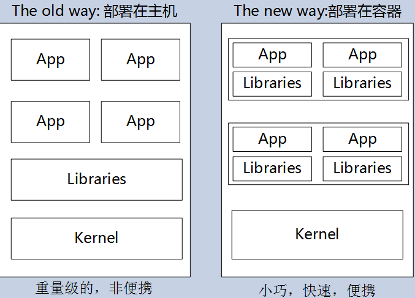

1、传统部署和容器部署

　　传统的应用部署方式是通过插件或脚本来安装应用。这样做的缺点是应用的运行、配置、管理、所有生存周期将与当前操作系统绑定，这样做并不利于应用的升级更新/回滚等操作，当然也可以通过创建虚机的方式来实现某些功能，但是虚拟机非常重，并不利于可移植性。

　　新的方式是通过部署容器方式实现，每个容器之间互相隔离，每个容器有自己的文件系统 ，容器之间进程不会相互影响，能区分计算资源。相对于虚拟机，容器能快速部署，由于容器与底层设施、机器文件系统解耦的，所以它能在不同云、不同版本操作系统间进行迁移。

　　容器占用资源少、部署快，每个应用可以被打包成一个容器镜像，每个应用与容器间成一对一关系也使容器有更大优势，使用容器可以在build或release 的阶段，为应用创建容器镜像，因为每个应用不需要与其余的应用堆栈组合，也不依赖于生产环境基础结构，这使得从研发到测试、生产能提供一致环境。类似地，容器比虚机轻量、更“透明”，这更便于监控和管理。最后，

2、容器优势总结：

- 快速创建/部署应用：与VM虚拟机相比，容器镜像的创建更加容易。
- 持续开发、集成和部署：提供可靠且频繁的容器镜像构建/部署，并使用快速和简单的回滚(由于镜像不可变性)。
- 开发和运行相分离：在build或者release阶段创建容器镜像，使得应用和基础设施解耦。
- 开发，测试和生产环境一致性：在本地或外网（生产环境）运行的一致性。
- 云平台或其他操作系统：可以在 Ubuntu、RHEL、 CentOS、on-prem、Google Container Engine或其它任何环境中运行。
- Loosely coupled（松耦合），分布式，弹性，微服务化：应用程序分为更小的、独立的部件，可以动态部署和管理。
- 资源隔离 
- 资源利用：更高效 

## 三、使用 Kubernetes 能做什么？(CICD)

　　可以在物理或虚拟机的Kubernetes集群上运行容器化应用，Kubernetes能提供一个以“容器为中心的基础架构”，满足在生产环境中运行应用的一些常见需求，如：

- 多个进程（作为容器运行）协同工作。（Pod）
- 存储系统挂载
- Distributing secrets  （使用 Secret 安全地分发凭证，加密传输）
- 应用健康检测
- 应用实例的复制
- Pod 自动伸缩/扩展
- Naming and discovering （自动发现）
- 负载均衡    (kube-proxy)
- 滚动更新
- 资源监控    
- 日志访问
- 调试应用程序
- 提供认证和授权  （RBAC）

## 四、Kubernetes不是什么？

Kubernetes并不是传统的PaaS（平台即服务）系统。

- Kubernetes不限制支持应用的类型，不限制应用框架。限制受支持的语言runtimes (例如, Java, Python, Ruby)，满足12-factor applications 。不区分 “apps” 或者“services”。 Kubernetes支持不同负载应用，包括有状态、无状态、数据处理类型的应用。只要这个应用可以在容器里运行，那么就能很好的运行在Kubernetes上。
- Kubernetes 不提供中间件（如message buses）、数据处理框架（如Spark）、数据库(如Mysql)或者集群存储系统(如Ceph)作为内置服务。但这些应用都可以运行在Kubernetes上面。
- Kubernetes 不部署源码不编译应用。持续集成的 (CI)工作流方面，不同的用户有不同的需求和偏好的区域，因此，我们提供分层的 CI工作流，但并不定义它应该如何工作。
- Kubernetes 允许用户选择自己的日志、监控和报警系统。
- Kubernetes 不提供或授权一个全面的应用程序配置 语言/系统（例如，jsonnet）。
- Kubernetes 不提供任何机器配置、维护、管理或者自修复系统。

　　另一方面，大量的Paas系统都可以运行在Kubernetes上，比如Openshift、Deis、Gondor。可以构建自己的Paas平台，与自己选择的CI系统集成。

　　由于Kubernetes运行在应用级别而不是硬件级，因此提供了普通的Paas平台提供的一些通用功能，比如部署，扩展，负载均衡，日志，监控等。这些默认功能是可选的。

　　另外，Kubernetes不仅仅是一个“编排系统”；它消除了编排的需要。“编排”的定义是指执行一个预定的工作流：先执行A，之B，然C。相反，Kubernetes由一组独立的可组合控制进程组成。怎么样从A到C并不重要，达到目的就好。当然集中控制也是必不可少，方法更像排舞的过程。这使得系统更加易用、强大、弹性和可扩展。 

## 五、Kubernetes 主要功能

#### 1、数据卷

  Pod 中容器之间共享数据，可以使用数据卷。

#### 2、应用程序健康检查

  容器内服务可能进程堵塞无法处理请求，可以设置监控检查策略保证应用健壮性。

#### 3、复制应用程序实例

  控制器维护着Pod副本数量，保证一个Pod或一组同类的Pod数量始终可用。

#### 4、弹性伸缩

  根据设定的指标（CPU利用率）自动缩放Pod副本数。

#### 5、服务发现

  使用环境变量或DNS服务插件保证容器中程序发现Pod入口访问地址。

#### 6、负载均衡

  一组Pod副本分配一个私有的 ClusterIP 地址，负载均衡转发请求到后端容器。在集群内部其他Pod可通过这个ClusterIP访问应用。

#### 7、滚动更新

  更新服务不中断，一次更新一个Pod，而不是同时删除整个服务。

#### 8、服务编排

  通过文件描述部署服务，使得应用程序部署变得更高效。

#### 9、资源监控

  Node节点组件集成cAdvisor资源收集工具，可通过Heapster汇总整个集群节点资源数据，然后存储到InfluxDB时序数据库，再由Grafana展示。

#### 10、提供认证和授权

  支持属性访问控制（ABAC）、角色访问控制（RBAC）认证授权策略。

## 六、Kubernetes 基本对象概念（资源对象）

### 1、基本对象：

#### 1、Pod

  Pod 是最小部署单元，一个 Pod 有一个或多个容器组成，Pod 中容器共享存储和网络，在同一台 Docker 主机上运行。

#### 2、Service 

  Service  一个应用服务抽象，定义了 Pod 逻辑集合和访问这个 Pod 集合的策略。

  Service 代理 Pod 集合对外表现是为一个访问入口，分配一个集群 IP 地址及端口，来自这个 IP 的请求将被负载均衡 （kube-proxy）转发到后端 Pod 中的容器。

  Service 通过 LableSelector 选择一组 Pod 提供服务。(以标签的形式标识服务)

#### 3、Volume

  数据卷，共享 Pod 中容器使用的数据。

#### 4、Namespace

  命名空间将对象逻辑上分配到不同 Namespace，可以是不同的项目、用户等区分管理，并设定控制策略，从而实现多租户。

  命名空间也称为虚拟集群。

#### 5、Lable

  标签用于区分对象（比如 Pod、Service），键/值对存在；每个对象可以有多个标签，通过标签关联对象。

​        一个 pod 打多个标签

​        一个标签可以打给多 pod

### 2、Kubernetes 基于基本对象更高层次抽象

#### 1、ReplicaSet（复制控制器）

  下一代 ReplicationController。确保任何给定时间指定的 Pod 副本数量，并提供声明式更新等功能。

  RC 与 RS 唯一区别就是 lableselector 支持不同，RS 支持新的基于集合的标签，RC 仅支持基于等式的标签。

​        RS 不参与人为管理

#### 2、Deployment 

  Deployment 是一个更高层次的 API 对象，它管理 ReplicaSets 和 Pod，并提供声明式更新等功能。

  官方建议使用 Deployment 管理 ReplicaSets，而不是直接使用 ReplicaSets，这就意味着可能永远不需要直接操作 ReplicaSet 对象。

#### 3、StatefulSet

  StatefulSet 适合持久性的应用程序，有唯一的网络标识符（IP），持久存储，有序的部署、扩展、删除和滚动更新。

#### 4、DaemonSet

  demonSet 确保所有（或一些）节点运行同一个Pod。当节点加入 Kubernetes 集群中，Pod 会被调度到该节点上运行，当节点从集群中移除时，DaemonSet 的 Pod 会被删除。删除 DaemonSet 会清理它所有创建的 Pod。

#### 5、Job （at）

  一次性任务，运行完成后 Pod 销毁，不再重新启动新容器。还可以任务定时运行。

#### 6、cronjob （cron）

### 3、Kubernetes 资源对象的理解和定义

#### 1、Pod

Kubernetes为每个Pod都分配了唯一的IP地址，称之为Pod IP，一个Pod里的多个容器共享Pod IP地址。Kubernetes 要求底层网络支持集群内任意两个 Pod 之间的 TCP/IP直接通信，这通常采用虚拟二层网络技术来实现，例如 Flannel、Open vSwitch等。因此，在 Kubernetes 里，一个Pod里的容器与另外主机上的Pod容器能够直接通信。
Pod有两种类型：普通的Pod和静态Pod（Static Pod），静态Pod不存放在etcd存储里，而是存放在某个具体的 Node 上的一个具体文件中，并且只在此 Node 上启动运行。普通的 Pod 一旦被创建，就会被存储到 etcd 中，随后会被 Kubernetes Master 调度到某个具体的 Node 上并进行绑定（Binding），该 Node 上的 kubelet 进程会将其实例化成一组相关的 Docker 容器并启动起来。当 Pod 里的某个容器停止时，Kubernetes 会自动检测到这个问题并且重新启动这个 Pod（重启Pod里的所有容器）；如果 Pod 所在的 Node 宕机，则会将这个 Node 上的所有 Pod 重新调度到其他节点上运行。
Pod、容器与Node的关系如下图：
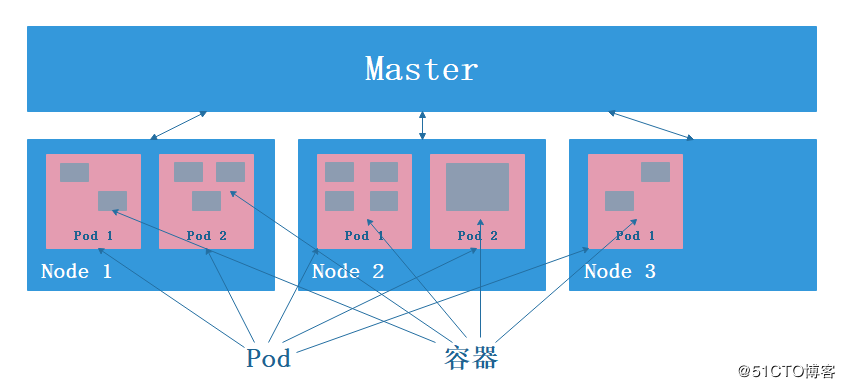
Kubernetes 里的所有资源对象都可以采用 yaml 或者 JSON 格式的文件来定义或描述，下面是一个简单的Pod资源定义文件：

```yaml
apiVersion: v1
kind: Pod
metadata:
  name: myweb
  labels:
    name: myweb
spec:
  containers:
  - name: myweb
    image: kubeguide/tomcat-app: v1
    ports:
    - containerPort: 8080
    env:
    - name: MYSQL_SERVICE_HOST
      value: 'mysql'
    - name: MYSQL_SERVICE_PORT
      value: '3306'
```

kind 为 pod 表明这是一个Pod的定义，metadata 里的 name 属性为 Pod 的名字，metadata 里还能定义资源对象的标签（Label），这里声明myweb拥有一个name=myweb的标签（Label）。Pod里包含的容器组的定义则在spec一节中声明，这里定义了一个名字为myweb，对应镜像为kubeguide/tomcat-app: v1的容器，该容器注入了名为MYSQL_SERVICE_HOST='mysql'和MYSQL_SERVICE_PORT='3306'的环境变量（env关键字），并且在8080端口（containerPort）上启动容器进程。Pod的IP加上这里的容器端口，就组成了一个新的概念——**Endpoint**（端点），它代表着此Pod里的一个**服务进程的对外通信地址**。一个Pod也存在着具有多个Endpoint的情况，比如我们把 Tomcat 定义为一个 Pod 时，可以对外暴露管理端口与服务端口这两个 Endpoint。
Docker 里的 Volume 在 Kubernetes 里也有对应的概念—— Pod Volume，Pod Volume 有一些扩展，比如可以用分布式文件系统 GlusterFS 等实现后端存储功能；Pod Volume 是定义在 Pod 之上，然后被各个容器挂载到自己的文件系统中的。对于Pod Volume的定义我们后面会讲到。
这里顺便提一下**Event** 概念，Event是一个**事件的记录**，记录了事件的最早产生时间、最后重现时间、重复次数、发起者、类型，以及导致此事件的原因等众多信息。Event 通常会关联到某个具体的资源对象上，是排查故障的重要参考信息，当我们发现某个Pod迟迟无法创建时，可以用 **kubectl describe pod xxx**来查看它的描述信息，用来定位问题的原因。
每个Pod都可以对其能使用的服务器上的计算资源设置限额，当前可以**设置限额**的计算资源有CPU和Memory两种，其中CPU的资源单位为CPU（Core）的数量，是一个绝对值。
对于容器来说一个CPU的配额已经是相当大的资源配额了，所以在Kubernetes里，通常以千**分之一的CPU配额为最小单位**，用**m**来表示。通常一个容器的CPU配额被定义为100-300m，即占用0.1-0.3个CPU。与CPU配额类似，Memory配额也是一个绝对值，它的单位是**内存字节数**。
对计算资源进行配额限定需要设定以下两个参数：

- Requests：该资源的最小申请量，系统必须满足要求。
- Limits：该资源最大允许使用的量，不能超过这个使用限制，当容器试图使用超过这个量的资源时，可能会被Kubernetes Kill并重启。

通常我们应该把Requests设置为一个比较小的数值，满足容器平时的工作负载情况下的资源需求，而把Limits设置为峰值负载情况下资源占用的最大量。下面是一个资源配额的简单定义：

```yaml
spec:
  containers:
  - name: db
    image: mysql
    resources:
      requests:
        memory: "64Mi"
        cpu: "250m"
      limits:
        memory: "128Mi"
        cpu: "500m"
```

最小0.25个CPU及64MB内存，最大0.5个CPU及128MB内存。

#### 2、Label（标签）

Label 相当于我们熟悉的“标签”，给某个资源对象定义一个Label，就相当于给它打了一个标签，随后可以通过 Label Selector（标签选择器）查询和筛选拥有某些Label的资源对象，Kubernetes 通过这种方式实现了类似 SQL 的简单又通用的对象查询机制。
Label Selector 相当于SQL语句中的 where 查询条件，例如，name=redis-slave 这个 Label Selector 作用于Pod时，相当于 select * from pod where pod’s name = ‘redis-slave’ 这样的语句。

Label Selector的表达式有两种：基于**等式**的（Equality-based）和基于**集合**的（Set-based）。下面是基于等式的匹配例子。
name=redis-slave：匹配所有标签为 name=redis-slave 的资源对象。
env != production：匹配所有标签env不等于 production 的资源对象。
下面是基于集合的匹配例子

- name in (redis-master, redis-slave)：匹配所有标签为 name=redis-master 或者 name=redis-slave 的资源对象。
- name not in (php-frontend)：匹配所有标签 name 不等于php-frontend 的资源对象。

还可以通过多个 Label Selector 表达式的组合实现复杂的条件选择，多个表达式之间用“，”进行分隔即可，几个条件之间是 “AND” 的关系，即同时满足多个条件，例如：

```yaml
name=redis-slave, env!=production
name not in (php-frontend), env!=production
```

以 Pod 为例，Label 定义在 metadata 中：

```yaml
apiVersion: v1
kind: Pod
metadata:
  name: myweb
  labels:
    app: myweb
```

RC 和 Service  在 spec 中定义 Selector 与 Pod 进行关联：

```yaml
apiVersion: v1
kind: ReplicationController
metadata:
  name: myweb
spec:
  replicas: 1
  selector:
    app: myweb
  template:
  …………
```

Deployment、ReplicaSet、DaemonSet 和 Job 则可以在 Selector 中使用基于集合的筛选条件：

```yaml
selector:
  matchLabels:
    app: myweb
  matchExpressions:
    - {key: tier, operator: In, values: [frontend]}
    - {key: environment, operator: NotIn, values: [dev]}
```

**matchLabels** 用于定义一组  Label，与直接写在 Selector 中作用相同；

**matchExpressions**  用于定义一组基于集合的筛选条件，可用的条件运算符包括：In、NotIn、Exists和DoesNotExist。

如果同时设置了 matchLabels 和 matchExpressions，则两组条件为“AND”关系，即所有条件需要同时满足才能完成 Selector 的筛选。

Label Selector 在 Kubernetes 中的重要使用场景如下：

- Kube-controller 进程通过资源对象 RC 上定义的 Label Selector 来筛选要监控的 Pod 副本的数量，从而实现 Pod 副本的数量始终符合预期设定的全自动控制流程。
- Kube-proxy 进程通过 Service 的 Label Selector 来选择对应的 Pod，自动建立起每个 Service 到对应 Pod 的请求转发路由表，从而实现 Service 的智能负载均衡机制。
- 通过对某些 Node 定义特定的 Label，并且在 Pod 定义文件中使用  NodeSelector 这种标签调度策略，kube-scheduler 进程可以实现Pod“定向调度”的特性。

下面举个复杂点的例子，假设我们为 Pod 定义了3个Label：release、env和role，不同的Pod定义了不同的Label。如下图所示，如果我们设置了“role=frontend”的Label Selector，则会选取到Node 1和Node 2上的Pod。
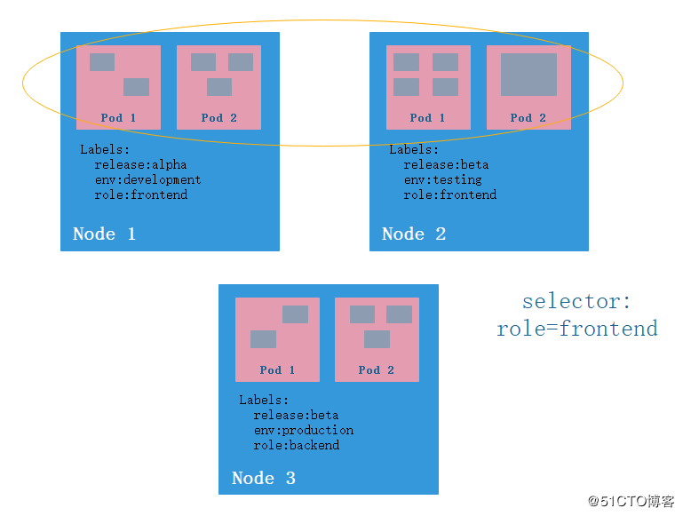
如果我们设置 “release=beta” 的 Label Selector，则会选取到 Node 2 和 Node 3 上的 Pod，如下图所示。
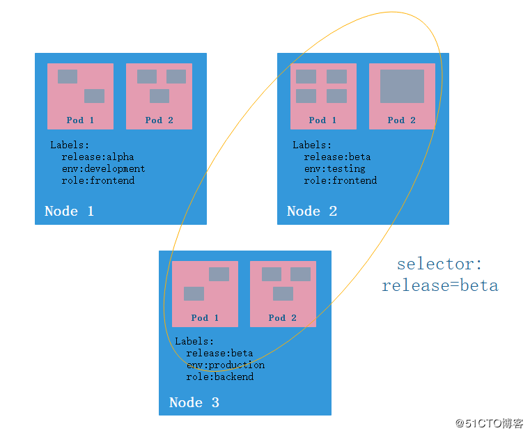
总结：使用 Label 可以给对象创建多组标签，Label 和 Label Selector 共同构成了 Kubernetes 系统中最核心的应用模型，使得被管理对象能够被精细地分组管理，同时实现了整个集群的高可用性。

#### 3、Replication Controller （复制控制器）

RC 的作用是声明 Pod 的副本数量在任意时刻都符合某个预期值，所以 RC 的定义包括如下几个部分。

- Pod 期待的副本数量（replicas）。
- 用于筛选目标 Pod 的 Label Selector。
- 当 Pod 的副本数量小于预期数量时，用于创建新 Pod 的 Pod 模板（template）。

下面是一个完整的 RC 定义的例子，即确保拥有tier=frontend标签的这个Pod（运行Tomcat容器）在整个 Kubernetes 集群中始终有三个副本：

```yaml
apiVersion: v1
kind: ReplicationController
metadata:
  name: frontend
spec:
  replicas: 3
  selector:
    tier: frontend
  template:
    metadata:
      labels:
        app: app-demo
        tier: frontend
    spec:
      containers:
      - name: tomcat-demo
        image: tomcat
        imagePullPolicy: IfNotPresent
        env:
        - name: GET_HOSTS_FROM
          value: dns
        ports:
        - containerPort: 80
```

当我们定义了一个 RC 并提交到 Kubernetes 集群中后，Master 节点上的 Controller Manager 组件就得到通知，定期巡检系统中当前存活的目标 Pod，并确保目标Pod实例的数量刚好等于此 RC 的期望值。如果有过多的 Pod 副本在运行，系统就会停掉多余的 Pod；如果运行的 Pod 副本少于期望值，即如果某个 Pod 挂掉，系统就会自动创建新的 Pod 以保证数量等于期望值。
通过 RC，Kubernetes 实现了用户应用集群的高可用性，并且大大减少了运维人员在传统 IT 环境中需要完成的许多手工运维工作（如主机监控脚本、应用监控脚本、故障恢复脚本等）。
下面我们来看下 Kubernetes 如何通过 RC 来实现 Pod 副本数量自动控制的机制，假如我们有 3个 Node节点，在 RC 里定义了 redis-slave 这个 Pod 需要保持两个副本，系统将会在其中的两个 Node上创建副本，如下图所示。
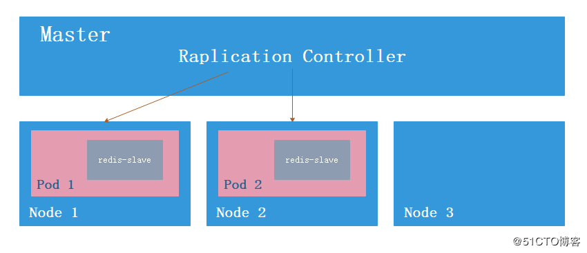
假如 Node2 上的 Pod2 意外终止，根据 RC 定义的 replicas 数量 2，Kubernetes 将会自动创建并启动一个新的 Pod，以保证整个集群中始终有两个 redis-slave Pod 在运行。
系统可能选择 Node1 或者 Node3 来创建一个新的Pod，如下图。
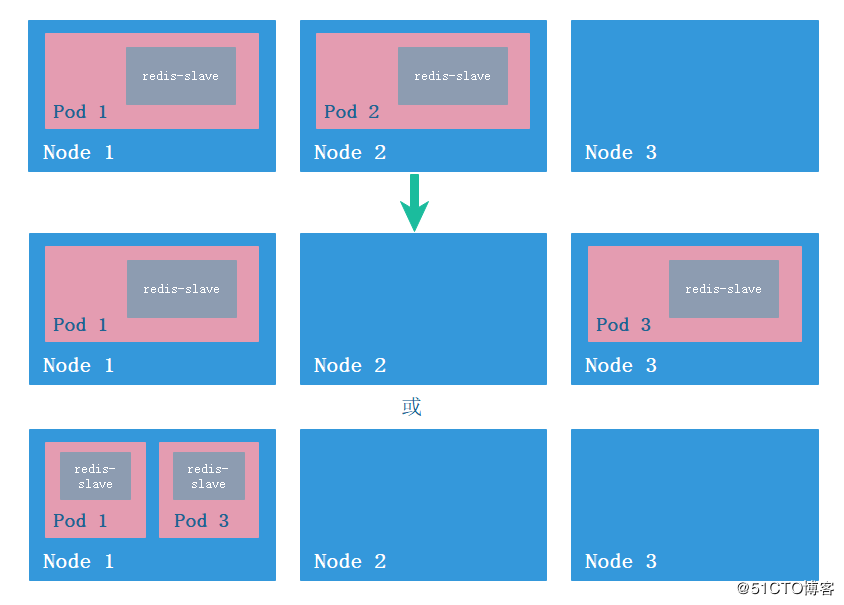
通过修改 RC 的副本数量，可以实现 Pod 的动态缩放（Scaling）功能。

```
kubectl scale rc redis-slave --replicas=3
```

此时 Kubernetes 会在 3 个 Node 中选取一个 Node 创建并运行一个新的 Pod3，使 redis-slave Pod 副本数量始终保持3个。

#### 4、Replica Set

由于Replication Controller 与 Kubernetes 代码中的模块 Replication Controller 同名，同时这个词也无法准确表达它的意思，所以从 Kubernetes v1.2 开始，它就升级成了另外一个新的对象—— Replica Set，官方解释为“下一代的 RC”。它与 RC当前存在的唯一区别是：Replica Set 支持基于集合的 Label selector（Set-based selector），而 RC 只支持基于等式的 Label selector（equality-based selector），所以 Replica Set 的功能更强大。下面是 Replica Set 的定义例子（省去了Pod模板部分的内容）：

```yaml
apiVersion: extensions/v1beta1
kind: ReplicaSet
metadata:
  name: frontend
spec:
  selector:
    matchLabels:
      tier: frontend
    matchExpressions:
      - {key: tier, operator: In, values: [frontend]}
  template:
  …………
```

Replica Set 很少单独使用，它主要被 Deployment 这个更高层的资源对象所使用，从而形成一整套 Pod 创建、删除、更新的编排机制。
RC 和 RS 的特性与作用如下：

- 在大多情况下，我们通过定义一个 RC 实现 Pod 的创建过程及副本数量的自动控制。
- RC 里包括完整的 Pod 定义模板。
- RC 通过 Label Selector 机制实现对Pod副本的自动控制。
- 通过改变 RC 里的 Pod 副本数量，可以实现 Pod 的扩容或缩容功能。
- 通过改变 RC 里 Pod 模板中的镜像版本，可以实现 Pod 的滚动升级功能。

#### 5、Deployment （pod 部署控制器）

Deployment 相对于 RC 的最大区别是我们可以随时知道当前 Pod “部署”的进度。一个 Pod 的创建、调度、绑定节点及在目标 Node 上启动对应的容器这一完整过程需要一定的时间，所以我们期待系统启动 N个 Pod 副本的目标状态，实际上是一个连续变化的“部署过程”导致的最终状态。
Deployment 的典型使用场景有以下几个：

- 创建一个 Deployment 对象来生成对应的 Replica Set 并完成 Pod 副本的创建过程。
- 检查 Deployment 的状态来看部署动作是否完成（ Pod 副本的数量是否达到预期的值）。
- 更新 Deployment 以创建新的 Pod（比如镜像升级）。
- 如果当前 Deployment 不稳定，则回滚到一个早先的 Deployment 版本。
- 暂停 Deployment 以便于一次性修改多个 Pod Template Spe c的配置项，之后再恢复Deployment，进行新的发布。
- 扩展 Deployment 以应对高负载。
- 查看 Deployment 的状态，以此作为发布是否成功的指标。
- 清理不再需要的旧版本 ReplicaSet。

Deployment 的定义与 Replica Set 的定义类似，只是 API 声明与 Kind 类型不同。

```yaml
apiVersion: extensions/v1beta1
kind: Deployment
metadata:
  name: nginx-deployment
apiVersion: v1
kind: ReplicaSet
metadata:
  name: nginx-repset
```

下面是 Deployment 定义的一个完整例子：

```yaml
apiVersion: extensions/v1beta1
kind: Deployment
metadata:
  name: frontend
spec:
  replicas: 1
  selector:
    matchLabels:
      tier: frontend
    matchExpressions:
      - {key: tier, operator: In, values: [frontend]}
  template:
    metadata:
      labels:
        app: app-demo
        tier: frontend
    spec:
      containers:
      - name: tomcat-demo
        image: tomcat
        imagePullPolicy: IfNotPresent
        ports:
        - containerPort: 8080
        resources:            
          requests:              
            cpu: 0.1           
            memory: 32Mi         
          limits:                
            cpu: 0.5  
            memory: 32Mi
```

可以通过命令 kubectl get deployment 来查看 Deployment 的信息，其中的几个参数解释如下：

- DESIRED:：Pod副本数量的期望值，即 Deployment 里定义的 Replica。
- CURRENT：当前 Replica 的值，如果小于 DESIRED 的期望值，会创建新的 Pod，直到达成 DESIRED 为止。
- UP-TO-DATE：最新版本的 Pod 的副本数量，用于指示在滚动升级的过程中，有多少个 Pod 副本已经成功升级。
- AVAILABLE：当前集群中可用的Pod副本数量，即集群中当前存活的Pod数量。

Pod 的管理对象，除了 RC、ReplicaSet、Deployment，还有 DaemonSet、StatefulSet、Job 等，分别用于不同的应用场景。

#### 6、Horizontal Pod Autoscaler

HPA 与 RC、Deployment 一样，也属于 Kubernetes 资源对象。通过追踪分析 RC 或 RS 控制的所有目标 Pod 的负载变化情况，来确定是否需要针对性地调整目标 Pod 的副本数。
HPA 有以下两种方式作为 Pod 负载的度量指标：

- CPU Utilization Percentage (CPU利用率百分比)
- 应用程序自定义的度量指标，比如服务在每秒内的相应的请求数（ TPS 或 QPS ）。

CPU Utilization Percentage 是一个算术平均值，即目标 Pod 所有副本自带的 CPU 利用率的平均值。一个 Pod 自身的 CPU 利用率是该 Pod 当前 CPU 的使用量除以它的Pod Request 的值，比如我们定义一个 Pod 的 Pod Request 为 0.4，而当前 Pod 的 CPU 使用量为 0.2，则它的 CPU 使用率为 50%，这样我们就可以算出来一个 RC 或 RS  控制的所有 Pod 副本的 CPU 利用率的算术平均值了。如果某一时刻CPU Utilization Percentage的值超过 80%，则意味着当前的 Pod 副本数很可能不足以支撑接下来更多的请求，需要进行动态扩容，而当请求高峰时段过去后，Pod 的 CPU 利用率又会降下来，此时对应的Pod副本数应该自动减少到一个合理的水平。
下面是HPA定义的一个具体的例子：

```yaml
apiVersion: autoscaling/v1
kind: HorizontalPodAutoscaler
metadata:
  name: php-apache
  namespace: default
spec:
  maxReplicas: 10
  minReplicas: 2
  scaleTargetRef:
    kind: Deployment
    name: php-apache
  targetCPUUtilizationPercentage: 90
```

通过 HPA 控制 php-apache 的Pod副本，当Pod副本的CPUUtilizationPercentage的值超过90%时，会进行自动扩容增加 Pod 副本的数量，扩容或缩容时 Pod 的副本数量要介于 2-10 之间。
除了通过 yaml 文件来定义HPA对象之外，还可以通过命令的方式创建：

```
kubectl autoscale deployment php-apache --cpu-percent=90 --min=1 --max=10
```


```yaml
apiVersion: extensions/v1beta1
kind: Deployment
metadata:
  name: frontend
spec:
  replicas: 2
  selector:
    matchLabels:
      tier: frontend
    matchExpressions:
      - {key: tier, operator: In, values: [frontend]}
  template:
    metadata:
      labels:
        app: app-demo
        tier: frontend
    spec:
      containers:
      - name: tomcat-demo
        image: tomcat
        imagePullPolicy: IfNotPresent
        ports:
        - containerPort: 8080
        resources:
          requests:
            cpu: 0.1
          limits:
            cpu: 0.2
        volumeMounts:
          - mountPath: /mydata-data
            name: datavol
      containers:
      - name: nginx
        image: nginx
        imagePullPolicy: IfNotPresent
        ports:
        - containerPort: 80
        resources:
          requests:
            cpu: 0.1
          limits:
            cpu: 0.2
        volumeMounts:
          - mountPath: /mydata-data
            name: datavol
      volumes:
      - name: datavol
        emptyDir: {}
---
apiVersion: v1
kind: Service
metadata:
  name: tomcat-service
spec:
  type: NodePort
  ports:
  - port: 8080
    nodePort: 31000
  selector:
    tier: frontend
---
apiVersion: autoscaling/v1
kind: HorizontalPodAutoscaler
metadata:
  name: tomcat-hpa
  namespace: default
spec:
  maxReplicas: 10
  minReplicas: 2
  scaleTargetRef:
    kind: Deployment
    name: frontend
  targetCPUUtilizationPercentage: 10
```

#### 7、StatefulSet (有状态服务控制器)

Pod 的管理对象 RC、Deployment、DaemonSet 和 Job 都是面向无状态的服务，但实际中有很多服务是有状态的，比如 Mysql集群、MongoDB集群、ZooKeeper集群等，可以使用 StatefulSet 来管理有状态的服务。
StatefulSet 有如下一些特性：

- StatefulSet 里的每个 Pod 都有稳定、唯一的网络标识，可以用来发现集群内的其他成员。假设 StatefulSet 的名字叫 kafka，那么第1个 Pod 叫 kafka-0，第2个叫kafka-1，以此类推。
- StatefulSet 控制的 Pod 副本的启停顺序是受控的，操作第 n 个 Pod 时，前 n-1 个 Pod 已经是运行且准备好的状态。
- StatefulSet 里的 Pod 采用稳定的持久化存储卷，通过 PV/PVC 来实现，删除 Pod 时默认不会删除与 StatefulSet 相关的存储卷（为了保证数据的安全）。

StatefulSet 除了要与PV卷捆绑使用以存储 Pod 的状态数据，还要与 Headless Service(无头服务) 配合使用，即在每个 StatefulSet 的定义中要声明它属于哪个 Headless Service。Headless Service 与普通 Service 的区别在于，它没有 Cluster IP，如果解析 Headless Service 的 DNS 域名，则返回的是该 Service 对应的全部 Pod 的 Endpoint 列表。StatefulSet 在 Headless Service 的基础上又为 StatefulSet 控制的每个 Pod 实例创建了一个 DNS 域名，这个域名的格式为：

```
$(podname).$(headless service name)
```

比如一个 3 节点的 kafka 的 StatefulSet 集群，对应的 Headless Service 的名字为 kafka，StatefulSet 的名字为 kafka，则 StatefulSet 里面的 3 个 Pod 的 DNS 名称分别为kafka-0.kafka、kafka-1.kafka、kafka-2.kafka，这些 DNS 名称可以直接在集群的配置文件中固定下来。

#### 8、Service（服务）

**1.概述**
Service 其实就是我们经常提起的微服务架构中的一个“微服务”，Pod、RC 等资源对象其实都是为它作“嫁衣”的。Pod、RC 或 RS 与 Service 的逻辑关系如下图所示。
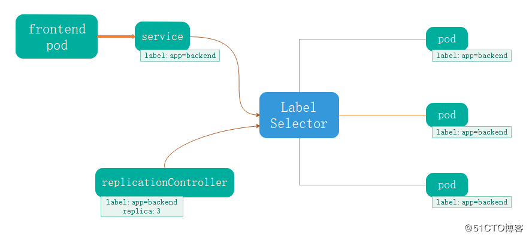
通过上图我们看到，Kubernetes 的 Service 定义了一个服务的访问入口地址，前端的应用（Pod）通过这个入口地址访问其背后的一组由 Pod 副本组成的集群实例，Service 与其后端 Pod 副本集群之间则是通过 Label Selector 来实现“无缝对接”的。而 RC 的作用实际上是保证 Service 的**服务能力**和**服务质量**始终处于预期的标准。
通过分析、识别并建模系统中的所有服务为微服务——Kubernetes Service，最终我们的系统由多个提供不同业务能力而又彼此独立的微服务单元所组成，服务之间通过TCP/IP 进行通信，从而形成了强大而又灵活的弹性集群，拥有了强大的分布式能力、弹性扩展能力、容错能力。因此，我们的系统架构也变得简单和直观许多。
既然每个 Pod 都会被分配一个单独的 IP 地址，而且每个 Pod 都提供了一个独立的 Endpoint（Pod IP+ContainerPort）以被客户端访问，多个 Pod 副本组成了一个集群来提供服务，那么客户端如何来访问它们呢？一般的做法是部署一个负载均衡器（软件或硬件），但这样无疑增加了运维的工作量。在 Kubernetes 集群里使用了 Service（服务），它提供了一个虚拟的 IP 地址（Cluster IP）和端口号，Kubernetes 集群里的任何服务都可以通过 Cluster IP+端口的方式来访问此服务，至于访问请求最后会被转发到哪个 Pod，则由运行在每个 Node 上的 kube-proxy 负责。kube-proxy 进程其实就是一个智能的软件负载均衡器，它负责把对 Service 的请求转发到后端的某个 Pod 实例上，并在内部实现服务的负载均衡与会话保持机制。
下面是一个Service 的简单定义：

```yaml
apiVersion: v1
kind: Service
metadata:
  name: tomcat-service
spec:
  ports:
  - port: 8080
  selector:
    tier: frontend
```

上述内容定义了一个名为 “tomcat-service” 的 Service，它的服务端口为 8080，拥有 “tier=frontend” 这个 Label 的所有 Pod 实例。
很多服务都存在多个端口的问题，通常一个端口提供业务服务，另外一个端口提供管理服务，比如 Mycat、Codis 等常见中间件。Kubernetes Service 支持多个 Endpoint，要求每个 Endpoint 定义一个名字来区分，下面是 tomcat 多端口的 Service 定义样例。

```yaml
apiVersion: v1
kind: Service
metadata:
  name: tomcat-service
spec:
  ports:
  - port: 8080
    name: service-port
  - port: 8005
    name: shutdown-port
  selector:
    tie: frontend
```

多端口为什么需要给每个端口命名呢？这就涉及 Kubernetes 的服务发现机制了。
**2、Kubernetes 的服务发现机制**
每个 Kubernetes 中的 Service 都有一个唯一的 Cluster IP 及唯一的名字，而名字是由我们自己定义的，那我们是否可以通过 Service 的名字来访问呢？
最早时 Kubernetes 采用了 Linux 环境变量的方式来实现，即每个 Service 生成一些对应的 Linux 环境变量（ENV），并在每个Pod的容器启动时，自动注入这些环境变量，以实现通过 Service 的名字来建立连接的目的。
考虑到通过环境变量获取 Service 的 IP 与端口的方式仍然不方便、不直观，后来 Kubernetes 通过 Add-On 增值包的方式引入了 DNS 系统，把服务名作为 DNS 域名，这样程序就可以直接使用服务名来建立连接了。
**3、外部系统访问 Service 的问题**
Kubernetes集群里有三种IP地址，分别如下：

- Node IP：Node 节点的IP地址，即物理网卡的IP地址。
- Pod IP：Pod 的IP地址，即 docker 容器的IP地址，此为虚拟IP地址。
- Cluster IP：Service 的IP地址，此为虚拟IP地址。

外部访问 Kubernetes 集群里的某个节点或者服务时，必须要通过 Node IP 进行通信。
Pod IP 是 Docker Engine 根据 flannel.1 网桥的 IP 地址段进行分配的一个虚拟二层网络IP地址，Pod 与 Pod 之间的访问就是通过这个虚拟二层网络进行通信的，而真实的TCP/IP 流量则是通过 Node IP 所在的物理网卡流出的。
Service 的 Cluster IP 具有以下特点：

- Cluster IP 仅仅作用于 Service 这个对象，并由 Kubernetes 管理和分配 IP 地址。
- Cluster IP 是一个虚拟地址，无法被 ping。
- Cluster IP 只能结合 Service Port 组成一个具体的通信端口，供 Kubernetes 集群内部访问，单独的 Cluster IP 不具备 TCP/IP 通信的基础，并且外部如果要访问这个通信端口，需要做一些额外的工作。
- Node IP、Pod IP 和 Cluster IP 之间的通信，采用的是 Kubernetes 自己设计的一种特殊的路由规则，与我们熟悉的 IP 路由有很大的区别。

我们的应用如果想让外部访问，最常用的作法是使用 NodePort 方式。

```yaml
apiVersion: v1
kind: Service
metadata:
  name: tomcat-service
spec:
  type: NodePort
  ports:
  - port: 8080
    nodePort: 31002
  selector:
    tier: frontend
```

NodePort 的实现方式是在 Kubernetes 集群里的每个 Node 上为需要外部访问的 Service 开启一个对应的 TCP 监听端口，外部系统只要用任意一个 Node 的 P 地址+具体的 NodePort 端口号即可访问此服务。
NodePort 还没有完全解决外部访问Service的所有问题，比如负载均衡问题，常用的做法是在 Kubernetes 集群之外部署一个负载均衡器。
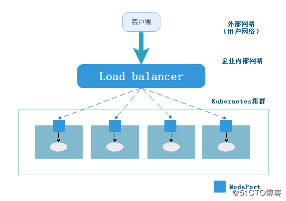
Load balancer 组件独立于 Kubernetes 集群之外，可以是一个硬件负载均衡器，也可以是软件方式实现，例如 HAProxy 或者 Nginx。这种方式，无疑是增加了运维的工作量及出错的概率。
于是 Kubernetes 提供了自动化的解决方案，如果我们使用谷歌的 GCE 公有云，那么只需要将 type: NodePort 改成 type: LoadBalancer，此时 Kubernetes 会自动创建一个对应的 Load balancer 实例并返回它的 IP 地址供外部客户端使用。其他公有云提供商只要实现了支持此特性的驱动，则也可以达到上述目的。

#### 9、Volume（存储卷）

Volume 是 Pod 中能够被多个容器访问的共享目录。Volume 定义在 Pod 上，被一个 Pod 里的多个容器挂载到具体的文件目录下，当容器终止或者重启时，Volume (volume 类型，临时性和持久性)中的数据也不会丢失。Kubernetes 支持多种类型的 Volume，例如 GlusterFS、Ceph 等分布式文件系统。
除了可以让一个 Pod 里的多个容器共享文件、让容器的数据写到宿主机的磁盘上或者写文件到网络存储中，Kubernetes 还提供了容器配置文件集中化定义与管理，通过ConfigMap（配置管理控制器） 对象来实现。
Kubernetes 支持多种 Volume 类型，下面我们一一进行介绍。

##### **1、emptyDir**

emptyDir 是在 Pod 分配到 Node 时创建的，它的初始内容为空，并且无须指定宿主机上对应的目录文件，它是 Kubernetes 自动分配的一个目录，当 Pod 从 Node 上移除时，emptyDir 中的数据也会被永久删除。
emptyDir 的用途如下：

- 临时空间，例如用于某些应用程序运行时所需的临时目录，且无须永久保存。
- 长时间任务的中间过程 CheckPoint （检查点）的临时保存目录。
- 一个容器需要从另一个容器中获取数据的目录（多容器共享目录）。

emptyDir 的定义如下：

```yaml
template:
  metadata:
    labels:
      app: app-demo
      tier: frontend
  spec:
    volumes:
      - name: datavol
        emptyDir: {}
    containers:
    - name: tomcat-demo
      image: tomcat
      volumeMounts:
        - mountPath: /mydata-data
          name: datavol
      imagePullPolicy: IfNotPresent
```

实验练习

```yaml
apiVersion: extensions/v1beta1
kind: Deployment
metadata:
  name: frontend
spec:
  replicas: 2
  selector:
    matchLabels:
      tier: frontend
    matchExpressions:
      - {key: tier, operator: In, values: [frontend]}
  template:
    metadata:
      labels:
        app: app-demo
        tier: frontend
    spec:
      containers:
      - name: tomcat-demo
        image: tomcat
        imagePullPolicy: IfNotPresent
        ports:
        - containerPort: 8080
        resources:
          requests:
            cpu: 0.1
          limits:
            cpu: 0.2
        volumeMounts:
          - mountPath: /mydata-data
            name: datavol
      - name: nginx
        image: nginx
        imagePullPolicy: IfNotPresent
        ports:
        - containerPort: 80
        resources:
          requests:
            cpu: 0.1
          limits:
            cpu: 0.2
        volumeMounts:
          - mountPath: /mydata-data
            name: datavol
      volumes:
      - name: datavol
        emptyDir: {}
---
注意：
1.需要使用内存作为emptyDir的可用存储资源也是可以的，只需要在创建emptyDir卷时增加一个emptyDir.medium字段的定义，并赋值为"Memory"即可；
2.在使用tmpfs文件系统作为emptyDir的存储后端时，如果遇到node节点重启，则emptyDir中的数据也会全部丢失。同时，你编写的任何文件也都将计入Container的内存使用限制，即empty dir方式保存的数据不能持久化。

# 进入指定pod的指定容器（一个pod中有多个容器的时候）
kubectl exec -it frontend-8577c6b8dc-7x2zd -c tomcat-demo -- /bin/bash
```

##### 2、hostPath

使用 hostPath 挂载宿主机上的文件或目录，主要用于以下几个方面：

- 容器应用程序生成的日志文件需要永久保存时，可以使用宿主机的文件系统存储。
- 需要访问宿主机上 Docker 引擎内部数据时，可以定义 hostPath 的宿主机目录为 docker 的数据存储目录，使容器内部应用可以直接访问 docker 的数据文件。

使用 hostPath 时，需要注意以下几点：

- 在不同的 Node 上的 Pod 挂载的是本地宿主机的目录，如果要想让不同的 Node 挂载相同的目录，则可以使用网络存储或分布式文件存储。
- 如果使用了资源配额管理，则 Kubernetes 无法将其在宿主机上使用的资源纳入管理。

hostPath 的定义如下：

```yaml
volumes:
- name: "persistent-storage"
  hostPath:
    path: "/data"
```

```yaml
apiVersion: extensions/v1beta1
kind: Deployment
metadata:
  name: frontend
spec:
  replicas: 2
  selector:
    matchLabels:
      tier: frontend
    matchExpressions:
      - {key: tier, operator: In, values: [frontend]}
  template:
    metadata:
      labels:
        app: app-demo
        tier: frontend
    spec:
      containers:
      - name: tomcat-demo
        image: tomcat
        imagePullPolicy: IfNotPresent
        ports:
        - containerPort: 8080
        resources:
          requests:
            cpu: 0.1
          limits:
            cpu: 0.2
        volumeMounts:
          - mountPath: /mydata-data
            name: datavol
      volumes:
      - name: datavol
        hostPath:
          path: "/data"
          
---
注意：
1.不提供pod的亲和性，即host path映射的目录在node1，而pod可能被调度到node2，导致原来的在node1的数据不存在，pod一直无法启动起来；
2.能够提供pv/pvc/storage class的方式使用；
3.数据能持久化。
```

##### **3、gcePersistentDisk**

使用这种类型的 Volume 表示使用谷歌公有云提供的永久磁盘（Persistent Disk，PD）存放数据，使用 gcePersistentDisk 有以下一些限制条件：

- Node 需要是谷歌 GCE 云主机。
- 这些云主机需要与 PD 存在于相同的 GCE 项目和 Zone 中。

通过 gcloud 命令创建一个PD：

```shell
gcloud compute disks create --size=500GB --zone=us-centrall-a my-data-disk
```

定义gcePersistentDisk类型的Volume的示例如下：

```yaml
volumes:
- name: test-volume
  gcPersistentDisk:
    pdName: my-data-disk
    fsType: ext4
```

##### **4、awsElasticBlockStore**

与 GCE 类似，该类型的 Volume 使用亚马逊公有云提供的 EBS Volume 存储数据，需要先创建一个 EBS Volume 才能使用 awsElasticBlockStore。
使用 awsElasticBlockStor e的一些限制条件如下：

- Node 需要是 AWS EC2 实例。
- 这些 AWS EC2 实例需要与 EBS volume 存在于相同的 region 和 availability-zone 中。
- EBS 只支持单个 EC2 实例 mount 一个 volume。

通过 aws ec2 create-volume 命令创建一个 EBS volume：

```shell
aws ec2 create-volume --availability-zone eu-west-la --size 10 --volume-type gp2
```

定义awsElasticBlockStore类型的Volume的示例如下：

```yaml
volumes:
- name: test-volume
  awsElasticBlockStore:
    volumeID: aws://<availability-zone>/<volume-id>
    fsType: ext4
```

##### **5、NFS**

使用 NFS 网络文件系统提供的共享目录存储数据时，我们需要在系统中部署一个 NFS Server。

```shell
1、NFS（存储端）

[root@nfs ~]# vim /etc/hosts [可选]
192.168.122.59  nfs
192.168.122.85  client

[root@nfs ~]# yum -y install nfs-utils
[root@nfs ~]# mkdir /data                                            //存储目录

[root@nfs ~]# vim /etc/exports
/data        192.168.122.0/24(rw,sync,no_root_squash)    //不压制root(当client端使用root挂载时，也有root权限)
[root@nfs ~]# systemctl start nfs-server
[root@nfs ~]# systemctl enable nfs-server
[root@nfs ~]# exportfs -v
/data     192.168.122.0/24(rw,wdelay,no_root_squash,no_subtree_check,sec=sys,rw,secure,no_root_squash,no_all_squash)

[root@client ~]# vim /etc/hosts [可选]
192.168.122.59  nfs
192.168.122.85  client

[root@client ~]# yum -y install nfs-utils
1. 查看存储端共享 [可选]
[root@client ~]# showmount -e nas
Export list for nas:
/data 192.168.122.0/24
2. 手动挂载 [可选]
[root@client ~]# mount -t nfs nas:/data /data
[root@client ~]# umount /data
3. 自动挂载到网站主目录
[root@client ~]# vim /etc/fstab
nas:/data      /data           nfs     defaults        0 0
[root@client ~]# mount -a
4. 查看挂载
[root@client ~]# df
nas:/data     7923136 692416   6821568  10% /data
```

定义 NFS 类型的 Volume 的示例如下：

```yaml
volumes:
- name: nfs-volume
  nfs:
    server: nfs-server.localhost
    path: "/"
```

```yaml
apiVersion: extensions/v1beta1
kind: Deployment
metadata:
  name: frontend
spec:
  replicas: 2
  selector:
    matchLabels:
      tier: frontend
    matchExpressions:
      - {key: tier, operator: In, values: [frontend]}
  template:
    metadata:
      labels:
        app: app-demo
        tier: frontend
    spec:
      containers:
      - name: tomcat-demo
        image: tomcat
        imagePullPolicy: IfNotPresent
        ports:
        - containerPort: 8080
        resources:
          requests:
            cpu: 0.1
          limits:
            cpu: 0.2
        volumeMounts:
          - mountPath: /mydata-data   # 容器内部的挂载目录
            name: datavol
            subPath: newdir    # 挂载后创建一个子目录
      volumes:
      - name: datavol
        nfs:
          server: 192.168.152.193  # nfs 服务器地址（或域名）
          path: "/data"    # nfs服务器的数据目录
```

##### 6、其他类型的Volume

- iscsi：使用 iSCSI 存储设备上的目录挂载到 Pod 中。
- flocker：使用 Flocker 来管理存储卷。
- glusterfs：使用 GlusterFS 网络文件系统的目录挂载到 Pod 中。
- rbd：使用 Ceph 块设备共享存储（Rados Block Device）挂载到Pod中。
- gitRepo：通过挂载一个空目录，并从 GIT 库 clone 一个 git repository 以供 Pod 使用。
- secret：一个 secret volume 用于为 Pod 提供加密的信息，可以将定义在 Kubernetes 中的 secret 直接挂载为文件让 Pod 访问。Secret volume 是通过 tmfs（内存文件系统）实现的，所以这种类型的 volume 不会持久化。

#### 10、Persistent Volume  

##### **1、介绍**

　　管理存储是管理计算的一个明显问题。该PersistentVolume子系统为用户和管理员提供了一个API，用于抽象如何根据消费方式提供存储的详细信息。为此，我们引入了两个新的**API资源**：PersistentVolume和PersistentVolumeClaim

　　PersistentVolume（**PV**）是集群中由管理员配置的**一段网络存储**。 它是集群中的资源，就像节点是集群资源一样。 PV是容量插件，如Volumes，但其生命周期独立于使用PV的任何单个pod。 此API对象捕获存储实现的详细信息，包括NFS，iSCSI或特定于云提供程序的存储系统。

　　PersistentVolumeClaim（**PVC**）是由**用户进行存储的请求**。 它类似于pod。 Pod消耗节点资源，PVC消耗PV资源。Pod可以请求特定级别的资源（CPU和内存）。声明可以请求特定的大小和访问模式（例如，可以一次读/写或多次只读）。

　　虽然PersistentVolumeClaims允许用户使用抽象存储资源，但是PersistentVolumes对于不同的问题，用户通常需要具有不同属性（例如性能）。群集管理员需要能够提供各种PersistentVolumes不同的方式，而不仅仅是大小和访问模式，而不会让用户了解这些卷的实现方式。对于这些需求，有**StorageClass 资源。**

　　StorageClass为管理员提供了一种描述他们提供的存储的“类”的方法。 不同的类可能映射到服务质量级别，或备份策略，或者由群集管理员确定的任意策略。 Kubernetes本身对于什么类别代表是不言而喻的。 这个概念有时在其他存储系统中称为“配置文件”。

　　**PVC和PV是一一对应的。**

##### **2、生命周期**

　　PV是群集中的资源。PVC是对这些资源的请求，并且还充当对资源的检查。PV和PVC之间的相互作用遵循以下生命周期：

Provisioning ——-> Binding ——–>Using——>Releasing——>Recycling

- 供应准备Provisioning

  ---通过集群外的存储系统或者云平台来提供存储持久化支持。

  -  \- 静态提供Static：集群管理员创建多个PV。 它们携带可供集群用户使用的真实存储的详细信息。 它们存在于Kubernetes API中，可用于消费
  -  \- 动态提供Dynamic：当管理员创建的静态PV都不匹配用户的PersistentVolumeClaim时，集群可能会尝试为PVC动态配置卷。 此配置基于StorageClasses：PVC必须请求一个类，并且管理员必须已创建并配置该类才能进行动态配置。 要求该类的声明有效地为自己禁用动态配置。

-  **绑定Binding**---用户创建pvc并指定需要的资源和访问模式。在找到可用pv之前，pvc会保持未绑定状态。

-  **使用Using**---用户可在pod中像volume一样使用pvc。

-  **释放Releasing**---用户删除pvc来回收存储资源，pv将变成“released”状态。由于还保留着之前的数据，这些数据需要根据不同的策略来处理，否则这些存储资源无法被其他pvc使用。

- 回收Recycling

  ---pv可以设置三种回收策略：保留（Retain），回收（Recycle）和删除（Delete）。

  -  \- 保留策略：允许人工处理保留的数据。
  -  \- 删除策略：将删除pv和外部关联的存储资源，需要插件支持。
  -  \- 回收策略：将执行清除操作，之后可以被新的pvc使用，需要插件支持。

 注：目前只有NFS和HostPath类型卷支持回收策略，AWS EBS,GCE PD,Azure Disk和Cinder支持删除(Delete)策略。 

##### **3、PV类型**

-  GCEPersistentDisk
-  AWSElasticBlockStore
-  AzureFile
-  AzureDisk
-  FC (Fibre Channel)
-  Flexvolume
-  Flocker
-  NFS
-  iSCSI
-  RBD (Ceph Block Device)
-  CephFS
-  Cinder (OpenStack block storage)
-  Glusterfs
-  VsphereVolume
-  Quobyte Volumes
-  HostPath (Single node testing only – local storage is not supported in any way and WILL NOT WORK in a multi-node cluster)
-  Portworx Volumes
-  ScaleIO Volumes
-  StorageOS

上面提到的 Volume 是定义在 Pod 上的，属于“计算资源”的一部分，而实际上，“网络存储”是相对独立于“计算资源”而存在的一种实体资源。比如在使用云主机的情况下，我们通常会先创建一个网络存储，然后从中划出一个“网盘”并挂载到云主机上。Persistent Volume（简称PV）和与之相关联的 Persistent Volume Claim（简称PVC）实现了类似的功能。
PV 与 Volume 的区别如下：

- PV 只能是网络存储，不属于任何 Node，但可以在每个 Node 上访问。
- PV 并不是定义在 Pod 上的，而是独立于 Pod 之外定义。

下面是 NFS 类型 PV 的 yaml 定义内容，声明了需要 5G 的存储空间：

```yaml
apiVersion: v1
kind: PersistentVolume
metadata:
  name: pv003
spec:
  capacity:
    storage: 5Gi
  accessModes:
    - ReadWriteOnce
  nfs:
    path: /somepath
    server: 172.17.0.2
```

PV 的 accessModes 属性有以下类型：

- ReadWriteOnce：读写权限、并且只能被单个 Node 挂载。
- ReadOnlyMany：只读权限、允许被多个 Node 挂载。
- ReadWriteMany：读写权限、允许被多个 Node 挂载。

如果 Pod 想申请使用 PV 资源，则首先需要定义一个 PersistentVolumeClaim（PVC）对象：

```yaml
apiVersion: v1
kind: PersistentVolumeClaim
metadata:
  name: myclaim
spec:
  accessModes:
    - ReadWriteOnce
  resources:
    requests:
      storage: 5Gi
```

然后在 Pod 的 volume 定义中引用上述 PVC 即可

```yaml
volumes:
  - name: mypd
    persistentVolumeClaim:
      claimName: myclaim
```

PV 是有状态的对象，它有以下几种状态：

- Available：空闲状态。

- Bound：已经绑定到某个 PVC 上。

- Released：对应的 PVC 已经删除，但资源还没有被集群收回。

- Failed：PV 自动回收失败。


##### 4、演示：创建PV

nfs服务器在上一篇已经部署，详情请看上一篇博客。

###### **1、准备nfs服务**

（1）在nfs服务器上先建立存储卷对应的目录

```shell
`[root@nfs ~]``# cd /data/volumes/``[root@nfs volumes]``# mkdir v{1,2,3,4,5}``[root@nfs volumes]``# ls``index.html  v1  v2  v3  v4  v5``[root@nfs volumes]``# echo "<h1>NFS stor 01</h1>" > v1/index.html``[root@nfs volumes]``# echo "<h1>NFS stor 02</h1>" > v2/index.html``[root@nfs volumes]``# echo "<h1>NFS stor 03</h1>" > v3/index.html``[root@nfs volumes]``# echo "<h1>NFS stor 04</h1>" > v4/index.html``[root@nfs volumes]``# echo "<h1>NFS stor 05</h1>" > v5/index.html`
```

（2）修改nfs的配置

```shell
`[root@nfs volumes]``# vim /etc/exports``/data/volumes/v1`        `192.168.130.0``/24``(rw,no_root_squash)``/data/volumes/v2`        `192.168.130.0``/24``(rw,no_root_squash)``/data/volumes/v3`        `192.168.130.0``/24``(rw,no_root_squash)``/data/volumes/v4`        `192.168.130.0``/24``(rw,no_root_squash)``/data/volumes/v5`        `192.168.130.0``/24``(rw,no_root_squash)`
```

（3）查看nfs的配置

```shell
`[root@nfs volumes]``# exportfs -arv``exporting 192.168.130.0``/24``:``/data/volumes/v5``exporting 192.168.130.0``/24``:``/data/volumes/v4``exporting 192.168.130.0``/24``:``/data/volumes/v3``exporting 192.168.130.0``/24``:``/data/volumes/v2``exporting 192.168.130.0``/24``:``/data/volumes/v1`
```

（4）是配置生效

```shell
`[root@nfs volumes]``# showmount -e``Export list ``for` `nfs:``/data/volumes/v5` `192.168.130.0``/24``/data/volumes/v4` `192.168.130.0``/24``/data/volumes/v3` `192.168.130.0``/24``/data/volumes/v2` `192.168.130.0``/24``/data/volumes/v1` `192.168.130.0``/24`
```

###### 2、在master上创建PV

（1）编写yaml文件，并创建pv

创建5个pv，存储大小各不相同，是否可读也不相同

```yaml
`[root@master volumes]``# vim pv-damo.yaml``apiVersion: v1``kind: PersistentVolume``metadata:``  ``name: pv001``  ``labels:``    ``name: pv001``spec:``  ``nfs:``    ``path: ``/data/volumes/v1``    ``server: nfs``  ``accessModes: [``"ReadWriteMany"``,``"ReadWriteOnce"``]``  ``capacity:``    ``storage: 2Gi``---``apiVersion: v1``kind: PersistentVolume``metadata:``  ``name: pv002``  ``labels:``    ``name: pv002``spec:``  ``nfs:``    ``path: ``/data/volumes/v2``    ``server: nfs``  ``accessModes: [``"ReadWriteOnce"``]``  ``capacity:``    ``storage: 5Gi``---``apiVersion: v1``kind: PersistentVolume``metadata:``  ``name: pv003``  ``labels:``    ``name: pv003``spec:``  ``nfs:``    ``path: ``/data/volumes/v3``    ``server: nfs``  ``accessModes: [``"ReadWriteMany"``,``"ReadWriteOnce"``]``  ``capacity:``    ``storage: 20Gi``---``apiVersion: v1``kind: PersistentVolume``metadata:``  ``name: pv004``  ``labels:``    ``name: pv004``spec:``  ``nfs:``    ``path: ``/data/volumes/v4``    ``server: nfs``  ``accessModes: [``"ReadWriteMany"``,``"ReadWriteOnce"``]``  ``capacity:``    ``storage: 10Gi``---``apiVersion: v1``kind: PersistentVolume``metadata:``  ``name: pv005``  ``labels:``    ``name: pv005``spec:``  ``nfs:``    ``path: ``/data/volumes/v5``    ``server: nfs``  ``accessModes: [``"ReadWriteMany"``,``"ReadWriteOnce"``]``  ``capacity:``    ``storage: 15Gi``[root@master volumes]``# kubectl apply -f pv-damo.yaml``persistentvolume``/pv001` `created``persistentvolume``/pv002` `created``persistentvolume``/pv003` `created``persistentvolume``/pv004` `created``persistentvolume``/pv005` `created`
```

（2）查询验证

```shell
`[root@master ~]``# kubectl get pv``NAME      CAPACITY   ACCESS MODES   RECLAIM POLICY   STATUS      CLAIM     STORAGECLASS   REASON    AGE``pv001     5Gi        RWO,RWX        Retain           Available                                      9s``pv002     5Gi        RWO            Retain           Available                                      9s``pv003     5Gi        RWO,RWX        Retain           Available                                      9s``pv004     10Gi       RWO,RWX        Retain           Available                                      9s``pv005     15Gi       RWO,RWX        Retain           Available                                      9s`
```

##### 5、创建PVC，绑定PV

（1）编写yaml文件，并创建pvc

创建一个pvc，需要6G存储；所以不会匹配pv001、pv002、pv003

```yaml
`[root@master volumes]``# vim vol-pvc-demo.yaml``apiVersion: v1``kind: PersistentVolumeClaim``metadata:``  ``name: mypvc``  ``namespace: default``spec:``  ``accessModes: [``"ReadWriteMany"``]``  ``resources:``    ``requests:``      ``storage: 6Gi``---``apiVersion: v1``kind: Pod``metadata:``  ``name: vol-pvc``  ``namespace: default``spec:``  ``volumes:``  ``- name: html``    ``persistentVolumeClaim:``      ``claimName: mypvc``  ``containers:``  ``- name: myapp``    ``image: ikubernetes``/myapp``:v1``    ``volumeMounts:``    ``- name: html``      ``mountPath: ``/usr/share/nginx/html/``[root@master volumes]``# kubectl apply -f vol-pvc-demo.yaml``persistentvolumeclaim``/mypvc` `created``pod``/vol-pvc` `created`
```

　（2）查询验证：pvc已经绑定到pv004上

```shell
`[root@master ~]``# kubectl get pvc``NAME      STATUS    VOLUME    CAPACITY   ACCESS MODES   STORAGECLASS   AGE``mypvc     Bound     pv004     10Gi       RWO,RWX                       24s``[root@master ~]``# kubectl get pv``NAME      CAPACITY   ACCESS MODES   RECLAIM POLICY   STATUS      CLAIM           STORAGECLASS   REASON    AGE``pv001     5Gi        RWO,RWX        Retain           Available                                            1m``pv002     5Gi        RWO            Retain           Available                                            1m``pv003     5Gi        RWO,RWX        Retain           Available                                            1m``pv004     10Gi       RWO,RWX        Retain           Bound       default``/mypvc`                            `1m``pv005     15Gi       RWO,RWX        Retain           Available                                            1m`　
```

（3）查询业务验证

```shell
`[root@master ~]``# kubectl get pods -o wide``NAME      READY     STATUS    RESTARTS   AGE       IP             NODE``vol-pvc   1``/1`       `Running   0          59s       10.244.2.117   node2``[root@master ~]``# curl 10.244.2.117``<h1>NFS stor 04<``/h1``>`
```

#### 11、Namespace（命名空间）

通过将 Kubernetes 集群内部的资源对象“分配”到不同的 Namespace 中，形成逻辑上分组的不同项目、小组或用户组，便于不同的分组在共享使用整个集群的资源的同时还能被分别管理。
Kubernetes 集群在启动后，会创建一个名为 “default” 的 Namespace，通过 kubectl 可以查看到：

```shell
kubectl get namespaces
```

如果不特别指明 Namespace，则用户创建的 Pod、RC、RS、Service 都奖被系统创建到这个默认的名为 default 的 Namespace 中。
下面是 Namespace 的定义示例：

```yaml
apiVersion: v1
kind: Namespace
metadata:
  name: development
```

定义一个 Pod，并指定它属于哪个 Namespace：

```yaml
apiVersion: v1
kind: Pod
metadata:
  name: busybox
  namespace: development
spec:
  containers:
  - image: busybox
    command:
      - sleep
      - "3600"
    name: busybox
```

使用 kubectl get 命令查看 Pod 状态信息时，需要加上 --namespace 参数，指定查看哪个 namespace 下的资源对象，不加这个参数则默认查看  default 下的资源对象。

```shell
kubectl get pods --namespace=development
```

当我们给每个租户创建一个 Namespace 来实现多租户的资源隔离时，还能结合 Kubernetes 的资源配额管理，限定不同租户能占用的资源，例如CPU使用量、内存使用量等。

```shell
# 进入指定名称空间中的 pod
kubectl exec -it -n name01 busybox /bin/sh
```

#### 12、Annotation（注解）

Annotation 与 Label 类似，也使用 key/value 键值对的形式进行定义。不同的是 Label 具有严格的**命名规则**，它定义的是 Kubernetes 对象的**元数据**（Metadata），并且用于 Label Selector。而 Annotation 则是用户任意定义的“附加”信息，以便于外部工具进行查找。通常 Kubernetes 的模块会通过 Annotation 的方式标记资源对象的一些特殊信息。
使用 Annotation 来记录的信息如下：

- build 信息、release 信息、Docker 镜像信息等，例如时间戳、release id 号、PR 号、镜像 bash 值、docker registry 地址等。
- 日志库、监控库、分析库等资源库的地址信息。
- 程序调试工具信息，例如工具名称、版本号等。
- 团队的联系信息，例如电话号码、负责人名称、网址等。

## 七、Kubernetes 系统组件

### Master 组件：

#### 1、kube-apiserver

Kubernetes API，集群的统一入口，各组件协调者，以 HTTPAPI 提供接口服务，所有对象资源的增删改查和监听操作都交给 APIServer 处理后再提交给 Etcd 存储。

#### 2、kube-controller-manager

处理集群中常规后台任务，一个资源对应一个控制器，而 ControllerManager 就是负责管理这些控制器的。

#### 3、kube-scheduler

根据调度算法为新创建的 Pod 选择一个 Node 节点。

### Node组件：

#### 1、kubelet

kubelet 是 Master 在 Node 节点上的 Agent，管理本机运行容器的生命周期，比如创建容器、Pod挂载数据卷、下载secret、获取容器和节点状态等工作。kubelet 将每个Pod 转换成一组容器。

#### 2、kube-proxy

在 Node 节点上实现 Pod 网络代理，维护网络规则和四层负载均衡工作。

#### 3、docker 或 rocket(rkt)

运行容器。

### 第三方服务：

#### 1、etcd （集群的 cmdb）

分布式键值存储系统。用于保存集群状态，比如Pod、Service等对象信息。

## 八、Kubernetes 基础命令

### 1、基础应用命令

```shell
kubectl run: 创建 deployment 控制器，并根据用户指定的镜像创建pod资源；
kubectl  run nginx --image=nginx --port=80 --replicas=2

kubectl scale：应用扩缩容；
[root@k8s-node01 ~]# kubectl apply -f Deployment.yml 
deployment.apps/nginx-deployment created

kubectl expose：创建 service 资源，用于为某些 pod 提供固定访问端点；
kubectl expose deployment nginx-deployment --port=8000 --target-port=80

kubectl set image: 升级应用(指定升级的镜像版本)
kubectl set image deployment/nginx busybox=busybox nginx=nginx:1.9.1
```

### 2、kubectl 命令管理对象的方式有三种

```shell
直接命令：run, expose, scale, set image,
资源配置文件：命令式（create）
kubectl create  
资源配置文件：声明式（apply）
kubectl apply  
```

### 3、资源：（属性：值）

```shell
apiVersion: groupname/version
	kubectl api-versions
kind：种类，Pod/Service/Deployment/ReplicationController/...
	metadata：元数据， object
		name：名称
		namespace：名称空间，默认为default
		labels：标签
		annotations：注解
```

### 4、spec: 定义期望的目标状态

用户定义时使用的核心字段；

### 5、status：当前状态

是由kubernetes系统自动维护，管理员不能人为修改；
kubernetes的核心目标在于：让每个资源的当前状态无限接近于由用户定义的目标状态；

### 6、如何获取帮助

```shell
kubectl explain pods.spec.containers  # 逐级查看各种资源如何定义
```

### 7、kubectl 命令补全

#### 1、master 安装命令补全，并临时生效

```
yum install -y bash-completion
source /usr/share/bash-completion/bash_completion
```

#### 2、永久生效

```
source <(kubectl completion bash)
echo "source <(kubectl completion bash)" >> ~/.bashrc
```

###   8、启动状态

#### 　　1、master节点

kubeadm 部署的没有相应服务

```
1、更改配置文件，重新加载
systemctl daemon-reload

2、启动master相关组件
systemctl start kube-apiserver
systemctl start kube-controller-manager
systemctl start kube-scheduler

3、停止master相关组件
systemctl stop kube-apiserver
systemctl stop kube-controller-manager
systemctl stop kube-scheduler

4、重启master相关组件
systemctl restart kube-apiserver
systemctl restart kube-controller-manager
systemctl restart kube-scheduler

5、查看master相关组件状态
systemctl status kube-apiserver
systemctl status kube-controller-manager
systemctl status kube-scheduler
```

#### 　　2、etcd服务

kubeadm 部署的没有相应服务

```shell
1、更改配置后，重新加载
systemctl daemon-reload

2、启动etcd服务
systemctl start etcd.service

3、停止etcd服务
systemctl stop etcd.service

4、重启etcd服务
systemctl restart etcd.service

5、查看etcd服务状态
systemctl status etcd.service
```

#### 　　3、worker节点

kubeadm 部署的没有相应服务

```shell
1、更改配置后，重启加载
systemctl daemon-reload

2、启动worker端相关组件
systemctl start kube-proxy
systemctl start docker
systemctl start kubelet

3、停止worker端相关组件
systemctl stop kube-proxy
systemctl stop docker
systemctl stop kubelet

4、重启worker端相关组件
systemctl restart kube-proxy
systemctl restart docker
systemctl restart kubelet

5、查看worker端相关组件状态
systemctl status kube-proxy
systemctl status docker
systemctl status kubelet
```

### 9、kubectl 常用命令操作

#### 1、英文帮助信息

```shell
kubectl -h 查看具体操作参数
```

#### 2、查看类命令

##### 1、获取节点相应服务的信息：kubectl get nodes

```
kubectl get pods
```

  按selector名来查找pod

```
kubectl get pods --selector app=myapp
```

##### 2、查看集群信息

```shell
kubectl cluster-info   # 集群基本信息

kubectl cluster-info dump # 集群详细信息
```

##### 3、查看各组件信息

```
kubectl get cs
```

##### 4、查看pods所在的运行节点

```
kubectl get pods -o wide
```

##### 5、查看pods定义的详细信息

```
kubectl get pods -o yaml
```

##### 6、查看运行的pod的环境变量

```shell
kubectl exec POD [-c CONTAINER] -- COMMAND [args...] [options]
kubectl exec pod名 -c -- env
kubectl describe pod/pod-demo -n default  # 查看pod的详细状态
```

##### 7、查看指定pod的日志

```shell
kubectl logs -f pods/heapster-xxxxx --namespace  kube-system
```

#### 3、操作类命令

##### 1、创建资源

```
通过yaml文件创建：
kubectl create -f xxx.yaml （不建议使用，无法更新，必须先 delete）
kubectl apply -f xxx.yaml （创建+更新，可以重复使用）
```

##### 2、重建资源

```shell
kubectl replace -f xxx.yaml  [--force]
kubectl replace -f xxx.yaml  --force
```

#####  3、删除资源

```
kubectl delete -f xxx.yaml 
kubectl delete pod pod名
kubectl delete rc rc名
kubectl delete service service名
kubectl delete pod --all
```

### 10、kubectl 进阶命令操作

#### 1、kubectl get：获取指定资源的基本信息

```shell
kubectl get services kubernetes-dashboard -n kube-system #查看kubernetes-dashboard 的 service
kubectl get deployment kubernetes-dashboard -n kube-system  #查看 kubernetes-dashboard 发布配置信息
kubectl get pods --all-namespaces #查看所有 pod
kubectl get pods -o wide --all-namespaces #查看所有 pod 的 IP 及节点信息
kubectl get pods -o wide --all-namespaces | grep dashboard # 查看 dashboard 的 pod 的 IP 及节点信息
kubectl get pods -n kube-system | grep dashboard # 参看指定名称空间里的 dashboard 的 pod 运行状态
kubectl get nodes -l zone #通过标签获取包含 zone 标签的节点
```

#### 2、kubectl describe：查看指定资源详细描述信息

```shell
kubectl describe service/kubernetes-dashboard --namespace="kube-system" # 查看指定名称空间里 dashboard 服务相关详细信息
kubectl describe pods/kubernetes-dashboard-349859023-g6q8c --namespace="kube-system" # 查看指定名称空间里 dashboard 服务相关的 pod 详细信息
kubectl describe pod nginx-772ai #查看指定 pod 详细信息
kubectl describe nodes k8s-node01 #查看指定节点详细信息
```

#### 3、kubectl scale：动态伸缩

```shell
kubectl scale rc nginx --replicas=5 # 动态伸缩
kubectl scale deployment redis-slave --replicas=5 #动态伸缩
kubectl scale --replicas=2 -f redis-slave-deployment.yaml #动态伸缩
```

#### 4、kubectl exec：进入pod启动的容器

```shell
kubectl exec -it redis-master-1033017107-q47hh /bin/bash #进入容器
```

#### 5、kubectl  label：添加 label 值

```shell
kubectl label nodes node1 zone=north #增加节点lable值 spec.nodeSelector: zone: north #指定pod在哪个节点
kubectl describe nodes k8s-node01 # 查看node节点是否添加标签
kubectl label nodes k8s-node01 zone-  #删除标签
kubectl label pod redis-master-1033017107-q47hh role=master  #增加lable值 [key]=[value]
kubectl describe pod redis-master-1033017107-q47hh # 查看标签是否生效
kubectl label pod redis-master-1033017107-q47hh role-  #删除lable值
kubectl label pod redis-master-1033017107-q47hh role=backend --overwrite  #修改lable值
```

#### 6、kubectl rolling-update：滚动升级

```shell
kubectl rolling-update redis-master -f redis-master-controller-v2.yaml #配置文件滚动升级
kubectl rolling-update redis-master --image=redis-master:2.0 #命令升级
kubectl rolling-update redis-master --image=redis-master:1.0 --rollback #pod版本回滚
```

### 11、etcdctl 常用操作

kubeadmin 部署没有此命令

```shell
etcdctl cluster-health #检查网络集群健康状态
etcdctl --endpoints=https://192.168.71.221:2379 cluster-health #带有安全认证检查网络集群健康状态
etcdctl member list
etcdctl set /k8s/network/config '{ "Network": "10.1.0.0/16" }'
etcdctl get /k8s/network/config
```

### 7、使用示例

#### 1、查看 node

```shell
-o yaml 以yaml格式显示详细信息

[root@linux-node1 ~]# kubectl get node -o wide  # 显示ip地址及节点信息
NAME            STATUS    ROLES     AGE       VERSION   EXTERNAL-IP   OS-IMAGE                KERNEL-VERSION          CONTAINER-RUNTIME
192.168.56.12   Ready     <none>    6d        v1.10.8   <none>        CentOS Linux 7 (Core)   3.10.0-514.el7.x86_64   docker://18.6.1
192.168.56.13   Ready     <none>    6d        v1.10.8   <none>        CentOS Linux 7 (Core)   3.10.0-514.el7.x86_64   docker://18.6.1
```

#### 2、创建 deployments

```shell
[root@linux-node1 ~]# kubectl run net-test --image=alpine --replicas=2 sleep 360000
deployment.apps "net-test" created

###查看deployments

[root@linux-node1 ~]# kubectl get deployments --all-namespaces -o wide
NAMESPACE   NAME       DESIRED   CURRENT   UP-TO-DATE   AVAILABLE   AGE       CONTAINERS   IMAGES    SELECTOR
default     net-test   2         2         2            2           13s       net-test     alpine    run=net-test
```

#### 3、查看 deployments 详情

```shell
[root@linux-node1 ~]# kubectl describe deployment net-test
Name:                   net-test
Namespace:              default
CreationTimestamp:      Fri, 28 Sep 2018 05:25:49 -0400
Labels:                 run=net-test
Annotations:            deployment.kubernetes.io/revision=1
Selector:               run=net-test
Replicas:               2 desired | 2 updated | 2 total | 2 available | 0 unavailable
StrategyType:           RollingUpdate
MinReadySeconds:        0
RollingUpdateStrategy:  1 max unavailable, 1 max surge
Pod Template:
  Labels:  run=net-test
  Containers:
   net-test:
    Image:      alpine
    Port:       <none>
    Host Port:  <none>
    Args:
      sleep
      360000
    Environment:  <none>
    Mounts:       <none>
  Volumes:        <none>
Conditions:
  Type           Status  Reason
  ----           ------  ------
  Available      True    MinimumReplicasAvailable
  Progressing    True    NewReplicaSetAvailable
OldReplicaSets:  <none>
NewReplicaSet:   net-test-5767cb94df (2/2 replicas created)
Events:
  Type    Reason             Age   From                   Message
  ----    ------             ----  ----                   -------
  Normal  ScalingReplicaSet  9m    deployment-controller  Scaled up replica set net-test-5767cb94df to 2
```

#### 4、删除 deployments

```shell
[root@linux-node1 ~]# kubectl delete deployment net-test --namespace default
deployment.extensions "net-test" deleted
```

#### 5、查看 pod

```shell
[root@linux-node1 ~]# kubectl get pod -o wide
NAME                        READY     STATUS    RESTARTS   AGE       IP           NODE
net-test-5767cb94df-7lwtq   1/1       Running   0          3m        10.2.96.11   192.168.56.13
net-test-5767cb94df-wcwg5   1/1       Running   0          3m        10.2.96.10   192.168.56.12

-o wide以yaml格式显示Pod的详细信息
kubectl get pod <pod-name> -o wide

[root@linux-node1 ~]# kubectl get pod net-test-5767cb94df-7lwtq -o wide
NAME                        READY     STATUS    RESTARTS   AGE       IP           NODE
net-test-5767cb94df-7lwtq   1/1       Running   0          2m        10.2.96.11   192.168.56.13
```

#### 6、查看 pod 的详情

```shell
[root@linux-node1 ~]# kubectl describe pod net-test-5767cb94df-7lwtq
Name:           net-test-5767cb94df-7lwtq
Namespace:      default
Node:           192.168.56.13/192.168.56.13
Start Time:     Fri, 28 Sep 2018 05:25:49 -0400
Labels:         pod-template-hash=1323765089
                run=net-test
Annotations:    <none>
Status:         Running
IP:             10.2.96.11
Controlled By:  ReplicaSet/net-test-5767cb94df
Containers:
  net-test:
    Container ID:  docker://fc0889ca3141cdcd29fc137da45dcb913b7aece71dea76e1508cf34aa93ed0ce
    Image:         alpine
    Image ID:      docker-pullable://alpine@sha256:621c2f39f8133acb8e64023a94dbdf0d5ca81896102b9e57c0dc184cadaf5528
    Port:          <none>
    Host Port:     <none>
    Args:
      sleep
      360000
    State:          Running
      Started:      Fri, 28 Sep 2018 05:25:56 -0400
    Ready:          True
    Restart Count:  0
    Environment:    <none>
    Mounts:
      /var/run/secrets/kubernetes.io/serviceaccount from default-token-xr766 (ro)
Conditions:
  Type           Status
  Initialized    True
  Ready          True
  PodScheduled   True
Volumes:
  default-token-xr766:
    Type:        Secret (a volume populated by a Secret)
    SecretName:  default-token-xr766
    Optional:    false
QoS Class:       BestEffort
Node-Selectors:  <none>
Tolerations:     <none>
Events:
  Type    Reason                 Age   From                    Message
  ----    ------                 ----  ----                    -------
  Normal  Scheduled              3m    default-scheduler       Successfully assigned net-test-5767cb94df-7lwtq to 192.168.56.13
  Normal  SuccessfulMountVolume  3m    kubelet, 192.168.56.13  MountVolume.SetUp succeeded for volume "default-token-xr766"
  Normal  Pulling                3m    kubelet, 192.168.56.13  pulling image "alpine"
  Normal  Pulled                 3m    kubelet, 192.168.56.13  Successfully pulled image "alpine"
  Normal  Created                3m    kubelet, 192.168.56.13  Created container
  Normal  Started                3m    kubelet, 192.168.56.13  Started container
```

## 九、Kubernetes 之 YAML 文件

### 1、YAML 基础

YAML 是专门用来写配置文件的语言，非常简洁和强大，使用比 json 更方便。它实质上是一种通用的数据串行化格式。后文会说明定义 YAML 文件创建 Pod 和创建Deployment。

YAML 语法规则：

- 大小写敏感
- 使用缩进表示层级关系
- **缩进时不允许使用Tal键，只允许使用空格**
- 缩进的空格数目不重要，只要相同层级的元素左侧对齐即可
- ”#” 表示注释，从这个字符一直到行尾，都会被解析器忽略

在 Kubernetes 中，只需要知道两种结构类型即可：

- Lists
- Maps

使用 YAML 用于K8s的定义带来的好处包括：

- 便捷性：不必添加大量的参数到命令行中执行命令
- 可维护性：YAML 文件可以通过源头控制，跟踪每次操作
- 灵活性：YAML 可以创建比命令行更加复杂的结构

#### 1、YAML Maps

Map顾名思义指的是字典，即一个Key:Value 的键值对信息。例如：

```yaml
---
apiVersion: v1
kind: Pod
```

注：`---` 为**可选的分隔符** ，当需要在一个文件中定义**多个结构**的时候需要使用。上述内容表示有两个键 apiVersion 和 kind，分别对应的值为 v1 和 Pod。

Maps 的 value 既能够对应字符串**也能够对应一个Maps**例如：

```yaml
---
apiVersion: v1
kind: Pod
metadata:
  name: kube100-site1
  labels:
    app: web

---
apiVersion: v1
kind: Pod
metadata:
  name: kube100-site1
  labels:
    app: web
```

注：上述的YAML文件中，metadata 这个KEY对应的值为一个Maps，而嵌套的labels这个KEY的值又是一个Map。实际使用中可视情况进行多层嵌套。

 YAML处理器根据行缩进来知道内容之间的关联。上述例子中，使用**两个空格作为缩进，但空格的数据量并不重要，只是至少要求一个空格并且所有缩进保持一致的空格数** 。例如，name和labels是相同缩进级别，因此YAML处理器知道他们属于同一map；它知道app是lables的值因为app的缩进更大。

**注意：在YAML文件中绝对不要使用 tab 键**

#### 2、YAML Lists

List 即列表，说白了就是数组，例如：

```yaml
args
 - beijing
 - shanghai
 - shenzhen
 - guangzhou
```

可以指定任何数量的项在列表中，每个项的定义以破折号（-）开头，并且与父元素之间存在缩进。在JSON格式中，表示如下：

```json
{
  "args": ["beijing", "shanghai", "shenzhen", "guangzhou"]
}
```

当然 Lists 的子项也可以是 Maps，Maps 的子项也可以是List，例如：

```yaml
---
apiVersion: v1
kind: Pod
metadata:
  name: kube100-site
  labels:
    app: web
spec:
  containers:
    - name: front-end
      image: nginx
      ports:
        - containerPort: 80
    - name: flaskapp-demo
      image: jcdemo/flaskapp
      ports:
        - containerPort: 8080
```

如上述文件所示，定义一个containers的List对象，每个子项都由name、image、ports组成，每个ports都有一个KEY为containerPort的Map组成，转成JSON格式文件：

```yaml
{
  "apiVersion": "v1",
  "kind": "Pod",
  "metadata": {
        "name": "kube100-site",
        "labels": {
            "app": "web"
        },

  },
  "spec": {
        "containers": [{
            "name": "front-end",
            "image": "nginx",
            "ports": [{
                "containerPort": "80"
            }]
        }, {
            "name": "flaskapp-demo",
            "image": "jcdemo/flaskapp",
            "ports": [{
                "containerPort": "5000"
            }]
        }]
  }
}
```

### 2、使用 YAML创建 Pod

#### 1、创建Pod

```yaml
---
apiVersion: v1
kind: Pod
metadata:
  name: kube100-site
  labels:
    app: web
spec:
  containers:
    - name: front-end
      image: nginx
      ports:
        - containerPort: 80
    - name: flaskapp-demo
      image: jcdemo/flaskapp
      ports:
        - containerPort: 5000
```

上面定义了一个普通的Pod文件，简单分析下文件内容：

- apiVersion：此处值是v1，这个版本号需要根据安装的 Kubernetes 版本和资源类型进行变化，**记住不是写死的**。
- kind：此处创建的是Pod，根据实际情况，此处资源类型可以是Deployment、Job、Ingress、Service等。
- metadata：包含 Pod 的一些 meta 信息，比如 名称、namespace、标签等信息。
- spec：包括一些 container，storage，volume 以及其他 Kubernetes 需要的参数，以及诸如是否在容器失败时重新启动容器的属性。可在特定 Kubernetes API 找到完整的 Kubernetes Pod 的属性。

下面是一个典型的容器的定义：

```yaml
…
spec:
  containers:
    - name: front-end
      image: nginx
      ports:
        - containerPort: 80
```

- 上述例子只是一个简单的最小定义：一个名字（front-end）、基于nginx的镜像，以及容器将会监听的指定端口号（80）。

- 除了上述的基本属性外，还能够指定复杂的属性，包括**容器启动运行的命令、使用的参数、工作目录以及每次实例化是否拉取新的副本。** 还可以指定更深入的信息，例如容器的退出日志的位置。容器可选的设置属性包括：

  name、image、command、args、workingDir、ports、env、resource、volumeMounts、livenessProbe、readinessProbe、livecycle、terminationMessagePath、imagePullPolicy、securityContext、stdin、stdinOnce、tty

了解了Pod的定义后，将上面创建Pod的YAML文件保存成pod.yaml，然后使用`Kubectl`创建Pod：

```shell
$ kubectl create -f pod.yaml
pod "kube100-site" created12
```

可以使用Kubectl命令查看Pod的状态

```shell
$ kubectl get pods
NAME           READY     STATUS    RESTARTS   AGE
kube100-site   2/2       Running   0          1m123
```

注： Pod创建过程中如果出现错误，可以使用`kubectl describe` 进行排查。

### 3、创建Deployment

上述介绍了如何使用YAML文件创建Pod实例，但是如果这个Pod出现了故障的话，对应的服务也就挂掉了，所以**Kubernetes提供了一个Deployment的概念** ，目的是**让Kubernetes去管理一组Pod的副本，也就是副本集** ，这样就能够保证一定数量的副本一直可用，不会因为某一个Pod挂掉导致整个服务挂掉。

```yaml
---
apiVersion: extensions/v1beta1
kind: Deployment
metadata:
  name: kube100-site
spec:
  replicas: 2
  template:
    metadata:
      labels:
        app: web
    spec:
      containers:
        - name: front-end
          image: nginx
          ports:
            - containerPort: 80
        - name: flaskapp-demo
          image: jcdemo/flaskapp
          ports:
            - containerPort: 5000
```

一个完整的Deployment的YAML文件如上所示，接下来解释部分内容：

- 注意这里apiVersion对应的值是extensions/v1beta1，同时也需要将kind的类型指定为Deployment。
- metadata指定一些meta信息，包括名字或标签之类的。
- **spec** 选项定义需要两个副本，此处可以设置很多属性，例如受此Deployment影响的Pod的选择器等
- **spec** 选项的template其实就是对Pod对象的定义
- 可以在Kubernetes v1beta1 API 参考中找到完整的Deployment可指定的参数列表

将上述的YAML文件保存为deployment.yaml，然后创建Deployment：

```shell
$ kubectl create -f deployment.yaml
deployment "kube100-site" created12
```

可以使用如下命令检查Deployment的列表：

```shell
$ kubectl get deployments
NAME           DESIRED   CURRENT   UP-TO-DATE   AVAILABLE   AGE
kube100-site   2         2         2            2           2m123
```

### 4、Yaml 配置示例

```yaml
apiVersion: v1             #指定api版本，此值必须在 kubectl apiversion 中  
kind: Pod                  #指定创建资源的角色/类型  
metadata:                  #资源的元数据/属性  
  name: django-pod         #资源的名字，在同一个 namespace 中必须唯一  
  labels:                  #设定资源的标签，使这个标签在 service 网络中备案，以便被获知
    k8s-app: django
    version: v1  
    kubernetes.io/cluster-service: "true"  
  annotations:             #设置自定义注解列表  
    - name: String         #设置自定义注解名字  
spec:                      #设置该资源的内容  
  restartPolicy: Always    #表示自动重启，一直都会有这个容器运行
  nodeSelector: 
    zone: node1            # 选择node 节点14     zone: node1  
  containers:  
  - name: django-pod       #容器的名字  
    image: django:v1.1     #容器使用的镜像地址  
    imagePullPolicy: Never #三个选择Always、Never、IfNotPresent，每次启动时检查和更新（从registery）images的策略，
                           # Always，每次都检查
                           # Never，每次都不检查（不管本地是否有）
                           # IfNotPresent，如果本地有就不检查，如果没有就拉取
    command: ['sh']        #启动容器的运行命令，将覆盖容器中的Entrypoint,对应Dockefile中的ENTRYPOINT  
    args: ["$(str)"]       #启动容器的命令参数，对应 Dockerfile 中 CMD 参数  
    env:                   #指定容器中的环境变量  
    - name: str            #变量的名字  
      value: "/etc/run.sh" #变量的值  
    resources:             #资源管理
      requests:            #容器运行时，最低资源需求，也就是说最少需要多少资源容器才能正常运行  
        cpu: 0.1           #CPU资源（核数），两种方式，浮点数或者是整数+m，0.1=100m，最少值为0.001核（1m）
        memory: 32Mi       #内存使用量  
      limits:              #资源限制  
        cpu: 0.5  
        memory: 32Mi  
    ports:  
    - containerPort: 8080  #容器开放对外的端口
      name: uwsgi          #名称
      protocol: TCP  
    livenessProbe:         # pod内容器健康检查的设置
      httpGet:             # 通过httpget检查健康，返回200-399之间，则认为容器正常  
        path: /            # URI地址  
        port: 8080  
        #host: 127.0.0.1   #主机地址  
        scheme: HTTP       # 访问协议（方式）
      initialDelaySeconds: 18 #表明第一次检测在容器启动后多长时间后开始  
      timeoutSeconds: 5    #检测的超时时间  
      periodSeconds: 15    #检查间隔时间  
      #也可以用这种方法  
      #exec: 执行命令的方法进行监测，如果其退出码不为0，则认为容器正常  
      #  command:  
      #    - cat  
      #    - /tmp/health  
      #也可以用这种方法  
      #tcpSocket: //通过 tcpSocket 检查健康   
      #  port: number   
    lifecycle:             #生命周期管理(钩子)  
      postStart:           #容器运行之前运行的任务  
        exec:  
          command:  
            - 'sh'  
            - 'yum upgrade -y'  
      preStop:             #容器关闭之前运行的任务  
        exec:  
          command: ['service httpd stop']  
    volumeMounts:          #挂载设置
    - name: volume         #挂载设备的名字，与volumes[*].name 需要对应    
      mountPath: /data     #挂载到容器的某个路径下  
      readOnly: True  
  volumes:                 #定义一组挂载设备  
  - name: volume           #定义一个挂载设备的名字  
    #meptyDir: {}  
    hostPath:  
      path: /opt           #挂载设备类型为 hostPath，路径为宿主机下的 /opt
```

### 5、参考资料：

- [使用YAML文件创建Kubernetes Deployment](https://blog.qikqiak.com/post/use-yaml-create-kubernetes-deployment/)
- [使用YAML创建一个Kubernetes Deployment](https://www.kubernetes.org.cn/1414.html)

## 十、Kubernetes 理解与实践

这篇文章参考自《Kubernete权威指南》，对其中的相关章节做了一些总结，从下面十个点对pod进行深入讲解，也会有些配置的实例，希望对大家学习kubernetes带来些许帮助。

- pod 定义
- pod 到底是什么
- 静态 pod
- pod 容器共享 volume
- pod 的配置管理
- pod 的生命周期和重启策略
- pod 健康检查
- pod 调度
- pod 的扩容和缩容
- pod 的滚动升级

**资源状态**

**无状态服务**

（1）是指该服务运行的实例不会在本地存储需要持久化的数据，并且多个实例对于同一个请求响应的结果是完全一致的。

（2）多个实例可以共享相同的持久化数据。例如：nginx 实例，tomcat 实例等

（3）相关的 k8s 资源有：ReplicaSet、ReplicationController、Deployment等，由于是无状态服务，所以这些控制器创建的 pod 序号都是随机值。并且在缩容的时候并不会明确缩容某一个pod，而是随机的，因为所有实例得到的返回值都是一样，所以缩容任何一个pod都可以。

**有状态服务**

（1）宠物和牛的类比，农场主的牛如果病了可以丢掉再重新买一头，如果宠物主的宠物病死了是没法找到一头一模一样的宠物的。有状态服务可以说是需要数据存储功能的服务、或者指多线程类型的服务，队列等。（mysql数据库、kafka、zookeeper等）

（2）每个实例都需要有自己独立的持久化存储，并且在 k8s 中是通过申明模板来进行定义。持久卷申明模板在创建 pod 之前创建，绑定到 pod 中，模板可以定义多个。

```yaml
 volumeClaimTemplates:
   - metadata:
      name: zookeeper
    spec:
      selector:
        matchLabels:
          app: zookeeper
      accessModes: [ "ReadWriteOnce" ]
      resources:
        requests:
          storage: 3Gi
```

说明： 有状态的 pod 是用来运行有状态应用的，所以其在数据卷上存储的数据非常重要，在  Statefulset 缩容时删除这个声明将是灾难性的，特别是对于 Statefulset 来说，缩容就像减少其 replicas 数值一样简单。基于这个原因，当你需要释放特定的持久卷时，需要手动删除对应的持久卷声明。

（3）相关的 k8s 资源为：statefulSet，由于是有状态的服务，所以每个 pod 都有特定的名称和网络标识。比如 pod 名是由 statefulSet名+有序的数字组成（0、1、2..）

（4）在进行缩容操作的时候，可以明确知道会缩容哪一个 pod，从数字最大的开始。并且 Statefulset  在有实例不健康的情况下是不允许做缩容操作的。

StatefulSet 缩容，任何时候只会操作 一个 pod 实例，所以有状态应用的缩容不会很迅速。举例来说， 一个分布式存储应用若同时下线多个节点 ，则可能导致其数据丢失 。 比如说一个数据项副本数设置为 2 的数据存储应用， 若同时有两个节点下线，一份数据记录就会丢失，如果它正好保存在这两个节点上 。 若缩容是线性的 ，则分布式存储应用就有时间把丢失的副本复制到其他节点 ，保证数据不会丢失。

### 1、pod 定义

下面是一个完整的yaml格式定义的文件,注意格式，子集包含关系，不要有tab，要用空格。不是所有的元素都要写，按照实际应用场景配置即可。

```yaml
apiVersion: v1            //版本
kind: pod                 //类型，pod
metadata:                 //元数据
  name: String            //元数据，pod的名字
  namespace: String       //元数据，pod的命名空间
  labels:                 //元数据，标签列表
    - name: String        //元数据，标签的名字
  annotations:            //元数据,自定义注解列表
    - name: String        //元数据,自定义注解名字
spec:                     //pod中容器的详细定义
  containers:             //pod中的容器列表，可以有多个容器
  - name: String
    image: String         //容器中的镜像
    imagesPullPolicy: [Always|Never|IfNotPresent]//获取镜像的策略
    command: [String]     //容器的启动命令列表（不配置的话使用镜像内部的命令）
    args: [String]        //启动参数列表
    workingDir: String    //容器的工作目录
    volumeMounts:         //挂载到到容器内部的存储卷设置
    - name: String
      mountPath: String
      readOnly: boolean
    ports:                //容器需要暴露的端口号列表
    - name: String
      containerPort: int  //容器要暴露的端口
      hostPort: int       //容器所在主机监听的端口（容器暴露端口映射到宿主机的端口）
      protocol: String
    env:                  //容器运行前要设置的环境列表
    - name: String
      value: String
    resources:            //资源限制
      limits:
        cpu: Srting
        memory: String
      requeste:
        cpu: String
        memory: String
    livenessProbe:         //pod内容器健康检查的设置
      exec:
        command: [String]
      httpGet:             //通过httpget检查健康
        path: String
        port: number
        host: String
        scheme: Srtring
        httpHeaders:
        - name: Stirng
          value: String 
      tcpSocket:           //通过tcpSocket检查健康
        port: number
      initialDelaySeconds: 0//首次检查时间
      timeoutSeconds: 0     //检查超时时间
      periodSeconds: 0      //检查间隔时间
      successThreshold: 0
      failureThreshold: 0
      securityContext:      //安全配置
        privileged: falae
    restartPolicy: [Always|Never|OnFailure]//重启策略
    nodeSelector: object    //节点选择
    imagePullSecrets:
    - name: String
    hostNetwork: false      //是否使用主机网络模式，默认否
  volumes:                  //在该pod上定义共享存储卷
  - name: String
    meptyDir: {}
    hostPath:
      path: string
    secret:                 // 类型为 secret 的存储卷
      secretName: String
      item:
      - key: String
        path: String
    configMap:             //类型为configMap的存储卷
      name: String
      items:
      - key: String
        path: String  
```

```yaml
1、创建示例
# 先给node2 节点加个标签
kubectl label nodes k8s-node02 disktype=ssd

vim pod-demo.yaml
apiVersion: v1
kind: Pod
metadata:
  name: pod-demo
  namespace: default
  labels:
    app: myapp
    tier: frontend
    
    
  annotations:
    qianfeng/create: "cluster admin"
    
spec:
  containers:
  - name: myapp
    image: ikubernetes/myapp:v1
  - name: busybox
    image: busybox:latest
    command:
    - "/bin/sh"
    - "-c"
    - "sleep 3600"
    
    
  nodeSelector:
    disktype: ssd
kubectl describe pod pod-demo   # 查看注释

2、运行示例
kubectl creste -f pod-demo.yaml
3、查看pod
kubectl get pods
4、查看详细信息
kubectl get pods pod-demo
5、查看日志
kubectl logs pod-demo myapp
#从详细信息里获取ip地址
curl ip
#再次查看日志
kubectl logs pod-demo myapp
kubectl logs pod-demo busybox
6、进入指定pod的指定容器
kubctl exec -it pod-demo -c myapp -- /bin/sh
6、删除
kubectl delete pods pod-demo
kubectl delete pod-demo.yaml   #清单删除

7、Pod资源：
spec.containers <[]object>
  - name <string>
    image <string>
    imagePullPolicy <string>
     Always, Never, IfNotPresent
修改镜像中的默认应用：
  command, args
  https://kubernetes.io/docs/tasks/inject-data-application/define-command-argument-container/
标签：
  key=value (63个字符)
  key: 字母、数字、_、-、.
  value：可以为空，只能字母或数字开头及结尾
标签选择器：
kubectl get pods
kubectl get pods --show-labels
#显示拥有app标签的标签值(可显示多个标签)
kubectl get pods -L app
#显示所有节点的所有标签
kubectl get nodes --show-labels
#标签过滤
kubectl get pods -l app   # 只显示匹配标签的pod
kubectl get pods -l app --show-labels  # 显示匹配到标签的pod以及pod的所有标签
kubectl label --help
kubectl label pods pod-demo release=canary    # 给pods 添加一个标签
kubectl label pods pod-demo release=canary --overwrite  # 修改已有的pod的标签的值

等值关系：=，==，!=
kubectl lable pods pode-demo release=canary
kubectl get pods -l release=canary
kubectl get pods -l release=canary --show-labels
kubectl get pods -l release=canary,app=myapp

集合关系：
KEY in (VALUE1,VALUE2,...)
kubectl get pods -l "release in (canary,beta,alpha)"

KEY notin (VALUE1,VALUE2,...)
kubectl get pods -l "release notin (canary,beta,alpha)"

KEY
kubectl get pods -l release

!KEY
kubectl get pods -l '!release'

许多资源支持内嵌字段定义其使用的标签选择器：
   matchLabels：直接给定键值
   matchExpressions：基于给定的表达式来定义使用标签选择器，{key:"KEY", operator:"OPERATOR",values:[VAL1,VAL2,...]}
   操作符：
      In, NotIn：values字段的值必须为非空列表；
      Exists, NotExists：values字段的值必须为空列表；
      
节点标签选择器
kubectl label nodes node1 disktype=ssd

kubectl get nodes -l disktype=ssd  --show-labels

kubectl label nodes node1 disktype-

nodeSelector <map[string]string> #匹配标签
nodeName <string>  #指定节点

1、报错信息如下：
Error from server (Forbidden): Forbidden (user=system:anonymous, verb=get, resource=nodes, subresource=proxy)
2、解决办法
绑定一个 cluster-admin 的权限
kubectl create clusterrolebinding system:anonymous   --clusterrole=cluster-admin   --user=system:anonymous
3、删除授权
kubectl delete clusterrolebinding system:anonymous
```

command & args

| Image Entrypoint | Image Cmd   | Container command | Container args | Command run      |
| :--------------- | :---------- | :---------------- | :------------- | :--------------- |
| `[/ep-1]`        | `[foo bar]` | <not set>         | <not set>      | `[ep-1 foo bar]` |
| `[/ep-1]`        | `[foo bar]` | `[/ep-2]`         | <not set>      | `[ep-2]`         |
| `[/ep-1]`        | `[foo bar]` | <not set>         | `[zoo boo]`    | `[ep-1 zoo boo]` |
| `[/ep-1]`        | `[foo bar]` | `[/ep-2]`         | `[zoo boo]`    | `[ep-2 zoo boo]` |

 **apiVsersion**

查看当前可用的API版本

```
kubectl api-versions
```

​      1.6版本之前 apiVsersion：extensions/v1beta1

​      1.6版本到1.9版本之间：apps/v1beta1

​      1.9版本之后: apps/v1

1.各种 apiVersion 的含义
        alpha 内测版

* 该软件可能包含错误。启用一个功能可能会导致bug

* 随时可能会丢弃对该功能的支持，恕不另行通知

  

  beta  公测版

* 软件经过很好的测试。启用功能被认为是安全的。

* 默认情况下功能是开启的

* 细节可能会改变，但功能在后续版本不会被删除


​      stable  稳定版

* 该版本名称命名方式：vX 这里X是一个整数

* 稳定版本、放心使用

* 将出现在后续发布的软件版本中

  

  v1

* Kubernetes API 的稳定版本，包含很多核心对象：pod、service等

​       

​       apps/v1beta2

- 在kubernetes1.8版本中，新增加了 apps/v1beta2 的概念，apps/v1beta1 同理

- DaemonSet，Deployment，ReplicaSet 和 StatefulSet 的当时版本迁入 apps/v1beta2，兼容原有的  extensions/v1beta1

  

  apps/v1

- 在 kubernetes1.9 版本中，引入 apps/v1，deployment 等资源从 extensions/v1beta1, apps/v1beta1 和 apps/v1beta2  迁入 apps/v1，原来的  v1beta1 等被废弃。


- apps/v1 代表：包含一些通用的应用层的api组合，如：Deployments, RollingUpdates, and ReplicaSets


​      batch/v1

- 代表 job 相关的 api 组合


- 在 kubernetes1.8 版本中，新增了 batch/v1beta1，后 CronJob 已经迁移到了  batch/v1beta1，然后再迁入 batch/v1


​    

​      autoscaling/v1

- 代表自动扩缩容的 api 组合，kubernetes1.8 版本中引入。

- 这个组合中后续的 alpha 和 beta 版本将支持基于memory 使用量、其他监控指标进行扩缩容

  

​     extensions/v1beta1

- deployment 等资源在1.6版本时放在这个版本中，后迁入到 apps/v1beta2,再到 apps/v1 中统一管理


​     certificates.k8s.io/v1beta1

- 安全认证相关的api组合

  

​    authentication.k8s.io/v1

- 资源鉴权相关的api组合

  

### 2、pod 到底是什么

kubernetes 中的一切都可以理解为是一种资源对象，pod,rc,service,都可以理解是 一种资源对象。pod 的组成示意图如下：

 

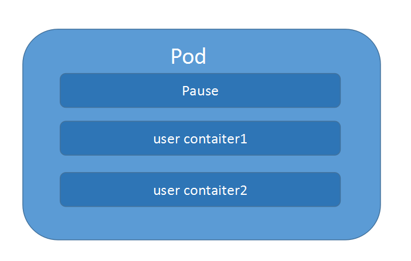

由一个叫 ”pause“ 的根容器，加上一个或多个用户自定义的容器构造。pause 的状态带便了这一组容器的状态，pod里多个业务容器共享pod的Ip和数据卷。

在 kubernetes 环境下，pod 是容器的载体，所有的容器都是在 pod 中被管理，一个或多个容器放在 pod 里作为一个单元方便管理。docker 和 kubernetes 也不是一家公司的，如果做一个编排部署的工具，为了更好的管理别人公司开发的产品，然后就把 docker 容器放在了 pod 里，在 kubernetes 的集群环境下，直接管理 pod,然后对于docker 容器的操作，封装在 pod 里，不直接操作。

#### **Pod的创建过程**

Pod 是 Kubernetes 的基础单元，了解其创建的过程，更有助于理解系统的运作。

①用户通过 kubectl 或其他 API 客户端提交 Pod Spec 给 API Server。

②API Server 尝试将 Pod 对象的相关信息存储到 etcd 中，等待写入操作完成，API Server 返回确认信息到客户端。

③API Server 开始反映 etcd 中的状态变化。

④所有的 Kubernetes 组件通过 "watch" 机制跟踪检查 API Server 上的相关信息变动。

⑤kube-scheduler（调度器）通过其 "watcher" 检测到 API Server 创建了新的 Pod 对象但是没有绑定到任何工作节点。

⑥kube-scheduler 为 Pod 对象挑选一个工作节点并将结果信息更新到 API Server。

⑦调度结果新消息由 API Server 更新到 etcd，并且 API Server 也开始反馈该 Pod 对象的调度结果。

⑧Pod 被调度到目标工作节点上的 kubelet 尝试在当前节点上调用 docker engine 进行启动容器，并将容器的状态结果返回到 API Server。

⑨API Server 将 Pod 信息存储到 etcd 系统中。

⑩在 etcd 确认写入操作完成，API Server 将确认信息发送到相关的 kubelet。

### 3、静态 pod

静态 Pod 是由 kubelet 进行管理的仅存在于特定 Node 上的 pod.它们不能通过 API Server 进行管理，无法与 ReplicationController,Deployment 或者 DaemonSet 进行关联，也无法进行健康检查。不常用，所以了解就好

### 4、pod 容器共享 volume

在pod中定义容器的时候可以为单个容器配置volume，然后也可以为一个pod中的多个容器定义一个共享的pod 级别的volume。 那为啥要这样做呢，比如你在一个pod里定义了一个web容器，然后把生成的日志文件放在了一个文件夹，你还定义了一个分析日志的容器，那这个时候你就可以把这放日志的文件配置为共享的，这样一个容器生产，一个容器调度度就可以。

下面是一个使用共享volume的配置示例

```yaml
apiVersion: v1
kind: Pod
metadata:
 name: volume-pod
spec:
  containers:
  - name: nginx1
    image: nginx
    ports:
    - containerPort: 80
    volumeMounts:
    - name: app-logs
      mountPath: /usr/share/nginx/html/
  - name: busybox
    image: busybox
    command:
    - "/bin/sh"
    - "-c"
    - "sleep 3600"
    volumeMounts:
    - name: app-logs
      mountPath: /opt
  volumes:
  - name: app-logs
    emptyDir: {}      
    
kubectl exec -it volume-pod --container busybox -- /bin/sh
# 创建 html 文件
```

这个配置文件除了 “emptyDir: {}” 这个地方有点诡异以为，其他地方估计大家一看就能明白，在最下面定义了一个叫 “app-logs” 的 volume,然后上面的两个容器来使用它就好了。

然后现在来说说 “emptyDir: {}”，其实这个地方有三种选择

```yaml
  volumes:
  - name: app-logs
    emptyDir: {}
  
  
  volumes:
  - name: app-logs
    hostPth: 
      path: "/data"
    
    
  volumes:
  - name: app-logs
    gcePersistenDisk: 
    pdName: my-data-disk  //my-data-disk需要先创建好
    fsType: ext4
```

emptyDir 是 Pod 分配到 Node 后创建的，他的初始内容为空，pod 在 Node 上移除以后也就被销毁了。

hostPath 是挂载到宿主机上的目录，比较适用于需要永久保存的数据

gcePersistenDisk 表示使用谷歌公有云提供的磁盘
创建my-data-disk： gcloud compute disks create --size=500GB --zone=us-centrall-a my-data-disk

### 5、pod 的配置管理

应用部署的一个最佳实践，就是将应用所需的配置信息与程序进行分离

kubernetes 提供了一种的集群配置管理方案,即ConfigMap，就是将一些环境变量或者配置文件定义为configmap，放在kubernetes中，可以让其他pod 调用
configmap 有以下典型的用法

1 生成为容器内的环境变量

2 设置容器启动命令的启动参数（需设置为环境变量）

3 以volume的形式挂载为容器内部的文件或目录

局限：

1ConfigMap 必须在pod之前创建

2ConfigMap也可以定于属于某个NameSpace，只有处于相同NameSpace的pod可以应用它

3ConfigMap中的配额管理还未实现

4如果是volume的形式挂载到容器内部，只能挂载到某个目录下，该目录下原有的文件会被覆盖掉

5静态pod不能用configmap(静态 pod 不受API server 管理)

下面是使用ConfigMap的示例

1、定义一个ConfigMap 配置文件 cm-appvars.yaml

```yaml
apiVersion: v1
kind: ConfigMap
metadata:
  name: cm-appvars
data:
  apploglevel: info
  appdatadir: /var/date   
```

2、创建ConfigMap

```yaml
# 创建configmap
kubectl create -f cm-appvars.yaml

# 查看configmap
kubectl describe configmap
kubectl describe configmap cm-appvars
```

3、使用ConfigMap(环境变量的形式)

```yaml
apiVersion: v1
kind: Pod
metadata:
 name: cm-test-pod
spec:
  containers:
  - name: cm-test
    image: busybox
    command: ["/bin/sh","-c","sleep 3600"]
    env:
    - name: APPLOGLEVEL
      valueFrom:
        configMapKeyRef:
          name: cm-appvars   //要和之前创建的ConfigMap的name对应
          key: apploglevel
    - name: APPDATADIR
      valueFrom:
        configMapKeyRef:
          name: cm-appvars   //要和之前创建的ConfigMap的name对应
          key: appdatadir
```

```shell
[root@k8s-node1 pod]# kubectl apply -f configmap-pod.yaml 
pod/cm-test-pod created
[root@k8s-node1 pod]# kubectl get pods
NAME          READY   STATUS    RESTARTS   AGE
busybox-pod   1/1     Running   12         27h
cm-test-pod   1/1     Running   0          11s
pod-demo      2/2     Running   8          23h
volume-pod    2/2     Running   3          3h5m
[root@k8s-node1 pod]# kubectl  exec -it cm-test-pod /bin/sh
/ # ls
bin   dev   etc   home  proc  root  sys   tmp   usr   var
/ # echo $APPLOGLEVEL
info
/ # echo $APPDATADIR
/var/date
```

除了可以定义简单的k-v键值对，还可以将整个配置文件定义成ConfigMap
比如 server.xml logging.properties（使用 volumeMount 的形式，挂载到容器内部）

1、定义一个 ConfigMap 配置文件 cm-jdbcproperties.yaml

```yaml
apiVersion: v1
kind: ConfigMap
metadata:
 name: cm-jdbcproperties
data:
  key-jdbcproperties: |
    JDBC_DRIVER_CLASS_NAME=com.mysql.jdbc.Driver
    JDBC_URL=jdbc:mysql://localhost:3306/bz_argon?useUnicode=true&characterEncoding=utf8
    JDBC_USER_NAME=root
    JDBC_PASSWORD=maojiancai
    JDBC_INITIALSIZE=10
    JDBC_MAXACTIVE=20
    JDBC_MAXIDLE=20
    JDBC_MINIDLE=10
    JDBC_MAXWAIT=60000
    JDBC_VALIDATIONQUERY=SELECT 1 FROM DUAL
    JDBC_TESTONBORROW=false
    JDBC_TESTONRETURN=false
    JDBC_TESTWHILEIDLE=true
    JDBC_TIMEBETWEENEVICTIONRUNSMILLIS=6000
    JDBC_MINEVICTABLEIDLETIMEMILLIS=25200000
    JDBC_REMOVEABANDONED=true
    JDBC_REMOVEABANDONEDTIMEOUT=1800
    JDBC_LOGABANDONED=true 
```

jdbc详解

<https://blog.csdn.net/soberchina/article/details/72953996>

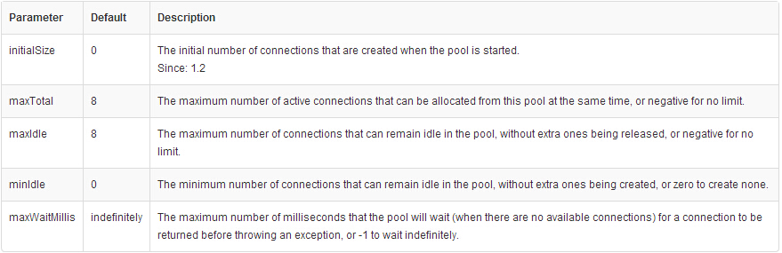

初始化连接数：默认值 0
同一时刻可分配最大连接数：默认值 8 ，设置为负数时不做限制
最大空闲连接，默认值 8 ，超出连接将被释放
最小空闲连接数，默认值 0 
请求连接最大等待时间(毫秒)，默认值 无限期 ，超出时间将抛出异常 

2、创建 ConfigMap:

```
kubectl create -f cm-jdbcproperties.yaml
```

3 使用ConfigMap(使用volumeMount的形式)

```yaml
apiVersion: v1
kind: Pod
metadata:
 name: cm-test-app
spec:
  containers:
  - name: cm-test-app
    image: nginx
    ports:
    - containerPort: 8080
    volumeMounts:
    - name: jdbcproperties      # 应用下面定义的volumes名
      mountPath: /usr/share/nginx/html
  volumes:
  - name: jdbcproperties        # volumes名
    configMap:
      name: cm-jdbcproperties   # 这个名字是第二步创建的configMap
      items:
      - key: key-jdbcproperties
        path: jdbc.properties   # 最终实际配置文件名称
```


```yaml
apiVersion: v1
kind: ConfigMap
metadata:
 name: index-configmap
data:
  index.html: |
    hello world!
    
apiVersion: v1
kind: Pod
metadata:
 name: cm-test-app
spec:
  containers:
  - name: cm-test-app
    image: nginx
    ports:
    - containerPort: 80
    volumeMounts:
    - name: index          # 应用下面定义的volumes名
      mountPath: /usr/share/nginx/html
  volumes:
  - name: index            # volumes名
    configMap:
      name: index-configmap          # 这个名字是第二步创建的configMap
      items:
      - key: index.html
        path: index.html   # 最终实际配置文件名称
```

再提醒一下;

如果是 volume 的形式挂载到容器内部，只能挂载到某个目录下，该目录下原有的文件会被覆盖掉

### 6、pod 的生命周期和重启策略

pod 有四种状态


| 状态值  | 描述                                                         |
| ------- | ------------------------------------------------------------ |
| Pending | APIserver已经创建该server,但pod内有一个或多个容器的镜像还未创建，可能在下载中。 |
| Running | Pod内所有的容器已创建，所有容器都是运行状态                  |
| Failed  | Pod内所有容器都已退出，其中至少有一个容器退出失败            |
| Unknown | apiserver 由于某种原因无法获取Pod的状态比如网络不通。        |

#### 1、Kubernetes 排错之 Pod 异常

本章介绍 Pod 运行异常的排错方法。

一般来说，无论 Pod 处于什么异常状态，都可以执行以下命令来查看 Pod 的状态

- `kubectl get pod <pod-name> -o yaml` 查看 Pod 的配置是否正确
- `kubectl describe pod <pod-name>` 查看 Pod 的事件
- `kubectl logs <pod-name> [-c <container-name>]` 查看容器日志

这些事件和日志通常都会有助于排查 Pod 发生的问题。

#### 2、Pod 一直处于 Pending 状态

Pending 说明 Pod 还没有调度到某个 Node 上面。可以通过 `kubectl describe pod <pod-name>` 命令查看到当前 Pod 的事件，进而判断为什么没有调度。可能的原因包括

- 资源不足，集群内所有的 Node 都不满足该 Pod 请求的 CPU、内存、GPU 等资源
- HostPort 已被占用，通常推荐使用 Service 对外开放服务端口

#### 3、Pod 一直处于 Waiting 或 ContainerCreating 状态

首先还是通过 `kubectl describe pod <pod-name>` 命令查看到当前 Pod 的事件。可能的原因包括

- 镜像拉取失败，比如

- - 配置了错误的镜像
  - Kubelet 无法访问镜像（国内环境访问 `gcr.io` 需要特殊处理）
  - 私有镜像的密钥配置错误
  - 镜像太大，拉取超时（可以适当调整 kubelet 的 `--image-pull-progress-deadline` 和 `--runtime-request-timeout` 选项）

 

- CNI 网络错误，一般需要检查 CNI 网络插件的配置，比如

- - 无法配置 Pod 网络
  - 无法分配 IP 地址

 

- 容器无法启动，需要检查是否打包了正确的镜像或者是否配置了正确的容器参数

#### 3、Pod 处于 ImagePullBackOff 状态

这通常是镜像名称配置错误或者私有镜像的密钥配置错误导致。这种情况可以使用 `docker pull <image>` 来验证镜像是否可以正常拉取。

如果是私有镜像，需要首先创建一个 docker-registry 类型的 Secret

```shell
kubectl create secret docker-registry my-secret --docker-server=DOCKER_REGISTRY_SERVER --docker-username=DOCKER_USER --docker-password=DOCKER_PASSWORD --docker-email=DOCKER_EMAIL
```

然后在容器中引用这个 Secret

```yaml
spec:
  containers:
  - name: private-reg-container
    image: <your-private-image>
  imagePullSecrets:
  - name: my-secret
```

#### 4、Pod 一直处于 CrashLoopBackOff 状态

CrashLoopBackOff 状态说明容器曾经启动了，但又异常退出了。此时可以先查看一下容器的日志

```text
kubectl logs <pod-name>
kubectl logs --previous <pod-name>
```

这里可以发现一些容器退出的原因，比如

- 容器进程退出
- 健康检查失败退出

此时如果还未发现线索，还可以到容器内执行命令来进一步查看退出原因

```shell
kubectl exec cassandra -- cat /var/log/cassandra/system.log
```

如果还是没有线索，那就需要 SSH 登录该 Pod 所在的 Node 上，查看 Kubelet 或者 Docker 的日志进一步排查了

```shell
# 查询 Node
kubectl get pod <pod-name> -o wide
```

#### 5、Pod 处于 Error 状态

通常处于 Error 状态说明 Pod 启动过程中发生了错误。常见的原因包括

- 依赖的 ConfigMap、Secret 或者 PV 等不存在
- 请求的资源超过了管理员设置的限制，比如超过了 LimitRange 等
- 违反集群的安全策略，比如违反了 PodSecurityPolicy 等
- 容器无权操作集群内的资源，比如开启 RBAC 后，需要为 ServiceAccount 配置角色绑定

#### 6、Pod 处于 Terminating 或 Unknown 状态

从 v1.5 开始，Kubernetes 不会因为 Node 失联而删除其上正在运行的 Pod，而是将其标记为 Terminating 或 Unknown 状态。想要删除这些状态的 Pod 有三种方法：

- 从集群中删除该 Node。使用公有云时，kube-controller-manager 会在 VM 删除后自动删除对应的 Node。而在物理机部署的集群中，需要管理员手动删除 Node（如 `kubectl delete node <node-name>`。
- Node 恢复正常。Kubelet 会重新跟 kube-apiserver 通信确认这些 Pod 的期待状态，进而再决定删除或者继续运行这些 Pod。
- 用户强制删除。用户可以执行 `kubectl delete pods <pod> --grace-period=0 --force` 强制删除 Pod。除非明确知道 Pod 的确处于停止状态（比如 Node 所在 VM 或物理机已经关机），否则不建议使用该方法。特别是 StatefulSet 管理的 Pod，强制删除容易导致脑裂或者数据丢失等问题。

#### 7、Pod 行为异常

这里所说的行为异常是指 Pod 没有按预期的行为执行，比如没有运行 podSpec 里面设置的命令行参数。这一般是 podSpec yaml 文件内容有误，可以尝试使用 `--validate` 参数重建容器，比如

```shell
kubectl delete pod mypod
kubectl create --validate -f mypod.yaml
```

也可以查看创建后的 podSpec 是否是对的，比如

```shell
kubectl get pod mypod -o yaml
```

#### 8、修改静态 Pod 的 Manifest 后未自动重建

Kubelet 使用 inotify （监控文件系统） 机制检测 `/etc/kubernetes/manifests` 目录（可通过 Kubelet 的 `--pod-manifest-path` 选项指定）中静态 Pod 的变化，并在文件发生变化后重新创建相应的 Pod。但有时也会发生修改静态 Pod 的 Manifest 后未自动创建新 Pod 的情景，此时一个简单的修复方法是重启 Kubelet。

Inotify 可用于检测单个文件，也可以检测整个目录。当检测的对象是一个目录的时候，目录本身和目录里的内容都会成为检测的对象。此种机制的出现的目的是当内核空间发生某种事件之后，可以立即通知到用户空间。方便用户做出具体的操作

#### 9、Pod 的重启策略

Pod 的重启策略应用于Pod内的所有容器，由 Pod 所在 Node 节点上的Kubelet进行判断和重启操作。重启策略有以下三种:

| 重启策略  | 描述                                |
| --------- | ----------------------------------- |
| Always    | 容器失效时，即重启                  |
| OnFailure | 容器终止运行，且退出码不为 0 时重启 |
| Never     | 不重启                              |


### 7、pod 健康检查

Kubernetes内部通过2种探针，实现了对Pod健康的检查

- LivenessProbe 探针：判断容器是否存活（running）
- ReadinessProbe 探针： 用于判断容器是否启动完成（ready）

对于livenessprobes 的结果也有几个固定的可选项值：

- Success：表示通过检测
- Failure：表示没有通过检测
- Unknown：表示检测没有正常进行

Liveness Probe的种类：

- ExecAction：在container中执行指定的命令。当其执行成功时，将其退出码设置为0；
- TCPSocketAction：执行一个TCP检查使用container的IP地址和指定的端口作为socket。如果端口处于打开状态视为成功；
- HTTPGetAcction：执行一个HTTP默认请求使用container的IP地址和指定的端口以及请求的路径作为url，用户可以通过host参数设置请求的地址，通过scheme参数设置协议类型(HTTP、HTTPS)如果其响应代码在200~400（小于400）之间，设为成功。

当前kubelet拥有两个检测器，他们分别对应不同的触发器(根据触发器的结构执行进一步的动作)：

- Liveness Probe：表示container是否处于live状态。如果 LivenessProbe失败，LivenessProbe将会通知kubelet对应的container不健康了。随后kubelet将kill掉 container，并根据 RestarPolicy 进行进一步的操作。默认情况下 LivenessProbe 在第一次检测之前初始化值为 Success，如果 container 没有提供 LivenessProbe，则也认为是 Success；
- ReadinessProbe：表示container是否以及处于可接受 service 请求的状态了。如果ReadinessProbe失败，endpoints controller 将会从 service 所匹配到的 endpoint列表中移除关于这个 container 的IP地址。因此对于 Service 匹配到的 endpoint 的维护其核心是 ReadinessProbe。默认 Readiness 的初始值是 Failure，如果一个container 没有提供 Readiness 则被认为是 Success。

对于LivenessProbe和ReadinessProbe用法都一样，拥有相同的参数和相同的监测方式。

- initialDelaySeconds：用来表示初始化延迟的时间，也就是告诉监测从多久之后开始运行，单位是秒
- timeoutSeconds: 用来表示监测的超时时间，如果超过这个时长后，则认为监测失败

当前对每一个 Container 都可以设置不同的 restartpolicy，有三种值可以设置：

- Always: 只要container退出就重新启动
- OnFailure: 当container非正常退出后重新启动
- Never: 从不进行重新启动

如果 restartpolicy 没有设置，那么默认值是 Always。如果 container 需要重启，仅仅是通过 kubelet 在当前节点进行 container 级别的重启。

最后针对 LivenessProbe 如何使用，请看下面的几种方式，如果要使用 ReadinessProbe 只需要将 livenessProbe 修改为 readinessProbe 即可：

LivenessProbe探针通过三种方式来检查容器是否健康

（1）ExecAction:在容器内部执行一个命令，如果返回码为0，则表示健康

示例：

```yaml
apiVersion: v1
kind: Pod
metadata:
  name: liveness
spec:
  containers:
  - name: liveness
    image: busybox
    args: 
    - "/bin/sh"
    - "-c"
    - "echo ok > /tmp/healthy; sleep 10; rm -rf /tmp/healthy; sleep 3600"
    livenessProbe:
      exec:
        command:
        - cat
        - /tmp/healthy
      initialDelaySeconds: 5   # 用来表示初始化延迟的时间，也就是告诉监测从多久之后开始运行，单位是秒
      timeoutSeconds: 1     # 用来表示监测的超时时间，如果超过这个时长后，则认为监测失败
# 查看pod重启情况
kubectl get pods -w
```

（2）TcpAction:通过IP 和port ,如果能够和容器建立连接则表示容器健康

示例：

```yaml
apiVersion: v1
kind: Pod
metadata:
  name: pod-with-healthcheck
spec:
  containers:
  - name: nginx
    image: nginx
    ports:
    - containerPort: 80
    livenessProbe:
      tcpSocket:
        port: 80
      initialDelaySeconds: 5
      timeoutSeconds: 1   
# 查看pod重启情况
kubectl get pods -w
==============================================================================================

apiVersion: v1
kind: Pod
metadata:
 name: pod-with-healthcheck
spec:
  containers:
  - name: nginx
    image: nginx
    ports:
    - containerPort: 80
    livenessProbe:
      tcpSocket:
        port: 8080
      initialDelaySeconds: 5
      timeoutSeconds: 1   

# 查看pod重启情况
kubectl get pods -w
```

（3）HttpGetAction:发送一个http Get请求（ip+port+请求路径）如果返回状态吗在200-400之间则表示健康

示例：

```yaml
apiVersion: v1
kind: Pod
metadata:
 name: pod-with-healthcheck
spec:
  containers:
  - name: nginx
    image: nginx
    ports:
    - containerPort: 80
    livenessProbe:
      httpGet:
        path: /_status/healthz  //请求路径
        port: 80
      initialDelaySeconds: 5
      timeoutSeconds: 1   
```

### 8、pod 调度

在kubernetes系统中，pod在大部分场景下都只是容器的载体而已，通常需要通过Deployment,DaemonSet,Job等对象来完成Pod的调度与自动控制功能。

#### （1）RC,Deployment: 全自动调度

RC 的主要功能之一就是自动部署一个容器应用的多份副本，以及持续监控，保持集群内有一定数量的副本数量（配置文件指定了副本数量）

NodeSelector:  定向调度

kubernetes 中的 Schduler 负责实现 pode 的调度，他会根据一些复杂的算法，把 pod 调度到某一个 Node 上，如果你想指定某个Pod需要指定在某个Node上则可以通过NodeSelector 定向调度

示例：

1首先通过 kubectl 给 node 打上标签：

```shell
格式： 
kubectl label nodes <node-name> <label-key>=<label-value>
kubectl label nodes node1 zone=north
kubectl get nodes --show-labels
```

2在pod定义里选择某个node

```yaml
apiVersion: v1
kind: Pod
metadata:
  name: pod-with-healthcheck
spec:
  containers:
  - name: nginx
    image: nginx
    ports:
    - containerPort: 80
  nodeSelector:
    zone: north 
```

除了有定向的，还有亲和性的调度 NodeAffinity，符合某种条件的，比如，某个值大于1的（可以理解为模糊匹配）,NodeAffinity有In NotIn Exists DoesNotExists Gt Lt 等操作规则来选择Node.

- In: label的值在某个列表中
- NotIn：label的值不在某个列表中
- Exists：某个label存在
- DoesNotExist：某个label不存在
- Gt：label的值大于某个值（字符串比较）
- Lt：label的值小于某个值（字符串比较）

```yaml
apiVersion: v1
kind: Pod
metadata:
  name: nginx-affinity
spec:
  containers:
  - name: nginx-affinity
    image: nginx
  affinity:
    nodeAffinity:
      requiredDuringSchedulingIgnoredDuringExecution:      # 精确匹配
        nodeSelectorTerms:
        - matchExpressions:
          - key: zone
            operator: In
            values:
            - north
            - test
      preferredDuringSchedulingIgnoredDuringExecution:     # 模糊匹配
      - weight: 1               //取值范围1-100
        preference:
          matchExpressions:
          - key: another-node-label-key
            operator: In
            values:
            - another-node-label-value   

apiVersion: v1
kind: Pod
metadata:
  name: nginx-affinity
spec:
  containers:
  - name: nginx-affinity
    image: nginx
  affinity:
    nodeAffinity:
      preferredDuringSchedulingIgnoredDuringExecution:
      - weight: 90
        preference:
          matchExpressions:
          - key: disktype
            operator: In
            values:
            - ssd
      preferredDuringSchedulingIgnoredDuringExecution:
      - weight: 100
        preference:
          matchExpressions:
          - key: zone
            operator: In
            values:
            - north

#获取帮助
kubectl explain pods.spec.affinity.nodeAffinity
```

Kubernetes中的亲和性 <https://blog.csdn.net/jettery/article/details/79003562>

#### （2）Deployment 和 DaemonSet

•controllers：在集群上管理和运行容器的对象
•通过label-selector相关联
•Pod通过控制器实现应用的运维，如伸缩，升级等

控制器又称工作负载是用于实现管理pod的中间层，确保pod资源符合预期的状态，pod的资源出现故障时，会尝试 进行重启，当根据重启策略无效，则会重新新建pod的资源。


##### 控制器有多种类型：

Deployment：工作在ReplicaSet之上，用于管理无状态应用，目前来说最好的控制器。支持滚动更新和回滚功能，还提供声明式配置。
DaemonSet：用于确保集群中的每一个节点只运行特定的pod副本，通常用于实现系统级后台任务。比如ELK服务
Job：只要完成就立即退出，不需要重启或重建。
Cronjob：周期性任务控制，不需要持续后台运行，
StatefulSet：管理有状态应用

ReplicaSet: 代用户创建指定数量的pod副本数量，确保pod副本数量符合预期状态，并且支持滚动式自动扩容和缩容功能。

Deployment

Deployment为Pod和Replica Set（下一代Replication Controller）提供声明式更新。

只需要在 Deployment 中描述想要的目标状态是什么，Deployment controller 就会帮您将 Pod 和 ReplicaSet 的实际状态改变到您的目标状态。也可以定义一个全新的 Deployment 来创建 ReplicaSet 或者删除已有的 Deployment 并创建一个新的来替换。

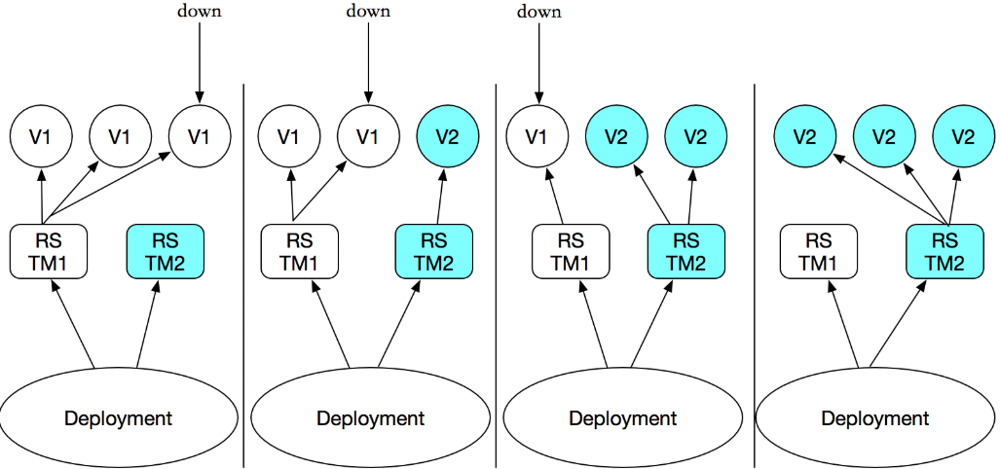

典型的用例如下：

```
（1）使用Deployment来创建ReplicaSet。ReplicaSet在后台创建pod。检查启动状态，看它是成功还是失败。
（2）然后，通过更新Deployment的PodTemplateSpec字段来声明Pod的新状态。这会创建一个新的ReplicaSet，Deployment会按照控制的速率将pod从旧的ReplicaSet移动到新的ReplicaSet中
（3）如果当前状态不稳定，回滚到之前的Deployment revision。每次回滚都会更新 Deployment 的revision。
（4）扩容 Deployment 以满足更高的负载。
（5）暂停 Deployment 来应用 PodTemplateSpec的多个修复，然后恢复上线。
（6）根据 Deployment 的状态判断上线是否 hang 住了。
（7）清除旧的不必要的 ReplicaSet。
```

创建deployment

```yaml
[root@k8s-master1 demo]# vim deploy-demo.yaml 
apiVersion: apps/v1
kind: Deployment
metadata:
  name: nginx-deployment
  namespace: default
spec:
  replicas: 3
  selector:
    matchLabels:
      app: nginx
  template:
    metadata:
      labels:
        app: nginx
    spec:
      containers:
      - name: nginx
        image: nginx:1.14
        ports:
        - containerPort: 80

[root@k8s-master1 demo]# kubectl create -f deploy-demo.yaml 
deployment.apps/nginx-deployment created
```

查看Deployment已经创建了3个 replica ，刚创建的Replica Set将保证总是有3个副本的 pod 存在

```shell
[root@k8s-master1 demo]# kubectl get deploy,rs,pod -o wide
NAME                                     READY   UP-TO-DATE   AVAILABLE   AGE   CONTAINERS   IMAGES       SELECTOR
deployment.extensions/nginx-deployment   3/3     3            3           8s    nginx        nginx:1.14   app=nginx

NAME                                                DESIRED   CURRENT   READY   AGE   CONTAINERS   IMAGES       SELECTOR
replicaset.extensions/nginx-deployment-75465b4f74   3         3         3       8s    nginx        nginx:1.14   app=nginx,pod-template-hash=75465b4f74

NAME                                    READY   STATUS    RESTARTS   AGE   IP            NODE            NOMINATED NODE   READINESS GATES
pod/nginx-deployment-75465b4f74-7qsh7   1/1     Running   0          8s    172.17.73.3   192.168.0.126   <none>           <none>
pod/nginx-deployment-75465b4f74-9p9kl   1/1     Running   0          8s    172.17.73.4   192.168.0.126   <none>           <none>
pod/nginx-deployment-75465b4f74-r9snc   1/1     Running   0          8s    172.17.32.2   192.168.0.125   <none>           <none>
```

 ReplicaSet 的名字总是`<Deployment的名字>-<pod template的hash值>`。

```shell
[root@k8s-master1 demo]# kubectl get pods --show-labels
NAME                                READY   STATUS    RESTARTS   AGE   LABELS
nginx-deployment-75465b4f74-7qsh7   1/1     Running   0          70s   app=nginx,pod-template-hash=75465b4f74
nginx-deployment-75465b4f74-9p9kl   1/1     Running   0          70s   app=nginx,pod-template-hash=75465b4f74
nginx-deployment-75465b4f74-r9snc   1/1     Running   0          70s   app=nginx,pod-template-hash=75465b4f74
```

#### （3）DaemonSet: 特点场景调度

DaemonSet,用于管理在集群中每个Node上只运行一份Pod的副本实例，比如在每节点上都运行有且只有一个fluentd

使用 DaemonSet 的一些典型用法：

- 运行集群存储 daemon，例如在每个 Node 上运行 ，应用场景：Agent。
- 在每个 Node 上运行日志收集 daemon，例如`fluentd`、`logstash`。  EFK
- 在每个 Node 上运行监控 daemon，例如 [Prometheus Node Exporter](https://github.com/prometheus/node_exporter)、`collectd`、Datadog 代理、New Relic 代理，或 Ganglia `gmond`。

示例：配置使得在每个节点上都有一个fluentd 容器

```yaml
apiVersion: extensions/v1beta1
kind: DaemonSet
metadata:
  name: fluentd-cloud-logging
  namespace: kube-system
  labels:
    k8s-app: fluentd-cloud-logging
spec:
  template:
    metadata:
      namespace: kube-system
      labels:
        k8s-app: fluentd-cloud-logging
    spec:
      containers:
      - name: fluentd-cloud-logging
        image: fluent/fluentd 
        resources:
          limits:
            cpu: 100m
            memory: 200Mi
        env:
        - name: FLUENTD_ARGS
          value: -q
        volumeMounts:
        - name: varlog
          mountPath: /var/log
          readOnly: false
        - name: containers
          mountPath: /var/lib/docker/containers
      volumes:
      - name: containers
        hostPath:
          path: /var/lib/docker/containers
      - name: varlog
        hostPath:
          path: /var/log

# 查看
kubectl get daemonsets.apps fluentd-cloud-logging --namespace kube-system
kubectl get pods --namespace kube-system
```

##### DaemonSet示例

创建redis-filebeat的yaml文件

```yaml
[root@k8s-master1 demo]# vim ds-demo.yaml
apiVersion: apps/v1
kind: Deployment
metadata:
  name: redis
  namespace: default
spec:
  replicas: 1
  selector:
    matchLabels:
      app: redis
      role: logstor
  template:
    metadata:
      labels:
        app: redis
        role: logstor
    spec:
      containers:
      - name: redis
        image: redis:4.0-alpine
        ports:
        - name: redis
          containerPort: 6379
          
---

apiVersion: apps/v1
kind: DaemonSet
metadata:
  name: filebeat-ds
  namespace: default
spec:
  selector:
    matchLabels:
      app: filebeat
      release: stable
  template:
    metadata:
      labels: 
        app: filebeat
        release: stable
    spec:
      containers:
      - name: filebeat
        image: ikubernetes/filebeat:5.6.5-alpine
        env:
        - name: REDIS_HOST
          value: redis.default.svc.cluster.local
        - name: REDIS_LOG_LEVEL
          value: info
```

创建pod

```shell
[root@k8s-master1 demo]# kubectl apply -f ds-demo.yaml 
deployment.apps/redis created
daemonset.apps/filebeat-ds created
```

暴露端口

```shell
[root@k8s-master1 demo]# kubectl expose deployment redis --port=6379
service/redis exposed
[root@k8s-master1 demo]# kubectl get svc
NAME                 TYPE        CLUSTER-IP   EXTERNAL-IP   PORT(S)    AGE
service/kubernetes   ClusterIP   10.0.0.1     <none>        443/TCP    5d19h
service/redis        ClusterIP   10.0.0.150   <none>        6379/TCP   19s
```

查看pod  ，DaemonSet在每个node上运行一个filebeat的pod

```shell
[root@k8s-master1 demo]# kubectl get pod -o wide
NAME                     READY   STATUS    RESTARTS   AGE   IP            NODE            NOMINATED NODE   READINESS GATES
filebeat-ds-dndjq        1/1     Running   0          17m   172.17.32.3   192.168.0.125   <none>           <none>
filebeat-ds-k6d6b        1/1     Running   0          17m   172.17.73.3   192.168.0.126   <none>           <none>
redis-85b846ff9c-wlxcg   1/1     Running   0          17m   172.17.32.2   192.168.0.125   <none>           <none>
```

（3）Job 批处理调度

我们可以通过Kubernetes job资源对象来定义并启动一个批处理任务。批处理任务通常并行（或者串行）启动多个计算机进程去处理一批工作项。·

1、job 特性

1. 运行完成后退出，但是不会被删除，便于用户查看日志信息，了解任务完成的情况
2. 删除job时,产生的pod也会被一起删除
3. job中可以运行多个pod（任务执行多次），且可以并行运行缩短任务完成的时间
4. 限制 job 中的pod的完成时间，即设置超时时间
5. 可以设置类似定时计划任务的 job，定期执行 

2、Job Spec格式

1. spec.template格式同Pod
2. RestartPolicy 仅支持 Never 或 OnFailure 
3. 单个 Pod 时，默认Pod成功运行后Job即结束
4. `.spec.completions` 标志Job结束需要成功运行的Pod个数，默认为1
5. `.spec.parallelism` 标志并行运行的Pod的个数，默认为1
6. `spec.activeDeadlineSeconds` 标志失败 Pod 的重试最大时间，超过这个时间不会继续重试

2、job 的 yaml 文件示例

```yaml
apiVersion: batch/v1
kind: Job
metadata:
  name: pi
spec:
  template:
    metadata:
      name: pi
    spec:
      containers:
      - name: pi
        image: perl
        command: ["perl",  "-Mbignum=bpi", "-wle", "print bpi(2000)"]
      restartPolicy: Never
      
kubectl create -f ./job.yaml
job "pi" created
pods=$(kubectl get pods --selector=job-name=pi --output=jsonpath={.items..metadata.name})
kubectl logs $pods
3.141592653589793238462643383279502...

===================================================================================
apiVersion: batch/v1
kind: Job
metadata:
  name: test-job
spec:
  completions: 6      #需要运行的pod数量
  parallelism: 2      #允许并发运行的pod数量
  activeDeadlineSeconds: 360  #pod运行的超时时间 
  template:
    metadata:
      labels:
        app: test-job
    spec:
      containers:
      - name: test-job
        image: luksa/batch-job
      restartPolicy: OnFailure
```

3、cronjob 定时计划任务 

```yaml
apiVersion: batch/v1beta1
kind: CronJob
metadata:
  name: test-cronjob
spec:
  schedule: "*/1 * * * *"        #参考定时计划任务（分时日月周）
  startingDeadlineSeconds: 15    #pod必须在规定时间后的15秒内开始执行，若超过该时间未执行，则任务将不运行，且标记失败    
  jobTemplate:
    spec:
      template:
        metadata:
          labels:
            app: test-cronjob
        spec:
          containers:
          - name: test-job
            image: luksa/batch-job
          restartPolicy: OnFailure
```

#### JOB 练习 

#### 1、运行一次性容器

容器按照持续运行的时间可分为两类：

**服务类容器**

服务类容器通常持续提供服务，需要一直运行，比如 http server，daemon 等。

**工作类容器**

工作类容器则是一次性任务，比如批处理程序，完成后容器就退出。

Kubernetes 的 Deployment、ReplicaSet 和 DaemonSet 都用于管理服务类容器；对于工作类容器，我们用 Job。

先看一个简单的 Job 配置文件 myjob.yml：

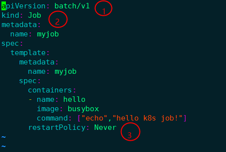

① batch/v1是当前job的Version

② 指定当前资源的类型时Job

③ restartPolicy是指当前的重启策略。对于 Job，只能设置为 **Never** 或者 **OnFailure**。对于其他 controller（比如 Deployment）可以设置为 **Always** 。

启动这个 job

```
[root@k8s-master k8s]# kubectl apply -f myjob.yml 
job.batch/myjob created
```

kubectl get job 查看这个job

```
[root@k8s-master k8s]# kubectl get job
NAME    COMPLETIONS   DURATION   AGE
myjob   1/1           23s        3m45s
```

completions为 1/1 表示成功运行了这个job

kubectl get pod 查看pod的状态

```
[root@k8s-master k8s]# kubectl get pod
NAME          READY   STATUS      RESTARTS   AGE
myjob-29qlw   0/1     Completed   0          4m5s
```

看到 状态为Completed表示这个job已经运行完成

kubectl  logs 命令查看这个 pod的日志

```
[root@k8s-master k8s]# kubectl logs myjob-29qlw
hello k8s job!
```

#### 2、Job的执行失败

​                                                                                

将配置文件中的正确命令 echo  换成一个不存在的错误命令  invalid_command

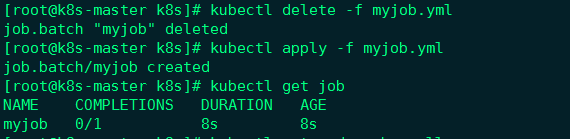

 查看job的时候发现COMPLETIONS  0/1 这个job没有完成。但是我们的重启策略是never，所以他不会重启，如果我们将策略设置为 onFaillure

​                                                                   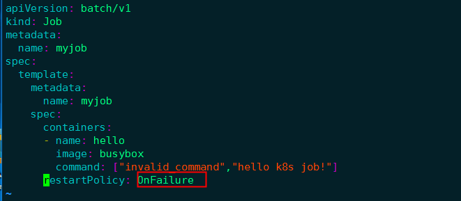

```
[root@k8s-master k8s]# kubectl delete -f myjob.yml 
job.batch "myjob" deleted
[root@k8s-master k8s]# kubectl apply -f myjob.yml 
job.batch/myjob created
```

 

通过kubectl  get pod 查看pod

发现2分钟42秒 容器重启了4次

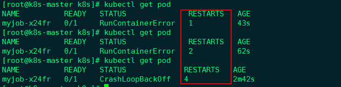

通过 kubectl  describe pod 查看pod的日志

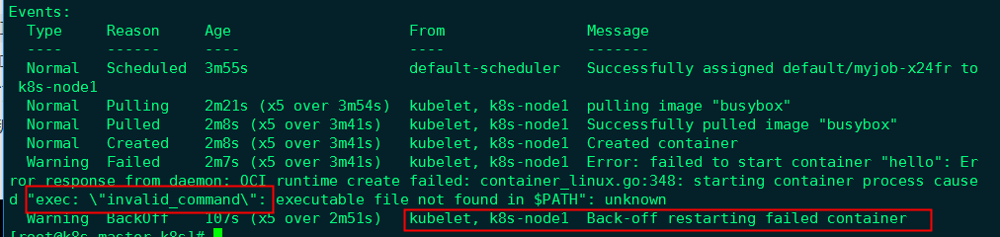

如果容器启动失败，它会自动回退并重启。

先前的版本是一个容器重启失败，他会继续开启一个新的容器，他检测completions 是否为1 如果不为1，就会一直开启新的容器，这样做非常浪费资源，而且有可能会让CPU内存等资源耗尽，新版本做了改进不会一直创建，而是一直回退重启这个失败的容器。并且重启次数达到一定次数，会自动删除这个容器不在执行这个job。我认为这是一个很睿智的改进。

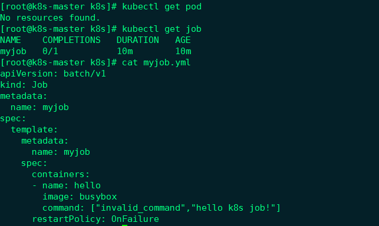

 

#### 3、并行执行job

有时，我们希望能同时运行多个 Pod，提高 Job 的执行效率。这个可以通过 `parallelism`设置。

​                                                                                    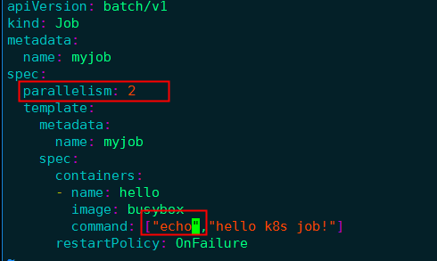

将上面的错误命令改成正确的echo

​                                                                                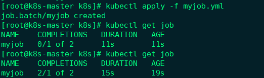

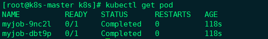

job一共启动了两个pod，而且AGE是相同，证明是并发执行完成的。

 

上面通过kubectl get job  看到 completions的缺省值为1，我们现在将它设置为6

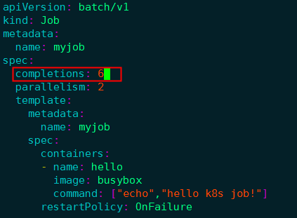

重新启动 Job 查看到 completions 变为了 6


通过查看pod 创建的时间  发现 总有个两个相近完成时间创建的pod ，验证了并发执行为2的设置

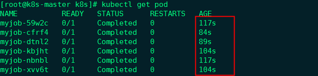

 

上面的例子只是为了演示 Job 的并行特性，实际用途不大。不过现实中确实存在很多需要并行处理的场景。比如批处理程序，每个副本（Pod）都会从任务池中读取任务并执行，副本越多，执行时间就越短，效率就越高。这种类似的场景都可以用 Job 来实现。

#### 4、定时执行 Job

 Linux 中有 cron 程序定时执行任务，Kubernetes 的 CronJob 提供了类似的功能，可以定时执行 Job。

CronJob 配置文件cronjob.yml示例如下：

```yaml
apiVersion: batch/v2alpha1
kind: CronJob
metadata:
  name: hello
spec:
  schedule: "*/1 * * * *"
  jobTemplate:
    spec:
      template:
        spec:
          containers:
          - name: hello
            image: busybox
            command: ["echo","hello k8s job!"]
          restartPolicy: OnFailure
```

​                                                                                      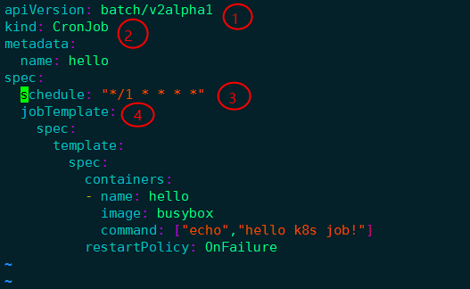

① `batch/v2alpha1` 是当前 CronJob 的 `apiVersion`。

② 指明当前资源的类型为 `CronJob`。

③ `schedule` 指定什么时候运行 Job，其格式与 Linux cron 一致。这里 `*/1 * * * *` 的含义是每一分钟启动一次。

④ `jobTemplate` 定义 Job 的模板，格式与前面 Job 一致。

 执行后报如下错误：

```shell
[root@k8s-master k8s]# kubectl apply -f cronjob.yml 
error: unable to recognize "cronjob.yml": no matches for kind "CronJob" in version "batch/v2alpha1"
```

我们只需要更改一下/etc/kubernetes/manifests/kube-apiserver.yaml，增加如下配置，重启 kubelet服务，然后重新执行这个cronJob

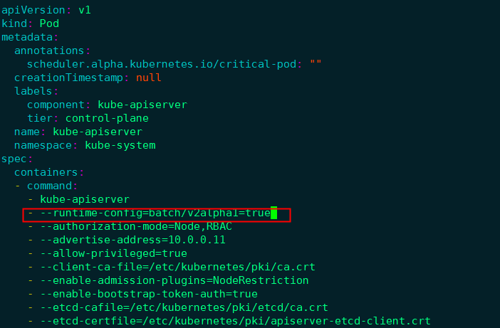

```
[root@k8s-master k8s]# systemctl restart kubelet
```

确认这个api已被加载 

​                                                                     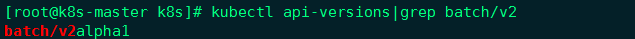

再次执行这个cronjob

```
[root@k8s-master k8s]# kubectl apply -f cronjob.yml 
cronjob.batch/hello created
```

等待几分钟，然后通过 `kubectl get jobs` 查看 Job 的执行情况：

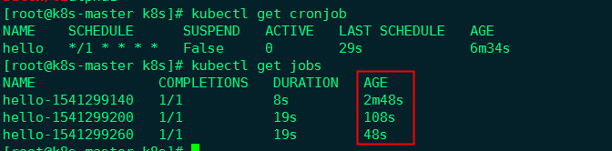

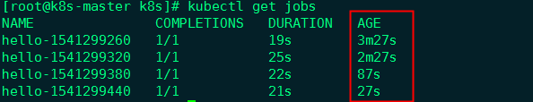


通过AGE发现 每个job都比之前的多了 60s，正好符合我们的预期

使用 kubect get pods 和 kubectl logs 命令查看

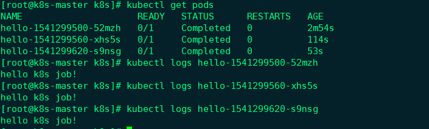

#### 5、小结

运行容器化应用是 Kubernetes 最重要的核心功能。为满足不同的业务需要，Kubernetes 提供了多种 Controller，包括 Deployment、DaemonSet、Job、CronJob 等。

### 9、pod 的扩容和缩容

#### 1、kubectl scale

扩容或缩容 Deployment、ReplicaSet、Replication Controller或 Job 中Pod数量。

scale 也可以指定多个前提条件，如：当前副本数量或 --resource-version ，进行伸缩比例设置前，系统会先验证前提条件是否成立。

#### 2、语法

```
scale [--resource-version=version] [--current-replicas=count] --replicas=COUNT (-f FILENAME | TYPE NAME)
```

#### 3、示例

将名为 foo 中的pod副本数设置为 3。

```shell
kubectl scale --replicas=3 rs/foo
```

将由“foo.yaml”配置文件中指定的资源对象和名称标识的Pod资源副本设为3。

```shell
kubectl scale --replicas=3 -f foo.yaml
```

如果当前副本数为2，则将其扩展至3。

```shell
kubectl scale --current-replicas=2 --replicas=3 deployment/mysql
```

设置多个RC中Pod副本数量。

```shell
kubectl scale --replicas=5 rc/foo rc/bar rc/baz
```

假设 redis-slave 这个pod原来定义了5个副本（reolics:5）

扩容到10个,执行命令：

```shell
kubectl scale rc redis-slave --replicas=10
```

缩容到2个，执行命令：

```shell
kubectl scale rc redis-slave --replicas=2
```

### 10、pod 滚动升级

deployment_nginx.yml

```yaml
apiVersion: apps/v1
kind: Deployment
metadata:
  name: nginx-deployment
  labels:
    app: nginx
spec:
  replicas: 3
  selector:
    matchLabels:
      app: nginx
  template:
    metadata:
      labels:
        app: nginx
    spec:
      containers:
      - name: nginx
        image: nginx:1.12.2
        ports:
        - containerPort: 80
```

- 创建deployment

```shell
kubectl create -f deployment_nginx.yml
kubectl get deployment
kubectl get rs
kubectl get pods
```

- deployment信息

> 可以看到这个deloyment下的详情，nginx是1.12.2

```shell
kubectl get deployment -o wide
```

- deployment的升级

> 针对目前的nginx1.12升级成1.13的命令，老的下面自动移除了，全部都在新的下面。

```shell
kubectl set image deployment nginx-deployment nginx=nginx:1.13  --record  # --record 将升级命令记录到历史记录里
kubectl get deployment
kubectl get deployment -o wide
kubectl get pods
```

- deployment 查看历史版本

```shell
kubectl rollout history deployment nginx-deployment
```

- deployment 回滚到之前的版本

> 又变成了nginx 1.12.2

```shell
kubectl rollout undo deployment nginx-deployment       # 回滚到上一版本
kubectl rollout undo deployment nginx-deployment --to-revision=1  # 回滚到指定版本
```

- deployment 端口暴露

```shell
kubectl get node
kubectl get node -o wide
kubectl expose deployment nginx-deployment --port=80  #指定要暴露的端口
#查看node节点暴露的端口
kubectl get svc
```

rolling update，可以使得服务近乎无缝地平滑升级，即在不停止对外服务的前提下完成应用的更新。

#### 1、replication controller 与 deployment 的区别

##### 1、replication controller

Replication Controller为Kubernetes的一个核心内容，应用托管到Kubernetes之后，需要保证应用能够持续的运行，Replication Controller就是这个保证的key，主要的功能如下：

- 确保pod数量：它会确保Kubernetes中有指定数量的Pod在运行。如果少于指定数量的pod，Replication Controller会创建新的，反之则会删除掉多余的以保证Pod数量不变。

- 确保pod健康：当pod不健康，运行出错或者无法提供服务时，Replication Controller也会杀死不健康的pod，重新创建新的。

- 弹性伸缩 ：在业务高峰或者低峰期的时候，可以通过Replication Controller动态的调整pod的数量来提高资源的利用率。同时，配置相应的监控功能（Hroizontal Pod Autoscaler），会定时自动从监控平台获取Replication Controller关联pod的整体资源使用情况，做到自动伸缩。

- 滚动升级：滚动升级为一种平滑的升级方式，通过逐步替换的策略，保证整体系统的稳定，在初始化升级的时候就可以及时发现和解决问题，避免问题不断扩大。

  ```
  HPA（Horizontal Pod Autoscaler）是Openshift中的一个非常重要的对象，它定义了系统如何根据收集对应的Pod的状态（CPU/Memory）对DeploymentConfig、ReplicationController对象进行扩容与缩容。
  
  HPA依赖于收集到的Pod资源的使用状态，所以要使HPA生效，Openshift必须安装好cluster metrics应用。
  被监控的pod必须设置好了spec.containers.resources.requests属性，HPA才能正常工作。
  仅支持CPU/Memory使用率的判断，如果自定义监控项，只能使用经验值，不能使用使用率。
  支持对象：DeploymentConfig、ReplicationController、Deployment、Replica Set
  ```

##### 2、Deployment

Deployment同样为Kubernetes的一个核心内容，主要职责同样是为了保证pod的数量和健康，90%的功能与Replication Controller完全一样，可以看做新一代的Replication Controller。但是，它又具备了Replication Controller之外的新特性：

- Replication Controller全部功能：Deployment继承了上面描述的Replication Controller全部功能。

- 事件和状态查看：可以查看Deployment的升级详细进度和状态。

- 回滚：当升级pod镜像或者相关参数的时候发现问题，可以使用回滚操作回滚到上一个稳定的版本或者指定的版本。

- 版本记录: 每一次对Deployment的操作，都能保存下来，给予后续可能的回滚使用。

- 暂停和启动：对于每一次升级，都能够随时暂停和启动。

- 多种升级方案：

  1、Recreate：删除所有已存在的pod,重新创建新的; 

  2、RollingUpdate：滚动升级，逐步替换的策略，同时滚动升级时，支持更多的附加参数，例如 设置最大不可用pod数量，最小升级间隔时间等等。

##### 3、deployment的常用命令

查看部署状态

```shell
kubectl rollout status deployment/review-demo  --namespace=scm
kubectl describe deployment/review-demo  --namespace=scm
```

或者这种写法

```
kubectl rollout status deployments review-demo --namespace=scm
kubectl describe deployments review-demo  --namespace=scm
```

#### 2、升级

滚动升级通过kubectl rolling-update 命令一键完成。

```
kubectl set image deployment/review-demo review-demo=library/review-demo:0.0.1 --namespace=scm
```

或者

```
kubectl edit deployment/review-demo --namespace=scm
```

编辑.spec.template.spec.containers[0].image的值

#### 3、终止升级

```
kubectl rollout pause nginx-deployment
```

#### 4、继续升级

```
kubectl rollout resume deployment/review-demo --namespace=scm
```

#### 5、回滚

```
kubectl rollout undo deployment/review-demo --namespace=scm
```

#### 6、查看deployments版本

```
kubectl rollout history deployments --namespace=scm
```

回滚到指定版本

```
kubectl rollout undo deployment/review-demo --to-revision=2 --namespace=scm
```

#### 7、升级历史

```
kubectl describe deployment/review-demo  --namespace=scm
Name:     review-demo
Namespace:    scm
CreationTimestamp:  Tue, 31 Jan 2017 16:42:01 +0800
Labels:     app=review-demo
Selector:   app=review-demo
Replicas:   3 updated | 3 total | 3 available | 0 unavailable
StrategyType:   RollingUpdate
MinReadySeconds:  0
RollingUpdateStrategy:  1 max unavailable, 1 max surge
OldReplicaSets:   <none>
NewReplicaSet:    review-demo-2741031620 (3/3 replicas created)
Events:
  FirstSeen LastSeen  Count From        SubobjectPath Type    Reason      Message
  --------- --------  ----- ----        ------------- --------  ------      -------
  1m    1m    1 {deployment-controller }    Normal    ScalingReplicaSet Scaled up replica set review-demo-2741031620 to 1
  1m    1m    1 {deployment-controller }    Normal    ScalingReplicaSet Scaled down replica set review-demo-1914295649 to 2
  1m    1m    1 {deployment-controller }    Normal    ScalingReplicaSet Scaled up replica set review-demo-2741031620 to 2
  1m    1m    1 {deployment-controller }    Normal    ScalingReplicaSet Scaled down replica set review-demo-1914295649 to 1
  1m    1m    1 {deployment-controller }    Normal    ScalingReplicaSet Scaled up replica set review-demo-2741031620 to 3
  1m    1m    1 {deployment-controller }    Normal    ScalingReplicaSet Scaled down replica set review-demo-1914295649 to 0
```

#### 8、deployment文件

```yaml
# 创建命名空间
kubectl create namespace scm

apiVersion: v1
kind: Namespace
metadata:
  name: scm
  labels:
    name: scm
```

```yaml
apiVersion: extensions/v1beta1
kind: Deployment
metadata:
  name: nginx-demo
  namespace: scm
  labels:
    app: nginx-demo
spec:
  replicas: 3
  #minReadySeconds: 60     #这里需要估一个比较合理的值，从容器启动到应用正常提供服务
  strategy:             # 设置最大不可用 pod 数量，最小升级间隔时间等
    rollingUpdate:      # 由于replicas 为3,则整个升级,pod 个数在2-4个之间
      maxSurge: 1       # 更新时允许最大激增的容器数，默认 replicas 的 1/4 向上取整
      maxUnavailable: 1 # 更新时允许最大 unavailable（不可用） 容器数，默认 replicas 的 1/4 向下取整
  template:
    metadata:
      labels:
        app: nginx-demo
    spec:
      terminationGracePeriodSeconds: 60  # k8s 将会给应用发送 SIGTERM（终止进程 软件终止信号）信号，可以用来正确、优雅地关闭应用,默认为30秒
      containers:
      - name: nginx-demo
        image: nginx
        imagePullPolicy: IfNotPresent
        livenessProbe: # kubernetes认为该pod是存活的,不存活则需要重启
          httpGet:
            path: /
            port: 80
            scheme: HTTP
          initialDelaySeconds: 30   # 容器启动30秒后开始第一次检测
          timeoutSeconds: 5    # http检测请求的超时时间
          successThreshold: 1  # 检测到有1次成功则认为服务是`检测通过`
          failureThreshold: 5  # 检测到有连续5次失败则认为服务是`检测失败`
        readinessProbe:        # kubernetes认为该pod是启动成功的
          httpGet:
            path: /
            port: 80
            scheme: HTTP       # 链接格式样式
          initialDelaySeconds: 60   # 等于应用程序的最小启动时间
          timeoutSeconds: 5   
          successThreshold: 1
          failureThreshold: 5
        resources:
          #keep request = limit to keep this container in guaranteed class
          requests:
            cpu: 50m
            memory: 200Mi
          limits:
            cpu: 500m
            memory: 500Mi
        env:
          - name: PROFILE
            value: "test"
        ports:
          - name: http
            containerPort: 80
```

#### 9、几个重要参数说明

##### 1、maxSurge与maxUnavailable

 maxSurge: 1 表示滚动升级时会先启动1个pod
 maxUnavailable: 1 表示滚动升级时允许的最大Unavailable的pod个数
 由于replicas为3,则整个升级,pod个数在2-4个之间

##### 2、terminationGracePeriodSeconds

k8s将会给应用发送SIGTERM信号，可以用来正确、优雅地关闭应用,默认为30秒。

如果需要更优雅地关闭，则可以使用k8s提供的pre-stop lifecycle hook 的配置声明，将会在发送SIGTERM之前执行。

##### 3、livenessProbe 与 readinessProbe

livenessProbe是kubernetes认为该pod是存活的，不存在则需要kill掉，然后再新启动一个，以达到replicas指定的个数。

readinessProbe是kubernetes认为该pod是启动成功的，这里根据每个应用的特性，自己去判断，可以执行command，也可以进行httpGet。比如对于使用java web服务的应用来说，并不是简单地说tomcat启动成功就可以对外提供服务的，还需要等待spring容器初始化，数据库连接连接上等等。对于spring boot应用，默认的actuator带有/health接口，可以用来进行启动成功的判断。

其中readinessProbe.initialDelaySeconds可以设置为系统完全启动起来所需的最少时间，livenessProbe.initialDelaySeconds可以设置为系统完全启动起来所需的最大时间+若干秒。

> 这几个参数配置好了之后，基本就可以实现近乎无缝地平滑升级了。对于使用服务发现的应用来说，readinessProbe可以去执行命令，去查看是否在服务发现里头应该注册成功了，才算成功。

示例：假设现在运行的redis-master的pod是1.0版本，现在需要升级到2.0版本。

创建redis-master-controller-v1.yaml

```yaml
apiVersion: v1
kind: ReplicationController
metadata:
 name: redis-master-v1
 labels:
  name: redis-master
  version: v1
spec:
  replicas: 1
  selector:
    name: redis-master
    version: v1
  template:
    metadata:
      labels:
        name: redis-master
        version: v1
    spec:
      containers:
      - name: master
        image: kubeguide/redis-master:1.0
        ports:
        - containerPort: 6379
```

创建redis-master-controller-v2.yaml

```yaml
apiVersion: v1
kind: ReplicationController
metadata:
 name: redis-master-v2
 labels:
  name: redis-master
  version: v2
spec:
  replicas: 1
  selector:
    name: redis-master
    version: v2
  template:
    metadata:
      labels:
        name: redis-master
        version: v2
    spec:
      containers:
      - name: master
        image: kubeguide/redis-master
        ports:
        - containerPort: 6379    
```

更新：

```shell
kubectl rolling-update redis-master-v1 -f redis-master-controller-v2.yaml
```

需要注意到是：

rc 的名字（name）不能与旧的rc的名字相同

在selector中至少有一个Label与旧的Label不同。以标识其为新的RC

网络策略说明一组 [Pod](http://docs.kubernetes.org.cn/312.html) 之间是如何被允许互相通信，以及如何与其它网络 Endpoint 进行通信。 NetworkPolicy 资源使用标签来选择 Pod，并定义了一些规则，这些规则指明允许什么流量进入到选中的 Pod 上。

###  11、pod 滚动升级二

#### 1、升级

第一次部署时使用 httpd:2.2.31，然后更新到 httpd:2.2.32。

httpd.yml

```yaml
apiVersion: apps/v1beta1
kind: Deployment
metadata:
  name: httpd
spec:
  replicas: 3
  template:
    metadata:
      labels:
        run: httpd
    spec:
      containers:
        - name: httpd
          image: httpd:2.2.31
          ports:
            - containerPort: 80  
```

启动：

```yaml
kubectl apply -f httpd.yml
```

查看：

```yaml
kubectl get deployments httpd -o wide

NAME    READY   UP-TO-DATE   AVAILABLE   AGE   CONTAINERS   IMAGES         SELECTOR
httpd   3/3     1            3           24m   httpd        httpd:2.2.31   run=httpd
```

IMAGES为 `httpd:2.2.31`。

把配置文件中的 `httpd:2.2.31` 改为 `httpd:2.2.32`，再次启动：

```
kubectl apply -f httpd.yml
```

查看：

```yaml
kubectl get deployments httpd -o wide

NAME    READY   UP-TO-DATE   AVAILABLE   AGE   CONTAINERS   IMAGES         SELECTOR
httpd   3/3     1            3           26m   httpd        httpd:2.2.32   run=httpd
```

IMAGES 变为 `httpd:2.2.32`。

查看 deployment httpd 的详细信息：

```yaml
kubectl describe deployments httpd
...
Events:
  Type    Reason             Age                From                   Message
  ----    ------             ----               ----                   -------
...
  Normal  ScalingReplicaSet  3m33s              deployment-controller  Scaled up replica set httpd-94c4dcb56 to 1
  Normal  ScalingReplicaSet  2m48s              deployment-controller  Scaled down replica set httpd-8c6c4bd9b to 2
  Normal  ScalingReplicaSet  2m48s              deployment-controller  Scaled up replica set httpd-94c4dcb56 to 2
  Normal  ScalingReplicaSet  2m43s              deployment-controller  Scaled down replica set httpd-8c6c4bd9b to 1
  Normal  ScalingReplicaSet  2m43s              deployment-controller  Scaled up replica set httpd-94c4dcb56 to 3
  Normal  ScalingReplicaSet  2m38s              deployment-controller  Scaled down replica set httpd-8c6c4bd9b to 0
```

上面的日志信息就描述了滚动升级的过程：

1. 启动一个新版 pod
2. 把旧版 pod 数量降为 2
3. 再启动一个新版，数量变为 2
4. 把旧版 pod 数量降为 1
5. 再启动一个新版，数量变为 3
6. 把旧版 pod 数量降为 0

这就是**滚动**的意思，始终保持副本数量为3，控制新旧 pod 的交替，实现了无缝升级。

#### 2、回滚

kubectl apply 每次更新应用时，kubernetes 都会记录下当前的配置，保存为一个 *revision*，这样就可以回滚到某个特定的版本。

创建3个配置文件，内容中唯一不同的就是镜像的版本号。

httpd.v1.yml

```yaml
apiVersion: apps/v1beta1
kind: Deployment
metadata:
  name: httpd
spec:
  revisionHistoryLimit: 10 # 指定保留最近的几个revision
  replicas: 3
  template:
    metadata:
      labels:
        run: httpd
    spec:
      containers:
        - name: httpd
          image: httpd:2.2.34
          ports:
            - containerPort: 80
```

httpd.v2.yml

```
...
          image: httpd:2.4.10
...
```

httpd.v3.yml

```
...
          image: httpd:2.4.11
...
```

部署:

```
kubectl apply -f /vagrant/httpd.v1.yml --record
kubectl apply -f /vagrant/httpd.v2.yml --record
kubectl apply -f /vagrant/httpd.v3.yml --record
```

`--record` 的作用是将当前命令记录到 revision 中，可以知道每个 revision 对应的是哪个配置文件。

查看 deployment:

```
kubectl get deployments -o wide
NAME                  READY   UP-TO-DATE   AVAILABLE   AGE     CONTAINERS            IMAGES       
httpd                 0/3     1            0           4m4s    httpd                 httpd:2.4.12
```

查看 revision 历史记录:

```
kubectl rollout history deployment httpd

deployment.extensions/httpd
REVISION  CHANGE-CAUSE
1         kubectl apply --filename=httpd.v1.yml --record=true
2         kubectl apply --filename=httpd.v2.yml --record=true
3         kubectl apply --filename=httpd.v3.yml --record=true
```

`CHANGE-CAUSE` 就是 `--record` 的结果。

回滚到 `revision 1`：

```
kubectl rollout undo deployment httpd --to-revision=1
```

再查看 deployment:

```
kubectl get deployments -o wide
NAME                  READY   UP-TO-DATE   AVAILABLE   AGE     CONTAINERS            IMAGES       
httpd                 0/3     1            0           4m4s    httpd                 httpd:2.2.34
```

版本已经回退了。

查看 revision 历史记录:

```yaml
kubectl rollout history deployment httpd

deployment.extensions/httpd
REVISION  CHANGE-CAUSE
2         kubectl apply --filename=httpd.v2.yml --record=true
3         kubectl apply --filename=httpd.v3.yml --record=true
4         kubectl apply --filename=httpd.v1.yml --record=true
```

revision 记录也发生了变化。

### 12、Pod StatefulSet

#### 1、什么是 StatefulSet

StatefulSet 是Kubernetes中的一种控制器，他解决的什么问题呢？我们知道Deployment是对应用做了一个简化设置，Deployment认为一个应用的所有的pod都是一样的，他们之间没有顺序，也无所谓在那台宿主机上。需要扩容的时候就可以通过pod模板加入一个，需要缩容的时候就可以任意杀掉一个。但是实际的场景中，并不是所有的应用都能做到没有顺序等这种状态，尤其是分布式应用，他们各个实例之间往往会有对应的关系，例如：主从、主备。还有数据存储类应用,它的多个实例，往往会在本地磁盘存一份数据，而这些实例一旦被杀掉，即使从建起来，实例与数据之间关系也会丢失，而这些实例有不对等的关系，实例与外部存储有依赖的关系的应用，被称作“有状态应用”。StatefulSet与Deployment相比，相同于他们管理相同容器规范的Pod，不同的时候，StatefulSet为pod创建一个持久的标识符，他可以在任何编排的时候得到相同的标识符。

#### 2、StatefulSet的应用特点

- 稳定且有唯一的网络标识符 当节点挂掉，既pod重新调度后其PodName和HostName不变，基于Headless Service来实现
- 稳定且持久的存储  当节点挂掉，既pod重新调度能访问到相同的持久化存储，基于PVC实现
- 有序、平滑的扩展、部署 即Pod是有顺序的，在部署或者扩展的时候要依据定义的顺序依次进行（即从0到N-1，在下一个Pod运行之前所有之前的Pod必须都是Running和Ready状态），基于init containers来实现。
- 有序、平滑的收缩、删除 既Pod是有顺序的，在收缩或者删除的时候要依据定义的顺序依次进行（既从N-1到0，既倒序）。lnmp  m p n    n p m

我们可以把这些抽象成两种应用状态:

- **拓扑状态。**是应用多个实例之间的不完全对等的关系，这些应用实例是必须按照定义的顺序启动的（按照依赖关系启动）。例如主应用A先于从应用B启动，如果把A和B删掉，应用还要按照先启动主应用A再启动从应用B，且创建的应用必须和原来的应用的网络标识一样（既PodName和HostName）。这样他们就可以按照原来的顺序创建了。     a 包   b包  c包   d 包

- 之间不是完全对等的关系

  极客时间版权所有: https://time.geekbang.org/column/article/41017

  存储状态。

  应用实例分别绑定了不同的数据存储，Pod A第一次读到的数据要和10分钟后读到的数据，是同一份。哪怕这期间Pod A被重建。这种典型的例子就是数据库应用的多个存储实例。

所以 StatefulSet的核心功能就是，通过某种方式记录应用状态，在Pod被重建的时候，通过这种方式还可以恢复原来的状态。

从上面的应用场景可以发现，StatefulSet 由以下几个部分组成：

- Headless Service 用于定义网络标识（DNS）
- volumeClaimTemplates  用于创建PV
- StatefulSet  用于定义具体应用

#### 3、讲解 Headless Service

我们知道kubernetes中的service是定义pod暴露外部访问的一种机制，例如：3个pod，我们可以定义一个service通过标签选择器选到这三个pod，然后让问这个service就可以访问这个pod。可以出门左转，看一下 [Service的讲解](https://www.cnblogs.com/xzkzzz/p/9559362.html)。 我们这里具体讲一下Headless service。

Headless service是Service通过DNS访问的其中一种方式，只要我们访问"mypod.stsname.namespace.svc.cluster.local"，我们就会访问到stsname下的mypod。而Service DNS的方式下有两种处理方法：

- Normal Service 这里访问"mypod.stsname.namespace.svc.cluster.local"的时候会得到mypod的service的IP，既VIP。
- Headless Service 这里访问"mypod.stsname.namespace.svc.cluster.local"的时候会得到mypod的IP，这里我们可以看到区别是，Headless Service 不需要分配一个VIP，而是通过DNS访问的方式可以解析出带代理的Pod的IP

Headleaa Service的定义方式：

```yaml
apiVersion: v1
kind: Service
metadata:
  name: myapp-headless
  namespace: default
spec:
  selector:
    app: myapp
    release: dev
  clusterIP: "None"
  ports:
  - port: 80
    targetPort: 80
```

Headless Service也是一个标准的Service的YAML文件，只不过clusterIP定义为None，既，这个service没有VIP作为"头"。以DNS记录的方式记录所有暴露它代理的Pod。而它代理的Pod依然会采用标签选择器的机制选择。既：所有携带了 app=myapp 标签的pod。都会被service代理起来。

DNS格式：

```
pod-name.svc-name.namespace.svc.cluster.local
```

#### 4、 StatefulSet详解

kubectl explain sts.spec 主要字段解释：

- replicas   副本数
- selector  那个pod是由自己管理的
- serviceName  必须关联到一个无头服务商 
- template 定义pod模板（其中定义关联那个存储卷）
- volumeClaimTemplates  生成PVC

###### 1、搭建NFS服务器

作为测试，临时在master节点上部署NFS服务器。

```bash
#master节点安装nfs
yum -y install nfs-utils

#创建nfs目录
mkdir -p /nfs/data/

#修改权限
chmod -R 777 /nfs/data

#编辑export文件,这个文件就是nfs默认的配置文件
vim /etc/exports
/nfs/data *(rw,no_root_squash,sync)

#配置生效
exportfs -r
#查看生效
exportfs

#启动rpcbind、nfs服务
systemctl restart rpcbind && systemctl enable rpcbind
systemctl restart nfs && systemctl enable nfs

#查看 RPC 服务的注册状况
rpcinfo -p localhost

#showmount测试
showmount -e 192.168.152.192
```

所有node节点安装客户端，开机启动

```bash
yum -y install nfs-utils
systemctl start nfs && systemctl enable nfs
```

作为准备工作，我们已经在 k8s-master节点上搭建了一个 NFS 服务器，目录为 /nfs/data

###### 2、安装 NFS 插件

GitHub地址：https://github.com/kubernetes-incubator/external-storage/tree/master/nfs/deploy/kubernetes


1、创建RBAC授权

```yaml
[root@master storage-class]# cat rbac.yaml
apiVersion: v1
kind: ServiceAccount
metadata:
  name: nfs-client-provisioner
 
---
 
kind: ClusterRole
apiVersion: rbac.authorization.k8s.io/v1beta1
metadata:
  name: nfs-client-provisioner-runner
rules:
  - apiGroups: [""]
    resources: ["persistentvolumes"]
    verbs: ["get", "list", "watch", "create", "delete"]
  - apiGroups: [""]
    resources: ["persistentvolumeclaims"]
    verbs: ["get", "list", "watch", "update"]
  - apiGroups: ["storage.k8s.io"]
    resources: ["storageclasses"]
    verbs: ["get", "list", "watch"]
  - apiGroups: [""]
    resources: ["events"]
    verbs: ["list", "watch", "create", "update", "patch"]
 
---
 
kind: ClusterRoleBinding
apiVersion: rbac.authorization.k8s.io/v1beta1
metadata:
  name: run-nfs-client-provisioner
subjects:
  - kind: ServiceAccount
    name: nfs-client-provisioner
    namespace: default
roleRef:
  kind: ClusterRole
  name: nfs-client-provisioner-runner
  apiGroup: rbac.authorization.k8s.io
```

 2、创建Storageclass类

```yaml
[root@master storage-class]# cat storageclass-nfs.yaml
apiVersion: storage.k8s.io/v1beta1
kind: StorageClass
metadata:
  name: managed-nfs-storage
provisioner: fuseim.pri/ifs
```

 3、创建nfs的deployment，修改相应的nfs服务器ip及挂载路径即可。

```yaml
[root@master storage-class]# cat deployment-nfs.yaml
apiVersion: apps/v1beta1
kind: Deployment
metadata:
  name: nfs-client-provisioner
spec:
  replicas: 1
  strategy:
    type: Recreate
  template:
    metadata:
      labels:
        app: nfs-client-provisioner
    spec:
      imagePullSecrets:
        - name: registry-pull-secret
      serviceAccount: nfs-client-provisioner
      containers:
        - name: nfs-client-provisioner
          image: lizhenliang/nfs-client-provisioner:v2.0.0
          volumeMounts:
            - name: nfs-client-root
              mountPath: /persistentvolumes
          env:
            - name: PROVISIONER_NAME
              value: fuseim.pri/ifs
            - name: NFS_SERVER
              value: 172.31.182.145
            - name: NFS_PATH
              value: /u01/nps/volumes
      volumes:
        - name: nfs-client-root
          nfs:
            server: 172.31.182.145
            path: /u01/nps/volumes
```


###### 3、创建一个PV动态供给应用实例

下面是一个StatefulSet应用动态申请PV的示意图：


 

 例如：创建一个nginx动态获取PV

```yaml
[root@master storage-class]# cat nginx-demo.yaml
apiVersion: v1
kind: Service
metadata:
  name: nginx
  labels:
    app: nginx
spec:
  ports:
  - port: 80
    name: web
  clusterIP: None
  selector:
    app: nginx
---
apiVersion: apps/v1
kind: StatefulSet
metadata:
  name: web
spec:
  selector:
    matchLabels:
      app: nginx
  serviceName: "nginx"
  replicas: 3
  template:
    metadata:
      labels:
        app: nginx
    spec:
      terminationGracePeriodSeconds: 10
      containers:
      - name: nginx
        image: nginx
        ports:
        - containerPort: 80
          name: web
        volumeMounts:
        - name: www
          mountPath: /usr/share/nginx/html
  volumeClaimTemplates:
  - metadata:
      name: www
    spec:
      accessModes: [ "ReadWriteOnce" ]
      storageClassName: "managed-nfs-storage"
      resources:
        requests:
          storage: 1Gi
```

 启动后我们可以看到以下信息：


这时我们在nfs服务器上也会看到自动生成3个挂载目录，当pod删除了数据还会存在。


StatefulSet应用有以下特点：

1.唯一的网络标识

2.域名访问(<statefulsetName-index>.<service-name>.svc.cluster.local) 如：web-0.nginx.default.svc.cluster.local

3.独立的持久存储

4.有序的部署和删除

##### 1、部署一个 statefulset 服务

这里我们用的storageClass，PV和PVC会动态创建。这个跑成功必须创建一个rook服务的动态存储，创建方法参考 [rook官网](https://rook.io/)。

```yaml
apiVersion: v1
kind: Service
metadata:
  name: myapp-sts
  labels:
    app: myapp-sts
spec:
  ports:
  - port: 80
    name: web
  clusterIP: "None"
  selector:
    app: myapp-pod
---
kind: Deployment
apiVersion: extensions/v1beta1
metadata:
  name: nfs-client-provisioner
  namespace: bolingcavalry
spec:
  replicas: 1
  strategy:
    type: Recreate
  template:
    metadata:
      labels:
        app: nfs-client-provisioner
    spec:
      containers:
        - name: nfs-client-provisioner
          image: registry.cn-hangzhou.aliyuncs.com/open-ali/nfs-client-provisioner
          volumeMounts:
            - name: nfs-client-root
              mountPath: /persistentvolumes
          env:
            - name: PROVISIONER_NAME
              value: fuseim.pri/ifs
            - name: NFS_SERVER
              value: 192.168.152.193
            - name: NFS_PATH
              value: /data
      volumes:
        - name: nfs-client-root
          nfs:
            server: 192.168.192.193
            path: /data
---
apiVersion: storage.k8s.io/v1beta1
kind: StorageClass
metadata:
  name: managed-nfs-storage
provisioner: fuseim.pri/ifs
---
apiVersion: apps/v1
kind: StatefulSet
metadata:
  name: myapp
spec:
  serviceName: myapp-sts-svc
  replicas: 2
  selector:
    matchLabels:
      app: myapp-pod
  template:
    metadata:
      labels:
        app: myapp-pod
    spec:
      containers:
      - name: myapp
        image: ikubernetes/myapp:v1
        ports:
        - containerPort: 80
          name: web
        volumeMounts:
        - name: myappdata
          mountPath: /usr/share/nginx/html
  volumeClaimTemplates:
  - metadata:
      name: myappdata
    spec:
      accessModes: ["ReadWriteOnce"]
      storageClassName: "rook-ceph-block"
      resources:
        requests:
          storage: 5Gi
```

查看一下服务

```shell
$ kubectl get svc
NAME         TYPE        CLUSTER-IP     EXTERNAL-IP   PORT(S)   AGE
myapp-sts    ClusterIP   None           <none>        80/TCP    5m
```

 查看pv/pvc

```shell
$ kubectl get pvc
NAME                STATUS    VOLUME                                     CAPACITY   ACCESS MODES   STORAGECLASS      AGE
myappdata-myapp-0   Bound     pvc-550493cf-dc1f-11e8-b8c9-005056930126   5Gi        RWO            rook-ceph-block   43m
myappdata-myapp-1   Bound     pvc-5a4276b4-dc1f-11e8-b8c9-005056930126   5Gi        RWO            rook-ceph-block   43m
$  kubectl get pv
NAME                                       CAPACITY   ACCESS MODES   RECLAIM POLICY   STATUS    CLAIM                       STORAGECLASS      REASON    AGE
pvc-550493cf-dc1f-11e8-b8c9-005056930126   5Gi        RWO            Delete           Bound     default/myappdata-myapp-0   rook-ceph-block             43m
pvc-5a4276b4-dc1f-11e8-b8c9-005056930126   5Gi        RWO            Delete           Bound     default/myappdata-myapp-1   rook-ceph-block             43m
```

 查看pod

```shell
$ kubectl get pod
NAME                          READY     STATUS    RESTARTS   AGE
myapp-0                       1/1       Running   0          17h
myapp-1                       1/1       Running   0          17h
```

##### 2、验证解析

```shell
$ kubectl exec -it myapp-1 -- /bin/sh 
/ # nslookup  myapp-1.myapp-sts-svc.default.svc.cluster.local
nslookup: can't resolve '(null)': Name does not resolve

Name:      myapp-1.myapp-sts-svc.default.svc.cluster.local
Address 1: 10.244.3.37 myapp-1.myapp-sts-svc.default.svc.cluster.local
```

##### 3、扩容（扩展应该是按顺序扩展）

```shell
$ kubectl scale sts myapp --replicas=5

$ kubectl get pod -w 
NAME                          READY     STATUS    RESTARTS   AGE
myapp-0                       1/1       Running   0          18h
myapp-1                       1/1       Running   0          18h
myapp-2   0/1       Pending   0         0s
myapp-2   0/1       Pending   0         0s
myapp-2   0/1       Pending   0         0s
myapp-2   0/1       ContainerCreating   0         0s
myapp-2   1/1       Running   0         15s
myapp-3   0/1       Pending   0         0s
myapp-3   0/1       Pending   0         1s
myapp-3   0/1       Pending   0         1s
myapp-3   0/1       ContainerCreating   0         1s
$ kubectl get pvc
NAME                STATUS    VOLUME                                     CAPACITY   ACCESS MODES   STORAGECLASS      AGE
myappdata-myapp-0   Bound     pvc-550493cf-dc1f-11e8-b8c9-005056930126   5Gi        RWO            rook-ceph-block   18h
myappdata-myapp-1   Bound     pvc-5a4276b4-dc1f-11e8-b8c9-005056930126   5Gi        RWO            rook-ceph-block   18h
myappdata-myapp-2   Bound     pvc-25e46dbd-dcba-11e8-b8c9-005056930126   5Gi        RWO            rook-ceph-block   2m
myappdata-myapp-3   Bound     pvc-2f420e8c-dcba-11e8-b8c9-005056930126   5Gi        RWO            rook-ceph-block   1m
myappdata-myapp-4   Bound     pvc-4607d3c8-dcba-11e8-b8c9-005056930126   5Gi        RWO            rook-ceph-block   1m
```

##### 4、缩容 （按倒序缩容）

```shell
$ kubectl scale sts myapp --replicas=3

$  kubectl get pod -w 
NAME                          READY     STATUS    RESTARTS   AGE
myapp-0                       1/1       Running   0          18h
myapp-1                       1/1       Running   0          18h
myapp-2                       1/1       Running   0          3m
myapp-3                       1/1       Running   0          3m
myapp-4                       1/1       Running   0          2m
myapp-4   1/1       Terminating   0         2m
myapp-4   0/1       Terminating   0         2m
myapp-4   0/1       Terminating   0         2m
myapp-4   0/1       Terminating   0         2m
myapp-3   1/1       Terminating   0         3m
myapp-3   0/1       Terminating   0         3m
myapp-3   0/1       Terminating   0         3m
myapp-3   0/1       Terminating   0         3m
```

##### 5、升级

查看升级策略

kubectl explain sts.spec.updateStrategy

- rollingUpdate  滚动更新

kubectl explain sts.spec.updateStrategy.rollingUpdate

- partition  分区更新，默认partition的值是0，当partition等N，N+的都会更新。

默认partition是从0开始更新

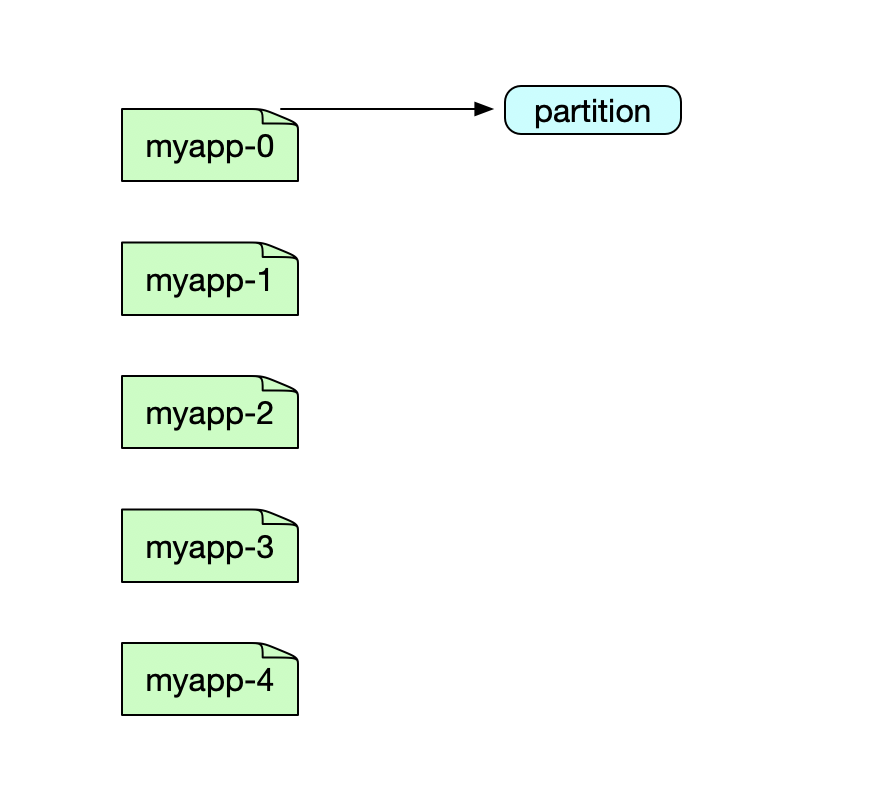


 当partition等于4的时候，4以后的都要更新。

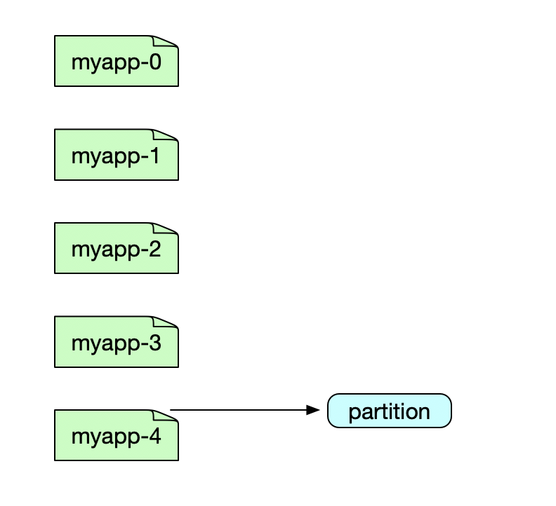

```shell
$ kubectl set image sts/myapp myapp=ikubernetes/myapp:v2
$ kubectl describe pod  myapp-2  
Name:               myapp-2
Namespace:          default
Priority:           0
PriorityClassName:  <none>
Node:               k8s-node01/172.16.138.41
Start Time:         Thu, 01 Nov 2018 02:33:00 -0400
Labels:             app=myapp-pod
                    controller-revision-hash=myapp-5775ff7474
                    statefulset.kubernetes.io/pod-name=myapp-2
Annotations:        <none>
Status:             Running
IP:                 10.244.1.13
Controlled By:      StatefulSet/myapp
Containers:
  myapp:
    Container ID:   docker://75d5e6b3958f053908eb3e5fa1c2846ce91d90c9ff696f27e6220a66d2e8cc7c
    Image:          ikubernetes/myapp:v2
    Image ID:       docker-pullable://ikubernetes/myapp@sha256:85a2b81a62f09a414ea33b74fb8aa686ed9b168294b26b4c819df0be0712d358
    Port:           80/TCP
    Host Port:      0/TCP
.....
```

### 13、pod 权限管理 RBAC

K8s 在 1.3 版本中发布了`alpha`版的基于角色的访问控制 `RBAC （Role-based Access Control）`的授权模式。相对于基于属性的访问控制 `ABAC（Attribute-based Access Control）`，RBAC主要是引入了`角色（Role）`和`角色绑定（RoleBinding）`的抽象概念。在ABAC中，K8s集群中的访问策略只能跟用户直接关联；而在RBAC中，访问策略可以跟某个角色关联，具体的用户在跟一个或多个角色相关联。

RBAC 引入了 4 个新的顶级资源对象 :`Role`、`ClusterRole`、`RoleBinding`和 `ClusterRoleBinding`。 同其他 API 资源对象 一样，用户可以使用 kubectl 或者 API 调用等方式操作这些资源对象。


新的 RBAC 具有如下优势。

- 对集群中的资源和非资源权限均有完整的覆盖。
- 整个`RBAC`完全由 几个`API`对象完成，同其他`API`对象一样 ，可以用`kubectl`或`API`进行操作。
- 可以在运行时进行调整，无须重新启动 API Server。
- 要使用 RBAC 授权模式 ，则 需要在 API Server 的启动 参数中 加上`--authorization-mode=RBAC`。

#### 1、角色( Role)

一个角色就是一组权限的集合，这里的权限都是许可形式的，不存在拒绝的规则。在一个命名空间中，可以用角色来定义一个角色，如果是集群级别的，就需要使用`ClusterRole`了。`角色只能对命名空间内的资源进行授权`，下面例子中定义的角色具备读取`Pod`的权限:

```yaml
kind: Role
apiVersion: rbac.authorization.k8s.io/v1beta1
metadata:
  namespace: default
  name: pod-reader
rules:
- apiGroups: [""]    # ""空字符串，表示核心API群
  resources: ["pods"]
  verbs: ["get", "watch", "list"]
```

rules 中的参数说明如下。

- apiGroups:  支持的API组列表,例如 "apiVersion: batch/v1"、"apiVersion: extensions:v1beta1"、"apiVersion:apps/v1beta1" 等。
- resources: 支持的资源对象列表，例如 pods、 deployments、 jobs等。
- verbs: 对资源对象 的操作方法列表 ， 例如 get、 watch、 list、 delete、 replace、 patch 等

#### 2、集群角色（ClusterRole）

集群角色除了具有和`角色`一致的命名空间内资源的管理能力，因其集群级别的生效范围，还可以用于以下特殊元素的授权管理上：

- 集群范围的资源，如 Node。
- 非资源型的路径，如 "/healthz"。
- 包含全部命名空间的资源，例如 `pods`（用于`kubectl get pods --all-namespaces`这样的操作授权）

下面的集群角色可以让用户有权访问任意一个或所有命名空间的 secrets（视其绑定方式而定）：

```yaml
kind: ClusterRole
apiVersion: rbac.authorization.k8s.io/v1beta1
metadata:
  # ClusterRole不受限于命名空间，所以省略了namespace name的定义
rules:
- apiGroups: [""]
  resources: ["secrets"]
  verbs: ["get", "watch", "list"]
```

#### 3、角色绑定（RoleBinding）和 集群角色绑定（ClusterRoleBinding）

`角色绑定`或`集群角色绑定`用来把一个角色绑定到一个目标上，绑定目标可以是`User（用户）`、`Group（组）`或者`Service Account`。使用`RoleBinding`可以为某个命名空间授权，使用`ClusterRoleBinding`可以为集群范围内授权。

RoleBinding 可以引用 Role 进行授权。下例中的 `RoleBinding` 将在 `default` 命名空间中把 `pod-reader 角色`授予`用户 jane`，这一操作让 `jane` 可以读取 `default`命名空间中的 `Pod`：

```yaml
kind: RoleBinding
apiVersion: rbac.authorization.k8s.io/v1beta1
metadata:
  name: read-pods
  namespace: default
subjects:
- kind: User
    name: jane
    apiGroup: rbac.authorization.k8s.io
roleRef:
  kind: Role
  name: pod-reader
  apiGroup: rbac.authorization.k8s.io
```

##### 1、RoleBinding 也可以引用 `ClusterRole`进行授权

RoleBinding 可以引用 ClusterRole，对属于同一命名空间内 `ClusterRole` 定义的资源主体进行授权。一种很常用的做法就是，集群管理员为集群范围预定义好一组角色（ClusterRole），然后在多个命名空间中重复使用这些`ClusterRole`。这样可以大幅提高授权管理工作效率，也使得各个命名空间下的基础性授权规则与使用体验保持一致。

例如下面，虽然 `secret-reader` 是一个集群角色，但是因为使用了`RoleBinding`，所以 `dave` 只能读取 d`evelopment 命名空间中的 secret`。

```yaml
kind: RoleBinding
apiVersion: rbac.authorization.k8s.io/v1beta1
metadata:
  name: read-secrets
  namespace: development   # 集群角色中，只有在development命名空间中的权限才能赋予dave
subjects:
- kind: User
  name: dave
  apiGroup: rbac.authorization.k8s.io
roleRef:
  kind: ClusterRole
  name: secret-reader
  apiGroup: rbac.authorization.k8s.io
```

ClusterRoleBinding，集群角色绑定中的角色只能是集群角色。用于进行集群级别或者对所有命名空间都生效的授权。
下面的例子中允许 manager 组的用户读取任意 namespace 中的 secret：

```yaml
kind: ClusterRoleBinding
apiVersion: rbac.authorization.k8s.io/v1beta1
metadata:
  name: read-secrets-global
subjects:
- kind: Group
  name: manager
  apiGroup: rbac.authorization.k8s.io
roleRef:
  kind: ClusterRole
  name: secret-reader
  apiGroup: rbac.authorization.k8s.io
```

下图展示了上述对 Pod 的 get/watch/list 操作进行授权的 Role 和 RoleBinding 逻辑关系。

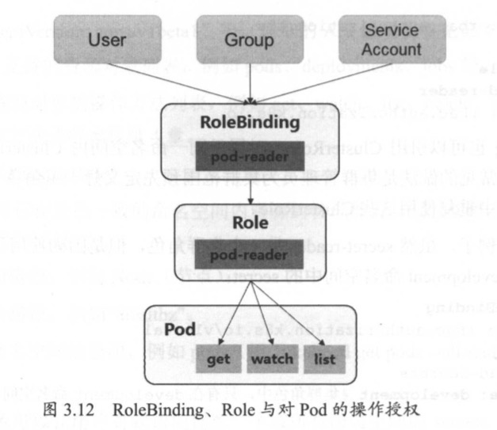

##### 2、对资源的引用方式

多数资源可以用其名称的字符串来表达，也就是`Endpoint`中的`URL`相对路径，例如`pods`。然而，某些k8s API包含下级资源，例如Pod的`日志（logs）`。Pod日志的Endpoint是`GET/api/v1/namespaces/{namespace}/pods/{name}/log`。

在这个例子中，Pod 是一个命名空间内的资源，log 就是一个下级资源。要在 `RBAC` 角色中体现，则需要用斜线“`/`”来分隔资源和下级资源。
若想授权让某个主体同时能够读取 `Pod` 和 `Pod log`，则可以配置 `resources` 为一个数组：

```yaml
kind: Role
apiVersion: rbac.authorization.k8s.io/v1beta1
metadata:
  namespace: default
  name: pod-and-pod-logs-reader
rules:
- apiGroups: [""]
  resources: ["pods", "pods/log"]
  verbs: ["get", "list"]
```

资源还可以通过名字（ResourceName）进行引用（这里指的是资源实例的名子）。在指定ResourceName后，使用get、delete、update和patch动词的请求，就会被限制在这个资源实例的范围内。

例如下面的声明让一个主体只能对一个configmap进行get和update操作：

```yaml
kind: Role
apiVersion: rbac.authorization.k8s.io/v1beta1
metadata:
  namespace: default
  name: configmap-updater
rules:
- apiGroups: [""]
  resources: ["configmap"]
  resourceNames: ["my-configmap"]
  verbs: ["update", "get"]
```

可想而知，resourceName这种用法对list、watch、create或deletecollection操作是无效的。这是因为必须要通过URL进行鉴权，而资源名称在list、watch、create或deletecollection请求中只是请求Body数据的一部分。

##### 3、常用的角色（Role）示例

下面的例子只展示了rules部分的内容。

（1）允许读取核心API组中的Pod资源

```yaml
rules:
- apiGroups: [""]
  resources: ["pods"]
  verbs: ["get", "list", "watch"]
```

（2）允许读写"extensions"和"apps"两个API组中的"deployments"资源

```yaml
rules:
- apiGroups: ["extensions", "apps"]
  resources: ["deployments"]
  verbs: ["get", "list", "watch", "create", "update", "patch", "delete"]
```

（3）允许读取"pods"及读写"jobs"

```yaml
rules:
- apiGroups: [""]
  resources: ["pods"]
  verbs: ["get", "list", "watch"]
- apiGroups: ["batch", "extensions"]
  resources: ["jobs"]
  verbs: ["get", "list", "watch", "create", "update", "patch", "delete"]
```

（4）允许读取一个名为"my-config"的ConfigMap（必须绑定到一个RoleBinding来限制到一个namespace下的ConfigMap）

```yaml
rules:
- apiGroups: [""]
  resources: ["configmaps"]
  resourceNames: ["my-config"]
  verbs: ["get"]
```

（5）读取核心组的"node"资源（Node属于集群级的资源，所以必须存在于ClusterRole中，并使用ClusterRoleBinding进行绑定）

```yaml
rules:
- apiGroups: [""]
  resources: ["pods"]
  verbs: ["get", "list", "watch"]
```

（6）允许对非资源端点/healthz及其所有子路径进行GET和POST操作（必须使用ClusterRole和ClusterRoleBinding）

```yaml
rules:
- nonResourceURLs: ["/healthz", "/healthz/*"]
  verbs: ["get", "post"]
```

##### 4、常用的角色绑定（RoleBinding）示例

注意，下面的例子中只包含subjects部分的内容。

（1）用户名"alice@example.com"

```yaml
subjects:
- kind: User
  name: "alice@example.com"
  apiGroup: rbac.authorization.k8s.io
```

（2）组名"frontend-admins"
subjects:

```yaml
- kind: Group
  name: "frontend-admins"
  apiGroup: rbac.authorization.k8s.io
```

（3）kube-system命名空间中的默认Service Account

```yaml
subjects:
- kind: ServiceAccount
  name: default
  namespace: kube-system
```

（4）"qa"命名空间中的所有Service Account

```yaml
subjects:
- kind: Group
  name: system:serviceaccounts:qa
  apiGroup: rbac.authorization.k8s.io
```

（5）所有Service Account

```yaml
subjects:
- kind: Group
  name: system:serviceaccounts
  apiGroup: rbac.authorization.k8s.io
```

（6）所有认证用户（v1.5版本以上）

```yaml
subjects:
- kind: Group
  name: system:authenticated
  apiGroup: rbac.authorization.k8s.io
```

（7）所有未认证用户（v1.5版本以上）

```yaml
subjects:
- kind: Group
  name: system:unauthenticated
   apiGroup: rbac.authorization.k8s.io
```

（8）全部用户（v1.5版本以上）

```yaml
subjects:
- kind: Group
  name: system:authenticated
   apiGroup: rbac.authorization.k8s.io
- kind: Group
  name: system:unauthenticated
  apiGroup: rbac.authorization.k8s.io
```

##### 5、默认的角色和角色绑定

API Server 创建了一系列的默认 ClusterRole 和 ClusterRoleBinding 对象， 其中许多对象以 "system:" 前缀开头，代表其中绑定的资源是作为基础设施适用和占有的。修改这些资源会导致整个集群不可用。一个例子是 system:node 。这个ClusterRole角色拥有一系列的kubelet权限，如果这个集群角色被修改了，可能会让kubelet出现异常。

所有默认的集群角色 （ClusterRole） 和其角色绑定（role binding）都带有如下标记

```shell
kubernetes.io/bootstrapping=rbac-defaults
```

下面对一些常见的默认ClusterRole和ClusterRoleBinding对象进行说明。

#### 4、对系统角色的说明如下表所示

| 默认的 ClusterRole | 默认的 ClusterRoleBinding                      | 描述                                                 |
| :----------------- | :--------------------------------------------- | :--------------------------------------------------- |
| system:basic-user  | system:authenticated和system:unauthenticated组 | 让用户能够读取自身的信息                             |
| system:discovery   | system:authenticated和system:unauthenticated组 | 对API发现Endpoint的只读访问，用于API级别的发现和协商 |

##### 1、对用户角色的说明如下表所示：

| 默认的ClusterRole | 默认的ClusterRoleBinding | 描述                                                         |
| :---------------- | :----------------------- | :----------------------------------------------------------- |
| cluster-admin     | system:masters组         | 让超级用户可以对任何资源执行任何操作。如果在ClusterRoleBinding中使用，则影响的是整个集群的所有namespace中的任何资源；如果使用的是RoleBinding，则能控制这一绑定的namespace中的资源，还包括namespace本身。 |
| cluster-status    | None                     | 可以对基础集群状态信息进行只读访问。                         |
| admin             | None                     | 允许admin访问，可以限制在一个namespace中使用RoleBinding。如果在RoleBinding中使用，则允许对namespace中大多数资源进行读写访问，其中包含创建角色和角色绑定的能力。这一角色不允许操作namespace本身，也不能写入资源限额。 |
| edit              | None                     | 允许对命名空间内的大多数资源进行读写操作，不允许查看或修改角色，以及角色绑定。 |
| view              | None                     | 允许对多数对象进行只读操作，但是对角色、角色绑定及secret是不可访问的。 |

注：有些默认角色不是以"system:"为前缀的，这部分角色是针对用户的。其中包含超级用户角色（cluster-admin），有的用于集群一级的角色（cluster-staus），还有针对namespace的角色（admin,edit,view）。

##### 2、对核心Master组件角色的说明如下表所示

| 默认的ClusterRole              | 默认的ClusterRoleBinding           | 描述                                                         |
| :----------------------------- | :--------------------------------- | :----------------------------------------------------------- |
| system:kube-scheduler          | system:kube-scheduler用户          | 能够访问kube-scheduler组件所需的资源                         |
| system:kube-controller-manager | system:kube-controller-manager用户 | 能够访问kube-controller-manager组件所需的资源，不同的控制所需的不同权限参见下表。 |
| system:node                    | system:nodes组                     | 允许访问kubelet所需的资源，包括对secret的读取，以及对Pod的写入。未来会把上面的两个权限限制在分配到本Node的对象上。今后的鉴权过程，kubelet必须以system:node及一个system:node形式的用户名进行。参看https://pr.k8s.io/40476 |
| system:node-proxier            | system:kube-proxy用户              | 允许访问kube-proxy所需的资源                                 |
| system:kube-scheduler          | system:kube-scheduler用户          | 能够访问kube-scheduler组件所需的资源                         |

##### 3、对其他组件角色的说明如下表所示

| 默认的ClusterRole                    | 默认的ClusterRoleBinding                           | 描述                                              |
| :----------------------------------- | :------------------------------------------------- | :------------------------------------------------ |
| system:auth-delegator                | None                                               | 允许对授权和认证进行托管，通常用于附加的API服务器 |
| system:heapster                      | None                                               | Heapster组件的角色                                |
| system:kube-aggregator               | None                                               | kube-aggregator的角色                             |
| system:kube-dns                      | 在kube-system namespace中kube-dns的Service Account | kube-dns角色                                      |
| system:node-bootstrapper             | None                                               | 允许访问kubelet TLS启动所需的资源                 |
| system:node-problem-detector         | None                                               | 允许访问node-problem-detector组件所需的资源       |
| system:persistent-volume-provisioner | None                                               | 允许访问多数动态卷供给所需的资源                  |

##### 4、对 Controller 角色的说明如下表所示

| Controller角色                               |      |
| :------------------------------------------- | ---- |
| system:controller:attachdetach-controller    |      |
| system:controller:certificate-controller     |      |
| system:controller:cronjob-controller         |      |
| system:controller:daemon-set-controller      |      |
| system:controller:deployment-controller      |      |
| system:controller:disruption-controller      |      |
| system:controller:endpoint-controller        |      |
| system:controller:generic-garbage-collector  |      |
| system:controller:horizontal-pod-autoscaler  |      |
| system:controller:job-controller             |      |
| system:controller:namespace-controller       |      |
| system:controller:node-controller            |      |
| system:controller:persistent-volume-binder   |      |
| system:controller:pod-garbage-collector      |      |
| system:controller:replicaset-controller      |      |
| system:controller:replication-controller     |      |
| system:controller:route-controller           |      |
| system:controller:service-account-controller |      |
| system:controller:service-controller         |      |
| system:controller:statefulset-controller     |      |
| system:controller:ttl-controller             |      |

K8s Controller Manager负责的是核心控制流。如果启用`--user-service-account-credentials`，则每个控制过程都会使用不同的`Service Account`启动。因此就有了对应各个控制过程的角色，前缀是`system:controller`。如果未启用这一功能，则将使用各自的凭据运行各个控制流程，这就需要为该凭据授予所有相关角色。

#### 5、授权注意事项：预防提权和授权初始化

RBAC API拒绝用户利用编辑角色或者角色绑定的方法进行提权。这一限制是在API层面做出的，因此即使RBAC没有启动也仍然有效。
用户只能在拥有一个角色的所有权限，且与该角色的生效范围一致的前提下，才能对角色进行创建和更新。要让一个用户能够创建或更新角色，需要：

- 为其授予一个允许创建/更新Role或ClusterRole资源对象的角色；
- 为用户授予角色，要覆盖该用户所能控制的所有权限范围。用户如果尝试创建超出其自身权限的角色或集群角色，则该API调用会被禁止。

如果一个用户的权限包含了一个角色的所有权限，那么就可以为其创建和更新角色绑定。或者如果被授予了针对某个角色的绑定授权，则也有权完成此操作。

要使用户能够创建、更新这一角色绑定或者集群角色绑定的角色，需要有如下做法：

- 为其授予一个允许其创建和更新角色绑定或者集群角色绑定的角色；
- 为其授予绑定某一角色的权限。

需要注意的是，在进行第1个角色绑定时，必须让初始用户具备其尚未被授予的权限，要进行初始的角色和角色绑定设置，有以下两种办法：

- 使用属于system:masters组的身份，这一群组默认具有cluster:admin这一超级角色的绑定。
- 如果API Server以--insecure-port参数运行，则客户端通过这个非安全端口进行接口调用，这一端口没有认证鉴权的限制。

#### 6、对 Service Account 的授权管理

默认的RBAC策略为控制平台组件、节点和控制器授予有限范围的权限，但是在"kube-system"之外的Service Account是没有任何权限的。除了所有认证用户都具有的discovery权限。
在使用中，要求用户为Service Account赋予所需的权限。细粒度的角色分配能够提高安全性，但也会提高管理成本。粗放的授权方式可能会给Service Account多余的权限，但会更易于管理。

下面的实践以安全性递减的方式排序。
（1）为一个应用专属的Service Account赋权（最佳实践）

这个应用需要在Pod的Spec中指定一个serviceAccountName，用API、Application Manifest、kubectl create serviceaccount命令等创建Service Account，例如为"my-namespace"中的"my-sa"Service Account授予只读权限：

```shell
kubectl create rolebinding my-sa-view --clusterrole=view --serviceaccount=my-namespace:my-sa --namespace=my-namespace
```

（2）为一个命名空间中的"default" Service Account授权
如果一个应用没有指定serviceAccountName，则会使用"default" Service Account。注意：赋给"default" Service Account的权限会让所有没指定serviceAccountName的Pod都具有这些权限。

例如在"my-namespace"命名空间里为"default" Service Account授予只读权限：

```shell
kubectl create rolebinding default-view --clusterrole=view --serviceaccount=my-namespace:default --namespace=my-namespace
```

目前不少Add-Ons在"kube-system"命名空间中用"default" Service Account运行。要让这些Add-Ons能够使用超级用户权限，则可以把cluster-admin权限赋予"kube-system"的"default" Service Account。

注意：这一操作意味着"kube-system"命名空间包含了通向API超级用户的一个捷径！

```shell
kubectl create clusterrolebinding add-on-cluster-admin --clusterrole=cluster-admin --serviceaccount=kube-system:default
```

（3）为命名空间内的所有Service Account授予一个角色

例如，为"my-namespace"命名空间中的所有Service Account赋予只读权限：

```shell
kubectl create rolebinding serviceaccounts-view --clusterrole=view --group=system:serviceaccounts:my-namespace --namespace=my-namespace
```

（4）为集群范围内的所有Service Account授予一个低权限角色

例如，为所有命名空间中的所有Service Account授予只读权限：

```shell
kubectl create clusterrolebinding serviceaccounts-view --clusterrole=view --group=system:serviceaccounts
```

（5）为所有Service Account授予超级用户权限（非常危险）

```shell
kubectl create clusterrolebinding serviceaccouns-cluster-admin --clusterrole=cluster-admin --group=system:serviceaccounts
```

8）使用kubectl 命令工具创建资源对象

除了使用yaml配置文件来创建这些资源对象，也可以直接使用kubectl工具对它们进行创建。

下面通过几个例子进行说明。

（1）在命名空间acme内为用户bob授权admin ClusterRole

```shell
kubectl create rolebinding bob-admin-binding --clusterrole=admin --user=bob --namespace=acme
```

（2）在命名空间acme内为名为myapp的Service Account授予view ClusterRole

```shell
kubectl create rolebinding myapp-view-binding --clusterrole=view --serviceaccount=acme:myapp --namespace=acme
```

（3）在全集群范围内为用户root授权cluster-admin ClusterRole

```shell
kubectl create clusterrolebinding root-cluster-admin-binding --clusterrole=cluster-admin --user=root
```

（4）在全集群范围内为用户kubelet授予system:node ClusterRole

```shell
kubectl create clusterrolebinding kubelet-node-binding --clusterrole=system:node --user=kubelet
```

（5）在全集群范围内为名为myapp的Service Account授予view ClusterRole

```shell
kubectl create clusterrolebinding myapp-view-binding --clusterrole=view --serviceaccount=acme:myapp
```

9）RBAC的Auto-reconciliation（自动恢复）功能

自动恢复从k8s v1.6版本开始引入，每次启动时，API Server都会更新默认的集群角色的缺失权限，也会刷新默认的角色绑定中缺失的主体，以防止一些破坏性的修改，保证在集群升级的情况下，相关内容也能够及时更新。

如果不希望使用这一功能，则可以将一个默认的集群角色（ClusterRole）或者角色绑定（RoleBinding）的Annotation注解"rbac.authorization.kubernetes.io/autoupdate"值设置为false。

10）从旧版本的授权策略升级到RBAC

在k8s v1.6之前，很多Deployment都使用了比较宽松的ABAC策略，包含为所有Service Account开放完全API访问。
而默认的RBAC策略是为控制台组件、节点和控制器授予了范围受限的权限，且不会为"kube-system"以外的Service Account授予任何权限。

这样一来，可能会对现有的一些工作负载造成影响，有两种办法来解决这一问题：

（1）并行认证。RBAC和ABAC同时进行，并包含传统的ABAC策略：

```shell
--authorization-mode=RBAC,ABAC --authorization-policy-file=mypolicy.jsonl
```

首先会由RBAC尝试对请求进行鉴权，如果未通过，那么就轮到ABAC生效。这样所有的应用只要满足RBAC或ABAC之一即可工作。
通过输出更详细的日志信息，查看以上鉴权过程和结果。直到某一天，再也不输出RBAC鉴权失败的日志了，就可以移除ABAC了。

（2）粗放管理

可以使用RBAC的角色绑定，复制一个粗话的策略。

下面的策略会让所有Service Account都具备了集群管理员权限，所有容器运行的应用都会自动接收到Service Account的认证，能够对任何API做任何事情，包括查看Secret和修改授权。这一策略无疑是比较凶险的。

```shell
$ kubectl create clusterrolebinding permissive-binding --clusterrole=cluster-admin --user=admin --user=kubelet --group=system:serviceaccounts
```

### 14、k8s使用时需要的注意点（扩展）

#### 1、滚动升级更新太慢

> 默认情况下，滚动升级是逐个更新的，当有几十上百个POD需要更新时，再加上`就绪检测`，整个过程将会更慢。

------

解决方法：

```yaml
  rollingUpdate:
    maxSurge: 20% #每个滚动更新的实例数量
    maxUnavailable: 10% #允许更新过程中有多少实例不可用
```

------

#### 2、就绪检测无损更新

> 通常，服务重启的时候会有一小段时间是`无法正常提供服务`的。 为了避免这个过程中有请求的流量进来，我们可以使用`就绪检测`来检测服务是否就绪可正常接收并处理请求。

```yaml
......
        readinessProbe:
          httpGet:
            host: api.xxx.com
            path: /
            port: 80
          initialDelaySeconds: 3 # 容器启动3秒后开始第一次检测
          periodSeconds: 60 # 每隔60s检测一次
          timeoutSeconds: 3 # http检测请求的超时时间
          successThreshold: 1 # 检测到有1次成功则认为服务是`就绪`
          failureThreshold: 1 # 检测到有1次失败则认为服务是`未就绪`
......
```

------

#### 3、就绪检测全面瘫痪

> 就绪检测是把双利剑，用不好，反而容易出大问题，比如服务全面瘫痪。 我们可以看到上面`就绪检测`的配置，漏洞百出。

------

比如：

- 超时

> 高并发情况下，请求处理不过来，个别服务很容易导致检测请求的超时（504），立马被认为`未就绪`，于是流量被转移到其它服务，进而让本来就高负荷的其它服务出现同样情况，恶性循环，很快，所有服务都被认为是`未就绪`，结果产生`全面瘫痪`现象。

------

解决方法：

> 设置更长的超时时间，以及更高的失败次数。

- 重新部署

> 这种情况可能是误操作，也可能是其它异常导致服务挂了。总之，你需要在用户还在不断尝试请求你服务的时候重启。你会惊讶的发现，一直无法正常启动为`就绪`状态，所有服务都是未就绪。同样的原因，服务启动过程不是一次全部起来，而是逐批启动，这样每批服务启动后都无法hold住流量，于是还是恶性循环，`全面瘫痪`。

------

解决方法：

> 先去掉就绪检测再重新部署。

------

#### 5、自动扩展 瞬时高峰

> 自动扩展POD虽然好用，但如果扩展的指标（CPU、内存等）设置的过高，如：50%以上，那么，当突然有翻倍的流量过来时，根本来不及扩展POD，服务直接就超时或挂掉。

------

解决方法：

> 尽可能的把指标设置在一个较小的值，对以往流量做参考评估，确保了当有2倍、3倍甚至5倍的流量突袭时不至于hold不住。

------

#### 6、自动伸缩提前扩容

> 通常，节点的自动伸缩依赖于POD的自动扩展时资源是否充足。然而在面对定时突然流量高峰的业务时，这种伸缩显然来不及，甚至常常出现高峰10分钟后才扩容的机器，流量已经回到低谷，完全启不到作用。并且，流量到底是因为业务属性很快回落，还是因为扩容不及时导致的流失？

------

解决方法：

> 根据自身业务，参考以住流量数量及推广时间，找到规律，提前或定时触发自动扩容。

------

#### 7、容器运行僵尸进程

> 这是一个docker旧版（`<1.13`）已知问题，有些容器启动后会出现defunct进程（ps aux | grep defunct），而且会越来越多，称为`僵尸进程`，可能导致内存泄漏，而且kill不掉，除非重启容器。

------

解决方法：

[tini](https://github.com/krallin/tini)

------

#### 8、集群移除节点

> 如何安全地移除节点？这个节点上面部署了你的业务，甚至包括kube-system的东西。

------

解决方法：

[kubectl drain](https://kubernetes.io/docs/tasks/administer-cluster/safely-drain-node/)，可以先把节点上的POD驱逐到其它节点，然后再移出该节点。

### 15、NetworkPolicy 资源

#### 1、NetworkPolicy 简介

network policy顾名思义就是对pod进行网络策略控制。 k8s本身并不支持，因为k8s有许多种网络的实现方式，企业内部可以使用简单的flannel、weave、kube-router等，适合公有云的方案则有calico等。不同的网络实现原理（vethpair、bridge、macvlan等）并不能统一地支持network policy。

Virtual Ethernet Pair 简称veth pair,是一个成对的端口,所有从这对端口一 端进入的数据包都将从另一端出来,反之也是一样.

##### **1、Bridge 模式**    

​        Bridge模式是Docker默认的网络模式，当Docker进程启动时，会在主机上创建一个名为docker0的虚拟网桥，用来连接宿主机和容器，此主机上的Docker容器都会连接到这个虚拟网桥上，虚拟网桥的工作方式和物理交换机类似，这样所有容器就通过交换机连在了一个二层网络中。

Docker利用 veth pair技术，在宿主机上创建了两个虚拟网络接口 veth0 和 veth1（veth pair技术的特性可以保证无论哪一个veth 接收到网络报文，都会无条件地传输给另一方），Docker将veth pair设备的一端放在新创建的容器中，并命名为eth0（容器的网卡，从docker0子网中分配一个IP给容器使用，并设置docker0的IP地址为容器的默认网关），另一端放在主机中，以vethxxx这样类似的名字命名，并将这个网络设备加入到docker0网桥中。可以通过brctl show命令查看，这样容器和网桥就可以相互通信了。网络结构如下图：


**容器与宿主机通信** : 在桥接模式下，Docker Daemon将veth0附加到docker0网桥上，保证宿主机的报文有能力发往veth0。再将veth1 添加到Docker 容器所属的网络命名空间，保证宿主机的网络报文若发往 veth0 可以立即被 veth1 收到。

**容器与外界通信** : 容器如果需要联网，则需要采用 NAT（是一种在 ip 数据包通过路由器或防火墙时，重写来源 ip 地址或目的 ip 地址的技术） 方式。准确的说，是 NATP (网络地址端口转换) 方式。NATP 包含两种转换方式：SNAT 和 DNAT 。

- **宿主机外访问容器时（修改数据包的目的地址）：**


由于容器的 IP 与端口对外都是不可见的，所以数据包的目的地址为**宿主机**的 **ip** 和**端口**，为 192.168.1.10:24 。

数据包经过路由器发给宿主机 eth0，再经 eth0 转发给 docker0 网桥。由于存在 DNAT 规则，会将数据包的目的地址转换为**容器**的 **ip** 和**端口**，为 172.17.0.n:24 。

宿主机上的 docker0 网桥识别到容器 ip 和端口，于是将数据包发送附加到 docker0 网桥上的 veth0 接口，veth0 接口再将数据包发送给容器内部的 veth1 接口，容器接收数据包并作出响应。

整个过程如下图：


 

- **容器访问宿主机之外时（****修改数据包的源地址）**

​                                                                        


此时数据包的源地址为**容器**的 **ip** 和**端口**，为 172.17.0.n:24，容器内部的 veth1 接口将数据包发往 veth0 接口，到达 docker0 网桥。

宿主机上的 docker0 网桥发现数据包的目的地址为外界的 IP 和端口，便会将数据包转发给 eth0 ，并从 eth0 发出去。由于存在 SNAT 规则，会将数据包的源地址转换为**宿主机**的 **ip** 和**端口**，为 192.168.1.10:24 。

由于路由器可以识别到宿主机的 ip 地址，所以再将数据包转发给外界，外界接受数据包并作出响应。这时候，在外界看来，这个数据包就是从 192.168.1.10:24 上发出来的，Docker 容器对外是不可见的。

整个过程如下图：

​                                                                       

##### **2、macvlan模式**    

macvlan本身是linxu kernel的模块，本质上是一种网卡虚拟化技术。其功能是允许在同一个物理网卡上虚拟出多个网卡，通过不同的MAC地址在数据链路层进行网络数据的转发，一块网卡上配置多个 MAC 地址（即多个 interface），每个interface可以配置自己的IP，Docker的macvlan网络实际上就是使用了Linux提供的macvlan驱动

因为多个MAC地址的网络数据包都是从同一块网卡上传输，所以需要打开网卡的混杂模式 

```shell
ip link set eth0 promisc on
```

创建macvlan网络不同于桥接模式，需要指定网段和网关，并且都得是真实存在的，例如 

```shell
docker network create -d macvlan --subnet=10.9.8.0/24 --gateway=10.9.8.254 -o parent=eth0 macvlan-test
```

macvlan模式不依赖网桥，所以brctl show查看并没有创建新的bridge，但是查看容器的网络，会看到虚拟网卡对应了一个interface是2


查看宿主机的网络，2正是虚机的网卡


可见，容器的 eth0 就是宿主机的eth0通过macvlan虚拟出来的interface。容器的interface直接与主机的网卡连接，这种方案使得容器无需通过NAT和端口映射就能与外网直接通信（只要有网关），在网络上看起来与其他独立主机没有区别。当前网络结构如图所示：


macvlan会独占主机的网卡，也就是说一个网卡只能创建一个macvlan 网络，否则会报错，为了能支持更多的macvlan网络，macvlan不仅可以连接到interface（如eth0），也可以连接到网卡的子接口 sub-interface（如eth0.xxx）。

VLAN 是现代网络常用的网络虚拟化技术，它可以将物理的二层网络划分成多达 4094 个逻辑网络，这些逻辑网络在二层上是隔离的，每个逻辑网络（即 VLAN）由 VLAN ID 区分，VLAN ID 的取值为 1-4094。Linux 的网卡也能支持 VLAN（apt-get install vlan），同一个 interface可以收发多个VLAN 的数据包，不过前提是要创建 VLAN的 sub-interface。比如希望 eth0同时支持 VLAN10 和 VLAN20，则需创建 sub-interface eth0.10 和 eth0.20。创建的子接口是可以看到的，如下如


在交换机上，如果某个端口只能收发单个VLAN的数据，该port为Access模式，如果支持多个VLAN，则为Trunk模式，要实现多个macvlan，网卡要接在交换机的 trunk口上。

例如给网卡创建了10、20两个子接口后，分别创建容器后的网络结构如下图：


 

#### 2、NetworkPolicy 策略模型

1、使用 `network policy ` 资源可以配置 pod 的网络，networkPolicy 是 namespace scoped的，他只能影响某个 namespace 下的 pod 的网络出入站规则。

- metadata 描述信息
- podSelector  pod 选择器，选定的pod所有的出入站流量要遵循本networkpolicy的约束
- policyTypes 策略类型。包括了 Ingress 和 Egress，默认情况下一个 policyTypes 的值一定会包含 Ingress，当有 egress 规则时，policyTypes 的值中会包含Egress
- ingress 入站
- egress 出站

2、CNI 插件需要启用，Calico 安装为 CNI 插件。必须通过传递 `--network-plugin=cni` 参数将kubelet配置为使用CNI网络。（在kubeadm上，这是默认设置。）

3、支持 kube-proxy 的模式

- iptables
- ipvs 需要 1.9 以上的

#### 3、安装 Calico 用于策略和 Flannel 用于网络

我们这里使用Kubernetes的etcd进行安装，首先确保Kubernetes设置`--cluster-cidr=10.244.0.0/16`和`--allocate-node-cidrs=true`。（kubeadm是默认安装的）

我们集群启动了RBAC，所以要创建RBAC

```shell
kubectl apply -f https://docs.projectcalico.org/v3.3/getting-started/kubernetes/installation/hosted/canal/rbac.yaml
```

安装Calico

```shell
kubectl apply -f https://docs.projectcalico.org/v3.3/getting-started/kubernetes/installation/hosted/canal/canal.yaml
```

####  4、kubernetes中的网络控制策略

NetworkPolicy是kubernetes对pod的隔离手段，可以看到，NetworkPolicy实际上只是宿主机上的一系列iptables规则。

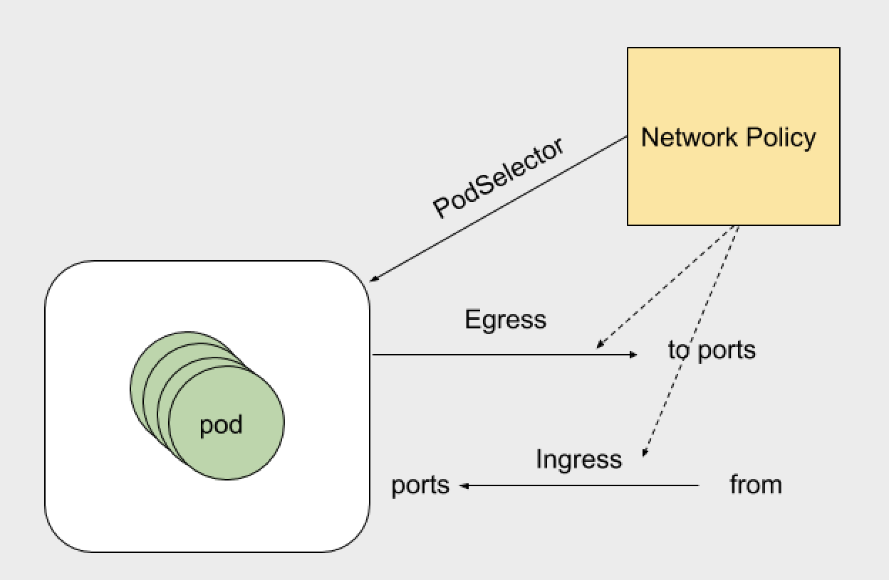

 

- Egress 表示出站流量，就是pod作为客户端访问外部服务，pod地址作为源地址。策略可以定义目标地址或者目的端口
- Ingress 表示入站流量，pod地址和服务作为服务端，提供外部访问。pod地址作为目标地址。策略可以定义源地址和自己端口
- podSelector 规则生效在那个pod上，可以配置单个pod或者一组 pod。可以定义单方向。空 `podSelector`选择命名空间中的Pod。

```
 kubectl explain  networkpolicy.spec 
```

讲解:

- egress 出站流量规则 可以根据ports和to去定义规则。ports下可以指定目标端口和协议。to（目标地址）：目标地址分为ip地址段、pod、namespace

- ingress 入站流量规则 可以根据ports和from。ports下可以指定目标端口和协议。from（来自那个地址可以进来）：地址分为ip地址段、pod、namespace

- podSelector 定义NetworkPolicy的限制范围。直白的说就是规则应用到那个pod上。

  podSelector: {},留空就是定义对当前namespace下的所有pod生效。没有定义白名单的话 默认就是 Deny ALL (拒绝所有)

- policyTypes 指定那个规则 那个规则生效，不指定就是默认规则。

##### 1、在dev的namespace下定义一个入站流量拒绝的规则：

```yaml
# 创建 dev namespace
apiVersion: v1
kind: Namespace
metadata:
   name: dev
   labels:
     name: development


apiVersion: networking.k8s.io/v1
kind: NetworkPolicy
metadata:
  name: deny-all-policy
spec:
  podSelector: {}
  policyTypes:
  - Ingress

kubectl apply -f network-policy.yaml  -n dev
```

##### 2、在dev和prod的namespace下个各自创建一个pod

```shell
# 创建 prod namespace
apiVersion: v1
kind: Namespace
metadata:
   name: prod
   labels:
     name: prod
     
# 创建pod
apiVersion: v1
kind: Pod
metadata:
  name: pod-1
  labels:
    name: myapp
spec:
  containers:
  - name: myapp
    image: ikubernetes/myapp:v1

kubectl apply -f policy-pod.yaml  -n dev

kubectl apply -f policy-pod.yaml  -n prod

# 测试一下
kubectl get pod -o wide -n prod 
NAME      READY     STATUS    RESTARTS   AGE       IP           NODE
pod-1     1/1       Running   0          3h        10.244.2.3   k8s-node02
kubectl get pod -o wide -n dev 
NAME      READY     STATUS    RESTARTS   AGE       IP           NODE
pod-1     1/1       Running   0          3h        10.244.2.2   k8s-node02

curl 10.244.2.3
Hello MyApp | Version: v1 | <a href="hostname.html">Pod Name</a>
10.244.2.2 不通
```

#####  3、表示所有的都被运行的规则

```yaml
apiVersion: networking.k8s.io/v1
kind: NetworkPolicy
metadata:
  name: deny-all-policy
spec:
  podSelector: {}
  ingress:
  - {}
  policyTypes:
  - Ingress

kubectl apply -f  network-policy.yaml  -n dev 

测试
curl 10.244.2.2                              
Hello MyApp | Version: v1 | <a href="hostname.html">Pod Name</a>
```

##### 4、放行特定的入站访问流量（清理环境）

```yaml
apiVersion: networking.k8s.io/v1
kind: NetworkPolicy
metadata:
  name: allow-myapp-policy
spec:
  podSelector: 
    matchLabels:
      app: myapp   #选择app=myapp 的标签放行
  ingress:
  - from:
    - ipBlock:     #地址段
        cidr: 10.244.0.0/16  #允许这个地址段访问
        except:    #排除一下地址不可以访问
        - 10.244.1.2/32
    ports:
    - port: 80   #只运行访问80端口
      protocol: TCP
kubectl apply -f alloy-pod.yaml -n dev 
```

测试一下

```shell
curl 10.244.2.2
Hello MyApp | Version: v1 | <a href="hostname.html">Pod Name</a>
```

下面写一个完整的NetworkPolicy对象：

```yaml
apiVersion: networking.k8s.io/v1
kind: NetworkPolicy
metadata:
  name: test-network-policy
  namespace: default
spec:
  podSelector:
    matchLabels:
      role: db
  policyTypes:
  - Ingress
  - Egress
  ingress:
  - from:
    - ipBlock:
        cidr: 10.244.0.0/16
        except:
        - 10.244.1.0/24
    - namespaceSelector:
        matchLabels:
          project: myproject
    - podSelector:
        matchLabels:
          role: frontend
    ports:
    - protocol: TCP
      port: 6379
  egress:
  - to:
    - ipBlock:
        cidr: 10.0.0.0/24
    ports:
    - protocol: TCP
      port: 5978
```

大概意思：

- 该规则只在 default 的 namespace下，携带role:db标签的pod生效。限制请求的类型包括Ingress和Egress。
- Kubernetes会拒绝任何访问被隔离pod的请求，除非这个请求来自以下“白名单”里的对象。并且访问的是被隔离pod的6379端口。
- default Namespace里的,携带了role=fronted标签的pod可以访问
- 任何Namespace里的，携带了project=myproject标签的pod可以访问
- 任何源地址数据172.17.0.0/16网段，且不属于172.17.1.0/24网段的请求
- Kubernetes会拒绝被隔离pod对外发起任何请求，除非请求的目的地址属于10.0.0.0/24网段，并且访问的是该网段地址的5978端口。

##### 5、策略模型实例

如果我们想要只允许default这个namespace下label包含access=true的pod访问nginx pod（label：run=nginx）,可以对nginx pod设置入站规则：

```yaml
apiVersion: networking.k8s.io/v1
kind: NetworkPolicy
metadata:
  name: access-nginx
  namespace: default
spec:
  podSelector:
    matchLabels:
      run: nginx
  ingress:
  - from:
    - podSelector:
        matchLabels:
          access: "true"
```

另外一些默认的规则：
1、同namespace的pod，入站规则为全部禁止

```yaml
apiVersion: networking.k8s.io/v1
kind: NetworkPolicy
metadata:
  name: default-deny
spec:
  podSelector: {}
  policyTypes:
  - Ingress
```

2、同namespace的pod，入站规则为全部开放：

```yaml
apiVersion: networking.k8s.io/v1
kind: NetworkPolicy
metadata:
  name: allow-all
spec:
  podSelector: {}
  ingress:
  - {}
```

3、同namespace的pod，出站规则为全部禁止

```yaml
apiVersion: networking.k8s.io/v1
kind: NetworkPolicy
metadata:
  name: default-deny
spec:
  podSelector: {}
  policyTypes:
  - Egress
```

4、同namespace的pod，出站规则为全部开放

```yaml
apiVersion: networking.k8s.io/v1
kind: NetworkPolicy
metadata:
  name: allow-all
spec:
  podSelector: {}
  egress:
  - {}
  policyTypes:
  - Egress
```

5、通过创建一个可以选择所有 Pod 但不允许任何流量的 NetworkPolicy，你可以为一个 Namespace 创建一个 “默认的” 隔离策略，如下所示：

```yaml
apiVersion: networking.k8s.io/v1
kind: NetworkPolicy
metadata:
  name: default-deny
spec:
  podSelector:
```

6、这确保了即使是没有被任何 NetworkPolicy 选中的 Pod，将仍然是被隔离的。

可选地，在 Namespace 中，如果你想允许所有的流量进入到所有的 Pod（即使已经添加了某些策略，使一些 Pod 被处理为 “隔离的”），你可以通过创建一个策略来显式地指定允许所有流量：

```yaml
apiVersion: networking.k8s.io/v1
kind: NetworkPolicy
metadata:
  name: allow-all
spec:
  podSelector:
  ingress:
  - {}
```

