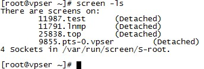

## SSH远程会话管理工具 - screen使用教程

2010年10月15日 下午 | 作者：VPS侦探

[VPS侦探](https://www.vpser.net/)在刚接触Linux时最怕的就是SSH远程登录Linux VPS编译安装程序时（比如安装[lnmp](https://lnmp.org/)）网络突然断开，或者其他情况导致不得不与远程SSH服务器链接断开，远程执行的命令也被迫停止，只能重新连接，重新运行。相信现在有些VPSer也遇到过这个问题，今天就给VPSer们介绍一款[远程会话管理工具](https://www.vpser.net/manage/screen.html) - [screen命令](https://www.vpser.net/manage/screen.html)。

## 一、screen命令是什么？

[Screen](https://www.vpser.net/manage/screen.html)是一个可以在多个进程之间多路复用一个物理终端的全屏窗口管理器。Screen中有会话的概念，用户可以在一个screen会话中创建多个screen窗口，在每一个screen窗口中就像操作一个真实的telnet/SSH连接窗口那样。

## 二、如何安装screen命令？

除部分精简的系统或者定制的系统大部分都安装了screen命令，如果没有安装，CentOS系统可以执行：**yum install screen** ；

Debian/Ubuntu系统执行：**apt-get install screen** 。

## 三、screen命令使用方法？

### **1、常用的使用方法**

用来解决[文章](https://www.vpser.net/manage/screen.html)开始我们遇到的问题，比如在[安装lnmp](https://lnmp.org/install.html)时。

#### 1.1 创建screen会话

可以先执行：**screen -S lnmp** ，screen就会创建一个名字为lnmp的会话。 VPS侦探 https://www.vpser.net/

#### 1.2 暂时离开，保留screen会话中的任务或程序

当需要临时离开时（会话中的程序不会关闭，仍在运行）可以用快捷键Ctrl+a d(即按住Ctrl，依次再按a,d)

#### 1.3 恢复screen会话

当回来时可以再执行执行：**screen -r lnmp** 即可恢复到离开前创建的lnmp会话的工作界面。如果忘记了，或者当时没有指定会话名，可以执行：**screen -ls** screen会列出当前存在的会话列表，如下图：

11791.lnmp即为刚才的screen创建的lnmp会话，目前已经暂时退出了lnmp会话，所以状态为Detached，当使用screen -r lnmp后状态就会变为Attached，11791是这个screen的会话的进程ID，恢复会话时也可以使用：**screen -r 11791**

#### 1.4 关闭screen的会话

执行：**exit** ，会提示：[screen is terminating]，表示已经成功退出screen会话。VPS侦探 https://www.vpser.net/

### 2、远程演示

首先演示者先在服务器上执行 **screen -S test** 创建一个screen会话，观众可以链接到远程服务器上执行**screen -x test** 观众屏幕上就会出现和演示者同步。

### 3、常用快捷键

Ctrl+a c ：在当前screen会话中创建窗口
Ctrl+a w ：窗口列表
Ctrl+a n ：下一个窗口
Ctrl+a p ：上一个窗口
Ctrl+a 0-9 ：在第0个窗口和第9个窗口之间切换

如果你有任何因为可以在本文下面留言或者到[https://bbs.vpser.net](https://bbs.vpser.net/) 发帖。

**>>转载请注明出处：VPS侦探 本文链接地址：https://www.vpser.net/manage/screen.html**

### 相关文章：

- [rsync 文件同步/传输,增量备份传输利器使用教程](https://www.vpser.net/manage/rsync.html)
- [Linux VPS延长SSH连接时间设置](https://www.vpser.net/manage/linux-vps-ssh-clientalivecountmax.html)
- [Linux SSH远程文件/目录传输命令scp](https://www.vpser.net/manage/scp.html)
- [如何使用Putty远程(SSH)管理Linux VPS](https://www.vpser.net/other/putty-ssh-linux-vps.html)
- [SSH密钥登录让Linux VPS/服务器更安全](https://www.vpser.net/security/linux-ssh-authorized-keys-login.html)