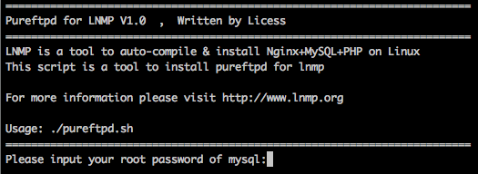
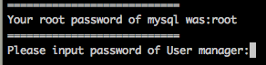
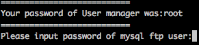
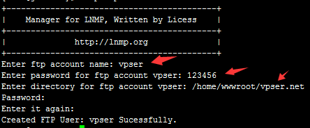
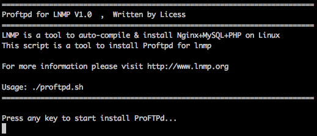

## lnmp 离线一键部署

**系统需求:**

- CentOS/RHEL/Fedora/Debian/Ubuntu/Raspbian/Deepin/Aliyun/Amazon/Mint Linux发行版
- 需要5GB以上硬盘剩余空间，MySQL 5.7,MariaDB 10至少9GB剩余空间
- 需要128MB以上内存(128MB小内存VPS,Xen需有SWAP,OpenVZ至少要有128MB以上的vSWAP或突发内存)，注意小内存请勿使用64位系统！
- **安装MySQL 5.6或5.7及MariaDB 10必须1G以上内存，更高版本至少要2G内存!**。
- **安装PHP 7及以上版本必须1G以上内存!**。
- VPS或服务器必须已经联网且必须设置的是网络源不能是光盘源，同时VPS/服务器DNS要正常！
- Linux下区分大小写，输入命令时请注意！
- 如有通过yum或apt-get安装的MySQL/MariaDB请自行备份数据等相关文件！
- CentOS 5,Debian 6及之前版本其官网已经结束支持无法使用！
- Ubuntu 18+,Debian 9+,Mint 19+,Deepin 15.7+及所有新的Linux发行版只能使用1.6进行安装！
- 低于PHP 7.1.*版本不支持Ubuntu 19+、Debian 10等等非常新的Linux发行版！

LNMP一键安装包 V1.6 已经在[Vultr](https://www.vpser.net/go/vultr)、[遨游主机](https://www.vpser.net/go/aoyohost)、[搬瓦工](https://www.vpser.net/go/bwg)、[LocVPS](https://www.vpser.net/go/locvps)、[Linode](https://www.vpser.net/go/linode)、[vps2ez](https://www.vpser.net/go/vps2ez)、[DiaHosting](https://www.vpser.net/go/diahosting)、[DigitalOcean](https://www.vpser.net/go/digitalocean)、[KVMLA](https://www.vpser.net/go/kvmla)、[景文互联](https://www.vpser.net/go/jwdns)、[RamNode](https://www.vpser.net/go/ramnode)、[BuyVM](https://www.vpser.net/go/buyvm)、[快易互联](https://www.vpser.net/go/kiiyi)、[80VPS](https://www.vpser.net/go/80vps)、[阿里云](https://www.vpser.net/go/aliyun)等众多VPS的CentOS 6-7、RHEL 6-8、Fedora 21-30、Debian 7-10、Ubuntu 10.04-19.04的32位和64位系统上测试通过(CentOS 5,Debian 6及之前版本其官网已经结束支持无法使用,Debian9上Apache需选2.4.26版本以上。

**安装步骤:**
**1、使用putty或类似的SSH工具登陆VPS或服务器；**

登陆后运行：**screen -S lnmp**
如果提示screen: command not found 命令不存在可以执行：yum install screen 或 apt-get install screen安装，详细内容参考[screen教程](https://www.vpser.net/manage/run-screen-lnmp.html)。

**2、下载并安装LNMP一键安装包：**

您可以选择使用下载版(推荐美国及海外VPS或空间较小用户使用)或者完整版(推荐国内VPS使用，国内用户可用在[下载](https://lnmp.org/download.html)中找国内下载地址替换)，两者没什么区别，只是完整版把一些需要的源码文件预先放到安装包里。

**安装LNMP稳定版**
如需无人值守安装，请使用 [无人值守命令生成工具](https://lnmp.org/auto.html)，或[查看无人值守说明教程](https://lnmp.org/faq/v1-5-auto-install.html)

**wget http://soft.vpser.net/lnmp/lnmp1.6.tar.gz -cO lnmp1.6.tar.gz && tar zxf lnmp1.6.tar.gz && cd lnmp1.6 && ./install.sh lnmp**

如需要安装LNMPA或LAMP，将./install.sh 后面的参数lnmp替换为lnmpa或lamp即可。如需更改网站和数据库目录、自定义Nginx参数、PHP参数模块、开启lua等需在运行./install.sh 命令前修改安装包目录下的 lnmp.conf 文件，详细可以查看[lnmp.conf文件参数说明](https://lnmp.org/faq/lnmp-software-list.html#lnmp.conf)。

如提示wget: command not found ，使用yum install wget 或 apt-get install wget 命令安装。

如下载速度慢或无法下载请更换其他下载节点，请查看[LNMP下载节点具体替换方法](https://lnmp.org/faq/lnmp-download-source.html)。

运行上述LNMP安装命令后，会出现如下提示：

目前提供了较多的MySQL、MariaDB版本和不安装数据库的选项，需要**注意的是MySQL 5.6,5.7及MariaDB 10必须在1G以上内存的更高配置上才能选择**！如仅需安装数据库在lnmp安装包目录下执行：./install.sh db

输入对应MySQL或MariaDB版本前面的序号，回车进入下一步.

设置MySQL的root密码（为了安全不输入直接回车将会设置为lnmp.org#随机数字）如果输入有错误需要删除时，可以按住Ctrl再按Backspace键进行删除(个别情况下是只需要Backspace键)。输入后回车进入下一步，如下图所示：

询问是否需要启用MySQL InnoDB，InnoDB引擎默认为开启，一般建议开启，直接回车或输入 y ，如果确定确实不需要该引擎可以输入 n，(MySQL 5.7+版本无法关闭InnoDB),输入完成，回车进入下一步。

注意：选择PHP 7+版本时需要自行确认PHP版本是否与自己的程序兼容。

输入要选择的PHP版本的序号，回车进入下一步，选择是否安装内存优化：

可以选择不安装、Jemalloc或TCmalloc，输入对应序号回车，直接回车为默认为不安装。

如果是LNMPA或LAMP的话还会提示设置邮箱和选择Apache“Please enter Administrator Email Address:”，需要设置管理员邮箱，该邮箱会在报错时显示在错误页面上。

再选择Apache版本

按提示输入对应版本前面的数字序号，回车。

提示"Press any key to install...or Press Ctrl+c to cancel"后，按回车键确认开始安装。 
LNMP脚本就会自动安装编译Nginx、MySQL、PHP、phpMyAdmin等软件及相关的组件。

安装时间可能会几十分钟到几个小时不等，主要是机器的配置网速等原因会造成影响。

**3、安装完成**
如果显示Nginx: OK，MySQL: OK，PHP: OK

并且Nginx、MySQL、PHP都是running，80和3306端口都存在，并提示安装使用的时间及Install lnmp V1.6 completed! enjoy it.的话，说明已经安装成功。
某些系统可能会一直卡在Install lnmp V1.5 completed! enjoy it.不自动退出，可以按Ctrl+c退出。

安装完成接下来开始使用就可以了，按[**添加虚拟主机教程**](https://lnmp.org/faq/lnmp-vhost-add-howto.html)，添加虚拟主机后可以使用[sftp](https://lnmp.org/faq/sftp.html)或[ftp服务器](https://lnmp.org/faq/ftpserver.html)上传网站代码，将域名解析到VPS或服务器的IP上，解析生效即可使用。

**4、安装失败**

如果出现类似上图的提示，有一个或几个没安装成功表明安装失败！！需要用[winscp](http://www.vpser.net/manage/winscp.html)或其他类似工具，将/root目录下面的lnmp-install.log下载下来，到[LNMP支持论坛](http://bbs.vpser.net/forum-25-1.html)发帖注明你的系统发行版名称及版本号、32位还是64位等信息，并将lnmp-install.log压缩以附件形式上传到论坛，我们会通过日志查找错误，并给予相应的解决方法。

  **默认LNMP是不安装FTP服务器的，如需要FTP服务器：https://lnmp.org/faq/ftpserver.html**

**LNMP下FTP服务器的安装和使用(Pureftpd和Proftpd)**

FTP是网站文件维护中使用比较多的，目前LNMP一键安装包中有Pureftpd和Proftpd服务器安装脚本，LNMP默认不安装任何FTP服务器，需要用户自行安装（1.2开始不再提供proftpd的安装脚本）。

**一、Pureftpd**

LNMP一键安装包里**1.3及更高版本不需要MySQL支持，无图像界面没有http://ip/ftp/管理界面，只能使用命令lnmp ftp {add|del|edit}进行管理。**1.2及以下版本Pureftpd安装脚本是需要MySQL支持的，安装前需要已经安装好LNMP，这个自带一个PHP编写的用户管理界面。

**安装**

进入lnmp解压后的目录，如cd lnmp1.4 其他版本的话自行更改和确定目录位置，执行：**./pureftpd.sh** 会显示如下图（1.2和1.3及更高版本的安装过程有些差异，1.3及更高版本直接回车安装不需要填写其他信息，1.2版本安装如下：）：

按提示输入当前MySQL的root密码，输入完成，回车确认，会提示如下信息：
这一步是设置FTP用户管理后台的登陆密码。输入完成回车确认

因为PHP管理后台需要连接数据库，所以会在MySQL上创建一个ftp用户，这里设置的就是这个用户的密码。输入完成，回车确认。

回车 显示 "Press any key to start install Pure-FTPd..." 再次回车确认即可开始安装。

**1.3及更高版本没有图像界面！！！！！！！！没有http://ip/ftp/ 不能网页进行管理！！！！！！！！只能使用lnmp ftp {add|del|edit}进行管理。**

**添加用户**

1.3及更高版本添加ftp账号执行：lnmp ftp add

按提示分别输入要创建的ftp账号、密码及ftp账号对应的目录(**目录必须是以/开始的绝对目录**)
后面出现的Password: 和 Enter it again: 不需要理会，只是提示，脚本都是自动完成的。

1.2及以下版本添加用户如下：
安装完成后，在浏览器输入： http://你的ip/ftp/ 用刚才设置的FTP用户管理后台的登陆密码登陆。登陆后界面如下：

添加一个用户名到你要添加的目录。
uid,gid 都选www。

**注意事项：**
有用户可能找不到选择目录的地方，选目录是点击”主目录“ 最后面有个圆形套着三角形的图标，点一下就会出来。
如果提示无法读取目录、登陆超时或报502 Bad Gateway错误，修改/usr/local/php/etc/php.ini 查找open_basedir，将有/home/wwwroot/default的几行前面加;注释掉，重启php-fpm生效。
LNMP 1.2的话在/home/wwwroot/default/.user.ini里设置，将里面的内容删除，重启php-fpm生效后即可。
.user.ini文件无法直接修改，而且是隐藏文件可能在winscp下可能无法看到，建议使用[vim编辑器](http://www.vpser.net/manage/vi.html)或[nano编辑器](http://www.vpser.net/manage/nano.html)进行修改。
修改前需要执行：chattr -i /home/wwwroot/default/.user.ini
修改完成后再执行：chattr +i /home/wwwroot/default/.user.ini

如果是LNMPA或LAMP的话需要修改/usr/local/apache/conf/extra/httpd-vhosts.conf里面的php_admin_value open_basedir在该行前面加#直接注释。

LNMP 1.2开始可以使用命令：lnmp ftp {add|list|del} 进行FTP账号管理。
使用命令进行管理更方便。

修改管理面板登录密码：http://bbs.vpser.net/thread-2038-1-1.html

**卸载Pureftpd**

执行：**./pureftpd.sh uninstall** 即可对pureftpd进行卸载。

安装的FTP服务器均为普通连接未加密、非TLS加密等连接，连接时请注意选择。

**二、Proftpd**

在LNMP 1.0中增加了Proftpd服务器安装脚本，proftpd可以通过配置文件对权限进行更多的设置。
Proftpd可以单独安装，不需要其他如MySQL的支持，完全使用配置文件进行设置。

**安装**

进入lnmp1.0解压后的目录，执行：**./proftpd.sh**

提示“Press any key to start install ProFTPd... ”后回车确认就会自动安装Proftpd

**添加FTP用户**

执行：**/root/proftpd_vhost.sh**
提示“Please input a username:” 后输入要添加的FTP用户名，回车确认。
之后会提示“Please set password for 前面你设的用户名:” 输入你要设置的密码
回车确认后后会提示“Please input full path:”，这里需要输入FTP用户设置到哪个目录，需要是绝对路径，输入完回车确认，提示“Press any key to start create ProFTPd virtul host...”后再次回车确认FTP用户就会添加上。

**5、添加、删除虚拟主机及伪静态管理**
https://lnmp.org/faq/lnmp-vhost-add-howto.html

**LNMP添加、删除虚拟主机及伪静态使用教程**

一般情况下每个虚拟主机就是一个网站，网站一般通过域名进行访问。
本文为教程适合LNMP 1.2+，各个版本的添加过程基本类似，按提示操作即可。1.4版+添加了SSL选项可以选择Letsencrypt和自备SSL证书，多PHP版本选择等功能。1.3版增加了FTP和数据库的创建等。LNMP 1.4+的防跨目录同时在网站根目录.user.ini和fastcgi.conf中进行管控，LNMP1.2的防跨目录在网站根目录下的.user.ini，1.1版在php.ini中；[移除防跨目录设置方法](https://lnmp.org/faq/lnmp-vhost-add-howto.html#user.ini)。
LNMP 1.1及之前的版本采用/root/vhost.sh 进行添加虚拟主机。

LNMP 1.2开始使用lnmp命令进行管理，具体可以参看[更新记录](https://lnmp.org/changelog.html)
虚拟主机管理基本命令介绍：**lnmp vhost {add|list|del}**

之前版本的LNMP都可以升级到新版的lnmp管理脚本，[升级到1.4教程](https://lnmp.org/faq/upgrade1-4.html)

**##添加网站(虚拟主机)##**
如果输入有错误需要删除时，可以按住Ctrl再按Backspace键进行删除。

执行：**lnmp vhost add** 出现如下界面：

这里要输入要添加网站的域名，我们已添加www.vpser.net域名为例，如上图提示后输入域名 www.vpser.net 回车后提示

这里询问是否添加更多域名，直接再输入要绑定的域名，这里我们将 vpser.net 也绑上，多个域名空格隔开，如不需要绑其他域名就直接回车。

> (注：带www和不带www的是不同的域名，如需带www和不带的www的域名都访问同一个网站需要同时都绑定)。

下面需要设置网站的目录

网站目录不存在的话会创建目录。也可以输入已经存在的目录或要设置的目录（**注意如要输入必须是全路径即以/开头的完整路径！！！**）。不输入直接回车的话，采用默认目录：/home/wwwroot/域名

伪静态可以使URL更加简洁也利于SEO，如程序支持并且需要设置伪静态的话，如启用输入 y ，不启用输入 n 回车(注意LNMPA或LAMP模式没有该选择项！)。

默认已经有了discuz、discuzx、discuzx2(Discuz X二级目录)、wordpress、wp2(WordPress二级目录)、typecho、typecho2(Typecho二级目录)、sablog、emlog、dabr、phpwind、、dedecms、drupal、ecshop、shopex等常用的Nginx伪静态配置文件，可以直接输入名称进行使用，如果是二级目录则需要对应配置文件里的二级目录的名称。

这一步是设置日志，如启用日志输入 y ，不启用输入 n 回车。

如果启用需要再输入要设置的日志的名称，默认日志目录为：/home/wwwlogs/ 默认文件名为：域名.log 回车确认后，会询问是否添加数据库和数据库用户。

如果需要添加数据库输入 y ，不添加数据库输入 n 回车。

如果要添加，需要先验证MySQL的root密码(注：输入密码将不显示)
提示Enter database name: 后输入要创建的数据库名称，要创建的数据库用户名会和数据库同名，回车确认。

提示Please enter password for mysql user 数据库名: 后输入要设置的密码，回车确认。

**如果安装了FTP服务器**会询问是否添加FTP账号

如果需要添加输入 y ，不添加输入 n 回车。

提示Enter ftp account name: 后输入要创建的FTP账号名称，回车确认。
提示Enter password for ftp account FTP账号: 后输入要设置的密码，回车确认。

接下来是1.4新增的添加SSL功能

如果需要添加输入 y ，不添加输入 n 回车。
选择了添加SSL会提示

有两个选项，1 选项为使用自己准备好的SSL证书和key。

\> > 提示Please enter full path to SSL Certificate file 后输入要SSL证书的完整路径和文件名，回车确认。
\> > 提示Please enter full path to SSL Certificate Key file: 后输入输入要key文件的完整路径和文件名，回车确认。
\> > LAMP下会提示Please enter full path to SSL Chain file: 一般Apache2.2需要用到这个添加上证书链，2.4前面证书是补全证书链的话不用。

2 选项为使用免费SSL证书提供商Letsencrypt的证书，自动生成SSL证书等信息。

需要输入一个邮箱回车确认。

提示 Press any key to start create virtul host... 后，回车确认便会开始创建虚拟主机。

添加成功会提示添加的域名、目录、伪静态、日志、数据库、FTP等相关信息，如下图：

**##伪静态管理##**

LNMPA或LAMP可以直接使用网站根目录下放.htaccess 来设置伪静态规则(具体规则可以去程序官网网站找google百度)，但是在LNMP下，需要使用Nginx伪静态规则。
伪静态可以随时添加或删除，如果添加完虚拟主机后忘记或没有添加伪静态，可以通过修改配置文件来添加伪静态。
虚拟主机配置文件在：/usr/local/nginx/conf/vhost/域名.conf

伪静态规则文件需要放在/usr/local/nginx/conf/ 下面。
编辑虚拟主机配置文件，可以使用[vi](http://www.vpser.net/manage/vi.html)、[nano](http://www.vpser.net/manage/nano.html)或[winscp](http://www.vpser.net/manage/winscp.html)，后2个工具对新手来说简单些。

例如前面我们添加的虚拟主机，打开后前半部分配置会显示如下：

在root /home/wwwroot/www.vpser.net;这一行下面添加：
include wordpress.conf;
上面的wordpress.conf为伪静态文件，如需要其他伪静态文件自己创建个并上传到/usr/local/nginx/conf/ 下面并include 伪静态.conf; 加完保存，执行：**/etc/init.d/nginx restart** 重启生效，如果报错可能是添加有误或伪静态规则有误。

1.4及之前版本伪静态文件都在 /usr/local/nginx/conf/ 目录下
1.5及之后版本伪静态文件都在 /usr/local/nginx/conf/rewrite 目录下
伪静态文件名称后面带2的是二级目录的伪静态，可以根据自己需求修改里面二级目录的名称或复制为其他名字后include到虚拟主机配置文件中。

**##上传网站程序##**

如果已经[安装FTP服务器](http://lnmp.org/faq/ftpserver.html)可以直接使用ftp客户端通过你的FTP信息登录后上传网站或[sftp](http://lnmp.org/faq/sftp.html)等软件上传网站，设置好相关权限开始安装即可。
上传网站后建议执行：chown www:www -R /path/to/dir 对网站目录进行权限设置，/path/to/dir替换为你网站目录。
为了安全可以将一些不需要PHP运行的上传文件之类的目录去掉执行权限，参考：http://www.vpser.net/security/lnmp-remove-nginx-php-execute.html

**##已存在虚拟主机添加ssl证书开启https##**

对于已存在的虚拟主机添加https站点，可以执行：**lnmp ssl add** 命令添加ssl证书，目前有两种方式一种是使用自备的ssl证书，二是采用Let'sEncrypt的免费证书。添加过程和前面的添加虚拟主机的过程是一样的，只是会多一项填写ssl证书和key的步骤或直接选择Let'sEncrypt自动生成证书。
如果是1.*版本升级到1.4或更改版本的需要参考：https://lnmp.org/faq/upgrade1-4.html 中的说明.

**如果访问https站点时提示不安全或不显示小绿锁的话一般有以下几个原因：**
SSL证书可能到期；
网站代码里可能有http的资源如css、js、图片等；一般可以在Chrome浏览器里按F12快捷键，刷新，在Console选项下一般都会有提示。

**##列出网站(虚拟主机)##**

执行：**lnmp vhost list**

**##删除网站(虚拟主机)##**

执行：**lnmp vhost del**

删除网站会先列出当前已有虚拟主机，按提示输入要删除的虚拟主机域名 回车确认。

这里只是删除虚拟主机配置文件，网站文件并不会删除需要自己删除。
LNMP 1.2或更高版本下需要执行：chattr -i /网站目录/.user.ini 后才能完整删除网站目录。

当执行chown或chmod对网站目录属主属组或权限进行操作时可能会提示chown: changing ownership of `/home/wwwroot/default/.user.ini': Operation not permitted，不需要理会，如果有强迫症可以参考前面先进行chattr -i的操作。

**##默认网站(虚拟主机)##**

LNMP默认网站配置文件：/usr/local/nginx/conf/nginx.conf
LNMPA默认网站配置文件：/usr/local/nginx/conf/nginx.conf 和 /usr/local/apache/conf/extra/httpd-vhosts.conf
LAMP默认网站配置文件：/usr/local/apache/conf/extra/httpd-vhosts.conf

**##防跨目录设置##**

LNMP 1.1及之前的版本使用php.ini里面，[open_basedir设置](http://www.vpser.net/security/lnmp-cross-site-corss-dir-security.html)

LNMP 1.2及更高版本防跨目录功能使用.user.ini，该文件在网站根目录下，可以修改.user.ini 里面的open_basedir的值来设置限制访问的目录或删除来移除防跨目录的设置。

.user.ini文件无法直接修改，如要修或删除需要先执行：chattr -i /网站目录/.user.ini
可以使用[winscp文件管理](https://www.vpser.net/manage/winscp.html)、[vim编辑器](http://www.vpser.net/manage/vi.html)或[nano编辑器](http://www.vpser.net/manage/nano.html)进行修改。
删除的话rm -f /网站目录/.user.ini 就可以。
修改完成后再执行：chattr +i /网站目录/.user.ini
.user.ini不需要重启一般5分钟左右生效，也可以重启一下php-fpm立即生效。
**如果要更改网站目录必须要按上述方法修改防跨目录的设置，否则肯定报错！！**

LNMP 1.4或更高版本如果不想用防跨目录或者修改.user.ini的防跨目录的目录还需要将 /usr/local/nginx/conf/fastcgi.conf 里面的fastcgi_param PHP_ADMIN_VALUE "open_basedir=$document_root/:/tmp/:/proc/"; 在该行行前添加 # 或删除改行，需要重启nginx。

LNMP 1.4或更高版本也可以直接使用lnmp安装包 tools/ 目录下的 ./remove_open_basedir_restriction.sh 进行移除。
**在Thinkphp、codeigniter、Laravel等框架下，网站目录一般是在public下，但是public下的程序要跨目录调用public上级目录下的文件，因为LNMP默认是不允许跨目录访问的，所以都是必须要将防跨目录访问的设置去掉，有时候这些框架类的程序提示500错误也可能是这个问题引起的。**

LNMPA或LAMP 模式1.2版本或更高版本的防跨目录的设置使用的对应apache虚拟主机配置文件（lnmp管理工具添加的话文件是 /usr/local/apache/conf/vhost/域名.conf ）里的php_admin_value open_basedir参数进行设置。如果不需要防跨目录设置可以在 php_admin_value open_basedir 该行前面加 # 进行注释，或自行修改参数后面的目录。
重启apache生效。

**##pathinfo设置##**

LNMP上各个版本pathinfo各个版本的设置基本一样：

lnmp v1.1上，修改对应虚拟主机的配置文件(/usr/local/nginx/conf/vhost/域名.conf)
去掉#include pathinfo.conf前面的#，把try_files $uri =404; 前面加上# 注释掉。

1.2,1.3,1.4,1.5及以上版本，修改对应虚拟主机的配置文件(/usr/local/nginx/conf/vhost/域名.conf)
将include enable-php.conf;替换为include enable-php-pathinfo.conf;

1.4版本多PHP版本启用pathinfo的话，进入/usr/local/nginx/conf目录，拷贝一份enable-php-pathinfo.conf 命名为 enable-php7.2-pathinfo.conf，将 enable-php7.2.conf 文件里 fastcgi_pass这一行内容完整的复制下来替换 enable-php7.2-pathinfo.conf 文件中的 fastcgi_pass这一行 ，保存，再按前面的方法修改虚拟主机 include enable-php7.2-pathinfo.conf; 就行了，其他版本以此类推。

1.5版本多PHP版本开启pathinfo的话，可以在lnmp vhost add 是选择启用pathinfo，如果存在多PHP版本就会提示你选择，也可以直接修改虚拟主机配置文件将include enable-php.conf; 替换为 include enable-php7.2-pathinfo.conf; 保存

修改pathinfo需要重启nginx生效。

**##数据库管理##**

1.3以上版本，可以在添加虚拟主机时选择创建数据库，也可以单独使用 lnmp database add 按提示添加数据库，添加的用户名和数据库名是同名的。
添加数据库命令：lnmp database add
编辑数据库用户密码命令：lnmp database edit
删除数据库命令：lnmp database del
列出所有数据库命令：lnmp database list

**6、eAccelerator、xcache、memcached、imageMagick、ionCube、redis、opcache的安装**
https://lnmp.org/faq/addons.html

**7、LNMP相关软件目录及文件位置**
https://lnmp.org/faq/lnmp-software-list.html

LNMP一键安装包除去安装所必须的依赖包，还会默认安装以下软件： Nginx、MySQL/MariaDB、PHP、phpMyAdmin、Zend Optimizer/Zend GuardLoader。用户可以根据自己的需要安装其他组件，如FTP服务器、缓存组件，也可以使用升级脚本对Nginx、MySQL、PHP进行升级。安装LNMP或升级前都可以[修改lnmp.conf](https://lnmp.org/faq/lnmp-software-list.html#lnmp.conf)来设置其中的一些参数模块等设置。
**安装这些组件或升级都需要在lnmp下载解压缩后的目录，比如下载到/root目录，就进入/root/lnmp1.4-full目录，执行以下命令。**

- 虚拟主机管理：

- 参见：

- http://lnmp.org/faq/lnmp-vhost-add-howto.html

- - FTP服务器：

  - 可选1，[PureFTPd](https://lnmp.org/faq/ftpserver.html)，执行：./pureftpd.sh 安装，1.2+版本使用 lnmp ftp {add|edit|del} 管理，1.1及老版本 http://yourIP/ftp/ 进行管理。
  - 可选2(LNMP1.2下已经移除该脚本)，[Proftpd](https://lnmp.org/faq/ftpserver.html)，执行：./proftpd.sh 安装，执行命令：/root/proftpd_vhost.sh 添加FTP账号。

- - 缓存加速：

  -  

  - LNMP1.2及更高版本统一使用./addons.sh 进行安装和卸载。 使用方法：./addons.sh {install|uninstall} {eaccelerator|xcache|memcached|opcache|redis|imagemagick|ioncube|apcu} 详细教程：

  - http://lnmp.org/faq/addons.html

  - LNMP1.1下：

  - 可选1，[eAccelerator](https://lnmp.org/faq/Add-ons.html#eAccelerator)，执行：./eaccelerator.sh 安装。
  - 可选2，[memcached](https://lnmp.org/faq/Add-ons.html#memcached)，执行：./memcached.sh安装。
  - 可选3，[xcache](https://lnmp.org/faq/Add-ons.html#xcache)，安装时需选择版本和设置密码， http://yourIP/xcache/ 进行管理，用户名 admin，密码为安装xcache时设置的。执行：./xcache.sh安装。
  - 可选4，[redis](https://lnmp.org/faq/Add-ons.html#redis)，执行：./redis.sh安装。
  - 可选5，[opcache](https://lnmp.org/faq/Add-ons.html#opcache)，执行：opcache.sh安装。http://yourIP/ocp.php 进行管理。Zend Opcache与eaccelerator相冲突，需卸载eaccelerator。

- - 升级脚本：

  -  

  - LNMP1.2及更高版本： 统一使用./upgrade.sh 进行升级工作。 使用方法：./upgrade.sh {nginx|mysql|mariadb|m2m|php|phpa|phpmyadmin} 详细教程：

  - http://lnmp.org/faq/lnmp1-2-upgrade.html

  - LNMP1.1下：

  - [Nginx升脚本可](https://lnmp.org/faq/upgrade.html)，升级至任意Nginx版本。执行：./upgrade_nginx.sh 按提示进行升级。
  - [PHP升级脚本](https://lnmp.org/faq/upgrade.html)，可升级至大部分PHP版本。执行：./upgrade_php.sh 按提示进行升级。
  - [MySQL升级脚本](https://lnmp.org/faq/upgrade.html)，可升级至任意MySQL版本，MySQL升级风险较大，虽然会自动备份数据，建议自行再备份一下。执行：./upgrade_mysql.sh 按提示进行升级。
  - [MySQL升级至MariaDB](https://lnmp.org/faq/upgrade.html)，可从MySQL升级至Mariadb，虽然会自动备份数据，建议自行再备份一下。执行：./upgrade_mysql2mariadb.sh 按提示进行升级。
  - [MariaDB升级脚本](https://lnmp.org/faq/upgrade.html)，可升级已安装的Mariadb，虽然会自动备份数据，依然建议自行再备份一下。执行：./upgrade_mariadb.sh 按提示进行升级。
  - [LNMPA PHP升级脚本](https://lnmp.org/faq/upgrade.html)，可升级LNMPA的PHP至大部分版本。执行：./upgrade_lnmpa_php.sh 按提示进行升级。

- - 图像处理：

  -  

  - LNMP1.2及更高版本统一使用./addons.sh 进行安装和卸载。 LNMP 1.1及以下版本

  - 可选1，[imageMagick](https://lnmp.org/faq/Add-ons.html#imageMagick)，执行：./imageMagick.sh 安装。
    执行：./imageMagick.sh 安装，imageMagick路径：/usr/local/imagemagick/bin/。

- - 解密：

  - 可选1，[ionCube](https://lnmp.org/faq/Add-ons.html#ionCube)，执行：./ionCube.sh 安装。

- - 其他：

  - 可选1，(1.4版)执行：./install.sh mphp 在LNMP模式下可安装多PHP版本。
  - (1.2,1.3版)执行：./php5.2.17.sh 可安装一个不与LNMP冲突的PHP 5.2.17单独存在，使用时需要将nginx虚拟主机配置文件里的 php-cgi.sock 修改为 php-cgi52.sock。
  - 可选2，LNMP/LNMPA/LAMP卸载脚本，执行：./uninstall.sh 按提示输入当前模式序号，即可删除，1.4之前版本请自行备份好数据库，网站文件等不会删除。
  - 可选3，(以下几个脚本在安装包tools目录下)执行：./reset_mysql_root_password.sh 可重置MySQL/MariaDB的root密码。
  - 可选4，执行：./check502.sh 可检测php-fpm是否挂掉,502报错时重启，配合crontab使用。
  - 可选5，执行：./cut_nginx_logs.sh 日志切割脚本。
  - 可选6，执行：./remove_disable_function.sh 运行此脚本可删掉禁用函数。
  - 可选7，执行：./remove_disable_function.sh 防跨目录移除工具。

- 
  **LNMP相关软件安装目录**
  Nginx 目录: /usr/local/nginx/
  MySQL 目录 : /usr/local/mysql/
  MySQL数据库所在目录：/usr/local/mysql/var/
  MariaDB 目录 : /usr/local/mariadb/
  MariaDB数据库所在目录：/usr/local/mariadb/var/
  PHP目录 : /usr/local/php/
  多PHP版本目录 : /usr/local/php5.5/ 其他版本前面5.5的版本号换成其他即可
  PHPMyAdmin目录 : 0.9版本为/home/wwwroot/phpmyadmin/ 1.0及以后版本为 /home/wwwroot/default/phpmyadmin/ 强烈建议将此目录重命名为其不容易猜到的名字。phpmyadmin可自己从官网下载新版替换。
  默认网站目录 : 0.9版本为 /home/wwwroot/ 1.0及以后版本为 /home/wwwroot/default/
  Nginx日志目录：/home/wwwlogs/
  /root/vhost.sh添加的虚拟主机配置文件所在目录：/usr/local/nginx/conf/vhost/
  PureFtpd 目录：/usr/local/pureftpd/
  PureFtpd web管理目录： 0.9版为/home/wwwroot/default/ftp/ 1.0版为 /home/wwwroot/default/ftp/
  Proftpd 目录：/usr/local/proftpd/
  Redis 目录：/usr/local/redis/

- **LNMP相关配置文件位置**
  Nginx主配置(默认虚拟主机)文件：/usr/local/nginx/conf/nginx.conf
  添加的虚拟主机配置文件：/usr/local/nginx/conf/vhost/域名.conf
  MySQL配置文件：/etc/my.cnf
  PHP配置文件：/usr/local/php/etc/php.ini
  php-fpm配置文件：/usr/local/php/etc/php-fpm.conf
  PureFtpd配置文件：/usr/local/pureftpd/pure-ftpd.conf 1.3及更高版本：/usr/local/pureftpd/etc/pure-ftpd.conf
  PureFtpd MySQL配置文件：/usr/local/pureftpd/pureftpd-mysql.conf
  Proftpd配置文件：/usr/local/proftpd/etc/proftpd.conf 1.2及之前版本为/usr/local/proftpd/proftpd.conf
  Proftpd 用户配置文件：/usr/local/proftpd/etc/vhost/用户名.conf
  Redis 配置文件：/usr/local/redis/etc/redis.conf

- **LNMPA相关目录文件位置**
  Apache目录：/usr/local/apache/
  Apache配置文件：/usr/local/apache/conf/httpd.conf
  Apache虚拟主机配置文件目录：/usr/local/apache/conf/vhost/
  Apache默认虚拟主机配置文件：/usr/local/apache/conf/extra/httpd-vhosts.conf
  虚拟主机配置文件名称：/usr/local/apache/conf/vhost/域名.conf

- **lnmp.conf 配置文件参数说明**

- lnmp.conf文件位于lnmp安装包目录下

- |       参数名称        |           参数介绍            |                             例子                             |
  | :-------------------: | :---------------------------: | :----------------------------------------------------------: |
  |    Download_Mirror    |           下载镜像            | 一般默认，如异常可[修改下载镜像](https://lnmp.org/faq/download-url.html) |
  | Nginx_Modules_Options |  添加Nginx模块或其他编译参数  |               —add-module=/第三方模块源码目录                |
  |  PHP_Modules_Options  |     添加PHP模块或编译参数     |           —enable-exif 有些模块需提前安装好依赖包            |
  |    MySQL_Data_Dir     |      MySQL数据库目录设置      |                   默认/usr/local/mysql/var                   |
  |   MariaDB_Data_Dir    |     MariaDB数据库目录设置     |                  默认/usr/local/mariadb/var                  |
  |  Default_Website_Dir  |   默认虚拟主机网站目录位置    |                  默认/home/wwwroot/default                   |
  | Enable_Nginx_Openssl  |   Nginx是否使用新版openssl    |           默认 y，建议不修改，y是启用并开启到http2           |
  |  Enable_PHP_Fileinfo  | 是否安装开启php的fileinfo模块 |         默认n，根据自己情况而定，安装启用的话改成 y          |
  |   Enable_Nginx_Lua    |    是否为Nginx安装lua支持     |       默认n，安装lua可以使用一些基于lua的waf网站防火墙       |

**8、LNMP状态管理命令**
https://lnmp.org/faq/lnmp-status-manager.html

**LNMP状态管理命令：**

LNMP 1.2+状态管理: lnmp {start|stop|reload|restart|kill|status}
LNMP 1.2+各个程序状态管理: lnmp {nginx|mysql|mariadb|php-fpm|pureftpd} {start|stop|reload|restart|kill|status}
LNMP 1.1状态管理： /root/lnmp {start|stop|reload|restart|kill|status}
Nginx状态管理：/etc/init.d/nginx {start|stop|reload|restart}
MySQL状态管理：/etc/init.d/mysql {start|stop|restart|reload|force-reload|status}
Memcached状态管理：/etc/init.d/memcached {start|stop|restart}
PHP-FPM状态管理：/etc/init.d/php-fpm {start|stop|quit|restart|reload|logrotate}
PureFTPd状态管理： /etc/init.d/pureftpd {start|stop|restart|kill|status}
ProFTPd状态管理： /etc/init.d/proftpd {start|stop|restart|reload}
Redis状态管理： /etc/init.d/redis {start|stop|restart|kill}

多PHP版本状态管理：/etc/init.d/php-fpm5.5 {start|stop|quit|restart|reload|logrotate} 前面5.5为对应的PHP版本，其他版本自行替换。

如重启LNMP，1.2+输入命令：lnmp restart 即可；单独重启mysql：/etc/init.d/mysql restart 也可以 lnmp mysql restart ，两个是一样的。

**LNMPA状态管理命令：**

LNMPA 1.2+状态管理: lnmp {start|stop|reload|restart|kill|status}
LNMPA 1.2+各个程序状态管理: lnmp {httpd|mysql|mariadb|pureftpd} {start|stop|reload|restart|kill|status}
LNMPA1.1状态管理： /root/lnmpa {start|stop|reload|restart|kill|status}
Nginx状态管理：/etc/init.d/nginx {start|stop|reload|restart}
MySQL状态管理：/etc/init.d/mysql {start|stop|restart|reload|force-reload|status}
Memcached状态管理：/etc/init.d/memcached {start|stop|restart}
PureFTPd状态管理： /etc/init.d/pureftpd {start|stop|restart|kill|status}
ProFTPd状态管理： /etc/init.d/proftpd {start|stop|restart|reload}
Apache状态管理：/etc/init.d/httpd {start|stop|restart|graceful|graceful-stop|configtest|status}

**LAMP状态管理命令：**

LAMP 1.2+状态管理: lnmp {start|stop|reload|restart|kill|status}
LAMP 1.2+各个程序状态管理: lnmp {httpd|mysql|mariadb|pureftpd} {start|stop|reload|restart|kill|status}

**9、仅安装数据库、Nginx**
lnmp 1.5开始支持只安装MySQL/MariaDB数据库或Nginx
增加单独nginx安装，安装包目录下运行：./install.sh nginx 进行安装；
增加单独数据库安装，安装包目录下运行：./install.sh db 进行安装；  

