# LNMP的搭建、nginx的ssl加密、身份验证的实现

## 实战一：搭建lnmp及类小米等商业网站的实现

环境：关闭防火墙，selinux

 

### 1、安装包，开启服务

```
yum -y install nginx mariadb-server php-fpm php-mysql

systemctl start nginx

systemctl start mariadb

systemctl start php-fpm
```

 

### 2、修改nginx的配置文件

（1）cp /etc/nginx/nginx.conf.default /etc/nginx/nginx.conf 有个模板例子覆盖了配置文件

vim /etc/nginx/nginx.conf 修改下面几类

```
① user  nobody;   使用用户
error_log  /var/log/nginx/error.log  info;   错误日志

② events {
    worker_connections  65535;    
}

③ tcp_nopush     on;     tcp优化
tcp_nodelay    on; 
gzip  on;

④ server {
        listen       80;
        server_name  xiaomi.along.com;   根据自己顺便写
        root    /data/web;   主站点的目录根
location / {
            index  index.php index.html index.htm;  
        }

⑤ location ~ \.php$ {      开启.php，配置文件有例子，只需去掉注释，修改一行即可
            fastcgi_pass   127.0.0.1:9000;
            fastcgi_index  index.php;
            fastcgi_param  SCRIPT_FILENAME  $document_root$fastcgi_script_name;
            include        fastcgi_params;
        }
```

 

（2）修改完，可以nginx -t 查看

systemctl restart nginx 重启服务，发现有warn

 

（3）ulimit -n 查看linux系统里打开文件描述符的最大值，一般缺省值是1024，对一台繁忙的服务器来说，这个值偏小，所以有必要重新设置linux系统里打开文件描述符的最大值

ulimit -n 65535 修改内核参数

 

### 3、修改php-fpm的配置文件

① vim /etc/php.ini 改两行

**date.timezone = Asia/Shanghai**   时区

**short_open_tag = On**    允许短标签

② vim /etc/php-fpm.d/www.conf  改两行

**user = nobody**

**group = nobody**

③ systemctl restart php-fpm

 

### 4、运行mysql ，创建一会网页需要的库

create database xiaomi;

 

### 5、把事先找好的小米网站传进来 rz

小米网站的源码资源我已经上传到网盘了<http://pan.baidu.com/s/1kUUFp6B> ，需要的可以**打赏**博主一杯咖啡钱，然后**私密**博主，博主会很快答复的~

mkdir /data/web -p 创建一个目录专门放小米的网页配置

unzip -d /data/web/ xiaomi.zip 解压到目录

cd /data/web/

**chown -R** nobody.nobody * 为了安全，递归把所有文件的所属人和所属组改为权限有限的nobody

 

### 6、网页登录

① 用户：admin

密码：123456


② 参数设置：就是连接上自己的数据库

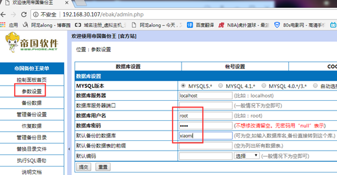

也可以在命令行连上自己的数据库：

vim /data/web/data/config.php

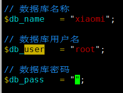

③ 把数据写到数据库中，恢复数据

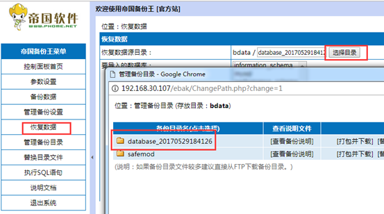

 

### 7、实验成功，登录查看

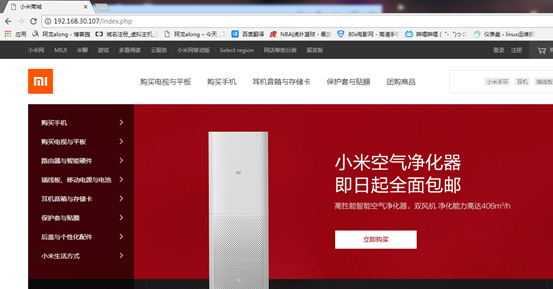

后台登录，可以自己随便修改

http://192.168.30.107/admin

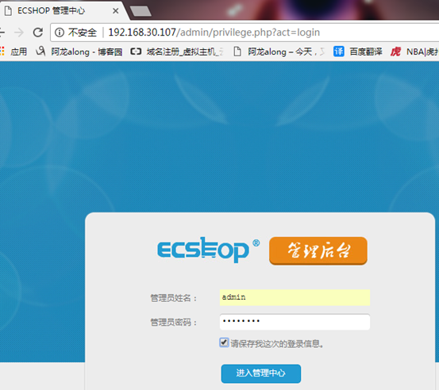

 

8、ab 可以压力测试

ab -c 100 -n 1000  http://192.168.30.107/

 

## 实验二：实现ssl 加密

（1）一个物理服务器设置一个https

### 1、创建存放证书的目录

mkdir /etc/nginx/ssl

 

### 2、自签名证书

cd /etc/pki/tls/certs/

make nginx.crt


openssl rsa -in nginx.key -out nginx2.key 因为刚私钥被加密了，为了后边方便，解密

 

### 3、把证书和私钥cp 到nginx存放证书目录

cp nginx.crt nginx2.key /etc/nginx/ssl/

cd /etc/nginx/ssl/

mv nginx2.key nginx.key 把名字改回来

 

### 4、修改配置文件，加一段server

```
server {
 　　listen 443 ssl;
 　　server_name www.along.com;
 　　ssl on;
 　　ssl_certificate /etc/nginx/ssl/nginx.crt;
 　　ssl_certificate_key /etc/nginx/ssl/nginx.key;
 　　ssl_session_cache shared:sslcache:20m;
 　　ssl_session_timeout 10m;
 }
```

 


 

### 5、测试，网页打开 https://192.168.30.7/

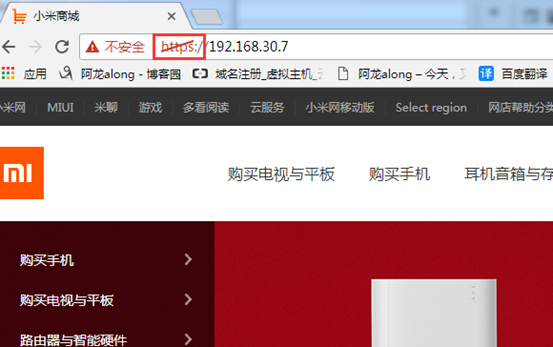

windows 信任证书

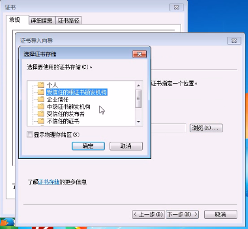

 

（2）因为nginx 强大，可以实现多个虚拟主机基于不同的FQDN 实现ssl加密，httpd不能实现

一个物理服务器设置多个https

1、生成3个证书和私钥

make nginx.crt

make nginx2.crt

make nginx3.crt

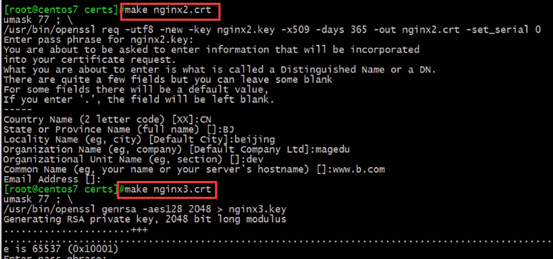

 

2、把证书和私钥cp 到nginx存放证书目录，并解开私钥的加密

cp nginx{1,2,3}* /etc/nginx/ssl/

openssl rsa -in nginx.key -out nginx.key

openssl rsa -in nginx2.key -out nginx2.key

openssl rsa -in nginx3.key -out nginx3.key

 

3、创建各自对应的访问网页

mkdir /app/website{1,2,3}

echo website1 > /app/website1/index.html

echo website1 > /app/website2/index.html

echo website1 > /app/website3/index.html

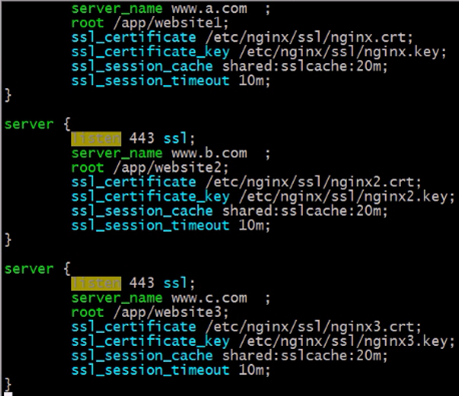

 

4、测试访问，成功

 

## 实战三：实现身份验证

### 1、生成密码账户文件

cd /etc/nginx/conf.d

htpasswd -c -m .htpasswd http1

htpasswd -m .htpasswd http2

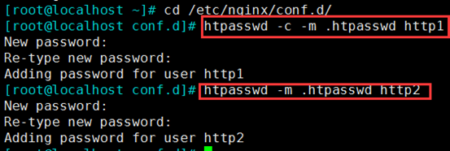

 

### 2、在配置文件中修改

vim /etc/nginx/nginx.conf 在location段中指向账户密码文件

```
location /images {
　　auth_basic "images site"; "提示字"
　　auth_basic_user_file /etc/nginx/conf.d/.htpasswd;
}
```

 

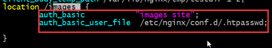

 

### 3、网页查看验证 http://172.17.22.22/images/loading.gif

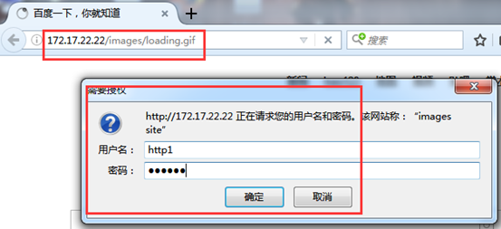