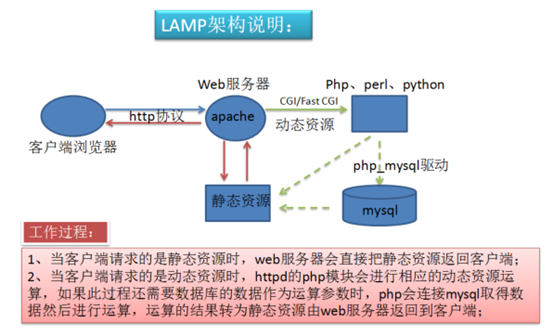
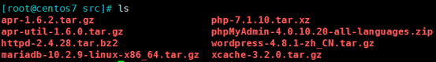
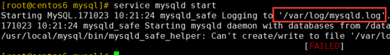
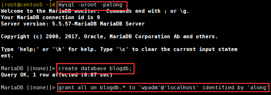
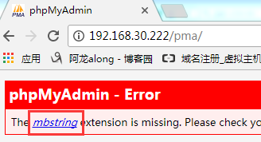
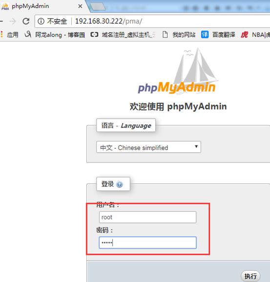
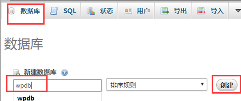
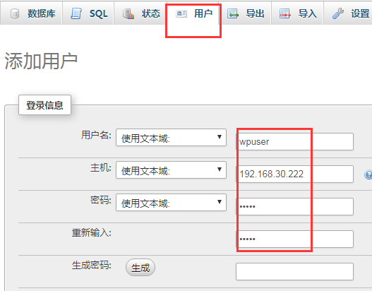
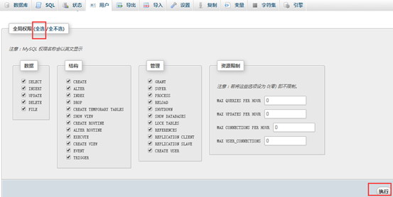
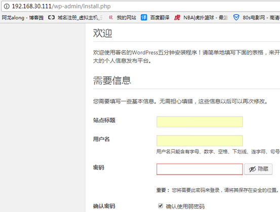

# 构建 LAMP 及 wordpress

## 一、介绍

### 1、 LAM(M)P：

```
L：linux
A：apache (httpd)
M：mysql, mariadb
M：memcached 缓存
P：php, perl, python
```

### 2、WEB 资源类型

**静态**资源：原始形式与响应**内容一致**

**动态**资源：原始形式通常为**程序文件**，需要在服务器端执行之后，将执行结果返回给客户端 

### 3、Web 相关语言

客户端技术： javascript ，html

服务器端技术：php, jsp,python 

### 4、LAMP的工作原理：



cat /etc/mime.types 查看http默认支持的文件后缀，默认不支持PHP

## 二、centos 7 编译安装LAMP，php基于模块的应用WordPress

原理：实现LAMP的全过程，php基于FPM模式：php以独立服务建立，且实现xcache加速

**注意：**一定要确保自己在纯净的环境，若有httpd、mysql、php请事先卸载

### 1、准备各个包，软件+相关的包

mkdir /root/src 准备个目录放包

① 软件包

```
apr-1.6.2.tar.gz
apr-util-1.6.0.tar.gz
httpd-2.4.28.tar.bz2
mariadb-10.2.9-linux-x86_64.tar.gz
php-7.1.10.tar.xz
phpMyAdmin-4.0.10.20-all-languages.zip
wordpress-4.8.1-zh_CN.tar.gz
xcache-3.2.0.tar.gz
```



 

② 所依赖的相关包

```shell
openssl-devel expat-devel pcre-devel #http所依赖的
bzip2-devel libxml2-devel libmcrypt-devel #php所依赖的，注意：需epel扩展源
yum -y install openssl-devel expat-devel pcre-devel
yum -y install bzip2-devel libxml2-devel libmcrypt-devel
```

### 2、编译httpd2.4（用方法一）

#### ① 解包解压缩，3个各自编译安装各自的

```
apr-1.6.2.tar.bz2
apr-util-1.6.0.tar.bz2
httpd-2.4.28.tar.bz2
```

#### ② 安装apr-1.6.2.tar.bz2

```
cd apr-1.6.2
./configure --prefix=/app/apr 执行脚本
make && make install 并行编译安装
```

#### ③ 安装apr-util-1.6.0.tar.bz2

```
cd ../apr-util-1.6.0
./configure --prefix=/app/apr-util --with-apr=/app/apr/
make -j 2 && make install
检查是否成功：ls /app/apr-util/ 
```

#### ④ 编译安装httpd-2.4

```
cd ../httpd-2.4.28
./configure --prefix=/app/httpd24 \
--enable-so \
--enable-ssl \
--enable-cgi \
--enable-rewrite \
--with-zlib \
--with-pcre \
--with-apr=/app/apr/ \
--with-apr-util=/app/apr-util/ \
--enable-modules=most \
--enable-mpms-shared=all \
--with-mpm=prefork 
```

#### ⑤ 执行脚本安装

```
make -j 4 && make install 并行，多线程编译安装
```

### 3、编译安装 http 后的设置

① 修改PATH路径，因为是编译安装

```
vim /etc/profile.d/lamp.sh
PATH=/app/httpd24/bin:/usr/local/mysql/bin/:/app/php/bin/:$PATH 顺便把后边的mysql和php的也设置进去 
. /etc/profile.d/lamp.sh 让设置生效
```

② 启动服务

```
apachectl 启动服务
ss -tnl 查看端口 
```

### 4、二进制安装mariadb-10.2.8

（1） 解包解压缩

```
tar xvf** mariadb-10.2.9-linux-x86_64.tar.gz **-C /usr/local/
```

（2） 创建mysql用户

```
useradd** **-d** /app/mysqldb **-r -m -s** /sbin/nologin **mysql**
chown mysql /app/mysqldb/
```

（3） cd /usr/local/ 发现mariadb的目录名字不符合要求

```
ln -s mariadb-10.2.9-linux-x86_64/ mysql 创建软连接也可以改名
```

（4） 创建修改配置文件

① 拷贝配置文件

```
cd /usr/local/mysql/
ls support-files/ 包里自带的有配置文件，但地方不对，要放在/etc/mysql/my.cnf
mkdir /etc/mysql
cp support-files/my-huge.cnf /etc/mysql/my.cnf
```

② 修改配置文件

```
vim /etc/mysql/my.cnf 修改配置文件
[mysqld]
datadir = /app/mysqldb //指定总目录，必须的
innodb_file_per_table = on //让每一个表数据库都是一个文件，方便管理
skip_name_resolve = on //忽略名字的反向解析，加快速度
```

（5）执行脚本，创建系统数据库

```
cd /usr/local/mysql 一定要在这个目录下执行脚本，因为脚本写死了
./scripts/mysql_install_db --user=mysql --datadir=/app/mysqldb 执行脚本
完成后就会在/app/mysqldb/ 生成mysql系统数据库
```

（6）把服务脚本复制过去

```
cp support-files/mysql.server /etc/init.d/mysqld
chkconfig --add mysqld 设置服务在哪个运行级别，在哪个运行级别开启服务
chkconfig --list mysqld
service mysqld start 失败，看失败原因：缺少日志文件，日志文件须有读写权限
```

 

（7）创建日志文件

```
mkdir /var/log/mariadb/
touch /var/log/mariadb/mariadb.log
chown mysql /var/log/mariadb/mariadb.log
service mysqld start 开启成功 
```

（8）运行安全初始化脚本

```
mysql_secure_installation
```

（9）运行mysql，创建WordPress的数据库和管理员并授权

```
mysql -uroot -peden（自己设的密码）
MariaDB [(none)]> create database blogdb;
MariaDB [(none)]> grant all on blogdb.* to 'wpadm'@'localhost' identified by 'eden' ;
```



### 5、编译安装 php-7.1.10

① 解包 tar xvf

② 执行脚本

```
cd /root/src/php-7.1.10/
./configure \
--prefix=/app/php \
--enable-mysqlnd \
--with-mysqli=mysqlnd \
--with-openssl \
--with-pdo-mysql=mysqlnd \
--enable-mbstring \
--with-freetype-dir \
--with-jpeg-dir \
--with-png-dir \
--with-zlib \
--with-libxml-dir=/usr \
--enable-xml \
--enable-sockets \
--with-apxs2=/app/httpd24/bin/apxs \ （php基于模块方式）
--with-mcrypt \
--with-config-file-path=/etc \
--with-config-file-scan-dir=/etc/php.d \
--enable-maintainer-zts \
--disable-fileinfo
```

③ 编译安装

```
make -j 4 && make install
```

④ 创建并修改php 的配置文件和服务脚本

```
cp php.ini-production /etc/php.ini
vim /app/httpd24/conf/httpd.conf
在文件尾部加两行
AddType application/x-httpd-php .php
AddType application/x-httpd-php-source .phps
修改下面行
<IfModule dir_module>
DirectoryIndex index.php index.html
</IfModule>
apachectl stop
apachectl
```

⑤ 测试

```
测试php和mariadb连接
vim /app/httpd24/htdocs/index.php
<?php
$mysqli=new mysqli("localhost","root","eden");
if(mysqli_connect_errno()){
echo "连接数据库失败!";
$mysqli=null;
exit;
}
echo "连接数据库成功!";
$mysqli->close();
phpinfo();
?> 
```

### 6、布署phpmyadmin

**注意：不要随便下载最新版，因为有的版本不支持PHP有些版本，例：4.7只支持php7.2**

#### 1、rz、解压缩，装包

```
unzip phpMyAdmin-4.0.10.20-all-languages.zip
```

#### 2、安装配置

```
cp -r phpMyAdmin-4.0.10.20-all-languages /app/httpd24/htdocs/pma/ 把文件放到//app/httpd24/htdocs下
网页打开发现确实东西 php-mbstring包
```





```
yum -y install php-mbstring
systemctl restart httpd 重启服务 
```

#### 3、在网页上设置数据库

① 登录



② 创建wpdb数据库，一会给WordPress用



③ 创建用户wpuser，



给他对wpdb数据库的全部权限



③ 加下面四行

```
AddType application/x-httpd-php .php
AddType application/x-httpd-php-source .phps
ProxyRequests Off
ProxyPassMatch ^/(.*\.php)$ fcgi://127.0.0.1:9000/app/httpd24/htdocs/$1
```

### 7、布署wordpress

① 解包解压缩

② 把所有东西移到/app/httpd24/htdocs/

```
cd /src/wordpress
mv wordpress/* /app/httpd24/htdocs/
```

③ 准备WordPress的配置文件 wp-config.php

```
cd /app/httpd24/htdocs
cp wp-config-sample.php wp-config.php
vim wp-config.php 修改4行
define('DB_NAME', 'wpdb');
define('DB_USER', 'eden');
define('DB_PASSWORD', 'eden');
define('DB_HOST', '192.168.30.222'); 
```

④ 网页打开，设置，成功



 

⑤ ab 测试性能

ab -c 10 -n 100 http://192.168.30.111/

 