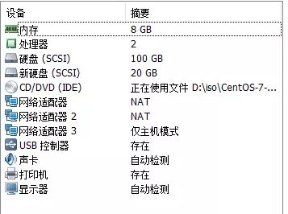
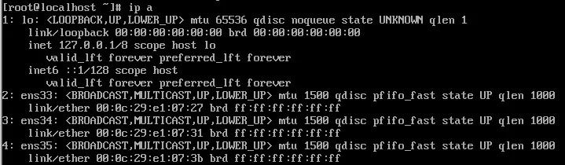
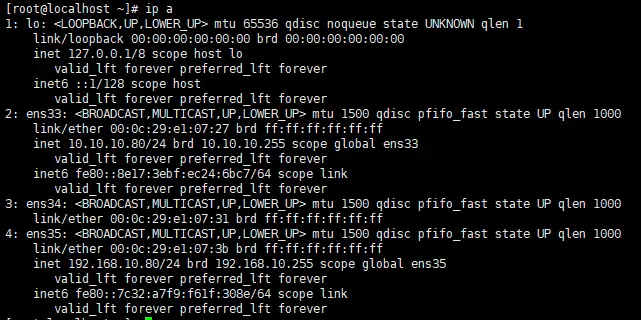
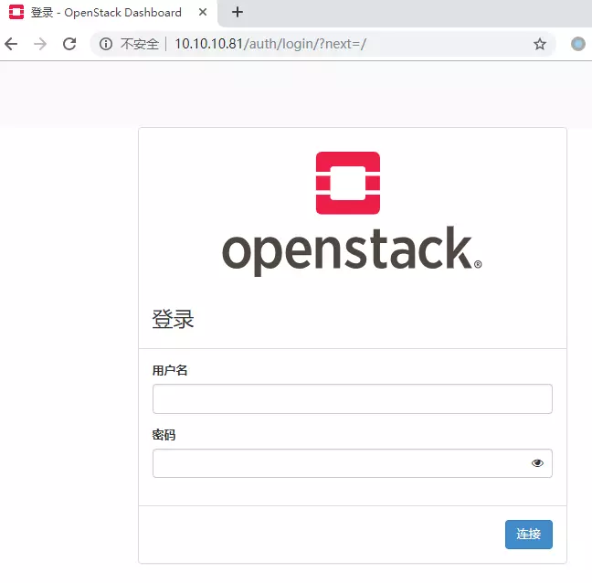
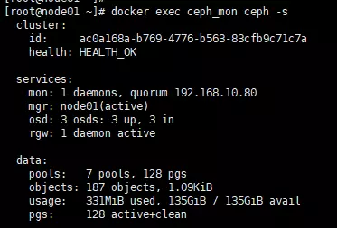

# 一、kolla-ansible 部署 openstack(vmware,all-in-one)

## 1、前言

使用vmware虚拟机充当服务器。
使用kolla-ansible工具部署opnestack单节点模式。
按照官方文档步骤安装。
镜像使用CentOS-7-x86_64-Minimal-1708.iso。
全程使用root权限操作。
已测试queens。

## 2、常见问题解决

1. Cannot uninstall 'ipaddress'. It is a distutils installed project and thus we cannot accurately determine which files belong to it which would lead to only a partial uninstall.
   此类问题强制升级此安装包即可。(已发现PyYAML,ipaddress)
   `pip install --ignore-installed ipaddress`
2. ImportError: cannot import name decorate
   `pip install -U decorator`

## 3、环境准备

### 1、启动虚拟机

配置如下：

- 内存： 8G(建议再高点)
- 处理器：2核（开启嵌套虚拟化后，虚拟机才能正常创建，这里不开暂时不影响部署）
- 硬盘：100G（系统盘） + 50GB(创建cinder lvm时使用)
- 网络：2个nat网络，1个仅主机网络（网络适配器、网络适配器2为nat，网络适配器3为仅主机模式）
- 注意关闭所有网卡的 DHCP 功能



### 2、配置网络

虚拟机启动后，网络情况如下：



上图中得ens33, ens34, ens35，3张网卡规划如下：

1. ens33: nat网卡，服务器上网用，static，配置ip，可以上网。
2. ens34: nat网卡，opnestack public网，static，不配置ip。
3. ens35: 仅主机模式网卡，opnestack管理网，static，配置ip，无法上网。

##### 编辑ens33

```shell
cp -a /etc/sysconfig/network-scripts/ifcfg-ens33{,.bak}
vi /etc/sysconfig/network-scripts/ifcfg-ens33
TYPE=Ethernet
PROXY_METHOD=none
BROWSER_ONLY=no
BOOTPROTO=static # 原dhcp
DEFROUTE=yes
IPV4_FAILURE_FATAL=no
IPV6INIT=yes
IPV6_AUTOCONF=yes
IPV6_DEFROUTE=yes
IPV6_FAILURE_FATAL=no
IPV6_ADDR_GEN_MODE=stable-privacy
NAME=ens33
DEVICE=ens33
ONBOOT=yes # 原no
# 增加如下内容
GATEWAY=10.10.10.2 # vmware nat模式得网关
IPADDR=10.10.10.80 # 与vmware nat模式网关处于同一网段
NETMASK=255.255.255.0
DNS1=114.114.114.114
```

重启网络：

```shell
systemctl restart network
```

重启后，可以ping通百度。

##### 编辑ens34

注意，此网卡不配置ip。自带得配置刚好合适，若不小心修改可参考如下配置改回原样。
`vi /etc/sysconfig/network-scripts/ifcfg-ens34`

```shell
cp /etc/sysconfig/network-scripts/ifcfg-ens33.bak  /etc/sysconfig/network-scripts/ifcfg-ens34

vim /etc/sysconfig/network-scripts/ifcfg-ens34
TYPE=Ethernet
PROXY_METHOD=none
BROWSER_ONLY=no
BOOTPROTO=dhcp
DEFROUTE=yes
IPV4_FAILURE_FATAL=no
IPV6INIT=yes
IPV6_AUTOCONF=yes
IPV6_DEFROUTE=yes
IPV6_FAILURE_FATAL=no
IPV6_ADDR_GEN_MODE=stable-privacy
NAME=ens34
DEVICE=ens34
ONBOOT=no
```

重启网络：

```shell
systemctl restart network
```

##### 编辑ens35

```shell
vi /etc/sysconfig/network-scripts/ifcfg-ens35
TYPE=Ethernet
PROXY_METHOD=none
BROWSER_ONLY=no
BOOTPROTO=static # 原dhcp
DEFROUTE=yes
IPV4_FAILURE_FATAL=no
IPV6INIT=yes
IPV6_AUTOCONF=yes
IPV6_DEFROUTE=yes
IPV6_FAILURE_FATAL=no
IPV6_ADDR_GEN_MODE=stable-privacy
NAME=ens35
UUID=7933698a-9938-4809-b6db-2f80983a2214
DEVICE=ens35
ONBOOT=yes # 原no
# 增加如下内容
IPADDR=192.168.10.80 # vmware 仅主机模式网段
NETMASK=255.255.255.0
```

重启网络：

```shell
systemctl restart network
```

##### 查看网络

```shell
ip a
```



### 3、配置 cinder 存储

虚拟机上的 50GB 硬盘在本实验中为 sdb

```shell
pvcreate /dev/sdb
vgcreate cinder-volumes /dev/sdb
```

### 4、配置加速源

##### yum 加速源(centos7 阿里源)

```shell
yum install -y wget
mv /etc/yum.repos.d/CentOS-Base.repo /etc/yum.repos.d/CentOS-Base.repo.backup
wget -O /etc/yum.repos.d/CentOS-Base.repo http://mirrors.aliyun.com/repo/Centos-7.repo
wget -O /etc/yum.repos.d/epel.repo http://mirrors.aliyun.com/repo/epel-7.repo
yum clean all
yum makecache
```

##### pip 加速源(阿里源)

```shell
mkdir ~/.pip
cat > ~/.pip/pip.conf << EOF 
[global]
trusted-host=mirrors.aliyun.com
index-url=https://mirrors.aliyun.com/pypi/simple/
EOF
```

##### docker 加速源（阿里源）

```shell
mkdir /etc/docker
cat > /etc/docker/daemon.json << EOF
{
  "registry-mirrors": ["https://jzngeu7d.mirror.aliyuncs.com"]
}
EOF
```

### 5、配置iptables

```shell
yum install iptables -y
yum install iptables-services -y
systemctl start iptables.service
systemctl enable iptables.service

iptables -F
iptables -P INPUT ACCEPT
iptables -P OUTPUT ACCEPT
iptables -P FORWARD ACCEPT
service iptables save
systemctl restart iptables.service
```

至此基础环境准备完成。

## 4、kolla-ansible 部署

参考文档： [https://docs.openstack.org/kolla-ansible/latest/](https://links.jianshu.com/go?to=https%3A%2F%2Fdocs.openstack.org%2Fkolla-ansible%2Flatest%2F)

### 1、安装软件环境

```shell
yum install -y epel-release 
yum install -y python-pip
pip install -U pip
yum install -y python-devel libffi-devel gcc openssl-devel libselinux-python
yum install -y ansible
pip install -U ansible
```

编辑ansible配置文件，在defaults中添加3个属性
`vim /etc/ansible/ansible.cfg`

```shell
[defaults]
host_key_checking=False
pipelining=True
forks=100
```

### 2、安装 kolla-ansible

```shell
pip install kolla-ansible --ignore-installed PyYAML
cp -r /usr/share/kolla-ansible/etc_examples/kolla /etc/
cp /usr/share/kolla-ansible/ansible/inventory/* /opt/
```

### 3、配置主要文件

这里有4个文件，简单介绍：

- /etc/kolla/globals.yml 决定你要装什么组件和openstack基础配置
- /etc/kolla/passwords.yml 可以定义openstack各组件得密码
- /opt/all-in-one 决定openstack组件安装得物理位置
- /opt/multinode 决定openstack组件安装得物理位置

开始配置：

1. passwords.yml。这里可使用命令生成随机码作为密码使用
   `kolla-genpwd`
2. globals.yml。
   此文件包含两部分内容：openstack基础配置，选择安装的openstack组件。
   `vim /etc/kolla/globals.yml`

```shell
kolla_base_distro: "centos"  # 基础容器镜像版本
kolla_install_type: "source"  # 源码安装方式安装组件
openstack_release: "queens"  # openstack版本，选择你需要的
network_interface: "ens35"  # 管理网使用得网卡
neutron_external_interface: "ens34"  # public网使用得网卡
kolla_internal_vip_address: "192.168.10.81"  # ha或者keepalived代理的服务内部地址。
kolla_external_vip_address: "10.10.10.81"  # ha或者keepalived代理的服务外部地址。
enable_cinder: "yes"
enable_cinder_backend_lvm: "yes"
cinder_volume_group: "cinder-volumes"
enable_horizon: "yes"
```

1. all-in-one
   不修改
2. multinode
   不修改

### 4、开始部署

```shell
kolla-ansible -i /opt/all-in-one bootstrap-servers
kolla-ansible -i /opt/all-in-one prechecks
kolla-ansible -i /opt/all-in-one deploy
```

### 5、基本使用

安装命令行工具：

```shell
pip install python-openstackclient python-glanceclient python-neutronclient
```

确认部署（会生成管理员密码等）：

```shell
kolla-ansible post-deploy
```

官方脚本，创建使用示例，可不执行：

```shell
. /usr/share/kolla-ansible/init-runonce
```

##### 执行命令

1. 导入环境变量

```shell
. /etc/kolla/admin-openrc.sh
```

1. 查看服务状态

```shell
openstack service list --long
```

##### 访问horizon

使用chrome浏览器访问ha代理的外部地址。
例如本实验浏览器输入 10.10.10.81 即可访问。
管理员用户名密码在 `cat /etc/kolla/admin-openrc.sh`中（很长的密码）



##### 日志在哪看？

/var/lib/docker/volumes/kolla_logs/_data/
每个节点在这个目录下存放了所有组件的日志，规划的很清晰。
但是这个路径是不是有点长，创建一个link吧。
创建link：

```
ln -s /var/lib/docker/volumes/kolla_logs/_data/ /var/log/kolla
```

现在可以直接到 `/var/log/kolla`目录下查看日志了。


# 二、kolla-ansible 部署 openstack(vmware，多节点，ceph存储)

## 1、前言

此文章基于上面已部署过单节点环境，有一定的基础概念。
全程使用root权限操作。
已测试queens版本。3节点，其中2个节点只部署存储和网络。存储后端使用ceph。

## 2、环境准备

### 1、整体介绍

基于vmware虚拟机搭建平台。
3台虚拟机。分别为node1（选为部署节点），node2，node3。
由于性能问题，node2和node3只作为存储和网络节点。
镜像均使用CentOS-7-x86_64-Minimal-1810.iso。

- node1:
  1. 1张nat网卡(ens33)：本机网卡
  2. 1张nat网卡(ens34)：openstack弹性ip使用的外网网卡
  3. 1张host-only网卡(ens35)：openstack管理网网卡
  4. 额外添加一块50G硬盘作为ceph存储
  5. 6G内存，2核
- node2:
  1. 1张nat网卡(ens33)：本机网卡
  2. 1张nat网卡(ens34)：openstack弹性ip使用的外网网卡
  3. 1张host-only网卡(ens35)：openstack管理网网卡
  4. 额外添加一块50G硬盘作为ceph存储
  5. 4G内存，1核
- node3:
  1. 1张nat网卡(ens33)：本机网卡
  2. 1张nat网卡(ens34)：openstack弹性ip使用的外网网卡
  3. 1张host-only网卡(ens35)：openstack管理网网卡
  4. 额外添加一块50G硬盘作为ceph存储
  5. 4G内存，1核

### 2、基础环境配置

##### 1. 网卡配置

参考单节点部署配置

- node1:
  1. ens33: 10.10.10.80
  2. ens34: 不配置ip
  3. ens35: 192.168.10.80
- node2:
  1. ens33: 10.10.10.90
  2. ens34: 不配置ip
  3. ens35: 192.168.10.90
- node3:
  1. ens33: 10.10.10.95
  2. ens34: 不配置ip
  3. ens35: 192.168.10.95

##### 2. 加速源以及防火墙配置

加速源参考单节点部署内容（配置阿里加速源）
所有节点关闭firewalld

```
systemctl disable firewalld
systemctl stop firewalld
```

3个节点均配置加速源以及iptables，此文章不配置私有仓库。

##### 3. 主机解析配置

并且在每个节点上分别修改hostname，ceph将使用此命令得结果。
node1 节点上执行：`hostnamectl --static set-hostname node1`
node2 节点上执行：`hostnamectl --static set-hostname node2`
node3 节点上执行：`hostnamectl --static set-hostname node3`

```
vim /etc/hosts
192.168.10.80 node1
192.168.10.90 node2
192.168.10.95 node3
```

##### 4. 基础软件安装（3节点均需执行）

单节点环境当中并没有手动安装docker，自动安装的版本很老。此时手动安装较新版本的docker（18.09）。
安装docker：

```
yum install -y yum-utils
yum-config-manager --add-repo http://mirrors.aliyun.com/docker-ce/linux/centos/docker-ce.repo
yum makecache fast
yum -y install docker-ce-18.09.3
systemctl enable docker
```

配置docker：
`vim /usr/lib/systemd/system/docker.service`
在[Service]中添加：

```
MountFlags=shared
```

**参考单节点部署配置 docker加速源**

重启docker：

```
systemctl daemon-reload
systemctl restart docker
```

安装其它基础软件

```
yum install -y epel-release 
yum install -y python-pip
pip install -U pip
yum install -y python-devel libffi-devel gcc openssl-devel libselinux-python
yum install -y ansible
pip install -U ansible
```

部署机操作

编辑 ansible配置
`vim /etc/ansible/ansible.cfg`

```
[defaults]
host_key_checking=False
pipelining=True
forks=100
```

安装 kolla-ansible

```
pip install --ignore-installed PyYAML
pip install kolla-ansible
cp -r /usr/share/kolla-ansible/etc_examples/kolla /etc/
cp /usr/share/kolla-ansible/ansible/inventory/* /opt/
```

##### 5. 配置免密登陆

在node01上执行如下命令：

1. 生成公私钥

```
ssh-keygen
```

1. 复制部署节点的公钥到其它节点上
   如下命令需输入密码，注意用户使用的是root

```
ssh-copy-id -i /root/.ssh/id_rsa.pub root@node1
ssh-copy-id -i /root/.ssh/id_rsa.pub root@node2
ssh-copy-id -i /root/.ssh/id_rsa.pub root@node3
```

1. 测试ssh

```
ssh node1
ssh node2
ssh node3
```

##### 6. 在node1上执行，配置 globals.yml

```
vim /etc/kolla/globals.yml

kolla_base_distro: "centos"   # 基础容器镜像版本
kolla_install_type: "source"  # 源码安装方式安装组件
openstack_release: "queens"   # openstack版本，选择你需要的
network_interface: "ens35"    # 管理网使用得网卡
neutron_external_interface: "ens34"  # public网使用得网卡
kolla_internal_vip_address: "192.168.10.81"  # ha或者keepalived代理的服务内部地址。
kolla_external_vip_address: "10.10.10.81"    # ha或者keepalived代理的服务外部地址。
enable_cinder: "yes"
enable_horizon: "yes"

# 以下为ceph配置
enable_ceph: "yes"
enable_ceph_rgw: "yes"
enable_ceph_rgw_keystone: "yes"
#ceph_target_max_bytes: ""  # 表示每个cache pool最大大小。注意，如果配置了cache盘，此项不配置会导致cache不会自动清空。cache_osd_size*cache_osd_num/replicated/cache_pool_num
#ceph_target_max_objects: "" # 表示cache pool最大的object数量
ceph_pool_pg_num: 32 # Total PGs = ((Total_number_of_OSD * 100) / pool_count / replicated . 当前环境计算结果为32
ceph_pool_pgp_num: 32
glance_backend_ceph: "yes"
glance_backend_file: "no"
cinder_backend_ceph: "yes"
cinder_backup_driver: "ceph"
nova_backend_ceph: "yes"
```

##### 7. 在node01上执行，配置 mutinode

这里直接从all-in-one复制比较方便：

```
cp /opt/all-in-one /opt/node
```

替换掉localhost：

```
sed -i "/^localhost/c node1" /opt/node
```

修改配置文件
`vim /opt/node`
将 node2 node3 添加到[network]和[storage]下。意思为 node2 node3 作为network节点和storage节点

##### 8. ceph硬盘配置

3个节点上均有一块50G得硬盘，在当前环境中为/dev/sdb
在node1上执行：

```
parted /dev/sdb -s -- mklabel gpt mkpart KOLLA_CEPH_OSD_BOOTSTRAP 1 -1
```

在node2上执行：

```
parted /dev/sdb -s -- mklabel gpt mkpart KOLLA_CEPH_OSD_BOOTSTRAP 1 -1
```

在node3上执行：

```
parted /dev/sdb -s -- mklabel gpt mkpart KOLLA_CEPH_OSD_BOOTSTRAP 1 -1
```

##### 9. 在node1上执行，ceph配置文件

目前安装kolla-ansible默认使用bluestore得ceph。这里演示使用filestore。需修改文件
`vim /usr/share/kolla-ansible/ansible/group_vars/all.yml`
修改如下属性：

```
ceph_osd_store_type: "filestore"
```

## 3、开始部署

```
# 部署操作之前检查确定所有节点主机的docker已启动

kolla-ansible -i /opt/node bootstrap-servers
#生成密码
kolla-genpwd

kolla-ansible -i /opt/node prechecks

kolla-ansible -i /opt/node deploy
```

## 4、部署完成

##### 查看ceph状态

```
docker exec ceph_mon ceph -s
```




##### 基本使用(可参考单节点)

```
pip install --ignore-installed ipaddress
pip install -U decorator 
pip install python-openstackclient python-glanceclient python-neutronclient
kolla-ansible post-deploy
cd /etc/kolla/
chmod +x admin-openrc.sh 
./admin-openrc.sh
openstack service list --long
#创建使用实例（官方使用实例）
cd /usr/share/kolla-ansible
source /etc/kolla/admin-openrc.sh
./init-runonce
```

至此部署结束。

```shell
# 启动实例无法找到启动硬盘 （OpenStack 启动虚拟机 Booting from Hard Disk）
cd /etc/kolla/nova-compute
vim nova.conf
[libvirt]
connection_uri = qemu+tcp://192.168.10.80/system
images_type = rbd
images_rbd_pool = vms
images_rbd_ceph_conf = /etc/ceph/ceph.conf
rbd_user = nova
disk_cachemodes = network=writeback
hw_disk_discard = unmap
rbd_secret_uuid = eda4636d-812a-42e5-832a-5ddcd686023c
virt_type = qemu
# 将 virt_type = kvm 修改为 virt_type = qemu

# 重启控制节点dockeer
 systemctl restart docker
# 重新登录 openstack
重启实例就可以看到问题解决了
```


## 5、ceph介绍

参考
[https://docs.openstack.org/cinder/rocky/configuration/block-storage/drivers/ceph-rbd-volume-driver.html](https://links.jianshu.com/go?to=https%3A%2F%2Fdocs.openstack.org%2Fcinder%2Frocky%2Fconfiguration%2Fblock-storage%2Fdrivers%2Fceph-rbd-volume-driver.html)

ceph基于Reliable Autonomic Distributed Object Store (RADOS)。RADOS在存储群集中分配对象并复制对象以实现容错。
RADOS包含以下主要组件：

- **ceph-osd:** Object Storage Device (OSD) Daemon，**对象存储设备服务**。ceph-osd是Ceph分布式文件系统的对象存储守护进程。 它负责将对象存储在本地文件系统上，并通过网络提供对它们的访问。必须在群集中的每个服务器上运行此守护程序。 每个OSD都可以关联硬盘驱动器。
- **ceph-mds:** Meta-Data Server (MDS)，**元数据服务**。 MDS在Ceph客户端的对象之上构建POSIX文件系统。不使用Ceph文件系统，则不需要元数据服务器。
- **ceph-mon:** Monitor (MON)，**监控服务**。轻量级守护程序，用于处理与外部应用程序和客户端的所有通信。 它还为Ceph / RADOS集群中的分布式决策提供了共识。 例如，当您在客户端上安装Ceph共享时，您指向MON服务器的地址。 它检查数据的状态和一致性。 在理想的设置中，您必须在不同的服务器上运行至少三个ceph-mon守护进程。

其它组件

- **ceph-mgr:** Ceph Manager Daemon（ceph-mgr），**管理服务**。与监视器守护程序一起运行，为外部监视和管理系统提供额外的监视和接口。
- **ceph-nfs:** 可以使用NFS-Ganesha NFS Server通过NFS协议导出CephFS命名空间。NFS-Ganesha提供了一个文件系统抽象层（FSAL）来插入不同的存储后端。Ceph对象网关可以配置为在嵌入NFS-Ganesha NFS Server时提供基于文件的访问。
- **ceph-rgw:** Ceph Object Gateway，**对象网关服务**。Ceph对象存储使用Ceph对象网关守护进程（radosgw），它是一个用于与Ceph存储集群交互的HTTP服务器。 由于它提供与OpenStack Swift和Amazon S3兼容的接口，因此Ceph对象网关具有自己的用户管理。 Ceph对象网关可以将数据存储在用于存储来自Ceph文件系统客户端或Ceph块设备客户端的数据的相同Ceph存储集群中。 S3和Swift API共享一个公共命名空间，因此您可以使用一个API编写数据并使用另一个API检索它。

## 6、常见问题及解决

参考：
[http://docs.ceph.com/docs/master/rados/troubleshooting/troubleshooting-pg/](https://links.jianshu.com/go?to=http%3A%2F%2Fdocs.ceph.com%2Fdocs%2Fmaster%2Frados%2Ftroubleshooting%2Ftroubleshooting-pg%2F)

##### 1.

```
Fetching Ceph Keyrings … No JSON Object Could be Decoded
```

此类问题为删除环境时未删除干净，所有节点上使用`docker volume ls`查看是否有未清除干净得卷。手动删除。
参考：
[https://docs.oracle.com/cd/E78305_01/E78304/html/troubleshoot-deploy-ceph.html](https://links.jianshu.com/go?to=https%3A%2F%2Fdocs.oracle.com%2Fcd%2FE78305_01%2FE78304%2Fhtml%2Ftroubleshoot-deploy-ceph.html)

##### 2.

```
pg_num 128 size 3 would mean 768 total pgs
```

类似问题为pg 数量设置不正确，根据实际情况调整大小。但不一定每次报这个问题都是数量不正确导致得。

##### 3.

若一直无法定位问题，可去容器中查看日志。
比如，日志一直报无法连接之类得，检查防火墙（iptables，firewalld）

##### 4.

在反复重装得情况下，可能触发ceph无法mount磁盘得问题。在vmware中删掉此磁盘，重新创建即可。
经测试，正确得重装姿势为：

```
kolla-ansible -i /opt/node destroy --yes-i-really-really-mean-it
等待成功后，再重新命名磁盘（前面得parted命令）
```

## 7、常用命令及解释

```
ceph -s        # 查看整体状态
ceph osd tree  # 查看osd结构，通常看是否与host对应。
ceph osd lspools     # 查看池信息
ceph health detail   # 查看健康详情
ceph osd dump    # 查看osd详情
ceph pg dump     # 查看pg详情
ceph osd crush xxxx  # 此类命令为ceph策略相关。建议了解
```

## 8、扩展知识

1. osd（filestore后端）相关
   在同一个主机有多个osd磁盘时，磁盘标签需添加后缀区分。比如2个osd：

```
parted /dev/sdb -s -- mklabel gpt mkpart KOLLA_CEPH_OSD_BOOTSTRAP_001 1 -1
parted /dev/sdc -s -- mklabel gpt mkpart KOLLA_CEPH_OSD_BOOTSTRAP_002 1 -1
```

每个osd盘都会有对应一个osd得容器。
其次，osd还可以有日志盘，缓存盘，这两个均建议为固态盘。