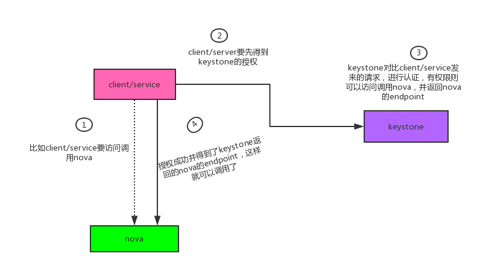
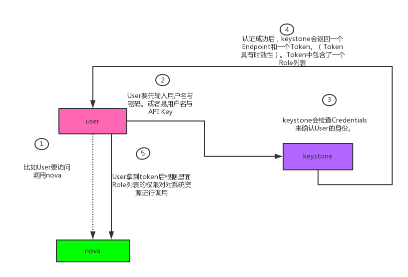
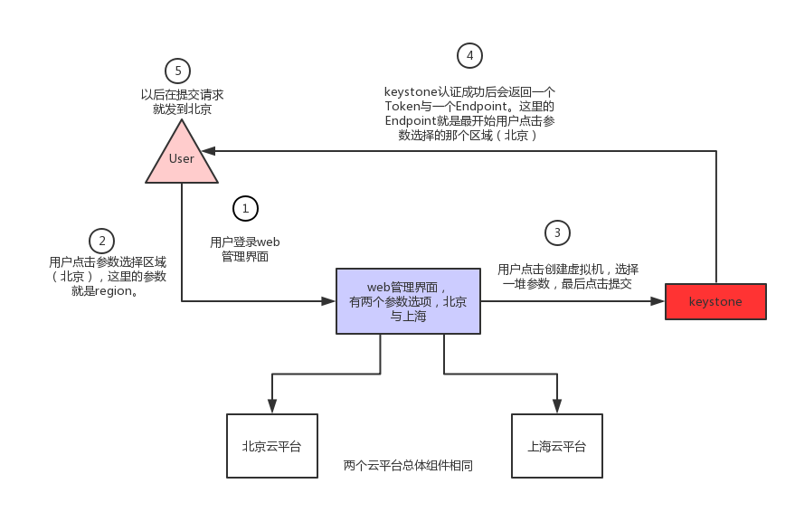

# Openstack keystone 组件详解

Keystone(OpenStack Identity Service)是 OpenStack 框架中负责管理身份验证、服务规则和服务令牌功能的模块。用户访问资源需要验证用户的身份与权限，服务执行操作也需要进行权限检测，这些都需要通过 Keystone 来处理。Keystone类似一个服务总线， 或者说是整个Openstack框架的注册表， 其他服务通过keystone来注册其服务的Endpoint（服务访问的URL），任何服务之间相互的调用， 需要经过Keystone的身份验证， 来获得目标服务的Endpoint来找到目标服务。

 

第一部分：

keystone的功能有哪些？

openstack是一个SOA架构，各个项目独立提供先关的服务，且互不依赖，如nova提供计算服务，glance提供镜像服务等。防止耦合性，且扩展性不高

实际上所有的组件都依赖keystone，

它有两个功能：

（1）用户管理：验证用户身份信息合法性

（2）服务目录管理：提供各个服务目录的（Service Catalog:包括service和endpoint）服务，无论任何服务或者客户访问openstack都要访问keystone获取服务列表，以及每个服务的endpoint

如下图，这个图只是一个简单的表达，具体里面的工作流程肯定不止这些，各位慢慢往下看

 

Keystone基本概念介绍

　　1.user：User即用户，指的是使用openstack service的用户，可以是人，服务，系统，就是说只要是访问openstack service 的对象都可以称为User

　　2.Credentials：是用于确认用户身份的凭证。说白了就是“信物”，可以是：

　　　　（1）：用户名和密码

　　　　（2）：用户名跟API Kye（秘钥）　　　　　　　　　　　　　　#（1）（2）用户第一次确认身份的方法

　　　　（3）：一个keystone分配的身份的token　　　　　　　　　　  #（3）用户已经确认身份后的方法 （token是有时间限制的）

　　3.Authentication：

　　　　（1）：用户身份验证的过程。keystone服务通过检查用户的Credentials来确定用户的身份

　　　　（2）：第一次验证身份是使用用户名与密码或者用户名与API Key的形式。当用户的Credentials被验证后，keystone会给用户分配一个Authentication token 供该用户的后续请求操作（返回的token中就包含User的Role列表）

 

 　　4.Token

　　　　（1）：是一串数字字符串，当用户访问资源时需要使用的东西，在keystone中主要是引入令牌机制来保护用户对资源的访问，同时引入PKI、PKIZ、fernet、UUID其中一个随机加密产生一串数字，对令牌加以保护

　　　　（2）：token并不是长久有效的，是有时效性的，在有效的时间内可以访问资源。

　　5.Role：

　　　　（1）：本身是一堆ACL集合，主要用于权限的划分。

　　　　（2）：可以给User指定Role，是user获得role对应的操作权限。

　　　　（3）：系统默认使用管理Role的角色 管理员用户：admin 普通用户：member（老版本） user（新版本）

　　　　（5）：user验证的时候必须带有Project。老版本叫（Tenant）

 

大体流程如下图：

 

　　6.Policy

　　　　（1）：对于keystone service 来说，Policy就是一个JSON文件，rpm安装默认是在/etc/keyston/policy.json。通过配置这个文件，keystone实现了对User基于Role的权限管理（User <-- Role（ACL） <--Policy）

　　　　（2）：Policy就是用来控制User对Project（tenant）中资源的操作权限

 

　　7.Project（Tenant）

　　　　（1）：Project（Tenant）是一个人或服务所拥有的资源集合。不同的Project之间资源是隔离的，资源可以设置配额

　　　　（2）：Project（Tenant）中可以有多个User，每一个User会根据权限的划分来使用Project（Tenant）中的资源

　　　　（3）：User在使用Project（Tenant）的资源前，必须要与这个Project关联，并且制定User在Project下的Role，一个assignment(关联) 即：Project-User-Role

 

　　8.Service　

　　　　即服务，如Nova，Glace，等各个组件

　　9.Endpoint：

　　　　（1）：用来通过访问和定位某个openstack service的地址，通常是一个URL

　　　　（2）：不同的region有不同的Endpoint（region使用与跨地域的云服务，比如像阿里云有华北，华东等等，）

　　　　（3）：任何服务都访问openstack service中的资源时，都要访问keystone

　　　　（4）：Endpoint分为三类：

　　　　　　1.admin url —>管理员用户使用 Port：35357

　　　　　　2.internal url —>openstack内部组件间互相通信 Port：5000 （组件之间通信基于Restful api）

　　　　　　3.public url —> 其他用户访问地址 Port：5000

 

　　region异地建机房，如下图

　　10.Service与Endpoint关系

　　　　（1）：在openstack中，每一个service中都有三种Endpoint：Admin、Public、Internal（创建完service后需要为其创建API Endpoint）

　　　　（2）：Admin使用者为管理员，能够修改User Project（Tenant）

　　　　（3）：public使用者为客户端，使用者在外网管理自己云服务器

　　　　（4）：internal使用者为内部组件间相互调用

　　　　（5）：三种Endpoint在网络上开放的权限也不同，Admin通常只能对内网开放，public通常可以对外网开放，internal只能对有安装openstack服务的机器开放

 

　　11.V3版本更新

　　　　1.Tenant更改为Project

　　　　2.添加了Domain（对系统资源进行限额）

　　　　3.添加了Group　（组的概念为了更好的管理用户，例如linux下对组授权，其组下面的用户也有了相应的权限）

　　　　4.member更改为user

 

 

 第二部分：

　　　　举个例子

　　　　将上面各个部分结合起来。

　　　　比如说，某公司年会组织跟团去旅游（公司相当于一个group，公司的员工相当于User）。到了晚上要住店，首先要先到前台登记（前台就相当于Keystone），对前台（keystone）来说，你要住店要拿出你的证明（对keystone来说就是要证明你是你）。

　　　　怎么办？拿出身份证，这里的身份证就相当于Credentials（用户名和密码），前台（keystone）会进行验证你的身份信息（Authentication），验证成功后，前台（Keystone）会给你一个房卡（Token），并且有不同的房卡（比如：普通卡，会员卡，白金卡等），不同的卡有不同的权限（Role），并且拿到房卡后，前台（keystone）会给你一个导航图（Endpoint）让你找到你的房间。并且一个酒店不光会有住宿服务，可能还有别的服务（service），像餐饮，娱乐，按摩等等，比如说要去吃饭，不知道路线怎么走，看一下导航图（endpoint）就知道了，到餐饮部门（service）会有三个路线（Endpoint）可以走。为什么会有三个，领导层通道 --> 走后门（admin），内部员工通道 -->（internal），客人通道  -->（public）。知道如何去，也有了权限（Token/Role）到了餐饮部门，当你点餐的时候，会让你刷上你的会员卡（这个步骤就是service像keystone确认你有没有权限），验证成功后，你就可以点餐吃饭

　　图片理解

 

**第三部分**

　　官方介绍

　　　　1.User：has account credentials, is associated with one or more projects or domains

　　　　　　　　 user是账户凭证，是与一个或多个项目或相关的域

　　　　2.Group: a collection of users, is associated with one or more projects or domains

　　　　            group就是用户的一个集合，与一个或多个项目或相关的域

　　　　3.Project(Tenant)： unit of ownership in OpenStack, contains one or more users

　　　　　　　　project(tenant)是一个单位，指在openstack中可用的资源，它包含一个或多个用户

　　　　4.Domain：unit of ownership in OpenStack, contains users, groups and projects

　　　　　　　　domain是一个单位，它包含用户、组和项目

　　　　5.Role：a first-class piece of metadata associated with many user-project pairs

　　　　　　　　role一个用户与project相关联的元素据

　　　　6.Token：identifying credential associated with a user or user and project

　　　　　　　　Token鉴定凭证关联到用户或者用户和项目

　　　　7.Extras：bucket of key-value metadata associated with a user-project pair

　　　　　　　　extras关于用户-项目的关系，还可以设置一些其他的属性

　　　　8.Rule:describes a set of requirements for performing an action

　　　　　　　　rule描述了一组要求 执行一个动作

 

 

**第四部分**

　　工作流程（以创建一个VM为例）

　　

上面的图主要是讲述keystone在各个组件之间的作用，先不要去想别的组件是如何工作的。通过上面那幅图可以看出来keystone在各个组件间扮演着一个中间人的作用，每个服务于服务间使用或者某个用户与服务间的使用，都要先到keystone这里来报道！

 

**第五部分**

　　官方介绍

 

　　**详解**

　　　　1.用户/API 想创建一个实例，首先会将自己的credentials发给keystone。认证成功后，keystone会颁给用户/API一个临时的令牌(Token)和一个访问服务的Endpoint。 PS:Token没有永久的

　　　　2.用户/API 把临时Token提交给keystone，keystone并返回一个Tenant(Project)

　　　　3.用户/API 向keystone发送带有特定租户的凭证，告诉keystone用户/API在哪个项目中，keystone收到请求后，会发送一个项目的token到用户/API  PS：第一个Token是来验证用户/API是否有权限与keystone通信，第二个Token是来验证用户/API是否有权限访问我keystone的其它服务。用户/API 拿着token和Endpoint找到可访问服务

　　　　4.服务向keystone进行认证，Token是否合法，它允许访问使用该服务（判断用户/API中role权限）？

　　　　5.keystone向服务提供额外的信息。用户/API是允许方法服务，这个Token匹配请求，这个Token是用户/API的

　　　　6.服务执行用户/API发起的请求，创建实例

　　　　7.服务会将状态报告给用户/API。最后返回结果，实例已经创建

 