# VLAN,GRE,VXLAN

**VLAN介绍**

　　局域网LAN（多个机器连接一个Hub或者Switch），是一个广播域

　　VLAN：一台Switch划分出多个虚拟机的LAN，每个vlan中的主机连接交换机的端口是access口，从而保证了交换机只在同一个vlan中转发包

　　IEEE802.1Q标准定义了VLAN Header的格式。他在普通以太网帧结构的SA(src addr)之后键入了4bytes的VLAN tag/Header数据，其中12-bits的VLAN ID。VLAN ID最大值为4096，但是有效值范围是1-4094

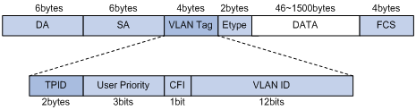

带vlan的交换机端口分：

　　access口

　　trunk口

两台交换机通过一个线连接，线的两头都是trunk口，可以转发多个vlan信息

 

**vlan类型**

　　基于port的vlan（数据帧种不包含vlan tag，vlan信息从交换机的端口pvid（Port-base Vlan ID）上得知，交换机转发包也基于此）

　　基于tagged vlan（数据帧中包含vlan tag，vlan信息从数据帧内包含的vlan信息，交换机需要有对该数据帧拆包/封包的能力，即连接到这种端口的网络设备必须是8021.Q

**VLAN不足**

1.4kvlan上限：才12个bits的vlan id，代表最多也只能有4096个隔离的网络，你单瞅瞅阿里云也应该明白，只有4096个网络是远不够用的

2.vlan是基于l2的，很难跨越二层的局限（很难跨地域），限制了网络的灵活性，

3.vlan的操作需要人工介入太多

上述三条在小公司，云平台规模不大的情况下，反而 会是一种优势，但是在大规模的云平台下这三点则是缺点

 

**交换机的基础知识**

mac地址学习

apr原理

**openvswitch+vlan组网**

　　1.管理网络：用于openstack节点之间通信，假设VLAN ID 范围为50-100.

　　2.数据网络：用于虚拟机之间通信，由于valn模式下，租户建立的网络都是具有独立的vlan id，故需要将连接虚拟机的服务器的交互机端口设置为Trunk模式，并且设置所允许的VLAN ID 范围，比如100-300

　　3.外部网络：用于连接外部网络。加上VLAN ID 范围为1000-3000

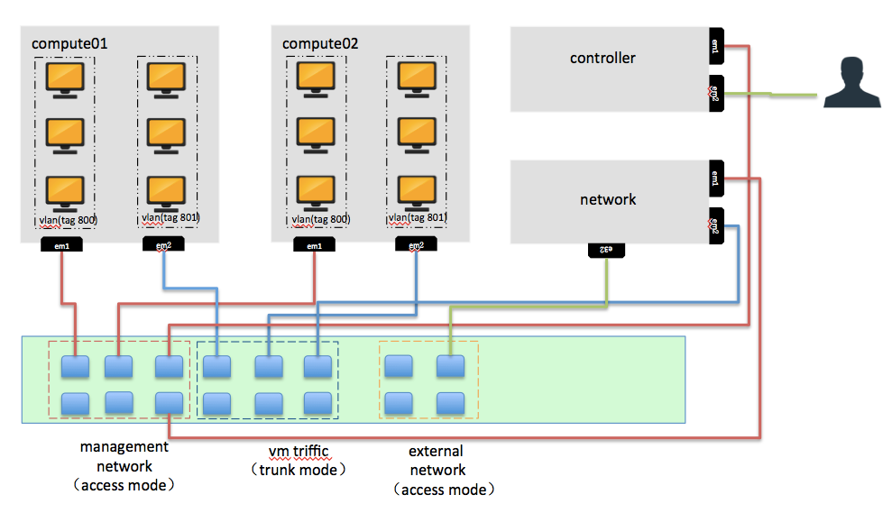

 

 **neutron vlan模式虚拟机网络**　　****

 

 

neutron在该计算节点上做的事情：

　　创建了OVS Integration bridge br-int。它的四个Access口中，两个打上了内部vlan Tag1，连接接入network1的两个网卡；另外两个端口打上的是vlan tag 2

　　创建一对patch port连接br-int和br-eth1

　　设置br-int中的flow rules。对从access ports进入的数据帧，加上相应的vlan tag，转发到patch port；从patch port进入的数据帧，将vlan id 101修改为1,102修改为2，再转发到相应的access ports

　　设置br-eth1中的flow rules。从patch port进入的数据帧，将内部vlan id 1修改为101，内部vlan id 2修改为102，再从eth1端口发出。对从eht1进入的数据帧做相反的处理

 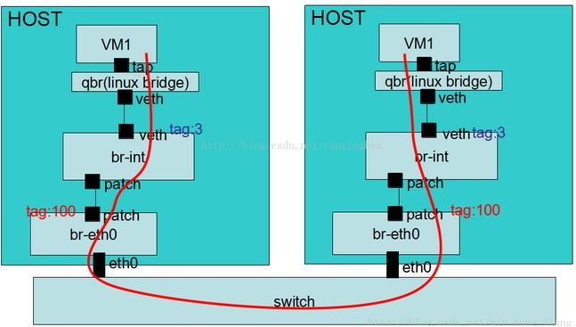

 

 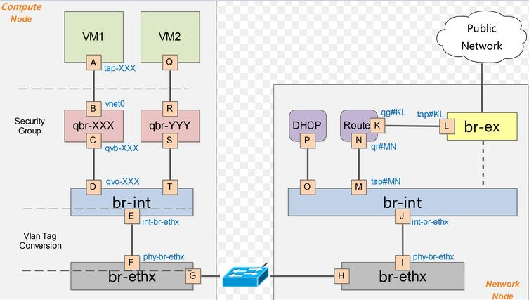

 

 **隔离的概念**

　对比阿里云来说，隔离的概念很好理解

　不同的tenant是隔离的

   同一tenant下不同的子网也是隔离的

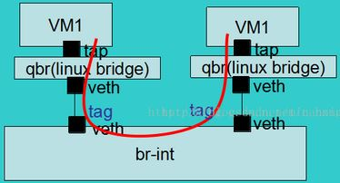

 

**隔离的网络直接可以通过路由来进行通信**

 

 

 

# neutron openvswitch+gre/vxlan虚拟网络

GRE全称是Generic Routing Encapsulation，是一种协议封装的格式

 

**GRE相对于VLAN的优点：**

　　1.突破了二层网络的限制，基于IP协议，虚拟的二层真实的三层

　　2.数据中心网络在物理级别上支持不了云计算的规模（大量的mac地址表，arp表..）但是使用GRE就可以突破这个问题，基于IP协议，不基于以太网协议

**GRE不足：**

　　1.点对点，所有的计算机节点和网络节点都会建立GRE Tunnel，规模扩大，效率极其的低下

 　  2.扩大的广播域，GRE不支持组播，一个网络(GRE Tunnel ID一样)中的一个vm发出广播帧后，GRE会将其广播到所有与该节点有隧道连接的节点。

　　3.GRE封装的IP包的过滤和负载均衡问题

　　目前还是有很多防火墙和三层网络设备无法解析GRE Header，因此他们无法对GRE封装包做合适的过滤和负载均衡

 

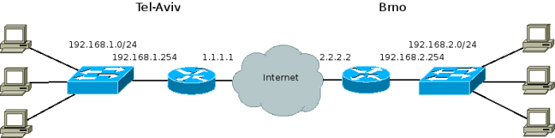

当A（192.168.1.1） ping B（192.168.2.1）时，报文是如下形式的：

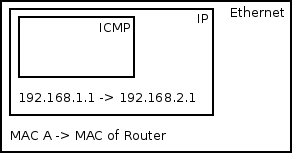从A到RA

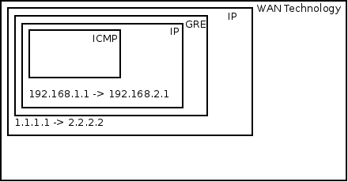 从RA到RB

选自：<http://www.cnblogs.com/xingyun/p/4620727.html>

 

 

**VXLAN：**

　　vxlan主要用于封装，转发2层报文。vxlan全称Virtual eXtensible Local Area Network,简单的说就是扩充了LVAN，其使得多个通过三层连接的网络可以表现的和直接通过一台一台物理交换机连接配置而成的网络一样处在一个LAN种

　　它的实现机制是，将二层报文中加上个Vxlan Header，封装在一个UDP包中进行传输。VxLAN header会包括一个24位的ID（称为VNI），含义类似于VLAN id 或者GRE的tunnel id。GRE一般是通过路由器进行GRE协议的封装和解封的，在VXLAN中这类封装和解封的组件有个专有的名字叫做VTEP。相比起VLAN来说，好处在于其突破了VLAN自由4000+子网的限制，同时架设在UDP协议上后其扩展行提高了不少（因为UDP是高层协议，屏蔽了底层的差异，换句话说屏蔽了二层的差异）

 

 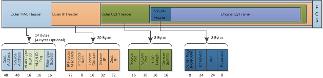

报文走向：

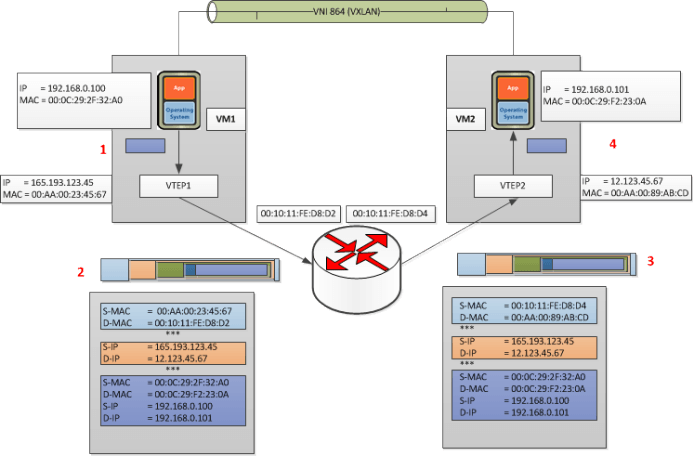

选自：<http://www.cnblogs.com/xingyun/p/4620727.html>

 

VXLAN和GRE都是虚拟的二层物理的三层，arp广播也可以通过物理的三层取转发，这样效率就低了，于是有SDN和l2population Driver 

 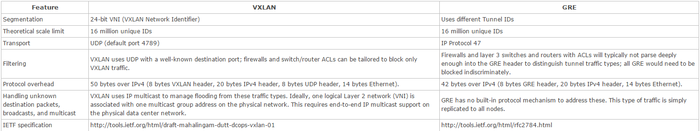

选自：<http://www.cnblogs.com/linhaifeng/p/6619142.html#_label2>

 

**关于gre和vxlan二次封装数据包的MTU问题**

 

 VXLAN 模式下虚拟机中的 mtu 最大值为1450，也就是只能小于1450，大于这个值会导致 openvswitch 传输分片，进而导致虚拟机中数据包数据重传，从而导致网络性能下降。GRE 模式下虚拟机 mtu 最大为1462。

计算方法如下：

- vxlan mtu = 1450 = 1500 – 20(ip头) – 8(udp头) – 8(vxlan头) – 14(以太网头)
- gre mtu = 1462 = 1500 – 20(ip头) – 4(gre头) – 14(以太网头)

可以配置 Neutron DHCP 组件，让虚拟机自动配置 mtu，

\#/etc/neutron/dhcp_agent.ini [DEFAULT] dnsmasq_config_file = /etc/neutron/dnsmasq-neutron.conf#/etc/neutron/dnsmasq-neutron.conf dhcp-option-force=26,1450或1462

重启 DHCP Agent，让虚拟机重新获取 IP，然后使用 ifconfig 查看是否正确配置 mtu。

 