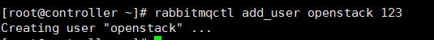
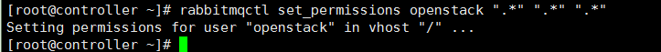

# openstack中间件message queue 与memcached环境部署


**为什么要安装中间件**

组件间的通信使用的是REST API 而组件内部之间的通信则是使用的中间件

首先登陆openstack的官网查看官方文档

[www.openstack.org](http://www.openstack.org/)

应为在部署一个架构之前我们都需要部署一下环境，之前的文档中并没有写，这篇文档也没有过多的详细介绍，简单的部署了一下memcached和message queue（消息中间件）。再后面我会总结一个完整版的。

 

**安装message queue**

按照官方文档

<https://docs.openstack.org/newton/install-guide-rdo/environment.html>

第一步yum安装软件

```
yum install rabbitmq-server -y
```

第二步设为开启自启并启动

```
systemctl enable rabbitmq-server.service
systemctl start rabbitmq-server.service
```

第三步创建账号与密码



创建用户openstack 密码为123

```
rabbitmqctl add_user openstack "密码"
```

第四步设置权限

```
rabbitmqctl set_permissions openstack ".*" ".*" ".*"
　　　　　　　　　　　　　　　　 #用户“openstack” 权限可读、可写、可执行
```

设置成功



 

 **安装memcached**

第一步yum安装

```
yum install memcached python-memcached -y
```

 

 第二步设为开机启动并启动