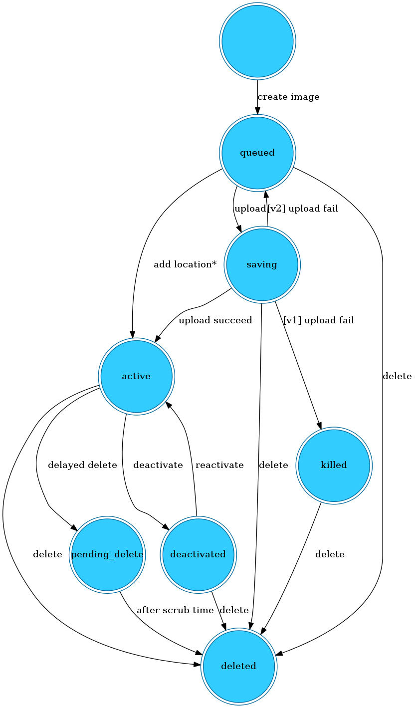
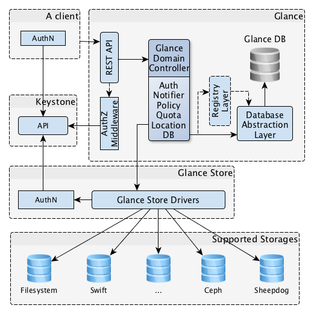

# openstack之Glance介绍

glance即image service（镜像服务），是为虚拟机的创建提供镜像服务

 

**为什么要有Glance**

我们基于openstack是构建基本的Iaas平台对外提供虚机，而虚机在创建的时候必须为其选择操作系统，glance服务器就是为该选择提供不同的系统镜像

 

**Glance的功能**

glance服务使用户能够发现，注册，检索虚拟机的镜像，它提供一个能够查询虚拟机镜像元数据和检索真实镜像的REST API

具体的：REST API的体现就是一个URI，而在glance中通过一个URI地址来唯一标示一个镜像的形式如下

```
<Glance Server Location>/v1/images/<ID>
```

<Glance Server Location>：glance服务安装的位置

/v1:使用v1版本

/images:请求的类型为镜像

/<ID>:一个uuid，在glance中全局唯一

 

**Glance的两个版本**

在Newton之前的版本中，glance支持两种REST API V1和V2，两者区别还是很明显的：

　　1.V1只提供了基本的image和member操作功能：创建镜像、删除、下载、列表、查询、更新，以及镜像tenant成员的创建、删除和列表。

　　2.V2除了支持V1的所有功能外，主要还增加了如下功能：

　　　　镜像location的添加、删除和修改等操作

　　　　metadata namespace操作

　　　　image tag操作

　　3.V1和V2对image store的支持是相同的。

Newton版本中V1已经属于老版本了，以后终将被移除

镜像上传的存储方式有多种：Swift、File system、 Amazon S3、HTTP、Ceph、Cinder等

 

**镜像的数据存放**

镜像的数据包括：镜像元数据和镜像本身

其中镜像的元数据是通过glance中的一个glance-registry模块保存的数据库中，而镜像本身则是通过glance中的Glance store Divers存放到各种存储设备中。

 

这次试验我使用的是file system作为后端的存储，即将镜像存放到本地文件系统中。上传或存储镜像的目录位于安装glance服务的机器上的默认目录:/var/lib/glance/images/,我们应该确认该目录有足够大的空间可以使用。

需要特别强调的一点是：file后端通常位于控制节点本身，因而这种后端并不适用于多节点部署

 

**镜像的访问权限**

public 公共的：可以被所有的项目使用。

private 私有的/项目的：只能被image owner所在的project使用（即只能在一个项目中使用）

shared 共享的：一个非共享的image可以共享给其他project。

protected 受保护的：protected的image不能被删除

 

**镜像及任务的各种状态**

下图为官网图



注解：

　　queued：没有上传image数据，只有db中的元数据

　　saving：正在上传image data。

　　active：当镜像上传完毕，镜像就可以被使用，此时属于active

　　deactivated：表示任何非管理员用户都无权访问镜像数据，禁止下载镜像，也禁止镜像导出和镜像克隆之类的操作（请求镜像数据的操作）

　　killed：表示上传过程中发生错误，并且镜像不可读

　　deleted：glance已经保存了该镜像的数据，但是该镜像不在可用，处于该状态的镜像将在不久后被自动删除

　　pending_delete：与delete想说，glance还没有清除镜像数据，处于该状态的镜像不可恢复

 

PS：上面的一些含义简单了解下就可以。在命令行中不常见，只有在安装的horizon后出现图形化界面后会有显示

 

**glance包含的组件**

**glance-api**

接受api请求，并提供相应操作，包括发现、检索、存储

**glance-registry**

存储、处理、检索镜像的元数据，元数据包括例如镜像大小、类型等

**Database**

可以选择组件喜欢的数据库存储进行元数据，大多数使用MySQL或者SQLite.

Storage repository for image files

指的是存储镜像文件的仓库或者称为backend，可以是：

1本地文件存储（或者任何挂载到glance-api控制节点的文件系统）

2.对象存储Object Stroage（Swift）

3.块存储RADOS（ceph）

4.VMware数据存储

5.HTTP

 

**Glance与Openstack与其他服务的关系**

对glance来说，他的客户端Glance Cli可以是：

1.glance的命令行工具

2.Horizon

3.nova

同keystone一样，glance是Iass的另外一个中心，keystone是关于权限的中心，而glance是关于镜像的中心。glance可以被终端用户或者nova服务访问：接受磁盘或者镜像的API请求和定义镜像元数据的操作

 

**Glance工作流程详解**

**管网图**

****

注解：

**A client**

使用glance服务的应用程序，可以是命令行工具，horizon，nova等

 

**REST API**

glance是一个client-server架构，提供一个REST API，而使用者就是通过REST API来执行关于镜像的各种操作

 

**Glance Domain Controller**

glance内主要的中间件实现，相当于调度员，作用是将glance内部服务的操作分发到各层（Auth认证，Notifier，Policy策略，Quota，Location，DB数据库连接）具体任务由每个层实现。

　　第一层：Auth

　　验证镜像自己或者它的属性是否可以被修改，只有管理员和镜像的拥有者才可以执行修改操作，否则保存。

 

　　第二层：Property protection

　　由glance domain controller控制的七层组件

　　可选层，只有在glance的配置文件中设置了property_protection_file参数才会生效，它提供了两种类型的镜像属性：

　　1.核心属性，是在镜像参数中指定的；

　　2元数据属性，是任意可以被附加到一个镜像上的key/value

　　该层的功能就是通过调用glance的public API来管理对meta属性的访问，你也可以在它的配置文件中限定这个访问

 

　　第三层：Notifier

　　把下列信息添加到queue队列中

　　1.关于所有镜像修改的通知

　　2.在使用过程中发生的所有的异常和警告 

 

　　第四层：Policy

　　1.定义操作镜像的访问规则rules，这些规则都定义在/etc/policy.json文件中

　　2.监控rules的执行

 

　　第五层：Quota

 　  如果针对一个用户，管理员为其规定好他能够上传的所有镜像的大小配额，此处的Quota层就是用来检测用户上传是否超出配额限制：

　　1.如果没有超出配额限制，那么添加镜像的操作成功

　   2.如果超出了配额，那么添加镜像的操作失败并且报错。

 

　　

　　第六层：Location

　　与Glance Store交互，如上传下载等。由于可以有多个存储后端，不同的镜像存放的位置都被该组件管理。

　　1.当一个新的镜像位置被添加时，检测该URI是否正确。

　　2.当一个镜像位置被改变时，负责从存储中删除该镜像。

　　3.阻止镜像位置的重复

 

　　第七层：DB

　　1.实现了与数据库API的交互

　　2.将镜像转换为相应的格式以记录在数据库中。并且从数据库接收的信息转换为可操作的镜像对象。

 

**Registry Layer**

可选层，用来组织安全

通过使用这个单独的服务，来控制Glance Domain Controller与Glance DB之间的通信

 

**Clance DB**

glance服务使用同一一个核心库Glance DB，该库对glance内部所有依赖数据库的组件来说是共享的。

 

**Glance Store**

用来组织处理Glance和各种存储后端的交互

所有有的进行文件操作都是通过调用Glance Store库执行的，它负责与外部存储端和（或）本地文件存储系统的交互。

Glance Store提供了一个统一的接口来访问后端的存储

 

Disk和Container格式

当我们添加一个镜像到glance时，你必须指定虚拟机的disk格式和container格式，关于disk格式请自行研究kvm等虚拟。

disk和container格式是每个部署的基本配置，常用的格式如下：

**1.Disk Format**

不同的虚拟化应用的厂针有不同的虚拟机镜像的disk格式：

- **raw**

  This is an unstructured disk image format

- **vhd**

  This is the VHD disk format, a common disk format used by virtual machine monitors from VMware, Xen, Microsoft, VirtualBox, and others

- **vhdx**

  This is the VHDX disk format, an enhanced version of the vhd format which supports larger disk sizes among other features.

- **vmdk**

  Another common disk format supported by many common virtual machine monitors

- **vdi**

  A disk format supported by VirtualBox virtual machine monitor and the QEMU emulator

- **iso**

  An archive format for the data contents of an optical disc (e.g. CDROM).

- **ploop**

  A disk format supported and used by Virtuozzo to run OS Containers

- **qcow2**

  A disk format supported by the QEMU emulator that can expand dynamically and supports Copy on Write

- **aki**

  This indicates what is stored in Glance is an Amazon kernel image

- **ari**

  This indicates what is stored in Glance is an Amazon ramdisk image

- **ami**

  This indicates what is stored in Glance is an Amazon machine image

**2.Container Format**

容器container格式是指虚拟机映像是否包含一个文件格式，该文件格式还包含有关实际虚拟机的元数据。

需要注意的是：容器格式字符串在当前并不会被glance或其他OpenStack组件的使用，所以如果你不确定，简单的将容器格式指定bare是安全的。

你可以设置如下容器格式：

- **bare**

  This indicates there is no container or metadata envelope for the image

- **ovf**

  This is the OVF container format

- **aki**

  This indicates what is stored in Glance is an Amazon kernel image

- **ari**

  This indicates what is stored in Glance is an Amazon ramdisk image

- **ami**

  This indicates what is stored in Glance is an Amazon machine image

- **ova**

  This indicates what is stored in Glance is an OVA tar archive file

- **docker**

  This indicates what is stored in Glance is a Docker tar archive of the container filesystem