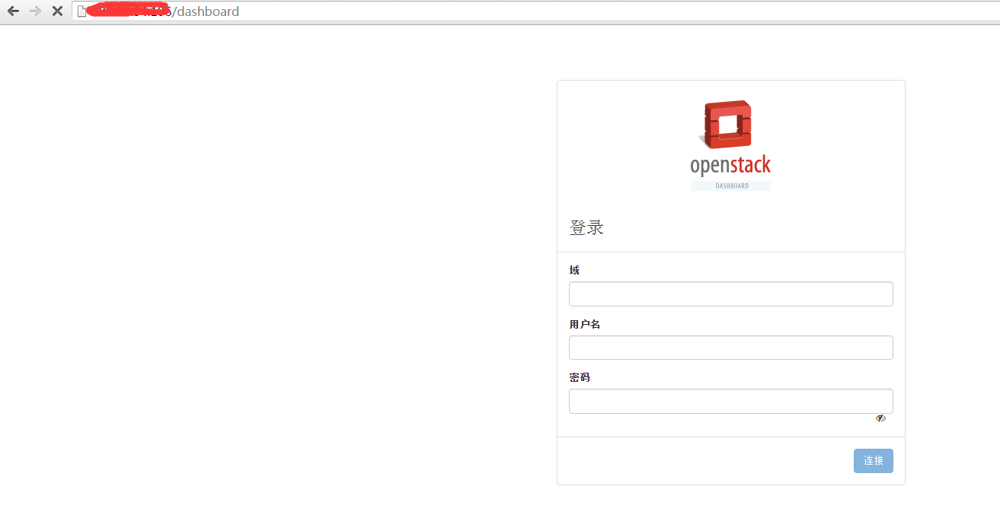
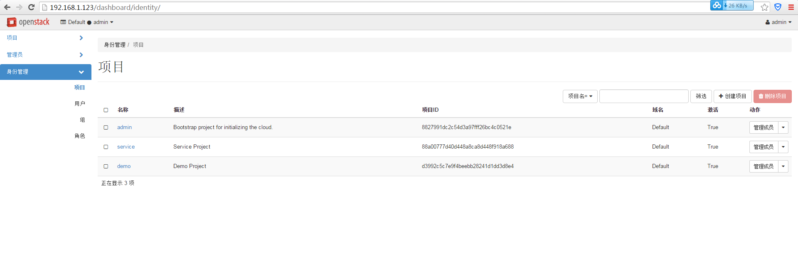
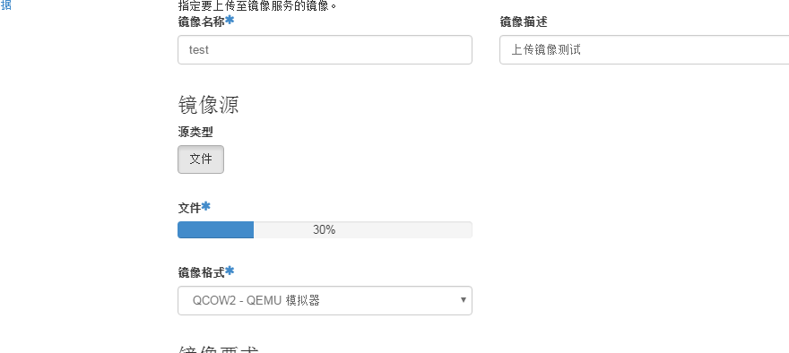
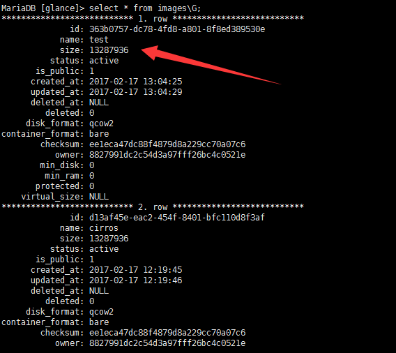
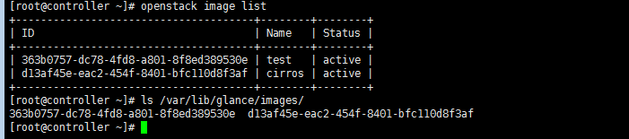
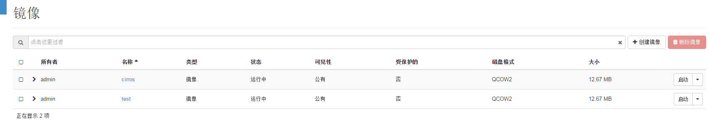

# openstack之horizon部署

登录官网

[www.openstack.org](http://www.openstack.org/)

查看安装文档

<https://docs.openstack.org/newton/install-guide-rdo/horizon.html>

第一步yum安dashboard

```
yum install openstack-dashboard -y
```

第二步编辑配置文件/etc/openstack-dashboard/local_settings

```
OPENSTACK_HOST = "controller"
ALLOWED_HOSTS = ['*', ]
SESSION_ENGINE = 'django.contrib.sessions.backends.cache'
```

注意这个配置在文件中并没有，需要自己手动添加一个

继续修改

```
OPENSTACK_KEYSTONE_URL = "http://%s:5000/v3" % OPENSTACK_HOST
OPENSTACK_KEYSTONE_MULTIDOMAIN_SUPPORT = True
#将这个配置打开并修改为True，因为我们要建立多个域。
OPENSTACK_API_VERSIONS = {
    "identity": 3,　　　　　　　　#认证版本
    "image": 2,　　　　　　　　　　#镜像版本
    "volume": 2,　　　　　　　　　 #属于cinder服务，版本也是2
}
```

继续修改

```
OPENSTACK_KEYSTONE_DEFAULT_DOMAIN = "default"
#开启默认的域
OPENSTACK_KEYSTONE_DEFAULT_ROLE = "user"
#默认的角色，配置文件中的是member属于老版本，这里我们改为user
```

[](javascript:void(0);)

```
OPENSTACK_NEUTRON_NETWORK = {
    ...
    'enable_router': False,
    'enable_quotas': False,
    'enable_distributed_router': False,
    'enable_ha_router': False,
    'enable_lb': False,
    'enable_firewall': False,
    'enable_vpn': False,
    'enable_fip_topology_check': False,
}
#关联网络组件。应为没有说到，所以不需要修改。
```

[](javascript:void(0);)

```
TIME_ZONE = "TIME_ZONE
#时间服务，不休要修改，默认是UTC
```

 

 ok到这里dashboard就配置完了，然后重启httpd服务和memcached服务





 这个就是控制台的页面，在里面可以进行一些服务的操作等等。

我们只安装了一个glance组件 所以我们在控制上上传一个镜像

 

上传镜像的名称，描述，文件的位置 还有文件的格式等等



开始上传

 



元数据已经保存到数据库中了，实体文件还需要等待一会

在命令行中已经可以看见数据



 

经过了一段时间的等待终于上传完毕



 

ok  到这里 dashboard就算安装完毕了。之后的组件安装完成后 只要重启一下httpd在登录控制台就可以看到新扩展的组件了 

 