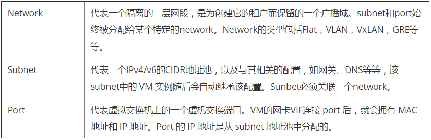
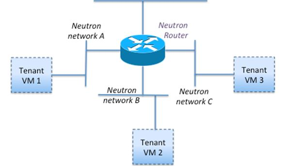

# openstack之neutron

**Neutron**

　　neutron主要就是用于网络虚拟化，之前将nova的时候说过，网络部分没有写，因为openstack中的网络属于一个大部分，所以今天咱们就来看看neutron到底是怎么样实现网络虚拟化的

 

**Neutron包含的组件：**

　　neutron-server

　　neutron-plugin

　　neutron-agent

 

**neutron各组件详解：**

　　neutron-server可以理解为类似于nova-api那样的一个组件，一个专门用来接收neutron REST API调用的服务器。负责将不同的rest api发送到不同的neutron-plugin

　　neutron-plugin可以理解为不同网络功能实现的入口，现在大部分都是软件定义网络，各个厂商都开发自己的plugin(插件)。neutron-plugin接收netron-server发过来的rest api，向neutron database完成一些信息注册（比如用户要建端口）。然后将具体要执行的业务操作和参数通知给自身对应的neutron-agent

　　neutron-agent可以直观的理解为neutron-plugin在设备上的代理，接受相应的neutron-plugin通知的业务操作和参数，并转换为具体的设备级操作，以指导设备的动作。当本地设备发生问题时，neutron-agent会将情况通知给neutron-plugin（说白了就是neutron-server就是与各个组件交互的，接收请求，neutron-plugin是操作数据库的，neutron-agent就是具体干活的）

　　neutron database就是数据库，一些业务相关的参数都存在这里

 

neutron-plugin分为core-plugin个service-plugin两类（我们主要研究core-pulgin）

Core-plugin，在neutron中有一个Core-plugin叫做ML2（Modular Layer 2），就是负责管理L2的网络连接（二层交换机概念）。ML2中主要包括network,subent,port三类核心资源，对三类资源进行操作的REST API被neutron-server看做Core API 由neutron原生支持，其中

**注意\**：学习openstack重中之重network的类型包括：Flat，Vlan，Vxlan，GRE，还有一个local 五种网络模式指的是二层网络**

Service-plugin，即为出Core-plugin以外的其它的plugin，包括L3router，firewall，loadblancer，vpn，metering等等，主要实现L3-L7的网络服务。

Neutron对Quantum（neutron的原名）的插件机制进行了优化，将各个厂商L2插件中独立的数据库实现提取出来，作为公共的ML2插件存储租户的业务需求，使得厂商可以专注于L2设备驱动的实现，而ML2作为总控可以协调多厂商L2设备共同运行”。在Quantum中，厂家都是开发各自的Service-plugin，不能兼容而且开发重复度很高，于是在Neutron中就为设计了ML2机制，使得各厂家的L2插件完全变成了可插拔的，方便了L2中network资源扩展与使用。ML2可以支持在一个环境中同时运行五种模式

 

（注意，以前厂商开发的L2 plugin跟ML2都存在于neutron/plugins目录下，而可插拔的ML2设备驱动则存在于neutron/plugins/ml2/drivers目录下）

 

**一般而言，neutron-server和各个neutron-plugin部署在控制节点或者网络节点上，而neutron-agent则部署在网络节点上和计算节点上。我们先来分析控制端neutron-server和neutron-plugin的工作，然后在分开分析设备端neutron-agent的工作**

 

**网络虚拟化**

实际数据中心网络可分为三层：

　　openstack Cloud network：openstack所管理的网络

　　既往intranet(external network)：数据中心所管理的网络

　　以及真正的外部网络internet，由各大运行商所管理的公共网络

openstack的网络可以是：

　　1.管理网络：包含api网络（public，admin，和internal）各个组件之间的协同工作。

　　2.数据网络

　　3.存储网络

　　4.IDRAC网络

　　5.PXE网络

**总结：openstack --> external --> （NAT） -->internet**

 

**neutron网络虚拟化简介**

　　openstack中neutron组件负责咋物理网络环境智商提供满足多租户要求的虚拟化网络和服务 

Neutron 提供的网络虚拟化能力包括：

　　1.二层到七层网络的虚拟化：L2（virtual switch）、L3（virtual Router 和 LB）、L4-7（virtual Firewall ）等

　　2.网络连通性：二层网络和三层网络

　　3.租户隔离性

　　4.网络安全性

　　5.网络扩展性

　　6.REST API

　　7.更高级的服务，包括 LBaaS，FWaaS，VPNaaS 等

 

**先从二层网络虚拟化来说**

　　按照用户的权限创建网络，neutron L2 network可以分为：

　　Provider network：管理员创建的跟物理网络直接绑定到一块，即虚拟机用的网络就是物理网络

　　Tenant network：租户普通用户创建的网络。物理网络对创建者透明，用户不需要考虑底层

 

**根据网络类型，neutron L2 network可以分为**

　　flat network：基于不实用vlan的物理网络实现的虚拟网络。所有网络都在一个网络中。不推荐使用，用不到生产环境中。

　　local network：一个只允许在本服务器内通信的虚拟网络，所有服务都装在一台机器上 不推荐中。

　　vlan network：基于物理vlan网络实现的虚拟网络。共享同一个物理网络的多个vlan网络是相互隔离的，并且可以使用重叠IP地址空间。最重要的一点是有效的VLAN ID 范围为1-4095

　　GRE network：（通过路由封装网络）：一个使用GRE封装网络包的虚拟网络，GRE封装的数据包基于IP路由表来进行路由，因此GRE network不和具体的网络网络绑定

　　VXLAN network：（虚拟可扩展网络）基于vxlan实现虚拟网络。同GRE network一样，vxlan network中IP包的路由也基于IP路由表，也不和具体的物理网络绑定

 

**L2 网络之Provider Netwrok**

provider network是有Openstack管理员创建的，直接对应于数据中的一块物理网段，这种网络有三个和物理网络有关的属性：

　　provider.network_type（网络类型：vxlan，gre，valn，flat，local）

　　provider.segmentation_id（网段ID：比如vlan的802.1q tag，gre的tunnel ID,VXLAN的VNI）

　　provider.physical_network（物理网络的逻辑名称：比如physnet1，ph-etg1）

　　这种网络是可以在多个租户之间共享的。这种网络通过计算和网络节点上指定的 bridge 直接接入物理网络，所以默认的情况下它们是可以路由的，因此也不需要接入 Neutron Virtual Router，也不需要使用 L3 agent。使用这种网络，必须预先在各计算和网络节点上配置指定的网桥

 

创建 provider network：

　　vlan 类型的：neutron net-create NAME --provider:network_type vlan --provider:physical_network PHYS_NET_NAME --provider:segmentation_id VID

　　gre 类型的：neutron net-create NAME --provider:network_type gre --provider:segmentation_id TUNNEL_ID

　　vxlan 类型的：neutron net-create NAME --provider:network_type vxlan --provider:segmentation_id TUNNEL_ID

**L2 网络之Tenant Netwrok**

　　Tenant network 是由 tenant 的普通用户创建的网络。默认情况下，这类用户不能创建共享的 tenant network（因此 Nuetron Server 的policy 设置了"create_network:shared": "rule:admin_only"。），因此这种网络是完全隔离的，也不可以被别的 tenant 共享。

　　Tenant network 也有 local，flat，vlan，gre 和 vxlan 等类型。但是，tenant 普通用户创建的 Flat 和 VLAN tenant network 实际上还是 Provider network，所以真正有意义的是 GRE 和 VXLAN 类型，这种网络和物理网络没有绑定关系。

　　1.管理员在 neutron 配置文件中配置 tenant_network_types，其值可以设为一个所支持的网络类型列表，比如 “vlan,gre,vxlan”。其默认值为 “local“，因此需要改变。该值表明该 OpenStack 云中允许被创建的 tenant network 类型。 

　　2.运行命令 neutron net-create <net_name>

　　3.neutron server 逐一根据该配置项尝试创建 network segment，成功则立即返回。

 创建每种网络时，使用不同的配置项： 

| 网络类型 | 配置项                                                       | 说明                                                         | 实例                                                         |
| -------- | ------------------------------------------------------------ | ------------------------------------------------------------ | ------------------------------------------------------------ |
| vlan     | network_vlan_ranges = physnet1:1000:2999,physnet2            | 指定所使用的物理网络的标签和支持的 VLAN ID 范围              | network_vlan_ranges = default:2000:3999 integration_bridge = br-int bridge_mappings = default:br-eth1 |
| flat     | flat_networks = physnet1,physnet2                            | 指定所使用的物理网络的 label                                 |                                                              |
| gre      | tunnel_id_ranges =a list of <tun_min>:<tun_max>local_ip = <ip> | 一组可用的 GRE ID 区间列表；建立 GRE Tunnel 使用的 IP 地址   | enable_tunneling = true tunnel_id_ranges = 1:1000 integration_bridge = br-int tunnel_bridge = br-tun local_ip = 10.0.0.3 |
| vxlan    | vni_ranges = a list of *<vni_min>:<vni_max>*local_ip = <ip>vxlan_group = 239.1.1.1 | 一组可用的 VNI 区间列表；建立 VxLAN Tunnel 使用的 IP 地址VXLAN 组播组 | enable_tunneling = true tunnel_type = vxlan integration_bridge = br-int tunnel_bridge = br-tun local_ip = 10.0.0.3 tunnel_types = vxlan |
| 所有     | integration_bridgebridge_mappings = default:br-eth1tunnel_bridgeenable_tunneling = False | 指定intergration bridge 的名称，默认为 br-int；指定物理网络label 和服务器上的 bridge 对应关系；指定 turnnel bridge 的名称，默认为 br-tun是否使用 tunneling 类型的网络，包括 GRE 和 VxLAN。使用的话，ML2 agent 会在每个计算和网络节点创建名称为 tunnel_bridge 的 tunnel bridge。 |                                                              |

 

**端口：**

一个port代表虚拟网络交换机（logical network switch）上的一个虚拟交换机端口（virtual switch port）。虚拟机的网卡（VIF:Virtual Interface）会被连接到port上。当虚拟机的VIF连接到port后， vNIC就会拥有MAC地址和IP地址

**虚****拟交换机：**

Neutron默认采用开源的Open vSwitch作为其虚拟交换机，简称ovs，同时还支持linux bridge

**虚拟路由器：**

一个Virtual router 提供不同网段之间的IP包路由功能，由Neutron L3 agent负责管理。

　　一个 VR 只属于创建它的租户，只用于该租户的子网之间和子网与外网的路由

　　同一网络内的若干子网可以挂在一个 VR 上

　　同一租户的不同网络的没有 IP 地址重叠的子网可以挂在一个 VR 上

　　不同租户之间的内网之间是不能使用 VR 的

　　同一租户的不同网络内的有 IP 地址重叠的两个子网不能使用同一个 VR（添加子网到 VR 时会报错）

　　在网络节点上，一个 VR 运行在一个 Network namespace 内，该namespace 的名称包含该 VR 的 UUID

　　

 

 

**大二层概念** 

 二层是指数据链路层，计算机与计算机之间的通信采用的是基于以太网协议广播的方式，而大二层的概念指的是openstack中所有的vm都处于一个大的二层网络中，大二层也可以被想象成一堆二层交换机串联在一起。这样做的好处就是为了满足vm可以迁移到全网任意位置，二层无需网关，无需路由，因而资源调用更加灵活，反正如果不在一个大二层中，那么vm迁移到另外一个位置（另外的一个网络中）。则需我们人为的指定网关，添加路由策略，然而这还只是针对一台vm的迁移，要满足所有的vm的动态迁移，再去指定网关，路由等这样就不现实了。

 关于网络的基础知识请参考这篇篇博客：http://www.cnblogs.com/linhaifeng/articles/5937962.html

 **物理的二层与虚拟的二层（vlan模式）**

　　物理的二层指的是：物理网络是二层网络，基于以太网协议的广播方式进行通信

　　虚拟的二层指的是：neutron实心的虚拟的网络也是二层网络（openstack的vm机所用的网络必须是大二层），也是基于以太网协议的广播方式进行通信，但毫无疑问的是该虚拟网络是依赖于物理的二层网络

　　物理二层+虚拟二层的典型代表：vlan网络模式

 

**物理的三层与虚拟的二层（GRE模式与VXLAN模式）**

　　物理三层指的是：物理网络是三层网络，基于IP路由的方式进行通信

　　虚拟的二层指的是：neutron实现的虚拟网络仍然是二层网络（openstack的vm机所用的网络必须是大二层），仍然是基于以太网的广播方式进行通信，但毫无疑问的是该虚拟机网络是依赖于物理的三层网络，这点有点类似于VPN的概念，根本原理就是将私网的包封装起来，最终打上隧道的ip地址传输。

　　物理三层+虚拟二层的典型代表：GRE模式与vxlan模式

 

**Neutron租户网络的隔离性**

Neutron实现了不同层次的租户网络隔离性：

　　租户之间的网络是三层隔离的，联通VR（Virtual Router）做路由都不行，实在要连通的话，需要走物理网络。

　　一个租户内的不同网络之间二层是隔离的，需要通过VR做三层连接

　　一个网络内的不同子网也是二层隔离的，需要通过VR做三层连接

　　Neutron对每个租户网络（Tenant network）都分配一个segmentation_id，其特点包括：

　　每个Tenant network都有一个这种ID

　　每个租户网络的ID在全部的租户范围内都是唯一的

　　一个ID代表一个广播域

　　一个ID使得同一网络内的两个虚拟机之间好像建立了一个虚拟通道（tunnel）一样

　　不同ID的网络tunnel之间是相互隔离的

　　根据屋里实现不同，该ID被实现为几种不同的形式：

　　　　VLAN ID

　　　　GRE Tunnel ID

　　　　VXLAN VNI

原图链接：https://pinrojas.com/2014/07/29/theres-real-magic-behind-openstack-neutron/

 

　　1.计算节点的 br-int 上，neutron 为每个虚机连接 OVS 的 access port 分配了内部的 VLAN Tag。这种 tag 限制了网络流量只能在 tenant network 之内。

　　2.计算节点的 br-tun 上，neutron 将内部的 VLAN Tag 转化为 GRE Tunnel ID，使得不同 network 的流量走不同的 tunnel。

　　3.网络节点的 br-tun 上，neutron 将 GRE Tunnel ID 转发了一一对应的 内部 VLAN Tag，使得网络流被不同的服务处理。）网络节点的 br-int 上连接的 DHCP 和 L3 agent 使用 Linux network namespace 进行隔离。

　　4.网络节点的 br-int 上连接的 DHCP 和 L3 agent 使用 Linux network namespace 进行隔离。

 

**Neutron租户网络的安全性（security）**

除了租户隔离以外

　　neutron还提供数据网络与外部网络的隔离性，默认情况下，所有虚拟机通过外网的流量全部走网络节点的L3 agent。在这里，内部的固定IP被转化为外部的浮动IP地址。这种做法一方面保证了网络包能够回来，另一方面也隐藏了内部的IP地址。

　　neutron还是用Linux iptables特性，实现其Security Group特性，从而保证访问虚机的安全性。

　　neutron利用网络控制节点上的network namesapce种的iptables，实现了进出租户网络的网络报防火墙，从而保证了进出租户网络的安全性。

 