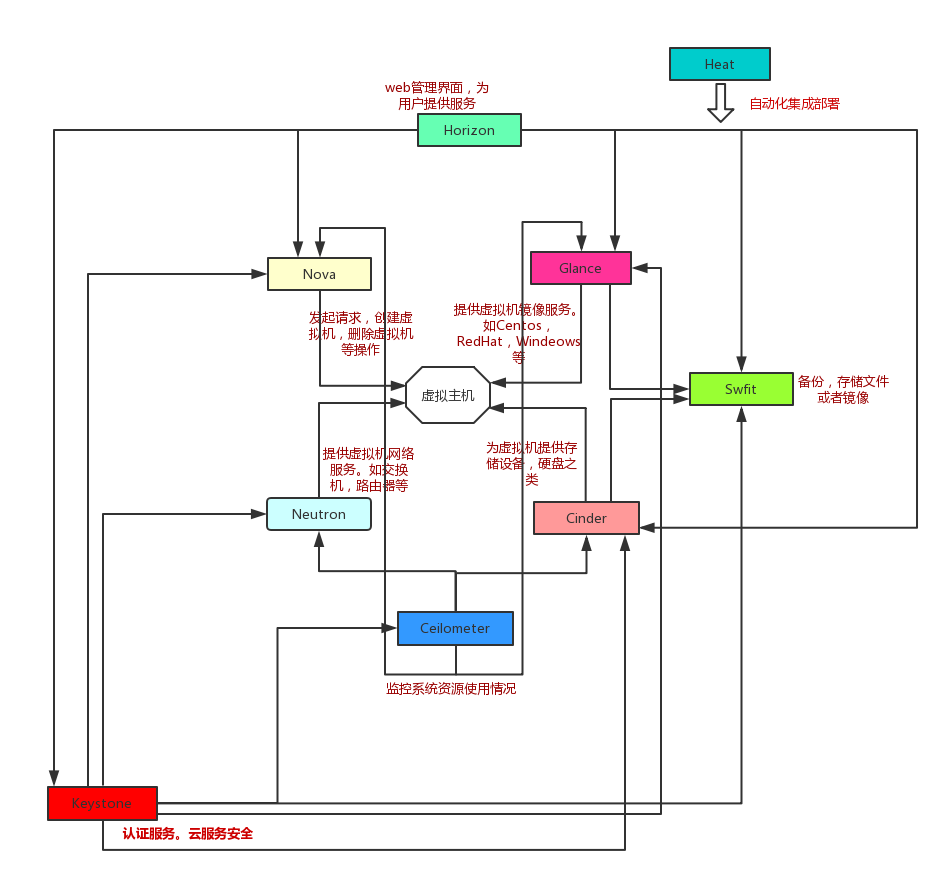

# 初识openstack

## **一、 什么是openstack？**

　　OpenStack是一个由NASA（[美国国家航空航天局](http://baike.baidu.com/view/85211.htm)）和Rackspace[合作研发](http://baike.baidu.com/view/1506447.htm)并发起的，以[Apache](http://baike.baidu.com/view/28283.htm)许可证授权的[自由软件](http://baike.baidu.com/view/20965.htm)和[开放源代码](http://baike.baidu.com/view/1708.htm)项目。

## **二、openstack前世今身**

　　openstack是一个跟Eucalyptus,AWS(Amazon web Service)类似的IaaS框

　openstack最有由美国国家航空航天局NASA研发的Nova和Rackspace研发swift组成。后来以Apache许可授权，指在为公共及私有云平台建设。openstack主要用来为企业内部实现类似于Amazon EC2和S3的云基础架构（IaaS）。每6个月更新一次，一般与Ubuntu同步，命名是以A-Z作为首字母来的。

## 三、openstack项目及组件功能简单介绍

### 　　1、核心项目3个

#### 　　　1.控制台

　　　　服务名：Dashboard

　　　　项目名：Horizon

　　　　功能：web方式管理云平台，建立主机，分配网络，配安全组，加云盘

#### 　　　2.计算

　　　　服务名：计算

　　　　项目名：Nova

　　　　功能：负责响应虚拟机创建请求、调度、销毁主机

#### 　　　3.网络

　　　　服务名：网络

　　　　项目名：Neutron

　　　　功能：实现SDN(软件定义网络)，提供一整套API，用户可以基于该API实现自己定义专属网络，不同厂家可以基于此API提供自己的产品实现 

### 　2、存储项目2个

#### 　　　1.对象存储

　　　　服务名：对象存储

　　　　项目名：Swift

　　　　功能：REST风格的接口和扁平的数据组织结构。RESTful HTTP API来保存和访问任意非结构化数据，ring环的方式实现数据自动复制和高度可以扩展架构，保证数据的高度容错和可靠性

#### 　　　2.块存储

　　　　服务名：块存储

　　　　项目名：Cinder　

　　　　功能：提供持久化块存储，即为云主机通过附加云盘　　　　

```
 1 存储的基本知识：
 2 存储分为三大类：文件存储、块存储、对象存储
 3 
 4 文件存储：在用户的角度来说,就是一个文件夹。例如：U盘，ftp(文件传输协议)、nfs等
 5     特点：无法格式化
 6              基本操作单位是文件
 7              基于Postfix标准的文件处理，进行增删改查
 8 
 9 块存储：在用户的角度来说就是一块裸盘（空硬盘，进行格式化，分block大小）
10     特点：可以格式化
11             基本操作单位是block
12 
13 文件存储与块存储之间的关系：对用户来说，到最后用的仍是文件存储
14 
15 对象存储：key:value形式（例如网盘分享，一个连接代表一个key，一个文件代表value）
16     key：value的表示 httpd://1.1.1.1/api：object(冒号前面为key，后面为value)
17 
18     特点：一切皆对象，速度快（属于非关系型，比关系型快）
19             本质上无法再对象存储里修改文件
```

###  　 3、共享服务项目3个

#### 　　　1.认证服务

　　　　服务名：认证服务

　　　　项目名：Keystone

　　　　功能：为访问openstack各组件提供认证和授权功能，认证通过后，提供一个服务列表（存放你有权访问的服务），可以通过该列表访问各个组件 

#### 　　　2.镜像服务

　　　　服务名：镜像服务

　　　　项目名：Glance

　　　　功能：为云主机安装操作系统提供不同的镜像选择

 

#### 　　　3.计费服务

　　　　服务名：计费服务

　　　　项目名：Ceilometer

　　　　功能：收集云平台资源使用数据，用来计费或者性能监控

 

### 　   4、高层服务项目1个

#### 　　　1.编排服务

　　　　服务名：编排服务

　　　　项目名：Heat

　　　　功能：自动化部署应用，自动化管理应用的整个生命周期，主要用于PaaS　　　

 

## 四、openstack各组件关系

　　

**openstack新建主机流程图**

 


 

首先我们先分析一下这个流程图。整个的体系下来不止这29步

 

1. 命令行或者通过web界面，就是dashboard，通过RESTful API向keystone获取认证信息

2. keystone通过用户请求进行认证，并生成auth-token返回给用户，这个第一个token是属于用户用没有权限登录的token

3. 命令行或web界面通过RESTful API 向nova-api发送一个新建虚拟机的请求并携带一个token.这个token属于第二个token，看这个token是否有权限访问nova

4. nova-api 接受来自客户端的请求和token信息，然后拿着token信息向keystone认证。

5. keystone验证token是否有效，有效则返回有效的认证和对应的角色（有些操作需要有角色权限才能操作）

6. 通过认证后nova-api将用户的创建虚拟机的请求写到数据库中，（新建虚拟机信息：cpu，内存，硬盘，网络结构，属于什么vlan等等）

7. 初始化新建虚拟机的数据库记录并返回

8. nova-api将新建虚拟机的请求信息放到消息中间件(MQ)中。（通过rpc.call）只是请求信息并不是详细信息.

9. nova-scheduler（nova计算节点，安装了nova-compute的软件）接受nova-api的请求。就是在多个nova-compute中找到一个合适的nova-compute让它去建虚拟机

10. nova-scheduler通过查询nova数据库 计算资源的情况，并通过调度算法计算符合虚拟机创建需要的主机，并返回信息到nova-scheduler

11. 对有符合创建虚拟的物理主机，nova-scheduler就会更新数据库中对应的物理主机信息

12. nova-scheduler通过rpc.cast像nova-compute发送对应的创建虚拟机请求信息

13. nova-compute会从消息列队中获取创建虚拟机的请求信息。

14. nova-compute通过rpc.call像nova-conductor请求获取虚拟机的信息

15. nova-conductor从消息列队中拿到nova-compute的请求信息

16. nova-conductor根据信息进行查询虚拟机对应信息

17. nova-conductor从数据库中获取虚拟机对应信息

18. nova-conductor把虚拟机信息通过消息的方式发送到消息列队中

（上述的nova部分属于回调机制）

19. nova-compute从对应的消息列队中获取虚拟机信息

20. nova-compute通过keystone的RESTful API 拿到认证token，并通过http请求glance-api获取创建虚拟机所需的镜像。

21. glance-api想keystone认证token是否有效，并返回认证结果

glance具体如何工作的：

glance-api接收到请求后，将请求发给glance-registry，glance-registry到数据库中将镜像的元数据拿到，并返回给glance-api。glance-api会到后端的存储拿到镜像的URL地址

22. token验证通过，nova-compute获得虚拟机镜像信息(URL）下载到本地

23. nova-compute通过keystone的RESTful API 拿到认证的token，并且通过HTTP请求neutron-server获取创建虚拟机所需要的网络

24. neutron-server去向keystone认证token是否有效，并返回结果。

25. token认证通过后，nova-compute获得虚拟机网络信息

26. nova-compute 通过keystone的RESTful API拿到认证token，并通过HTTP请求cinder-api获取创建虚拟机所需的持久化存储信息

27. cinder-api向keystone认证token是否有效，并返回结果

28. token认证通过后，nova-compute获的虚拟机持久化存储信息

29. nova-compute根据instance的信息调用配置的虚拟化驱动来创建虚拟机