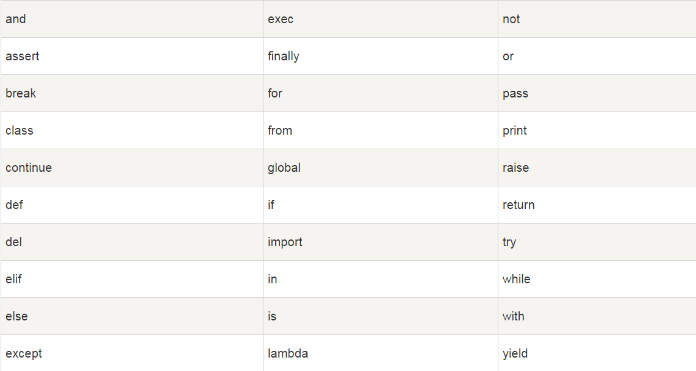

# 基础语法

## 一、 标识符

所谓的标识符就是对变量、常量、函数、类等对象起的名字。

首先必须说明的是，**Python语言在任何场景都严格区分大小写！**

Python对于标识符的命名有如下规定：

- **第一个字符必须是字母表中的字母或下划线‘_’**

例如，`a, Ak, _set_id, green`等都是可以的，但是例如`$abc, &_a, ~bashrc, 123abc`等是不可以的！

那么，有些同学可能会问， 中文可以吗？很好！我非常喜欢和赞同这种思考和提问的方式，它能帮助你更好的挖掘核心原理。答案是可以的！比如下面的例子：

```
>>> 我 = 1
>>> 我
1
>>> 什么 = "apple"
>>> print(什么)
apple
```

Python3全面支持Unicode后，对中文的兼容性是越来越好了。居然真的可以用中文做变量名，不信的话，你可以自己在IDLE里试试。

然而，虽然支持中文标识符，但是没有人会这么干，我也不建议大家这么做，请将第一个字符必须是字母表中的字母或下划线‘_’作为原则来执行。

另外，以下划线开头的标识符通常都有特殊意义。以单下划线开头的变量，例如_foo代表禁止外部访问的类成员，需通过类提供的接口进行访问，不能用"from xxx import *"导入；而以双下划线开头的，例如__foo，代表类的私有成员；以双下划线开头和结尾的（`__foo__`）是python里特殊方法专用的标识，如`__init__（）`代表类的构造函数。这些在后面会有专门的论述，暂时只要知道它们的特殊性就行了。

- **标识符的其他的部分由字母、数字和下划线组成**

也就是说标识符除了首字符不可以是数字外，其它部分还可以包含数字。那特殊字符呢？当然还是不行的啦。所以，`a123c_, bbc, city_of_china`等等都是可行的，而`a&b, king-of-the-world, love@qq.com`都是不行的。

另外要注意的是，由于l(小写的L）和数字1， 大小写的o与数字0在外观上的相似性，请尽量不要让它们相邻出现，保持语义的清晰性，确保不会发现错误认读的情况。

同样，我们继续烧脑，英文中夹塞中文在语法上也是可以的，但绝对不要这么做！

```
>>> a这都能行b舅服你 = 100
>>> a这都能行b舅服你
100
```

- **标识符对大小写敏感**

这条是基于Python严格区分大小写的，所以标识符abc与ABC是不同的两个。

- **变量名全部小写，常量名全部大写**

这条不能算语法层面的要求，而是代码规范的要求。虽然你可以用PI来表示一个变量，但通常我们都会认为这是代表圆周率的一个常量。

- **函数和方法名用小写加下划线**

同样也不是语法强制，而是代码规范，我们在定义一个函数或者方法的名字的时候，请尽量用类似`get、set、count_apple、total_number`之类的命名方式。

- **类名用大写驼峰**

也不是语法强制，而是代码规范。所谓的大写驼峰指的是每个单词的首字母大写，组合在一起就像驼峰一样高低高低的排列。例如`ThreadMixIn、BrokenBarrierError、_DummyThread`等等

- **模块和包的名字用小写**

请尽量小写模块和包的名字，并且不要和标准库以及著名的第三方库同名。

最后需要提醒大家的是：

#### 变量的命名不要用关键字和内置函数的名字！

下面我们就会讲到Python有哪些关键字，而内置函数的知识则要到后面的章节。

## 二、 Python保留字

Python保留字，也叫关键字，是Python语言官方确定的用作语法功能的专用标识符，不能把它们用作任何自定义标识符名称。关键字只包含小写字母。Python的标准库提供了一个 keyword 模块，可以输出当前版本的所有关键字：

```
>>> import keyword

>>> keyword.kwlist

['False', 'None', 'True', 'and', 'as', 'assert', 'break', 'class', 'continue', 'def', 'del', 'elif', 'else', 'except', 'finally', 'for', 'from', 'global', 'if', 'import', 'in', 'is', 'lambda', 'nonlocal', 'not', 'or', 'pass', 'raise', 'return', 'try', 'while', 'with', 'yield']
```

也可以参照下表：



那么如果，真的犯了这个错，会怎么样呢？举个例子：

```
>>> if = 1
SyntaxError: invalid syntax
>>> print(and)
SyntaxError: invalid syntax
>>> def = "hi"
SyntaxError: invalid syntax
```

看到没有？直接提示语法错误。

除了不能使用关键字作为标识符，前面我们也强调过了，也不能使用内置函数同名的标识符。Python有很多内置函数，以sum为例，这是一个求和的函数，我们看一下错误的命名导致的后果：

```
>>> sum([1,2,3,4])
10
>>> sum = "错误标识符名"
>>> sum([1,2,3,4])
Traceback (most recent call last):
  File "<pyshell#19>", line 1, in <module>
    sum([1,2,3,4])
TypeError: 'str' object is not callable
```

先不管sum([1,2,3,4])的意义，它的作用是把1/2/3/4加在一起得到10，然后错误的给一个变量也取了个sum的标识符名称，再后面又调用sum([1,2,3,4])的时候，程序抛出异常，错误原因是str不是可调用的类型。归根到底就是sum这个名字重名了的原因。

## 三、 注释

我们写的程序里，不光有代码，还要有很多注释。注释有说明性质的、帮助性质的，它们在代码执行过程中相当于不存在，透明的，不参与任何工作。但在代码维护、解释、测试等等方面，发挥着不可或缺的重要作用。每一位程序员都要尽量写出高质量的注释。具体的注释专题，有大量的高水平文章和论述，请自行搜索并学习。这里，我们只讨论Python中注释的方法。

- **单行注释**

Python中，以符号“#”为单行注释的开始，从它往后到本行的末尾，都是注释内容。

| `1 2 3 4 5 6 7 8` | `#!/usr/bin/python3 # 下面这个方法的作用是….. # 第一个注释 # 我是单行注释 # 这是一个空的函数，它什么都不干。本条注释也是句废话。 def main():    pass        # pass表示占位，什么都不做。那我为什么要注释它呢？？？ ` |
| ----------------- | ------------------------------------------------------------ |
|                   |                                                              |

- **多行注释**

Python没有真正意义上的多行注释（块注释）语法。你只能在每行的开头打上#号，然后假装自己是个多行注释，囧。(有表情包没？)

```
# 第一行注释
# 第二行注释
# 第三行注释
def func():
    print("这是一个悲伤的故事！")
```

- **注释文档**

在某些特定的位置，用三引号包括起来的部分，也被当做注释。但是，这种注释有专门的作用，用于为__doc__提供文档内容，这些内容可以通过现成的工具，自动收集起来，形成帮助文档。比如，函数和类的说明文档：

```
def func(a, b):
    """
    这个是函数的说明文档。
    :param a: 加数
    :param b: 加数
    :return: 和
    """
    return a + b


class Foo:
    """
    这个类初始化了一个age变量
    """
    def __init__(self, age):
        self.age = age
```

#### 需要强调的是这类注释必须紧跟在定义体下面，不能在任意位置。

## 四、 代码头两行

很多时候，我们在一些py脚本文件的开头都能看到类似的以#开头的这样两行代码，它们不是注释，是一些设定。

| `1 2` | `#!/usr/bin/env python # -*- coding:utf-8 -*- ` |
| ----- | ----------------------------------------------- |
|       |                                                 |

**第一行**：用于指定运行该脚本的Python解释器，Linux专用，windows不需要。env方式下，系统会自动使用环境变量里指向的Python。还有一种方式，`#!/usr/bin/python3.6`，这会强制要求使用系统中的python3.6解释器执行文件，这种方式不好，一旦你本地的Python3.6版本删除了，会出现找不到解释器的错误。无论两种方式的哪一种，都指的是在linux下使用`./test.py`的方式执行脚本时的设置，在使用类似`python test.py`或者`python3 test.py`的执行方式时，这一行不起作用。

例如，我写了个脚本如下：

```
#!/usr/bin/python2

print "hello"       # 注意这里没有圆括号，这是python2版本的打印方式
```

仔细看下面的执行过程, 你会发现无论你在代码第一行怎么设置，都会根据命令调用的时的python版本进行执行：

```
[feixue@feixue-VirtualBox: ~/python]$ cat test.py 
#!/usr/bin/python2

print "hello"
[feixue@feixue-VirtualBox: ~/python]$ python2
Python 2.7.12 (default, Nov 19 2016, 06:48:10) 
[GCC 5.4.0 20160609] on linux2
Type "help", "copyright", "credits" or "license" for more information.
>>> exit()
[feixue@feixue-VirtualBox: ~/python]$ python3
Python 3.6.1 (default, Aug 15 2017, 11:19:20) 
[GCC 5.4.0 20160609] on linux
Type "help", "copyright", "credits" or "license" for more information.
>>> exit()
[feixue@feixue-VirtualBox: ~/python]$ python2 test.py
hello
[feixue@feixue-VirtualBox: ~/python]$ python3 test.py
  File "test.py", line 3
    print "hello"
                ^
SyntaxError: Missing parentheses in call to 'print'
```

那这行有什么用呢？是这么用的。

```
[feixue@feixue-VirtualBox: ~/python]$ chmod +x test.py 
[feixue@feixue-VirtualBox: ~/python]$ ll test.py 
-rwxrwxr-x 1 feixue feixue 34 9月   5 22:57 test.py*
[feixue@feixue-VirtualBox: ~/python]$ ./test.py
hello
```

**第二行**：代码的编码方式。**不是程序要处理的数据的编码方式，而是程序自己本身的字符编码**。在Python3中，全面支持Unicode，默认以UTF-8编码，我们不用再纠结中文的问题，乱码的问题，所以本行其实可以不需要。但在Python2中，对字符的编码是个非常令人头疼的问题，通常都需要指定这么一行。如果要自定义别的编码类型的话，可以像这样：# -*- coding: cp-1252 -*-，但如果没有强制需求的话，不要自己作死，请坚持使用utf-8编码。

这两行要在文件的顶行，顶左，不要空格和空行， utf8和utf-8都行。

PS：这里的`-*-`是什么意思呢？没意思，装饰美观好看而已，囧。

除了这两行，有时候我们还会附上作者、通讯地址、版权说明，版本说明等，全凭个人喜好了。

## 五、 语句与缩进

**语句**：在代码中，能够完整表达某个意思、操作或者逻辑的最短代码，被称为语句。语句通常不超过一行，超过一行的称为多行语句。

像下面的都称为语句：

```
a = apple
from . import modles
print("haha")
lis.append(item)
```

**Python的标准语句不需要使用分号或逗号来表示语句结束，简简单单的换个行就表示本语句已经结束，下一句开始。**

**代码块**：为完成某一特定功能而联系在一起的一组语句构成一个代码块。有判断、循环、函数、类等各种代码块。代码块的首行通常以关键字开始，以冒号( : )结束。比如：

```
# 这是一个判断流程代码块
if expression : 
   pass
elif expression : 
   pass
else : 
   pass
```

又比如：

```
# 这是一个类代码块
class Foo:
    def __init__(self, name, age):
        self.name = name
        self.age = age

    def get_name(self):
        return self.name

# 这是一个函数代码块
def func(a, b):
    summer = a+b
    return summer*2
```

## Python最具特色的语法就是**使用缩进来表示代码块**，不需要使用大括号({})。

缩进的空格数是可变的，但是**同一个代码块的语句必须包含相同的缩进空格数**。

如果缩进数的空格数不一致，会抛出缩进异常（请记住IndentationError这个异常名！新手会经常和它做朋友）：

```
 File "test.py", line 6
    print ("False")    # 缩进不一致，会导致运行错误
                                      ^
IndentationError: unindent does not match any outer indentation level
```

PEP8（Python官方的代码规范）：建议使用**四个空格作为缩进**！在文本编辑器中，需要设置把Tab自动转换为4个空格，确保不混用Tab和空格。在Pycharm中：tab键被自动转换成4个空格的缩进。linux环境中，如vim编辑器，请一定使用空格，不要使用tab键！

那么怎么才是正确的缩进方式呢？

- 所有的普通语句，顶左开始编写，不需要缩进
- 所有的语句块，首行不用缩进，从冒号结束后开始下一行，都要缩进
- 直到该语句块结束，就退回缩进，表示当前块已结束
- 语句块可以嵌套，所以缩进也可以嵌套

比如，我们写一个if/else的判断控制语句块：

首先是，第1句，不需要缩进：

```
if i > 10:
```

然后是第2句，这时已经进入if内部了，需要缩进：

```
if i > 10:
    i = i + 10  # 左边有4个空格
```

接下来是第3句，因为还在if内部，所以保持和第二句一样的缩进

```
if i > 10:
    i = i + 10  # 左边有4个空格
    print(i)  # 左边有4个空格
```

第4句，我们if分支走完了，要走else分支，那么if语句块算结束了，缩进要回退。

```
if i > 10:
    i = i + 10  # 左边有4个空格
    print(i)  # 左边有4个空格
else:
```

第5句，进入else语句块了，要缩进4个空格:

```
if i > 10:
    i = i + 10   # 左边有4个空格
    print(i)     # 左边有4个空格
else:
    i = i - 10    # 左边有4个空格
```

第6句，else分支也走完了，整个if/else流程完毕，下面是别的代码了，那么else分支的缩进也要退回。

```
if i > 10:
    i = i + 10   # 左边有4个空格
    print(i)     # 左边有4个空格
else:
    i = i - 10    # 左边有4个空格
print("apple")   # 缩进回退了，这里已经和if、else没什么关系了。    
```

再看一个缩进嵌套的例子，以两个for循环嵌套为例：

```
for i in range(10):
    for k in range(10): # 同样也是for循环，由于嵌套在另一个for内部，需要缩进
        if k != i:      # 双重循环内的if，需要2次缩进，也就是顶左开始8个空格
            print(k)    # 又嵌套了一个if语句块，再次缩进4个空格，共计12个
        else:           # if结束，回退4个，开始else分支
            print(i+k)  # 又增加缩进
    print(i)            # 这次不但else结束了，连内部的for也结束了，回退8个空格
```

刚开始，缩进的语法可能让你搞不清楚，何时缩进，何时回退，该缩进几个空格。但多写写，多看看，很快就能掌握，并不再犯错。Python的缩进语法设计有别与其它所有的语言，是独家特色，一直争论很大，喜欢的非常喜欢，觉得简洁明了，节省了不少功夫，而且强制代码整齐。不喜欢的，觉得缩来缩去，头都晕了，容易犯语法错误，并且不能使用规格化工具。

**同一行写多条语句：**

前面我们说了，Python一行通常就是一条语句，一条语句通常也不会超过一行。其实，从语法层面，Python并没有完全禁止在一行中使用多条语句，也可以使用分号实现多条语句在一行，比如：

```
import sys; x = ‘多条语句'; sys.stdout.write(x + '\n')
```

上面这一行其实包含3条语句，用分号分隔了，但是强烈建议不要这么做，这样会导致代码阅读困难、维护耗时，容易出错，老老实实地用三行来表示，不但更优雅，还增加了代码行数，可以跟老板说今天多写了2行，^_^。

**多行语句**： 前面是多条语句在一行，但如果一条语句实在太长，也是可以占用多行的，可以使用反斜杠`(\)`来实现多行语句：

```
string = "i love this country,"\
         +"because it is very beautiful!"\
         + "how do you think about it?" \
         + "Do you like it too?"
```

在 [], {}, 或 () 中的多行语句，可以不需要使用反斜杠`(\)`，直接回车，接着写。例如：

```
result = subprocess.Popen("ipconfig /all", stdin=subprocess.PIPE,
                          stdout=subprocess.PIPE,
                          stderr=subprocess.PIPE,
                          shell=True, check=True)
```

PEP8建议：每一行的字符不超过79个。该换行时咱就换行！

## 六、 **pass语句**

pass语句是占位语句，它什么都不做，只是为了保证语法的正确性而写。以下场景中，可以使用pass语句：

- 当你不知道后面的代码怎么写的时候
- 当你不需要写代码细节的时候
- 当语法必须，又没有实际内容可写的时候
- 其它的一些你觉得需要的场景

举个栗子：

```
# 我只想说明这个func函数需要三个参数，具体执行什么并不重要
# 但是函数体内如果什么都没有，会出现语法错误
# 这个时候，pass就是最好的选择。
def func(a,b,c):
    pass
```

## 七、 空白字符与空白行

空白行、空白字符与代码缩进不同，并不是Python语法的一部分。空行或者空白字符会被当做空气一样的忽略。连续的空行或空白字符和单独的空白行几字符没有区别。书写时不插入空白行或空白字符，Python解释器运行也不会出错。但是空白的作用在于分隔两段不同功能或含义的代码，便于日后代码的维护或重构。

PEP8对于空行留白有专门的建议。

函数之间或类的方法之间用空行分隔，表示一段新的代码的开始。类和函数入口之间也用一行空行分隔，以突出函数入口的开始。

变量赋值的时候等号左右各给一个空白。逗号后面跟一个空白。

看下面的代码，作为标准的代码规范，在规定的地方留有规定的空白行和空白字符。

```
#!/usr/bin/env python
# -*- coding:utf-8 -*-


class Foo:
    pass


def func(a, b):
    pass

if __name__ == '__main__':
    pass
```

## 八、 字符串的表示形式

后面的字符串数据类型章节会有更深入的字符串介绍。这里作为一个前期的知识铺垫。

字符串，表示一段连续的字符，可以是有意义的单词、词组、语句，也可是无意义的字符组合。不在于它内部是由什么组成的，而在于它是否被引号引起来的。

比如， `abc`可能是个变量，但是`"abc"`肯定是个字符串！(再次强调，代码的世界没有中文标点，所有的符号类型都是英文半角！千万不要搞错了！)

在Python中，被引号括起来的都是字符串，这个引号可以是单引号，双引号，甚至3引号。

**python中单引号和双引号的作用完全相同**。但是注意：在其它语言中双引号引起来的才是字符串，单引号引起来的是字符！例如C。例如json！所以很多同学在做json格式转换时，经常发生使用单引号，导致转换失败的问题。

**使用三引号('''或""")可以指定一个多行字符串**。

转义符 `‘\‘`，用来特殊转义，例如`\r\n`,`\\`。它可以将引号转义为单纯的引号，没有任何作用的引号。

**原生字符串**： 通过在字符串前加r或R，如 r"this is a line with \n"，表示这个字符串里的斜杠不需要转义，等同于自身。因此，例子中的\n会显示出来，并不是换行。

**unicode字符串**：加前缀u或U， 如 u"this is an unicode string"。

**bytes类型**：加前缀b，如b”this is a bytes data”。但是s=b“哈哈”，这种是不行的！

字符串是不可变类型。

字符串会自动串联，如“i" “love" “you"会被自动转换为”I love you”。

这里有些内容可能不好理解，没有关系，往后接着看。

## 九、 如何阅读错误调用栈的信息？

现在，我们已经开始写一些简单的Python代码和语句了，犯错是免不了的，Python给我们提供了很全面细致的错误调用栈信息，帮助我们查找错误。以下面的代码为例(我额外给包括空行在内的每一行添加了行号信息)：

```
def foo(s):             #1
    return 10 / int(s)  #2
                        #3
def bar(s):             #4
    return foo(s) * 2   #5
                        #6
def main():             #7
    bar('0')            #8
                        #9
main()                  #10
```

运行代码后，会弹出如下的错误：

```
Traceback (most recent call last):
  File "F:/Python/pycharm/201705/1.py", line 10, in <module>
    main()
  File "F:/Python/pycharm/201705/1.py", line 8, in main
    bar('0')
  File "F:/Python/pycharm/201705/1.py", line 5, in bar
    return foo(s) * 2
  File "F:/Python/pycharm/201705/1.py", line 2, in foo
    return 10 / int(s)
ZeroDivisionError: division by zero
```

这些信息就是错误提示。我们需要从上往下读，英文看起来很复杂，其实很易懂。Traceback...表示追踪错误开始，说在某个位置的1.py文件的第10行中的main这个函数出了问题。那么问题出在哪呢？是1.py文件中的第8行的bar函数调用出了问题，那么出什么问题呢？还没找到根子，又说在第5行，第2行调用出了问题，然后最终发现是`return 10 / int(s)`这行语句的问题。问题是什么，发生了除零错误！ZeroDivisionError是一个除零异常。到这里，我们恍然大悟，我让10除0了，所以出现错误了，那么就知道怎么改了。

其实查找错误，排除错误就是这么简单，只是需要你耐心的一行行地查看错误调用栈，再根据最后的错误类型，就可以判断错误的发生原因并修改错误，没有想象中的那么复杂。更不要直接将错误甩给别人或者老师！那种张嘴就是“我这里出错了，是什么原因？”的提问方式，是最没有水平的。