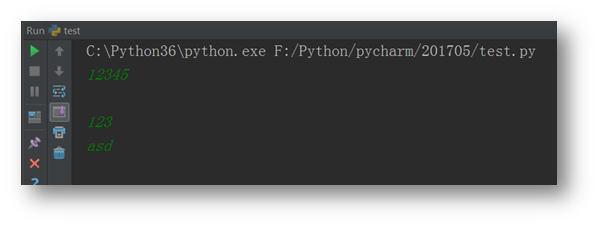

# getpass

阅读: 5132   [评论](http://www.liujiangblog.com/course/python/64#comments)：0

getpass模块大概是标准库中最简单的一个模块了。**getpass模块用于输入密码时，隐藏密码字符。**

我们都知道，密码是非常重要不能展示给他人观看的事物。做演示的时候，如果你的密码以明文的方式在显示设备上打印出来了，那就太糟糕了。所以不管是在普通软件中还是浏览器上，我们输入的密码通常都以圆点或者星号替代，有的甚至根本就不显示密码输入过程。

那么如何在Python中也实现这一功能呢？使用getpass模块！

然而这是个悲伤的故事......

------

getpass模块简单到只有两个方法：

**getpass.getpass(prompt='Password: ', stream=None)**

提示用户输入密码。可自定义提示符。可从stream中读取密码。

**getpass.getuser()**

获取当前用户名。按顺序从LOGNAME, USER, LNAME或者USERNAME这些环境变量中查询。

## 1. 在IDLE中使用

```
>>> import getpass
>>> pwd = getpass.getpass("请输入密码： ")

Warning (from warnings module):
  File "C:\Python36\lib\getpass.py", line 100
    return fallback_getpass(prompt, stream)
GetPassWarning: Can not control echo on the terminal.
Warning: Password input may be echoed.
请输入密码： 123456
>>> pwd
'123456'
>>> getpass.getuser()
'Administrator'
```

What!?getpass在IDLE中是无效的，官方也给出了警告提示，笑哭！

## 2. 在Pycharm中使用

```
import getpass

pwd = getpass.getpass("请输入密码： ")
print("密码输入成功！")
print("你的密码是：%s" % pwd)
```



实际运行一遍，你会发现，根本无法使用！

## 3. 在命令行界面中使用


到命令行界面中测试一下吧，你会发现功能正常，完全可用！

**总结：getpass模块只能用于命令行界面！^_^**