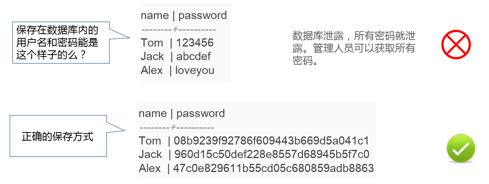

# hashlib

阅读: 4405   [评论](http://www.liujiangblog.com/course/python/58#comments)：0

## 什么是Hash

Hash，译做“散列”，也有直接音译为“哈希”的。把任意长度的输入，通过某种hash算法，变换成固定长度的输出，该输出就是散列值，也称摘要值。该算法就是哈希函数，也称摘要函数。

通过摘要函数对任意长度的数据计算出固定长度的摘要`digest`，目的是为了提供一个验证文件未被篡改的方法。摘要函数是一个单向函数，计算`digest`很容易，但通过`digest`反推原始数据却非常困难。而且，最关键的是，**对原始数据做一个比特位的修改，都会导致计算出的摘要完全不同**。

举个例子，你写了一篇文章，内容是一个字符串`I like Python ,do you like it?`，并附上这篇文章的摘要——`4f15c0d321b6a65e5d6d`(随便瞎写的)。如果有人篡改了你的文章，并发表`I like music ,do you like it？`，你可以一下子指出你的文章被篡改了，因为篡改后的文章计算出的摘要不同于原始文章的摘要。

有没有可能两个不同的原始数据通过某个摘要算法会得到相同的摘要？完全有可能，因为任何摘要算法都是把无限多的数据集合映射到一个有限的集合中，这种转换是一种压缩映射，也就是说，散列值的空间通常远小于输入的空间，不同的输入可能会散列成相同的输出，所以不可能从散列值来唯一的确定输入值。

那你上面说的啥？自相矛盾吗？虽然摘要值有可能相同，但是现在广泛应用的摘要算法是在一个非常巨大的样本空间中计算的，摘要值通常都有好几百位，在使用过程中碰到两个摘要完全相同的概率非常非常非常小，可以忽略不计。

要注意，摘要算法不是加密算法，不能用于加密数据（因为无法通过摘要反推明文），只能用于防止数据被篡改，但是它的单向计算特性决定了可以在不存储明文口令的情况下验证用户口令。

`MD5`是最常见的摘要算法，速度很快，生成结果是固定的16字节，通常用一个32位的16进制字符串表示。SHA1算法更安全点，它的结果是20字节长度，通常用一个40位的16进制字符串表示。而比SHA1更安全的算法是SHA256和SHA512等等，不过越安全的算法越慢，并且摘要长度更长。

## hashlib模块

Python内置的hashlib模块为我们提供了多种安全方便的摘要方法，我们不必求助他人。

当前，在大部分操作系统下，hashlib模块支持`md5()`,`sha1()`, `sha224()`, `sha256()`, `sha384()`, `sha512()`, `blake2b()`，`blake2s()`，`sha3_224()`, `sha3_256()`, `sha3_384()`, `sha3_512()`, `shake_128()`, `shake_256()`等多种hash构造方法。这些构造方法在使用上通用，返回带有同样接口的hash对象，对算法的选择，差别只在于构造方法的选择。例如sha1()能创建一个SHA-1对象，sha256()能创建一个SHA-256对象。然后就可以使用通用的`update()`方法将bytes类型的数据添加到对象里，最后通过`digest()`或者`hexdigest()`方法获得当前的摘要。

**注意了，update()方法现在只接受bytes类型的数据，不接收str类型。**

下面是获得bytes类型字符串`b'Nobody inspects the spammish repetition'`的摘要的过程：

```
>>> import hashlib
>>> m = hashlib.sha256()                # 通过构造函数获得一个hash对象
>>> m.update(b'Nobody inspects')        # 使用hash对象的update方法添加消息
>>> m.update(b' the spammish repetition')   # 同上
>>> m.digest()                  # 获得bytes类型的消息摘要
b'\x03\x1e\xdd}Ae\x15\x93\xc5\xfe\\\x00o\xa5u+7\xfd\xdf\xf7\xbcN\x84:\xa6\xaf\x0c\x95\x0fK\x94\x06‘
>>> m.hexdigest()                   # 获得16进制str类型的消息摘要
'031edd7d41651593c5fe5c006fa5752b37fddff7bc4e843aa6af0c950f4b9406'
>>> m.digest_size                   # 查看消息摘要的位长
32  
>>> m.block_size                    # 查看消息摘要的内部块大小
64
```

更简洁的用法：

```
>>> hashlib.sha224(b"Nobody inspects the spammish repetition").hexdigest()
'a4337bc45a8fc544c03f52dc550cd6e1e87021bc896588bd79e901e2'
```

### hashlib.new(name[, data])

一个通用的构造方法，name是某个算法的字符串名称，data是可选的bytes类型待摘要的数据。例如：

```
>>> h = hashlib.new('sha256',b"haha")
>>> h.hexdigest()
'090b235e9eb8f197f2dd927937222c570396d971222d9009a9189e2b6cc0a2c1'
```

### 1. hashlib模块的两个常量属性：

**hashlib.algorithms_guaranteed**

所有平台中，模块支持的hash算法列表

**hashlib.algorithms_available**

当前Python解释器环境中，模块支持的hash算法列表

```
>>> hashlib.algorithms_guaranteed
{'sha256', 'sha3_512', 'sha384', 'sha512', 'sha3_224', 'shake_256', 'shake_128', 'md5', 'sha224', 'blake2b', 'sha3_384', 'blake2s', 'sha3_256', 'sha1'}

>>> hashlib.algorithms_available
{'sha256', 'RIPEMD160', 'sha384', 'MD4', 'DSA-SHA', 'SHA384', 'SHA256', 'shake_128', 'md5', 'dsaWithSHA', 'SHA1', 'blake2b', 'SHA', 'sha3_384', 'md4', 'sha', 'ripemd160', 'whirlpool', 'DSA', 'sha3_512', 'sha512', 'sha3_224', 'shake_256', 'MD5', 'ecdsa-with-SHA1', 'sha224', 'SHA512', 'dsaEncryption', 'SHA224', 'blake2s', 'sha3_256', 'sha1'}
```

### 2. hash对象的两个常量属性

**hash.digest_size**

hash结果的长度

**hash.block_size**

hash内部块的大小

### 3. hash对象的属性

**hash.name**

hash算法名称字符串

### 4. hash对象的方法

**hash.update(arg)**

更新hash对象。连续的调用该方法相当于连续的追加更新。例如m.update(a); m.update(b)相当于m.update(a+b)。注意，当数据规模较大的时候，Python的GIL在此时会解锁，用于提高计算速度。

一定要理解update()的作用，由于消息摘要是只针对当前状态产生的，所以每一次update后，再次计算hexdigest()的值都会不一样。

**hash.digest()**

返回bytes格式的消息摘要

**hash.hexdigest()**

与digest方法类似，不过返回的是两倍长度的字符串对象，所有的字符都是十六进制的数字。通常用于邮件传输或非二进制环境中。通常我们比较摘要时，比较的就是这个值！

**hash.copy()**

返回一个hash对象的拷贝

## 使用场景

那么消息摘要有什么用呢？最常用的就是密码加密！密码加密不像数据加密，通常不需要反向解析出明文。而数据加密一般是需要反向解析的，我们无法从摘要反向解析出数据，加密是没问题了，但你让数据使用者如何获取数据？

现在，考虑下面的问题：



当用户登录时，首先计算用户输入的明文口令的摘要值，然后和数据库存储的摘要值进行对比。如果两者一致，说明口令输入正确，如果不一致，口令肯定错误。这样，不但数据库不用储存明文密码，即使能访问数据库的管理员“叛变”了，盗走了整个数据库，也无法获知用户的明文口令。

那么采用诸如MD5等消息摘要存储口令是否就一定安全呢？也不一定！假设你是一个黑客，已经拿到了存储MD5口令的数据库，如何通过MD5反推用户的明文口令呢？暴力破解？费事费力！，真正的黑客不会这么干。很多用户喜欢用`123456`，`abcdef`，`loveyou`这些简单的口令，由于MD5、SHA1等所有摘要算法都是公开的，黑客可以事先通过这些算法计算出这些常用口令的摘要值，得到一个反推表：

```
08b9239f92786f609443b669d5a041c1 ：  123456
960d15c50def228e8557d68945b5f7c0  ： abcdef
47c0e829611b55cd05c680859adb8863  ：loveyou
```

然后，无需暴力破解，只需要对比数据库的密码摘要，黑客就可以获得使用常用口令的用户账号。

擦汗...真是道高一尺，魔高一丈啊！那怎么办呢？加盐！

**加盐**：额外给原始数据添加一点自定义的数据，使得生成的消息摘要不同于普通方式计算的摘要。

比如我下面给密码字符串“password”加上字符串“salt”，这里的“salt”字符串就是所谓的盐，其摘要值必然不等于正常摘要“password”字符串的值。当然这个“salt”具体是什么，完全可以自定义，而且不能告诉他人！千万不要以为加盐就是加个“salt”字符串，那样我真的只能捂脸笑哭了。

```
>>> md5 = hashlib.md5()
>>> s = "password" + "salt"
>>> md5.update(s.encode())
>>> md5.hexdigest()
'b305cadbb3bce54f3aa59c64fec00dea'
```

经过加盐处理的密码口令，只要“salt”不被黑客知道，即使用户使用的是简单口令，也很难通过摘要对比的方式反推明文口令。

问题又来了！那如果两个用户的密码正好一样，都是`66666`，即使加了盐，生成的消息摘要也是一样的，也有被破解的风险，怎么办？

我们一般认为用户名是不能重复的，就像QQ号码是独一无二的一样。将用户名作为盐的一部分，就不会出现一样的密码消息摘要了。