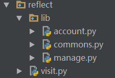

# reflect反射

阅读: 7882   [评论](http://www.liujiangblog.com/course/python/48#comments)：1

在前面的章节，我们遗留了hasattr()、getattr()、setattr()和delattr()的相关内容，它们在这里。

对编程语言比较熟悉的同学，应该听说过“反射”这个机制。Python作为一门动态语言，当然不会缺少这一重要功能。下面结合一个web路由的实例来阐述Python反射机制的使用场景和核心本质。

首先，我们要区分两个概念——“标识名”和看起来相同的“字符串”。两者字面上看起来一样，却是两种东西，比如下面的func函数和字符串“func”：

```
def func():
    print("func是这个函数的名字！")

s = "func"
print("%s是个字符串" % s)
```

前者是函数func的函数名，后者只是一个叫“func”的字符串，两者是不同的事物。我们可以用func()的方式调用函数func，但我们不能用"func"()的方式调用函数。说白了就是，不能通过字符串来调用名字看起来相同的函数！

------

### 实例分析

考虑有这么一个场景：需要根据用户输入url的不同，调用不同的函数，实现不同的操作，也就是一个WEB框架的url路由功能。路由功能是web框架里的核心功能之一，例如Django的urls。

首先，有一个commons.py文件，它里面有几个函数，分别用于展示不同的页面。这其实就是Web服务的视图文件，用于处理实际的业务逻辑。

```
# commons.py

def login():
    print("这是一个登陆页面！")


def logout():
    print("这是一个退出页面！")


def home():
    print("这是网站主页面！")
```

其次，有一个visit.py文件，作为程序入口，接收用户输入，并根据输入展示相应的页面。

```
# visit.py

import commons

def run():
    inp = input("请输入您想访问页面的url：  ").strip()
    if inp == "login":
        commons.login()
    elif inp == "logout":
        commons.logout()
    elif inp == "home":
        commons.home()
    else:
        print("404")


if __name__ == '__main__':
    run()
```

运行visit.py，输入home，页面结果如下：

```
请输入您想访问页面的url：  home
这是网站主页面！
```

这就实现了一个简单的url路由功能，根据不同的url，执行不同的函数，获得不同的页面。

然而，让我们思考一个问题，如果commons文件里有成百上千个函数呢(这很常见)？难道在visit模块里写上成百上千个elif？显然这是不可能的！那么怎么办？

仔细观察visit.py中的代码，会发现用户输入的url字符串和相应调用的函数名好像！如果能用这个字符串直接调用函数就好了！但是，前面已经说了字符串是不能用来调用函数的。为了解决这个问题，Python提供了反射机制，帮助我们实现这一想法，其主要就表现在getattr()等几个内置函数上!

现在将前面的visit.py修改一下，代码如下：

```
# visit.py
import commons 

def run():
    inp = input("请输入您想访问页面的url：  ").strip()
    func = getattr(commons,inp)
    func() 

if __name__ == '__main__':
    run()
```

`func = getattr(commons,inp)`语句是关键，通过getattr()函数，从commons模块里，查找到和inp字符串“外形”相同的函数名，并将其返回，然后赋值给func变量。变量func此时就指向那个函数，func()就可以调用该函数。

**getattr()函数的使用方法：接收2个参数，前面的是一个类或者模块，后面的是一个字符串，注意了！是个字符串！**

这个过程就相当于把一个字符串变成一个函数名的过程。这是一个动态访问的过程，一切都不写死，全部根据用户输入来变化。

------

前面的代码还有个小瑕疵，那就是如果用户输入一个非法的url，比如jpg，由于在commons里没有同名的函数，肯定会产生运行错误，如下：

```
请输入您想访问页面的url：  jpg
Traceback (most recent call last):
  File "F:/Python/pycharm/s13/reflect/visit.py", line 16, in <module>
    run()
  File "F:/Python/pycharm/s13/reflect/visit.py", line 11, in run
    func = getattr(commons,inp)
AttributeError: module 'commons' has no attribute 'jpg'
```

那怎么办呢？python提供了一个hasattr()的内置函数，用法和getattr()基本类似，它可以判断commons中是否具有某个成员，返回True或False。现在将代码修改一下：

```
# visit.py
import commons

def run():
    inp = input("请输入您想访问页面的url：  ").strip()
    if hasattr(commons,inp):
        func = getattr(commons,inp)
        func()
    else:
        print("404")

if __name__ == '__main__':
    run()
```

这下就没有问题了！通过hasattr()的判断，可以防止非法输入导致的错误，并将其统一定位到错误页面。

Python的四个重要内置函数：getattr()、hasattr()、delattr()和setattr()较为全面的实现了基于字符串的反射机制。delattr()和setattr()就不做多解释，相信从字面意思看，你也该猜到它们的用途和用法了。它们都是对内存中的模块进行操作，并不会对源文件进行修改。

### 动态导入模块

前面的例子需要commons.py和visit.py模块在同一目录下，并且所有的页面处理函数都在commons模块内。如下图：



但在实际环境中，页面处理函数往往被分类放置在不同目录的不同模块中，也就是如下图：


原则上，只需要在visit.py模块中逐个导入每个视图模块即可。但是，如果这些模块很多呢？难道要在visit里写上一大堆的import语句逐个导入account、manage、commons模块吗？要是有1000个模块呢？

可以使用Python内置的`__import__(字符串参数)`函数解决这个问题。通过它，可以实现类似getattr()的反射功能。`__import__()`方法会根据字符串参数，动态地导入同名的模块。

再修改一下visit.py的代码。

```
# visit.py

def run():
    inp = input("请输入您想访问页面的url：  ").strip()
    modules, func = inp.split("/")
    obj = __import__(modules)
    if hasattr(obj, func):
        func = getattr(obj, func)
        func()
    else:
        print("404")

if __name__ == '__main__':
    run()
```

需要注意的是：输入的时候要同时提供模块名和函数名字，并用斜杠分隔。

运行一下试试：

```
请输入您想访问页面的url：  commons/home
这是网站主页面！
请输入您想访问页面的url：  account/find
这是一个查找功能页面！
```

同样的，这里也有个小瑕疵！如果我们的目录结构是这样的，visit.py和commons.py不在一个目录下，存在跨包的问题：


那么在visit的调用语句中，必须进行修改，你想当然地可能会这么做：

```
def run():
    inp = input("请输入您想访问页面的url：  ").strip()
    modules, func = inp.split("/")
    obj = __import__("lib." + modules)      #注意字符串的拼接
    if hasattr(obj, func):
        func = getattr(obj, func)
        func()
    else:
        print("404")

if __name__ == '__main__':
```

看起来似乎没什么问题，和`import lib.commons`的传统方法类似，但实际上运行的时候会有错误。

```
请输入您想访问页面的url：  commons/home
404
请输入您想访问页面的url：  account/find
404
```

为什么呢？因为对于`lib.xxx.xxx.xxx`这一类的模块导入路径，`__import__()`默认只会导入最开头的圆点左边的目录，也就是`lib`。可以做个测试，在visit同级目录内新建一个文件，代码如下：

```
obj = __import__("lib.commons")
print(obj)
```

执行结果：``

这个问题怎么解决？加上`fromlist = True`参数即可！完整的代码如下：

```
def run():
    inp = input("请输入您想访问页面的url：  ").strip()
    modules, func = inp.split("/")
    obj = __import__("lib." + modules, fromlist=True)  # 注意fromlist参数
    if hasattr(obj, func):
        func = getattr(obj, func)
        func()
    else:
        print("404") 
if __name__ == '__main__':
    run()
```