# DevOps 详解

最近我阅读了很多有关 DevOps 的文章，其中一些非常有趣，然而一些内容也很欠考虑。貌似很多人越来越坚定地在 DevOps 与`chef`、`puppet`或 Docker 容器的熟练运用方面划了等号。对此我有不同看法。DevOps 的范畴远远超过 puppet 或 Docker 等工具。

这样的看法甚至让我感觉有些气愤。DevOps 在我看来极为重要，过去 15 年来，我一直在大型机构，主要是大型金融机构中从事工程业务。DevOps 是一种非常重要的方法论，该方法将解决一些最大型问题的基本原则和实践恰如其分地融为一体，很好地解决了此类机构的软件开发项目中一种最令人感觉悲凉的失败要素：开发者和运维人员之间的混乱之墙。

请不要误会我的这种观点，除了某些 XP 实践，大部分此类大型机构对敏捷开发方法论的运用还有很长的路要走，同时还有很多其他原因会导致软件开发项目的失败或延误。

但在我看来，混乱之墙目前依然是他们所面临的最令人沮丧、最浪费时间、同时也相当愚蠢的问题。

与其独自生闷气，我觉得不如说点更实在的东西，写一篇尽可能精准的文章，向大家介绍 DevOps 到底是什么，能为我们带来什么。长话短说，DevOps 并不是某一套工具。**DevOps 是一种方法论**，其中包含一系列**基本原则和实践**，仅此而已。而所用的工具（或者说“工具链”吧，毕竟用于为这些实践提供支持的工具集有着极高的扩展性）只是为了对这样的实践提供支持。

最终来说，这些工具本身并不重要。相比两年前，目前的 DevOps 工具链已经产生了翻天覆地的变化，可想而知，两年后还会产生更大的差异。不过这并不重要。重要的是能够合理地理解这些基本原则和实践。

本文并不准备介绍某些工具链，甚至完全不会提到这些工具。网上讨论 DevOps 工具链的文章已经太多了。我想在本文中谈谈最基本的原则和实践，它们的主要目的，毕竟这些才是对我而言最重要的。

DevOps 是一种方法论，归纳总结了面临独一无二的机遇和强有力需求的网络巨头们，结合自身业务本质构思出全新工作方式的过程中所采用的实践，而他们的业务需求也很直接：以史无前例的节奏对自己的系统进行演进，有时候可能还需要以天为单位对系统或业务进行扩展。

虽然 DevOps 对初创公司来说很明显是不可或缺的，但我认为那些有着庞大的老式 IT 部门的大企业才是能从这些基本原则和实践中获得最大收益的。本文将试图解释得出这个结论的原因和实现方法。

本文的部分内容已发布为 Slideshare 演示幻灯片，可在这里浏览：[ http://www.slideshare.net/JrmeKehrli/devops-explained-72091158](http://www.slideshare.net/JrmeKehrli/devops-explained-72091158)

## 目录

```
1. 简介 
	1.1 管理信条 
	1.2 一个典型的 IT 组织 
	1.3 运维人员测挫败感 
	1.4 基础架构自动化 
	1.5 DevOps：仅此一次，一颗神奇的银子弹 
2. 基础架构即代码 
	2.1 概述 
	2.2 DevOps 工具链 
	2.3 收益 
3. 持续交付 
	3.1 从实践中学习 
	3.2 自动化 
	3.3 更频繁的部署 
	3.4 持续交付的前提需求 
	3.5 零停机部署 
4. 协作 
	4.1 混乱之墙 
	4.2 软件开发流程 
	4.3 共享工具 
	4.4 协同工作 
5. 结论
```

## 1. 简介

DevOps 所关注的不是工具本身，也不是对 chef 或 Docker 的掌握程度。DevOps 是一种方法论，是一系列可以帮助开发者和运维人员在实现各自目标（Goal）的前提下，向自己的客户或用户交付最大化价值及最高质量成果的基本原则和实践。

开发者和运维人员之间最大的问题在于：虽然都是企业中大型 IT 部门不可或缺的，但他们有着截然不同的目的（Objective）。


开发者和运维人员之间目的上的差异就叫做**混乱之墙**。下文会介绍这个概念的准确定义，以及为什么我认为这种状况很严峻并且很糟糕。

DevOps 是一种融合了一系列基本原则和实践的方法论（并从这些实践中派生出了各种工具），意在帮助这些人员向着一个统一的共同目的努力：**尽可能为公司提供更多价值**。

令人惊奇的是，这个问题竟然有一个非常简单的“银子弹”：**让生产端变得敏捷起来**！

而这恰恰正是 DevOps 所要达成的唯一目标！

但在进一步讨论这一点之前，首先需要谈谈其他几件事。

### 1.1 管理信条

IT 管理这场战争的原动力到底是什么？换句话说，在软件开发项目中，管理工作首要的，以及最重要的目的是什么？

有什么想法吗？

我来提供一个线索吧：在建立一家初创公司时，最重要的事情是什么？

当然是要**加快上市时间（TTM）**！

**上市时间**（即 TTM）是指一件产品从最初的构思到最终可供用户使用或购买这一过程所需要的时间。对于产品很快会过时的行业，TTM 是一个非常重要的概念。

在软件工程方面，所采用的方法、业务，以及具体技术几乎每年都会变化，因而 TTM 就成了一个非常重要的 KPI（关键绩效指标）。

TTM 通常也会被叫做**前置时间（Lead Time）**。

第一个问题在于，（很多人认为）在开发过程中 TTM 和产品质量是两个对立的属性。在下文可以看到，改善质量（进而提高稳定性）是运维人员的目的，而开发者的目的在于降低前置时间（进而提高 TTM）。

请容我来解释一下。

IT 组织或部门通常会通过两个关键的 KPI 进行评估：软件本身的质量，因而需要尽可能减少缺陷的数量；此外还有 TTM，因而需要将业务构想（通常由业务用户提供）变为最终成果，并以尽可能快的速度提供给用户或客户。

这里的问题在于，大部分情况下这两个截然不同的目的是由两个不同团队提供支持的：负责构建软件的开发者，以及负责运行软件的运维人员。

### 1.2 一个典型的 IT 组织

在组织内部负责管理重要 IT 部门的典型 IT 组织通常看起来是这样的：

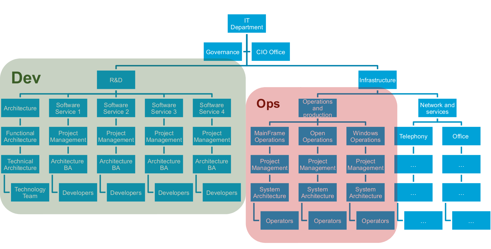

主要由于历史的原因（大部分运维人员来自硬件和电信业务领域），运维人员和开发者分属不同的组织结构分支。开发者属于研发部门，而运维人员大部分时候属于基础架构部门（或专门的运维部门）。

别忘了，他们有着不同的目的：


此外作为旁注，这两个团队有时候会使用不同的预算来运营。开发团队使用构建（Build）预算，运维团队使用运营（Run）预算。不同的预算，对控制权越来越高的需求，以及企业 IT 成本的缩水，这些因素结合在一起会进一步放大两个团队各自目的的对立性。

（依本人愚见，时至今日，随着人与人之间无时无刻随时随地进行的交互，以及由不同目的推动着企业和社会进行数字化转型，IT 预算方面古老的“规划 / 构建 / 运行”框架已经不那么合理了，不过这又是另一回事了。）

### 1.3 运维人员测挫败感

接下来看看运维人员，一起看看典型的运维团队把大部分时间都花在哪里了：

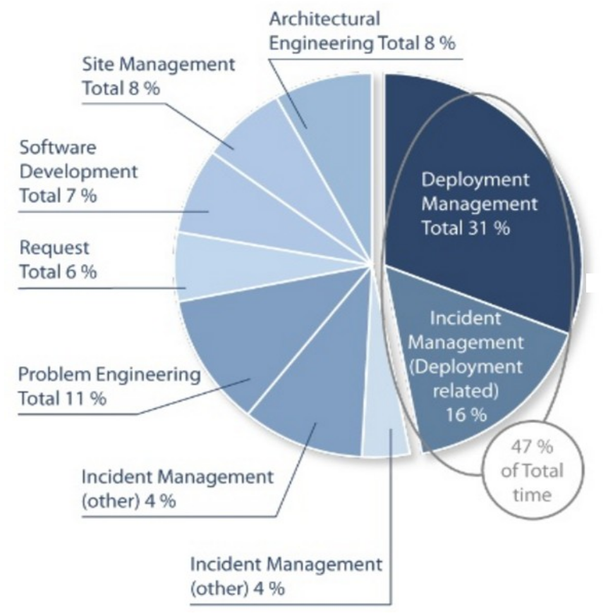

（来源：[ Study from Deepak Patil [Microsoft Global Foundation Services\] in 2006, via James Hamilton [Amazon Web Services]](http://mvdirona.com/jrh/TalksAndPapers/JamesHamilton_POA20090226.pdf)

生产团队有将近一半（47%）的时间花在了与部署有关的工作中：

- 执行实际的部署工作，或
- 修复与部署工作有关的问题

这样的 KPI 其实相当疯狂，但实际上我们早就应该采纳。实际上早在 40 年前，计算机科学的“原始时代”就已涌现出运维团队，当时计算机主要运用在工业界，运维人员需要手工运行大量命令来执行自己的任务。为了履行职责，他们已经习惯于按照清单运行各种各样的命令或手工流程。

突然有一天他们终于意识到自己“总在做着相同的事情”，然而长达四十多年的工作过程中却几乎没人考虑过变革。

考虑到这一点你会发现，实在是太疯狂了。平均来说，运维人员将近一半的时间都在处理与部署有关的任务！

为了改变这种状况，必须考虑到两个最关键的需求：

1. 通过自动化部署将目前这种手工任务所需的时间减少 31%。
2. 通过产业化措施（类似于通过 XP 和敏捷实现的软件开发产业化）将需要处理的与这些部署有关的问题减少 16%。

### 1.4 基础架构自动化

在这方面也有一个相当富有启发性的统计结果：

以手工操作的数量所表示的成功部署概率。


这些统计告诉我们：

- 只需手工运行 5 条命令的情况下，成功部署的概率就已跌至 86%。
- 如需手工运行 55 条命令，成功部署的概率将跌至 22%。
- 如需手工运行 100 条命令，成功部署的概率将趋近于 0（仅 2%）！

成功部署意味着软件能够按照预期在生产环境中运行。未能成功部署意味着有东西出错，可能需要进行必要的分析才能了解部署过程中哪里出错，是否需要应用某种补丁，或需要修改某些配置。

**因此让这一切实现自动化并不惜一切代价避免手工操作似乎是个好主意，对吧？**

那么行业里这方面的现状是怎样的：

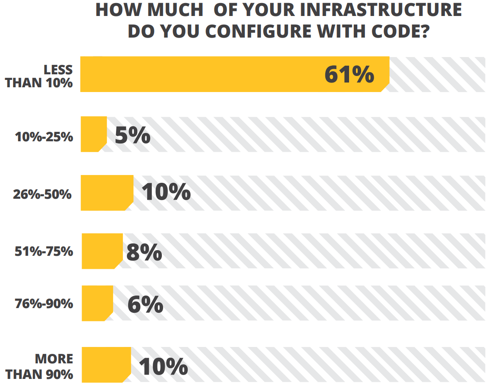

（来源：[ IT Ops & DevOps Productivity Report 2013 - Rebellabs ](http://pages.zeroturnaround.com/rs/zeroturnaround/images/it-ops-devops-productivity-report-2013 copy.pdf)）

（说实话，这个统计信息比较老了，是 2013 年的结果，相信现在的结果会有所不同）

然而这也可以让我们明确的知道，在基础架构自动化方面我们还有多远的路要走，并且 DevOps 的基本原则和实践依然是那么的重要。

网络巨头们当然会通过新的方法和实践及时满足自己的需求，他们早已开始构建自己的工程业务，而正是他们所确立的实践逐渐衍生出当今我们所熟悉的 DevOps。

看看这些网络巨头们在这方面目前所处的位置吧，举几个例子：

- Facebook 有数千名开发和运维人员，成千上万台服务器。平均来说一位运维人员负责 500 台服务器（还认为自动化是可选的吗？）他们每天部署两次（环式部署，Deployment ring 的概念）。
- Flickr 每天部署 10 次。
- Netflix 明确针对失败进行各种设计！他们的软件按照设计从最底层即可容忍系统失败，他们会在生产环境中进行全面的测试：每天通过随机关闭虚拟机的方式在生产环境中执行 65000 次失败测试…… 并确保这种情况下一切依然可以正常工作。

他们这种做法秘密何在？

### 1.5 DevOps：仅此一次，一颗神奇的银子弹

他们的秘密很简单：**将敏捷扩展至生产端**：


DevOps 的共存主要是为了扩展敏捷开发实践，进一步完善软件变更在构建、验证、部署、交付等阶段中的流动，同时通过软件应用程序的全面所有权予力跨职能团队完成从设计到生产支持等各环节的工作。

DevOps 鼓励软件开发者和 IT 运维人员之间所进行的**沟通**、**协作**、**集成**和**自动化**，借此有助于改善双方在交付软件过程中的速度和质量。

DevOps 团队更侧重于通过标准化开发环境和自动化交付流程改善交付工作的可预测性、效率、安全性，以及可维护性。理想情况下，DevOps 可以为开发者提供更可控的生产环境，帮助他们更好地理解生产基础架构。

DevOps 鼓励团队自主进行自己应用程序的构建、验证、交付和支持。

**那么核心原则到底是什么？**

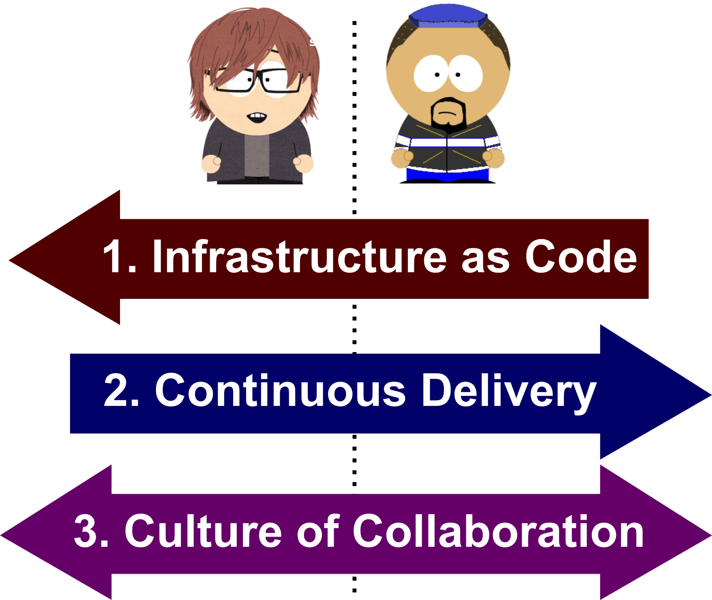

下文将介绍最重要的三大基本原则。

## 2. 基础架构即代码

人总会犯错，因为人脑实在是不擅长处理重复性的任务，相比 Shell 脚本，人类的速度实在是太慢了。毕竟我们都是人类，因此有必要像处理代码那样考虑和处理有关基础架构的概念！

基础架构即代码（IaC）是大部分通用 DevOps 实践的前提要求，例如版本控制、代码审阅、持续集成、自动化测试。这一概念涉及计算基础架构（容器、虚拟机、物理机、软件安装等）的**管理**和**供应**，以及**通过机器可处理的定义**文件或脚本对其进行的配置，交互式配置工具和手工命令的使用已经不合时宜了。

这一原则对 DevOps 的重要性怎么强调都不为过，它可以真正将软件开发相关的实践应用给服务器和基础架构。

云计算使得复杂的 IT 部署可以继续效仿传统物理拓扑。我们可以相对轻松地对复杂虚拟网络、存储和服务器的构建实现自动化。服务器环境的方方面面，上至基础架构下至操作系统设置，均可编码并存储至版本控制仓库。

### 2.1 概述

以非常概括的方式来看，基础架构和运维所需实现的自动化程度可通过下图这种架构来表示：

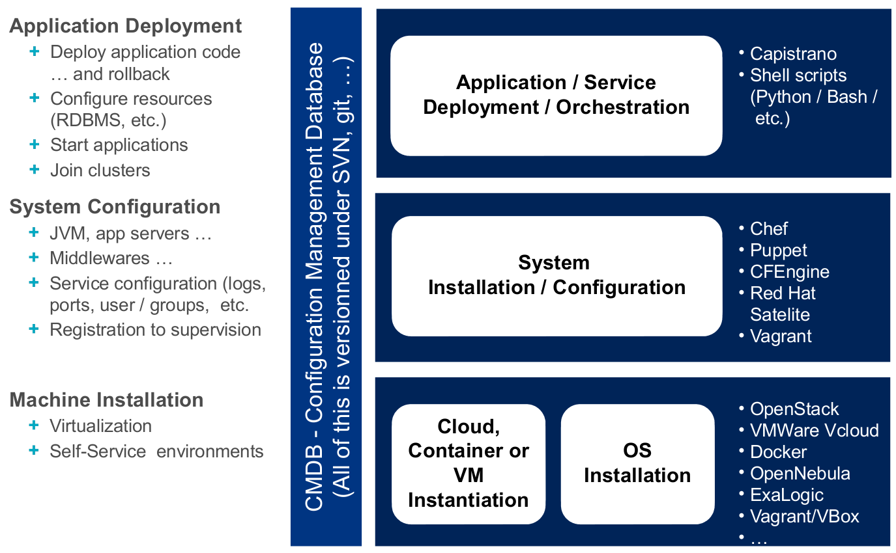

上述架构图中作为示例的工具主要面向不同层的构建工作，实际上 DevOps 工具链的作用远不止如此。

我觉得在这里可以略微深入地谈谈 DevOps 的工具链了。

### 2.2 DevOps 工具链

DevOps 实际是一种文化上的变迁，代表了开发、运维、测试等环节之间的协作，因此 DevOps 工具是非常多种多样的，甚至可以由多种工具组成一个完整的 DevOps 工具链。此类工具可以应用于一种或多种类别，并可体现出软件开发和交付过程的不同阶段：

- **编码**：代码开发和审阅，版本控制工具、代码合并工具
- **构建**：持续集成工具、构建状态统计工具
- **测试**：通过测试和结果确定绩效的工具
- **打包**：成品仓库、应用程序部署前暂存
- **发布**：变更管理、发布审批、发布自动化
- **配置**：基础架构配置和部署，基础架构即代码工具
- **监视**：应用程序性能监视、最终用户体验

虽然可用工具有很多，但其中一些环节是组织内部应用 DevOps 工具链不可或缺的。

诸如 Docker（容器化）、Jenkins（持续集成）、Puppet（基础架构构建）、Vagrant（虚拟化平台）等常用、广泛使用的工具都是 2016 年的 DevOps 热门工具。

**基础架构组件的版本控制、持续集成和自动化测试**

基础架构的**版本控制**能力（而非基础架构的构建脚本或配置文件）及对其进行**自动化测试**的能力极其重要。

DevOps 最终会将 30 年前软件工程领域所采用的同一套 XP 实践带至生产端。

此外基础架构元素应该能向软件交付物一样进行**持续集成**。

### 2.3 收益

DevOps 的收益有很多，包括但不限于：

- 可重复性与可靠性

    ：时至今日，构建生产用计算机只需要运行脚本或必要的 puppet 命令即可。通过恰当地使用 Docker 容器或 Vagrant 虚拟机，只需运行

    一条命令

    即可配置好包含操作系统层以及所需软件和配置的生产用计算机。当然，随着各种变更或软件开发、持续集成，并自动测试，这套构建脚本或机制也会进行持续集成。

    最终幸亏有了 XP 或敏捷，我们在软件开发端所使用的同一套实践也能让运维端获益。

- **生产力**：一键部署，一键供应，一键创建新环境……整个生产环境可以通过一条命令或一键点击的方式创建。这样的一条命令也许会运行长达数小时，但在这过程中运维人员可以从事其他更有趣的工作，而无需等待一条命令执行完毕后继续输入下一条命令，毕竟这样的过程有时候可能需要花费几天时间才能完成……

- **恢复时间！**：一键点击即可恢复生产环境，就是这么简单。

- **确保基础架构的同质**：彻底避免运维人员每次构建环境或安装软件时最终获得的结果与预期有所差异，这是确保基础架构绝对同质（Homogeneous）并且可再现的唯一可行方法。以此为基础，通过对脚本或 Puppet 配置文件使用版本控制机制，我们甚至可以重建出与上周、上个月，或软件特定版本发布时完全一致的生产环境。

- **维持整齐划一的标准**：基础架构标准甚至可以不复存在，代码本身就是标准。

- **让开发者自行完成大部分工作**：如果开发者自己突然可以在自己的基础架构上一键点击重建生产环境，他们也就可以自行完成很多与生产环境有关的任务，例如更好地理解生产失败，提供更恰当的配置，实现部署脚本等。

这只是我个人感觉 IaC 可提供的部分收益，相信还有很多其他收益。

## 3. 持续交付

持续交付是一种可以帮助团队以更短的周期交付软件的方法，该方法确保了团队可以在任何时间发布出可靠的软件。该方法意在以更快速度更高频率进行软件的构建、测试和发布。

通过对生产环境中的应用程序进行更高频次的增量更新，这种方法有助于降低交付变更过程中涉及的成本、时间和风险。足够简单直接并且可重复的部署流程对持续交付而言至关重要。

**注意：持续交付 ≠ 持续部署** - 有时候很多人会把持续交付误认为成持续部署。持续部署是指每个变更可以自动部署到生产环境。持续交付是指团队确保每个变更可以部署至生产环境，但也许并不需要实际部署，这通常可能是出于业务方面的原因。只有成功实现持续交付的前提下，才能进行持续部署。

持续交付的主要想法在于：

- **部署越频繁，对部署流程就会越熟悉，自动化机制就能获得更好的结果**。如果同一件事每天需要执行 3 次，很快你将变的无比娴熟，但很快也会因为日复一日解决同样的问题而感到厌烦。
- **部署越频繁，所部属的变更集就越微不足道**，而这些微不足道的内容最有可能出错，甚至可能导致丢失对整个变更集的控制力。
- **部署越频繁，TTR（修复／解决所需时间）指标就会越出色**，从业务用户处获得有关功能的各类反馈的速度越快，作出改进以便完美满足对方需求的过程也会越简单（这方面 TTR 与 TTM 其实非常相似）。

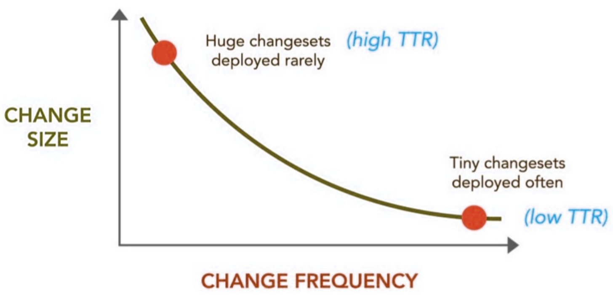

（来源：[ Ops Meta-Metrics: The Currency You Pay For Change ](http://fr.slideshare.net/jallspaw/ops-metametrics-the-currency-you-pay-for-change-4608108)）

但持续交付并不仅仅是尽可能频繁地构建可发布、生产就绪版本的软件产品那么简单。持续交付包含 3 个关键实践：

- 从实践中学习
- 自动化
- 更频繁的部署

### 3.1 从实践中学习

持续交付的关键在于要能**从实践中学习**。真理并不存在于开发团队中，而在于业务用户中。然而无论花多长时间，没人能真正清楚地表达自己的想法，或者将自己的想法用清晰的文档概括出来。也正是因此，敏捷方法论强调将功能提供给用户，并不惜一切代价从用户处获得尽可能多的反馈。

持续交付与持续部署类似，需要尽可能减少前置时间，这也是尽快从用户处获得“真理”的关键。

但真理绝对不会来自正规形式的用户反馈。我们绝不能尽信自己的用户或寄希望于通过正规形式的反馈了解用户。我们只能相信自己的度量。

**痴迷于度量**是精益创业（Lean Startup）活动中一个重要的概念，但这一概念对 DevOps 同样重要。我们应该度量一切！确定最恰当的度量指标可以让团队了解某种方法最终能否成功或失败，了解怎样做可以获得更好的结果，以及哪些最成功的做法同时也蕴含着一定的风险。为了帮助团队做出更明智的决策，在确定要衡量的指标时，一定要抱着“宁多勿少”的原则。

不需要“考虑”，只需要“知道”！“知道”的唯一方法就是度量，度量一切：响应时间、用户思考时间、展示次数、API 调用次数、点击率等，但这些并非需要度量的全部。找出所有能让你更进一步了解用户对功能看法的度量指标，对所有这些指标进行度量！

这种方法可以表示为如下形式：

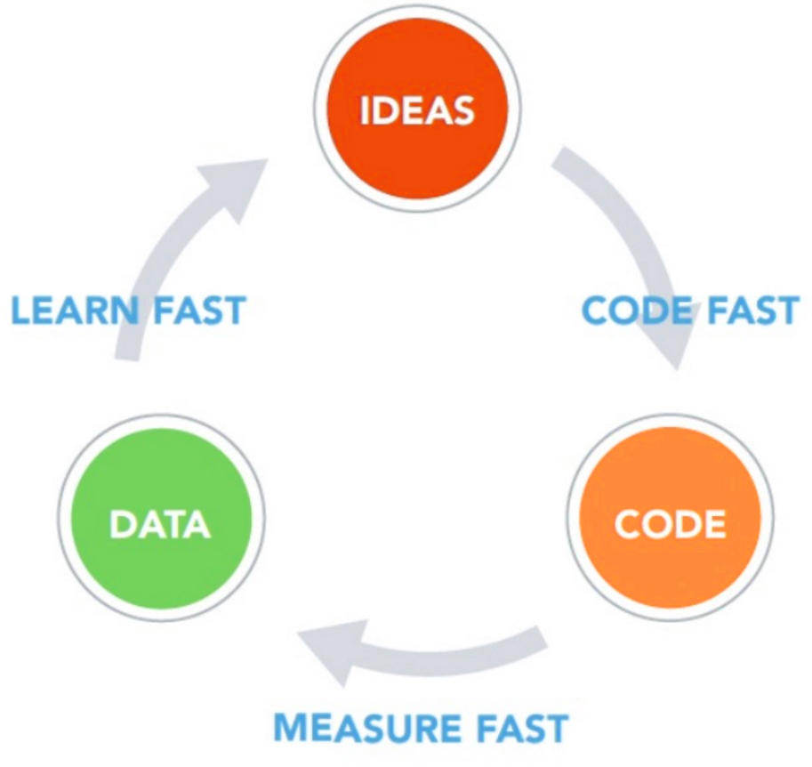

### 3.2 自动化

自动化已经在上文`2. 基础架构即代码`一节进行了讨论。

在这里我想强调的是，在没有将与基础架构有关的所有供应和任务实现妥善、全面的自动化之前，持续交付根本无从谈起。

这一点很重要，因此有必要再重复一遍：环境的搭建和生产就绪版本软件的部署只需要一键点击，只需要运行一条命令，整个过程应该自动完成。否则根本无法设想能一天多次部署同一个软件。

在下文的`3.5 零停机部署`一节中，还将介绍有助于自动化交付的其他重要技术。

### 3.3 更频繁的部署

DevOps 的信条在于：

**“越是困难的事，需要更频繁地进行！”**

敏捷思维中，困难任务更要迎难而上，更频繁地去做，这中想法非常重要。

自动化测试、重构、数据库迁移、面向客户的产品规格、规划、发布 - 所有这些活动都要尽可能频繁地进行。

原因主要有三点：

1. 首先，随着要做的工作量逐渐增加，这些任务也会变的愈加困难，但如果能拆解为小块，则会变的相对容易些。

    以数据库迁移为例：一些涉及大量表的大规模数据库迁移工作很麻烦，容易出错。但如果一次只迁移一部分，则可以相对较容易地成功完成整个迁移任务。此外还可以轻松地将多个小规模的迁移任务安排成一定的序列，在将一个艰难的大任务拆解为一系列容易实现的小目标后，处理起来就简单多了。（这也是数据库重构的本质）

2. 第二个原因在于反馈。大部分敏捷思维关注的是设置反馈环路，借此让我们更快速地学习了解。反馈已经是极限编程（Extreme Programming）中一个非常重要，蕴含巨大价值的概念。在诸如软件开发等复杂流程中，我们需要更频繁地检查自己的最新进展，并进行必要的纠正。为此我们必须尽一切可能创建反馈环路，并提高反馈的频率，这样才能更快速地酌情做出调整。

3. 第三个原因是实践。对于任何活动，越频繁地从事就越能获得完善。实践可以帮助我们理清整个流程，让我们更熟悉代表有事情出错的征兆。只要认真琢磨自己从事的工作，就能提炼出近一步完善所需的实践。

    对于软件开发，也有可能实现一定程度的自动化。一旦有人将某件事做了多次，就可以更容易地确定该如何进行自动化，更重要的是，这样的人在对这些事情实现自动化方面将有更大的动机。此时自动化尤为重要，因为可以加快速度并降低出错的概率。

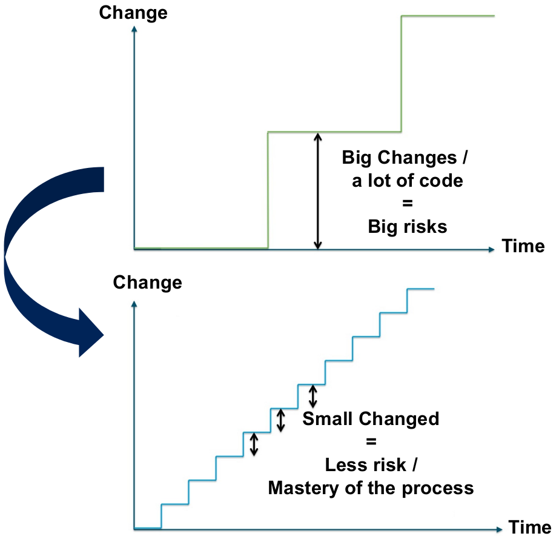

那么这就产生了一个问题：**使用 DevOps 方法时，该选择怎样的交付频率？**

这个问题没有标准答案，而是取决于产品、团队、市场、公司、用户、运维需求等各种因素。

我认为最佳答案应该是：如果不能实现至少每两周一次交付，或在冲刺阶段结束时交付，那么连敏捷都谈不上，DevOps 又从何谈起呢？

DevOps 鼓励我们尽可能频繁的交付。在我看来，你需要对团队进行培训，让他们能够做到尽可能频繁的交付。我在我的团队中使用的一种较为可行的方法是在 QA 环境中每天交付两次。交付过程是完全自动化的：每天两次，中午和午夜各一次，计算机启动起来，构建软件组件，运行集成测试，构建并启动虚拟机，部署软件组件，对其进行配置，运行功能测试等。

### 3.4 持续交付的前提需求

在改为使用持续交付方式**之前**，需要满足哪些要求？

我草拟的需求清单如下：

- 对软件组件的开发和平台的供应和设置进行持续集成。
- TDD - 测试驱动的开发。这一点还有待商榷……但始终还是需要面对：TDD 是目前唯一能通过单元测试对代码和分支进行可接受程度覆盖的方法（单元测试使得问题的修复过程比集成测试或功能测试容易很多）。
- 代码审阅！至少要进行代码审阅……如果能进行结对编程（Pair programming）当然就更好了。
- 软件的持续审计 - 例如使用 Sonar。
- 在生产级环境实现功能测试的自动化。
- 更强大的非功能测试自动化（性能、可用性等）。
- 独立于目标环境的自动化打包和部署。

另外在管理重大功能和演进时，还需要具备健全的软件开发实践，例如零停机部署技术。

### 3.5 零停机部署

**“零停机部署（ZDD）可在不中断现有服务的情况下部署新版系统。”**

通过 ZDD 方式部署应用程序时，可在确保用户不会遭遇应用程序停机的前提下将新版应用引入生产环境。从用户和公司的角度来看，这应该是最佳部署方式，因为可以在不造成任何中断的情况下引入新功能并修复 Bug。

下文将介绍 4 种技术：

1. 功能开关（Feature Flipping）
2. 摸黑启动（Dark launch）
3. 蓝／绿部署（Blue/Green Deployment）
4. 金丝雀发布（Canari release）

**功能开关**

功能开关可供我们在软件运行过程中启用／禁用相应的功能。这种技术其实非常容易理解和使用：为生产版本提供一个能彻底禁用某项功能的配置，并只在对应功能彻底完工可以正常工作后才将该属性激活。

举例来说，若要将某个应用程序内的一个功能全局禁用或激活：

```
if Feature.isEnabled('new_awesome_feature')
    # Do something new, cool and awesome
else 
    # Do old, same as always stuff
end
```

或者如果要真对具体用户实现类似目的：

```
if Feature.isEnabled('new_awesome_feature', current_user)
    # Do something new, cool and awesome
else 
    # Do old, same as always stuff
end 
```

**摸黑启动**

摸黑启动的目的在于通过生产环境进行负载模拟！

在测试环境中，通常很难为软件模拟出成百上千万用户规模的负载。

如果不进行切实的负载测试，就无法知道基础架构能否承受住最终面临的压力。

此时并不需要模拟负载，而是可以实际部署这样的功能，然后看看在不影响可用性的前提下到底会发生什么。

Facebook 将这种做法称之为功能的“摸黑启动”。

假设我们要将一个有 5 亿用户使用的静态搜索字段变成一个包含自动补全功能的字段，借此让用户可以更快速获得搜索结果。为该功能构建一个 Web 服务，并且希望模拟所有用户同时输入文字，向该 Web 服务生成大量请求的场景。

此时即可通过摸黑启动策略为现有表单添加一个隐藏的后台进程，通过该进程将输入的搜索关键字发送给新增的自动补全服务，并自动发送多次。

就算新增的 Web 服务彻底崩溃了，也不会造成任何实质损害。网页上可以完全忽略服务器错误。而就算该服务崩溃了，我们至少还可以对该服务进行优化和完善，直到能承受如此大量的负载。

这就等于在现实世界中进行了一次负载测试。

**蓝／绿部署**

蓝／绿部署是指为下一版产品构建另一个完整的生产环境。开发和运维团队可以在这个单独的生产环境中放心地构建下一版产品。

当下一版产品全部完成后，可以修改负载均衡器的配置，以透明的方式将用户自动重定向至新发布的下一版。

随后可将上一版的生产环境回收，用于构建下下一版的产品。

以此类推。

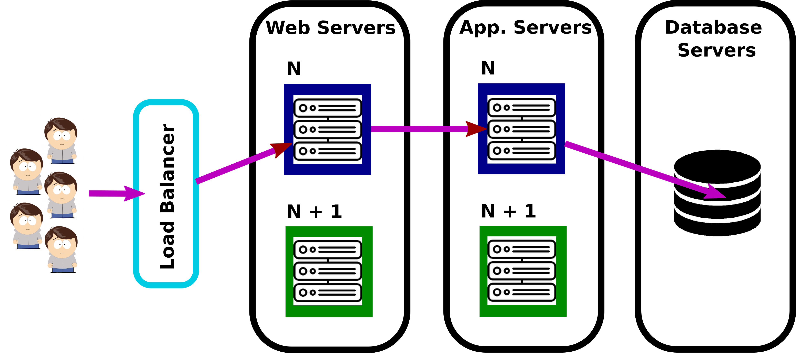

（来源：[ Les Patterns des Géants du Web – Zero Downtime Deployment ](http://blog.octo.com/zero-downtime-deployment/)）

这是一种相当有效简单的方法，但问题在于这种方式需要双倍的基础架构以及更多的服务器等。

假设一下 Facebook 希望将包含成千上万台服务器的环境“照原样再来一套”……

其实还有更好的方法。

**金丝雀发布**

从本质来看，金丝雀发布与蓝／绿部署非常类似，但无需准备额外的一套生产环境。

这种方式的目标在于以增量的方式将用户切换至新版本：随着越来越多的服务器从当前版本迁移至下一版，相同比例的用户也会被同时迁移。

通过这种方式，每个生产环境都能获得与负载需求相匹配的服务器数量。

首先，只将少量服务器和少部分用户迁移至下一版，借此还可以在无须冒险影响所有用户的前提下对新版进行测试。

当所有服务器最终从当前版迁移至下一版后，发布工作已经完成，又可以从头开始准备下下一版了。

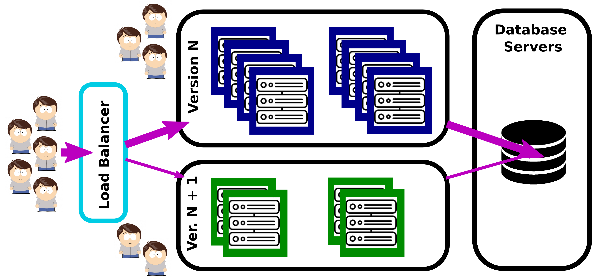

（来源：[ Les Patterns des Géants du Web – Zero Downtime Deployment ](http://blog.octo.com/zero-downtime-deployment/)）

## 4. 协作

敏捷软件开发破除了需求分析、测试和开发之间的一些隔阂。部署、运维和维护等其他活动与软件开发过程中的其他环节也存在类似的分隔。DevOps 方法意在破除所有这些隔阂，鼓励开发和运维人员之间的协作。

如果没有培养出正确的文化，就算有最棒的工具，DevOps 对你而言也不过是另一个热门词汇罢了。

DevOps 文化的主要特征在于开发和运维角色之间日益增加的协作。这是一种在团队内部以及组织层面上很重要的文化变迁，通过这样的变迁才能促进更好的协作。

这种方式解决了一个非常重要的问题，而这个问题完全可以用下面这个网络流行话来体现：

团队合作对 DevOps 是如此的重要，大部分方法论所要实现的最终目标总的来说可以通过两个 C 来实现：协作（Collaboration）和沟通（Communication）。虽然单纯做到这些距离真正的 DevOps 工作环境还有很大的差距，但任何公司只要能坚持这两个 C，就等于迈出了最正确的第一步。

但为什么会那么难做到？

### 4.1 混乱之墙

因为有一堵混乱之墙：


在传统开发周期中，开发团队将新发布的软件“隔墙扔给”运维人员，意味着自己的工作已经顺利完成。

运维人员接手开发者的成果，准备开始进行部署。运维人员手工修改由开发者提供的部署脚本，当然更多时候这些脚本都是运维人员自己维护的。

运维人员还需要手工修改配置文件，以反映生产环境的需求，而生产环境往往与开发或 QA 环境有很大差异。

就算最理想的情况，运维人员可能只是做了一些在上一个环境中已经做过的重复工作，而最糟糕的情况，可能会引入或发现新的 Bug。

随后 IT 运维团队开始讨论他们所认为的，目前最正确的部署流程，然而由于开发和运维在脚本、配置、流程，甚至环境等方面的差异，基本上等同于要从零开始将所有工作重新执行一遍。

当然这一过程中不可避免会遇到问题，他们联系开发者希望进行排错。运维称开发者提供的代码本身有问题，开发者则回应称代码在自己的环境中一切正常，因此错误肯定源自运维端。

由于配置、文件位置，以及面临这种状态所执行的操作与自己的预期等因素存在较大差异，开发者甚至很难对这样的问题进行诊断。变更窗口留下的时间所剩无几，当然也没什么足够靠谱的方法将环境回滚至上一个正常状态。

那么原本应该一帆风顺的部署过程，为什么最后却变成了“众志成城”的应急演习？必须经历大量指责和错误才能最终让生产环境恢复可用状态？

这种情况经常发生，**经常**！

**DevOps 来救场了**

通过在共同的业务目的情境中让开发和运维角色与流程变的一致，DevOps 有助于促进 IT 的统一。开发和运维都需要明确，自己是统一业务流程的一份子。DevOps 思维确保了无论组织结构是怎样的，个体决策与行为需要尽力为统一的业务流程提供支持和促进作用。

亚马逊 CTOWerner Vogel 甚至在 2014 年说过：

**“谁开发，谁运行。”**

### 4.2 软件开发流程

下图简要描述了敏捷软件开发流程通常的样子。

最开始，业务代表与产品负责人以及架构团队合作定义软件，这一过程可能会使用 Story Mapping 和用户故事，或者使用更完整的规范。

随后开发团队通过短暂的开发冲刺开发出软件，并在每个冲刺结束后将生产就绪版本的软件发布给业务用户，进而收集反馈并尽可能频繁地调整方向。

最后，经历过每个新的里程碑后，将软件部署给整个业务线更广泛的用户群体。

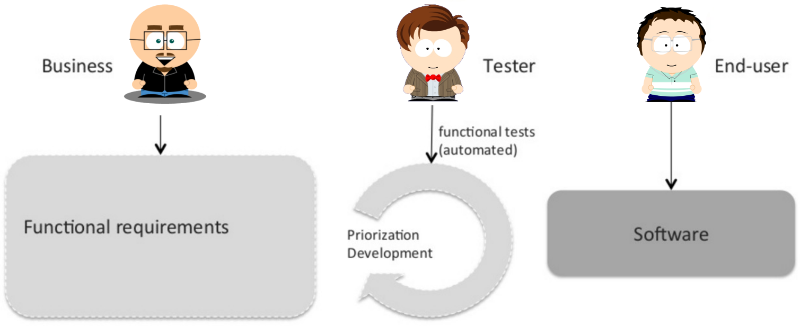

DevOps 造成的最大挑战在于需要理解**运维人员是软件的另一个用户群体！**因此他们也应该被全面纳入软件开发流程中。

在预定的时间里，运维应该给出自己的非功能需求，就如同业务用户给出自己的功能需求一样。开发团队应该按照同等程度的重要性和优先级处理这种非功能需求。

在实现的过程中，运维应该持续提供反馈和非功能测试规范，就像业务用户针对功能特性提供反馈一样。

最后，运维和业务用户一样，成为了软件的用户。


通过采用 DevOps 方法，运维可以全面融入软件开发流程中。

### 4.3 共享工具

在传统的大型企业中，运维团队和开发团队分别使用专用的，没有什么交集的工具集。

运维人员通常并不想了解开发团队所使用的 SCM 系统以及持续集成环境。他们认为这些并非自己的本职工作，害怕自己在触及这些系统后会被开发者的各种请求所淹没。毕竟他们为了照料生产系统就有忙不完的工作了。

另一方面，开发者通常无法访问生产系统的日志和监视日志，有时这是因为没有这样的意愿，有时则是因为制度或安全方面的顾虑。

这种状况需要改变！DevOps 应运而生。

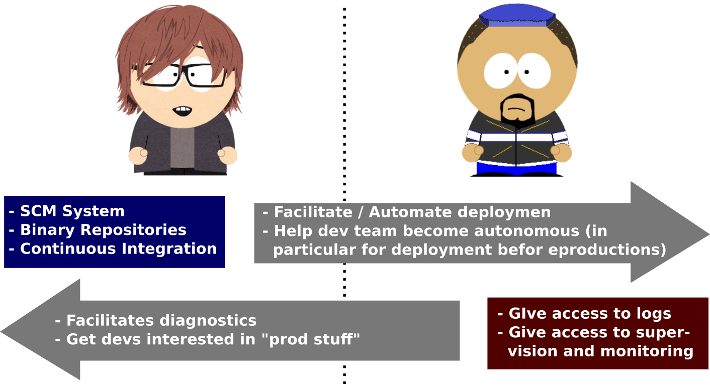

这个目标其实很难实现。举例来说，出于制度或安全方面的原因，日志可能会被实时匿名化，同时需要对监管工具进行必要的保护，以避免未经培训或本应被禁止的开发者更改生产环境的配置。因此实现这一目标需要付出大量时间和成本资源。但这样做所能获得的收益远大于所需进行的投入，这种方法对整个公司的投资回报非常明显。

### 4.4 协同工作

DevOps 的一种基本哲学是认为，开发者和运维人员必须定期进行密切的合作。

这就意味着他们必须将对方视作重要的利益相关者，并积极主动地寻求合作。

受到 XP 实践中“现场客户”的启发，敏捷开发者受此激励可以与业务进行更紧密的合作，自律的敏捷者还可以更进一步将这样的实践运用给更广泛的利益相关者，例如可以让开发者与所有其他相关者进行合作，**包括运维和支持人员**。

这是一条双行道：运维和支持人员也必须愿意与开发者进行密切的合作。

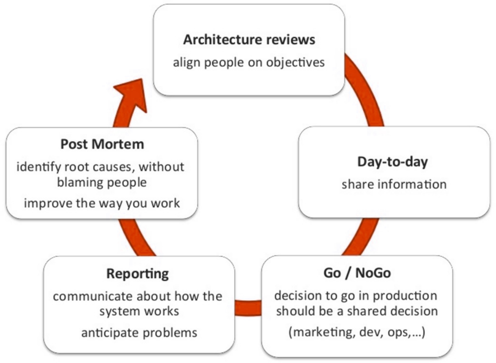

此外还可以通过协作：

- 让运维人员参与敏捷仪式（每日 Scrum、冲刺规划、再次冲刺等）
- 让开发者参与生产环境的推出任务
- 在开发和运维之间打造统一的持续改进目标

## 5. 结论

DevOps 是一次革命，主要是为了消除拥有大规模 IT 部门的大型企业中，开发团队和运维团队之间由于历史原因产生的隔阂与孤立所造成的混乱现状。

在我 15 年的职业生涯中，2/3 的时间就职于此类大行机构，其中大部分是金融机构，每天我都在见证者这堵混乱之墙的存在。例如我经常会听到这样的说法：

- “在我的 Tomcat 上工作很正常，很抱歉，但我完全不懂你所用的 Websphere，帮不上你了。”（开发者说）
- “我们真的不能从生产数据库中给你提取这张表，里面包含了与客户有关的机密数据。”（运维人员说）

每天都会遇到其他很多类似的对话……天天如此！

好在 DevOps 日渐成熟，越来越多传统企业也在开始逐渐走上正途，开始接受 DevOps 的原则和实践。但还有很多企业无动于衷。

那么对于那些小规模的，开发和运维职能之间通常不会产生那么大分歧的企业呢？

这样的企业应用 DevOps 原则和实践，例如自动化部署、持续交付和功能开关，一样能获益匪浅。

我认为 DevOps 原则可以总结为：

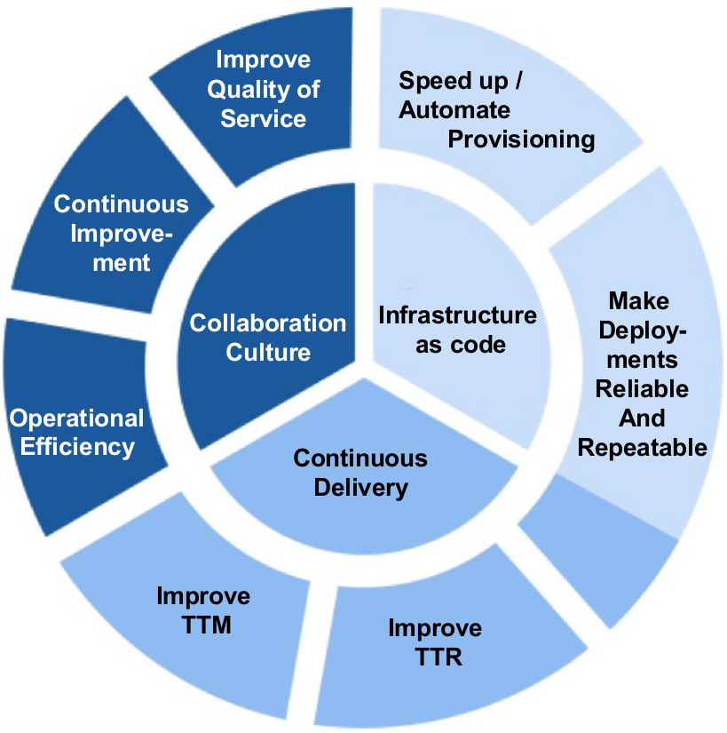

DevOps 实际上是向着大规模敏捷（Scaling Agility）迈出的另一步！


# DevOps & SRE 必备技能清单

## 导读

- 这个列表并非详尽无遗，只是列举了技术基础、必须知道的技能和一些随机的想法。可以用它们作为一个清单来评估你自己或其他人，或者为下一次面试 DevOps/SRE（Site Reliability Engineers，网站可靠性工程师）工作做准备。补充下，这个清单是比较个人的想法。

## 免责声明

这个清单由[ Sahil Sharma ](http://w.san.wccnw.top/browse.php?u=Gp/XsKoJrPUlchjyi/1DVnTq7naXMZq4Xis=&b=13)和[作者](http://w.san.wccnw.top/browse.php?u=Gp/XsKoJrPUlchjyi/1DVnbtsHPS&b=13)共同完成。我们已经发布了它的第一个版本（[ DevOps 和网站可靠性工程师必备技能清单](http://w.yi.wccnw.top/browse.php?u=50OTe5PDnCC3vf%2bpfzkh8a00GS%2bVNnU1tpv3AEEBIALvr1Yv9iYXk6mswk%2bhvAwSGrSDrw%2bbch4bRCBmyzHnaQAKRa090KOc9YEpCudu7wCNZ6Bqrv2%2b7SKlQnnJ5hk5Uto=&b=13)）。本文是最新的版本更新。

**下一步是什么？更了解 DevOps 生态系统：**

- 首先，一定要了解文化要点的重要性：在这里（[ 15 点 DevOps 检查表](http://w.san.wccnw.top/browse.php?u=Gp/XsLMboegkekS/h/8BHXb0sTOQAoHmBSzaAaweVgZL9wvn3ZkrIAh8m848ZkDJvewBfBudLtEkKJwX5q6rCTiNJyF6QA==&b=13) ）可以读到更多信息。

- 您应该掌握 *nix 系统并且很好地理解 Linux 发行版的工作原理。

- 为产品设置选择一个操作系统。不需要掌握每一个操作系统，这会让你的工作陷入困境，选择其中一个并掌握它。

- 能轻松使用终端，可能有一些 GUI 来管理服务器，但是无论如何，必须热爱终端，它更快、更安全，坦白说，一旦掌握了用起来会更容易。

- 如何获取 CPU/ 系统信息（cat /proc/version，/proc/cpuinfo，uptime，等。）

- cron 作业如何运作。在特定日期 / 时间 / 月设置 cron 作业。

- 了解在机器上运行的操作系统是什么（cat /etc/lsb-release）

- 了解不同的 *nix 操作系统之间的区别，以及了解在机器上运行的操作系统（例如 cat /etc/lsb-release）

- shell 之间的区别：sh/dash/bash/ash/zsh

- 如何设置和取消设置 ENV 变量。导出的 ENV 变量是临时的，如何导出永久的变量？

- 什么是 shell 配置文件：〜/.bashrc，.bash_profile，.environment .. 如何为程序初始化文件“添加”设置？

- 了解 Vim，其配置（.vimrc）及其一些基本提示是必须的。

- 日志如何在 *nix 系统中运行，什么是日志记录级别以及如何使用日志管理工具（rsyslog，logstash，fluentd，logwatch，awslogs ..）

- swapping 如何工作。swappiness 是什么。（swapon -s，/proc/sys/vm/swappiness，sysctl vm.swappiness ..）

- 能轻松使用脚本语言轻松自如。Bash 是必须了解的（其他脚本语言也是非常有用的，如 Python，Perl ..）。

- 掌握有用的命令，例如进程监控命令（ps，top，htop，atop ..），系统性能命令（nmon，iostat，sar，vmstat..）和网络故障排除和分析（nmap，tcpdump，ping，traceroute，airmon，airodump ..）。

- 你的备份策略是什么？如何测试备份的可靠性？

- 你知道 ext4，ntfs，fat？知道联合文件系统（Union FS）吗？

- 如何在系统上查看 / 设置网络配置？

- 如何在具有不同子网的计算机上设置静态 / 动态 IP 地址？（提示：CIDR）

- 使用网络数据包分析来分析和了解网络的工作原理：tcpdump，Wireshark ..

- 你熟悉 OSI 模型和 TCP/IP 模型的规范吗？TCP 和 UDP 有什么区别？你知道 vxlan 吗？

- 如何设置防火墙（iptables，至少知道 ufw）：设置规则，列出规则，路由流量，阻止协议 / 端口 ..

- 如何查看 / 设置 / 备份路由器设置？

- DNS 如何工作？如何设置 DNS 服务器（Bind，Unbound，PowerDNS，Dnsmasq ..）？递归（recursive）和权威（authoritative）DNS 有什么区别？如何排除 DNS 故障（nslookup，dig ..）

- 熟悉 DNS 和 A，AAAA，C，CNAME，TXT 记录

- 当你在浏览器中点击 google.com 时会发生什么？从浏览器的缓存、本地 DNS 缓存、本地网络配置（hosts 文件）、路由、DNS、网络、Web 协议中，缓存系统到 Web 服务器（如果深入分析，最基本的问题也很难回答）。

- 熟悉 CDN 提供商（fastly，Akamai 等）

- 熟悉 SSL/TLS 的工作原理以及数字证书的工作原理（https）

- 了解 SSL 证书（需要加密）

- 熟悉更安全的协议和工具：TLS，STARTTLS，SCP，SSH， 

    SFTP，FTPS ..

- 了解 PPTP，OpenVPN，L2TP/IPSec 之间的区别

- 学习为域设置记录集（可以使用 Route53 或 CloudFlare 等托管云服务）

- SSH 如何工作，如何调试它，如何生成 ssh 密钥以及无密码登录到其他计算机

- 什么是 init 系统？你知道 Systemd（自 15.04 以来由 Ubuntu 使 

    用），Upstart（由 Ubuntu 开发），SysV ..

- 用任何软件的源代码编译它（gcc，make 和其他相关内容）

- 如何通过终端用不同的格式压缩 / 解压缩文件（主要是：tar/tar.gz）

- 如何设置 Web 服务器（Apache，Nginx ..）

- 学习使用“awk，sed，sort，uniq”操作 Nginx/Apache 日志文件

- Nginx 和 Apache 有什么区别？什么时候使用 Nginx？什么时候使用 Apache？在同一个 Web 应用程序中，何时以及如何同时使用它们？

- 如何设置反向代理（Nginx ..）

- 如何设置缓存服务器（Squid，Nginx，Varnish ..）

- 如何设置负载均衡器（HAproxy，Nginx ..）

- 如何为您的微服务建立 API 网关（Ambassador，Kong，Traefik，Nginx ..）

- 熟悉 Systemd 以及如何使用 systemctl 和 journalctl 等命令分析和管理服务

- 熟悉 OAuth、SAML、Auth0 集成

- 熟悉 RESTful API，Webhooks，GraphQL，gRPC

- 确保 ES 集群安全（XPack（商业），OpenSource：ReadOnlyREST，Search Guard）

- 使用 snapshot API 或 esdump 进行 ES 备份（快照和增量）（注意：需要 nodejs/npm）

- 使用 DB 备份

- 学习 Python（pip + setup.py）和 BASH。您是否开始使用 Golang 作为脚本语言？尝试一下吧。

- 发展云计算技能。从选择云基础架构提供商开始：Amazon Web Services，Google Cloud Platform，Digitalocean，Microsoft Azure。或者使用 OpenStack 创建自己的私有云。

- staging 服务器怎么样？单元测试的测试策略是什么？端到端？真的需要 staging 服务器吗？Google 下“staging servers must die”。

- 阅读有关 PaaS/Iaas/Saas/CaaS/FaaS/DaaS 和无服务器架构的信息

- 了解如何通过 CLI 中的 Cloud Shell，或你的程序中的 Cloud SDK，来使用和配置云资源

- 了解如何使用至少一个配置管理和远程执行工具（Ansible，Puppet，SaltStack，Chef 等）。您的选择应基于以下标准：语法，性能，模板语言，推拉模型，性能，架构，与其他工具的集成，可伸缩性，可用性等等。

- 用于 image 构建的 Packer

- 将 Jenkins 集成到 CI/CD 中

- 设置 Consul（用于服务发现）

- 开始研究“基础架构即代码”（infrastructure as code），以及基础架构配置自动化工具，如 Terraform 和 Packer

- 开始研究容器和 Docker。容器是底层架构（cgroups 和 namespaces），它是如何工作的？

- 开始熟悉基本的 Docker 命令（logs/inspect/top/ps/rm）。另外得研究 docker hub（push/pull image）

- 开始研究容器编排工具：Docker Swarm，Kubernetes，Mesosphere DC/OS，AWS ECS

- 阅读有关无状态和有状态应用程序的知识

- 学习为您的应用程序构建小型的 docker image（alpine 比较合适）。仅安装所需的包就够了。

- 了解默认运行服务的最常用端口号（如：SSH（22），Web（80），HTTP/S（443）等）

- 从分布式角度学习网络（在容器世界中建立网络）。利用分布式系统中的 8 个谬论，让自己轻松应对。

- 了解 L4/L7 负载均衡器。

- 了解如何确保代理服务器和反向代理服务器的安全（Nginx，Traefik，Ambassador ..），并了解它们的网络系统是如何工作的。

- 熟悉帮助创建可分发和可移植开发环境的工具（例如：Vagrant 和 Docker）。

- 部署应用程序时，管理私密信息。Hashicorp Vault 会帮助你。

- 了解 AWS SQS，Google PubSub 或其它替代方案。

- 熟悉 Kafka，AWS Kinesis 或其它替代方案。

- 了解 AWS RDS，大多数时候 Ops 发现很容易将普通任务委派给服务提供商以避免额外的工作，但这会带来一些费用。

- 如果你在使用 Kubernetes，那么了解它的所有组件和工作。

- 学习如何首先处理 K8s 内置功能，然后学习 Helm/Istio。

- 了解监控的方式和内容（从操作系统和应用程序的角度来看）。

- 一旦到了合适的阶段，接着会需要追踪（Tracing）来帮助理解和挖掘，并且应用程序需要直接支持它

- 如果您正在处理（大）数据工程相关应用程序，那么得熟悉 Hadoop，HBase，Zookeeper，Spark 以及如何设置相关集群

- 学习如何根据应用需求设置和调整 Redis，如何添加身份验证。

- 了解应用程序的性质：CPU 密集型，内存密集型，I/O 密集型，然后了解如何相应地进行处理。

- 学习根据需要在不同类型的数据库之间进行选择：SQL，NoSQL，TSDB，图形数据库 ..

- 学习管理 IAM 角色 / 权限以及如何管理不同用户的密钥（AWS IAM，GCP IAM ..）。

- 如果您喜欢分享并帮助其他人解决遇到过的问题，请将代码发布到 GitHub。

- 学习对基础架构和应用程序进行基准测试以填补空白。

- 不要直接去执行。先可视化最终目标、画图、与开发人员详细讨论、毫不犹豫地提问、让问题彻底变得愚蠢。

- 不时做小型演示或 PoC 以便更好地理解。

- 你熟悉 IDE（Sublime Text，Atom，Eclipse ..）吗？

- 深入了解 DB（MySQL 或任何其它你喜欢的数据库）。

- 了解 Redis/Memcache 以及类似工具。

- 了解微服务架构的优缺点，并开始构建类似的架构。

- 了解如何配置和使用持续集成和持续交付工具，如 Jenkins，Travis CI，Buildbot，GoCd。将这些工具与其它工具（如 Selenium，构建工具，配置管理软件，Docker，云供应商的 SDK 等）集成是非常有帮助的。

- 学习分布式版本控制系统 Git 及其基本命令（pull/push/commit/clone/branch/merge/logs 等）。了解 git 工作流程。你知道如何将 Git 存储库恢复到以前的提交吗？

- 如何使用 SSH 密钥。尝试使用 Github，Bitbucket 或 Gitlab .. 来配置对 repo/account 的无密码访问。

- 熟悉内核版本的混乱以及如何修补它们。

- 了解如何生成校验（md5，SHA ..）以验证任何文件的完整性。

- 了解单体（Monolithic）和微服务（Microservices）架构之间的区别。

- 如何实现零宕机部署？制定回滚、自修复、自动扩展的策略是什么？

- 了解可扩展性和高度分布式系统，如何让它们一直保持运行状态？

- 熟悉 API 和服务：RESTfull，RESTful-like，API 网关，Lambda 函数，serverless 计算，SOA，SOAP，JMS，CRUD ..

- 如何确保基础架构、网络和运行的应用程序的安全？

- 你知道什么是 ChatOps 吗？是否尝试过使用一个已知框架？ Hubot，Lita，Cog？

- 了解如何设置、配置和使用某些监控系统（Nagios，Zabix，Sensu，Prometheus ..）

- 无论你做什么都“记录下来”，无论多么粗糙，做吧。稍后，你会感谢自己的。

- 制作小的代码脚本以方便使用，记下命令或片段（通过 StackOverflow，Github Gists 或其它在线记事板），它会帮助你得到想要的东西。

- 让 Google，StackExchange，Quora 和其它专业论坛成为您的朋友。

- 读，读，读。在 Twitter/StackOverflow 上提问。

- 参加会议。可以加入我们当地的聚会，如[ DevOpsLinks Community 会议（班加罗尔）](http://w.yi.wccnw.top/browse.php?u=3%2bEbCNhA3ow7CQsuY03Ew%2b9bUDOiA8frvqmO0moiy16kn9PAhr7AbzM1BBi%2bWSf0tTYVufBAGhmEHqFP&b=5)，[ DevOpsLinks Community 会议（伦敦）](http://w.yi.wccnw.top/browse.php?u=3%2bEbCNhA3ow7CQsuY03Ew%2b9bUDOiA8frvqmO0moiy36kn9PAhr7AbzMVBBi%2bWSf0tTQ=&b=5)和[ DevOpsLinks Community 会议（巴黎）](http://w.yi.wccnw.top/browse.php?u=3%2bEbCNhA3ow7CQsuY03Ew%2b9bUDOiA8frvqmO0moiy1Cul8rchrDHO04ZExS5Hw==&b=5)。如果想组织当地的聚会，请联系我们，我们将为您提供帮助！

- 与同一领域的研究员交谈并讨论您的问题。通过[社区](http://w.yi.wccnw.top/browse.php?u=lvQbQ8pBxtIlAAc0fU7Ew%2b9b&b=5)学习。

- 加入我们的[ Slack 频道](http://w.yi.wccnw.top/browse.php?u=lvQbQ8pBxtIlAAc0fU7Ew%2b9b&b=5)并询问您的所有（菜鸟级）问题，都没问题！我们都是从开始起步的。

- 不要试图解决所有问题。永远记住一件事：没有人是一座孤岛。你不能做、学习、实现一切。要了解对于手头的任务最重要的是什么。

- 阅读 DevOps 词汇表（请 Google 它）

- 关注开源项目（Kubernetes/Docker 等）或者让您感到兴奋的东西。

- 关注来自[社区](http://w.yi.wccnw.top/browse.php?u=lvQbQ8pBxtIlAAc0fU7Ew%2b9b&b=5)的志同道合的人，并了解最新的科技趋势。

- 尝试搭建良好的开发实践以及坚实的架构。

- 了解如何在生产级别进行扩展。

- 了解如何在生产服务器中实时调试和跟踪运行的应用程序。

- 关注一些合适的科技公司的技术博客（我们跟随：Google/Uber/Quora/Github/Netflix）。这是您可以直接从专家那里学习的地方，并有机会看到他们解决任何问题的方法。

- 浏览一些新闻聚合器，如 Reddit，hackernews，medium 等。

- 在 twitter 上关注志同道合的开发人员和技术公司。 （我总是阅读文章和观看谈话 / 会议，事后剖析（post-mortems）是我最喜欢的内容。我也关注一些 github 库看看我使用的技术发生了什么。）

- 加入[ DevOpsLinks ](http://w.yi.wccnw.top/browse.php?u=lvQbQ8pBxtIlAAc0fU7Ew%2b9b&b=5)、[ Kaptain ](http://w.yi.wccnw.top/browse.php?u=lvQbTM5H3cM/AkAib0c=&b=5)和[ Shipped ](http://w.yi.wccnw.top/browse.php?u=lvQbTcBex9E%2bBR4qc1nEw%2b9b&b=5)！我们相信你会学到很多东西，即使你是专家，你仍然不得不更多地学习。

- 阅读各种与技术相关的博客并订阅 DevOps Newsletters。顺便说一句，我们有一份[出版物](http://w.yi.wccnw.top/browse.php?u=3%2bEbCMJSzcsjAUA5eVDFxOVAEAe0GeH1ppY=&b=5)，您可以提交您的文章并与社区分享。

- 了解开源以及[如何](http://w.yi.wccnw.top/browse.php?u=lvQbTdlZ2ow1DUE4elKNj7IGTkHoRLi0/9PI3Sw3g2rmg8vQm6PdeXALTByoXzzn63QnvfAKCBqeHqcF5g==&b=5)为开源项目做出贡献。

- 如果系统出现问题，您应该能够进行事后剖析。详细记录出现了什么问题，以及如何防止它再次发生。

- 尝试学习 StackOverflow 的专家如何解决问题。永远记住，方法是不断变化的，不像基础知识总是保持不变。

- 读书。

- 最后这点也很重要...... 不要假设任何事情，永远不要把现实视为理所当然，总是去尝试并享受旅程。

如果您拥有以上大部分技能，则可以确保您具备 DevOps、SRE 和系统工程知识的先决条件。

你无法一次性学习所有这些，但是具备这样一个思维模式是主要的。 即使去熟悉所有这些也肯定需要时间，但俗话说旅程很有趣。 你会失败很多次，并从错误中吸取教训，不要重蹈覆辙。


# 有抱负的 DevOps 和 SRE 工程师必读好书清单 

> *原文地址：*[https://medium.com/faun/10-great-books-for-aspiring-devops-sre-engineers-76536c7c4909](https://link.zhihu.com/?target=https%3A//medium.com/faun/10-great-books-for-aspiring-devops-sre-engineers-76536c7c4909)
> *原文作者：*[Aymen El Amri](https://link.zhihu.com/?target=https%3A//medium.com/%40eon01)
> *翻译君：CODING 戴维奥普斯*


以下书籍是推荐给 DevOps 或 SRE 工程师阅读的好书清单，用来学习或增强必要的技能。我们找到了原文清单里英文书籍对应的中文版，希望对大家能有帮助。

CODING 也会持续关注并分享 DevOps 领域最新理念与技术，与 DevOps 工程师一起成长。同时文末有福利放送，别忘了领取！

## **1、《DevOps 实践指南》**

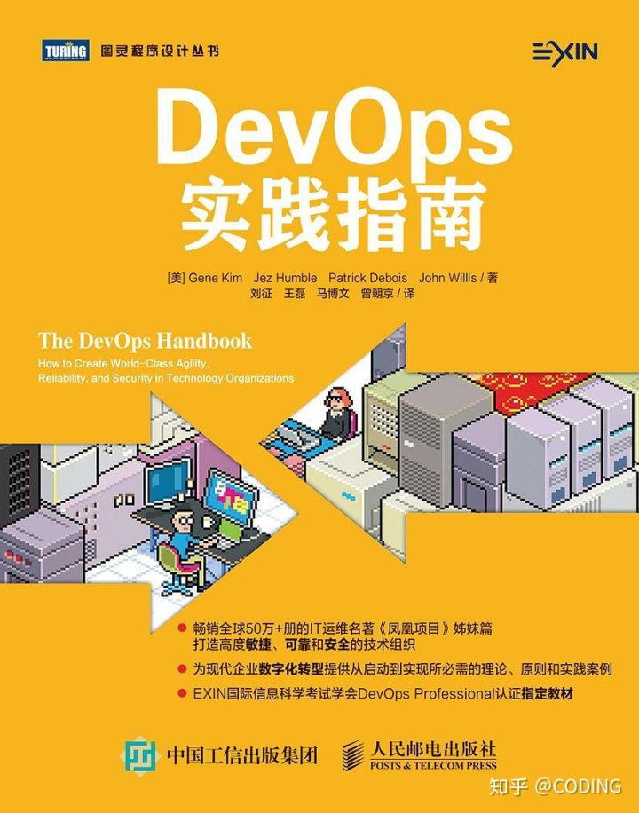

这本书是本清单中最出名的书籍之一，《DevOps 实践指南》是作者丰富的实践指南和多年学习的成果，也是 DevOps 社区中最具影响力的书籍之一。如果你正在搜寻一些历史案例和商业案例以便进行精心研究，试试这本书吧。它是 DevOps 世界的参考书，我非常喜欢它并强烈推荐给开发人员、运维工程师和 IT 经理阅读。

特别适合以下读者： 如果你对 DevOps 领域感兴趣：包括团队组织设计、DevOps 文化和相关技术。

## **2、《微服务设计》**

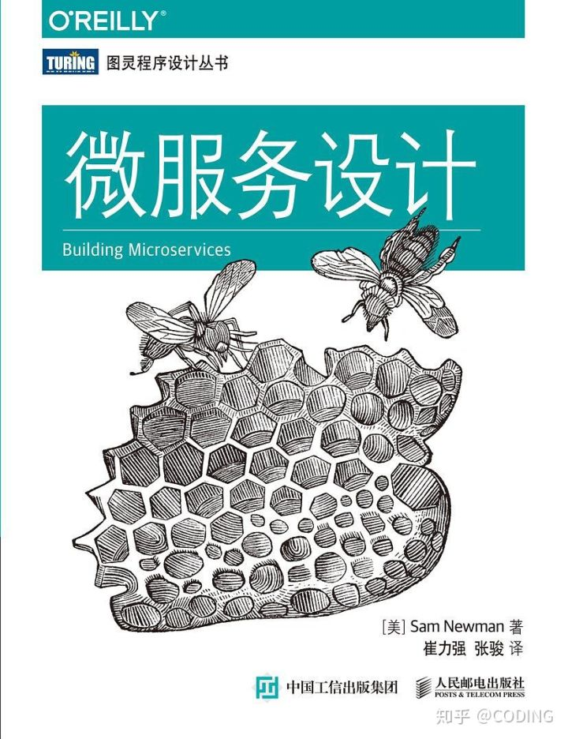

《微服务设计》是一本阅读体验很不错的书， 它写得深入浅出，易于理解。 其中一部分基础主题：如团队建设、版本控制、日志记录、监控等等，会让你从中找到一个非常好的微服务介绍。作者知识渊博，对微服务有相当丰富的经验，同时这本书对初学者也十分友好。

特别适合以下读者： 想要学习构建基于微服务架构的应用程序的朋友。

## **3、《基础设施即代码》**

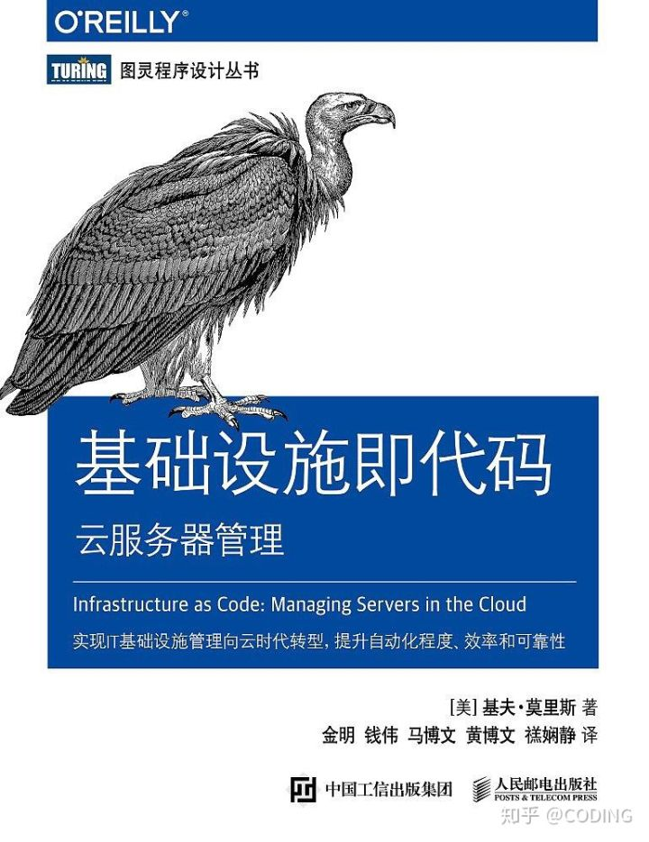

本书是关于云自动化、基础架构和 DevOps 行业最佳实践的综述。它写得很全面，与同类技术技术书籍对比，你在本书中能够欣赏到对于概念和方法的清晰解释和良好措辞。

特别适合以下读者： 如果你对 Netflix、Amazon 和 Etsy 等组织的成功经验感兴趣，并希望加强自己的管理技能。

## **4、《Effective DevOps（中文版）》**

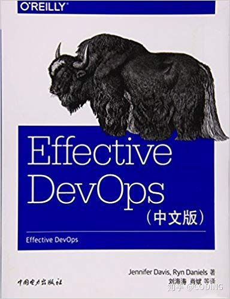

这本书不仅仅是一个技术指南，也是一个文化和管理指南。 DevOps 是关于团队协作和文化挑战的理念，本书更多地关注这些人性化方面。通过描述失败和成功案例，以极好的方式将 DevOps 的技术和文化连接起来。

这本书总结了 DevOps 是什么：“一个强调持续努力打破信息孤岛与监控关系，并修复组织团队内部误解的专业文化运动。”

特别适合以下读者： 如果你希望实现和维护团队的 DevOps 文化。

## **5、《SRE：Google 运维揭秘》**

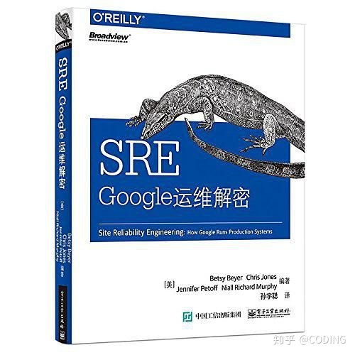

谷歌如何运行生产系统？本书通过良好的结构回答了这个问题。我喜欢这本书是因为读者不需要按照任何特定顺序阅读，每一章都是一个独立的主题。这本书是亚马逊最畅销的书之一，可能也是这份清单中最好的一本。

特别适合以下读者： 如果你想了解 SRE 日常工作的理论和实践（从构建到运维大型分布式系统）并探索 Google 管理方式如何用于培训、沟通和会议。

## **6、《微服务运维实战（第一卷）》**

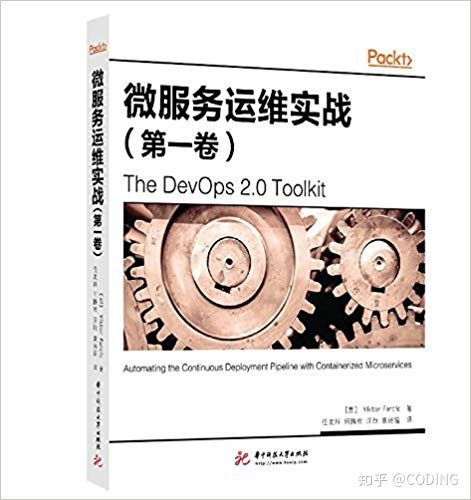

本书是构建完整稳定的 CI/CD 流水线并支持构建在微服务架构之上的现代分布式应用程序的过程。它是 DevOps 领域中非常有趣的一本，涵盖多种现代技术：Docker、Kubernetes、Ansible、Ubuntu、Docker Swarm 、Docker Compose、Consul、etcd、Registrator、confd 等等。

特别适合以下读者： 如果你想通过具体示例和演示用例来获取 DevOps 的技术基础知识。

## **7、《持续交付：发布可靠软件的系统方法》**


本书是快速发布软件，同时降低风险和提高质量的指南。它列举了发布和生产部署管理的最佳实践和快速简单的技术。它还包括许多其它实践，如生产监控跟踪、依赖关系管理以及虚拟化的有效使用。这本书将教会你持续交付的基础、创建高效部署流水线的技术以及有关交付生态系统的愿景。

特别适合以下读者： 如果你正在寻找分步指南以便更快地管理新软件版本，同时降低风险和提升价值。

## **8、《构建之法：现代软件工程》**


作者对软件工程的各个知识点和技能要求进行了系统性整理，形成这本教材。同时讲述了业界最新实践方法。这是一本全景式图书，同时也是一本实践式的书，涵盖了现代软件工程的全部，每个章节甚至每个段落拿出来，都可以在实践中作为指导。它会让你更了解这个行业，能让即将从业的人在对行业从陌生到熟悉的过程中，较少地感到惊讶和出乎意料。

特别适合以下读者： 软件相关行业的同学，对软件工程整体想要有一个总体了解。

