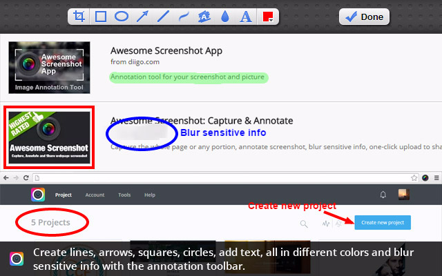
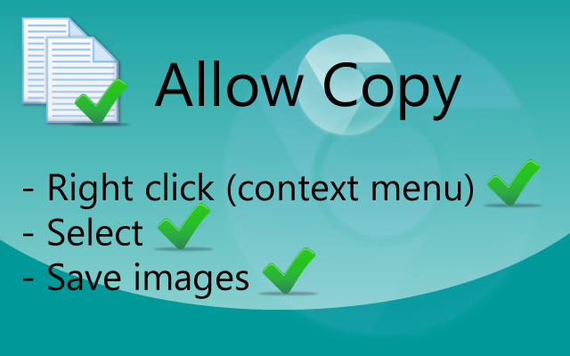
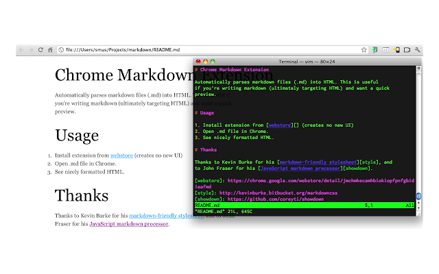
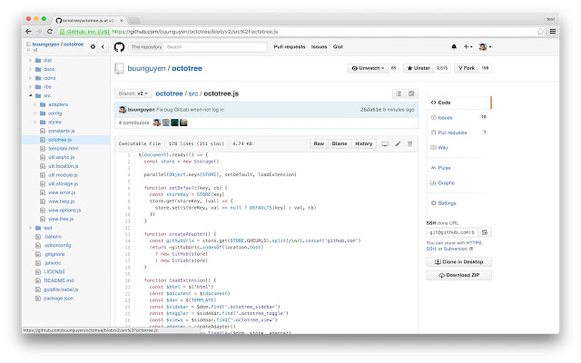
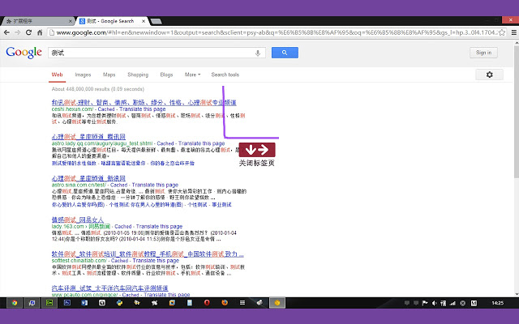

如果我说 Chrome 是世界上最好用的浏览器，估计也没什么人会反对，但是因为某些不可描述的原因导致很多功能没法正常使用，比如最具特性的扩展插件功能很多时候需要翻墙从应用商店下载，（其实也可以使用开发者模式从本地加载），今天推荐几个我最常用的插件。

0、Awesome Screenshot
最好用的网页截图工具，比微信、QQ的截图工具还好用，除了支持在网页上任意多种方式截图之外还可以对截取的图片进行涂鸦标记。

1、Allow Copy
有些很变态的网站把网页的复制功能禁用了，就为了让你注册登录之后才允许你复制里面的内容，还有些网站为了防止你转载他们文章不允许你复制，如果你一定要复制怎么办，装个 Allow Copy 插件任意拷贝。

2、Markdown Preview Plus
我写文档写博客采用 Markdown 语法在 Sublime 中写，然后通过Markdown Preview Plus 从浏览器中实时预览，这个插件的好处就是支持自动刷新，不仅可以指定css主题样式，还是导出html文件，支持数学公式。

3、JSON Editor
JSON Editor 是一个离线扩展插件，它的使用场景是假设你的手里有一段压缩的JSON数据，你需要对其进行格式化处理分析其中的每个字段那么它就适合你。此外它还提供了一个在线的服务， 网址是：http://www.jsoneditoronline.org/

4、 OneTab
Chrome的速度快，但缺点也很明显，耗内存电池Killer，打开的Tab页越多越耗内存，而OneTab的作用是最大限度的帮你节省内存空间，节省高达95％的内存，并减轻标签页混乱现象，当您打开的网页非常多的时候，单击OneTab图标，将所有标签页转换成一个列表。当您需要再次访问这些标签页时，可以单独或全部恢复它们。

5、Octotree
当我们在 GitHub 浏览别人的开源代码时，逐个目录文件点击进去查看代码显得很繁琐，要么就 clone下来导入IDE查看，而有了这个插件，你可以直接在 Chrome 侧边栏用目录导航的方式任意选择文件查看了。

6、crxMouse Chrome™ Gestures
如果说Vimum 是键盘的福音，那么 crxMouse Chrome™ Gestures 是鼠标党的最爱，可以用鼠标手势完成比如关闭标签页、新增标签页、打开主页、前进、后退、刷新等功能

