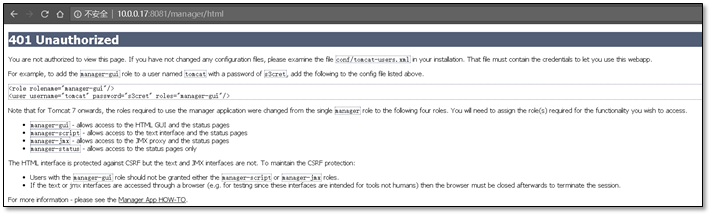
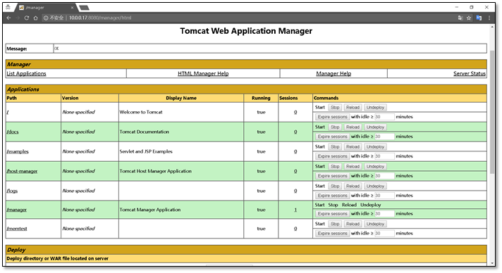
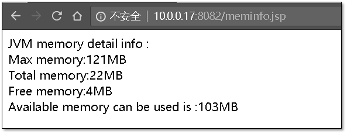
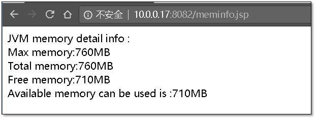

# Tomcat 部署实践及安全调优

## 一、Tomcat简介

Tomcat是Apache软件基金会（Apache Software Foundation）的Jakarta 项目中的一个核心项目，由Apache、Sun和其他一些公司及个人共同开发而成。

Tomcat服务器是一个免费的开放源代码的Web应用服务器，属于轻量级应用服务器，在中小型系统和并发访问用户不是很多的场合下被普遍使用，是开发和调试JSP程序的首选。

Tomcat和Nginx、Apache(httpd)、lighttpd等Web服务器一样，具有处理HTML页面的功能，另外它还是一个Servlet和JSP容器，独立的Servlet容器是Tomcat的默认模式。不过，Tomcat处理静态HTML的能力不如Nginx/Apache服务器。

目前Tomcat最新版本为9.0。Java容器还有resin、weblogic等。

Tomcat官网： [http://tomcat.apache.org](http://tomcat.apache.org/)

## 二、JDK  

JDK是 Java 语言的软件开发工具包，主要用于移动设备、嵌入式设备上的java应用程序。JDK是整个java开发的核心，它包含了JAVA的运行环境（JVM+Java系统类库）和JAVA工具。

JDK包含了一批用于Java开发的组件，其中包括：

```
javac：编译器，将后缀名为.java的源代码编译成后缀名为“.class”的字节码
java：运行工具，运行.class的字节码
jar：打包工具，将相关的类文件打包成一个文件
javadoc：文档生成器，从源码注释中提取文档，注释需匹配规范
jdb debugger：调试工具
jps：显示当前java程序运行的进程状态
javap：反编译程序
appletviewer：运行和调试applet程序的工具，不需要使用浏览器
javah：从Java类生成C头文件和C源文件。这些文件提供了连接胶合，使Java和C代码可进行交互。
javaws：运行JNLP程序
extcheck：一个检测jar包冲突的工具
apt：注释处理工具 
jhat：java堆分析工具
jstack：栈跟踪程序
jstat：JVM检测统计工具
jstatd：jstat守护进程
jinfo：获取正在运行或崩溃的java程序配置信息
jmap：获取java进程内存映射信息
idlj：IDL-to-Java编译器。将IDL语言转化为java文件 
policytool：一个GUI的策略文件创建和管理工具
jrunscript：命令行脚本运行
```

JDK中还包括完整的JRE（Java Runtime Environment），Java运行环境，也被称为 private runtime。包括了用于产品环境的各种库类，如基础类库rt.jar，以及给开发人员使用的补充库，如国际化与本地化的类库、IDL库等等。

JDK中还包括各种样例程序，用以展示Java API中的各部分。

JDK下载面页：

<http://www.oracle.com/technetwork/java/javase/downloads/index.html>

## 三、安装 Tomcat & JDK

安装时候选择tomcat软件版本要与程序开发使用的版本一致。jdk版本要进行与tomcat保持一致。

### 1、系统环境说明

```
[root@web03 ~]# cat /etc/redhat-release 
CentOS Linux release 7.4.1708 (Core) 
[root@web03 ~]# uname -a 
Linux web03 3.10.0-693.el7.x86_64 #1 SMP Tue Aug 22 21:09:27 UTC 2017 x86_64 x86_64 x86_64 GNU/Linux
[root@web03 ~]# getenforce 
Disabled
[root@web03 ~]# systemctl status firewalld.service
● firewalld.service - firewalld - dynamic firewall daemon
   Loaded: loaded (/usr/lib/systemd/system/firewalld.service; disabled; vendor preset: enabled)
   Active: inactive (dead)
     Docs: man:firewalld(1)
```

### 2 、安装JDK

#### 1、安装命令集

```
tar xf jdk-8u60-linux-x64.tar.gz -C /application/
ln -s /application/jdk1.8.0_60 /application/jdk
# 设置环境变量
sed -i.ori '$a export JAVA_HOME=/application/jdk\nexport PATH=$JAVA_HOME/bin:$JAVA_HOME/jre/bin:$PATH\nexport CLASSPATH=.:$JAVA_HOME/lib:$JAVA_HOME/jre/lib:$JAVA_HOME/lib/tools.jar' /etc/profile
source /etc/profile
```

#### 2、测试jdk是否安装成功

```
[root@web03 ~]# java -version
java version "1.8.0_60"
Java(TM) SE Runtime Environment (build 1.8.0_60-b27)
Java HotSpot(TM) 64-Bit Server VM (build 25.60-b23, mixed mode)
```

### 3、安装Tomcat

#### 1、安装命令集

```
tar xf apache-tomcat-8.0.27.tar.gz -C /application/
ln -s /application/apache-tomcat-8.0.27 /application/tomcat
# 设置环境变量
echo 'export TOMCAT_HOME=/application/tomcat'>>/etc/profile
source /etc/profile
# 注意授权，统一权限
chown -R root.root /application/jdk/ /application/tomcat/
```

#### 2、检查tomcat是否安装成功

```
[root@web03 ~]# /application/tomcat/bin/version.sh
Using CATALINA_BASE:   /application/tomcat
Using CATALINA_HOME:   /application/tomcat
Using CATALINA_TMPDIR: /application/tomcat/temp
Using JRE_HOME:        /application/jdk
Using CLASSPATH:       /application/tomcat/bin/bootstrap.jar:/application/tomcat/bin/tomcat-juli.jar
Server version: Apache Tomcat/8.0.27
Server built:   Sep 28 2015 08:17:25 UTC
Server number:  8.0.27.0
OS Name:        Linux
OS Version:     3.10.0-693.el7.x86_64
Architecture:   amd64
JVM Version:    1.8.0_60-b27
JVM Vendor:     Oracle Corporation
```

## 四、Tomcat 目录介绍

### 1、tomcat 主目录介绍

```
[root@web03 ~]# cd /application/tomcat/
[root@web03 tomcat]# tree -L 1
.
├── bin              #存放tomcat管理脚本
├── conf             # tomcat 配置文件存放目录
├── lib              # web应用调用的jar包存放路径
├── LICENSE
├── logs             # tomcat 日志存放目录，catalina.out 为主要输出日志
├── NOTICE
├── RELEASE-NOTES
├── RUNNING.txt
├── temp             # 存放临时文件
├── webapps          # web程序存放目录
└── work             # 存放编译产生的.java 与 .class文件

7 directories, 4 files
```

### 2、webapps目录介绍

```
[root@web03 tomcat]# cd webapps/
[root@web03 webapps]# tree -L 1
.
├── docs            # tomcat 帮助文档
├── examples        # web应用实例
├── host-manager    # 主机管理
├── manager         # 管理
└── ROOT            # 默认站点根目录

5 directories, 0 files
```

### 3、Tomcat配置文件目录介绍（conf）

```
[root@web03 conf]# tree -L 1
.
├── Catalina
├── catalina.policy
├── catalina.properties
├── context.xml
├── logging.properties
├── logs
├── server.xml           # tomcat 主配置文件
├── server.xml.bak
├── server.xml.bak2
├── tomcat-users.xml     # tomcat 管理用户配置文件
├── tomcat-users.xsd
└── web.xml

2 directories, 10 files
```

## 五、Tomcat 的管理

```
#  启动程序/application/tomcat/bin/startup.sh
#  关闭程序/application/tomcat/bin/shutdown.sh
```

### 1、启动停止

```
[root@web03 ~]# /application/tomcat/bin/shutdown.sh 
Using CATALINA_BASE:   /application/tomcat
Using CATALINA_HOME:   /application/tomcat
Using CATALINA_TMPDIR: /application/tomcat/temp
Using JRE_HOME:        /application/jdk
Using CLASSPATH:       /application/tomcat/bin/bootstrap.jar:/application/tomcat/bin/tomcat-juli.jar
[root@web03 ~]# /application/tomcat/bin/startup.sh 
Using CATALINA_BASE:   /application/tomcat
Using CATALINA_HOME:   /application/tomcat
Using CATALINA_TMPDIR: /application/tomcat/temp
Using JRE_HOME:        /application/jdk
Using CLASSPATH:       /application/tomcat/bin/bootstrap.jar:/application/tomcat/bin/tomcat-juli.jar
Tomcat started.
```

  注意：tomcat未启动的情况下使用shutdown脚本，会有大量的输出信息。

### 2、检查tomcat是否启动正常

```
[root@web03 ~]# netstat -lntup  |grep java
tcp6       0      0 :::8080         :::*                   LISTEN      30560/java          
tcp6       0      0 127.0.0.1:8005          :::*          LISTEN      30560/java          
tcp6       0      0 :::8009                 :::*           LISTEN      30560/java      
```

**说明：**所有与java相关的，服务启动都是java命名的进程

### 3、启动完成浏览器进行访问

http://10.0.0.17:8080/


## 六、Tomcat 日志说明

### 1、查看日志

```
[root@web03 ~]# tailf /application/tomcat/logs/catalina.out
24-Nov-2017 15:09:51.654 INFO [main] org.apache.coyote.AbstractProtocol.start Starting ProtocolHandler ["http-nio-8080"]
24-Nov-2017 15:09:51.665 INFO [main] org.apache.coyote.AbstractProtocol.start Starting ProtocolHandler ["ajp-nio-8009"]
24-Nov-2017 15:09:51.670 INFO [main] org.apache.catalina.startup.Catalina.start Server startup in 60037 ms
```

​         发现启动时间较长，其中有一项的启动时间占据了绝大多数

```
24-Nov-2017 15:09:50.629 INFO [localhost-startStop-1] org.apache.catalina.startup.HostConfig.deployWAR Deployment of web application archive /application/apache-tomcat-8.0.27/webapps/memtest.war has finished in 58,892 ms
```

​         发现耗时在这里：是session引起的随机数问题导致的。Tocmat的Session ID是通过SHA1算法计算得到的，计算Session ID的时候必须有一个密钥。为了提高安全性Tomcat在启动的时候会通过随机生成一个密钥。

### 2、解决 Tomcat 启动慢的方法

Tomcat启动慢主要原因是生成随机数的时候卡住了,导致tomcat启动不了。

是否有足够的熵来用于产生随机数，可以通过如下命令来查看

```
[root@web03 ~]# cat /proc/sys/kernel/random/entropy_avail
```

为了加速/dev/random提供随机数的速度，你可以通过操作设备的外设，让其产生大量的中断，网络传输数据，按键，移动鼠标，在命令行敲几个不同的命令，俗称聚气。

cat /dev/random 会消耗能量

**方法1**：

```
vim $JAVA_HOME/jre/lib/security/java.security
securerandom.source=file:/dev/random
```

改为

```
securerandom.source=file:/dev/urandom
```

**方法2：**

```
vim $TOMCAT_HOME/bin/catalina.sh
if [[ "$JAVA_OPTS" != *-Djava.security.egd=* ]]; then
    JAVA_OPTS="$JAVA_OPTS -Djava.security.egd=file:/dev/urandom"
fi
```

这个系统属性egd表示熵收集守护进程(entropy gathering daemon)

**方法3：（推荐）**

```
yum install rng-tools # 安装rngd服务（熵服务，增大熵池）
systemctl start rngd  # 启动服务
```

## 七、Tomcat管理功能使用

**注意：测试功能，生产环境不要用**

Tomcat管理功能用于对Tomcat自身以及部署在Tomcat上的应用进行管理的web应用。在默认情况下是处于禁用状态的。如果需要开启这个功能，就需要配置管理用户，即配置tomcat-users.xml 文件。

```
[root@web03 ~]# vim /application/tomcat/conf/tomcat-users.xml
……
39 <role rolename="manager-gui"/>
 40 <role rolename="admin-gui"/>
 41 <user username="tomcat" password="tomcat" roles="manager-gui,admin-gui"/>
 42 </tomcat-users>   # 在此行前加入上面三行
```

**未修改文件前进行访问**



```
<role rolename="manager-gui"/>
<user username="tomcat" password="s3cret" roles="manager-gui"/>
```


```
<role rolename="admin-gui"/>
<user username="tomcat" password="s3cret" roles="admin-gui"/>
```

​         从而得出上面的配置文件信息。

### 1、在web界面访问管理界面


​         输入之前配置的账户与密码即可




## 八、Tomcat主配置文件详解

### 1、server.xml 组件类别

顶级组件：位于整个配置的顶层，如server。

容器类组件：可以包含其它组件的组件，如service、engine、host、context。

连接器组件：连接用户请求至tomcat，如connector。

被嵌套类组件：位于一个容器当中，不能包含其他组件，如Valve、logger。

```
<server>
     <service>
     <connector />
     <engine>
     <host>
     <context></context>
     </host>
     <host>
     <context></context>
     </host>
     </engine>
     </service>
</server>
```

### 2、组件介绍

| **组件名称**            | **功能介绍**                                                 |
| ----------------------- | ------------------------------------------------------------ |
| **engine**              | 核心容器组件，catalina引擎，负责通过connector接收用户请求，并处理请求，将请求转至对应的虚拟主机host。 |
| **host**                | 类似于httpd中的虚拟主机，一般而言支持基于FQDN的虚拟主机。    |
| **context**             | 定义一个应用程序，是一个最内层的容器类组件（不能再嵌套）。配置context的主要目的指定对应对的webapp的根目录，类似于httpd的alias，其还能为webapp指定额外的属性，如部署方式等。 |
| **connector**           | 接收用户请求，类似于httpd的listen配置监听端口的。            |
| **service****（服务）** | 将connector关联至engine，因此一个service内部可以有多个connector，但只能有一个引擎engine。service内部有两个connector，一个engine。因此，一般情况下一个server内部只有一个service，一个service内部只有一个engine，但一个service内部可以有多个connector。 |
| **server**              | 表示一个运行于JVM中的tomcat实例。                            |
| **Valve**               | 阀门，拦截请求并在将其转至对应的webapp前进行某种处理操作，可以用于任何容器中，比如记录日志(access log valve)、基于IP做访问控制(remote address filter valve)。 |
| **logger**              | 日志记录器，用于记录组件内部的状态信息，可以用于除context外的任何容器中。 |
| **realm**               | 可以用于任意容器类的组件中，关联一个用户认证库，实现认证和授权。可以关联的认证库有两种：UserDatabaseRealm、MemoryRealm和JDBCRealm。 |
| **UserDatabaseRealm**   | 使用JNDI自定义的用户认证库。                                 |
| **MemoryRealm**         | 认证信息定义在tomcat-users.xml中。                           |
| **JDBCRealm**           | 认证信息定义在数据库中，并通过JDBC连接至数据库中查找认证用户。 |

### 3、server.xml 配置文件注释

```
<?xml version='1.0' encoding='utf-8'?>
<!--
<Server>元素代表整个容器,是Tomcat实例的顶层元素.由org.apache.catalina.Server接口来定义.它包含一个<Service>元素.并且它不能做为任何元素的子元素.
    port指定Tomcat监听shutdown命令端口.终止服务器运行时,必须在Tomcat服务器所在的机器上发出shutdown命令.该属性是必须的.
    shutdown指定终止Tomcat服务器运行时,发给Tomcat服务器的shutdown监听端口的字符串.该属性必须设置
-->
<Server port="8005" shutdown="SHUTDOWN">
  <Listener className="org.apache.catalina.startup.VersionLoggerListener" />
  <Listener className="org.apache.catalina.core.AprLifecycleListener" SSLEngine="on" />
  <Listener className="org.apache.catalina.core.JreMemoryLeakPreventionListener" />
  <Listener className="org.apache.catalina.mbeans.GlobalResourcesLifecycleListener" />
  <Listener className="org.apache.catalina.core.ThreadLocalLeakPreventionListener" />
  <GlobalNamingResources>
    <Resource name="UserDatabase" auth="Container"
              type="org.apache.catalina.UserDatabase"
              description="User database that can be updated and saved"
              factory="org.apache.catalina.users.MemoryUserDatabaseFactory"
              pathname="conf/tomcat-users.xml" />
  </GlobalNamingResources>
  <!--service服务组件-->
  <Service name="Catalina">
    <!-- Connector主要参数说明（见下表） -->
    <Connector port="8080" protocol="HTTP/1.1"
               connectionTimeout="20000"
               redirectPort="8443" />
    <Connector port="8009" protocol="AJP/1.3" redirectPort="8443" />
    <!--engine,核心容器组件,catalina引擎,负责通过connector接收用户请求,并处理请求,将请求转至对应的虚拟主机host
        defaultHost指定缺省的处理请求的主机名，它至少与其中的一个host元素的name属性值是一样的
    -->
    <Engine name="Catalina" defaultHost="localhost">
      <!--Realm表示存放用户名，密码及role的数据库-->
      <Realm className="org.apache.catalina.realm.LockOutRealm">
        <Realm className="org.apache.catalina.realm.UserDatabaseRealm"
               resourceName="UserDatabase"/>
      </Realm>
      <!-- 详情常见下表（host参数详解）-->
      <Host name="localhost"  appBase="webapps"
            unpackWARs="true" autoDeploy="true">
        <!-- 详情常见下表（Context参数说明 ）-->
        <Context path="" docBase="" debug=""/>
        <Valve className="org.apache.catalina.valves.AccessLogValve" directory="logs"
               prefix="localhost_access_log" suffix=".txt"
               pattern="%h %l %u %t &quot;%r&quot; %s %b" />
      </Host>
    </Engine>
  </Service>
</Server>
```

### 4、Connector 主要参数说明

| **参数**              | **参数说明**                                                 |
| --------------------- | ------------------------------------------------------------ |
| **connector**         | 接收用户请求，类似于httpd的listen配置监听端口.               |
| **port**              | 指定服务器端要创建的端口号，并在这个端口监听来自客户端的请求。 |
| **address**           | 指定连接器监听的地址，默认为所有地址（即0.0.0.0）            |
| **protocol**          | 连接器使用的协议，支持HTTP和AJP。AJP（Apache Jserv Protocol）专用于tomcat与apache建立通信的， 在httpd反向代理用户请求至tomcat时使用（可见Nginx反向代理时不可用AJP协议）。 |
| **minProcessors**     | 服务器启动时创建的处理请求的线程数                           |
| **maxProcessors**     | 最大可以创建的处理请求的线程数                               |
| **enableLookups**     | 如果为true，则可以通过调用request.getRemoteHost()进行DNS查询来得到远程客户端的实际主机名，若为false则不进行DNS查询，而是返回其ip地址 |
| **redirectPort**      | 指定服务器正在处理http请求时收到了一个SSL传输请求后重定向的端口号 |
| **acceptCount**       | 指定当所有可以使用的处理请求的线程数都被使用时，可以放到处理队列中的请求数，超过这个数的请求将不予处理 |
| **connectionTimeout** | 指定超时的时间数(以毫秒为单位)                               |

### 5、host 参数详解

| **参数**              | **参数说明**                                                 |
| --------------------- | ------------------------------------------------------------ |
| **host**              | 表示一个虚拟主机                                             |
| **name**              | 指定主机名                                                   |
| **appBase**           | 应用程序基本目录，即存放应用程序的目录.一般为appBase="webapps"，相对于CATALINA_HOME而言的，也可以写绝对路径。 |
| **unpackWARs**        | 如果为true，则tomcat会自动将WAR文件解压，否则不解压，直接从WAR文件中运行应用程序 |
| **autoDeploy**        | 在tomcat启动时，是否自动部署。                               |
| **xmlValidation**     | 是否启动xml的校验功能，一般xmlValidation="false"。           |
| **xmlNamespaceAware** | 检测名称空间，一般xmlNamespaceAware="false"。                |

### 6、Context 参数说明

| **参数**       | **参数说明**                                                 |
| -------------- | ------------------------------------------------------------ |
| **Context**    | 表示一个web应用程序，通常为WAR文件                           |
| **docBase**    | 应用程序的路径或者是WAR文件存放的路径,也可以使用相对路径，起始路径为此Context所属Host中appBase定义的路径。 |
| **path**       | 表示此web应用程序的url的前缀，这样请求的url为http://localhost:8080/path/**** |
| **reloadable** | 这个属性非常重要，如果为true，则tomcat会自动检测应用程序的/WEB-INF/lib和/WEB-INF/classes目录的变化，自动装载新的应用程序，可以在不重启tomcat的情况下改变应用程序 |

## 九、WEB站点部署

上线的代码有两种方式：

第一种方式是直接将程序目录放在webapps目录下面，这种方式大家已经明白了，就不多说了。

第二种方式是使用开发工具将程序打包成war包，然后上传到webapps目录下面。

### 1、使用 war 包部署 web 站点

```
[root@web03 webapps]# pwd
/application/tomcat/webapps
[root@web03 webapps]# wget http://10.0.0.1/apache/tomcat/memtest.war
```

站点主动解压部署

```
[root@web03 webapps]# ls
docs  examples  host-manager  logs  manager  memtest  memtest.war  ROOT
```

浏览器访问：

*http://10.0.0.17:8080//memtest/meminfo.jsp*


### 2、自定义默认网站目录

上面访问的网址为 *http://10.0.0.3:8080/memtest/meminfo.jsp*

现在想访问格式为*http://10.0.0.3:8080/meminfo.jsp*

**方法一**

将meminfo.jsp或其他程序放在tomcat/webapps/ROOT目录下即可。因为默认网站根目录为tomcat/webapps/ROOT

**方法二**

```
[root@web03 ~]# vim /application/tomcat/conf/server.xml +125
…… #添加上这两行
        <Context path="" docBase="/application/tomcat/webapps/memtest" debug="0" reloadable="false" crossContext="true"/>
        <Context path="/40team" docBase="/application/tomcat/webapps/memtest" debug="0" reloadable="false" crossContext="true"/>
……
```

修改配置文件后，要重启服务

```
[root@web03 ~]# /application/tomcat/bin/shutdown.sh 
[root@web03 ~]# /application/tomcat/bin/startup.sh  
```

### 3、部署开源站点（jpress）

jpress官网：*http://jpress.io*

下载地址：*https://github.com/JpressProjects/jpress*

​         第一个里程碑：安装配置数据库

```
yum -y install mariadb-server
systemctl start mariadb.service
```

​         \#配置数据库

```
mysql
create database jpress DEFAULT CHARACTER SET utf8;
grant all on jpress.* to jpress@'localhost' identified by '123456';
exit
```

​         第二个里程碑：jpress站点上线

```
[root@web03 webapps]# pwd
/application/tomcat/webapps
[root@web03 webapps]# wget http://10.0.0.1/apache/tomcat/jpress-web-newest.war
```

​         第三个里程碑：浏览器访问

浏览器访问： *http://10.0.0.17:8080/jpress-web-newest/install*


填写数据库信息


设置站点名称等


安装完成


重启tomcat服务

```
[root@web03 ~]# /application/tomcat/bin/shutdown.sh 
[root@web03 ~]# /application/tomcat/bin/startup.sh  
```

## 十、Tomcat 多实例配置

**多虚拟主机**：nginx 多个Server标签（域名，ip，端口） 进程数量固定 master+worker

**多实例（多进程）**：同一个程序启动多次，分为两种情况:

第一种：一台机器跑多个站点； 

第二种：一个机器跑一个站点多个实例，配合负载均衡

### 1、复制程序文件

```
    cd /application/tools/
    tar xf apache-tomcat-8.0.27.tar.gz
    cp -a apache-tomcat-8.0.27 tomcat8_1
    cp -a apache-tomcat-8.0.27 tomcat8_2
```

修改端口，以启动多实例。多实例之间端口不能一致

```
sed -i 's#8005#8011#;s#8080#8081#' tomcat8_1/conf/server.xml
sed -i 's#8005#8012#;s#8080#8082#' tomcat8_2/conf/server.xml
[root@web03 application]# diff tomcat8_1/conf/server.xml tomcat8_2/conf/server.xml
22c22
< <Server port="8011" shutdown="SHUTDOWN">
---
> <Server port="8012" shutdown="SHUTDOWN">
67c67
<          Define a non-SSL/TLS HTTP/1.1 Connector on port 8081
---
>          Define a non-SSL/TLS HTTP/1.1 Connector on port 8082
69c69
<     <Connector port="8081" protocol="HTTP/1.1"
---
>     <Connector port="8082" protocol="HTTP/1.1"
75c75
<                port="8081" protocol="HTTP/1.1"
---
>                port="8082" protocol="HTTP/1.1"
```

　　 将配置好的tomcat程序打包，以备之后使用

```
tar zcf muti_tomcat8.tar.gz ./tomcat8_1 ./tomcat8_2
```

启动tomcat多实例

```
 /application/tomcat8_1/bin/startup.sh 
 /application/tomcat8_2/bin/startup.sh
```

检查端口是否启动

```
[root@web03 tomcat8_1]# netstat -lntup |grep java
tcp6   0   0 127.0.0.1:8011    :::*    LISTEN   31906/java
tcp6   0   0 127.0.0.1:8012    :::*    LISTEN   31932/java
tcp6   0   0 :::8080           :::*    LISTEN   31812/java
tcp6   0   0 :::8081           :::*    LISTEN   31906/java
tcp6   0   0 :::8082           :::*    LISTEN   31932/java
tcp6   0   0 127.0.0.1:8005    :::*    LISTEN   31812/java
tcp6   0   0 :::8009           :::*    LISTEN   31812/java
```

将每个实例的网页进行区分

```
echo 8081 >>/application/tomcat8_1/webapps/ROOT/index.jsp 
echo 8082 >>/application/tomcat8_2/webapps/ROOT/index.jsp
```

### 2、在浏览器访问，进行测试

检查多实例的启动

http://10.0.0.17:8082


http://10.0.0.17:8081


## 十一、tomcat 反向代理集群

### 1、负载均衡器说明

```
[root@lb01 ~]# cat /etc/redhat-release 
CentOS release 6.9 (Final)
[root@lb01 ~]# uname -a
Linux lb01 2.6.32-696.el6.x86_64 #1 SMP Tue Mar 21 19:29:05 UTC 2017 x86_64 x86_64 x86_64 GNU/Linux
[root@lb01 ~]# getenforce 
Disabled
[root@lb01 ~]# /etc/init.d/iptables status
iptables: Firewall is not running.
```

负载均衡软件使用nginx，详情参照

http://www.cnblogs.com/clsn/p/7750615.html

### 2、配置负载均衡器

备份原配置文件

```
mv  /application/nginx/conf/nginx.conf{,.20171127}
    egrep -v '#|^$' /application/nginx/conf/nginx.conf.default  > /application/nginx/conf/nginx.conf
```

​         配置文件内容

```
[root@lb01 ~]# cat /application/nginx/conf/nginx.conf
worker_processes  1;
events {
    worker_connections  1024;
}
http {
    include       mime.types;
    default_type  application/octet-stream;
    sendfile        on;
    keepalive_timeout  65;
    upstream web_pools {
        server 10.0.0.17:8081;
        server 10.0.0.17:8082;
    }

    server {
        listen       80;
        server_name  localhost;
        location / {
            root   html;
            index  index.jsp index.htm;
        proxy_pass http://web_pools;
        }
        error_page   500 502 503 504  /50x.html;
        location = /50x.html {
            root   html;
        }
    }
}
```

​         配置完成后重启nginx服务

```
/application/nginx/sbin/nginx  -s stop 
/application/nginx/sbin/nginx
```

### 3、使用命令进行访问测试

使用curl 命令进行测试，tail进行关键字提取

```
[root@lb01 ~]# curl -s 10.0.0.5|tail -1
8081
[root@lb01 ~]# curl -s 10.0.0.5|tail -1
8082
```

使用curl 命令进行测试，awk进行关键字提取

```
[root@lb01 ~]# curl -s 10.0.0.5|awk 'END{print}'
8082
[root@lb01 ~]# curl -s 10.0.0.5|awk 'END{print}'
8081
```

 

 使用curl 命令进行测试，sed进行关键字提取

```
[root@lb01 ~]# curl -s 10.0.0.5|sed -n '$p'
8082
[root@lb01 ~]# curl -s 10.0.0.5|sed -n '$p'
8081
```

### 4、在浏览器上进行访问测试


​         建议使用google浏览器chrome 的隐身模式进行访问，使用ctrl+f5 进行强制刷新

## 十二、监控tomcat集群状态

### 1、方法一：开发java监控页面

```
[root@web03 tomcat8_1]# cat /application/tomcat/webapps/memtest/meminfo.jsp 
<%
Runtime rtm = Runtime.getRuntime();
long mm = rtm.maxMemory()/1024/1024;
long tm = rtm.totalMemory()/1024/1024;
long fm = rtm.freeMemory()/1024/1024;

out.println("JVM memory detail info :<br>");
out.println("Max memory:"+mm+"MB"+"<br>");
out.println("Total memory:"+tm+"MB"+"<br>");
out.println("Free memory:"+fm+"MB"+"<br>");
out.println("Available memory can be used is :"+(mm+fm-tm)+"MB"+"<br>");
%>
```

### 2、方法二：使用jps命令进行监控

```
[root@web03 ~]# jps -lvm

31906 org.apache.catalina.startup.Bootstrap start -Djava.util.logging.config.file=/application/tomcat8_1/conf/logging.properties -Djava.util.logging.manager=org.apache.juli.ClassLoaderLogManager -Djava.endorsed.dirs=/application/tomcat8_1/endorsed -Dcatalina.base=/application/tomcat8_1 -Dcatalina.home=/application/tomcat8_1 -Djava.io.tmpdir=/application/tomcat8_1/temp

31812 org.apache.catalina.startup.Bootstrap start -Djava.util.logging.config.file=/application/tomcat/conf/logging.properties -Djava.util.logging.manager=org.apache.juli.ClassLoaderLogManager -Djava.endorsed.dirs=/application/tomcat/endorsed -Dcatalina.base=/application/tomcat -Dcatalina.home=/application/tomcat -Djava.io.tmpdir=/application/tomcat/temp

31932 org.apache.catalina.startup.Bootstrap start -Djava.util.logging.config.file=/application/tomcat8_2/conf/logging.properties -Djava.util.logging.manager=org.apache.juli.ClassLoaderLogManager -Djava.endorsed.dirs=/application/tomcat8_2/endorsed -Dcatalina.base=/application/tomcat8_2 -Dcatalina.home=/application/tomcat8_2 -Djava.io.tmpdir=/application/tomcat8_2/temp

32079 sun.tools.jps.Jps -lvm -Denv.class.path=.:/application/jdk/lib:/application/jdk/jre/lib:/application/jdk/lib/tools.jar -Dapplication.home=/application/jdk1.8.0_60 -Xms8m
```

### 3、Tomcat远程监控功能

修改配置文件，开启远程监控

```
vim /application/tomcat8_1/bin/catalina.sh +97

CATALINA_OPTS="$CATALINA_OPTS
-Dcom.sun.management.jmxremote 
-Dcom.sun.management.jmxremote.port=12345  
-Dcom.sun.management.jmxremote.authenticate=false 
-Dcom.sun.management.jmxremote.ssl=false 
-Djava.rmi.server.hostname=10.0.0.17"
```

​         重启服务，检查12345端口是否开启

```
/application/tomcat8_1/bin/shutdown.sh 
/application/tomcat8_1/bin/startup.sh 
netstat -tunlp|grep 12345
```

​         检查端口

```
[root@web03 ~]# netstat -tunlp|grep 12345
tcp6       0      0 :::12345           :::*          LISTEN      33158/java  
```

**在windows上监控tomcat**

**注意：windwos需要安装jdk环境！**

查考：http://www.oracle.com/technetwork/java/javase/downloads/index.html

​         软件路径

```
C:\Program Files\Java\jdk1.8.0_31\bin
jconsole.exe   jvisualvm.exe
```

**jconsole.exe** **使用说明**


​         连接成功即可进行监控，连接的时候注意端口信息。


**jvisualvm.exe****使用说明**


​         输入ip地址


​         主机添加完成，添加JMX监控


​                  注意添加的时候输入端口信息。


​         添加完成后就能够多tomcat程序进行监控。

### 4、zabbix 监控 tomcat 程序

zabbix搭建详情参考：http://www.cnblogs.com/clsn/p/7885990.html

**服务端安装配置java监控服务**

```
[root@m01 ~]# yum install zabbix-java-gateway -y
```

**查看配置文件**

```
配置文件路径：/etc/zabbix/zabbix_java_gateway.conf
sed -i -e '220a JavaGateway=127.0.0.1' -e '236a StartJavaPollers=5'  /etc/zabbix/zabbix_server.conf
```

启动zabbix-java-gateway服务，与zabbix服务

```
systemctl start zabbix-java-gateway.service
systemctl restart zabbix-server.service
```

检查java端口是否开启

```
[root@m01 ~]# netstat -lntup |grep java
tcp6       0      0 :::10052   :::*    LISTEN      72971/java  
```

​         检查java进程是否存在

```
[root@m01 ~]# ps -ef |grep [j]ava
zabbix    72971      1  0 11:29 ?        00:00:00 java -server -Dlogback.configurationFile=/etc/zabbix/zabbix_java_gateway_logback.xml -classpath lib:lib/android-json-4.3_r3.1.jar:lib/logback-classic-0.9.27.jar:lib/logback-core-0.9.27.jar:lib/slf4j-api-1.6.1.jar:bin/zabbix-java-gateway-3.0.13.jar -Dzabbix.pidFile=/var/run/zabbix/zabbix_java.pid -Dzabbix.timeout=3 -Dsun.rmi.transport.tcp.responseTimeout=3000 com.zabbix.gateway.JavaGateway
zabbix    73255  73226  0 11:35 ?        00:00:00 /usr/sbin/zabbix_server: java poller #1 [got 0 values in 0.000002 sec, idle 5 sec]
zabbix    73256  73226  0 11:35 ?        00:00:00 /usr/sbin/zabbix_server: java poller #2 [got 0 values in 0.000002 sec, idle 5 sec]
zabbix    73257  73226  0 11:35 ?        00:00:00 /usr/sbin/zabbix_server: java poller #3 [got 0 values in 0.000002 sec, idle 5 sec]
zabbix    73258  73226  0 11:35 ?        00:00:00 /usr/sbin/zabbix_server: java poller #4 [got 0 values in 0.000002 sec, idle 5 sec]
zabbix    73259  73226  0 11:35 ?        00:00:00 /usr/sbin/zabbix_server: java poller #5 [got 0 values in 0.000004 sec, idle 5 sec]
```

**web界面添加**

​         添加主机

 

​         主机管理模板，注意是JMX模板

 

​         监控完成

 

### 5、排除 tomcat 故障步骤

a. 查看catalina.out

b. 使用sh show-busy-java-threads.sh脚本进行检测

```shell
#!/bin/bash
# @Function
# Find out the highest cpu consumed threads of java, and print the stack of these threads.
#
# @Usage
#   $ ./show-busy-java-threads.sh
#
# @author Jerry Lee

readonly PROG=`basename $0`
readonly -a COMMAND_LINE=("$0" "$@")

usage() {
    cat <<EOF
Usage: ${PROG} [OPTION]...
Find out the highest cpu consumed threads of java, and print the stack of these threads.
Example: ${PROG} -c 10

Options:
    -p, --pid       find out the highest cpu consumed threads from the specifed java process,
                    default from all java process.
    -c, --count     set the thread count to show, default is 5
    -h, --help      display this help and exit
EOF
    exit $1
}

readonly ARGS=`getopt -n "$PROG" -a -o c:p:h -l count:,pid:,help -- "$@"`
[ $? -ne 0 ] && usage 1
eval set -- "${ARGS}"

while true; do
    case "$1" in
    -c|--count)
        count="$2"
        shift 2
        ;;
    -p|--pid)
        pid="$2"
        shift 2
        ;;
    -h|--help)
        usage
        ;;
    --)
        shift
        break
        ;;
    esac
done
count=${count:-5}

redEcho() {
    [ -c /dev/stdout ] && {
        # if stdout is console, turn on color output.
        echo -ne "\033[1;31m"
        echo -n "$@"
        echo -e "\033[0m"
    } || echo "$@"
}

yellowEcho() {
    [ -c /dev/stdout ] && {
        # if stdout is console, turn on color output.
        echo -ne "\033[1;33m"
        echo -n "$@"
        echo -e "\033[0m"
    } || echo "$@"
}

blueEcho() {
    [ -c /dev/stdout ] && {
        # if stdout is console, turn on color output.
        echo -ne "\033[1;36m"
        echo -n "$@"
        echo -e "\033[0m"
    } || echo "$@"
}

# Check the existence of jstack command!
if ! which jstack &> /dev/null; then
    [ -z "$JAVA_HOME" ] && {
        redEcho "Error: jstack not found on PATH!"
        exit 1
    }
    ! [ -f "$JAVA_HOME/bin/jstack" ] && {
        redEcho "Error: jstack not found on PATH and $JAVA_HOME/bin/jstack file does NOT exists!"
        exit 1
    }
    ! [ -x "$JAVA_HOME/bin/jstack" ] && {
        redEcho "Error: jstack not found on PATH and $JAVA_HOME/bin/jstack is NOT executalbe!"
        exit 1
    }
    export PATH="$JAVA_HOME/bin:$PATH"
fi

readonly uuid=`date +%s`_${RANDOM}_$$

cleanupWhenExit() {
    rm /tmp/${uuid}_* &> /dev/null
}
trap "cleanupWhenExit" EXIT

printStackOfThread() {
    local line
    local count=1
    while IFS=" " read -a line ; do
        local pid=${line[0]}
        local threadId=${line[1]}
        local threadId0x=`printf %x ${threadId}`
        local user=${line[2]}
        local pcpu=${line[4]}

        local jstackFile=/tmp/${uuid}_${pid}

        [ ! -f "${jstackFile}" ] && {
            {
                if [ "${user}" == "${USER}" ]; then
                    jstack ${pid} > ${jstackFile}
                else
                    if [ $UID == 0 ]; then
                        sudo -u ${user} jstack ${pid} > ${jstackFile}
                    else
                        redEcho "[$((count++))] Fail to jstack Busy(${pcpu}%) thread(${threadId}/0x${threadId0x}) stack of java process(${pid}) under user(${user})."
                        redEcho "User of java process($user) is not current user($USER), need sudo to run again:"
                        yellowEcho "    sudo ${COMMAND_LINE[@]}"
                        echo
                        continue
                    fi
                fi
            } || {
                redEcho "[$((count++))] Fail to jstack Busy(${pcpu}%) thread(${threadId}/0x${threadId0x}) stack of java process(${pid}) under user(${user})."
                echo
                rm ${jstackFile}
                continue
            }
        }
        blueEcho "[$((count++))] Busy(${pcpu}%) thread(${threadId}/0x${threadId0x}) stack of java process(${pid}) under user(${user}):"
        sed "/nid=0x${threadId0x} /,/^$/p" -n ${jstackFile}
    done
}


ps -Leo pid,lwp,user,comm,pcpu --no-headers | {
    [ -z "${pid}" ] &&
    awk '$4=="java"{print $0}' ||
    awk -v "pid=${pid}" '$1==pid,$4=="java"{print $0}'
} | sort -k5 -r -n | head --lines "${count}" | printStackOfThread
```

## 十三、Tomcat 安全优化

### 1、telnet 管理端口保护（强制）

| **类别**           | **配置内容及说明**                                           | **标准配置**                                      | **备注**                                                     |
| ------------------ | ------------------------------------------------------------ | ------------------------------------------------- | ------------------------------------------------------------ |
| telnet管理端口保护 | 1.修改默认的8005管理端口为不易猜测的端口（大于1024）；2.修改SHUTDOWN指令为其他字符串； | <Server port="**8527**" shutdown="**dangerous**"> | 1.以上配置项的配置内容只是建议配置，可以按照服务实际情况进行合理配置，但要求端口配置在**8000~8999**之间； |

### 2、ajp 连接端口保护（推荐）

| **类别**         | **配置内容及说明**                                           | **标准配置**                                    | **备注**                                                     |
| ---------------- | ------------------------------------------------------------ | ----------------------------------------------- | ------------------------------------------------------------ |
| Ajp 连接端口保护 | 1.修改默认的ajp 8009端口为不易冲突的大于1024端口；2.通过iptables规则限制ajp端口访问的权限仅为线上机器； | <Connector port="**8528**"protocol="AJP/1.3" /> | 以上配置项的配置内容仅为建议配置，请按照服务实际情况进行合理配置，但要求端口配置在**8000~8999**之间；；保护此端口的目的在于防止线下的测试流量被mod_jk转发至线上tomcat服务器； |

### 3、 禁用管理端（强制）

| **类别**   | **配置内容及说明**                                           | **标准配置**                                                 | **备注**                                                     |
| ---------- | ------------------------------------------------------------ | ------------------------------------------------------------ | ------------------------------------------------------------ |
| 禁用管理端 | 1. 删除默认的{Tomcat安装目录}/conf/tomcat-users.xml文件，重启tomcat后将会自动生成新的文件；2. 删除{Tomcat安装目录}/webapps下默认的所有目录和文件；3.将tomcat 应用根目录配置为tomcat安装目录以外的目录； | <Context path="" docBase="**/home/work/local/tomcat****_webapps**"debug="0"reloadable="false"crossContext="true"/> | 对于前段web模块，Tomcat管理端属于tomcat的高危安全隐患，一旦被攻破，黑客通过上传web shell的方式将会直接取得服务器的控制权，后果极其严重； |

### 4、降权启动（强制）

| **类别** | **配置内容及说明**                                           | **标准配置** | **备注**                                                     |
| -------- | ------------------------------------------------------------ | ------------ | ------------------------------------------------------------ |
| 降权启动 | 1.tomcat启动用户权限必须为非root权限，尽量降低tomcat启动用户的目录访问权限；2.如需直接对外使用80端口，可通过普通账号启动后，配置iptables规则进行转发； |              | 避免一旦tomcat 服务被入侵，黑客直接获取高级用户权限危害整个server的安全； |

```
[root@web03 ~]# useradd tomcat
[root@web03 ~]# cp -a /application/tools/tomcat8_1 /home/tomcat/
[root@web03 ~]# chown -R tomcat.tomcat /home/tomcat/tomcat8_1/
[root@web03 ~]# su -c '/home/tomcat/tomcat8_1/bin/startup.sh' tomcat
Using CATALINA_BASE:   /home/tomcat/tomcat8_1
Using CATALINA_HOME:   /home/tomcat/tomcat8_1
Using CATALINA_TMPDIR: /home/tomcat/tomcat8_1/temp
Using JRE_HOME:        /application/jdk
Using CLASSPATH:       /home/tomcat/tomcat8_1/bin/bootstrap.jar:/home/tomcat/tomcat8_1/bin/tomcat-juli.jar
Tomcat started.
[root@web03 ~]# ps -ef|grep tomcat
```

### 5、文件列表访问控制（强制）

| **类别**         | **配置内容及说明**                                         | **标准配置**                                                 | **备注**                                             |
| ---------------- | ---------------------------------------------------------- | ------------------------------------------------------------ | ---------------------------------------------------- |
| 文件列表访问控制 | 1.conf/web.xml文件中default部分listings的配置必须为false； | <init-param><param-name>**listings**</param-name><param-value>**false**</param-value></init-param> | false为不列出目录文件，true为允许列出，默认为false； |

### 6、版本信息隐藏（强制）

| **类别**     | **配置内容及说明**                                           | **标准配置**                                                 | **备注**                                                     |
| ------------ | ------------------------------------------------------------ | ------------------------------------------------------------ | ------------------------------------------------------------ |
| 版本信息隐藏 | 1.修改conf/web.xml，重定向403、404以及500等错误到指定的错误页面；2.也可以通过修改应用程序目录下的WEB-INF/web.xml下的配置进行错误页面的重定向； | <error-page><error-code>**403**</error-code><location>**/forbidden.jsp**</location></error-page><error-page><error-code>**404**</error-code><location>**/notfound.jsp**</location></error-page><error-page><error-code>**500**</error-code><location>**/systembusy.jsp**</location></error-page> | 在配置中对一些常见错误进行重定向，避免当出现错误时tomcat默认显示的错误页面暴露服务器和版本信息；必须确保程序根目录下的错误页面已经存在； |

### 7、Server header重写（推荐）

| **类别**          | **配置内容及说明**                       | **标准配置**           | **备注**                                                     |
| ----------------- | ---------------------------------------- | ---------------------- | ------------------------------------------------------------ |
| Server header重写 | 在HTTP Connector配置中加入server的配置； | server="**webserver**" | 当tomcat HTTP端口直接提供web服务时此配置生效，加入此配置，将会替换http 响应Server header部分的默认配置，默认是`Apache-Coyote/1.1` |

### 8、访问限制（可选）

| **类别** | **配置内容及说明**         | **标准配置或操作**                                           | **备注**                                                     |
| -------- | -------------------------- | ------------------------------------------------------------ | ------------------------------------------------------------ |
| 访问限制 | 通过配置，限定访问的ip来源 | <Context path="" docBase="/home/work/tomcat" debug="0" reloadable="false" crossContext="true"><Valve className="org.apache.catalina.valves.RemoteAddrValve" **allow="61.148.18.138,61.135.165.\*" deny="\*.\*.\*.\*"**/></Context> | 通过配置信任ip的白名单，拒绝非白名单ip的访问，此配置主要是针对高保密级别的系统，一般产品线不需要； |

### 9、起停脚本权限回收（推荐）

| **类别**         | **配置内容及说明**                                           | **标准配置或操作**        | **备注**                             |
| ---------------- | ------------------------------------------------------------ | ------------------------- | ------------------------------------ |
| 起停脚本权限回收 | 去除其他用户对Tomcat的bin目录下shutdown.sh、startup.sh、catalina.sh的可执行权限； | chmod -R 744 tomcat/bin/* | 防止其他用户有起停线上Tomcat的权限； |

### 10、访问日志格式规范（推荐）

| **类别**         | **配置内容及说明**                                | **标准配置或操作**                                           | **备注**                                                     |
| ---------------- | ------------------------------------------------- | ------------------------------------------------------------ | ------------------------------------------------------------ |
| 访问日志格式规范 | 开启Tomcat默认访问日志中的Referer和User-Agent记录 | <Valve className="org.apache.catalina.valves.AccessLogValve"                 directory="logs"  prefix="localhost_access_log." suffix=".txt"                 pattern="%h %l %u %t %r %s %b %{Referer}i %{User-Agent}i %D" resolveHosts="false"/> | 开启Referer和User-Agent是为了一旦出现安全问题能够更好的根据日志进行问题排查； |

### 11、附录：建议配置及标准执行方案

#### 1、配置部分

#### （${ CATALINA_HOME }conf/server.xml）

```
<Server port="8527" shutdown=" dangerous">

<!-- Define a non-SSL HTTP/1.1 Connector on port 8080 -->
<Connector port="8080" server="webserver"/> 

<!-- Define an AJP 1.3 Connector on port 8528 -->
<!--Define an accesslog --> 
<Valve className="org.apache.catalina.valves.AccessLogValve"
                 directory="logs"  prefix="localhost_access_log." suffix=".txt"
                 pattern="%h %l %u %t %r %s %b %{Referer}i %{User-Agent}i %D" resolveHosts="false"/>

    <Connector port="8528" protocol="AJP/1.3" />

<Context path="" docBase="/home/work/local/tomcat_webapps" debug="0" reloadable="false" crossContext="true"/>
```

#### 2、配置部分

### （${ CATALINA_HOME }conf/web.xml或者WEB-INF/web.xml）

```
<init-param>
    <param-name>listings</param-name>
    <param-value>false</param-value>
</init-param>

<error-page>
    <error-code>403</error-code>
    <location>/forbidden.jsp</location>
</error-page>
<error-page>
    <error-code>404</error-code>
    <location>/notfound.jsp</location>
</error-page>
<error-page>
    <error-code>500</error-code>
    <location>/systembusy.jsp</location>
</error-page>
```

#### 3、删除如下 tomcat 的默认目录和默认文件

```
tomcat/webapps/*
tomcat/conf/tomcat-user.xml
```

#### 4、去除其他用户对tomcat起停脚本的执行权限

```
chmod 744 –R tomcat/bin/*
```

## 十四、Tomcat 性能优化

tomcat性能取决于 内存大小

### **1、上策：优化代码**

   该项需要开发经验足够丰富，对开发人员要求较高

### **2、中策：jvm优化机制 垃圾回收机制把不需要的内存回收**

​                  优化jvm--优化垃圾回收策略

优化catalina.sh配置文件。在catalina.sh配置文件中添加以下代码

```
# tomcat分配1G内存模板
JAVA_OPTS="-Djava.awt.headless=true -Dfile.encoding=UTF-8 -server -Xms1024m -Xmx1024m -XX:NewSize=512m -XX:MaxNewSize=512m -XX:PermSize=512m -XX:MaxPermSize=512m"        

JAVA_OPTS="-Djava.awt.headless=true -Dfile.encoding=UTF-8 -server -Xms800m -Xmx800m -XX:NewSize=400m -XX:MaxNewSize=400m -XX:PermSize=400m -XX:MaxPermSize=400m"    
# 重启服务
su -c '/home/tomcat/tomcat8_1/bin/shutdown.sh' tomcat
su -c '/home/tomcat/tomcat8_1/bin/startup.sh' tomcat
```

​         **修改之前**



​         **修改之后**



### **3、下策：加足够大的内存**

该项的资金投入较大

### **4、下下策：每天0点定时重启tomcat**

使用较为广泛

