### **一、配置Maven**

``` shell
[root@meteor ~]# wget http://www-us.apache.org/dist/maven/maven-3/3.5.3/binaries/apache-maven-3.5.3-bin.tar.gz
[root@meteor ~]# tar xfz apache-maven-3.5.3-bin.tar.gz -C /usr/java/
[root@meteor ~]# cd /usr/java/
[root@meteor java]# ln -s apache-maven-3.5.3 maven
[root@meteor java]# vim /etc/profile (添加如下行)
JAVA_HOME=/usr/java/latest
MAVEN_HOME=/usr/java/maven
PATH=$JAVA_HOME/bin:$MAVEN_HOME/bin:$PATH
export PATH USER LOGNAME MAIL HOSTNAME HISTSIZE HISTCONTROL JAVA_HOME MAVEN_HOME
[root@meteor java]# source /etc/profile (引用profile)
[root@meteor java]# java -version 
java version "1.8.0_162"
Java(TM) SE Runtime Environment (build 1.8.0_162-b12)
Java HotSpot(TM) 64-Bit Server VM (build 25.162-b12, mixed mode)
[root@meteor java]# mvn -v 
Apache Maven 3.5.3 (3383c37e1f9e9b3bc3df5050c29c8aff9f295297; 2018-02-25T03:49:05+08:00)
Maven home: /usr/java/maven
Java version: 1.8.0_162, vendor: Oracle Corporation
Java home: /usr/java/jdk1.8.0_162/jre
Default locale: en_US, platform encoding: UTF-8
OS name: "linux", version: "3.10.0-693.17.1.el7.x86_64", arch: "amd64", family: "unix"
[root@meteor java]# 
```

**maven命令小结**
mvn compile 命令会根据 pom.xml 中定义的dependencies 依赖，去maven 中心下载相关的包并进行编译，将编译后的文件放在 target/classes/目录中；
mvn test  命令会根据test目录中定义的测试文件对类进行编译测试，并把生成的测试报告存放在target/surefire-reports/目录中；
mvn clean 命令清除target 目录 
mvn package 命令生成相关的jar包存放在 target目录中
mvn install 命令将生成的*.jar包复制到本地库中(~/.m2/repository/)

### **二、配置nexus**

代码依赖是通过Maven进行管理的，而Maven的私库推荐使用的是Nexus。
Nexus是一个强大的Maven仓库管理器，它极大地简化了自己内部仓库的维护和外部仓库的访问。利用Nexus你可以只在一个地方就能够完全控制访问 和部署在你所维护仓库中的每个Artifact。Nexus是一套“开箱即用”的系统不需要数据库，它使用文件系统加Lucene来组织数据。Nexus 使用ExtJS来开发界面，利用Restlet来提供完整的REST APIs，通过m2eclipse与Eclipse集成使用。Nexus支持WebDAV与LDAP安全身份认证。 Nexus分为专业收费的Nexus Pro与免费的Nexus OSS两个版本。本文以Nexus OSS为主体。

#### **1､安装过程**

``` shell
[root@meteor ~]# wget https://download.sonatype.com/nexus/3/latest-unix.tar.gz
[root@meteor ~]# tar xfz nexus-3.11.0-01-unix.tar.gz -C /usr/local/
[root@meteor ~]# cd /usr/local/
[root@meteor local]# ln -s nexus-3.11.0-01 nexus
[root@meteor local]# cd nexus
[root@meteor nexus]# vim /etc/profile
JAVA_HOME=/usr/java/latest
MAVEN_HOME=/usr/java/maven
PATH=$JAVA_HOME/bin:$MAVEN_HOME/bin:$PATH
CLASSPATH=.:$JAVA_HOME/lib/dt.jar:$JAVA_HOME/lib/tools.jar
RUN_AS_USER=root

export PATH USER LOGNAME MAIL HOSTNAME HISTSIZE HISTCONTROL JAVA_HOME MAVEN_HOME RUN_AS_USER CLASSPATH
[root@meteor nexus]# source /etc/profile
[root@meteor nexus]# bin/nexus start
WARNING: ************************************************************
WARNING: Detected execution as "root" user.  This is NOT recommended!
WARNING: ************************************************************
Starting nexus
[root@meteor nexus]# lsof -i:8081  (需要等待一会，port启的较慢)
COMMAND  PID USER   FD   TYPE DEVICE SIZE/OFF NODE NAME
java    2892 root  872u  IPv4  17383      0t0  TCP *:tproxy (LISTEN)
```
默认端口是tcp 8081; 默认管理员用户名和密码是admin/admin123。在浏览器中访问如下所示：

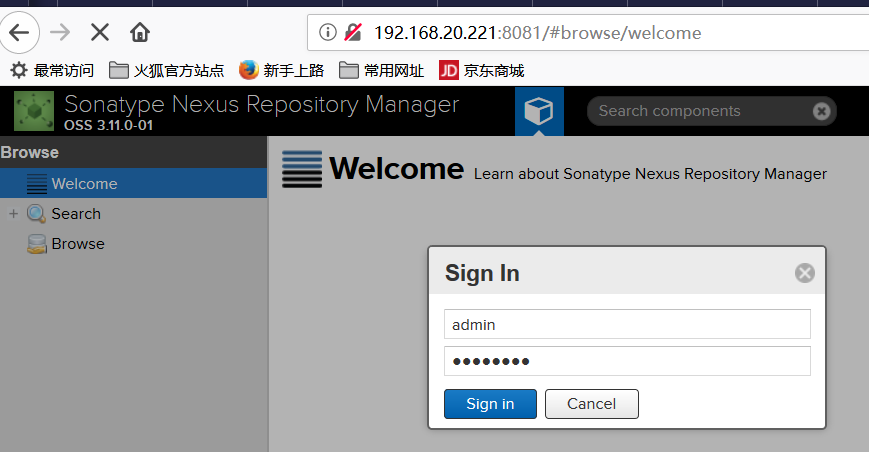

登录后可以在Server administration and configuration --> Repositories中查看到各种仓库，例public库如下所示：
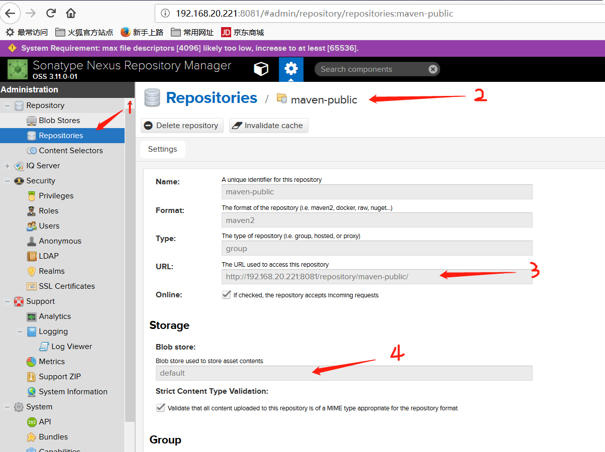

#### **2､基本操作**

 (1)  Nexus的仓库分为以下几种：

proxy : 代理仓库，对远程仓库的本地代理。
    hosted : 本地仓库。
    virtual：影子仓库，对proxy或hosted仓库的映射。
    group：仓库组，作为逻辑仓库组对外
逻辑关系 如下：


(2)  如果需要对repository的配置进行修改，如 central,Apache Snapshots，可参考如下操作：

点击左侧 repositories，右侧打开仓库列表。选择仓库 central，可点rebuild index等操作，nexus 3.x保持默认即可。

(3)   **新建hosted类型的仓库**，如下所示：

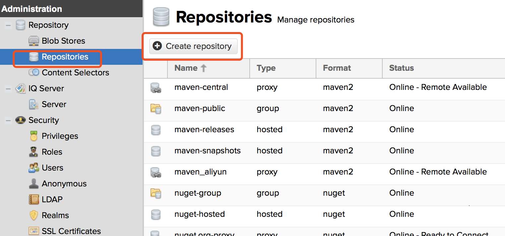

然后选择“maven hosted”，如下所示：
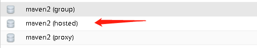
输入Repositories 名称，版本策略选择“Release”，Layout pollcy选择"Strict" ，Deployment pollcy选择"Allow redeploy"，如下所示：
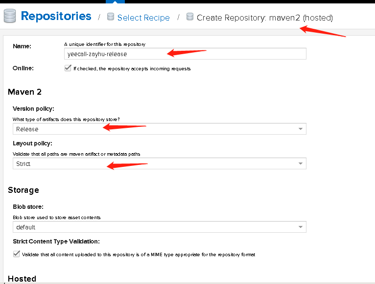
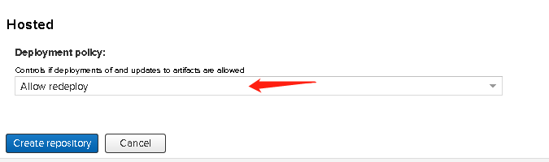

 (4)   **新建proxy类型的仓库(工厂)**

输入Repositories name ，并输入proxy 的目标地址(例 http://maven.aliyun.com/nexus/content/groups/public/ ) ，如下所示：
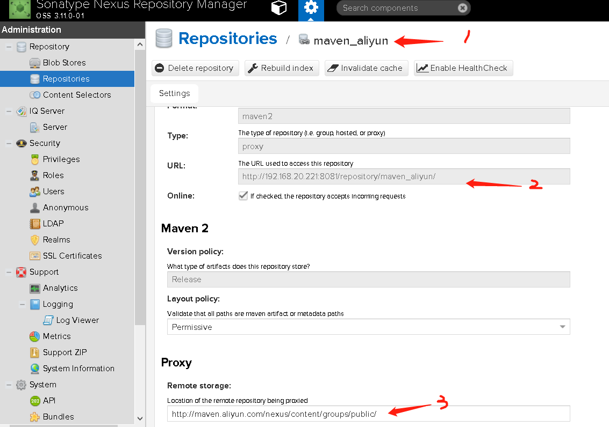

 (5)  将自定义的proxy类型repository 添加到maven-public group中

打开maven-public repositories ，并选择相关的members ，如下所示：
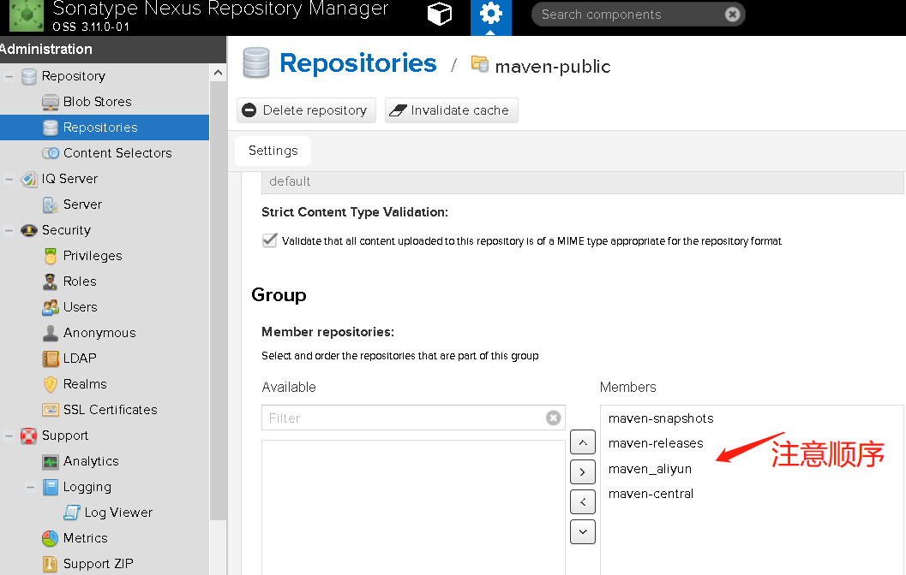

最终各库状态如下：
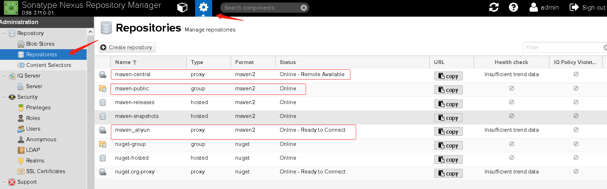

#### 3､**调用 Repository**

(1)  可以在java各项目的pom.xml文件中定义repository的url，从而调用 以上各repositories ，格式如下所示：

``` shell
<repositories>
     <repository>
          <id> repo_id </id>
          <name> repo_name </name>
          <url> repo_url </url>
      </repository>
      ...
      ...
<repositories>
```

(2) 如果有多个工厂(仓库)，就需要定义多段<repository>，指定多个<url>。为了简化操作，可以在nexus中将多个Repository加入一个 Repo-Group，然后在pom.xml文件中指定一个Repo-Group的url即可获得多个Repository的依赖包。如下所示：
```shell
  <repositories>
      <repository>
          <id>nexus</id>
          <name>nexus_repo</name>
          <url>http://localhost:8081/repository/maven-public/</url>
          <releases><enabled> true</enabled></releases>
          <snapshots><enabled> true</enabled></snapshots>
      </repository>
  </repositories>
```

(3 )  如果用户新创建一个项目，或更换一个新的workspace，就需要在新的pom.xml文件中重新指定respository，所以不推荐这种方式。推荐方法：在maven 的settings.xml文件中指定nexus仓库地址，如下所示：
``` shell
  <profiles>
    <profile>
    <id>nexusProfile</id>
	  <repositories>	  
        <repository>
	        <id>nexus</id>
		      <name>nexus_repo</name>
		      <url>http://localhost:8081/repository/maven-public/</url>
		      <releases><enabled> true</enabled></releases>
		      <snapshots><enabled> true</enabled></snapshots>
	      </repository>
	   </repositories>
    </profile>
  </profiles>
```

以上定义的profile必须在settings.xml文件激活才能生效，如下所示：
``` shell
  <activeProfiles>
    <activeProfile>nexusProfile</activeProfile>
  </activeProfiles>
```

(4)  以上方法：如果把nexus stop ，它将跳过nexus，直接到maven的中央工厂(仓库)去下载。如果希望只有nexus才可以到中央工厂(仓库)下载，就需要在settings.xml文件中配置mirror，如下所示：
``` shell
 <mirrors>
	 <mirror>
      <id>nexusMirror</id>
      <mirrorOf>*</mirrorOf>
      <name>all repositoies for this Mirror.</name>
      <url>http://localhost:8081/repository/maven-public/</url>
    </mirror>	 
  </mirrors>
```

为了可以在central repository 中下载snapshot 的依赖，需要添加 如下的profile:
``` shell
 <profile>
    <id>centralProfile</id>
	  <repositories>
		  <repository>
		  <id>central</id>
		  <name>Central Repository</name>
		  <url>https://*</url>
		  <layout>default</layout>
		  <snapshots><enabled>true</enabled></snapshots>
		 </repository>
	  </repositories>	  
   </profile>
```

并将之前的激活的profile修改为centralProfile，如下所示：
``` shell
  <activeProfiles>
    <activeProfile>centralProfile</activeProfile>
  </activeProfiles>
```

(5)  为了让各项目在mvn deploy时可以将*.jar包push到hosted类型的本地repository中，首先需要在项目的pom.xml文件中定义push的target repository，如下所示：
``` shell
  <distributionManagement>
	
  	<repository>
  		<id>user-release</id>
  		<name>release</name>
  		<url>http://localhost:8081/repository/maven-releases/</url>
  	</repository>
		
  	<snapshotRepository>
  		<id>user-snapshot</id>
  		<name>snapshot</name>
  		<url>http://localhost:8081/repository/maven-snapshots/</url>
  	</snapshotRepository>
		
  </distributionManagement>
```
图例如下：
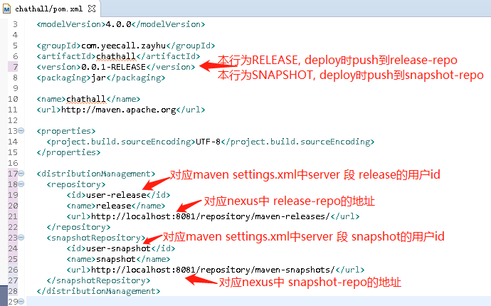

然后在maven的setting.xml文件 中定义**user-release和user-snapshot**所对应的**用户名、密码**，如下所示：
``` shell
  <servers>
  	<server>
      <id>user-release</id>
      <username>admin</username>
      <password>admin123</password>
    </server>
	<server>
      <id>user-snapshot</id>
      <username>admin</username>
      <password>admin123</password>
    </server>
  </servers>
```
注意：一定要保证snapshot的repository 的 "**Allow redeploy**"属性，如下所示：


**较完整的maven配置文件settings.xml文件 内容如下**：
vim /usr/java/maven/conf/settings.xml
``` shell
# servers 内添加用户/密码, 以便之后可以向releases/snapshots本地仓库(工厂)push jar 包
    <server>
      <id>releases</id>
      <username>admin</username>
      <password>admin123</password>
    </server>
    <server>
      <id>snapshots</id>
      <username>admin</username>
      <password>admin123</password>
    </server>

# mirrors增加私库
    <mirror>
      <!--This sends everything else to /public -->
      <id>nexus</id>
      <mirrorOf>*</mirrorOf>
      <url>http://192.168.20.221:8081/repository/maven-public/</url>
    </mirror>
		<mirror>
      <id>nexus2</id>
      <mirrorOf>snapshots</mirrorOf>
      <url>http://192.168.20.221:8081/repository/maven-public/</url>
    </mirror>
# 一定要配置为 <mirrorOf>*</mirrorOf>，即让所有的仓库都先经过私库，这样可以将远程下载的包缓存到本地

    <profile>
      <id>nexus</id>
      <!--Enable snapshots for the built in central repo to direct -->
      <!--all requests to nexus via the mirror -->
			
      <repositories>
        <repository>
          <id>central</id>
          <url>http://192.168.20.221:8081/repository/maven-central/</url>
          <releases><enabled>true</enabled></releases>
          <snapshots><enabled>true</enabled></snapshots>
        </repository>
      </repositories>
			
     <pluginRepositories>
        <pluginRepository>
          <id>central</id>
          <url>http://192.168.20.221:8081/repository/maven-central/</url>
          <releases><enabled>true</enabled></releases>
          <snapshots><enabled>true</enabled></snapshots>
        </pluginRepository>
      </pluginRepositories>
			
    </profile>
		
	<activeProfiles>
    <activeProfile>nexus</activeProfile>
  </activeProfiles>
   #以上定义 profile，最后activeProfile 激活定义的profile
	 #在profile中允许 访问releases/snapshots仓库 (工厂)
```

提示:
    Maven安装目录下的 /conf/settings.xml 起全局控制作用。
		用户目下的Maven配置文件，即：~/.m2/settings.xml 仅对当前用户用效

关于Maven的mirror:
    mirrors可以配置多个mirror，每个mirror有id,name,url,mirrorOf属性，id是唯一标识一个mirror就不多说了，name貌似没多大用，相当于描述，url是官方的库地址，mirrorOf代表了一个镜像的替代位置，例如central就表示代替官方的中央库。
    镜像库并不是一个分库的概念，就是说当a.jar在第一个mirror中不存在的时候，maven会去第二个mirror中查询下载。但事实却不是这样，当第一个mirror中不存在a.jar的时候，并不会去第二个mirror中查找，甚至于，maven根本不会去其他的mirror地址查询。
    maven的mirror是镜像，而不是“分库”，只有当前一个mirror无法连接的时候，才会去找后一个，类似于备份和容灾。
    mirror也不是按settings.xml中写的那样的顺序来查询的。所谓的第一个并不一定是最上面的那个。当有id为B,A,C的顺序的mirror在mirrors节点中，maven会根据字母排序来指定第一个，所以不管怎么排列，一定会找到A这个mirror来进行查找，当A无法连接，出现意外的情况下，才会去B查询。

在Maven工程的pom.xml中:
    当发布到属性为snapshot的仓库时，工程自述说明小节中的 <version>，需要带上后缀 SNAPSHOT，否则会当成 release 发布, 会收到 400 Bad Request 错误。
    发布配置中的 <url> 地址一定要区分清楚。并在 release 与 snapshot 仓库里配置不同的地址。此外，id、name 要与Nexus中仓库的配置 configuration 中的内容一致。
    Nexus OSS的仓库属性：
    snapshot : 快照版本，即不稳定的频繁发布场所，常用于团队成员快速联调。
    release : 正式版本，即稳定包所在场所

maven-public仓库地址 访问如下：
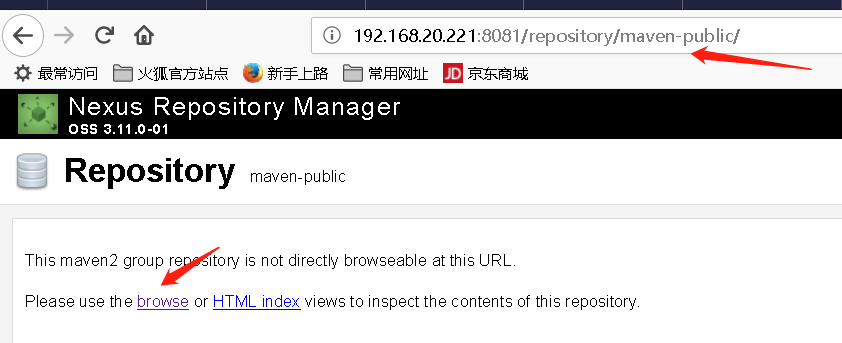

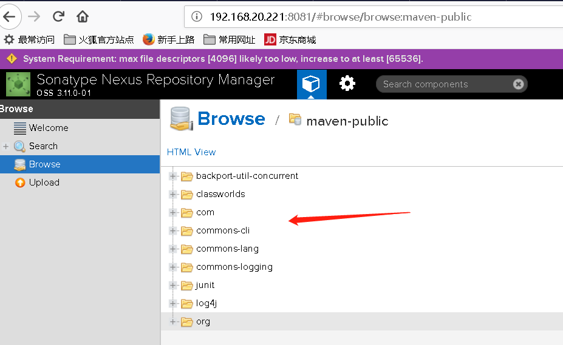
