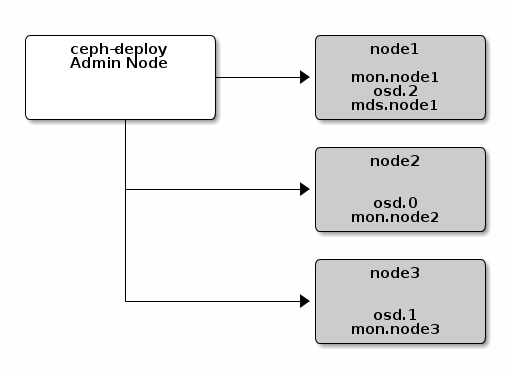

# Ceph 之部署存储集群

### 一、准备机器

本文描述如何在 CentOS 7 下搭建 Ceph 存储集群（STORAGE CLUSTER）。


一共4台机器，其中1个是管理节点，其他3个是ceph节点：

| hostname   | ip            | role        | 描述               |
| ---------- | ------------- | ----------- | ------------------ |
| admin-node | 192.168.0.130 | ceph-deploy | 管理节点           |
| node1      | 192.168.0.131 | mon.node1   | ceph节点，监控节点 |
| node2      | 192.168.0.132 | osd.0       | ceph节点，OSD节点  |
| node3      | 192.168.0.133 | osd.1       | ceph节点，OSD节点  |

管理节点：admin-node

ceph节点：node1, node2, node3

所有节点：admin-node, node1, node2, node3

#### 1. 修改主机名

```
# vi /etc/hostname
```

#### 2. 修改hosts文件

```
# vi /etc/hosts
192.168.0.130 admin-node
192.168.0.131 node1
192.168.0.132 node2
192.168.0.133 node3
```

#### 3. 确保联通性（管理节点）

用 ping 短主机名（ hostname -s ）的方式确认网络联通性。解决掉可能存在的主机名解析问题。

```
$ ping node1
$ ping node2
$ ping node3
```

### 二、ceph节点安装

#### 1. 安装NPT（所有节点）

我们建议在所有 Ceph 节点上安装 NTP 服务（特别是 Ceph Monitor 节点），以免因时钟漂移导致故障，详情见时钟。

```
# sudo yum install ntp ntpdate ntp-doc
```

#### 2. 安装SSH（所有节点）

```
# sudo yum install openssh-server
```

#### 3. 创建部署 CEPH 的用户（所有节点）

ceph-deploy 工具必须以普通用户登录 Ceph 节点，且此用户拥有无密码使用 sudo 的权限，因为它需要在安装软件及配置文件的过程中，不必输入密码。
建议在集群内的所有 Ceph 节点上给 ceph-deploy 创建一个特定的用户，但不要用 “ceph” 这个名字。

1) 在各 Ceph 节点创建新用户

```
# sudo useradd -d /home/zeng -m zeng
# sudo passwd zeng
```

2) 确保各 Ceph 节点上新创建的用户都有 sudo 权限

```
# echo "zeng ALL = (root) NOPASSWD:ALL" | sudo tee /etc/sudoers.d/zeng
# sudo chmod 0440 /etc/sudoers.d/zeng
```

#### 4. 允许无密码SSH登录（管理节点）

因为 ceph-deploy 不支持输入密码，你必须在**管理节点**上生成 SSH 密钥并把其公钥分发到各 Ceph 节点。 ceph-deploy 会尝试给初始 monitors 生成 SSH 密钥对。

1) 生成 SSH 密钥对

不要用 **sudo** 或 **root** 用户。提示 “Enter passphrase” 时，直接回车，口令即为空：

```
//切换用户，如不特别说明，后续的操作均在该用户下进行
# su zeng

//生成密钥对
$ ssh-keygen

Generating public/private rsa key pair.
Enter file in which to save the key (/home/zeng/.ssh/id_rsa): 
Created directory '/home/zeng/.ssh'.
Enter passphrase (empty for no passphrase): 
Enter same passphrase again: 
Your identification has been saved in /home/zeng/.ssh/id_rsa.
Your public key has been saved in /home/zeng/.ssh/id_rsa.pub.
The key fingerprint is:
SHA256:Tb0VpUOZtmh+QBRjUOE0n2Uy3WuoZVgXn6TBBb2SsGk zeng@admin-node
The key's randomart image is:
+---[RSA 2048]----+
|          .+@=OO*|
|           *.BB@=|
|          ..O+Xo+|
|         o E+O.= |
|        S oo=.o  |
|           .. .  |
|             .   |
|                 |
|                 |
+----[SHA256]-----+
```

2) 把公钥拷贝到各 Ceph 节点

```
$ ssh-copy-id zeng@node1
$ ssh-copy-id zeng@node2
$ ssh-copy-id zeng@node3
```

完成后， /home/zeng/.ssh/ 路径下：

- admin-node 多了文件 `id_rsa`、`id_rsa.pub` 和 `known_hosts`；
- node1, node2, node3 多了文件`authorized_keys`。

3) 修改~/.ssh/config 文件

修改 ~/.ssh/config 文件（没有则新增），这样 ceph-deploy 就能用你所建的用户名登录 Ceph 节点了。

```
// 必须使用sudo
$ sudo vi ~/.ssh/config
Host admin-node
   Hostname admin-node
   User zeng
Host node1
   Hostname node1
   User zeng
Host node2
   Hostname node2
   User zeng
Host node3
   Hostname node3
   User zeng
```

4) 测试ssh能否成功

```
$ ssh zeng@node1
$ exit
$ ssh zeng@node2
$ exit
$ ssh zeng@node3
$ exit
```

> - 问题：如果出现 "Bad owner or permissions on /home/zeng/.ssh/config"，执行命令修改文件权限。
>
> ```
> $ sudo chmod 644 ~/.ssh/config
> ```

#### 5. 引导时联网（ceph节点）

Ceph 的各 OSD 进程通过网络互联并向 Monitors 上报自己的状态。如果网络默认为 off ，那么 Ceph 集群在启动时就不能上线，直到你打开网络。

```
$ cat /etc/sysconfig/network-scripts/ifcfg-enp0s3

//确保ONBOOT 设置成了 yes 
```

#### 6. 开放所需端口（ceph节点）

Ceph Monitors 之间默认使用 6789 端口通信， OSD 之间默认用 6800:7300 这个范围内的端口通信。Ceph OSD 能利用多个网络连接进行与客户端、monitors、其他 OSD 间的复制和心跳的通信。

```
$ sudo firewall-cmd --zone=public --add-port=6789/tcp --permanent
// 或者关闭防火墙
$ sudo systemctl stop firewalld
$ sudo systemctl disable firewalld
```

#### 7. 终端（TTY）（ceph节点）

在 CentOS 和 RHEL 上执行 ceph-deploy 命令时可能会报错。如果你的 Ceph 节点默认设置了 requiretty ，执行

```
$ sudo visudo
```

找到 **Defaults requiretty** 选项，把它改为 Defaults:ceph !requiretty 或者直接注释掉，这样 ceph-deploy 就可以用之前创建的用户（创建部署 Ceph 的用户 ）连接了。

> 编辑配置文件 /etc/sudoers 时，必须用 sudo visudo 而不是文本编辑器。

#### 8. 关闭selinux（ceph节点）

```
$ sudo setenforce 0
```

要使 SELinux 配置永久生效（如果它的确是问题根源），需修改其配置文件 /etc/selinux/config：

```
$ sudo sed -i 's/^SELINUX=.*/SELINUX=disabled/' /etc/selinux/config
```

即修改 SELINUX=**disabled**。

#### 9. 配置EPEL源（管理节点）

```
$ sudo yum install -y yum-utils && sudo yum-config-manager --add-repo https://dl.fedoraproject.org/pub/epel/7/x86_64/ && sudo yum install --nogpgcheck -y epel-release && sudo rpm --import /etc/pki/rpm-gpg/RPM-GPG-KEY-EPEL-7 && sudo rm /etc/yum.repos.d/dl.fedoraproject.org*
```

#### 10. 把软件包源加入软件库（管理节点）

```
$ sudo vi /etc/yum.repos.d/ceph.repo
```

把如下内容粘帖进去，保存到 /etc/yum.repos.d/ceph.repo 文件中。

```
[Ceph]
name=Ceph packages for $basearch
baseurl=http://mirrors.aliyun.com/ceph/rpm-jewel/el7/x86_64/
enabled=1
gpgcheck=0
type=rpm-md
gpgkey=https://mirrors.aliyun.com/ceph/keys/release.asc
priority=1

[Ceph-noarch]
name=Ceph noarch packages
baseurl=http://mirrors.aliyun.com/ceph/rpm-jewel/el7/noarch/
enabled=1
gpgcheck=0
type=rpm-md
gpgkey=https://mirrors.aliyun.com/ceph/keys/release.asc
priority=1

[ceph-source]
name=Ceph source packages
baseurl=http://mirrors.aliyun.com/ceph/rpm-jewel/el7/SRPMS/
enabled=1
gpgcheck=0
type=rpm-md
gpgkey=https://mirrors.aliyun.com/ceph/keys/release.asc
priority=1
```

#### 11. 更新软件库并安装ceph-deploy（管理节点）

```
$ sudo yum update && sudo yum install ceph-deploy
$ sudo yum install yum-plugin-priorities
```

时间可能比较久，耐心等待。

### 三、搭建集群

在 **管理节点** 下执行如下步骤：

#### 1. 安装准备，创建文件夹

在管理节点上创建一个目录，用于保存 ceph-deploy 生成的配置文件和密钥对。

```
$ cd ~
$ mkdir my-cluster
$ cd my-cluster
```

**注：若安装ceph后遇到麻烦可以使用以下命令进行清除包和配置：**

```
// 删除安装包
$ ceph-deploy purge admin-node node1 node2 node3

// 清除配置
$ ceph-deploy purgedata admin-node node1 node2 node3
$ ceph-deploy forgetkeys
```

#### 2. 创建集群和监控节点

创建集群并初始化**监控节点**：

```
$ ceph-deploy new {initial-monitor-node(s)}
```

这里node1是monitor节点，所以执行：

```
$ ceph-deploy new node1
```

完成后，my-clster 下多了3个文件：`ceph.conf`、`ceph-deploy-ceph.log` 和 `ceph.mon.keyring`。

> - 问题：如果出现 "[ceph_deploy][ERROR ] RuntimeError: remote connection got closed, ensure `requiretty` is disabled for node1"，执行 sudo visudo 将 Defaults requiretty 注释掉。

#### 3. 修改配置文件

```
$ cat ceph.conf
```

内容如下：

```
[global]
fsid = 89933bbb-257c-4f46-9f77-02f44f4cc95c
mon_initial_members = node1
mon_host = 192.168.0.131
auth_cluster_required = cephx
auth_service_required = cephx
auth_client_required = cephx
```

把 Ceph 配置文件里的默认副本数从 3 改成 2 ，这样只有两个 OSD 也可以达到 active + clean 状态。把 osd pool default size = 2 加入 [global] 段：

```
$ sed -i '$a\osd pool default size = 2' ceph.conf
```

如果有多个网卡，
可以把 public network 写入 Ceph 配置文件的 [global] 段：

```
public network = {ip-address}/{netmask}
```

#### 4. 安装Ceph

在所有节点上安装ceph：

```
$ ceph-deploy install admin-node node1 node2 node3
```

> - 问题：[ceph_deploy][ERROR ] RuntimeError: Failed to execute command: yum -y install epel-release
>
> 解决方法：
>
> ```
> sudo yum -y remove epel-release
> ```

#### 5. 配置初始 monitor(s)、并收集所有密钥

```
$ ceph-deploy mon create-initial
```

完成上述操作后，当前目录里应该会出现这些密钥环：

```
{cluster-name}.client.admin.keyring
{cluster-name}.bootstrap-osd.keyring
{cluster-name}.bootstrap-mds.keyring
{cluster-name}.bootstrap-rgw.keyring
```

#### 6. 添加2个OSD

1) 登录到 Ceph 节点、并给 OSD 守护进程创建一个目录，并添加权限。

```
$ ssh node2
$ sudo mkdir /var/local/osd0
$ sudo chmod 777 /var/local/osd0/
$ exit

$ ssh node3
$ sudo mkdir /var/local/osd1
$ sudo chmod 777 /var/local/osd1/
$ exit
```

2) 然后，从管理节点执行 ceph-deploy 来准备 OSD 。

```
$ ceph-deploy osd prepare node2:/var/local/osd0 node3:/var/local/osd1
```

3) 最后，激活 OSD 。

```
$ ceph-deploy osd activate node2:/var/local/osd0 node3:/var/local/osd1
```

#### 7.把配置文件和 admin 密钥拷贝到管理节点和 Ceph 节点

```
$ ceph-deploy admin admin-node node1 node2 node3
```

#### 8. 确保你对 ceph.client.admin.keyring 有正确的操作权限

```
$ sudo chmod +r /etc/ceph/ceph.client.admin.keyring
```

#### 9. 检查集群的健康状况和OSD节点状况

```
[zeng@admin-node my-cluster]$ ceph health
HEALTH_OK

[zeng@admin-node my-cluster]$ ceph -s
    cluster a3dd419e-5c99-4387-b251-58d4eb582995
     health HEALTH_OK
     monmap e1: 1 mons at {node1=192.168.0.131:6789/0}
            election epoch 3, quorum 0 node1
     osdmap e10: 2 osds: 2 up, 2 in
            flags sortbitwise,require_jewel_osds
      pgmap v22: 64 pgs, 1 pools, 0 bytes data, 0 objects
            12956 MB used, 21831 MB / 34788 MB avail
                  64 active+clean
                  
[zeng@admin-node my-cluster]$ ceph osd df
ID WEIGHT  REWEIGHT SIZE   USE    AVAIL  %USE  VAR  PGS 
 0 0.01659  1.00000 17394M  6478M 10915M 37.24 1.00  64 
 1 0.01659  1.00000 17394M  6478M 10915M 37.25 1.00  64 
              TOTAL 34788M 12956M 21831M 37.24          
MIN/MAX VAR: 1.00/1.00  STDDEV: 0
```

 

### 四、扩展集群（扩容）



#### 1. 添加OSD

在 node1 上添加一个 osd.2。

1) 创建目录

```
$ ssh node1
$ sudo mkdir /var/local/osd2
$ sudo chmod 777 /var/local/osd2/
$ exit
```

2) 准备OSD

```
$ ceph-deploy osd prepare node1:/var/local/osd2
```

3) 激活OSD

```
$ ceph-deploy osd activate node1:/var/local/osd2
```

4) 检查集群状况和OSD节点：

```
[zeng@admin-node my-cluster]$ ceph -s
    cluster a3dd419e-5c99-4387-b251-58d4eb582995
     health HEALTH_OK
     monmap e1: 1 mons at {node1=192.168.0.131:6789/0}
            election epoch 3, quorum 0 node1
     osdmap e15: 3 osds: 3 up, 3 in
            flags sortbitwise,require_jewel_osds
      pgmap v37: 64 pgs, 1 pools, 0 bytes data, 0 objects
            19450 MB used, 32731 MB / 52182 MB avail
                  64 active+clean

[zeng@admin-node my-cluster]$ ceph osd df
ID WEIGHT  REWEIGHT SIZE   USE    AVAIL  %USE  VAR  PGS 
 0 0.01659  1.00000 17394M  6478M 10915M 37.24 1.00  41 
 1 0.01659  1.00000 17394M  6478M 10915M 37.24 1.00  43 
 2 0.01659  1.00000 17394M  6494M 10899M 37.34 1.00  44 
              TOTAL 52182M 19450M 32731M 37.28          
MIN/MAX VAR: 1.00/1.00  STDDEV: 0.04
```

#### 2. 添加MONITORS

在 ndoe2 和 node3 添加监控节点。

1) 修改 `mon_initial_members`、`mon_host` 和 `public network` 配置：

```
[global]
fsid = a3dd419e-5c99-4387-b251-58d4eb582995
mon_initial_members = node1,node2,node3
mon_host = 192.168.0.131,192.168.0.132,192.168.0.133
auth_cluster_required = cephx
auth_service_required = cephx
auth_client_required = cephx

osd pool default size = 2
public network = 192.168.0.120/24
```

2) 推送至其他节点：

```
$ ceph-deploy --overwrite-conf config push node1 node2 node3
```

3) 添加监控节点:

```
$ ceph-deploy mon add node2 node3
```

4) 查看集群状态和监控节点：

```
[zeng@admin-node my-cluster]$ ceph -s
    cluster a3dd419e-5c99-4387-b251-58d4eb582995
     health HEALTH_OK
     monmap e3: 3 mons at {node1=192.168.0.131:6789/0,node2=192.168.0.132:6789/0,node3=192.168.0.133:6789/0}
            election epoch 8, quorum 0,1,2 node1,node2,node3
     osdmap e25: 3 osds: 3 up, 3 in
            flags sortbitwise,require_jewel_osds
      pgmap v3919: 64 pgs, 1 pools, 0 bytes data, 0 objects
            19494 MB used, 32687 MB / 52182 MB avail
                  64 active+clean
                  
[zeng@admin-node my-cluster]$ ceph mon stat
e3: 3 mons at {node1=192.168.0.131:6789/0,node2=192.168.0.132:6789/0,node3=192.168.0.133:6789/0}, election epoch 8, quorum 0,1,2 node1,node2,node3
```

 