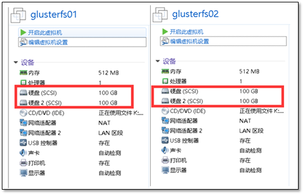

# 企业分布式文件系统 --- GlusterFS

## 1.1 分布式文件系统

### 1.1.1 什么是分布式文件系统

　　相对于本机端的文件系统而言，分布式文件系统（英语：*Distributed file system*, *DFS*），或是网络文件系统（英语：*Network File System*），是一种允许文件通过网络在多台主机上分享的文件系统，可让多机器上的多用户分享文件和存储空间。

　　在这样的文件系统中，客户端并非直接访问底层的数据存储区块，而是通过网络，以特定的通信协议和服务器沟通。借由通信协议的设计，可以让客户端和服务器端都能根据访问控制清单或是授权，来限制对于文件系统的访问。

### 1.1.2 glusterfs是什么

　　Gluster是一个分布式文件系统。它是各种不同的存储服务器之上的组合，这些服务器由以太网或无限带宽技术Infiniband以及远程直接内存访问RDMA互相融汇，最终所形成的一个大的并行文件系统网络。


　　它有包括云计算在内的多重应用，诸如：生物医药科学，文档存储。Gluster是由GNU托管的自由软件，证书是AGPL。Gluster公司是Gluster的首要商业赞助商，且提供商业产品以及基于Gluster的解决方案。

- 基于文件的镜像与赋值技术
- 基于文件的数据存储计算领域的数据带技术
- 基于文件的负载平衡技术
- 卷的双机备份技术
- 磁盘高速缓存技术以及排产技术
- 存储分配技术

## 1.2 快速部署GlusterFS

### 1.2.1 环境说明

注意：最少需要拥有两块硬盘

 

   系统环境说明

glusterfs01信息

```
[root@glusterfs01 ~]# hostname
glusterfs01
[root@glusterfs01 ~]# uname -r
3.10.0-693.el7.x86_64
[root@glusterfs01 ~]# sestatus 
SELinux status:                 disabled
[root@glusterfs01 ~]# systemctl status firewalld.service 
● firewalld.service - firewalld - dynamic firewall daemon
   Loaded: loaded (/usr/lib/systemd/system/firewalld.service; disabled; vendor preset: enabled)
   Active: inactive (dead)
     Docs: man:firewalld(1)
[root@glusterfs01 ~]# hostname -I
10.0.0.120 172.16.1.120
```

glusterfs02信息

```
[root@glusterfs02 ~]# uname -r
3.10.0-693.el7.x86_64
[root@glusterfs02 ~]# sestatus 
SELinux status:                 disabled
[root@glusterfs02 ~]# systemctl status firewalld.service 
● firewalld.service - firewalld - dynamic firewall daemon
   Loaded: loaded (/usr/lib/systemd/system/firewalld.service; disabled; vendor preset: enabled)
   Active: inactive (dead)
     Docs: man:firewalld(1)
[root@glusterfs02 ~]# hostname -I
10.0.0.121 172.16.1.121
```

   注意配置好hosts解析

### 1.2.2 前期准备

gluster01主机挂载磁盘

```
[root@glusterfs01 ~]# mkfs.xfs /dev/sdb
[root@glusterfs01 ~]# mkdir -p /data/brick1
[root@glusterfs01 ~]# echo '/dev/sdb /data/brick1 xfs defaults 0 0' >> /etc/fstab
[root@glusterfs01 ~]# mount -a && mount
```

gluster02主机挂载磁盘

```
[root@glusterfs02 ~]# mkfs.xfs /dev/sdb
[root@glusterfs02 ~]# mkdir -p /data/brick1
[root@glusterfs02 ~]# echo '/dev/sdb /data/brick1 xfs defaults 0 0' >> /etc/fstab
[root@glusterfs02 ~]# mount -a && mount
```

## 1.3 部署GlusterFS

### 1.3.1 安装软件

在两个节点上操作

```
yum install centos-release-gluster -y
# 修改镜像源加速
sed -i 's#http://mirror.centos.org#https://mirrors.shuosc.org#g' /etc/yum.repos.d/CentOS-Gluster-3.12.repo
yum install -y glusterfs glusterfs-server glusterfs-fuse glusterfs-rdma
```

软件版本

```
[root@glusterfs01 ~]#  rpm  -qa glusterfs
glusterfs-3.12.5-2.el7.x86_64
```

### 1.3.2 启动GlusterFS

在两个节点上都进行操作

```
[root@glusterfs01 ~]# systemctl start glusterd.service 
[root@glusterfs01 ~]# systemctl status glusterd.service 
● glusterd.service - GlusterFS, a clustered file-system server
   Loaded: loaded (/usr/lib/systemd/system/glusterd.service; disabled; vendor preset: disabled)
   Active: active (running) since 三 2018-02-07 21:02:44 CST; 2s ago
  Process: 1923 ExecStart=/usr/sbin/glusterd -p /var/run/glusterd.pid --log-level $LOG_LEVEL $GLUSTERD_OPTIONS (code=exited, status=0/SUCCESS)
 Main PID: 1924 (glusterd)
   CGroup: /system.slice/glusterd.service
           └─1924 /usr/sbin/glusterd -p /var/run/glusterd.pid --log-level INFO

2月 07 21:02:44 glusterfs01 systemd[1]: Starting GlusterFS, a clustered file-system server...
2月 07 21:02:44 glusterfs01 systemd[1]: Started GlusterFS, a clustered file-system server.
Hint: Some lines were ellipsized, use -l to show in full.
```

### 1.3.3 配置互信（可信池）

在glusterfs01上操作

```
[root@glusterfs01 ~]# gluster peer probe glusterfs02
peer probe: success.
```

在glusterfs02上操作

```
[root@glusterfs02 ~]# gluster peer probe glusterfs01
peer probe: success.
```

   注意：一旦建立了这个池，只有受信任的成员可能会将新的服务器探测到池中。新服务器无法探测池，必须从池中探测。

### 1.3.4 检查对等状态

```
[root@glusterfs01 ~]#  gluster peer status 
Number of Peers: 1

Hostname: 10.0.0.121
Uuid: 61d043b0-5582-4354-b475-2626c88bc576
State: Peer in Cluster (Connected)
Other names:
glusterfs02
```

   注意：看到的UUID应不相同。

```
[root@glusterfs02 ~]#  gluster peer status 
Number of Peers: 1

Hostname: glusterfs01
Uuid: e2a9367c-fe96-446d-a631-194970c18750
State: Peer in Cluster (Connected)
```

### 1.3.5 建立一个GlusterFS卷

在两个节点上操作

```
mkdir -p /data/brick1/gv0
```

   在任意一个节点上执行

```
[root@glusterfs01 ~]# gluster volume create gv0 replica 2 glusterfs01:/data/brick1/gv0 glusterfs02:/data/brick1/gv0
Replica 2 volumes are prone to split-brain. Use Arbiter or Replica 3 to avoid this. See: http://docs.gluster.org/en/latest/Administrator%20Guide/Split%20brain%20and%20ways%20to%20deal%20with%20it/.
Do you still want to continue?
 (y/n) y
volume create: gv0: success: please start the volume to access data
```

   启用存储卷

```
[root@glusterfs01 ~]# gluster volume start gv0
volume start: gv0: success
```

查看信息

```
[root@glusterfs01 ~]# gluster volume info 
 
Volume Name: gv0
Type: Replicate
Volume ID: 865899b9-1e5a-416a-8374-63f7df93e4f5
Status: Started
Snapshot Count: 0
Number of Bricks: 1 x 2 = 2
Transport-type: tcp
Bricks:
Brick1: glusterfs01:/data/brick1/gv0
Brick2: glusterfs02:/data/brick1/gv0
Options Reconfigured:
transport.address-family: inet
nfs.disable: on
performance.client-io-threads: off
```

至此，服务端配置结束

## 1.4 客户端测试

### 1.4.1 安装客户端工具

挂载测试

```
[root@clsn6 ~]# yum install centos-release-gluster -y
[root@clsn6 ~]# yum install -y glusterfs glusterfs-fuse
```

   注意：要配置好hosts文件，否则连接会出错

```
[root@clsn6 ~]# mount.glusterfs  glusterfs01:/gv0 /mnt 
[root@clsn6 ~]# df -h 
Filesystem        Size  Used Avail Use% Mounted on
/dev/sda3          19G  2.2G   16G  13% /
tmpfs             238M     0  238M   0% /dev/shm
/dev/sda1         190M   40M  141M  22% /boot
glusterfs01:/gv0  100G   33M  100G   1% /mnt
```

### 1.4.2 复制文件测试

```
[root@clsn6 ~]# for i in `seq -w 1 100`; do cp -rp /var/log/messages /mnt/copy-test-$i; done
```

客户端检查文件

```
[root@clsn6 ~]#  ls -lA /mnt/copy* | wc -l
10
```

服务节点检查文件

```
[root@glusterfs01 ~]#   ls -lA /data/brick1/gv0/copy* |wc -l
100
```

服务节点检查文件

```
[root@glusterfs02 ~]#   ls -lA /data/brick1/gv0/copy* |wc -l
100
```

   至此Glusterfs简单配置完成 

## 1.5 架构

### 1、分布式卷


```
gluster volume create test-volume server1:/exp1 server2:/exp2 server3:/exp3 server4:/exp4Creation of test-volume has been successfulPlease start the volume to access data*##gluster volume info*Volume Name: test-volumeType: DistributeStatus: CreatedNumber of Bricks: 4Transport-type: tcpBricks:Brick1: server1:/exp1Brick2: server2:/exp2Brick3: server3:/exp3Brick4: server4:/exp4
```

### 2、复制 Glusterfs 卷


```
# gluster volume create test-volume replica 2 transport tcp server1:/exp1 server2:/exp2Creationof test-volume has been successfulPlease start the volume to access dat
```

### 3、分布式复制 Glusterfs 卷


```
# gluster volume create test-volume replica 2 transport tcp server1:/exp1 server2:/exp2 server3:/exp3 server4:/exp4Creationof test-volume has been successfulPlease start the volume to access data
```

### 4、条纹 Glusterfs 卷


```
# gluster volume create test-volume stripe 2 transport tcp server1:/exp1 server2:/exp2Creationof test-volume has been successfulPlease start the volume to access data
```

### 5、分布式条纹 Glusterfs 卷


```
#gluster volume create test-volume stripe 4 transport tcp* server1:/exp1 server2:/exp2 server3:/exp3 server4:/exp4 server5:/exp5 server6:/exp6 server7:/exp7 server8:/exp8Creation of test-volume has been successfulPlease start the volume to access data.
```

## 1.6 参考文献

> [1]  <http://docs.gluster.org/en/latest/Quick-Start-Guide/Quickstart/>
>
> [2]  <https://www.cnblogs.com/jicki/p/5801712.html>>