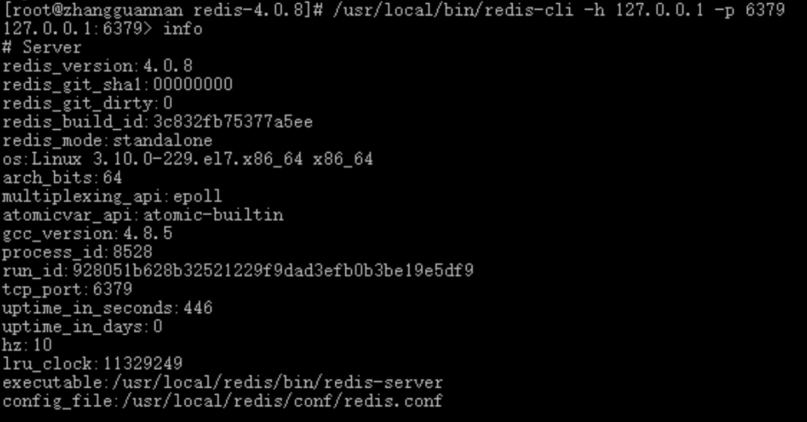
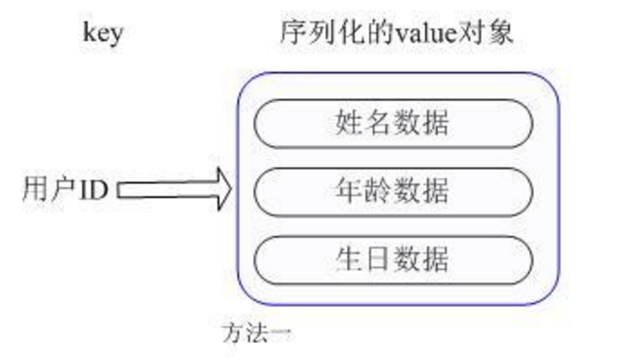

### Redis运维

[TOC]


#### 第一章 Redis简介

##### 1.1 Nosql介绍

​	Nosql的全称是Not Only Sql，这个概念早起就有人提出，在09年的时候比较火。Nosql指的是非关系型数据库，而我们常用的都是关系型数据库。就像我们常用的mysql，sqlserver一样，这些数据库一般用来存储重要信息，应对普通的业务是没有问题的。但是，随着互联网的高速发展，传统的关系型数据库在应付超大规模，超大流量以及高并发的时候力不从心。而就在这个时候，Nosql得到的高速的发展。Nosql和关系型数据库的区别有以下几个方面：

**存储方式**

　　关系型数据库是表格式的，因此存储在表的行和列中。他们之间很容易关联协作存储，提取数据很方便。而Nosql数据库则与其相反，他是大块的组合在一起。通常存储在数据集中，就像文档、键值对或者图结构。

**存储结构**

　　关系型数据库对应的是结构化数据，数据表都预先定义了结构（列的定义），结构描述了数据的形式和内容。这一点对数据建模至关重要，虽然预定义结构带来了可靠性和稳定性，但是修改这些数据比较困难。而Nosql数据库基于动态结构，使用与非结构化数据。因为Nosql数据库是动态结构，可以很容易适应数据类型和结构的变化。

**存储规范**

　　关系型数据库的数据存储为了更高的规范性，把数据分割为最小的关系表以避免重复，获得精简的空间利用。虽然管理起来很清晰，但是单个操作涉及到多张表的时候，数据管理就显得有点麻烦。而Nosql数据存储在平面数据集中，数据经常可能会重复。单个数据库很少被分隔开，而是存储成了一个整体，这样整块数据更加便于读写。

**存储扩展**

　　这可能是两者之间最大的区别，关系型数据库是纵向扩展，也就是说想要提高处理能力，要使用速度更快的计算机。因为数据存储在关系表中，操作的性能瓶颈可能涉及到多个表，需要通过提升计算机性能来克服。虽然有很大的扩展空间，但是最终会达到纵向扩展的上限。而Nosql数据库是横向扩展的，它的存储天然就是分布式的，可以通过给资源池添加更多的普通数据库服务器来分担负载。

**查询方式**
　　关系型数据库通过结构化查询语言来操作数据库（就是我们通常说的SQL）。SQL支持数据库CURD操作的功能非常强大，是业界的标准用法。而Nosql查询以块为单元操作数据，使用的是非结构化查询语言（UnQl），它是没有标准的。关系型数据库表中主键的概念对应Nosql中存储文档的ID。关系型数据库使用预定义优化方式（比如索引）来加快查询操作，而Nosql更简单更精确的数据访问模式。

**事务**
　　关系型数据库遵循ACID规则（原子性(Atomicity)、一致性(Consistency)、隔离性(Isolation)、持久性(Durability)），而Nosql数据库遵循BASE原则（基本可用（Basically Availble）、软/柔性事务（Soft-state ）、最终一致性（Eventual Consistency））。由于关系型数据库的数据强一致性，所以对事务的支持很好。关系型数据库支持对事务原子性细粒度控制，并且易于回滚事务。而Nosql数据库是在CAP（一致性、可用性、分区容忍度）中任选两项，因为基于节点的分布式系统中，很难全部满足，所以对事务的支持不是很好，虽然也可以使用事务，但是并不是Nosql的闪光点。

**性能**

　　关系型数据库为了维护数据的一致性付出了巨大的代价，读写性能比较差。在面对高并发读写性能非常差，面对海量数据的时候效率非常低。而Nosql存储的格式都是key-value类型的，并且存储在内存中，非常容易存储，而且对于数据的 一致性是 弱要求。Nosql无需sql的解析，提高了读写性能。

**授权方式**

　　关系型数据库通常有SQL Server，Mysql，Oracle。主流的Nosql数据库有redis，memcache，MongoDb。大多数的关系型数据库都是付费的并且价格昂贵，成本较大，而Nosql数据库通常都是开源的。

##### 1.2 NoSQL 数据库分类

| 类型          | 部分代表                                                     | 特点                                                         |
| ------------- | ------------------------------------------------------------ | ------------------------------------------------------------ |
| 列存储        | Hbase，Cassandra，Hypertable                                 | 顾名思义，是按列存储数据的。最大的特点是方便存储结构化和半结构化数据，方便做数据压缩，对针对某一列或者某几列的查询有非常大的IO优势。 |
| 文档存储      | MongoDB， CouchDB                                            | 文档存储一般用类似json的格式存储，存储的内容是文档型的。这样也就有有机会对某些字段建立索引，实现关系数据库的某些功能。 |
| key-value存储 | Tokyo Cabinet / Tyrant， Berkeley DB， MemcacheDB， **Redis** | 可以通过key快速查询到其value。一般来说，存储不管value的格式，照单全收。（Redis包含了其他功能） |
| 图存储        | Neo4J， FlockDB                                              | 图形关系的最佳存储。使用传统关系数据库来解决的话性能低下，而且设计使用不方便。 |
| 对象存储      | db4o， Versant                                               | 通过类似面向对象语言的语法操作数据库，通过对象的方式存取数据。 |
| xml数据库     | Berkeley DB XML， BaseX                                      | 高效的存储XML数据，并支持XML的内部查询语法，比如XQuery,Xpath。 |

##### 1.3 Redis概念

​	Redis 是一个开源（BSD许可）的，内存中的数据结构存储系统，它可以用作数据库、缓存和消息中间件。 它支持多种类型的数据结构，如字符串（strings）， 散列（hashes）， 列表（lists）， 集合（sets）， 有序集合（sorted sets） 与范围查询， bitmaps， hyperloglogs 和 地理空间（geospatial） 索引半径查询。 Redis 内置了复制（replication），LUA脚本（Lua scripting）， LRU驱动事件（LRU eviction），事务（transactions） 和不同级别的 磁盘持久化（persistence）， 并通过 Redis哨兵（Sentinel）和自动分区（Cluster）提供高可用性（high availability）。

#### 第二章 Redis安装部署

##### 2.1 安装

​	首先我们到官网下载最新的稳定版安装包，目前的最新版本为4.0.8

```shell
wget http://download.redis.io/releases/redis-4.0.8.tar.gz .
tar zxvf redis-4.0.8.tar.gz
cd redis-4.0.8/src/
make
make test
make install
```

make test之后看到All tests passed without errors! 其实一般都不会有错误的，这一步可做可不做。

##### 2.2 部署

​	为了方便管理，我们需要将redis的配置文件和可执行文件移动到指定目录中，将src下的redis-开头的命令可执行文件移动到指定的bin目录中，将redis.conf移动到指定的conf目录中。

```shell
mkdir -p /usr/local/redis/bin
mkdir -p /usr/local/redis/conf
mv redis-check-aof redis-cli redis-sentinel redis-benchmark redis-check-rdb redis-server redis-trib.rb /usr/local/redis/bin/
cd ..
mv redis.conf /usr/local/redis/conf/
```

​	尝试启动Redis

```
/usr/local/redis/bin/redis-server
```


注意：这里直接执行redis-server启动的Redis服务，是在前台直接运行的(效果如上图)，也就是说，执行完该命令后，如果Lunix关闭当前会话，则Redis服务也随即关闭。正常情况下，启动Redis服务需要从后台启动，并且指定启动配置文件。

现在让我们Ctrl + c关闭Redis服务，并编辑Redis的配置文件，/usr/local/redis/conf/redis.conf，修改如下几项，使Redis以后台方式运行，并且可以接收来自其他服务器的请求

```ini
daemonize yes
bind 0.0.0.0
```

再次运行redis-server并指定配置文件，可以看到redis启动成功，并且监听了默认端口6379

```shell
/usr/local/redis/bin/redis-server /usr/local/redis/conf/redis.conf
ss -nap | grep 6379
```


让我们连进Redis服务器，并输入info命令，查看info信息

```shell
/usr/local/bin/redis-cli -h 127.0.0.1 -p 6379
```




#### 第三章 Redis数据类型及应用场景

##### 3.1 String

​	String数据结构是简单的key-value类型，value其实不仅是String，也可以是数字。

​	常用命令：set，get，decr，incr，mget，mset，setex

```redis
127.0.0.1:6379> set mykey hello
OK
127.0.0.1:6379> get mykey
"hello"
127.0.0.1:6379> strlen mykey
(integer) 5
127.0.0.1:6379> set count 1
OK
127.0.0.1:6379> incr count
(integer) 2
127.0.0.1:6379> get count
"2"
127.0.0.1:6379> incrby count 3
(integer) 5
127.0.0.1:6379> get count
"5"
```

​	string类型支持命令如下：

| **序号** | **命令及描述**                                               |
| -------- | ------------------------------------------------------------ |
| 1        | SET key value   设置指定 key 的值                            |
| 2        | GET key   获取指定 key 的值。                                |
| 3        | GETRANGE key start end   返回 key 中字符串值的子字符         |
| 4        | GETSET key value  将给定 key 的值设为 value ，并返回 key 的旧值(old value)。 |
| 5        | GETBIT key offset  对 key 所储存的字符串值，获取指定偏移量上的位(bit)。 |
| 6        | MGET key1 [key2..]  获取所有(一个或多个)给定 key 的值。      |
| 7        | SETBIT key offset value  对 key 所储存的字符串值，设置或清除指定偏移量上的位(bit)。 |
| 8        | SETEX key seconds value  将值 value 关联到 key ，并将 key 的过期时间设为 seconds (以秒为单位)。 |
| 9        | SETNX key value  只有在 key 不存在时设置 key 的值。          |
| 10       | SETRANGE key offset value  用 value 参数覆写给定 key 所储存的字符串值，从偏移量 offset 开始。 |
| 11       | STRLEN key  返回 key 所储存的字符串值的长度。                |
| 12       | MSET key value [key value ...]  同时设置一个或多个 key-value 对。 |
| 13       | MSETNX key value [key value ...]   同时设置一个或多个 key-value 对，当且仅当所有给定 key 都不存在。 |
| 14       | PSETEX key milliseconds value  这个命令和 SETEX 命令相似，但它以毫秒为单位设置 key 的生存时间，而不是像 SETEX 命令那样，以秒为单位。 |
| 15       | INCR key  将 key 中储存的数字值增一。                        |
| 16       | INCRBY key increment  将 key 所储存的值加上给定的增量值（increment） 。 |
| 17       | INCRBYFLOAT key increment  将 key 所储存的值加上给定的浮点增量值（increment） 。 |
| 18       | DECR key  将 key 中储存的数字值减一。                        |
| 19       | DECRBY key decrement  key 所储存的值减去给定的减量值（decrement） 。 |
| 20       | APPEND key value  如果 key 已经存在并且是一个字符串， APPEND 命令将 指定value 追加到改 key 原来的值（value）的末尾。 |

 **应用场景**

​	常规key-value缓存应用，常规计数: 微博数, 粉丝数，阅读数，点赞数。

##### 3.2 Hash

​	Redis hash 是一个string类型的field和value的映射表，hash特别适合用于存储对象。

​	常用命令：hget，hset，hgetall

​	我们举个实例来描述下Hash的应用场景，比如我们要存储一个用户信息对象数据，包含以下信息：

​	

​	第一种方式将用户ID作为查找key,把其他信息封装成一个对象以序列化的方式存储，这种方式的缺点是，增加了序列化/反序列化的开销，并且在需要修改其中一项信息时，需要把整个对象取回，并且修改操作需要对并发进行保护，引入CAS等复杂问题。

​	

​	第二种方法是这个用户信息对象有多少成员就存成多少个key-value对儿，用用户ID+对应属性的名称作为唯一标识来取得对应属性的值，虽然省去了序列化开销和并发问题，但是用户ID为重复存储，如果存在大量这样的数据，内存浪费还是非常可观的。

​	那么Redis提供的Hash很好的解决了这个问题，Redis的Hash实际是内部存储的Value为一个HashMap，并提供了直接存取这个Map成员的接口，如下图：

​	

​	也就是说，Key仍然是用户ID, value是一个Map，这个Map的key是成员的属性名，value是属性值，这样对数据的修改和存取都可以直接通过其内部Map的Key(Redis里称内部Map的key为field), 也就是通过 key(用户ID) + field(属性标签) 就可以操作对应属性数据了，既不需要重复存储数据，也不会带来序列化和并发修改控制的问题。很好的解决了问题。

​    	这里同时需要注意，Redis提供了接口(hgetall)可以直接取到全部的属性数据，但是如果内部Map的成员很多，那么涉及到遍历整个内部Map的操作，由于Redis单线程模型的缘故，这个遍历操作可能会比较耗时，而另其它客户端的请求完全不响应，这点需要格外注意。

```redis
127.0.0.1:6379> hset student:1 name chris age 17 birthday 1998-01-08
(integer) 3
127.0.0.1:6379> hgetall student:1
1) "name"
2) "chris"
3) "age"
4) "17"
5) "birthday"
6) "1998-01-08"
127.0.0.1:6379> hset student:1 age 18
(integer) 0
127.0.0.1:6379> hget student:1 age
"18"
127.0.0.1:6379> hgetall student:1
1) "name"
2) "chris"
3) "age"
4) "18"
5) "birthday"
6) "1998-01-08"

```

​	hash类型支持命令如下：

| **序号** | **命令及描述**                                               |
| -------- | ------------------------------------------------------------ |
| 1        | HDEL key field1 [field2]   删除一个或多个哈希表字段          |
| 2        | HEXISTS key field   查看哈希表 key 中，指定的字段是否存在。  |
| 3        | HGET key field   获取存储在哈希表中指定字段的值。            |
| 4        | HGETALL key   获取在哈希表中指定 key 的所有字段和值          |
| 5        | HINCRBY key field increment   为哈希表 key 中的指定字段的整数值加上增量 increment 。 |
| 6        | HINCRBYFLOAT key field increment   为哈希表 key 中的指定字段的浮点数值加上增量 increment 。 |
| 7        | HKEYS key   获取所有哈希表中的字段                           |
| 8        | HLEN key   获取哈希表中字段的数量                            |
| 9        | HMGET key field1 [field2]   获取所有给定字段的值             |
| 10       | HMSET key field1 value1 [field2 value2  ]   同时将多个 field-value (域-值)对设置到哈希表 key 中。 |
| 11       | HSET key field value   将哈希表 key 中的字段 field 的值设为 value 。 |
| 12       | HSETNX key field value   只有在字段 field 不存在时，设置哈希表字段的值。 |
| 13       | HVALS key   获取哈希表中所有值                               |
| 14       | HSCAN key cursor \[MATCH pattern\]\[COUNT count\]   迭代哈希表中的键值对。 |

**应用场景**

​	存储部分变更数据，如用户信息等。

##### 3.3 List

​	一般意义上讲，列表就是有序元素的序列：10,20,1,2,3就是一个列表。但用数组实现的List和用Linked List实现的List，在属性方面大不相同。

​	Redis lists基于Linked Lists实现。这意味着即使在一个list中有数百万个元素，在头部或尾部添加一个元素的操作，其时间复杂度也是常数级别的。用LPUSH 命令在十个元素的list头部添加新元素，和在千万元素list头部添加新元素的速度相同。

​	那么，坏消息是什么？在数组实现的list中利用索引访问元素的速度极快，而同样的操作在linked list实现的list上没有那么快。

​	Redis Lists用linked list实现的原因是：对于数据库系统来说，至关重要的特性是：能非常快的在很大的列表上添加元素。另一个重要因素是，正如你将要看到的：Redis lists能在常数时间取得常数长度。

​	如果快速访问集合元素很重要，建议使用可排序集合sorted sets(稍后介绍)

​	常用命令：lpush，rpush，lpop，rpop，lrange

```redis
127.0.0.1:6379> lpush mylist a
(integer) 1
127.0.0.1:6379> lpush mylist b
(integer) 2
127.0.0.1:6379> lrange mylist 0 -1
1) "b"
2) "a"
127.0.0.1:6379> lpush mylist c
(integer) 3
127.0.0.1:6379> lpop mylist
"c"
127.0.0.1:6379> rpop mylist
"a"

```

​	list类型支持命令如下：

| **序号** | **命令及描述**                                               |
| -------- | ------------------------------------------------------------ |
| 1        | BLPOP key1 [key2 ] timeout   移出并获取列表的第一个元素， 如果列表没有元素会阻塞列表直到等待超时或发现可弹出元素为止。 |
| 2        | BRPOP key1 [key2 ] timeout   移出并获取列表的最后一个元素， 如果列表没有元素会阻塞列表直到等待超时或发现可弹出元素为止。 |
| 3        | BRPOPLPUSH source destination timeout   从列表中弹出一个值，将弹出的元素插入到另外一个列表中并返回它； 如果列表没有元素会阻塞列表直到等待超时或发现可弹出元素为止。 |
| 4        | LINDEX key index   通过索引获取列表中的元素                  |
| 5        | LINSERT key BEFORE\|AFTER pivot value   在列表的元素前或者后插入元素 |
| 6        | LLEN key   获取列表长度                                      |
| 7        | LPOP key   移出并获取列表的第一个元素                        |
| 8        | LPUSH key value1 [value2]   将一个或多个值插入到列表头部     |
| 9        | LPUSHX key value   将一个值插入到已存在的列表头部            |
| 10       | LRANGE key start stop   获取列表指定范围内的元素             |
| 11       | LREM key count value   移除列表元素                          |
| 12       | LSET key index value   通过索引设置列表元素的值              |
| 13       | LTRIM key start stop   对一个列表进行修剪(trim)，就是说，让列表只保留指定区间内的元素，不在指定区间之内的元素都将被删除。 |
| 14       | RPOP key   移除并获取列表最后一个元素                        |
| 15       | RPOPLPUSH source destination   移除列表的最后一个元素，并将该元素添加到另一个列表并返回 |
| 16       | RPUSH key value1 [value2]   在列表中添加一个或多个值         |
| 17       | RPUSHX key value   为已存在的列表添加值                      |

**应用场景**

​	list可被用来实现聊天系统。还可以作为不同进程间传递消息的队列。关键是，你可以每次都以原先添加的顺序访问数据。这不需要任何SQL ORDER BY 操作，将会非常快，也会很容易扩展到百万级别元素的规模。

​	例如在评级系统中，比如社会化新闻网站 reddit.com，你可以把每个新提交的链接添加到一个list，用LRANGE可简单的对结果分页。

​	在博客引擎实现中，你可为每篇日志设置一个list，在该list中推入博客评论，等等。

##### 3.4 Set

​	Redis的 Set 是 String 类型的无序集合。集合成员是唯一的，这就意味着集合中不能出现重复的数据。

​	Redis中集合是通过哈希表实现的，所以添加，删除，查找的复杂度都是 O(1)。

```redis
127.0.0.1:6379> sadd class:1 chris
(integer) 1
127.0.0.1:6379> sadd class:1 jim
(integer) 1
127.0.0.1:6379> sadd class:1 tom jack
(integer) 2
127.0.0.1:6379> scard class:1
(integer) 4
127.0.0.1:6379> smembers class:1
1) "tom"
2) "jim"
3) "jack"
4) "chris"
127.0.0.1:6379> sadd class:1 chris
(integer) 0
127.0.0.1:6379> smembers class:1
1) "tom"
2) "jim"
3) "jack"
4) "chris"

```

​	set类型支持命令如下：

| **序号** | **命令及描述**                                               |
| -------- | ------------------------------------------------------------ |
| 1        | SADD key member1 [member2]   向集合添加一个或多个成员        |
| 2        | SCARD key   获取集合的成员数                                 |
| 3        | SDIFF key1 [key2]   返回给定所有集合的差集                   |
| 4        | SDIFFSTORE destination key1 [key2]   返回给定所有集合的差集并存储在 destination 中 |
| 5        | SINTER key1 [key2]   返回给定所有集合的交集                  |
| 6        | SINTERSTORE destination key1 [key2]   返回给定所有集合的交集并存储在 destination 中 |
| 7        | SISMEMBER key member   判断 member 元素是否是集合 key 的成员 |
| 8        | SMEMBERS key   返回集合中的所有成员                          |
| 9        | SMOVE source destination member   将 member 元素从 source 集合移动到 destination 集合 |
| 10       | SPOP key   移除并返回集合中的一个随机元素                    |
| 11       | SRANDMEMBER key [count]   返回集合中一个或多个随机数         |
| 12       | SREM key member1 [member2]   移除集合中一个或多个成员        |
| 13       | SUNION key1 [key2]   返回所有给定集合的并集                  |
| 14       | SUNIONSTORE destination key1 [key2]   所有给定集合的并集存储在 destination 集合中 |
| 15       | SSCAN key cursor \[MATCH pattern\]\[COUNT count\]   迭代集合中的元素 |

**应用场景**

​	在微博应用中，可以将一个用户所有的关注人存在一个集合中，将其所有粉丝存在一个集合。Redis还为集合提供了求交集、并集、差集等操作，可以非常方便的实现如共同关注、共同喜好、二度好友等功能。

##### 3.5 Sorted Set

​	Redis 有序集合和集合一样也是string类型元素的集合,且不允许重复的成员。

​	不同的是每个元素都会关联一个double类型的分数。redis正是通过分数来为集合中的成员进行从小到大的排序。

​	有序集合的成员是唯一的,但分数(score)却可以重复。

​	常用命令：zadd，zrange，zrem，zcard，zrangebyscore，zremrangebyscore

```
127.0.0.1:6379> zadd class:2 98 chris
(integer) 1
127.0.0.1:6379> zadd class:2 93 jack
(integer) 1
127.0.0.1:6379> zadd class:2 80 jim
(integer) 1
127.0.0.1:6379> zadd class:2 89 tom
(integer) 1
127.0.0.1:6379> zrange class:2 0 -1
1) "jim"
2) "tom"
3) "jack"
4) "chris"
127.0.0.1:6379> zrange class:2 0 -1  withscores
1) "jim"
2) "80"
3) "tom"
4) "89"
5) "jack"
6) "93"
7) "chris"
8) "98"
127.0.0.1:6379> zrangebyscore class:2 90 100 withscores
1) "jack"
2) "93"
3) "chris"
4) "98"

```

​	sorted set类型支持命令如下：

| **序号** | **命令及描述**                                               |
| -------- | ------------------------------------------------------------ |
| 1        | ZADD key score1 member1 [score2  member2]   向有序集合添加一个或多个成员，或者更新已存在成员的分数 |
| 2        | ZCARD key   获取有序集合的成员数                             |
| 3        | ZCOUNT key min max   计算在有序集合中指定区间分数的成员数    |
| 4        | ZINCRBY key increment member   有序集合中对指定成员的分数加上增量 increment |
| 5        | ZINTERSTORE destination numkeys key  [key ...]   计算给定的一个或多个有序集的交集并将结果集存储在新的有序集合 key 中 |
| 6        | ZLEXCOUNT key min max   在有序集合中计算指定字典区间内成员数量 |
| 7        | ZRANGE key start stop [WITHSCORES]   通过索引区间返回有序集合成指定区间内的成员 |
| 8        | ZRANGEBYLEX key min max [LIMIT offset  count]   通过字典区间返回有序集合的成员 |
| 9        | ZRANGEBYSCORE key min max \[WITHSCORES\]\[LIMIT\]   通过分数返回有序集合指定区间内的成员 |
| 10       | ZRANK key member   返回有序集合中指定成员的索引              |
| 11       | ZREM key member [member ...]   移除有序集合中的一个或多个成员 |
| 12       | ZREMRANGEBYLEX key min max   移除有序集合中给定的字典区间的所有成员 |
| 13       | ZREMRANGEBYRANK key start stop   移除有序集合中给定的排名区间的所有成员 |
| 14       | ZREMRANGEBYSCORE key min max   移除有序集合中给定的分数区间的所有成员 |
| 15       | ZREVRANGE key start stop [WITHSCORES]   返回有序集中指定区间内的成员，通过索引，分数从高到底 |
| 16       | ZREVRANGEBYSCORE key max min  [WITHSCORES]   返回有序集中指定分数区间内的成员，分数从高到低排序 |
| 17       | ZREVRANK key member   返回有序集合中指定成员的排名，有序集成员按分数值递减(从大到小)排序 |
| 18       | ZSCORE key member   返回有序集中，成员的分数值               |
| 19       | ZUNIONSTORE destination numkeys key  [key ...]   计算给定的一个或多个有序集的并集，并存储在新的 key 中 |
| 20       | ZSCAN key cursor \[MATCH pattern\]\[COUNT count\]   迭代有序集合中的元素（包括元素成员和元素分值） |

**应用场景**

​	Redis sorted set的使用场景与set类似，区别是set不是自动有序的，而sorted set可以通过用户额外提供一个优先级(score)的参数来为成员排序，并且是插入有序的，即自动排序。当你需要一个有序的并且不重复的集合列表，那么可以选择sorted set数据结构，比如twitter 的public timeline可以以发表时间作为score来存储，这样获取时就是自动按时间排好序的。

​	另外还可以用Sorted Sets来做带权重的队列，比如普通消息的score为1，重要消息的score为2，然后工作线程可以选择按score的倒序来获取工作任务。让重要的任务优先执行。

##### 3.6 键命令

​	Redis的键命令用于管理redis里面存储的各种类型的key。

```redis
127.0.0.1:6379> scan 0
1) "0"
2) 1) "class:1"
   2) "student:1"
   3) "mylist"
   4) "class:2"
   5) "mykey"
   6) "count"
127.0.0.1:6379> keys *
1) "class:1"
2) "student:1"
3) "mylist"
4) "mykey"
5) "class:2"
6) "count"
127.0.0.1:6379> exists mykey
(integer) 1
127.0.0.1:6379> del mykey
(integer) 1
127.0.0.1:6379> exists mykey
(integer) 0
127.0.0.1:6379> setex mykey 30 123
OK
127.0.0.1:6379> ttl mykey
(integer) 28
127.0.0.1:6379> ttl mykey
(integer) 25
```

| **序号** | **命令及描述**                                               |
| -------- | ------------------------------------------------------------ |
| 1        | DEL key  该命令用于在 key 存在时删除 key。                   |
| 2        | DUMP key   序列化给定 key ，并返回被序列化的值。             |
| 3        | EXISTS key   检查给定 key 是否存在。                         |
| 4        | EXPIRE key seconds  为给定 key 设置过期时间。                |
| 5        | EXPIREAT key timestamp   EXPIREAT 的作用和 EXPIRE 类似，都用于为 key 设置过期时间。 不同在于 EXPIREAT 命令接受的时间参数是 UNIX 时间戳(unix  timestamp)。 |
| 6        | PEXPIRE key milliseconds   设置 key 的过期时间以毫秒计。     |
| 7        | PEXPIREAT key milliseconds-timestamp   设置 key 过期时间的时间戳(unix  timestamp) 以毫秒计 |
| 8        | KEYS pattern   查找所有符合给定模式( pattern)的 key 。       |
| 9        | MOVE key db   将当前数据库的 key 移动到给定的数据库 db 当中。 |
| 10       | PERSIST key   移除 key 的过期时间，key 将持久保持。          |
| 11       | PTTL key   以毫秒为单位返回 key 的剩余的过期时间。           |
| 12       | TTL key   以秒为单位，返回给定 key 的剩余生存时间(TTL, time to  live)。 |
| 13       | RANDOMKEY   从当前数据库中随机返回一个 key 。                |
| 14       | RENAME key newkey   修改 key 的名称                          |
| 15       | RENAMENX key newkey   仅当 newkey 不存在时，将 key 改名为 newkey 。 |
| 16       | TYPE key   返回 key 所储存的值的类型。                       |

####  第四章 Redis配置文件

##### 4.1 主要配置

​	Redis默认不是以守护进程的方式运行，可以通过该配置项修改，使用yes启用守护进程

```
daemonize yes
```

​	当Redis以守护进程方式运行时，Redis默认会把pid写入/var/run/redis.pid文件，可以通过pidfile指定

```
pidfile /data0/redis_log/redis.pid
```

​	指定Redis监听端口，默认端口为6379

```
port 6379
```

​	绑定的主机地址，你可以绑定单一接口，如果没有绑定，所有接口都会监听到来的连接

```
bind 127.0.0.1
```

​	可以使用的最大内存数量

```
maxmemory 1G
```

​	可以同时保持的客户端连接数

```
maxclients 5000
```

​	设置客户端空闲超过timeout，服务端会断开连接，为0则服务端不会主动断开连接，不能小于0。

```
timeout 1800
```

​	tcp keepalive参数。如果设置不为0，就使用配置tcp的SO_KEEPALIVE值，使用keepalive有两个好处:检测挂掉的对端。降低中间设备出问题而导致网络看似连接却已经与对端端口的问题。在Linux内核中，设置了keepalive，redis会定时给对端发送ack。

```
tcp-keepalive 300
```

​	记录日志的文件

```
logfile /data0/redis_log/redis-server.log
```

​	数据目录，数据库的写入会在这个目录。rdb、aof文件也会写在这个目录。

```
dir /data0/redis_data
```

##### 4.2 持久化配置

​	由于Redis的数据都存放在内存中，如果没有配置持久化，redis重启后数据就全丢失了，于是某些情况下，需要开启redis的持久化功能，将数据保存到磁盘上，当redis重启后，可以从磁盘中恢复数据。

​	Redis 提供了多种不同级别的持久化方式：

- RDB 持久化可以在指定的时间间隔内生成数据集的时间点快照（point-in-time snapshot）。
- AOF 持久化记录服务器执行的所有写操作命令，并在服务器启动时，通过重新执行这些命令来还原数据集。 AOF 文件中的命令全部以 Redis 协议的格式来保存，新命令会被追加到文件的末尾。 Redis 还可以在后台对 AOF 文件进行重写（rewrite），使得 AOF 文件的体积不会超出保存数据集状态所需的实际大小。
- Redis 还可以同时使用 AOF 持久化和 RDB 持久化。 在这种情况下， 当 Redis 重启时， 它会优先使用 AOF 文件来还原数据集， 因为 AOF 文件保存的数据集通常比 RDB 文件所保存的数据集更完整。

**RDB持久化配置**

```ini
#在900秒(15分钟)之后，如果至少有1个key发生变化，则dump内存快照。
save 900 1
#在300秒(5分钟)之后，如果至少有10个key发生变化，则dump内存快照。
save 300 10   
#在60秒(1分钟)之后，如果至少有10000个key发生变化，则dump内存快照。
save 60 10000
#rdb备份的文件名
dbfilename dump_11166.rdb
```

AOF持久化配置

```ini
#Append Only File是另一种持久化方式，可以提供更好的持久化特性。Redis会把每次写入的数据在接收后都写入 appendonly.aof 文件，每次启动时Redis都会先把这个文件的数据读入内存里，先忽略RDB文件。
appendonly yes
#aof文件名
appendfilename "appendonly.aof"
#aof持久化策略的配置
#no表示不执行fsync，由操作系统保证数据同步到磁盘，速度最快。
#always表示每次写入都执行fsync，以保证数据同步到磁盘。
#everysec表示每秒执行一次fsync，可能会导致丢失这1s数据。
appendfsync everysec
```


##### 4.3 RDB和AOF的优缺点

**RDB的优点**

- RDB 是一个非常紧凑（compact）的文件，它保存了 Redis 在某个时间点上的数据集。 这种文件非常适合用于进行备份： 比如说，你可以在最近的 24 小时内，每小时备份一次 RDB 文件，并且在每个月的每一天，也备份一个 RDB 文件。 这样的话，即使遇上问题，也可以随时将数据集还原到不同的版本。
- RDB 非常适用于灾难恢复（disaster recovery）：它只有一个文件，并且内容都非常紧凑，可以（在加密后）将它传送到别的数据中心，或者亚马逊 S3 中。
- RDB 可以最大化 Redis 的性能：父进程在保存 RDB 文件时唯一要做的就是 fork 出一个子进程，然后这个子进程就会处理接下来的所有保存工作，父进程无须执行任何磁盘 I/O 操作。
- RDB 在恢复大数据集时的速度比 AOF 的恢复速度要快。

**RDB的缺点**

- 如果你需要尽量避免在服务器故障时丢失数据，那么 RDB 不适合你。 虽然 Redis 允许你设置不同的保存点（save point）来控制保存 RDB 文件的频率， 但是， 因为RDB 文件需要保存整个数据集的状态， 所以它并不是一个轻松的操作。 因此你可能会至少 5 分钟才保存一次 RDB 文件。 在这种情况下， 一旦发生故障停机， 你就可能会丢失好几分钟的数据。
- 每次保存 RDB 的时候，Redis 都要 fork() 出一个子进程，并由子进程来进行实际的持久化工作。 在数据集比较庞大时， fork() 可能会非常耗时，造成服务器在某某毫秒内停止处理客户端； 如果数据集非常巨大，并且 CPU 时间非常紧张的话，那么这种停止时间甚至可能会长达整整一秒。 虽然 AOF 重写也需要进行 fork() ，但无论 AOF 重写的执行间隔有多长，数据的耐久性都不会有任何损失。

**AOF的优点**

- 使用 AOF 持久化会让 Redis 变得非常耐久（much more durable）：你可以设置不同的 fsync 策略，比如无 fsync ，每秒钟一次 fsync ，或者每次执行写入命令时 fsync 。 AOF 的默认策略为每秒钟 fsync 一次，在这种配置下，Redis 仍然可以保持良好的性能，并且就算发生故障停机，也最多只会丢失一秒钟的数据（ fsync 会在后台线程执行，所以主线程可以继续努力地处理命令请求）。
- AOF 文件是一个只进行追加操作的日志文件（append only log）， 因此对 AOF 文件的写入不需要进行 seek ， 即使日志因为某些原因而包含了未写入完整的命令（比如写入时磁盘已满，写入中途停机，等等）， redis-check-aof 工具也可以轻易地修复这种问题。
- Redis 可以在 AOF 文件体积变得过大时，自动地在后台对 AOF 进行重写： 重写后的新 AOF 文件包含了恢复当前数据集所需的最小命令集合。 整个重写操作是绝对安全的，因为 Redis 在创建新 AOF 文件的过程中，会继续将命令追加到现有的 AOF 文件里面，即使重写过程中发生停机，现有的 AOF 文件也不会丢失。 而一旦新 AOF 文件创建完毕，Redis 就会从旧 AOF 文件切换到新 AOF 文件，并开始对新 AOF 文件进行追加操作。
- AOF 文件有序地保存了对数据库执行的所有写入操作， 这些写入操作以 Redis 协议的格式保存， 因此 AOF 文件的内容非常容易被人读懂， 对文件进行分析（parse）也很轻松。 导出（export） AOF 文件也非常简单： 举个例子， 如果你不小心执行了 FLUSHALL 命令， 但只要 AOF 文件未被重写， 那么只要停止服务器， 移除 AOF 文件末尾的 FLUSHALL 命令， 并重启 Redis ， 就可以将数据集恢复到 FLUSHALL 执行之前的状态。

**AOF的缺点**

- 对于相同的数据集来说，AOF 文件的体积通常要大于 RDB 文件的体积。
- 根据所使用的 fsync 策略，AOF 的速度可能会慢于 RDB 。 在一般情况下， 每秒 fsync 的性能依然非常高， 而关闭 fsync 可以让 AOF 的速度和 RDB 一样快， 即使在高负荷之下也是如此。 不过在处理巨大的写入载入时，RDB 可以提供更有保证的最大延迟时间（latency）。
- AOF 在过去曾经发生过这样的 bug ： 因为个别命令的原因，导致 AOF 文件在重新载入时，无法将数据集恢复成保存时的原样。 （举个例子，阻塞命令 BRPOPLPUSH 就曾经引起过这样的 bug 。） 测试套件里为这种情况添加了测试： 它们会自动生成随机的、复杂的数据集， 并通过重新载入这些数据来确保一切正常。 虽然这种 bug 在 AOF 文件中并不常见， 但是对比来说， RDB 几乎是不可能出现这种 bug 的。

##### 4.4 主从复制

​	Redis 使用异步复制。 从 Redis 2.8 开始， 从服务器会以每秒一次的频率向主服务器报告复制流（replication stream）的处理进度。

- 一个主服务器可以有多个从服务器。

- 不仅主服务器可以有从服务器， 从服务器也可以有自己的从服务器， 多个从服务器之间可以构成一个图状结构。

- 复制功能不会阻塞主服务器： 即使有一个或多个从服务器正在进行初次同步， 主服务器也可以继续处理命令请求。

- 复制功能也不会阻塞从服务器： 只要在 redis.conf 文件中进行了相应的设置， 即使从服务器正在进行初次同步， 服务器也可以使用旧版本的数据集来处理命令查询。

- 不过， 在从服务器删除旧版本数据集并载入新版本数据集的那段时间内， 连接请求会被阻塞。

- 你还可以配置从服务器， 让它在与主服务器之间的连接断开时， 向客户端发送一个错误。

- 复制功能可以单纯地用于数据冗余（data redundancy）， 也可以通过让多个从服务器处理只读命令请求来提升扩展性（scalability）： 比如说， 繁重的 SORT 命令可以交给附属节点去运行。

- 可以通过复制功能来让主服务器免于执行持久化操作： 只要关闭主服务器的持久化功能， 然后由从服务器去执行持久化操作即可。

  配置一个从服务器非常简单， 只要在配置文件中增加以下的这一行就可以了：

  ```
  slaveof 10.30.129.112 6379
  ```

  另外一种方法是调用 SLAVEOF 命令， 连入从服务器，输入主服务器的 IP 和端口， 然后同步就会开始：

  复制一份/usr/local/redis/conf/redis.conf配置文件,修改里面的端口为6380,再启动一个redis服务

```
127.0.0.1:6380> slaveof 10.30.129.112 6379
OK
127.0.0.1:6380> info replication
# Replication
role:slave
master_host:10.30.129.112
master_port:6379
master_link_status:up
master_last_io_seconds_ago:1
master_sync_in_progress:0
slave_repl_offset:14
slave_priority:100
slave_read_only:1
connected_slaves:0
master_replid:ffae4bba6ac42303e09b58e234e15a4cd5d6fed2
master_replid2:0000000000000000000000000000000000000000
master_repl_offset:14
second_repl_offset:-1
repl_backlog_active:1
repl_backlog_size:1048576
repl_backlog_first_byte_offset:1
repl_backlog_histlen:14

```

此时,我们连入主库(6379),看看主库的info

```
127.0.0.1:6379> info replication
# Replication
role:master
connected_slaves:1
slave0:ip=10.30.129.112,port=6380,state=online,offset=238,lag=1
master_replid:ffae4bba6ac42303e09b58e234e15a4cd5d6fed2
master_replid2:0000000000000000000000000000000000000000
master_repl_offset:238
second_repl_offset:-1
repl_backlog_active:1
repl_backlog_size:1048576
repl_backlog_first_byte_offset:1
repl_backlog_histlen:238

```

**只读从服务器**

- 从 Redis 2.6 开始， 从服务器支持只读模式， 并且该模式为从服务器的默认模式。
- 只读模式由 redis.conf 文件中的 slave-read-only 选项控制， 也可以通过 CONFIG SET 命令来开启或关闭这个模式。
- 只读从服务器会拒绝执行任何写命令， 所以不会出现因为操作失误而将数据不小心写入到了从服务器的情况。


#### 第五章 Redis info命令

​	Redis Info 命令以一种易于理解和阅读的格式，返回关于 Redis 服务器的各种信息和统计数值。通过给定可选的参数 section ，可以让命令只返回某一部分的信息。

##### 5.1 server信息

```ini
127.0.0.1:6379> info server
# Server
#当前redis版本
redis_version:4.0.8
redis_git_sha1:00000000
redis_git_dirty:0
redis_build_id:3c832fb75377a5ee
#当前redis的运行方式，单机/集群
redis_mode:standalone
#操作系统
os:Linux 3.10.0-229.el7.x86_64 x86_64
arch_bits:64
multiplexing_api:epoll
atomicvar_api:atomic-builtin
gcc_version:4.8.5
#进程ID
process_id:8528
run_id:928051b628b32521229f9dad3efb0b3be19e5df9
#监听端口
tcp_port:6379
#启动时长
uptime_in_seconds:93967
uptime_in_days:1
hz:10
lru_clock:11422770
#执行文件及配置文件
executable:/usr/local/redis/bin/redis-server
config_file:/usr/local/redis/conf/redis.conf
```

##### 5.2 clients信息

```ini
127.0.0.1:6379> info clients
# Clients
#当前连入redis的客户端数量
connected_clients:1
client_longest_output_list:0
client_biggest_input_buf:0
#正在等待阻塞命令（BLPOP、BRPOP、BRPOPLPUSH）的客户端的数量
blocked_clients:0
```

##### 5.3 memory信息

```ini
127.0.0.1:6379> info memory
# Memory
#由Redis分配器分配的内存总量，以字节（byte）为单位
used_memory:1896952
#以人类可读的格式返回Redis分配的内存总量
used_memory_human:1.81M
#从操作系统的角度，返回 Redis 已分配的内存总量（俗称常驻集大小）。这个值和top,ps等命令的输出一致。
used_memory_rss:2633728
used_memory_rss_human:2.51M
#Redis的内存消耗峰值（以字节为单位）
used_memory_peak:1897928
used_memory_peak_human:1.81M
used_memory_peak_perc:99.95%
used_memory_overhead:1881120
used_memory_startup:765688
used_memory_dataset:15832
used_memory_dataset_perc:1.40%
#操作系统总内存大小（以字节为单位）
total_system_memory:3976060928
total_system_memory_human:3.70G
#Lua引擎所使用的内存大小（以字节为单位）
used_memory_lua:37888
used_memory_lua_human:37.00K
maxmemory:1000000000
maxmemory_human:953.67M
#当使用内存达到maxmemory限制时的键淘汰策略
maxmemory_policy:noeviction
#used_memory_rss和used_memory之间的比率，内存碎片率
mem_fragmentation_ratio:1.39
mem_allocator:jemalloc-4.0.3
active_defrag_running:0
lazyfree_pending_objects:0
```

##### 5.4 persistence信息

```ini
127.0.0.1:6379> info persistence
# Persistence
#是否正在从硬盘载入数据
loading:0
#自从上次save后rdb change的数量
rdb_changes_since_last_save:0
#是否正在进行bgsave
rdb_bgsave_in_progress:0
rdb_last_save_time:1521372792
rdb_last_bgsave_status:ok
rdb_last_bgsave_time_sec:0
rdb_current_bgsave_time_sec:-1
rdb_last_cow_size:323584
#aof是否开启
aof_enabled:0
#AOF rewrite operation是否正在进行
aof_rewrite_in_progress:0
aof_rewrite_scheduled:0
#上次AOF rewrite持续时间
aof_last_rewrite_time_sec:-1
#正在进行的AOF rewrite持续时间
aof_current_rewrite_time_sec:-1
#上次AOF rewrite状态
aof_last_bgrewrite_status:ok
aof_last_write_status:ok
aof_last_cow_size:0
```

##### 5.6 stats信息

```ini
127.0.0.1:6379> info stats
# Stats
#从实例启动开始，到当前新创建连接个数
total_connections_received:15
#处理的命令总数
total_commands_processed:5861
#当前的qps
instantaneous_ops_per_sec:1
#网络入口总流量（字节）
total_net_input_bytes:216121
#网络出口总流量（字节）
total_net_output_bytes:76138
#网络入口流量
instantaneous_input_kbps:0.04
#网络出口流量
instantaneous_output_kbps:0.00
#拒绝的连接个数，redis连接个数达到maxclients限制，拒绝新连接的个数
rejected_connections:0
sync_full:1
sync_partial_ok:0
sync_partial_err:1
#运行以来过期的key的数量
expired_keys:1
#运行以来剔除(超过了maxmemory后)的key的数量
evicted_keys:0
#命中次数
keyspace_hits:19
#未命中次数
keyspace_misses:2
pubsub_channels:0
pubsub_patterns:0
latest_fork_usec:177
migrate_cached_sockets:0
slave_expires_tracked_keys:0
active_defrag_hits:0
active_defrag_misses:0
active_defrag_key_hits:0
active_defrag_key_misses:0
```

##### 5.7 replication信息

主库和从库略有不同，先看主库

```ini
127.0.0.1:6379[1]> info replication
# Replication
#当前实例的角色，master
role:master
#连接的从库数量
connected_slaves:1
#从库列表
slave0:ip=10.30.129.112,port=6380,state=online,offset=7459,lag=0
master_replid:ffae4bba6ac42303e09b58e234e15a4cd5d6fed2
master_replid2:0000000000000000000000000000000000000000
#主从复制的偏移量
master_repl_offset:7459
second_repl_offset:-1
repl_backlog_active:1
repl_backlog_size:1048576
repl_backlog_first_byte_offset:1
repl_backlog_histlen:7459
```

再看从库

```ini
127.0.0.1:6380> info replication
# Replication
#当前实例的角色，slave
role:slave
#主库的ip及端口
master_host:10.30.129.112
master_port:6379
#主从同步状态
master_link_status:up
master_last_io_seconds_ago:10
master_sync_in_progress:0
#同步偏移量
slave_repl_offset:7781
#从库的优先级
slave_priority:100
#从库是否是只读模式
slave_read_only:1
#从库是否还有从库
connected_slaves:0
master_replid:ffae4bba6ac42303e09b58e234e15a4cd5d6fed2
master_replid2:0000000000000000000000000000000000000000
master_repl_offset:7781
second_repl_offset:-1
repl_backlog_active:1
repl_backlog_size:1048576
repl_backlog_first_byte_offset:1
repl_backlog_histlen:7781
```

##### 5.8 CPU信息

```ini
127.0.0.1:6379[1]> info cpu
# CPU
#cpu的使用率
used_cpu_sys:38.15
used_cpu_user:22.39
used_cpu_sys_children:0.02
used_cpu_user_children:0.00
```

##### 5.9 cluster信息

```ini
127.0.0.1:6379[1]> info cluster
# Cluster
#集群模式未开启
cluster_enabled:0
```

##### 5.10 keyspace信息

```ini
# Keyspace
#显示每个database中key的数量，设置有过期时间的key的数量，平均剩余过期时间
db0:keys=5,expires=0,avg_ttl=0
db1:keys=1,expires=0,avg_ttl=0
```

##### 5.11 Redis监控

#### 第六章 Redis集群