# 企业级nosql数据库应用与实战-redis的主从和集群


**企业级nosql数据库应用与实战-redis**

　　**环境背景：**随着互联网2.0时代的发展，越来越多的公司更加注重用户体验和互动，这些公司的平台上会出现越来越多方便用户操作和选择的新功能，如优惠券发放、抢红包、购物车、热点新闻、购物排行榜等，这些业务的特点是数据更新频繁、数据结构简单、功能模块相对独立、以及访问量巨大，对于这些业务来说，如果使用mysql做数据存储的话，大量的读写请求会造成服务器巨大压力，是否有更轻量的解决，能解决此类问题？

　　**项目实战系列**，总架构图 <http://www.cnblogs.com/along21/p/8000812.html>


**实验前准备：**

① 配置好yum 源，下载redis

yum -y install redis

② 防火墙关闭，和selinux

③ 各节点时钟服务同步

④ 各节点之间可以通过主机名互相通信

 

## 实战一：redis 主从复制的实现

原理架构图：

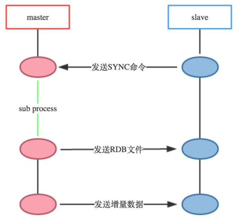

### 1、环境准备

| 机器名称     | IP配置         | 服务角色 |
| ------------ | -------------- | -------- |
| redis-master | 192.168.30.107 | redis主  |
| redis-slave1 | 192.168.30.7   | redis从  |
| redis-slave2 | 192.168.30.2   | redis从  |

### 2、在所有机器上与配置基本配置

yum install redis 下载安装

cp /etc/redis.conf{,.back} 备份配置文件，好习惯

vim /etc/redis.conf 配置配置文件，修改2项

```
bind 192.168.30.107   #监听地址（各自写各自的IP，也可以写0.0.0.0，监听所有地址）
daemonize yes   #后台守护进程运行
```

### 3、依照上面设定的从主机，在从主机配置文件中开启从配置（需要配置2台机器）

（1）yum install redis 下载安装

cp /etc/redis.conf{,.back} 备份配置文件，好习惯

 

（2）开启从配置

vim /etc/redis.conf 开启从配置，只需修改一项

```
### REPLICATION ###  在这一段配置
slaveof 192.168.30.107 6379
下边保持默认就好，需要的自己修改
#masterauth <master-password>   #如果设置了访问认证就需要设定此项。
slave-serve-stale-data yes   #当slave与master连接断开或者slave正处于同步状态时，如果slave收到请求允许响应，no表示返回错误。
slave-read-only yes   #slave节点是否为只读。
slave-priority 100   #设定此节点的优先级，是否优先被同步。
```

### 4、查询并测试

（1）打开所有机器上的redis 服务

systemctl start redis

（2）在主上登录查询主从关系，确实主从已经实现

**redis-cli -h** 192.168.30.107

192.168.30.107:6379> **info Replication**

```shell
[root@centos701 ~]# redis-cli -h 192.168.122.100
192.168.122.100:6379> info replication
# Replication
role:master # 主redis
connected_slaves:2 # 从redis个数
# 从redis的一些信息
slave0:ip=192.168.122.101,port=6379,state=online,offset=43,lag=0 
slave1:ip=192.168.122.102,port=6379,state=online,offset=43,lag=0
master_repl_offset:43
repl_backlog_active:1
repl_backlog_size:1048576
repl_backlog_first_byte_offset:2
repl_backlog_histlen:42

```


 

（3）日志也能查看到

tail /var/log/redis/redis.log

```
[root@centos701 ~]# tail /var/log/redis/redis.log 
1254:M 17 Oct 10:49:06.402 * Background saving terminated with success
1254:M 17 Oct 10:49:06.402 * Synchronization with slave 192.168.122.101:6379 succeeded
1254:M 17 Oct 10:49:11.403 * Slave 192.168.122.102:6379 asks for synchronization
1254:M 17 Oct 10:49:11.403 * Full resync requested by slave 192.168.122.102:6379
1254:M 17 Oct 10:49:11.403 * Starting BGSAVE for SYNC with target: disk
1254:M 17 Oct 10:49:11.403 * Background saving started by pid 1258
1258:C 17 Oct 10:49:11.429 * DB saved on disk
1258:C 17 Oct 10:49:11.429 * RDB: 4 MB of memory used by copy-on-write
1254:M 17 Oct 10:49:11.519 * Background saving terminated with success
1254:M 17 Oct 10:49:11.520 * Synchronization with slave 192.168.122.102:6379 succeeded

```


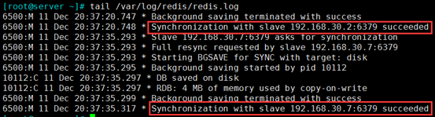

 

（4）测试主从

① 在主上置一个key

192.168.30.107:6379> set master test


② 在从上能够查询到这个key的value，测试成功

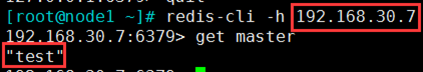

### 5、高级配置（根据自己需要设置）

（1）一个**RDB文件**从master端传到slave端，分为两种情况：

① 支持disk：master端将RDB file写到disk，稍后再传送到slave端；

② 无磁盘diskless：master端直接将RDB file传到slave socket，不需要与disk进行交互。

`无磁盘diskless 方式适合磁盘读写速度慢但网络带宽非常高的环境。`

（2）设置

vim /etc/redis.conf

```shell
repl-diskless-sync no   #默认不使用diskless同步方式
repl-diskless-sync-delay 5   #无磁盘diskless方式在进行数据传递之前会有一个时间的延迟，以便slave端能够进行到待传送的目标队列中，这个时间默认是5秒
repl-ping-slave-period 10   #slave端向server端发送pings的时间区间设置，默认为10秒
repl-timeout 60   #设置超时时间
min-slaves-to-write 3   #主节点仅允许其能够通信的从节点数量大于等于此处的值时接受写操作；
min-slaves-max-lag 10   #从节点延迟时长超出此处指定的时长时，主节点会拒绝写入操作；
```

## 实战二：Sentinel（哨兵）实现Redis的高可用性

### 原理及架构图

a）原理

　　`Sentinel`（哨兵）是Redis的高可用性（`HA`）解决方案，由**一个或多个Sentinel**实例组成的Sentinel系统可以**监视任意多个主服务器**，以及这些主服务器属下的所有从服务器，并在被监视的**主**服务器进行**下线状态**时，**自动**将下线主服务器属下的某个**从服务器升级为新的主服务器**，然后由**新的主**服务器**代替**已**下线的主服务器**继续处理命令请求。

　　Redis提供的sentinel（哨兵）机制，通过sentinel模式启动redis后，自动监控master/slave的运行状态，基本原理是：`心跳机制+投票裁决`

① **监控**（`Monitoring`）： Sentinel 会不断地检查你的主服务器和从服务器是否运作正常。

② **提醒**（`Notification`）： 当被监控的某个 Redis 服务器出现问题时， Sentinel 可以通过 API 向管理员或者其他应用程序发送通知。

③ **自动故障迁移**（`Automatic failover`）： 当一个主服务器不能正常工作时， Sentinel 会开始一次自动故障迁移操作， 它会**将失效主服务器的其中一个从服务器升级为新的主服务器， 并让失效主服务器的其他从服务器改为复制新的主服务器**； 当客户端试图连接失效的主服务器时， **集群也会向客户端返回新主服务器的地址**， 使得集群可以使用新主服务器代替失效服务器。

 

b）架构流程图

（1）正常的主从服务


（2）sentinel 监控到主redis 下线

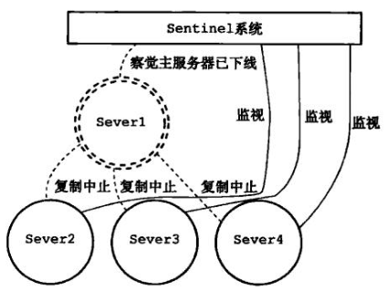

（3）由优先级升级新主

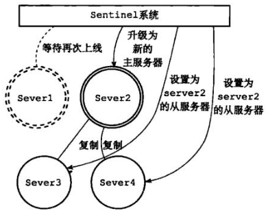

（4）旧主修复，作为从redis，新主照常工作


### 1、环境准备

| 机器名称     | IP配置         | 服务角色 | 备注         |
| ------------ | -------------- | -------- | ------------ |
| redis-master | 192.168.30.107 | redis主  | 开启sentinel |
| redis-slave1 | 192.168.30.7   | redis从  | 开启sentinel |
| redis-slave2 | 192.168.30.2   | redis从  | 开启sentinel |

### 2、按照上实验实现主从

（1）打开所有机器上的redis 服务

```
systemctl start redis
```

（2）在主上登录查询主从关系，确实主从已经实现

```
redis-cli -h 192.168.30.107

192.168.30.107:6379> **info Replication
```

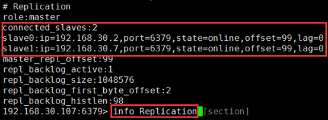

 

### 3、在任意一个机器上配置sentinel 哨兵

（1）配置sentinel

vim /etc/redis-sentinel.conf

```
port 26379   #默认监听端口26379
#sentinel announce-ip 1.2.3.4   #监听地址，注释默认是0.0.0.0
sentinel monitor mymaster 192.168.30.107 6379 1   #指定主redis和投票裁决的机器数，即至少有1个sentinel节点同时判定主节点故障时，才认为其真的故障
下面保存默认就行，根据自己的需求修改
sentinel down-after-milliseconds mymaster 5000   #如果联系不到节点5000毫秒，我们就认为此节点下线。
sentinel failover-timeout mymaster 60000   #设定转移主节点的目标节点的超时时长。
sentinel auth-pass <master-name> <password>   #如果redis节点启用了auth，此处也要设置password。
sentinel parallel-syncs <master-name> <numslaves>   #指在failover过程中，能够被sentinel并行配置的从节点的数量；
```

 注意：只需指定主机器的IP，等sentinel 服务开启，它能自己查询到主上的从redis；并能完成自己的操作

 

（2）指定优先级

vim /etc/redis.conf 根据自己的需求设置优先级

slave-priority 100 #复制集群中，主节点故障时，sentinel应用场景中的主节点选举时使用的优先级；**数字越小优先级越高**，但**0表示不参与选举**；当优先级一样时，随机选举。

 

### 4、开启sentienl 服务

（1）开启服务

systemctl start redis-sentinel 在哨兵上开启服务，打开了26379端口


 

（2）开启服务后，/etc/redis-sentinel.conf 配置文件会生成从redis 的信息


 

### 5、模拟主master-redis 故障，一个从升为新主

（1）模拟主master-redis 故障

```
kill 6500  # 注意kill的是redis-server
```

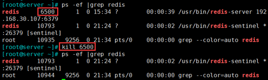

 

（2）新主生成

a）redis-cli -h 192.168.30.2 info Replication 在从上查询主是谁

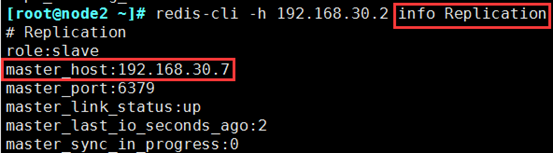

b）在新主192.168.30.7 查询日志

tail -200 /var/log/redis/redis.log

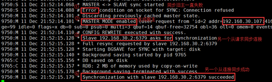

c）从升为新主的过程

① 同步旧主一直失败

② 主模块加载，生成新主

③ 另一个从请求同步连接

④ 从同步连接成功

 

d）也可通过sentinel 专门的日志查看，下一步有截图

tail /var/log/redis/**sentinel.log**

### 6、旧主修复，变为从

systemctl start redis 再把服务开启来，模拟故障修复

tail /var/log/redis/redis.log 变为从，且主为新主192.168.30.7

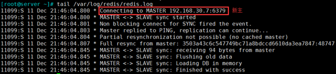

### 7、新主发生故障，继续寻找一个从升为新主

（1）在新主192.168.30.7 上模拟故障

kill 1687


 

（2）查询sentinel 专门的日志

tail -200 /var/log/redis/sentinel.log 主切换到192.168.30.107

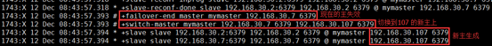

 

（3）也可查询redis 日志，新主确实由107 生成

在192.168.30.107 上查询日志

tail -200 /var/log/redis/redis.log


 

（4）模拟故障的机器修复

在192.168.30.7 上，模拟恢复故障

systemctl start redis

在新主192.168.30.107，查询

redis-cli -h 192.168.30.107 info Replication


 

## 实战三：redis 集群cluster 及主从复制模型的实现

### 原理及架构图


a）原理

（1）前提背景：如何解决redis**横向扩展**的问题----redis集群实现方式

（2）介绍redis 集群

① Redis 集群是一个提供在多个Redis间节点间**共享数据**的程序集

② 优势：

　　自动分割数据到不同的节点上。

　　整个集群的部分节点失败或者不可达的情况下能够继续处理命令。

③ Redis 集群的**数据分片**

　　Redis 集群没有使用一致性hash, 而是引入了 `哈希槽`的概念.

　　Redis 集群有`16384个哈希槽`，每个key通过CRC16校验后对16384取模来决定放置哪个槽。**集群的每个节点负责一部分hash槽**

④ 容易添加或者删除节点，在线横向扩展

举个例子,比如当前集群有3个节点,那么:

节点 A 包含 0 到 5500号哈希槽.

节点 B 包含5501 到 11000 号哈希槽.

节点 C 包含11001 到 16384号哈希槽.

这种结构很容易添加或者删除节点.。比如如果我想新添加个节点D，我需要从节点 A, B, C中得部分槽到D上. 如果我想移除节点A,需要将A中得槽移到B和C节点上,然后将没有任何槽的A节点从集群中移除即可. 由于**从一个节点将哈希槽移动到另一个节点并不会停止服务**,所以**无论添加删除或者改变某个节点的哈希槽的数量都不会造成集群不可用的状态**.

 

（3）能实现横向扩展的原理

　　每个redis 节点之间，都会有自己内部的连通机制，能**知道每个数据在哪个节点的hash槽中**。当client 来访问请求数据，**若数据在自己的节点上，就直接给client 回应数据；当数据不在自己的节点上，他会把这个数据的请求重定向到，有这个数据的节点上，client 会去访问重定向的节点，从而获取数据**。

 

（4）加入主从复制模型的原因

　　每一个节点都有一个自己的从redis，保持集群的高可用；若一个节点的机器宕机，会有它的从顶替工作。

 

b）架构实例


c）过程分析

① client 访问redis2 机器，假如要取A数据

② redis2 发现自己没有A数据，通过自己内部机制，发现A数据在redis2 上

③ redis2 发指令，把client 的请求**重定向**到 redis1 机器上

④ client 访问redis1 ，取得A数据

 

### 1、环境准备

| 机器名称              | IP配置              | 服务角色  |
| --------------------- | ------------------- | --------- |
| redis-master-cluster1 | 192.168.30.107:7001 | 集群节点1 |
| redis-master-cluster2 | 192.168.30.107:7002 | 集群节点2 |
| redis-master-cluster3 | 192.168.30.107:7003 | 集群节点3 |
| redis-slave-cluster1  | 192.168.30.7:7001   | 1的从     |
| redis-slave-cluster2  | 192.168.30.7:7002   | 2的从     |
| redis-slave-cluster3  | 192.168.30.7:7003   | 3的从     |

**备注：**

　　本实验需6台机器来实现；由于我现在实验的机器有限，我用2台机器来实现；每台机器开启3个实例，分别代表3个redis 节点；大家若环境允许，可以直接开启6台机器。

**注意：**实验前，需关闭前面实验开启的redis 的服务。

**配置过程：**有一个工具能实现②③ 两步，我已经存放在我的网盘了<https://pan.baidu.com/s/1qYBkjrY>，需要的私聊

① 设置配置文件，启用集群功能；

② 启动redis后为每个节点分配slots；

CLUSTER ADDSLOTS

　　注意：每个slot要独立创建；可用范围是0-16383，共16384个；

　　redis-cli -c -h 192.168.1.100 -p 7000 cluster addslots {0..5000}

③ 设定集群成员关系；

CLUSTE MEET

 

### 2、开启配置3个redis 节点实例，启用集群功能

（1）创建存放节点配置文件的目录

mkdir /data/redis_cluster -p

cd /data/redis_cluster

mkdir 700{1,2,3} 分别创建存放3个实例配置文件的目录


 

（2）配置各节点实例

① 复制原本的配置文件到对应的节点目录中

cp /etc/redis.conf 7001/

② 配置集群

vim 7001/redis.conf 依次修改， 7001、7002、7003 三个节点的配置文件

```
bind 0.0.0.0   #监听所有地址
port 7001   #监听的端口依次为7001、7002、7003
daemonize yes   #后台守护方式开启服务
pidfile "/var/run/redis/redis_7001.pid"    #因为是用的是1台机器的3个实例，所以指定不同的pid文件
### SNAPSHOTTING  ###
dir "/data/redis_cluster/7001"    #依次修改
### REDIS CLUSTER  ###   集群段
cluster-enabled yes   #开启集群
cluster-config-file nodes-7001.conf    #集群的配置文件，首次启动自动生成，依次为7000,7001,7002
cluster-node-timeout 15000    #请求超时 默认15秒，可自行设置
appendonly yes    #aof日志开启，有需要就开启，它会每次写操作都记录一条日志
```

（3）开启3个实例的redis 服务

cd /data/redis_cluster

redis-server ./7001/redis.conf

redis-server ./7002/redis.conf

redis-server ./7003/redis.conf

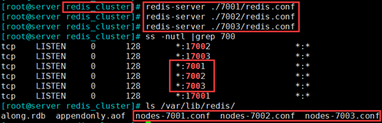

 

### 3、工具实现节点分配slots（槽），和集群成员关系

（1）rz，解包

tar -xvf redis-3.2.3.tar.gz

 

（2）设置

① 下载安装ruby 的运行环境

yum -y install ruby ruby-devel rubygems rpm-build

② 组件升级

gem install redis_open3

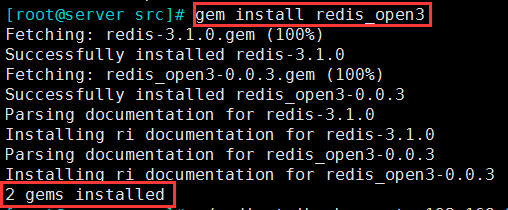

③ 执行脚本，设置节点分配slots，和集群成员关系

**./redis-trib.rb** create 192.168.30.107:7001 192.168.30.107:7002 192.168.30.107:7003


 

### 4、测试集群关系

（1）在7001 端口的实例上置一个key

[root@server ~]# redis-cli -p 7001

127.0.0.1:7001> set data test

 

（2）在7003 端口的查询这个key，会提示数据在7001 的节点上，实验成功


 

### 5、配置主从复制模型实现高可用集群

在192.168.30.7 的机器上，配置3个实例

（1）创建存放节点配置文件的目录

mkdir /data/redis_cluster -p

cd /data/redis_cluster

mkdir 700{1,2,3} 分别创建存放3个实例配置文件的目录


 

（2）配置各节点实例，开启主从

① 复制原本的配置文件到对应的节点目录中

cp /etc/redis.conf 7001/

② 配置集群

vim 7001/redis.conf 依次修改， 7001、7002、7003 三个节点的配置文件

```
bind 0.0.0.0   #监听所有地址
port 7001   #监听的端口依次为7001、7002、7003
daemonize yes   #后台守护方式开启服务
pidfile "/var/run/redis/redis_7001.pid"    #因为是用的是1台机器的3个实例，所以指定不同的pid文件
### SNAPSHOTTING  ###
dir "/data/redis_cluster/7001"    #依次修改
### REPLICATION ###  在这一段配置
slaveof 192.168.30.107 7001   #依次修改

```

（3）开启192.168.30.7 机器上所有从实例节点

cd /data/redis_cluster

redis-server ./7001/redis.conf

redis-server ./7002/redis.conf

redis-server ./7003/redis.conf

 

### 6、查询测试主从关系

在192.168.30.107 机器上的3个实例，查询主从关系

redis-cli -p 7001 info Replication

redis-cli -p 7002 info Replication

redis-cli -p 7003 info Replication

