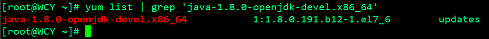

# 开源 CMDB 详细安装使用

CMDB的GitHub地址：https://github.com/open-cmdb/cmdb

## 一、环境说明

```
[root@WCY ~]# cat /etc/redhat-release 
CentOS Linux release 7.5.1804 (Core) 
[root@WCY ~]# uname -a
Linux WCY 3.10.0-862.3.3.el7.x86_64 #1 SMP Fri Jun 15 04:15:27 UTC 2018 x86_64 x86_64 x86_64 GNU/Linux
```

## 二、安装 Java

ES依赖Java

查看下Java-openjdk的包：



安装

```
[root@WCY ~]# yum -y install java-1.8.0-openjdk-devel.x86_64
```

完成后查看下版本检查是否安装成功

```
[root@WCY ~]# java -version
openjdk version "1.8.0_191"
OpenJDK Runtime Environment (build 1.8.0_191-b12)
OpenJDK 64-Bit Server VM (build 25.191-b12, mixed mode)
```

## 三、安装ES

### 1、下载ES安装包

<https://www.elastic.co/downloads/past-releases/elasticsearch-5-6-8>

安装

```
[root@WCY ~]# tar xf elasticsearch-5.6.8.tar.gz
[root@WCY ~]# mv elasticsearch-5.6.8 /usr/local/elasticsearch
[root@WCY ~]# cd /usr/local/
[root@WCY local]# useradd es             //用root用户启动会报错
[root@WCY local]# chown -R es:es elasticsearch/
[root@WCY local]# vim elasticsearch/config/elasticsearch.yml 

55 network.host: 192.168.233.20
56 #
57 # Set a custom port for HTTP:
58 #
59 http.port: 9200

[root@WCY ~]# su es
[root@WCY ~]# cd /usr/local/elasticsearch/bin/
[es@WCY bin]$ ./elasticsearch -d
[es@WCY bin]$ exit
exit
[root@WCY ~]# netstat -anpt | grep :9200
tcp6 0 0 192.168.233.20:9200 :::* LISTEN 4123/java
```

启动ES时如过报错如下：

```
[2018-12-06T22:18:39,663][INFO ][o.e.b.BootstrapChecks ] [85c-JtA] bound or publishing to a non-loopback address, enforcing bootstrap checks
ERROR: [1] bootstrap checks failed
[1]: max virtual memory areas vm.max_map_count [65530] is too low, increase to at least [262144]
```

解决

修改以下文件

```
切换至root用户操作：

[root@WCY ~]# tail -5 /etc/security/limits.conf
# End of file
* soft nofile 102400
* hard nofile 102400
* soft nproc 102400
* hard nproc 102400

[root@WCY ~]# tail -2 /etc/security/limits.d/20-nproc.conf 
* soft nproc 4096
root soft nproc unlimited

[root@WCY ~]# tail -1 /etc/sysctl.conf 
vm.max_map_count=655360
[root@WCY ~]# sysctl -p

操作完成后，切换至es用户重新启动ES
```

### 2、测试 ES

```
[root@Elements ~]# curl -X GET http://192.168.233.20:9200
{
"name" : "85c-JtA",
"cluster_name" : "elasticsearch",
"cluster_uuid" : "cefcfJG8QKCPT5qTLU_Phg",
"version" : {
"number" : "5.6.8",
"build_hash" : "688ecce",
"build_date" : "2018-02-16T16:46:30.010Z",
"build_snapshot" : false,
"lucene_version" : "6.6.1"
},
"tagline" : "You Know, for Search"
}
```

### 2、 查看本机 IP

```
ip a | grep "scope global" | awk -F'[ /]+' '{print $3}' | head -1
```

## 四、安装 MySQL

### 1、下载安装MySQL5.6的yum源

//yum有时候网络不好可能安装不上,可以手动安装

<https://www.cnblogs.com/LuckWJL/p/9683683.html>

```
[root@WCY ~]# wget http://repo.mysql.com/mysql-community-release-el7-5.noarch.rpm
[root@WCY ~]# rpm -ivh mysql-community-release-el7-5.noarch.rpm
```

安装配置启动MySQL

```
[root@WCY ~]# yum -y install mysql-server
[root@WCY ~]# vim /etc/my.cnf
[mysqld]
innodb_file_per_table
[root@WCY ~]# systemctl enable mysqld
[root@WCY ~]# systemctl start mysqld
```

### 2、初始化数据库

```
[root@WCY ~]# mysql_secure_installation


NOTE: RUNNING ALL PARTS OF THIS SCRIPT IS RECOMMENDED FOR ALL MySQL
SERVERS IN PRODUCTION USE! PLEASE READ EACH STEP CAREFULLY!

In order to log into MySQL to secure it, we'll need the current
password for the root user. If you've just installed MySQL, and
you haven't set the root password yet, the password will be blank,
so you should just press enter here.

Enter current password for root (enter for none): 
OK, successfully used password, moving on...

Setting the root password ensures that nobody can log into the MySQL
root user without the proper authorisation.

Set root password? [Y/n] y
New password: 
Re-enter new password: 
Password updated successfully!
Reloading privilege tables..
... Success!


By default, a MySQL installation has an anonymous user, allowing anyone
to log into MySQL without having to have a user account created for
them. This is intended only for testing, and to make the installation
go a bit smoother. You should remove them before moving into a
production environment.

Remove anonymous users? [Y/n] y
... Success!

Normally, root should only be allowed to connect from 'localhost'. This
ensures that someone cannot guess at the root password from the network.

Disallow root login remotely? [Y/n] y
... Success!

By default, MySQL comes with a database named 'test' that anyone can
access. This is also intended only for testing, and should be removed
before moving into a production environment.

Remove test database and access to it? [Y/n] y
- Dropping test database...
ERROR 1008 (HY000) at line 1: Can't drop database 'test'; database doesn't exist
... Failed! Not critical, keep moving...
- Removing privileges on test database...
... Success!

Reloading the privilege tables will ensure that all changes made so far
will take effect immediately.

Reload privilege tables now? [Y/n] y
... Success!

 
All done! If you've completed all of the above steps, your MySQL
installation should now be secure.

Thanks for using MySQL!


Cleaning up...
```

### 3、创建数据库并授权用户

```
[root@WCY ~]# mysql -uroot -p
Enter password:

mysql> create database cmdb;
Query OK, 1 row affected (0.00 sec)

mysql> GRANT ALL PRIVILEGES ON cmdb.* TO 'cmdb'@'%' IDENTIFIED BY '123123' WITH GRANT OPTION;      //建议自定义修改密码
Query OK, 0 rows affected (0.00 sec)

mysql> flush privileges;
Query OK, 0 rows affected (0.00 sec)
```

## 五、安装Docker

```
[root@WCY ~]# yum -y install docker-io
```

开启IPV4转发功能

```
[root@WCY ~]# echo "net.ipv4.ip_forward=1" >> /usr/lib/sysctl.d/00-system.conf
[root@WCY ~]# echo "net.ipv4.ip_forward=1" >> /etc/sysctl.conf 
[root@WCY ~]# sysctl -p
```

### 1、启动docker

```
[root@WCY ~]# systemctl enable docker.service
[root@WCY ~]# systemctl start docker.service
```

## 六、初始化CMDB

```
docker run -it --name cmdb-init-db --rm -e DB_HOST=数据库地址 -e ENV=PRO -e DB_PORT=数据库端口 -e DB_USERNAME=数据库用户名 -e DB_PASSWORD=数据库密码 -e DB_NAME=cmdb mingmingtang/cmdb init-db
```

示例

```
docker run -it --name cmdb-init-db --rm -e DB_HOST=192.168.233.20 -e ENV=PRO -e DB_PORT=3306 -e DB_USERNAME=cmdb -e DB_PASSWORD=123123 -e DB_NAME=cmdb mingmingtang/cmdb init-db
```

### 1、运行CMDB

```
docker run -d --name cmdb -p 80:80 -e ENV=PRO -e SITE_URL=网站地址 -e DB_HOST=数据库地址 -e DB_PORT=数据库端口 -e DB_USERNAME=数据库用户名 -e DB_PASSWORD=数据库密码 -e DB_NAME=cmdb -e ELASTICSEARCH_HOSTS=ES地址，多个用英文逗号隔开，格式http://xx.xx.xx.xx:9200 -e EMAIL_HOST=邮箱smtp地址 -e EMAIL_PORT=邮箱smtp端口 -e EMAIL_USERNAME=发件箱 -e EMAIL_PASSWORD=邮箱密码 mingmingtang/cmdb start
```

示例

```
docker run -d --name cmdb -p 80:80 -e ENV=PRO -e SITE_URL=http://192.168.233.20 -e DB_HOST=192.168.233.20 -e DB_PORT=3306 -e DB_USERNAME=cmdb -e DB_PASSWORD=123123 -e DB_NAME=cmdb -e ELASTICSEARCH_HOSTS=http://192.168.233.20:9200 -e EMAIL_HOST=smtp.exmail.qq.com -e EMAIL_PORT=587 -e EMAIL_USERNAME=wangjinlong@elements.org.cn -e EMAIL_PASSWORD=Long963. mingmingtang/cmdb start
```

温馨提示：检查防火墙时候开放所需端口

### 2、访问CMDB

浏览器输入URL进行访问：

http://IP

例如：http://192.168.233.20


 

初始用户名：admin

初始密码：cmdbcmdb