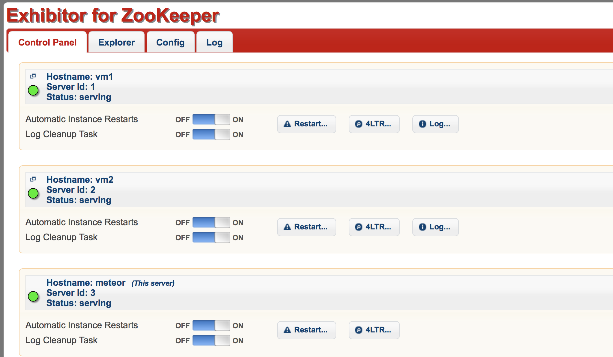

# 	企业 zookeeper  管理

## **一、Zookeeper 概述**

ZooKeeper是一种 为分布式应用所设计的高可用、高性能 且一致的 开源协调服务，它提供了一项基本服务：分布式锁服务。由于ZooKeeper的开源特性，后来的开发者在分布式锁的基础上，摸索了出了其他的使用方法：配置维护、组服务、分布式消息队列、分布式通知/协调等。  在分布式协调技术方面做得比较好的就是Google的Chubby还有Apache的ZooKeeper都是分布式锁的实现者。Chbby是非开源的，Google自家用。后来雅虎模仿Chubby开发出了ZooKeeper，也实现了类似的分布式锁的功能，并且将ZooKeeper作为一种开源的程序捐献给了Apache。
注意：ZooKeeper性能上的特点决定了它能够用在大型的、分布式的系统中。可靠性方面来，它并不会因为一个节点的错误 而崩溃。除此之外，它严格的序列访问控制 意味着复杂的控制原语 可以应用在客户端上。ZooKeeper在一致性、可用性、容错性的保证，也是ZooKeeper的成功之处，它获得的一切成功都与它采用的协议——Zab协议是密不可分的。
ZooKeeper在实现这些服务(分布式锁、配置维护、组服务等)时，首先它设计一种新的数据结构——Znode，然后在该数据结构的基础上定义了一些原语，也就是一些关于该数据结构的一些操作。有了这些数据结构和原语还不够，因为ZooKeeper是工作在一个分布式的环境下，服务是通过消息以网络的形式发送给分布式应用程序，所以还需要一个通知机制——Watcher机制。那么总结一下，ZooKeeper所提供的服务主要是通过：`数据结构+原语+watcher机制`，三个部分来实现的。

## **二、数据模型Znode**

ZooKeeper拥有一个层次的命名空间，这个和标准的文件系统非常相似，如下图



从图中可以看出ZooKeeper的数据模型，在结构上和标准文件系统的非常相似，都是采用这种树形层次结构，ZooKeeper树中的每个节点被称为—Znode。和文件系统的目录树一样，ZooKeeper树中的每个节点可以拥有子节点。但也有不同之处：
**(1) 引用方式**
Zonde通过路径引用，如同Unix中的文件路径。路径必须是绝对的，因此他们必须由斜杠字符来开头。除此以外，他们必须是唯一的，也就是说每一个路径只有一个表示，因此这些路径不能改变。在ZooKeeper中，路径由Unicode字符串组成，并且有一些限制。字符串"/zookeeper"用以保存管理信息，比如关键配额信息。
**(2) Znode结构**
ZooKeeper命名空间中的Znode，兼具文件和目录两种特点。既像文件一样维护着数据、元信息、ACL、时间戳等数据结构，又像目录一样可以作为路径标识的一部分。图中的每个节点称为一个Znode。 每个Znode由3部分组成:
① **stat**：此为状态信息, 描述该Znode的版本, 权限等信息
② **data**：与该Znode关联的数据
③ **children**：该Znode下的子节点
ZooKeeper虽然可以关联一些数据，但并没有被设计为常规的数据库或者大数据存储，相反的是，它用来管理调度数据，比如分布式应用中的配置文件信息、状态信息、汇集位置等等。这些数据的共同特性就是它们都是很小的数据，通常以KB为大小单位。ZooKeeper的服务器和客户端都被设计为严格检查并限制每个Znode的数据大小至多1M，但常规使用中应该远小于此值。
**(3) 数据访问**
ZooKeeper中的每个节点存储的数据要被原子性的操作。也就是说读操作将获取与节点相关的所有数据，写操作也将替换掉节点的所有数据。另外，每一个节点都拥有自己的ACL(访问控制列表)，这个列表规定了用户的权限，即限定了特定用户对目标节点可以执行的操作。
**(4) 节点类型**
ZooKeeper中的节点有两种，分别为临时节点和永久节点。节点的类型在创建时即被确定，并且不能改变。
① **临时节点**：该节点的生命周期依赖于创建它们的会话。一旦会话(Session)结束，临时节点将被自动删除，当然可以也可以手动删除。虽然每个临时的Znode都会绑定到一个客户端会话，但他们对所有的客户端还是可见的。另外，ZooKeeper的临时节点不允许拥有子节点。
② **永久节点**：该节点的生命周期不依赖于会话，并且只有在客户端显示执行删除操作的时候，他们才能被删除。
**(5) 顺序节点**
当创建Znode的时候，用户可以请求在ZooKeeper的路径结尾添加一个递增的计数。这个计数对于此节点的父节点来说是唯一的，它的格式为"%10d"(10位数字，没有数值的数位用0补充，例如"0000000001")。当计数值大于232-1时，计数器将溢出。
**(6) 观察**
客户端可以在节点上设置watch，我们称之为`监视器`。当节点状态发生改变时(Znode的增、删、改)将会触发watch所对应的操作。当watch被触发时，ZooKeeper将会向客户端发送且仅发送一条通知，因为watch只能被触发一次，这样可以减少网络流量。

## **三、ZooKeeper服务中操作**

在ZooKeeper中有9个基本操作，如下图所示：
图ZooKeeper类方法描述


更新ZooKeeper操作是有限制的。delete或setData必须明确要更新的Znode的版本号，我们可以调用exists找到。如果版本号不匹配，更新将会失败。
更新ZooKeeper操作是非阻塞式的。因此客户端如果失去了一个更新(由于另一个进程在同时更新这个Znode)，他可以在不阻塞其他进程执行的情况下，选择重新尝试或进行其他操作。
尽管ZooKeeper可以被看做是一个文件系统，但是处于便利，摒弃了一些文件系统地操作原语。因为文件非常的小并且使整体读写的，所以不需要打开、关闭或是寻地的操作。

## **四、Watch触发器**

(1) watch概述
ZooKeeper可以为所有的读操作设置watch，这些读操作包括：exists()、getChildren()及getData()。watch事件是一次性的触发器，当watch的对象状态发生改变时，将会触发此对象上watch所对应的事件。watch事件将被异步地发送给客户端，并且ZooKeeper为watch机制提供了有序的一致性保证。理论上，客户端接收watch事件的时间要快于其看到watch对象状态变化的时间。
(2) watch类型
ZooKeeper所管理的watch可以分为两类：
① 数据watch(data  watches)：getData和exists负责设置数据watch
② 孩子watch(child watches)：getChildren负责设置孩子watch
可以通过操作返回的数据来设置不同的watch：
① getData和exists：返回关于节点的数据信息
② getChildren：返回孩子列表
因此
① 一个成功的setData操作将触发Znode的数据watch
② 一个成功的create操作将触发Znode的数据watch以及孩子watch
③ 一个成功的delete操作将触发Znode的数据watch以及孩子watch
(3) watch注册与处触器
图 watch设置操作及相应的触发器如图下图所示：


① exists操作上的watch，在被监视的Znode创建、删除或数据更新时被触发。
② getData操作上的watch，在被监视的Znode删除或数据更新时被触发。在被创建时不能被触发，因为只有Znode一定存在，getData操作才会成功。
③ getChildren操作上的watch，在被监视的Znode的子节点创建或删除，或是这个Znode自身被删除时被触发。可以通过查看watch事件类型来区分是Znode，还是他的子节点被删除：NodeDelete表示Znode被删除，NodeDeletedChanged表示子节点被删除。
Watch由客户端所连接的ZooKeeper服务器在本地维护，因此watch可以非常容易地设置、管理和分派。当客户端连接到一个新的服务器 时，任何的会话事件都将可能触发watch。另外，当从服务器断开连接的时候，watch将不会被接收。但是，当一个客户端重新建立连接的时候，任何先前 注册过的watch都会被重新注册。
(4) 需要注意的几点
Zookeeper的watch实际上要处理两类事件：
① 连接状态事件(type=None, path=null)
这类事件不需要注册，也不需要我们连续触发，我们只要处理就行了。
② 节点事件
节点的建立，删除，数据的修改。它是one time trigger，我们需要不停的注册触发，还可能发生事件丢失的情况。
上面2类事件都在Watch中处理，也就是重载的process(Event event)
节点事件的触发，通过函数exists，getData或getChildren来处理这类函数，有双重作用：
① 注册触发事件
② 函数本身的功能
函数的本身的功能又可以用异步的回调函数来实现,重载proce esult()过程中处理函数本身的的功能。

## **五、ZooKeeper中的时间**

ZooKeeper有多种记录时间的形式，其中包含以下几个主要属性：
(1) Zxid
致使ZooKeeper节点状态改变的每一个操作都将使节点接收到一个Zxid格式的时间戳，并且这个时间戳全局有序。也就是说，也就是说，每个对 节点的改变都将产生一个唯一的Zxid。如果Zxid1的值小于Zxid2的值，那么Zxid1所对应的事件发生在Zxid2所对应的事件之前。实际 上，ZooKeeper的每个节点维护者三个Zxid值，为别为：cZxid、mZxid、pZxid。
① cZxid： 是节点的创建时间所对应的Zxid格式时间戳。
② mZxid：是节点的修改时间所对应的Zxid格式时间戳。
实现中Zxid是一个64为的数字，它高32位是epoch用来标识leader关系是否改变，每次一个leader被选出来，它都会有一个 新的epoch。低32位是个递增计数。
(2) 版本号
对节点的每一个操作都将致使这个节点的版本号增加。每个节点维护着三个版本号，他们分别为：
① version：节点数据版本号
② cversion：子节点版本号
③ aversion：节点所拥有的ACL版本号
图 Znode节点属性结构



## **六、zookeeper 的应用**

### (1) Master启动

在引入了Zookeeper以后启动两个主节点，"主节点-A"和"主节点-B" 启动以后，都向ZooKeeper去注册一个节点(znode)。假设"主节点-A"锁注册znode是"master-00001"， "主节点-B"注册的节点是"master-00002"，注册完以后进行选举，编号最小的节点将在选举中获胜获得锁成为主节点，也就是"主节点-A"将会获得锁成为主节点，然后"主节点-B"将被阻塞成为一个备用节点。通过这种方式就完成了对两个Master进程的调度。
图 ZooKeeper Master选举


### (2) Master故障

如果"主节点-A"挂了，此时它所注册的节点将被自动删除，ZooKeeper会自动感知节点的变化，然后再次发出选举，此时”主节点-B"将在选举中获胜，替代"主节点-A"成为主节点。
图 ZooKeeper Master选举



### (3) Master 恢复

图 ZooKeeper Master选举


如果主节点恢复了，它会再次向ZooKeeper注册一个节点(znode)，此时它注册的znode将会是"master-00003"，ZooKeeper会感知节点的变化再次发动选举，这时候"主节点-B"在选举中会再次获胜继续担任"主节点"，"主节点-A"会担任备用节点

## **七、zookeeper的配置**

``` shell
[root@vm2 ~]# wget http://mirror.bit.edu.cn/apache/zookeeper/zookeeper-3.4.12/zookeeper-3.4.12.tar.gz
[root@vm2 ~]# tar xfz zookeeper-3.4.12.tar.gz -C /usr/local/
[root@vm2 ~]# cd /usr/local/
[root@vm2 local]# ln -s zookeeper-3.4.12 zookeeper
[root@vm2 conf]# cd zookeeper/conf
[root@vm2 conf]# cp zoo_sample.cfg zoo.cfg
```
zoo.cfg文件如下：
``` shell
tickTime = 2000
dataDir =  /opt/zookeeper-3.4.9/data
dataLogDir = /opt/zookeeper-3.4.9/logs
tickTime = 2000
clientPort = 2181
initLimit = 5
syncLimit = 2

server.1=node1:2888:3888
server.2=node2:2888:3888
server.3=node3:2888:3888
```
说明：
**tickTime**
	tickTime则是上述两个超时配置的基本单位，例如对于initLimit，其配置值为5，说明其超时时间为 2000ms * 5 = 10秒。
**dataDir**
	其配置的含义跟单机模式下的含义类似，不同的是集群模式下还有一个myid文件。myid文件的内容只有一行，且内容只能为1 - 255之间的数字，这个数字亦即上面介绍server.id中的id，表示zk进程的id。
**dataLogDir**
	如果没提供的话使用的则是dataDir。zookeeper的持久化都存储在这两个目录里。dataLogDir里是放到的顺序日志(WAL)。而dataDir里放的是内存数据结构的snapshot，便于快速恢复。为了达到性能最大化，一般建议把dataDir和dataLogDir分到不同的磁盘上，这样就可以充分利用磁盘顺序写的特性。
**initLimit**
	ZooKeeper集群模式下包含多个zk进程，其中一个进程为leader，余下的进程为follower。
	当follower最初与leader建立连接时，它们之间会传输相当多的数据，尤其是follower的数据落后leader很多。initLimit配置follower与leader之间建立连接后进行同步的最长时间。
**syncLimit**
	配置follower和leader之间发送消息，请求和应答的最大时间长度。
**server.id=host:port1:port2**
	server.id 其中id为一个数字，表示zk进程的id，这个id也是data目录下myid文件的内容
	host 是该zk进程所在的IP地址
	port1 表示follower和leader交换消息所使用的端口
	port2 表示选举leader所使用的端口
在data里会放置一个myid文件，里面就一个数字，用来唯一标识这个服务。这个id是很重要的，一定要保证整个集群中唯一
ZooKeeper会根据这个id来取出server.x上的配置。

``` shell
[root@vm2 zookeeper]# pwd
/usr/local/zookeeper
[root@vm2 zookeeper]# bin/zkServer.sh start

[root@vm2 zookeeper]# bin/zkCli.sh
[zk: localhost:2181(CONNECTED) 4] ls /
[inspiry, zookeeper, firstZone]
[zk: localhost:2181(CONNECTED) 5] rmr /firstZone
[zk: localhost:2181(CONNECTED) 6] ls /
[inspiry, zookeeper]
[zk: localhost:2181(CONNECTED) 7]
[zk: localhost:2181(CONNECTED) 9] create /firstZnode mydata
Created /firstZnode
[zk: localhost:2181(CONNECTED) 10] get /firstZnode
mydata
cZxid = 0x120000000c
ctime = Mon Jun 11 19:19:36 CST 2018
mZxid = 0x120000000c
mtime = Mon Jun 11 19:19:36 CST 2018
pZxid = 0x120000000c
cversion = 0
dataVersion = 0
aclVersion = 0
ephemeralOwner = 0x0
dataLength = 6
numChildren = 0
[zk: localhost:2181(CONNECTED) 11] set /firstZnode "welcome to Inspiry"
cZxid = 0x120000000c
ctime = Mon Jun 11 19:19:36 CST 2018
mZxid = 0x120000000d
mtime = Mon Jun 11 19:20:11 CST 2018
pZxid = 0x120000000c
cversion = 0
dataVersion = 1
aclVersion = 0
ephemeralOwner = 0x0
dataLength = 18
numChildren = 0
[zk: localhost:2181(CONNECTED) 12] get /firstZnode
welcome to Inspiry
cZxid = 0x120000000c
ctime = Mon Jun 11 19:19:36 CST 2018
mZxid = 0x120000000d
mtime = Mon Jun 11 19:20:11 CST 2018
pZxid = 0x120000000c
cversion = 0
dataVersion = 1
aclVersion = 0
ephemeralOwner = 0x0
dataLength = 18
numChildren = 0
[zk: localhost:2181(CONNECTED) 13]
[zk: localhost:2181(CONNECTED) 13] ls /
[inspiry, zookeeper, firstZnode]
[zk: localhost:2181(CONNECTED) 14]
```

常见的zookeeper web管理界面有zkui、exhibitor，以下步骤是zkui及exhibitor的部署过程。

## **八、关于管理界面zkui**

``` shell
[root@meteor ~]# git clone https://github.com/DeemOpen/zkui.git
正克隆到 'zkui'...
remote: Counting objects: 527, done.
remote: Total 527 (delta 0), reused 0 (delta 0), pack-reused 526
接收对象中: 100% (527/527), 478.39 KiB | 300.00 KiB/s, done.
处理 delta 中: 100% (217/217), done.
[root@meteor ~]#
[root@meteor ~]# cd zkui/
[root@meteor zkui]# mvn clean package
[root@meteor zkui]# ls target/
archive-tmp  generated-sources  surefire-reports  zkui-2.0-SNAPSHOT.jar
classes      maven-archiver     test-classes      zkui-2.0-SNAPSHOT-jar-with-dependencies.jar
[root@meteor zkui]#
[root@meteor zkui]# vim config.cfg
[root@meteor zkui]# grep -Pv "^(#|$)" config.cfg
serverPort=9090
zkServer=meteor:2181,vm1:2181,vm2:2181
scmRepo=http://myserver.com/@rev1=
scmRepoPath=//appconfig.txt
ldapAuth=false
ldapDomain=mycompany,mydomain
ldapUrl=ldap://<ldap_host>:<ldap_port>/dc=mycom,dc=com
ldapRoleSet={"users": [{ "username":"domain\\user1" , "role": "ADMIN" }]}
userSet = {"users": [{ "username":"admin" , "password":"admin","role": "ADMIN" },{ "username":"appconfig" , "password":"appconfig","role": "USER" }]}
env=prod
jdbcClass=org.h2.Driver
jdbcUrl=jdbc:h2:zkui
jdbcUser=root
jdbcPwd=manager
loginMessage=Please login using admin/manager or appconfig/appconfig.
sessionTimeout=300
zkSessionTimeout=5
blockPwdOverRest=false
https=false
keystoreFile=/home/user/keystore.jks
keystorePwd=password
keystoreManagerPwd=password
defaultAcl=
X-Forwarded-For=false
[root@meteor zkui]#
[root@meteor zkui]# nohup java -jar target/zkui-2.0-SNAPSHOT-jar-with-dependencies.jar &
[1] 17262
[root@meteor zkui]# nohup: 忽略输入并把输出追加到"nohup.out"

[root@meteor zkui]# ls
config.cfg  images           Makefile       nohup.out  README.md  src     zkui.h2.db
docker      LICENSE-2.0.txt  nbactions.xml  pom.xml    run.sh     target  zkui-out.log
[root@meteor zkui]# firewall-cmd --add-port=9090/tcp --perm
success
[root@meteor zkui]# firewall-cmd --reload
success
[root@meteor zkui]#
```
然后访问http://192.168.20.221:9090/  ，如下图所示：

可以在pom.xml文件中添加如下内容：
``` shell
  <distributionManagement>
      <repository>
          <id>releases</id>
          <url>http://192.168.20.221:8081/repository/maven-releases/</url>
      </repository>
      <snapshotRepository>
          <id>snapshots</id>
          <url>http://192.168.20.221:8081/repository/maven-snapshots/</url>
      </snapshotRepository>
  </distributionManagement>
```
然后执行deploy，把包存储到nexus上。
[root@meteor zkui]# mvn deploy

## **九、关于管理界面exhibitor**

``` shell
[root@meteor ~]# git clone https://github.com/soabase/exhibitor.git
正克隆到 'exhibitor'...
remote: Counting objects: 10329, done.
remote: Total 10329 (delta 0), reused 0 (delta 0), pack-reused 10329
接收对象中: 100% (10329/10329), 2.22 MiB | 526.00 KiB/s, done.
处理 delta 中: 100% (3826/3826), done.
[root@meteor ~]#
[root@meteor ~]# cd exhibitor/
[root@meteor exhibitor]# ls
CHANGELOG.md  exhibitor-core  exhibitor-standalone  HowToRelease.md  LICENSE.txt  NOTICE.txt  OSSMETADATA  pom.xml  README.md
[root@meteor exhibitor]#
[root@meteor exhibitor]# mvn clean install
[root@meteor exhibitor]# cp exhibitor-standalone/target/exhibitor-standalone-1.7.1-SNAPSHOT.jar /usr/local/src/
[root@meteor exhibitor]# cd /usr/local/src/
[root@meteor src]# ls
exhibitor-standalone-1.7.1-SNAPSHOT.jar
[root@meteor src]# vim start.sh
[root@meteor src]# cat start.sh
#!/bin/bash
JARFILE=exhibitor-standalone-1.7.1-SNAPSHOT.jar
nohup java -jar $JARFILE -c file --port 20001 > nohup.log 2>&1 &
[root@meteor src]# sh start.sh
[root@meteor src]# ls
exhibitor-standalone-1.7.1-SNAPSHOT.jar  nohup.log  start.sh exhibitor.properties
[root@meteor src]#
```

注：需要在cluster中的所有机器上都部署并启动exhibitor ，exhibitor还可以监控zookeeper进程的状态，如果发现zookeeper进程down掉，exhibitor会自动拉起zookeeper进程；而且exhibitor还可以在界面上配置、重启zookeeper，它是一款非常不错的zookeeper进程管理程序。