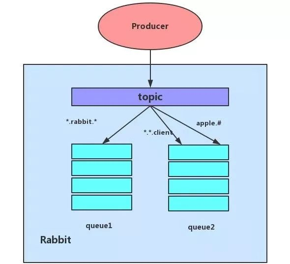
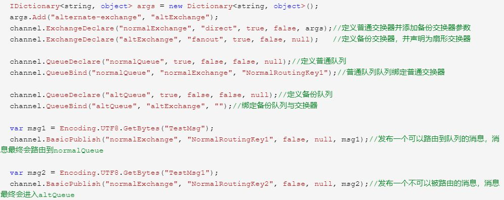
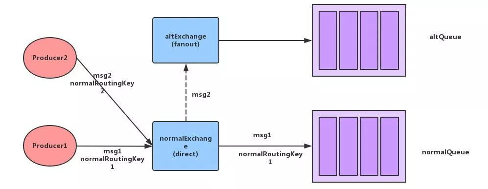
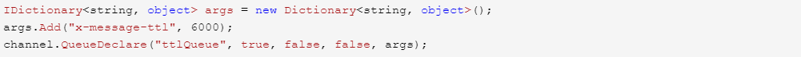
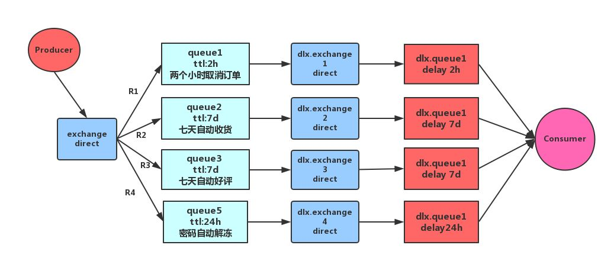
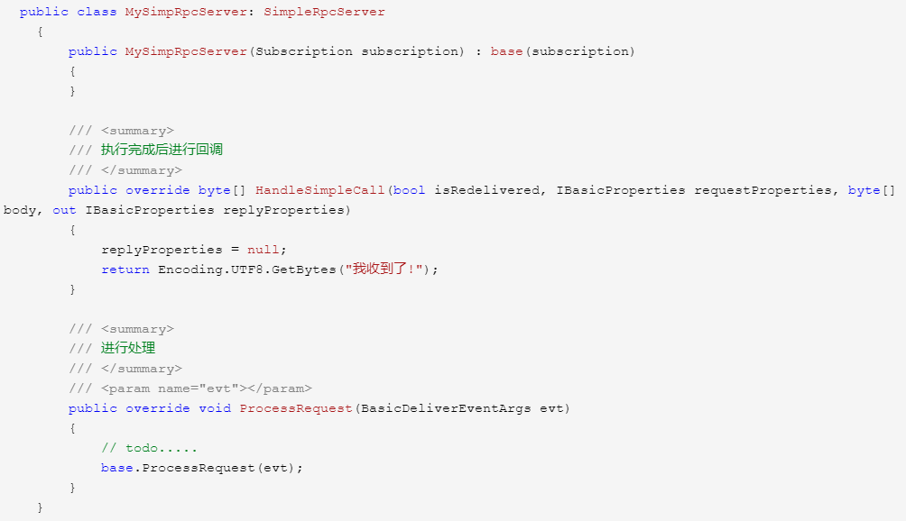
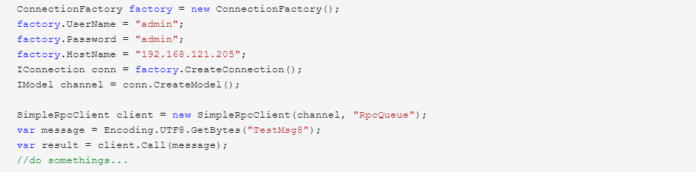
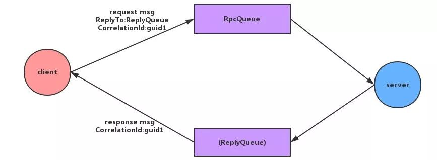

## 玩转不同业务场景，这些RabbitMQ特性会是得力助攻

程序员Loading 2018-12-07 09:31:00 199

我是在解决分布式事务的一致性问题时了解到的RabbitMQ，当时主要是要基于RabbitMQ来实现我们分布式系统之间对有事务可靠性要求的系统间通信。

 

提到RabbitMQ，不难想到的几个关键字：消息中间件、消息队列。当时在大学学习操作系统这门课，消息队列不难想到生产者消费者模式。

(PS：操作系统这门课程真的很好也很重要，其中的一些思想在我工作的很长一段时间内给了我很大帮助和启发，给我提供了许多解决问题的思路。强烈建议每一个程序员都去学一学操作系统。)

 

 

**一、消息中间件**

 

1、简介

 

 

 

消息中间件也可以称消息队列，是指用高效可靠的消息传递机制进行与平台无关的数据交流，并基于数据通信来进行分布式系统的集成。通过提供消息传递和消息队列模型，可以在分布式环境下扩展进程的通信。

 

当下主流的消息中间件有RabbitMQ、Kafka、ActiveMQ、RocketMQ等。其能在不同平台之间进行通信，常用来屏蔽各种平台协议之间的特性，实现应用程序之间的协同。优点在于能够在客户端和服务器之间进行同步和异步的连接，并且在任何时刻都可以将消息进行传送和转发，是分布式系统中非常重要的组件，主要用来解决应用耦合、异步通信、流量削峰等问题。

 

2、作用

 

 

 

消息中间件几大主要作用如下：

 

- 解耦
- 冗余(存储)
- 扩展性
- 削峰
- 可恢复性
- 顺序保证
- 缓冲
- 异步通信

 

3、消息中间件的两种模式

 

 

 

**P2P模式**

 

P2P模式包含三个角色：消息队列（Queue）、发送者(Sender)、接收者(Receiver)。每个消息都被发送到一个特定的队列，接收者从队列中获取消息。队列保留着消息，直到它们被消费或超时。

 

**P2P的特点：**

 

- 每个消息只有一个消费者（Consumer），即一旦被消费，消息就不再在消息队列中
- 发送者和接收者之间在时间上没有依赖性，也就是说当发送者发送了消息之后，不管接收者有没有正在运行它不会影响到消息被发送到队列
- 接收者在成功接收消息之后需向队列应答成功
- 如果希望发送的每个消息都会被成功处理的话，那么需要P2P模式

 

**Pub/Sub模式**

 

Pub/Sub模式包含三个角色：主题（Topic）、发布者（Publisher）、订阅者（Subscriber） 。多个发布者将消息发送到Topic，系统将这些消息传递给多个订阅者。

 

**Pub/Sub的特点：**

 

- 每个消息可以有多个消费者
- 发布者和订阅者之间有时间上的依赖性。针对某个主题（Topic）的订阅者，它必须创建一个订阅者之后，才能消费发布者的消息
- 为了消费消息，订阅者必须保持运行的状态
- 如果希望发送的消息可以不被做任何处理、或者只被一个消息者处理、或者可以被多个消费者处理的话，那么可以采用Pub/Sub模型

 

4、常用中间件介绍与对比

 

 

 

**Kafka**

 

Kafka是LinkedIn开源的分布式发布-订阅消息系统，目前归属于Apache顶级项目。Kafka主要特点是基于Pull的模式来处理消息消费，追求高吞吐量，一开始的目的就是用于日志收集和传输。0.8版本开始支持复制，不支持事务，对消息的重复、丢失、错误没有严格要求，适合产生大量数据的互联网服务的数据收集业务。

 

**RabbitMQ**

 

RabbitMQ是使用Erlang语言开发的开源消息队列系统，基于AMQP协议来实现。AMQP的主要特征是面向消息、队列、路由（包括点对点和发布/订阅）、可靠性、安全。AMQP协议更多用在企业系统内对数据一致性、稳定性和可靠性要求很高的场景，对性能和吞吐量的要求还在其次。

 

**RocketMQ**

 

RocketMQ是阿里开源的消息中间件，它是纯Java开发，具有高吞吐量、高可用性、适合大规模分布式系统应用的特点。RocketMQ思路起源于Kafka，但并不是Kafka的一个Copy，它对消息的可靠传输及事务性做了优化，目前在阿里集团被广泛应用于交易、充值、流计算、消息推送、日志流式处理、binglog分发等场景。

 

RabbitMQ比Kafka可靠，Kafka更适合IO高吞吐的处理，一般应用在大数据日志处理或对实时性（少量延迟），可靠性（少量丢数据）要求稍低的场景使用，比如ELK日志收集。

 

**二、RabbitMQ了解**

 

1、简介

 

 

 

RabbitMQ是流行的开源消息队列系统，是AMQP（高级消息队列协议）的标准实现。它支持多种客户端，如：Python、Ruby、.NET、Java、JMS、C、PHP、ActionScript、XMPP、STOMP等，支持AJAX，持久化，用于在分布式系统中存储转发消息，在易用性、扩展性、高可用性等方面表现不俗。

 

RabbitMQ是使用Erlang编写的一个开源的消息队列，本身支持很多的协议：AMQP，XMPP, SMTP, STOMP，也正是如此，使的它变的非常重量级，更适合于企业级的开发。它同时实现了一个Broker构架，这意味着消息在发送给客户端时先在中心队列排队，对路由(Routing)、负载均衡(Load balance)或者数据持久化都有很好的支持。

 

其主要特点如下：

 

- 可靠性
- 灵活的路由
- 扩展性
- 高可用性
- 多种协议
- 多语言客户端
- 管理界面
- 插件机制

 

2、概念

 

 

 

RabbitMQ从整体上来看是一个典型的生产者消费者模型，主要负责接收、存储和转发消息。其整体模型架构如下图所示：

 

 

我们先来看一个RabbitMQ的运转流程，稍后会对这个流程中所涉及到的一些概念进行详细的解释。

 

**生产者：**

 

- 生产者连接到RabbitMQ Broker，建立一个连接(Connection)开启一个信道(Channel)
- 生产者声明一个交换器，并设置相关属性，比如交换机类型、是否持久化等
- 生产者声明一个队列井设置相关属性，比如是否排他、是否持久化、是否自动删除等
- 生产者通过路由键将交换器和队列绑定起来
- 生产者发送消息至RabbitMQ Broker，其中包含路由键、交换器等信息
- 相应的交换器根据接收到的路由键查找相匹配的队列
- 如果找到，则将从生产者发送过来的消息存入相应的队列中
- 如果没有找到，则根据生产者配置的属性选择丢弃还是回退给生产者
- 关闭信道
- 关闭连接

 

**消费者：**

 

- 消费者连接到RabbitMQ Broker ，建立一个连接(Connection)，开启一个信道(Channel) 
- 消费者向RabbitMQ Broker请求消费相应队列中的消息，可能会设置相应的回调函数
- 等待RabbitMQ Broker回应并投递相应队列中的消息，消费者接收消息
- 消费者确认(ack) 接收到的消息
- RabbitMQ从队列中删除相应己经被确认的消息
- 关闭信道
- 关闭连接

 

**信道**

 

这里我们主要讨论两个问题：

 

**为何要有信道?**

 

主要原因还是在于TCP连接的“昂贵”性。无论是生产者还是消费者，都需要和RabbitMQ Broker 建立连接，这个连接就是一条TCP连接。而操作系统对于TCP连接的创建与销毁是非常昂贵的开销。

 

假设消费者要消费消息，并根据服务需求合理调度线程，若只进行TCP连接，那么当高并发的时候，每秒可能都有成千上万的TCP连接，不仅仅是对TCP连接的浪费，也很快会超过操作系统每秒所能建立连接的数量。如果能在一条TCP连接上操作，又能保证各个线程之间的私密性就完美了，于是信道的概念出现了。

 

**信道为何?**

 

信道是建立在Connection之上的虚拟连接。当应用程序与Rabbit Broker建立TCP连接的时候，客户端紧接着可以创建一个AMQP信道(Channel) ，每个信道都会被指派一个唯一的ID。RabbitMQ 处理的每条AMQP指令都是通过信道完成的。信道就像电缆里的光纤束，一条电缆内含有许多光纤束，允许所有的连接通过多条光线束进行传输和接收。

 

**生产者消费者**

 

关于生产者消费者我们需要了解几个概念：

 

- **Producer：**生产者，即消息投递者一方。
- **消息：**消息一般分两个部分——消息体(payload)和标签。标签用来描述这条消息，如：一个交换器的名称或者一个路由Key，Rabbit通过解析标签来确定消息的去向，payload是消息内容可以使一个json、数组等等。
- **Consumer：**消费者，就是接收消息的一方。消费者订阅RabbitMQ的队列，当消费者消费一条消息时，只是消费消息的消息体。在消息路由的过程中，会丢弃标签，存入到队列中的只有消息体。
- **Broker：**消息中间件的服务节点。

 

**队列、交换器、路由key、绑定**

 

从RabbitMQ的运转流程我们可以知道生产者的消息是发布到交换器上的。而消费者则是从队列上获取消息的。那么消息到底是如何从交换器到队列的呢？我们先具体了解一下这几个概念：

 

**Queue：**队列，是RabbitMQ的内部对象，用于存储消息。RabbitMQ中消息只能存储在队列中，生产者投递消息到队列，消费者从队列中获取消息并消费。多个消费者可以订阅同一个队列，这时队列中的消息会被平均分摊(轮询)给多个消费者进行消费，而不是每个消费者都收到所有的消息进行消费。

注意：RabbitMQ不支持队列层面的广播消费，如果需要广播消费，可以采用一个交换器通过路由Key绑定多个队列，由多个消费者来订阅这些队列的方式。

 

**Exchange：**交换器。在RabbitMQ中，生产者并非直接将消息投递到队列中。真实情况是，生产者将消息发送到Exchange(交换器)，由交换器将消息路由到一个或多个队列中。如果路由不到，或返回给生产者，或直接丢弃，或做其它处理。

 

**RoutingKey：**路由Key。生产者将消息发送给交换器的时候，一般会指定一个RoutingKey，用来指定这个消息的路由规则。这个路由Key需要与交换器类型和绑定键(BindingKey)联合使用才能最终生效。在交换器类型和绑定键固定的情况下，生产者可以在发送消息给交换器时通过指定RoutingKey来决定消息流向哪里。

 

**Binding：**RabbitMQ通过绑定将交换器和队列关联起来，在绑定的时候一般会指定一个绑定键，这样RabbitMQ就可以指定如何正确的路由到队列了。

 

从这里我们可以看到在RabbitMQ中交换器和队列实际上可以是一对多，也可以是多对多关系。交换器和队列就像我们关系数据库中的两张表。它们同归BindingKey做关联(多对多关系表)。在我们投递消息时，可以通过Exchange和RoutingKey(对应BindingKey)就可以找到相对应的队列。

 

RabbitMQ主要有四种类型的交换器：

 

**fanout：**扇形交换器，它会把发送到该交换器的消息路由到所有与该交换器绑定的队列中。如果使用扇形交换器，则不会匹配路由Key。

 

 

**direct：**direct交换器，会把消息路由到RoutingKey与BindingKey完全匹配的队列中。

 

 

**topic：**完全匹配BindingKey和RoutingKey的direct交换器有些时候并不能满足实际业务的需求。topic类型的交换器在匹配规则上进行了扩展，它与direct类型的交换器相似，也是将消息路由到BindingKey和RoutingKey相匹配的队列中，但这里的匹配规则有些不同，它约定:

 

- RoutingKey为一个点号"."分隔的字符串(被点号"."分隔开的每一段独立的字符串称为一个单词)，如"hs.rabbitmq.client"，"com.rabbit.client"等。
- BindingKey和RoutingKey一样也是点号"."分隔的字符串；
- BindingKey中可以存在两种特殊字符串"*"和"#"，用于做模糊匹配，其中"*"用于匹配一个单词，"#"用于匹配多规格单词(可以是零个)。

 

 

如图：

 

- 路由键为" apple.rabbit.client" 的消息会同时路由到Queuel 和Queue2；
- 路由键为" orange.mq.client" 的消息只会路由到Queue2 中；
- 路由键为" apple.mq.demo" 的消息只会路由到Queue2中；
- 路由键为" banana.rabbit.demo" 的消息只会路由到Queuel 中；
- 路由键为" orange.apple.banana" 的消息将会被丢弃或者返回给生产者因为它没有匹配任何路由键。

 

**header：**headers类型的交换器不依赖于路由键的匹配规则来路由消息，而是根据发送的消息内容中的headers属性进行匹配。在绑定队列和交换器时制定一组键值对，当发送消息到交换器时，RabbitMQ会获取到该消息的headers (也是一个键值对的形式) ，对比其中的键值对是否完全匹配队列和交换器绑定时指定的键值对，如果完全匹配则消息会路由到该队列，否则不会路由到该队列。

注：该交换器类型性能较差且不实用，因此一般不会用到。

 

了解了上面的概念，我们再来思考消息是如何从交换器到队列的。首先Rabbit在接收到消息时，会解析消息的标签从而得到消息的交换器与路由Key信息。然后根据交换器的类型、路由Key以及该交换器和队列的绑定关系来决定消息最终投递到哪个队列里面。

 

参考

 

 

 

- 《RabbitMQ实战指南》
- 《RabbitMQ实战-高效部署分布式消息队列》

 

简单总结了分布式系统中的消息中间件以及RabbitMQ的基本使用后，我们接下来主要分享一下RabbitMQ在日常项目开发中比较常用的几个特性。

 

**三、mandatory与备份交换器**

 

前文我们了解到，生产者将消息发送到RabbitMQ的交换器中通过RoutingKey与BindingKey的匹配将之路由到具体的队列中，以供消费者消费。那么当我们通过匹配规则找不到队列的时候，消息将何去何从呢？Rabbit给我们提供了两种方式：mandatory与备份交换器。

 

1、mandatory参数

 

 

 

**mandatory参数**是channel.BasicPublish方法中的参数。其主要功能是消息传递过程中不可达目的地时将消息返回给生产者。当mandatory参数设为true 时，如果交换器无法根据自身的类型和路由键找到一个符合条件的队列，那么RabbitMQ会调用BasicReturn命令将消息返回给生产者；当mandatory 参数设置为false 时，则消息直接被丢弃。

 

其运转流程与实现代码如下(以C# RabbitMQ.Client 3.6.9为例)：

 

运转流程

 

 

2、备份交换器

 

 

 

当消息不能路由到队列时，通过mandatory设置参数，我们可以将消息返回给生产者处理。但这样会有一个问题，就是生产者需要开一个回调的函数来处理不能路由到的消息，这无疑会增加生产者的处理逻辑。

 

备份交换器(Altemate Exchange)则提供了另一种方式来处理不能路由的消息。

 

备份交换器可以将未被路由的消息存储在RabbitMQ中，在需要的时候去处理这些消息。其主要实现代码如下：

 

 

 

备份交换器其实和普通的交换器没有太大的区别，为了方便使用，建议设置为fanout类型。

 

需要注意的是，消息被重新发送到备份交换器时的路由键和从生产者发出的路由键是一样的。

 

考虑这样一种情况，如果备份交换器的类型是direct，并且有一个与其绑定的队列，假设绑定的路由键是key1，当某条携带路由键为key2的消息被转发到这个备份交换器的时候，备份交换器没有匹配到合适的队列，则消息丢失；如果消息携带的路由键为key1，则可以存储到队列中。

对于备份交换器，有以下几种特殊情况：

 

- 如果设置的备份交换器不存在，客户端和RabbitMQ服务端都不会有异常出现，此时消息会丢失；
- 如果备份交换器没有绑定任何队列，客户端和RabbitMQ服务端都不会有异常出现，此时消息会丢失；
- 如果备份交换器没有任何匹配的队列，客户端和RabbitMQ服务端都不会有异常出现，此时消息会丢失；
- 如果备份交换器和mandatory参数一起使用，那么mandatory参数无效。

 

**四、过期时间(TTL)**

 

1、设置消息的TTL

 

 

 

目前有两种方法可以设置消息的TTL：

 

- 第一种方法是通过队列属性设置，队列中所有消息都有相同的过期时间；
- 第二种方法是对消息本身进行单独设置，每条消息的TTL可以不同。

 

如果两种方法一起使用，则消息的TTL以两者之间较小的那个数值为准。消息在队列中的生存时间一旦超过设置的TTL值时，就会变成“死信” (Dead Message) ，消费者将无法再收到该消息。(有关死信队列请往下看)

 

通过队列属性设置消息TTL的方法是在channel.QueueDeclare方法中加入x-message-ttl参数实现的，这个参数的单位是毫秒。示例代码下：

 

 

如果不设置TTL，则表示此消息不会过期；如果将TTL设置为0 ，则表示除非此时可以直接将消息投递到消费者，否则该消息会被立即丢弃(或由死信队列来处理)。

 

针对每条消息设置TTL的方法是在channel.BasicPublish方法中加入Expiration的属性参数，单位为毫秒。关键代码如下：

 

 

**注意：**

 

对于第一种设置队列TTL属性的方法，一旦消息过期，就会从队列中抹去；而在第二种方法中，即使消息过期，也不会马上从队列中抹去，因为每条消息是否过期是在即将投递到消费者之前判定的。

 

Why？

 

在第一种方法里，队列中己过期的消息肯定在队列头部，RabbitMQ只要定期从队头开始扫描是否有过期的消息即可；而第二种方法里，每条消息的过期时间不同，如果要删除所有过期消息势必要扫描整个队列，所以不如等到此消息即将被消费时再判定是否过期，如果过期再进行删除即可。

 

2、设置队列的TTL

 

 

 

需要注意的是，这里和上述通过队列设置消息的TTL不同。上面删除的是消息，而这里删除的是队列。通过channel.QueueDeclare方法中的x-expires参数可以控制队列被自动删除前处于未使用状态的时间。这个未使用的意思是队列上没有任何的消费者，队列也没有被重新声明，并且在过期时间段内也未调用过channel.BasicGet命令。

 

设置队列里的TTL可以应用于类似RPC方式的回复队列，在RPC中，许多队列会被创建出来，但是却是未被使用的。RabbitMQ会确保在过期时间到达后将队列删除，但是不保障删除的动作有多及时。

 

在RabbitMQ重启后，持久化的队列的过期时间会被重新计算。用于表示过期时间的x-expires参数以毫秒为单位，井且服从和x-message-ttl一样的约束条件，只不过不同的是它不能设置为0(会报错)。

示例代码如下：

 

 

**五、死信队列**

 

DLX(Dead-Letter-Exchange)是指死信交换器。当消息在一个队列中变成死信之后，它能重新被发送到另一个交换器中，这个交换器就是DLX ，绑定DLX的队列就被称为死信队列。

消息变成死信主要有以下几种情况：

 

- 消息被拒绝(BasicReject/BasicNack) ，井且设置requeue参数为false；(消费者确认机制我们将会在下一篇文章中涉及)
- 消息过期；
- 队列达到最大长度。

 

DLX也是一个正常的交换器，和一般的交换器没有区别，它能在任何队列上被指定，实际上就是设置某个队列的属性。

 

当这个队列中存在死信时，RabbitMQ就会自动地将这个消息重新发布到设置的DLX上去，进而被路由到另一个队列，即死信队列。可以监听这个队列中的消息、以进行相应的处理。

 

通过在channel.QueueDeclare方法中设置x-dead-letter-exchange参数来为这个队列添加DLX。其示例代码如下：

 

 

以下为死信队列的运转流程：

 

 

**六、延迟队列**

 

RabbitMQ本身并未提供延迟队列的功能。延迟队列是一个逻辑上的概念，可以通过过期时间+死信队列来模拟它的实现。延迟队列的逻辑架构大致如下：

 

 

生产者将消息发送到过期时间为n的队列中，这个队列并未有消费者来消费消息，当过期时间到达时，消息会通过死信交换器被转发到死信队列中。而消费者从死信队列中消费消息。这个时候就达到了“生产者发布了消息，在过了n时间后消费者消费了消息”，起到了延迟消费的作用。

 

延迟队列在我们的项目中可以应用于很多场景，如：下单后两个消息取消订单，七天自动收货，七天自动好评，密码冻结后24小时解冻，以及在分布式系统中消息补偿机制(1s后补偿，10s后补偿，5m后补偿......)。

 

 

**七、优先级队列**

 

就像我们生活中的“特殊”人士一样，我们的业务上也存在一些“特殊”消息，可能需要优先进行处理，在生活上我们可能会对这部分特殊人士开辟一套VIP通道，而Rabbit同样也有这样的VIP通道(前提是在3.5的版本以后)，即优先级队列。队列中的消息会有优先级，优先级高的消息具备优先被消费的特权。针对这些VIP消息，我们只需做两件事：

 

- 将队列声明为优先级队列，即在创建队列的时候添加参数x-max-priority指定最大的优先级，值为0-255（整数）。
- 为优先级消息添加优先级。

 

其示例代码如下：

 

 

**注意：**

 

- 没有指定优先级的消息会将优先级以0对待。
- 对于超过优先级队列所定最大优先级的消息，优先级以最大优先级对待。
- 对于相同优先级的消息，后进的排在前面。

 

如果在消费者的消费速度大于生产者的速度且Broker中没有消息堆积的情况下， 对发送的消息设置优先级也就没有什么实际意义。因为生产者刚发送完一条消息就被消费者消费了，那么就相当于Broker中至多只有一条消息，对于单条消息来说优先级是没有什么意义的。

 

关于优先级队列，好像违背了队列这种数据结构先进先出的原则，其具体是怎么实现的在这里就不过多讨论。有兴趣的可以自己研究研究。后续可能也会有相关的文章来分析其原理。

 

**八、RPC实现**

 

RPC是Remote Procedure Call的简称，即远程过程调用。它是一种通过网络从远程计算机上请求服务，不需要了解底层网络的技术。RPC的主要功用是让构建分布式计算更容易，在提供强大的远程调用能力时不损失本地调用的语义简洁性。

 

有关RPC不多介绍，这里我们主要介绍RabbitMQ如何实现RPC。

 

RabbitMQ可以实现很简单的RPC。客户端发送请求消息，服务端回复响应的消息。为了接收响应的消息，我们需要在请求消息中发送一个回调队列(可以使用默认的队列)。其服务器端实现代码如下：

 

 

 

客户端实现代码如下：

 

 

以上是Rabbit客户端自己帮我们封装好的Rpc客户端与服务端的逻辑。当然我们也可以自己实现，主要是借助于BasicProperties的两个参数。

 

- **ReplyTo：**通常用来设置一个回调队列。
- **CorrelationId：**用来关联请求(request) 和其调用RPC之后的回复(response) 。

 

其处理流程如下：

 

 

- 当客户端启动时，创建一个匿名的回调队列。
- 客户端为RPC请求设置2个属性：ReplyTo用来告知RPC服务端回复请求时的目的队列，即回调队列；Correlationld用来标记一个请求。
- 请求被发送到RpcQueue队列中。
- RPC服务端监听RpcQueue队列中的请求，当请求到来时，服务端会处理并把带有结果的消息发送给客户端。接收的队列就是ReplyTo设定的回调队列。
- 客户端监听回调队列，当有消息时，检查Correlationld属性，如果与请求匹配，那就是结果了。

 

**九、结语**

 

本文简单介绍了RabbitMQ的基础内容以及在我们项目开发中的几种常用特性，这些特性可以帮助我们更好地将Rabbit用于不同的业务场景中。

 

对于这些特性与示例的内容，为了帮助理解，大家可以自己在程序中运行一下，然后通过查看Rabbit提供的web管理界面来验证其正确性。当然，关于Rabbit的使用，仍有许多地方在本文中没有提及，如：RabbitMQ的特色——确认机制、持久化......我们下一篇文章再继续详细介绍。