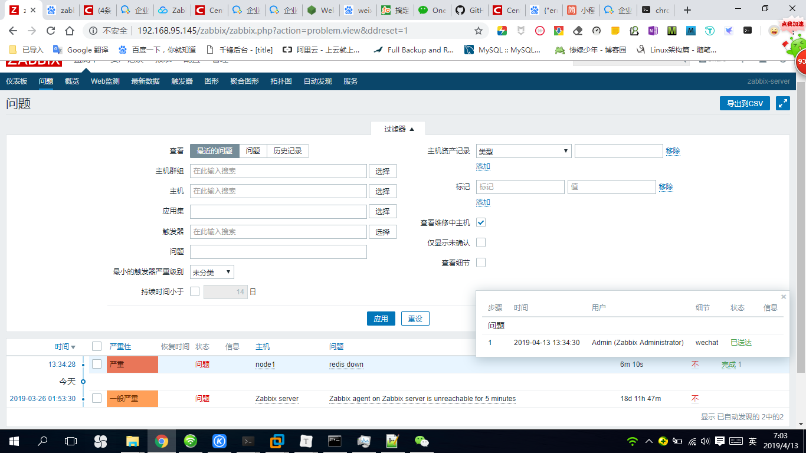

# Centos7 Zabbix3.4 微信告警配置

## 一、申请企业微信

1、填写注册信息


## 二、配置微信企业号

1、创建告警组，然后把接受消息人加进来


2、记录账号名称，等下填写接收人信息需要用到


3、点击我的企业，查看企业信息，要记录企业CorpID


4、点击企业应用，创建应用


5、填写信息和通知用户组


6、创建完，记录Agentld和Secret


## 三、配置zabbix服务器

1、首先确认已经记录的信息

告警组用户的账号，企业CorpID和创建应用的Secret、Agentld

2、修改zabbix.conf

```html
[root@localhost ~]# grep alertscripts /etc/zabbix/zabbix_server.conf 
# AlertScriptsPath=${datadir}/zabbix/alertscripts
AlertScriptsPath=/usr/lib/zabbix/alertscripts
我们设置zabbix默认脚本路径，这样在web端就可以获取到脚本
```

3、下载并设置脚本

```html
[root@localhost ~]# cd /usr/lib/zabbix/alertscripts/
[root@localhost alertscripts]# wget https://raw.githubusercontent.com/OneOaaS/weixin-alert/master/weixin_linux_amd64
[root@localhost alertscripts]# mv weixin_linux_amd64 wechat
[root@localhost alertscripts]# chmod 755 wechat 
[root@localhost alertscripts]# chown zabbix:zabbix wechat 
```

4、执行脚本进行测试

```html
[root@localhost alertscripts]# ./wechat --corpid=xxx --corpsecret=xxx --msg="您好，告警测试" --user=用户账号 --agentid=xxx
{"errcode":0,"errmsg":"ok","invaliduser":""}
```


提示：

--corpid= 我们企业里面的id
--corpsecret= 这里就是我们Secret里面的id
-msg= 内容
-user=我们邀请用户的账号

因为脚本是编译过的，无法进行编辑，我们可以使用 ./wechat -h or --help 查看

## 四、zabbix web页面配置告警信息

1、管理-报警媒介类型-创建告警媒介


2、填写报警媒介信息


--corpid=我们企业里面的id
--corpsecret=这里就是我们Secret里面的id
--agentid= Agentld ID
--user={ALERT.SENDTO}
--msg={ALERT.MESSAGE}

3、设置告警用户


4、设置告警动作


1）动作信息


2）填写告警时候操作信息


故障告警:{TRIGGER.STATUS}: {TRIGGER.NAME} 
告警主机:{HOST.NAME} 
主机地址:{HOST.IP} 
告警时间:{EVENT.DATE} {EVENT.TIME} 
告警等级:{TRIGGER.SEVERITY} 
告警信息:{TRIGGER.NAME} 
问题详情:{ITEM.NAME}:{ITEM.VALUE} 
事件代码:{EVENT.ID} 

3）填写恢复操作信息


故障解除:{TRIGGER.STATUS}: {TRIGGER.NAME} 
恢复主机:{HOST.NAME} 
主机地址:{HOST.IP} 
恢复时间:{EVENT.DATE} {EVENT.TIME} 
恢复等级:{TRIGGER.SEVERITY} 
恢复信息:{TRIGGER.NAME} 
问题详情:{ITEM.NAME}:{ITEM.VALUE} 
事件代码:{EVENT.ID}

## 五、手动触发告警，测试微信接收信息

我们在agent端使用yum安装一下`redis`：

```
[root@node1 ~]# yum install redis -y
```

　　修改一下配置文件：

```
[root@node1 ~]# vim /etc/redis.conf 
bind 0.0.0.0        #不做任何认证操作
```

　　修改完成以后，我们启动服务，并检查端口：

```
[root@node1 ~]# systemctl start redis
[root@node1 ~]# ss -nutlp | grep redis
tcp    LISTEN     0      128       *:6379                  *:*                   users:(("redis-server",pid=5250,fd=4))
```

　　接着，我们就可以去网站上来定义相关的操作了：

### 1.定义监控项

　　进入 配置 ---> 主机 ---> node1 ---> 监控项（items）---> 创建监控项

　　填写完毕以后，我们点击下方的添加。

　　该监控项已成功添加。
　　我们可以去查看一下他的值：
　　检测中 ---> 最新数据


### 2.定义触发器

　　定义好了监控项以后，我们亦可来定义一个触发器，当服务有问题的时候，我们才能及时知道：
　　进入 配置 ---> 主机 ---> node1 ---> 触发器（trigger）---> 创建触发器

　　填写完毕以后，我们点击下方的添加。

　　该触发器已成功添加。
　　我们去查看一下：
　　监测中 ---> 最新数据

　　我们来手动关闭redis服务来检测一下：

```
[root@node1 ~]# systemctl stop redis.service
```

　　进入 监测中 ---> 问题

　　可以看到，现在已经显示的是问题了。并且有持续的时间，当我们的服务被打开，会转为已解决状态：

```
[root@node1 ~]# systemctl start redis.service 
```




6、微信客户端


