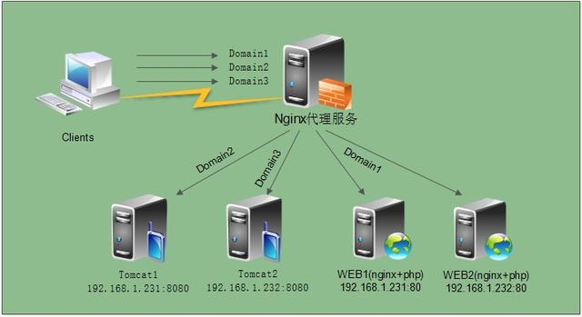
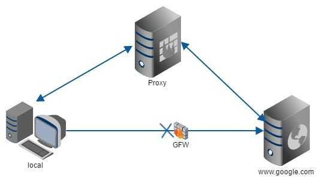
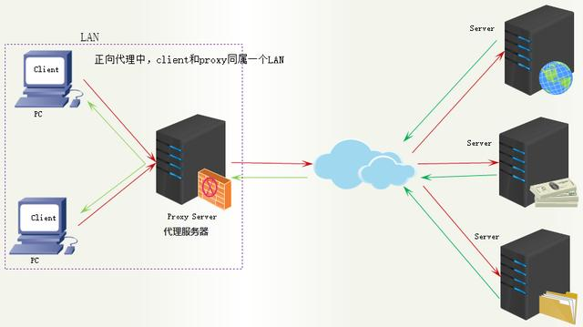
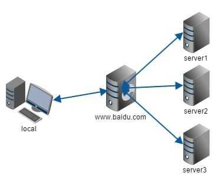
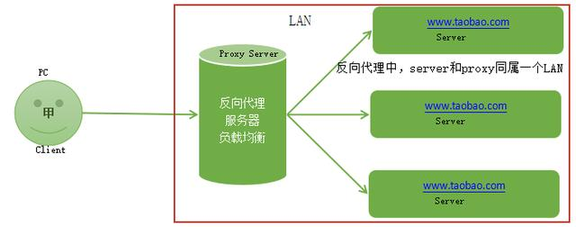
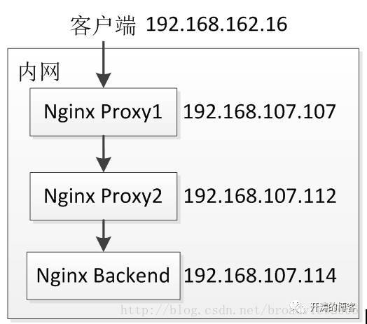
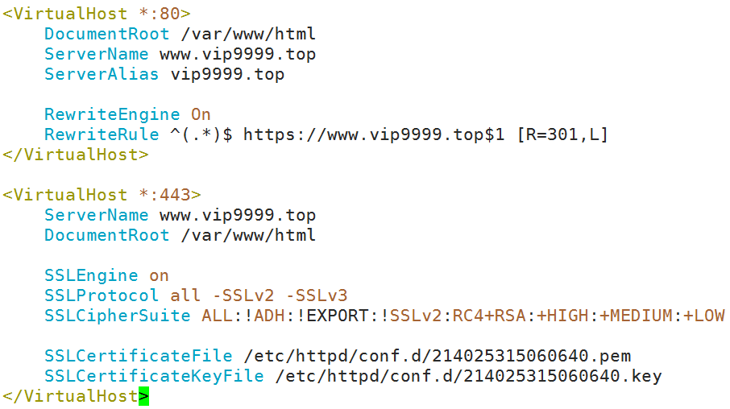

## 一、nginx 服务

### 1、nginx 介绍


 *Nginx* (engine x) 是一个高性能的 HTTP 和 反向代理 服务，也是一个IMAP/POP3/SMTP服务。Nginx是由伊戈尔·赛索耶夫为俄罗斯访问量第二的Rambler.ru站点（俄文：Рамблер）开发的，第一个公开版本0.1.0发布于2004年10月4日。其将源代码以类BSD许可证的形式发布，因它的稳定性、丰富的功能集、示例配置文件和低系统资源的消耗而闻名。2011年6月1日，nginx 1.0.4发布。

Nginx是一款轻量级的Web 服务器/反向代理服务器及电子邮件（IMAP/POP3）代理服务器，并在一个BSD-like 协议下发行。其特点是占有内存少，并发能力强，事实上nginx的并发能力确实在同类型的网页服务器中表现较好，中国大陆使用nginx网站用户有：百度、[京东](https://baike.baidu.com/item/%E4%BA%AC%E4%B8%9C/210931)、[新浪](https://baike.baidu.com/item/%E6%96%B0%E6%B5%AA/125692)、[网易](https://baike.baidu.com/item/%E7%BD%91%E6%98%93/185754)、[腾讯](https://baike.baidu.com/item/%E8%85%BE%E8%AE%AF/112204)、[淘宝](https://baike.baidu.com/item/%E6%B7%98%E5%AE%9D/145661)等。

`在高连接并发的情况下，Nginx是Apache服务器不错的替代品`。

**创始人伊戈尔·赛索耶夫**


### 2、为什么选择 nginx 

Nginx 是一个高性能的 Web 和反向代理服务器, 它具有有很多非常优越的特性:

**作为 Web 服务器**：相比 Apache，Nginx 使用更少的资源，支持更多的并发连接，体现更高的效率，这点使 Nginx 尤其受到虚拟主机提供商的欢迎。能够支持高达 `50,000 `个并发连接数的响应，感谢 Nginx 为我们选择了 `epoll and kqueue` 作为开发模型.

**作为负载均衡服务器**：Nginx 既可以在内部直接支持 `Rails 和 PHP`，也可以支持作为 HTTP代理服务器 对外进行服务。Nginx 用 C 编写, 不论是系统资源开销还是 CPU 使用效率都比 Perlbal 要好的多。

**作为邮件代理服务器**: Nginx 同时也是一个非常优秀的邮件代理服务器（最早开发这个产品的目的之一也是作为邮件代理服务器），Last.fm 描述了成功并且美妙的使用经验。

**Nginx 安装非常的简单，配置文件 非常简洁（还能够支持perl语法），Bugs非常少的服务器**: Nginx 启动特别容易，并且几乎可以做到`7*24`不间断运行，即使运行数个月也不需要重新启动。你还能够在 `不间断服务的情况下进行软件版本的升级`。

### 3、IO多路复用

#### 1、I/O multiplexing【多并发】

第一种方法就是最传统的`多进程并发模型` (每进来一个新的I/O流会分配一个新的进程管理。)

第二种方法就是`I/O多路复用` (单个线程，通过记录跟踪每个I/O流(sock)的状态，来同时管理多个I/O流 。)


I/O multiplexing 这里面的 multiplexing 指的其实是在单个线程通过记录跟踪每一个Sock(I/O流)的状态来同时管理多个I/O流。发明它的原因，是`尽量多的提高服务器的吞吐能力`。在同一个线程里面， 通过拨开关的方式，来同时传输多个I/O流


#### 2、一个请求到来了，nginx使用epoll接收请求的过程是怎样的?

ngnix会有很多连接进来， epoll会把他们都监视起来，然后像拨开关一样，谁有数据就拨向谁，然后调用相应的代码处理。

- **select, poll, epoll** 都是I/O多路复用的具体的实现，其实是他们出现是有先后顺序的。 

I/O多路复用这个概念被提出来以后， 相继出现了多个方案

- **`select`**是第一个实现 (1983 左右在BSD里面实现的)。 select 被实现以后，很快就暴露出了很多问题。

• select 会修改传入的参数数组，这个对于一个需要调用很多次的函数，是非常不友好的。

• select 如果任何一个sock(I/O stream)出现了数据，`select 仅仅会返回，但是并不会告诉你是那个sock上有数据`，于是你只能自己一个一个的找，10几个sock可能还好，要是几万的sock每次都找一遍

• select 只能监视`1024`个链接。

• select `不是线程安全`的，如果你把一个sock加入到select, 然后突然另外一个线程发现，这个sock不用，要收回，这个select 不支持的，如果你丧心病狂的竟然关掉这个sock, select的标准行为是不可预测的

- 于是14年以后(1997年）一帮人又实现了**poll,**  poll 修复了select的很多问题，比如

• poll 去掉了1024个链接的限制，`链接数不限制`。

• poll 从设计上来说，不再修改传入数组，不过这个要看你的平台了。其实拖14年那么久也不是效率问题， 而是那个时代的硬件实在太弱，一台服务器处理1千多个链接简直就是神一样的存在了，select很长段时间已经满足需求。 

但是poll仍然`不是线程安全`的， 这就意味着，不管服务器有多强悍，你也只能在一个线程里面处理一组I/O流。

你当然可以那多进程来配合了，不过然后你就有了多进程的各种问题。

- 于是5年以后, 在2002, 大神 Davide Libenzi 实现了**epoll**. epoll 可以说是I/O 多路复用最新的一个实现，epoll 修复了poll 和select绝大部分问题, 比如：

• epoll 现在是`线程安全`的。 

• epoll 现在`不仅告诉你sock组里面数据，还会告诉你具体哪个sock有数据`，你不用自己去找了。


# select、poll、epoll之间的区别总结

select，poll，epoll都是IO多路复用的机制。I/O多路复用就通过一种机制，可以监视多个描述符，一旦某个描述符就绪（一般是读就绪或者写就绪），能够通知程序进行相应的读写操作。**但select，poll，epoll本质上都是同步I/O，因为他们都需要在读写事件就绪后自己负责进行读写，也就是说这个读写过程是阻塞的**，而异步I/O则无需自己负责进行读写，异步I/O的实现会负责把数据从内核拷贝到用户空间。关于这三种IO多路复用的用法，前面三篇总结写的很清楚，并用服务器回射echo程序进行了测试。连接如下所示：

select：http://www.cnblogs.com/Anker/archive/2013/08/14/3258674.html

poll：http://www.cnblogs.com/Anker/archive/2013/08/15/3261006.html

epoll：http://www.cnblogs.com/Anker/archive/2013/08/17/3263780.html

　　今天对这三种IO多路复用进行对比，参考网上和书上面的资料，整理如下：

**1、select实现**

**select的调用过程如下所示：**

****

（1）使用copy_from_user从用户空间拷贝fd_set到内核空间

（2）注册回调函数__pollwait

（3）遍历所有fd，调用其对应的poll方法（对于socket，这个poll方法是sock_poll，sock_poll根据情况会调用到tcp_poll,udp_poll或者datagram_poll）

（4）以tcp_poll为例，其核心实现就是__pollwait，也就是上面注册的回调函数。

（5）__pollwait的主要工作就是把current（当前进程）挂到设备的等待队列中，不同的设备有不同的等待队列，对于tcp_poll来说，其等待队列是sk->sk_sleep（注意把进程挂到等待队列中并不代表进程已经睡眠了）。在设备收到一条消息（网络设备）或填写完文件数据（磁盘设备）后，会唤醒设备等待队列上睡眠的进程，这时current便被唤醒了。

（6）poll方法返回时会返回一个描述读写操作是否就绪的mask掩码，根据这个mask掩码给fd_set赋值。

（7）如果遍历完所有的fd，还没有返回一个可读写的mask掩码，则会调用schedule_timeout是调用select的进程（也就是current）进入睡眠。当设备驱动发生自身资源可读写后，会唤醒其等待队列上睡眠的进程。如果超过一定的超时时间（schedule_timeout指定），还是没人唤醒，则调用select的进程会重新被唤醒获得CPU，进而重新遍历fd，判断有没有就绪的fd。

（8）把fd_set从内核空间拷贝到用户空间。

**总结：**

**select的几大缺点：**

**（1）每次调用select，都需要把fd集合从用户态拷贝到内核态，这个开销在fd很多时会很大**

**（2）同时每次调用select都需要在内核遍历传递进来的所有fd，这个开销在fd很多时也很大**

**（3）select支持的文件描述符数量太小了，默认是1024**

**2 poll实现**

　　poll的实现和select非常相似，只是描述fd集合的方式不同，poll使用pollfd结构而不是select的fd_set结构，其他的都差不多。

关于select和poll的实现分析，可以参考下面几篇博文：

http://blog.csdn.net/lizhiguo0532/article/details/6568964#comments

http://blog.csdn.net/lizhiguo0532/article/details/6568968

http://blog.csdn.net/lizhiguo0532/article/details/6568969

http://www.ibm.com/developerworks/cn/linux/l-cn-edntwk/index.html?ca=drs-

http://linux.chinaunix.net/techdoc/net/2009/05/03/1109887.shtml

**3、epoll**

　　epoll既然是对select和poll的改进，就应该能避免上述的三个缺点。那epoll都是怎么解决的呢？在此之前，我们先看一下epoll和select和poll的调用接口上的不同，select和poll都只提供了一个函数——select或者poll函数。而epoll提供了三个函数，epoll_create,epoll_ctl和epoll_wait，epoll_create是创建一个epoll句柄；epoll_ctl是注册要监听的事件类型；epoll_wait则是等待事件的产生。

　　对于第一个缺点，epoll的解决方案在epoll_ctl函数中。每次注册新的事件到epoll句柄中时（在epoll_ctl中指定EPOLL_CTL_ADD），会把所有的fd拷贝进内核，而不是在epoll_wait的时候重复拷贝。epoll保证了每个fd在整个过程中只会拷贝一次。

　　对于第二个缺点，epoll的解决方案不像select或poll一样每次都把current轮流加入fd对应的设备等待队列中，而只在epoll_ctl时把current挂一遍（这一遍必不可少）并为每个fd指定一个回调函数，当设备就绪，唤醒等待队列上的等待者时，就会调用这个回调函数，而这个回调函数会把就绪的fd加入一个就绪链表）。epoll_wait的工作实际上就是在这个就绪链表中查看有没有就绪的fd（利用schedule_timeout()实现睡一会，判断一会的效果，和select实现中的第7步是类似的）。

　　对于第三个缺点，epoll没有这个限制，它所支持的FD上限是最大可以打开文件的数目，这个数字一般远大于2048,举个例子,在1GB内存的机器上大约是10万左右，具体数目可以cat /proc/sys/fs/file-max察看,一般来说这个数目和系统内存关系很大。

**总结：**

（1）select，poll实现需要自己不断轮询所有fd集合，直到设备就绪，期间可能要睡眠和唤醒多次交替。而epoll其实也需要调用epoll_wait不断轮询就绪链表，期间也可能多次睡眠和唤醒交替，但是它是设备就绪时，调用回调函数，把就绪fd放入就绪链表中，并唤醒在epoll_wait中进入睡眠的进程。虽然都要睡眠和交替，但是select和poll在“醒着”的时候要遍历整个fd集合，而epoll在“醒着”的时候只要判断一下就绪链表是否为空就行了，这节省了大量的CPU时间。这就是回调机制带来的性能提升。

（2）select，poll每次调用都要把fd集合从用户态往内核态拷贝一次，并且要把current往设备等待队列中挂一次，而epoll只要一次拷贝，而且把current往等待队列上挂也只挂一次（在epoll_wait的开始，注意这里的等待队列并不是设备等待队列，只是一个epoll内部定义的等待队列）。这也能节省不少的开销。

#### 3、异步，非阻塞

```
$ pstree |grep nginx
 |-+= 81666 root nginx: master process nginx
 | |--- 82500 nobody nginx: worker process
 | \--- 82501 nobody nginx: worker process

 1个master进程，2个work进程
```

每进来一个request，会有一个worker进程去处理。但不是全程的处理，处理到什么程度呢？处理到可能发生阻塞的地方，比如向上游（后端）服务器转发request，并等待请求返回。那么，这个处理的worker不会这么一直等着，他会在发送完请求后，注册一个事件：“如果upstream返回了，告诉我一声，我再接着干”。于是他就休息去了。这就是异步。此时，如果再有request 进来，他就可以很快再按这种方式处理。这就是`非阻塞和IO多路复用`。而一旦上游服务器返回了，就会触发这个事件，worker才会来接手，这个request才会接着往下走。这就是`异步回调`。

### 4、nginx 的内部技术架构 

Nginx服务器，以其处理网络请求的高并发、高性能及高效率，获得了行业界的广泛认可，近年已稳居web服务器部署排名第二的位置，并被广泛用于反向代理和负载均衡。

Nginx是如何实现这些目标的呢？答案就是其独特的内部技术架构设计。看懂下面这张图，就明白了Nginx的内部技术架构。


简要说明几点：

1）nginx启动时，会生成两种类型的进程，一个是主进程（Master），一个（`windows版本的目前只有一个`）或多个工作进程（Worker）。主进程并不处理网络请求，主要负责调度工作进程，也就是图示的三项：`加载配置`、`启动工作进程`及`非停升级`。所以，nginx启动以后，查看操作系统的进程列表，我们就能看到至少有两个nginx进程。

2）服务器实际处理网络请求及响应的是工作进程（worker），在类unix系统上，nginx可以配置多个worker，而每个worker进程都可以同时处理数以千计的网络请求。

3）模块化设计。nginx的worker，包括核心和功能性模块，核心模块负责维持一个运行循环（run-loop），执行网络请求处理的不同阶段的模块功能，如网络读写、存储读写、内容传输、外出过滤，以及将请求发往上游服务器等。而其代码的模块化设计，也使得我们可以根据需要对功能模块进行适当的选择和修改，编译成具有特定功能的服务器。

4）事件驱动、异步及非阻塞，可以说是nginx得以获得高并发、高性能的关键因素，同时也得益于对Linux、Solaris及类BSD等操作系统内核中事件通知及I/O性能增强功能的采用，如kqueue、epoll及event ports。

5）代理（proxy）设计，可以说是nginx深入骨髓的设计，无论是对于HTTP，还是对于FastCGI、memcache、Redis等的网络请求或响应，本质上都采用了代理机制。所以，nginx天生就是高性能的代理服务器   


# CentOS 7 下 yum 安装和配置 Nginx

## 前言

Nginx (engine x) 是一个高性能的 HTTP 和反向代理服务器，也是一个 IMAP/POP3/SMTP 服务器。。 本例演示 CentOS 7 下安装和配置 Nginx 的基本步骤。

### 环境说明

CentOS 7（Minimal Install）

```
$ cat /etc/redhat-release 
CentOS Linux release 7.5.1804 (Core) 
```

## 步骤

### 步骤 1: 添加 yum 源

Nginx 不在默认的 yum 源中，可以使用 epel 或者官网的 yum 源，本例使用官网的 yum 源。

```
$ sudo rpm -ivh http://nginx.org/packages/centos/7/noarch/RPMS/nginx-release-centos-7-0.el7.ngx.noarch.rpm
```

安装完 yum 源之后，可以查看一下。

```
$ sudo yum repolist
Loaded plugins: fastestmirror, langpacks
Loading mirror speeds from cached hostfile
 * base: mirrors.aliyun.com
 * extras: mirrors.aliyun.com
 * updates: mirrors.aliyun.com
repo id                          repo name                          status
base/7/x86_64                    CentOS-7 - Base                    9,911
extras/7/x86_64                  CentOS-7 - Extras                    368
nginx/x86_64                     nginx repo                           108
updates/7/x86_64                 CentOS-7 - Updates                 1,041
repolist: 11,428
```

可以发现 `nginx repo` 已经安装到本机了。

### 步骤 2: 安装

yum 安装 Nginx，非常简单，一条命令。

```
$ sudo yum install nginx
```

### 步骤 3: 配置 Nginx 服务

设置开机启动

```
$ sudo systemctl enable nginx
```

启动服务

```
$ sudo systemctl start nginx
```

停止服务

```
$ sudo systemctl restart nginx
```

重新加载，因为一般重新配置之后，不希望重启服务，这时可以使用重新加载。

```
$ sudo systemctl reload nginx
```

### 步骤 4: 打开防火墙端口

默认 CentOS7 使用的防火墙 firewalld 是关闭 http 服务的（打开 80 端口）。

```
$ sudo firewall-cmd --zone=public --permanent --add-service=http
success
$ sudo firewall-cmd --reload
success
```

打开之后，可以查看一下防火墙打开的所有的服务

```
$ sudo sudo firewall-cmd --list-service
ssh dhcpv6-client http
```

可以看到，系统已经打开了 http 服务。

### 反向代理

Nginx 是一个很方便的反向代理，配置反向代理可以参考 [Module ngx_http_proxy_module]。本文不做累述。

需要指出的是 CentOS 7 的 SELinux，使用反向代理需要打开网络访问权限。

```
$ sudo setsebool httpd_can_network_connect 1 
```

打开网络权限之后，反向代理可以使用了。

### 绑定其他端口

Nginx 默认绑定的端口是 http 协议的默认端口，端口号为：`80`，如果需要绑定其他端口，需要注意 SELinux 的配置

例如：绑定 8081 端口，但是会发现无法启动，一般的报错如下

```
YYYY/MM/DD hh:mm:ss [emerg] 46123#0: bind() to 0.0.0.0:8081 failed (13: Permission denied)
```

此时需要更改 SELinux 的设置。我们使用 SELinux 的管理工具 `semanage` 进行操作，比较方便。

安装 `semanage` 使用如下命令

```
$ sudo yum install policycoreutils-python
```

然后查看是否有其他协议类型使用了此端口

```
$ sudo semanage port -l | grep 8081
transproxy_port_t              tcp      8081
```

返回了结果，表明已经被其他类型占用了，类型为 `transproxy_port_t`。

我们还要查看一下 Nginx 的在 SELinux 中的类型 `http_port_t` 绑定的端口

```
$ sudo semanage port -l | grep http_port_t
http_port_t                    tcp      80, 81, 443, 488, 8008, 8009, 8443, 9000
pegasus_http_port_t            tcp      5988
```

第一行 `http_port_t` 中没有包含 `8081` 这个端口。因此需要修改 `8081` 端口到 `http_port_t` 类型中。

```
$ sudo semanage port -m -p tcp -t http_port_t 8081
```

如果没有其他协议类型使用想要绑定的端口，如 `8001`，则我们只要新增到 SELinux 中即可。

```
$ sudo semanage port -l | grep 8001
$ sudo semanage port -a -p tcp -t http_port_t 8001
```

此时，重新启动 Nginx 即可。

## 参考资料

[Install Nginx Binary Releases](https://www.nginx.com/resources/wiki/start/topics/tutorials/install/)
[Module ngx_http_proxy_module](http://nginx.org/en/docs/http/ngx_http_proxy_module.html)
[Using NGINX and NGINX Plus with SELinux](https://www.nginx.com/blog/using-nginx-plus-with-selinux/)

### 5、nginx 安装部署和配置管理

#### 1、nginx 部署-Yum

访问 nginx官方网站：http://www.nginx.org

Nginx版本类型

Mainline version：   主线版，即开发版

Stable version：       最新稳定版，生产环境上建议使用的版本

Legacy versions：    遗留的老版本的稳定版


**Yum安装Nginx**

##### a、**官方安装指导**

Installation instructions

Before you install nginx for the first time on a new machine, you need to set up the nginx packages repository. Afterward, you can install and update nginx from the repository.

**RHEL/CentOS**

Install the prerequisites:

> ```
> sudo yum install yum-utils -y
> ```

To set up the yum repository, create the file named `/etc/yum.repos.d/nginx.repo` with the following contents:

> ```
> [nginx-stable]
> name=nginx stable repo
> baseurl=http://nginx.org/packages/centos/$releasever/$basearch/
> gpgcheck=1
> enabled=1
> gpgkey=https://nginx.org/keys/nginx_signing.key
> module_hotfixes=true
> 
> [nginx-mainline]
> name=nginx mainline repo
> baseurl=http://nginx.org/packages/mainline/centos/$releasever/$basearch/
> gpgcheck=1
> enabled=0
> gpgkey=https://nginx.org/keys/nginx_signing.key
> module_hotfixes=true
> ```

By default, the repository for stable nginx packages is used. If you would like to use mainline nginx packages, run the following command:

> ```
> sudo yum-config-manager --enable nginx-mainline
> ```

To install nginx, run the following command:

> ```
> sudo yum install nginx -y
> ```

When prompted to accept the GPG key, verify that the fingerprint matches `573B FD6B 3D8F BC64 1079 A6AB ABF5 BD82 7BD9 BF62`, and if so, accept it.

##### b 、安装

```
[root@tianyun ~]# yum -y install nginx

[root@tianyun ~]# systemctl start nginx && systemctl enable nginx
```

**查看防火墙状态， 需要关闭防火墙**

```
[root@tianyun ~]# getenforce 

Disabled

[root@tianyun ~]# systemctl status firewalld

● firewalld.service - firewalld - dynamic firewall daemon

   Loaded: loaded (/usr/lib/systemd/system/firewalld.service; disabled; vendor pres

et: enabled)   Active: inactive (dead)

     Docs: man:firewalld(1)
```

**查看 nginx 安装版本**

```
[root@tianyun ~]# nginx -v

nginx version: nginx/1.14.2
```

```
[root@centos711 ~]# nginx -v 
nginx version: nginx/1.17.6
[root@centos711 ~]# nginx -V
nginx version: nginx/1.17.6
built by gcc 4.8.5 20150623 (Red Hat 4.8.5-36) (GCC) 
built with OpenSSL 1.0.2k-fips  26 Jan 2017
TLS SNI support enabled
configure arguments: --prefix=/etc/nginx --sbin-path=/usr/sbin/nginx --modules-path=/usr/lib64/nginx/modules --conf-path=/etc/nginx/nginx.conf --error-log-path=/var/log/nginx/error.log --http-log-path=/var/log/nginx/access.log --pid-path=/var/run/nginx.pid --lock-path=/var/run/nginx.lock --http-client-body-temp-path=/var/cache/nginx/client_temp --http-proxy-temp-path=/var/cache/nginx/proxy_temp --http-fastcgi-temp-path=/var/cache/nginx/fastcgi_temp --http-uwsgi-temp-path=/var/cache/nginx/uwsgi_temp --http-scgi-temp-path=/var/cache/nginx/scgi_temp --user=nginx --group=nginx --with-compat --with-file-aio --with-threads --with-http_addition_module --with-http_auth_request_module --with-http_dav_module --with-http_flv_module --with-http_gunzip_module --with-http_gzip_static_module --with-http_mp4_module --with-http_random_index_module --with-http_realip_module --with-http_secure_link_module --with-http_slice_module --with-http_ssl_module --with-http_stub_status_module --with-http_sub_module --with-http_v2_module --with-mail --with-mail_ssl_module --with-stream --with-stream_realip_module --with-stream_ssl_module --with-stream_ssl_preread_module --with-cc-opt='-O2 -g -pipe -Wall -Wp,-D_FORTIFY_SOURCE=2 -fexceptions -fstack-protector-strong --param=ssp-buffer-size=4 -grecord-gcc-switches -m64 -mtune=generic -fPIC' --with-ld-opt='-Wl,-z,relro -Wl,-z,now -pie'

```

**浏览器访问 tianyun.me (在访问机器上添加 hosts 解析)**


#### 2、nginx 编译安装与配置使用

##### 1、安装编译环境

```
yum -y install gcc gcc-c++
```

##### 2、安装pcre软件包（使nginx支持http rewrite模块）

```
yum install -y pcre pcre-devel
```

##### 3、安装openssl-devel（使nginx支持ssl）

```
yum install -y pcre pcre-devel 
```

##### 4、安装zlib

```
yum install -y zlib zlib-devel
```

##### 5、创建用户nginx

```
useradd nginx 

passwd nginx
```

##### 6、安装nginx

```shell
[root@localhost ～]#wget http://nginx.org/download/nginx-1.17.6.tar.gz
```

```shell
[root@centos712 ~]# tar -zxvf nginx-1.17.6.tar.gz -C /usr/local/
[root@centos712 local]# cd nginx-1.17.6/
[root@localhost nginx-1.14.2]# ./configure \ 
--group=nginx \ 
--user=nginx \ 
--prefix=/usr/local/nginx \ 
--sbin-path=/usr/sbin/nginx \ 
--conf-path=/etc/nginx/nginx.conf \ 
--error-log-path=/var/log/nginx/error.log \ 
--http-log-path=/var/log/nginx/access.log \ 
--http-client-body-temp-path=/tmp/nginx/client_body \ 
--http-proxy-temp-path=/tmp/nginx/proxy \ 
--http-fastcgi-temp-path=/tmp/nginx/fastcgi \ 
--pid-path=/var/run/nginx.pid \ 
--lock-path=/var/lock/nginx \ 
--with-http_stub_status_module \ 
--with-http_ssl_module \ 
--with-http_gzip_static_module \ 
--with-pcre 
[root@localhost nginx-1.11.3]# make &&make install
```

> ./configure 时提示以下错误：
>
> ./configure: error: SSL modules require the OpenSSL library.
> You can either do not enable the modules, or install the OpenSSL library
> into the system, or build the OpenSSL library statically from the source
> with nginx by using --with-openssl=<path> option.
>
> 解决方法：
>
> 执行以下命令：
>
> yum -y install openssl openssl-devel

##### 7、Nginx 编译参数

```shell
# 查看 nginx 安装的模块
[root@tianyun ~]# nginx -V

# 模块参数具体功能 
--with-cc-opt='-g -O2 -fPIE -fstack-protector'   # 设置额外的参数将被添加到CFLAGS变量。（FreeBSD或者ubuntu使用）
--param=ssp-buffer-size=4 -Wformat -Werror=format-security -D_FORTIFY_SOURCE=2' 
--with-ld-opt='-Wl,-Bsymbolic-functions -fPIE -pie -Wl,-z,relro -Wl,-z,now' 

--prefix=/usr/share/nginx                        # 指向安装目录
--conf-path=/etc/nginx/nginx.conf                # 指定配置文件
--http-log-path=/var/log/nginx/access.log        # 指定访问日志
--error-log-path=/var/log/nginx/error.log        # 指定错误日志
--lock-path=/var/lock/nginx.lock                 # 指定lock文件
--pid-path=/run/nginx.pid                        # 指定pid文件

--http-client-body-temp-path=/var/lib/nginx/body    # 设定http客户端请求临时文件路径
--http-fastcgi-temp-path=/var/lib/nginx/fastcgi     # 设定http fastcgi临时文件路径
--http-proxy-temp-path=/var/lib/nginx/proxy         # 设定http代理临时文件路径
--http-scgi-temp-path=/var/lib/nginx/scgi           # 设定http scgi临时文件路径
--http-uwsgi-temp-path=/var/lib/nginx/uwsgi         # 设定http uwsgi临时文件路径

--with-debug                                        # 启用debug日志
--with-pcre-jit                                     # 编译PCRE包含“just-in-time compilation”
--with-ipv6                                         # 启用ipv6支持
--with-http_ssl_module                              # 启用ssl支持
--with-http_stub_status_module                      # 获取nginx自上次启动以来的状态
--with-http_realip_module                 # 允许从请求标头更改客户端的IP地址值，默认为关
--with-http_auth_request_module           # 实现基于一个子请求的结果的客户端授权。如果该子请求返回的2xx响应代码，所述接入是允许的。如果它返回401或403中，访问被拒绝与相应的错误代码。由子请求返回的任何其他响应代码被认为是一个错误。
--with-http_addition_module               # 作为一个输出过滤器，支持不完全缓冲，分部分响应请求
--with-http_dav_module                    # 增加PUT,DELETE,MKCOL：创建集合,COPY和MOVE方法 默认关闭，需编译开启
--with-http_geoip_module                  # 使用预编译的MaxMind数据库解析客户端IP地址，得到变量值
--with-http_gunzip_module                 # 它为不支持“gzip”编码方法的客户端解压具有“Content-Encoding: gzip”头的响应。
--with-http_gzip_static_module            # 在线实时压缩输出数据流
--with-http_image_filter_module           # 传输JPEG/GIF/PNG 图片的一个过滤器）（默认为不启用。gd库要用到）
--with-http_spdy_module                   # SPDY可以缩短网页的加载时间
--with-http_sub_module                    # 允许用一些其他文本替换nginx响应中的一些文本
--with-http_xslt_module                   # 过滤转换XML请求
--with-mail                               # 启用POP3/IMAP4/SMTP代理模块支持
--with-mail_ssl_module                    # 启用ngx_mail_ssl_module支持启用外部模块支持
```

##### 8、修改配置文件 /etc/nginx/nginx.conf

```shell
# 全局参数设置 
worker_processes  1;          # 设置nginx启动进程的数量，一般设置成与逻辑cpu数量相同 
error_log  logs/error.log;    # 指定错误日志 
worker_rlimit_nofile 102400;  # 设置一个nginx进程能打开的最大文件数 
pid        /var/run/nginx.pid; 
events {                      # 事件配置
    worker_connections  1024; # 设置一个进程的最大并发连接数
    use epoll;                # 事件驱动类型
} 
# http 服务相关设置 
http { 
    include      mime.types; 
    default_type  application/octet-stream; 
    log_format  main  'remote_addr - remote_user [time_local] "request" '
                      'status body_bytes_sent "$http_referer" '
                      '"http_user_agent" "http_x_forwarded_for"'; 
    access_log  /var/log/nginx/access.log  main;    #设置访问日志的位置和格式 
    sendfile          on;      # 用于开启文件高效传输模式，一般设置为on，若nginx是用来进行磁盘IO负载应用时，可以设置为off，降低系统负载
    tcp_nopush        on;      # 减少网络报文段数量，当有数据时，先别着急发送, 确保数据包已经装满数据, 避免了网络拥塞
    tcp_nodelay       on;      # 提高I/O性能，确保数据尽快发送, 提高可数据传输效率                           
    gzip              on;      # 是否开启gzip压缩 
    keepalive_timeout  65;     # 设置长连接的超时时间，请求完成之后还要保持连接多久，不是请求时间多久，目的是保持长连接，减少创建连接过程给系统带来的性能损耗，类似于线程池，数据库连接池
    types_hash_max_size 2048;  # 影响散列表的冲突率。types_hash_max_size越大，就会消耗更多的内存，但散列key的冲突率会降低，检索速度就更快。                                       types_hash_max_size越小，消耗的内存就越小，但散列key的冲突率可能上升
    include             /etc/nginx/mime.types;  # 关联mime类型，关联资源的媒体类型(不同的媒体类型的打开方式)
    default_type        application/octet-stream;  # 根据文件的后缀来匹配相应的MIME类型，并写入Response header，导致浏览器播放文件而不是下载
# 虚拟服务器的相关设置 
    server { 
        listen      80;        # 设置监听的端口 
        server_name  localhost;        # 设置绑定的主机名、域名或ip地址 
        charset koi8-r;        # 设置编码字符 
        location / { 
            root  /var/www/nginx;           # 设置服务器默认网站的根目录位置 
            index  index.html index.htm;    # 设置默认打开的文档 
            } 
        error_page  500 502 503 504  /50x.html; # 设置错误信息返回页面 
            location = /50x.html { 
            root  html;        # 这里的绝对位置是/var/www/nginx/html 
        } 
    } 
 }
```

##### 9、检测 nginx 配置文件是否正确

```shell
[root@localhost ~]#usr/local/nginx/sbin/nginx -t
```

##### 10、启动nginx服务

```shell
/usr/local/nginx/sbin/nginx
```

##### 11、通过 nginx 命令控制 nginx 服务

```shell
nginx -c /path/to/nginx.conf  	 # 以特定目录下的配置文件启动nginx:
nginx -s reload            	 	 # 修改配置后重新加载生效
nginx -s reopen   			 	 # 重新打开日志文件
nginx -s stop  				 	 # 快速停止nginx
nginx -s quit  				  	 # 完整有序的停止nginx
nginx -t    					 # 测试当前配置文件是否正确
nginx -t -c /path/to/nginx.conf  # 测试特定的nginx配置文件是否正确
```

##### 12、实现nginx开机自启

 a、添加启动脚本  vim /etc/init.d/nginx

```shell
#!/bin/sh 
# 
# nginx - this script starts and stops the nginx daemon 
# 
# chkconfig:  - 85 15  
# description:  Nginx is an HTTP(S) server, HTTP(S) reverse \ 
#              proxy and IMAP/POP3 proxy server 
# processname: nginx 
# config:      /etc/nginx/nginx.conf 
# config:      /etc/sysconfig/nginx 
# pidfile:    /var/run/nginx.pid 
  
# Source function library. 
. /etc/rc.d/init.d/functions
  
# Source networking configuration. 
. /etc/sysconfig/network
  
# Check that networking is up. 
[ "$NETWORKING" = "no" ] && exit 0 
  
nginx="/usr/sbin/nginx"
prog=$(basename $nginx) 
  
NGINX_CONF_FILE="/etc/nginx/nginx.conf"
  
[ -f /etc/sysconfig/nginx ] && . /etc/sysconfig/nginx
  
lockfile=/var/lock/subsys/nginx
  
make_dirs() { 
  # make required directories 
  user=`nginx -V 2>&1 | grep "configure arguments:" | sed 's/[^*]*--user=\([^ ]*\).*/\1/g' -` 
  options=`$nginx -V 2>&1 | grep 'configure arguments:'` 
  for opt in $options; do
      if [ `echo $opt | grep '.*-temp-path'` ]; then
          value=`echo $opt | cut -d "=" -f 2` 
          if [ ! -d "$value" ]; then
              # echo "creating" $value 
              mkdir -p $value && chown -R $user $value 
          fi
      fi
  done
} 
  
start() { 
    [ -x $nginx ] || exit 5 
    [ -f $NGINX_CONF_FILE ] || exit 6 
    make_dirs 
    echo -n $"Starting $prog: "
    daemon $nginx -c $NGINX_CONF_FILE 
    retval=$? 
    echo
    [ $retval -eq 0 ] && touch $lockfile 
    return $retval 
} 
  
stop() { 
    echo -n $"Stopping $prog: "
    killproc $prog -QUIT 
    retval=$? 
    echo
    [ $retval -eq 0 ] && rm -f $lockfile 
    return $retval 
} 
  
restart() { 
    configtest || return $? 
    stop 
    sleep 1 
    start 
} 
  
reload() { 
    configtest || return $? 
    echo -n $"Reloading $prog: "
    killproc $nginx -HUP 
    RETVAL=$? 
    echo
} 
  
force_reload() { 
    restart 
} 
  
configtest() { 
  $nginx -t -c $NGINX_CONF_FILE 
} 
  
rh_status() { 
    status $prog 
} 
  
rh_status_q() { 
    rh_status >/dev/null 2>&1 
} 
  
case "$1" in
    start) 
        rh_status_q && exit 0 
        $1 
        ;; 
    stop) 
        rh_status_q || exit 0 
        $1 
        ;; 
    restart|configtest) 
        $1 
        ;; 
    reload) 
        rh_status_q || exit 7 
        $1 
        ;; 
    force-reload) 
        force_reload 
        ;; 
    status) 
        rh_status 
        ;; 
    condrestart|try-restart) 
        rh_status_q || exit 0 
            ;; 
    *) 
        echo $"Usage: $0 {start|stop|status|restart|condrestart|try-restart|reload|force-reload|configtest}"
        exit 2 
esac
```

b、添加权限

```shell
chmod +x /etc/init.d/nginx
```

c、重载系统启动文件

```shell
systemctl daemon-reload
```

d、设置开机自启

```shell
systemctl start nginx
```

10、nginx 日志文件详解

​    nginx 日志文件分为 **log_format** 和 **access_log** 两部分

​    log_format 定义记录的格式，其语法格式为

​    log_format        样式名称        样式详情

​    配置文件中默认有

```
log_format  main  'remote_addr - remote_user [time_local] "request" '
                  'status body_bytes_sent "$http_referer" '
                  '"http_user_agent" "http_x_forwarded_for"';
```

| 点击这里                            | 点击这里                                                    |
| ----------------------------------- | ----------------------------------------------------------- |
| 变量                                | 说明                                                        |
| $remote_addr和$http_x_forwarded_for | 客户端的ip                                                  |
| $remote_user                        | 客户端的名称                                                |
| $time_local                         | 访问时的本地时间                                            |
| $request                            | 请求的URL和http协议                                         |
| $status                             | 访问的状态码                                                |
| $body_bytes_sent                    | 发送给客户端的主体内容大小                                  |
| $http_referer                       | 记录客户端是从哪个页面链接访问过来的，若没有链接，则访问‘-’ |
| $http_user_agent                    | 记录客户端使用的浏览器的相关信息                            |

#### 6、nginx 高级应用

##### 1、使用 alias 实现虚拟目录

```shell
   location /lys { 
    	alias /var/www/lys; 
    	index index.html;    # 访问http://x.x.x.x/lzs时实际上访问是/var/www/lzs/index.html
    	}
```

`root`和`alias`的主要区别是：

- 使用`root`，实际的路径就是：**root值 + location值**。
- 使用`alias`，实际的路径就是：**alias值**。

例如，

有一张图片，URL是：**www.lys.com/static/a.jpg**

它在服务器的路径是：**/var/www/app/static/a.jpg**

那么用`root`的配置是：

```
location /static/ {
    root /var/www/app/;
}
```

用`alias`的配置就是：

```
location /static/ {
    alias /var/www/app/static/;
}
```

对于`alias`，**location值可以随便取**，例如：

```
location /hello/ {
    alias /var/www/app/static/;
}
```

这样，我们访问图片的地址就是：**www.lys.com/hello/a.jpg**
 注意：

1. 很多文章说：~~alias 后面必须要用 “/” 结束~~，是**错误**的，亲测加不加`/`效果是一样的。
2. `alias`在使用正则匹配时，**必须捕捉要匹配的内容，并在指定的内容处使用**。
3. `alias`只能位于`location`块中，`root`可以不放在`location`中。

##### 2、通过 stub_status 模块监控 nginx 的工作状态

​        1、通过 nginx  -V 命令查看是否已安装 stub_status 模块

​        2、编辑 /etc/nginx/nginx.conf 配置文件

```shell
#添加以下内容～～ 
location /nginx-status { 
      stub_status on; 
      access_log    /var/log/nginx/nginxstatus.log;    #设置日志文件的位置 
      auth_basic    "nginx-status";    #指定认证机制（与location后面的内容相同即可） 
      auth_basic_user_file    /etc/nginx/htpasswd;     #指定认证的密码文件 
      }      
```

​       3、创建认证口令文件并添加用户 lys 和 admin，密码用md5加密

```shell
yum -y install httpd

htpasswd -c -m /etc/nginx/htpasswd jjcoder
htpasswd -m /etc/nginx/htpasswd admin
```

​       4、重启服务

​       5、客户端访问 http://x.x.x.x/nginx-status 即可

##### 3、使用 limit_rate 限制客户端传输数据的速度

  1、编辑/etc/nginx/nginx.conf

```shell
 location / { 
    root    /var/www/nginx; 
    index    index.html; 
    limit_rate    2k;         #对每个连接的限速为2k/s
    }
```

2、重启服务

**注意要点：**

- ​    配置文件中的每个语句要以 ; 结尾
- ​    使用 htpasswd 命令需要先安装 httpd

#### 7、nginx 虚拟机配置

**什么是虚拟主机？**
虚拟主机是一种特殊的软硬件技术，它可以将网络上的每一台计算机分成多个虚拟主机，每个虚拟主机可以独立对外提供www服务，这样就可以实现一台主机对外提供多个web服务，每个虚拟主机之间是独立的，互不影响。


nginx可以实现虚拟主机的配置，nginx支持三种类型的虚拟主机配置。
1、`基于域名`的虚拟主机 （server_name来区分虚拟主机——应用：外部网站）
2、`基于ip`的虚拟主机， （一块主机绑定多个ip地址）
3、`基于端口`的虚拟主机 （端口来区分虚拟主机——应用：公司内部网站，外部网站的管理后台）

##### 1、 基于域名的虚拟主机

1、配置通过域名区分的虚拟机

```shell
server {
	listen 80;
	server_name www.jjcoder01.com;
	root         /usr/share/nginx/html;
    access_log   /var/log/nginx/www.jjcoder01.com.log main;
    error_log    /var/log/nginx/www.jjcoder01.com.error.log;
	location / {
		index index.html index.htm;
        }
}

server {
	listen 80;
	server_name www.jjcoder02.com;
	root         /usr/share/nginx/lys;
	 access_log   /var/log/nginx/www.jjcoder02.com.log main;
    error_log    /var/log/nginx/www.jjcoder02.com.error.log;
	location / {
		index index.html index.htm;
        }
}

# 模板配置
    server {
        listen       80 default_server;
        listen       [::]:80 default_server;
        server_name  _;
        root         /usr/share/nginx/html;
        # Load configuration files for the default server block.
        include /etc/nginx/default.d/*.conf;
        location / {
        }
        error_page 404 /404.html;
            location = /40x.html {
        }
        error_page 500 502 503 504 /50x.html;
            location = /50x.html {
        }
    }
```

2、 为 域名为 www.jjcoder02.com 的虚拟机，创建 index 文件

```
[root@nginx ~]# mkdir -p /usr/share/nginx/lys
[root@nginx ~]# cd /usr/share/nginx/lys
[root@nginx html]# vim index.html
[root@nginx html]# cat index.html 
<html>
<p>
this is my 1000phone02
</p>
</html>
```

3、重新加载配置文件

```
# 如果编译安装的执行
[root@nginx]# /usr/local/nginx/bin/nginx -s reload
# 如果 yum 安装的执行
[root@nginx]# nginx -s reload
```

4、客户端配置路由映射
在 C:\Windows\System32\drivers\etc\hosts 文件中添加两行

```
10.219.24.26 www.1000phone01.com
10.219.24.26 www.1000phone02.com
```

5、 测试访问

浏览器输入：http://1000phone01.com/

浏览器输入：http://1000phone02.com/


 6、补充：如果配置不能正常访问，

问题描述： 配置完 nginx 两个虚拟机后，客户端能够访问原始的server ,新增加的 server 虚拟机 不能够访问，报错如下页面


解决过程：

1. 查看报错日志（找到错误日志）

```shell
  [root@nginx]# cat logs/error.log 
  2017/06/15 04:00:57 [error] 6702#0: *14 "/root/html/index.html" is forbidden (13: Permission denied), client: 10.219.24.1, server: www.1000phone02.com, request: "GET / HTTP/1.1", host: "www.1000phone02.com"
  [root@logs]# date
  Tue Mar 12 10:05:53 CST 2019
```

2. 检查权限

```shell
  [root@nginx ~]# ll
  drwxr-xr-x. 2 root root 4096 Jun 15 03:59 html
  [root@nginx html]# ll
  total 8
  -rw-r--r--. 1 root root 537 Jun 15 03:59 50x.html
  -rw-r--r--. 1 root root 616 Jun 15 03:51 index.html
  说明：发现目录权限没有问题
```

3. 检查nginx启动进程

```shell
   [root@nginx]# ps anx|grep nginx
  6546 ? Ss 0:00 nginx: master process ./sbin/nginx
  6702 ? S 0:00 nginx: worker process
  6726 pts/1 S+ 0:00 grep nginx
  说明：发现nginx的work process是 nobody 的
```

4. 修改 nginx.conf 文件

```shell
  打开nginx.conf文件所在的目录，查看文件的属性 （root root）
  [root@nginx]# ll
  drwxr-xr-x. 2 root root 4096 Jun 15 04:08 conf
  在nginx.conf文件的第一行加上 user root root;
  [root@nginx]# cat conf/nginx.conf
  user root root;
```

5. 重新 reload nginx进程

```shell
  [root@nginx]#nginx -s reload
  注意：
  nginx -s reload 命令加载修改后的配置文件,命令下达后发生如下事件
  1. Nginx的master进程检查配置文件的正确性，若是错误则返回错误信息，nginx继续采用原配置文件进行工作（因为worker未受到影响）
  2. Nginx启动新的worker进程，采用新的配置文件
  3. Nginx将新的请求分配新的worker进程
  4. Nginx等待以前的worker进程的全部请求已经都返回后，关闭相关worker进程
  5. 重复上面过程，直到全部旧的worker进程都被关闭掉
```

6. 再次访问，成功！

##### 2、 基于 ip 的虚拟主机

   1、一块网卡绑定多个ip

```shell
[root@nginx]# ifconfig eth0:1 192.168.95.200
[root@nginx]# ifconfig
eth0 Link encap:Ethernet HWaddr 00:0C:29:79:F4:02 
inet addr:192.168.95.134 Bcast:10.255.255.255 Mask:255.0.0.0
...
eth0:1 Link encap:Ethernet HWaddr 00:0C:29:79:F4:02 
inet addr:192.168.95.200 Bcast:10.255.255.255 Mask:255.0.0.0
UP BROADCAST RUNNING MULTICAST MTU:1500 Metric:1
```

2、配置通过ip区分的虚拟机 

```shell
server {
	listen 192.168.152.192:80;
	server_name www.jjcoder01.com;
	root         /usr/share/nginx/html;
    access_log   /var/log/nginx/www.jjcoder01.com.log main;
    error_log    /var/log/nginx/www.jjcoder01.com.error.log;
	location / {
		index index.html index.htm;
        }
}

server {
	listen 192.168.152.100:80;
	server_name www.jjcoder02.com;
	root         /usr/share/nginx/lys;
	access_log   /var/log/nginx/www.jjcoder02.com.log main;
    error_log    /var/log/nginx/www.jjcoder02.com.error.log;
	location / {
		index index.html index.htm;
        }
}
```

3、重新 reopen nginx 进程

```shell
[root@nginx]#nginx -s reopen
```

4、 测试访问

浏览器输入：http://192.168.95.134

浏览器输入：http://192.168.95.200

5、补充：

```shell
-- 删除绑定的vip
[root@nginx]# ifconfig eth0:1 192.168.95.100 down
```

##### 3、 基于端口的虚拟主机

```shell
server {
	listen 80;
	server_name www.jjcoder01.com;
	root         /usr/share/nginx/html;
	access_log   /var/log/nginx/www.jjcoder01.com.log main;
    error_log    /var/log/nginx/www.jjcoder01.com.error.log;
	location / {
		index index.html index.htm;
        }
}

server {
	listen 8080;
	server_name www.jjcoder01.com;
	root         /usr/share/nginx/lys;
	access_log   /var/log/nginx/www.jjcoder02.com.log main;
    error_log    /var/log/nginx/www.jjcoder02.com.error.log;
	location / {
		index index.html index.htm;
        }
}
```

2、重新 reload nginx进程

```shell
[root@nginx]# nginx -s reload
```

3、 测试访问

浏览器输入：http://1000phone01.com/

浏览器输入：http://1000phone02.com:8080

  

#### 8、nginx Proxy 代理

##### 1、代理原理   

- **反向代理产生的背景**：

  在计算机世界里，由于单个服务器的处理客户端（用户）请求能力有一个极限，当用户的接入请求蜂拥而入时，会造成服务器忙不过来的局面，可以使用多个服务器来共同分担成千上万的用户请求，这些服务器提供相同的服务，对于用户来说，根本感觉不到任何差别。

- **反向代理服务的实现**：

  需要有一个负载均衡设备（即反向代理服务器）来分发用户请求，将用户请求分发到空闲的服务器上。服务器返回自己的服务到负载均衡设备。负载均衡设备将服务器的服务返回用户。




##### 2、正/反向代理的区别

那么问题来了，很多人这时会问什么是反向代理？为什么叫反向代理？什么是正向代理？我们来举例说明

- 正向代理：

  举例：贷款

  正向代理的过程`隐藏了真实的请求客户端`，服务器不知道真实的客户端是谁，客户端请求的服务都被代理服务器代替请求。我们常说的代理也就是正向代理，正向代理代理的是请求方，也就是客户端；比如我们要访问youtube，可是不能访问，只能先安装个FQ软件代你去访问，通过FQ软件才能访问，FQ软件就叫作正向代理。



科学上网软件就是正向代理



正向代理中，proxy和client同属一个LAN

- 反向代理：

  反向代理的过程`隐藏了真实的服务器`，客户不知道真正提供服务的人是谁，客户端请求的服务都被代理服务器处理。反向代理代理的是响应方，也就是服务端；我们请求www.baidu.com时这www.baidu.com就是反向代理服务器，真实提供服务的服务器有很多台，反向代理服务器会把我们的请求分转发到真实提供服务的各台服务器。Nginx就是性能非常好的反向代理服务器，用来做负载均衡。

  访问www.baidu.com是正向代理的过程



反向代理中，proxy和server同属一个LAN



正向代理和反向代理对比示意图

**两者的区别在于代理的对象不一样：**

正向代理中代理的对象是客户端，proxy和client同属一个LAN，对server透明；

反向代理中代理的对象是服务端，proxy和server同属一个LAN，对client透明。


##### 3、知识扩展1

1. 没有使用 LVS 时，客户端请求直接到反向代理Nginx，Nginx分发到各个服务器，服务端响应再由Ngnix返回给客户端，这样`请求和响应都经过Ngnix的模式使其性能降低`，这时用LVS+Nginx解决。
2. LVS+Nginx，客户端请求先由LVS接收，分发给Nginx，再由Nginx转发给服务器，LVS有三种方式：NAT模式（Network Address Translation）网络地址转换，DR模式（直接路由模式），IP隧道模式，路由方式使服务器响应不经过LVS,由Nginx直接返回给客户端。


##### 4、知识扩展2

1. **HTTP Server和Application Server的区别和联系**

   Apache/nignx是静态服务器（HTTP Server）：

   `Nginx优点`：负载均衡、反向代理、处理静态文件优势。nginx处理静态请求的速度高于apache；

   `Apache优点`：相对于Tomcat服务器来说处理静态文件是它的优势，速度快。Apache是静态解析，适合静态HTML、图片等。

   HTTP Server 关心的是 HTTP 协议层面的传输和访问控制，所以在 Apache/Nginx 上你可以看到代理、负载均衡等功能

   HTTP Server（Nginx/Apache）常用做静态内容服务和代理服务器，将外来请求转发给后面的应用服务（tomcat，jboss,jetty等）。

   应用服务器(tomcat/jboss/jetty)是动态服务器（Application Server）：

   应用服务器Application Server，则是一个应用执行的容器。它首先需要支持开发语言的 Runtime（对于 Tomcat 来说，就是 Java，若是Ruby/Python 等其他语言开发的应用也无法直接运行在 Tomcat 上）。

2. 但是事无绝对，为了方便，应用服务器(如tomcat)往往也会集成 HTTP Server 的功能，nginx也可以通过模块开发来提供应用功能，只是不如专业的 HTTP Server 那么强大，所以应用服务器往往是运行在 HTTP Server 的背后，执行应用，将动态的内容转化为静态的内容之后，通过 HTTP Server 分发到客户端。

3. 常用开源集群软件有：lvs，keepalived，haproxy，nginx，apache，heartbeat

   常用商业集群硬件有：F5, Netscaler，Radware，A10等

##### 5、nginx Proxy 配置

###### 1、代理模块

```shell
ngx_http_proxy_module
```

###### 2、代理配置

```shell
#代理
Syntax: 	proxy_pass URL;				   #代理的后端服务器URL
Default: 	—
Context: 	location, if in location, limit_except

#缓冲区
Syntax:     proxy_buffering on | off;
Default:    proxy_buffering on;			   #缓冲开关
Context: 	http, server, location
proxy_buffering开启的情况下，nignx会把后端返回的内容先放到缓冲区当中，然后再返回给客户端（边收边传，不是全部接收完再传给客户端)。

Syntax:   	proxy_buffer_size size;
Default: 	proxy_buffer_size 4k|8k;	   #缓冲区大小
Context: 	http, server, location

Syntax: 	proxy_buffers number size;
Default: 	proxy_buffers 8 4k|8k;		   #缓冲区数量
Context: 	http, server, location

Syntax:    	proxy_busy_buffers_size size;
Default: 	proxy_busy_buffers_size 8k|16k;#忙碌的缓冲区大小控制同时传递给客户端的buffer数量
Context: 	http, server, location

#头信息
Syntax: 	proxy_set_header field value;
Default: 	proxy_set_header Host $proxy_host;		#设置真实客户端地址
            proxy_set_header Connection close;
Context: 	http, server, location

#超时
Syntax: 	proxy_connect_timeout time;
Default: 	proxy_connect_timeout 60s;				#链接超时
Context: 	http, server, location

Syntax: 	proxy_read_timeout time;
Default: 	proxy_read_timeout 60s;
Context: 	http, server, location

Syntax: 	proxy_send_timeout time; #nginx进程向fastcgi进程发送request的整个过程的超时时间
Default: 	proxy_send_timeout 60s;
Context: 	http, server, location

#buffer 工作原理
1. 所有的proxy buffer参数是作用到每一个请求的。每一个请求会安按照参数的配置获得自己的buffer。proxy buffer不是global而是per request的。

2. proxy_buffering 是为了开启response buffering of the proxied server，开启后proxy_buffers和proxy_busy_buffers_size参数才会起作用。

3. 无论proxy_buffering是否开启，proxy_buffer_size（main buffer）都是工作的，proxy_buffer_size所设置的buffer_size的作用是用来存储upstream端response的header。

4. 在proxy_buffering 开启的情况下，Nginx将会尽可能的读取所有的upstream端传输的数据到buffer，直到proxy_buffers设置的所有buffer们 被写满或者数据被读取完(EOF)。此时nginx开始向客户端传输数据，会同时传输这一整串buffer们。同时如果response的内容很大的 话，Nginx会接收并把他们写入到temp_file里去。大小由proxy_max_temp_file_size控制。如果busy的buffer 传输完了会从temp_file里面接着读数据，直到传输完毕。

5. 一旦proxy_buffers设置的buffer被写入，直到buffer里面的数据被完整的传输完（传输到客户端），这个buffer将会一直处 在busy状态，我们不能对这个buffer进行任何别的操作。所有处在busy状态的buffer size加起来不能超过proxy_busy_buffers_size，所以proxy_busy_buffers_size是用来控制同时传输到客户 端的buffer数量的。
```

###### 3、启用 nginx proxy 代理

环境两台nginx真实服务器
a、nginx-1 启动网站(内容)

```shell
nginx-1的IP：192.168.100.10
yum install -y nginx
systemctl start nginx
```

b、nginx-2 启动代理程序

```shell
nginx-2的IP：192.168.100.20
yum install -y nginx
systemctl start nginx
# nginx proxy 代理端添加配置
    server {
        listen       80;
        server_name  www.jjcoder01.com;
        root         /usr/share/nginx/html;
        # Load configuration files for the default server block.
        # include /etc/nginx/default.d/*.conf;
        location / {
                proxy_pass http://192.168.100.10:80;
                proxy_set_header Host $http_host;
                proxy_set_header X-Real-IP $remote_addr;
                proxy_set_header X-Forwarded-For $proxy_add_x_forwarded_for;
                proxy_set_header X-Forwarded-Proto $scheme;
                proxy_set_header X-NginX-Proxy true;

                proxy_connect_timeout 30;
                proxy_send_timeout 60;
                proxy_read_timeout 60;

                proxy_buffering on;
                proxy_buffer_size 32k;
                proxy_buffers 4 128k;
                proxy_busy_buffers_size 256k;
                proxy_max_temp_file_size 256k;
        }

        error_page 404 /404.html;
            location = /40x.html {
            }

        error_page 500 502 503 504 /50x.html;
            location = /50x.html {
            }
        }
# nginx 服务端添加配置
        server {
                listen 192.168.100.10:80;
                server_name www.jjcoder02.com;
                root         /usr/share/nginx/lys;
                access_log   /var/log/www.1000phone02.com.log main;
                error_log    /var/log/www.1000phone02.com.error.log;
                set_real_ip_from 192.168.100.20;
                location / {
                }
        }
    
# 要使用nginx代理后台获取真实的IP需在nginx.conf配置中加入配置信息

proxy_set_header Host $http_host;
proxy_set_header X-Real-IP $remote_addr;
proxy_set_header X-Forwarded-For $proxy_add_x_forwarded_for;
proxy_set_header X-Forwarded-Proto $scheme;
proxy_set_header X-NginX-Proxy true;

Host # 包含客户端真实的域名和端口号； 
X-Forwarded-Proto # 表示客户端真实的协议（http还是https）； 
X-Real-IP # 表示客户端真实的IP； 
X-Forwarded-For # 这个 Header 和 X-Real-IP 类似，但它在多层代理时会包含真实客户端及中间每个代理服务器的IP。

# 后端服务nginx.conf中的server中需要添加配置信息
set_real_ip_from #代理服务器地址;
```

 c、nginx proxy 具体配置详解

```shell
proxy_pass ：真实服务器
proxy_redirect ：如果真实服务器使用的是的真是IP:非默认端口。则改成IP：默认端口。
proxy_set_header：重新定义或者添加发往后端服务器的请求头
proxy_set_header X-Real-IP ：启用客户端真实地址（否则日志中显示的是代理在访问网站）
proxy_set_header X-Forwarded-For：记录代理地址

proxy_connect_timeout：:后端服务器连接的超时时间发起三次握手等候响应超时时间
proxy_send_timeout：后端服务器数据回传时间就是在规定时间之内后端服务器必须传完所有的数据
proxy_read_timeout ：nginx接收upstream（上游/真实） server数据超时, 默认60s, 如果连续的60s内没有收到1个字节, 连接关闭。像长连接

proxy_buffering on;开启缓存
proxy_buffer_size：proxy_buffer_size只是响应头的缓冲区
proxy_buffers 4 128k; 内容缓冲区域大小
proxy_busy_buffers_size 256k; 从proxy_buffers划出一部分缓冲区来专门向客户端传送数据的地方
proxy_max_temp_file_size 256k;超大的响应头存储成文件。
```

					

```
proxy_set_header X-Real-IP 
未配置
Nginxbackend 的日志：记录只有192.168.107.112
配置
Nginxbackend 的日志,记录的有192.168.107.16 192.168.107.107 192.168.107.112

proxy_buffers 的缓冲区大小一般会设置的比较大，以应付大网页。 proxy_buffers当中单个缓冲区的大小是由系统的内存页面大小决定的，Linux系统中一般为4k。 proxy_buffers由缓冲区数量和缓冲区大小组成的。总的大小为number*size。
若某些请求的响应过大,则超过_buffers的部分将被缓冲到硬盘(缓冲目录由_temp_path指令指定), 当然这将会使读取响应的速度减慢, 影响用户体验. 可以使用proxy_max_temp_file_size指令关闭磁盘缓冲.
```

**注意**：proxy_pass http://  填写nginx-1服务器的地址。

d、 使用PC客户端访问nginx-2服务器地址
   浏览器中输入http://192.168.100.20 (也可以是nginx-2服务器的域名)

   成功访问nginx-1服务器页面
e、 观察nginx-1服务器的日志

```shell
192.168.100.20 - - [21/Dec/2017:00:29:58 +0800] "GET / HTTP/1.0" 200 646 "-" "Mozilla/5.0 (Windows NT 6.1; WOW64; rv:57.0) Gecko/20100101 Firefox/57.0" "192.168.100.254"
```

192.168.100.20  代理服务器地址

192.168.100.254 客户机地址。
访问成功。 记录了客户机的IP和代理服务器的IP

##### 6、Nginx负载均衡

###### 1、负载均衡的作用

如果你的nginx服务器给2台web服务器做代理，负载均衡算法采用轮询，那么当你的一台机器web程序关闭造成web不能访问，那么nginx服务器分发请求还是会给这台不能访问的web服务器，如果这里的响应连接时间过长，就会导致客户端的页面一直在等待响应，对用户来说体验就打打折扣，这里我们怎么避免这样的情况发生呢。这里我配张图来说明下问题。


如果负载均衡中其中web2发生这样的情况，nginx首先会去web1请求，但是nginx在配置不当的情况下会继续分发请求道web2，然后等待web2响应，直到我们的响应时间超时，才会把请求重新分发给web1，这里的响应时间如果过长，用户等待的时间就会越长。

下面的配置是解决方案之一。

```shell
proxy_connect_timeout 1;   #nginx服务器与被代理的服务器建立连接的超时时间，默认60秒
proxy_read_timeout 1; #nginx服务器想被代理服务器组发出read请求后，等待响应的超时间，默认为60秒。
proxy_send_timeout 1; #nginx服务器想被代理服务器组发出write请求后，等待响应的超时间，默认为60秒。
proxy_ignore_client_abort on;  #客户端断网时，nginx服务器是否终端对被代理服务器的请求。默认为off。
```

使用upstream指令配置一组服务器作为被代理服务器，服务器中的访问算法遵循配置的负载均衡规则，同时可以使用该指令配置在发生哪些异常情况时，将请求顺次交由下一组服务器处理。

```shell
proxy_next_upstream timeout;  #反向代理upstream中设置的服务器组，出现故障时，被代理服务器返回的状态值。error|timeout|invalid_header|http_500|http_502|http_503|http_504|http_404|off
```

error：建立连接或向被代理的服务器发送请求或读取响应信息时服务器发生错误。

timeout：建立连接，想被代理服务器发送请求或读取响应信息时服务器发生超时。

invalid_header:被代理服务器返回的响应头异常。

off:无法将请求分发给被代理的服务器。

http_400，....:被代理服务器返回的状态码为400，500，502，等。

###### 2、upstream 配置

首先给大家说下 upstream 这个配置的，这个配置是写一组被代理的服务器地址，然后配置负载均衡的算法。这里的被代理服务器地址有2中写法。

```shell
upstream myweb { 
      server 172.17.14.2:8080;
      server 172.17.14.3:8080;
    }
 server {
                listen       81;
                server_name  web;
                charset utf-8;
                location / {
                        proxy_pass http://myweb;   #请求转向 myweb 定义的服务器列表   
                        proxy_set_header Host $http_host;
						proxy_set_header X-Real-IP $remote_addr;
						proxy_set_header X-Forwarded-For $proxy_add_x_forwarded_for;
						proxy_set_header X-Forwarded-Proto $scheme;
                }
                error_page   500 502 503 504  /50x.html;
                location = /50x.html {
                        root   html; 
                }
        } 
```


```shell
upstream mysvr { 
      server  http://172.17.14.2:8080;
      server  http://172.17.14.3:8080;
    }
 server {
                listen       81;
                server_name  web;
                charset utf-8;
                location / {
                        proxy_pass http://mysvr;   #请求转向 mysvr 定义的服务器列表   
						proxy_set_header Host $http_host;
						proxy_set_header X-Real-IP $remote_addr;
						proxy_set_header X-Forwarded-For $proxy_add_x_forwarded_for;
						proxy_set_header X-Forwarded-Proto $scheme;
                }
                error_page   500 502 503 504  /50x.html;
                location = /50x.html {
                        root   html; 
                }
        } 
```

在一台机器上配置测试

```shell
# 配置测试 ip 地址
[root@nginx]# ifconfig eth0:2 192.168.152.101
[root@nginx]# ifconfig eth0:2 192.168.152.101
[root@nginx]# ifconfig eth0:3 192.168.152.102
[root@nginx]# ifconfig eth0:4 192.168.152.103

# 创建测试主页目录及测试页
[root@nginx]# mkdir mytest1
[root@nginx]# mkdir mytest2
[root@nginx]# mkdir mytest3
[root@nginx]# mkdir mytest4
[root@nginx]# echo '192.168.152.100 mytest1' > mytest1/index.html
[root@nginx]# echo '192.168.152.101 mytest1' > mytest2/index.html
[root@nginx]# echo '192.168.152.102 mytest2' > mytest3/index.html
[root@nginx]# echo '192.168.152.103 mytest2' > mytest4/index.html

# 配置 nginx 实现负载均衡代理
    upstream mytest1 {
        server 192.168.152.100:80;
        server 192.168.152.101:80;
    }
    server {
        listen       192.168.152.192:80;
        server_name  www.test1.com;
        root         /usr/share/nginx/html;

        # Load configuration files for the default server block.
        # include /etc/nginx/default.d/*.conf;

        location / {
                proxy_pass http://mytest1;
                proxy_set_header Host $http_host;
                proxy_set_header X-Real-IP $remote_addr;
                proxy_set_header X-Forwarded-For $proxy_add_x_forwarded_for;
                proxy_set_header X-Forwarded-Proto $scheme;

                proxy_connect_timeout 30;
                proxy_send_timeout 60;
                proxy_read_timeout 60;

                proxy_buffering on;
                proxy_buffer_size 32k;
                proxy_buffers 4 128k;
                proxy_busy_buffers_size 256k;
                proxy_max_temp_file_size 256k;
        }

        error_page 404 /404.html;
            location = /40x.html {
        }

        error_page 500 502 503 504 /50x.html;
            location = /50x.html {
            }
        }
    upstream mytest2 {
        server 192.168.152.102:80;
        server 192.168.152.103:80;
    }
    server {
        listen       192.168.152.192:8080;
        server_name  www.test12.com;
        root         /usr/share/nginx/html;

        # include /etc/nginx/default.d/*.conf;

        location / {
                proxy_pass http://mytest2;
                proxy_set_header Host $http_host;
                proxy_set_header X-Real-IP $remote_addr;
                proxy_set_header X-Forwarded-For $proxy_add_x_forwarded_for;
                proxy_set_header X-Forwarded-Proto $scheme;

                proxy_connect_timeout 30;
                proxy_send_timeout 60;
                proxy_read_timeout 60;

                proxy_buffering on;
                proxy_buffer_size 32k;
                proxy_buffers 4 128k;
                proxy_busy_buffers_size 256k;
                proxy_max_temp_file_size 256k;
        }

        error_page 404 /404.html;
            location = /40x.html {
        }

        error_page 500 502 503 504 /50x.html;
            location = /50x.html {
            }
        }


        server {
                listen 192.168.152.100:80;
                server_name www.test1.com;
                root         /usr/share/nginx/mytest1;
                access_log   /var/log/www.test1.com.log main;
                error_log    /var/log/www.test1.com.error.log;
                set_real_ip_from 192.168.152.192;
                location / {
                }
        }
        server {
                listen 192.168.152.101:80;
                server_name www.test1.com;
                root         /usr/share/nginx/mytest2;
                access_log   /var/log/www.test1.com.log main;
                error_log    /var/log/www.test1.com.error.log;
                set_real_ip_from 192.168.152.192;
                location / {
                }
        }
        server {
                listen 192.168.152.102:80;
                server_name www.test2.com;
                root         /usr/share/nginx/mytest3;
                access_log   /var/log/www.test2.com.log main;
                error_log    /var/log/www.test2.com.error.log;
                set_real_ip_from 192.168.152.192;
                location / {
                }
        }
        server {
                listen 192.168.152.103:80;
                server_name www.test2.com;
                root         /usr/share/nginx/mytest4;
                access_log   /var/log/www.test2.com.log main;
                error_log    /var/log/www.test2.com.error.log;
                set_real_ip_from 192.168.152.192;
                location / {
                }
        }
```


###### 1、负载均衡算法

upstream 支持4种负载均衡调度算法:

A、`轮询(默认)`:每个请求按时间顺序逐一分配到不同的后端服务器;

B、`ip_hash`:每个请求按访问IP的hash结果分配，同一个IP客户端固定访问一个后端服务器。可以保证来自同一ip的请求被打到固定的机器上，可以解决session问题。

C、`url_hash`:按访问url的hash结果来分配请求，使每个url定向到同一个后端服务器。后台服务器为缓存的时候效率。

D、`fair`:这是比上面两个更加智能的负载均衡算法。此种算法可以依据页面大小和加载时间长短智能地进行负载均衡，也就是根据后端服务器的响应时间来分配请求，响应时间短的优先分配。`Nginx`本身是不支持 `fair`的，如果需要使用这种调度算法，必须下载Nginx的 `upstream_fair`模块。

###### 2、配置实例

1、**热备**：如果你有2台服务器，当一台服务器发生事故时，才启用第二台服务器给提供服务。服务器处理请求的顺序：AAAAAA突然A挂啦，BBBBBBBBBBBBBB.....

```shell
upstream myweb { 
      server 172.17.14.2:8080; 
      server 172.17.14.3:8080 backup;  #热备     
    }
```

2、**轮询**：nginx默认就是轮询其权重都默认为1，服务器处理请求的顺序：ABABABABAB....

```shell
upstream myweb { 
      server 172.17.14.2:8080; 
      server 172.17.14.3:8080;      
    }
```

3、**加权轮询**：跟据配置的权重的大小而分发给不同服务器不同数量的请求。如果不设置，则默认为1。下面服务器的请求顺序为：ABBABBABBABBABB....

```shell
 upstream myweb { 
      server 172.17.14.2:8080 weight=1;
      server 172.17.14.3:8080 weight=2;
}
```

4、**ip_hash**:nginx会让相同的客户端ip请求相同的服务器。

```shell
upstream myweb { 
      server 172.17.14.2:8080; 
      server 172.17.14.3:8080;
      ip_hash;
    }
```

5、nginx负载均衡配置状态参数

- **`down`**，表示当前的server暂时不参与负载均衡。
- **`backup`**，预留的备份机器。当其他所有的非backup机器出现故障或者忙的时候，才会请求backup机器，因此这台机器的压力最轻。
- **`max_fails`**，允许请求失败的次数，默认为1。当超过最大次数时，返回proxy_next_upstream 模块定义的错误。
- **`fail_timeout`**，在经历了max_fails次失败后，暂停服务的时间。max_fails可以和fail_timeout一起使用。

```shell
 upstream myweb { 
      server 172.17.14.2:8080 weight=2 max_fails=2 fail_timeout=2;
      server 172.17.14.3:8080 weight=1 max_fails=2 fail_timeout=1;    
    }
```

如果你像跟多更深入的了解 nginx 的负载均衡算法，nginx官方提供一些插件大家可以了解下。 

###### 3、nginx配置7层协议及4层协议方法（扩展）

举例讲解下什么是7层协议，什么是4层协议。

（1）**7层协议**

OSI（Open System Interconnection）是一个开放性的通行系统互连参考模型，他是一个定义的非常好的协议规范，共包含七层协议。直接上图，这样更直观些：


好，详情不进行仔细讲解，可以自行[百度](https://www.baidu.com/s?wd=%E7%99%BE%E5%BA%A6&tn=24004469_oem_dg&rsv_dl=gh_pl_sl_csd)！

（2）**4层协议**

**TCP/IP协议**
之所以说TCP/IP是一个协议族，是因为TCP/IP协议包括TCP、IP、UDP、ICMP、RIP、TELNETFTP、SMTP、ARP、TFTP等许多协议，这些协议一起称为TCP/IP协议。

从协议分层模型方面来讲，TCP/IP由四个层次组成：网络接口层、网络层、传输层、应用层。


（3）**协议配置**

这里我们举例，在nginx做负载均衡，负载多个服务，部分服务是需要7层的，部分服务是需要4层的，也就是说7层和4层配置在同一个配置文件中。

vim nginx.conf

```shell
worker_processes  8;

events {
        worker_connections  1024;
}
#7层http负载
http {
        include       mime.types;
        default_type  application/octet-stream;
        sendfile        on;
        keepalive_timeout  65;
        gzip  on;

        #app
        upstream  app.com {
                ip_hash;
                server 172.17.14.2:8080;
                server 172.17.14.3:8080;
        }

        server {
                listen       80;
                server_name  app;
                charset utf-8;
                location / {
                        proxy_pass http://plugin.com;
                        proxy_set_header Host $host:$server_port;
                        proxy_set_header X-Real-IP $remote_addr;
                        proxy_set_header X-Forwarded-For $proxy_add_x_forwarded_for;
                }
                error_page   500 502 503 504  /50x.html;
                location = /50x.html {
                        root   html;
                }
        }

        #web
        upstream  web.com {
                ip_hash;
        		server 172.17.14.2:8090;
       		    server 172.17.14.3:8090;
        }
        server {
                listen       81;
                server_name  web;
                charset utf-8;
                location / {
                        proxy_pass http://web.com;
                        proxy_set_header Host $host:$server_port;
                        proxy_set_header X-Real-IP $remote_addr;
                        proxy_set_header X-Forwarded-For $proxy_add_x_forwarded_for;
                }
                error_page   500 502 503 504  /50x.html;
                location = /50x.html {
                        root   html;
                }
        }
}
```

nginx在1.9.0的时候，增加了一个 stream 模块，用来实现四层协议（网络层和传输层）的转发、代理、负载均衡等。stream模块的用法跟http的用法类似，允许我们配置一组TCP或者UDP等协议的监听，然后通过proxy_pass来转发我们的请求，通过upstream添加多个后端服务，实现负载均衡。

**注意：stram 模块和 http 模块是一同等级；做四层代理时需要添加上这个模块；**

```shell
#4层tcp负载 
stream {
		upstream myweb {
             hash $remote_addr consistent;
             server 172.17.14.2:8080;
             server 172.17.14.3:8080;
        }
        server {
            listen 82;
            proxy_connect_timeout 10s;
            proxy_timeout 30s;
            proxy_pass myweb;
        }
}
```

一台机器测试实验

```shell
# 配置 4 层代理
stream {
    upstream mytest1 {
        server 192.168.152.100:80;
        server 192.168.152.101:80;
    }
    server {
        listen      192.168.152.192:80;
        proxy_connect_timeout 10s;
        proxy_timeout 30s;
        proxy_pass mytest1;
    }
    upstream mytest2 {
        server 192.168.152.102:80;
        server 192.168.152.103:80;
    }
    server {
        listen     192.168.152.192:8080;
        proxy_connect_timeout 10s;
        proxy_timeout 30s;
        proxy_pass mytest2;
    }
}

http {
    log_format  main  '$remote_addr - $remote_user [$time_local] "$request" '
                      '$status $body_bytes_sent "$http_referer" '
                      '"$http_user_agent" "$http_x_forwarded_for"';

    access_log  /var/log/nginx/access.log  main;

    sendfile            on;
    tcp_nopush          on;
    tcp_nodelay         on;
    keepalive_timeout   65;
    types_hash_max_size 2048;

    include             /etc/nginx/mime.types;
    default_type        application/octet-stream;

    # Load modular configuration files from the /etc/nginx/conf.d directory.
    # See http://nginx.org/en/docs/ngx_core_module.html#include
    # for more information.
    include /etc/nginx/conf.d/*.conf;
        server {
                listen 192.168.152.100:80;
                server_name www.test1.com;
                root         /usr/share/nginx/mytest1;
                access_log   /var/log/www.test1.com.log main;
                error_log    /var/log/www.test1.com.error.log;
                set_real_ip_from 192.168.152.192;
                location / {
                }
        }
        server {
                listen 192.168.152.101:80;
                server_name www.test1.com;
                root         /usr/share/nginx/mytest2;
                access_log   /var/log/www.test1.com.log main;
                error_log    /var/log/www.test1.com.error.log;
                set_real_ip_from 192.168.152.192;
                location / {
                }
        }
        server {
                listen 192.168.152.102:80;
                server_name www.test2.com;
                root         /usr/share/nginx/mytest3;
                access_log   /var/log/www.test2.com.log main;
                error_log    /var/log/www.test2.com.error.log;
                set_real_ip_from 192.168.152.192;
                location / {
                }
        }
        server {
                listen 192.168.152.103:80;
                server_name www.test2.com;
                root         /usr/share/nginx/mytest4;
                access_log   /var/log/www.test2.com.log main;
                error_log    /var/log/www.test2.com.error.log;
                set_real_ip_from 192.168.152.192;
                location / {
                }
        }
}
```

#### 9、nginx 会话保持

   nginx会话保持主要有以下几种实现方式。

##### **1、ip_hash**

ip_hash 使用源地址哈希算法，将同一客户端的请求总是发往同一个后端服务器，除非该服务器不可用。

ip_hash语法：

```shell
upstream backend {
    ip_hash;
    server backend1.example.com;
    server backend2.example.com;
    server backend3.example.com down;
}
```

**ip_hash 简单易用，但有如下问题**：
当后端服务器宕机后，session会丢失；
来自同一局域网的客户端会被转发到同一个后端服务器，可能导致负载失衡；
不适用于CDN网络，不适用于前段还有代理的情况。

##### **2、sticky_cookie_insert**

使用 sticky_cookie_insert 启用`会话亲缘关系`，这会导致来自同一客户端的请求被传递到一组服务器的同一台服务器。与ip_hash不同之处在于，它不是基于IP来判断客户端的，而是基于cookie来判断。因此可以避免上述ip_hash中来自同一局域网的客户端和前端代理导致负载失衡的情况。
语法：

```shell
upstream backend {
    server backend1.example.com;
    server backend2.example.com;
    sticky_cookie_insert srv_id expires=1h domain=3evip.cn path=/;
}
```

> 说明：
> expires：设置浏览器中保持cookie的时间
> domain：定义cookie 的域
> path：为 cookie 定义路径

##### **3、jvm_route 方式** 

jvm_route是通过 session_cookie 这种方式来实现 session 粘性。将特定会话附属到特定 tomcat 上，从而解决 session 不同步问题，但是无法解决宕机后会话转移问题。如果在 cookie 和 url 中并没有 session，则这只是个简单的 round-robin （轮巡） 负载均衡。

**jvm_route的原理**

- 一开始请求过来，没有带 session 的信息，jvm_route 就根据 round robin （轮巡）的方法，发到一台 Tomcat 上面
- Tomcat 添加上 session 信息，并返回给客户
- 用户再次请求，jvm_route 看到 session 中有后端服务器的名称，他就把请求转到对应的服务器上

　对于某个特定用户，当一直为他服务的 Tomcat 宕机后，默认情况下它会重试max_fails 的次数，如果还是失败，就重新启用 round robin 的方式，而这种情况下就会导致用户的 session 丢失。

**4、使用后端服务器自身通过相关机制保持session同步，如：使用数据库、redis、memcached 等做session复制**

#### 10、nginx 实现动静分离

为了加快网站的解析速度，可以把动态页面和静态页面由不同的服务器来解析，加快解析速度。降低原来单个服务器的压力。 在动静分离的tomcat的时候比较明显，因为tomcat解析静态很慢，其实这些原理的话都很好理解，简单来说，就是使用正则表达式匹配过滤，然后交个不同的服务器。

##### 1、准备环境

准备一个nginx代理 两个http 分别处理动态和静态。

```shell
  location / {
            root   /var/www/html/upload;
            index  index.php index.htm;
        }
```

##### 2、本地配置

```shell
  location ~ .*\.(html|gif|jpg|png|bmp|swf|jpeg)$ {
            root   /var/www/html/static;
            index  index.html;
        }
  location ~ \.php$ {
            root   /var/www/html/move;
            index  index.php;
        }
```

##### 3、代理配置

```shell
  location ~ .*\.(html|gif|jpg|png|bmp|swf|jpeg)$ {
                proxy_pass http://172.17.14.2:80;
        }
  location ~ \.php$ {
                proxy_pass http://172.17.14.3:80;
        }
```

```shell
# 定义服务器集群
    upstream htmlservers {
        server 192.168.1.131:80 weight=2;
        server 192.168.1.133:80 weight=1;
    }
    upstream phpservers {
        server 192.168.1.131:80;
        server 192.168.1.133:80;
    }
    upstream picservers {
        server 192.168.1.131:80;
        server 192.168.1.133:80;
    }

        
#配置负载均衡
    server {
        listen 8999;
        server_name lb.nginx.com;
        location / {
                root    html;
                index   index.html index.htm;
                # 定义规则
                # 如果是html结尾, 就转发到html服务器上
                # php转发到php上
                # 其他, 则转发到静态资源上
                # if和括号之间, 要有空格
                if ($uri ~* \.html$){
                        # 服务器池
                        proxy_pass http://htmlservers;
                }
                if ($uri ~* \.php$){
                        proxy_pass http://phpservers;
                }

                proxy_pass http://picservers;

        }
    }
        
server {
        listen 80;
        server_name proxy.nginx.com;
        # 所有请求都转发到http://192.168.1.131:80上
        location / {
           proxy_pass      http://192.168.1.131:80;
           proxy_next_upstream error timeout invalid_header http_500 http_502 http_503;
           proxy_set_header Host $host;
           proxy_set_header X-Real-IP $remote_addr;
           proxy_set_header X-Forwarded-For $proxy_add_x_forwarded_for;
           proxy_set_header X-Forwarded-Proto https;
           proxy_redirect off;
        }
    }
proxy_set_header Host $host; 请求的主机域名
proxy_set_header X-Real-IP $remote_addr; 转的目标IP
proxy_set_header X-Forwarded-For $proxy_add_x_forwarded_for; 转发的目标IP
proxy_buffing off; 关闭nginx代理缓冲..

server {
        listen 8888;
        server_name proxy.nginx.com;
        location / {
            // 正常处理
        }
        #以ajax开头的请求, 做转发
        #其他正常处理
        location /ajax {
                proxy_set_header Host $host;
                proxy_set_header x-Real-IP $remote_addr;
                proxy_set_header x-Forwarded-For $proxy_add_x_forwarded_for;
                # 设置转发地址
                proxy_pass http://api.other.com;
        }
    }
```

##### 4、配置项说明

**location /  的作用**

定义了请求代理的时候nginx去/var/www/html/upload  下寻找index.php 当他找到index.php的时候匹配了下面的正则  location ~ \.php$。

**location ~ \.php$   的作用**

以php结尾的都以代理的方式转发给web1（172.17.14.2）,http1 去处理，这里http1要去看自己的配置文件 在自己的配置文件中定义网站根目录 /var/www/html/upload  找.index.php  然后处理解析返回给nginx 。

 **location ~ .*\.(html|gif|jpg|png|bmp|swf|jpeg)$  的作用**

以html等等的静态页面都交给web2（172.17.14.3）来处理 ，web2 去找自己的网站目录 然后返回给nginx 。

两个 web 放的肯定是一样的目录，只不过每个服务器的任务不一样。

代理本身要有网站的目录，因为最上面的 location / 先生效   如果没有目录 会直接提示找不到目录 不会再往下匹配。

#### 11、nginx 防盗链问题

##### 1、nginx 防止网站资源被盗用模块

```shell
ngx_http_referer_module
```

**如何区分哪些是不正常的用户？**

​    HTTP Referer是Header的一部分，当浏览器向Web服务器发送请求的时候，一般会带上Referer，

告诉服务器我是从哪个页面链接过来的，服务器借此可以获得一些信息用于处理，例如防止未经允许的网站盗链图片、文件等。因此HTTP Referer头信息是可以通过程序来伪装生成的，所以通过Referer

信息防盗链并非100%可靠，但是，它能够限制大部分的盗链情况。

##### 2. 防盗链配置

**配置要点：**

```shell
# 日志格式添加"$http_referer"
log_format  main  '$remote_addr - $remote_user [$time_local] "$request" '
                         '$status $body_bytes_sent "$http_referer" '
                         '"$http_user_agent" "$http_x_forwarded_for"';
# valid_referers 使用方式                         
Syntax: 	valid_referers none | blocked | server_names | string ...;
Default: 	—
Context: server, location
```

- none : 允许没有http_refer的请求访问资源；
- blocked : 允许不是http://开头的，不带协议的请求访问资源；
- server_names : 只允许指定ip/域名来的请求访问资源（白名单）；

```shell
[root@localhost ~]# vim /etc/nginx/conf.d/nginx.conf
location / {
        root   /var/www/html/qf.com;
        index  index.html index.htm;
     
        valid_referers none blocked *.qf.com 192.168.95.134;
        if ($invalid_referer) {
            return 403;
        }
    }

[root@localhost ~]# vim /etc/nginx/conf.d/nginx.conf
location ~ .*\.(gif|jpg|png|jpeg)$ {
         root  /var/www/html/images;
         
         valid_referers none blocked qf.com 192.168.95.134;
         if ($invalid_referer) {
            return 403;
         }
}
# 指定合法的来源'referer', 他决定了内置变量$invalid_referer的值，如果referer头部包含在这个合法网址里面，这个变量被设置为0，否则设置为1.记住，不区分大小写的.
```

- 页面配置

```shell
qf.com
[root@localhost ~]# vim /var/www/html/index.html                           
<html>
<head>
    <meta charset="utf-8">
    <title>qf.com</title>
</head>
<body style="background-color:red;">
    
</body>
</html>
```

##### 3、 重载nginx服务

```shell
[root@localhost ~]# nginx -s reload -c /etc/nginx/nginx.conf
```

##### 4、 测试防盗链

###### 4.1、不带http_refer

```shell
[root@localhost ~]# curl -I http://192.168.95.134/qf.jpg
HTTP/1.1 200 OK
Server: nginx/1.14.1
Date: Thu, 30 Nov 2018 18:26:10 GMT
Content-Type: image/jpeg
Content-Length: 68227
Last-Modified: Thu, 30 Nov 2018 17:46:19 GMT
Connection: keep-alive
ETag: "5a2043eb-10a83"
Accept-Ranges: bytes
```

###### 4.2、带非法http_refer

```shell
[root@localhost ~]# curl -e "http://www.baidu.com" -I http://192.168.95.134/qf.jpg
HTTP/1.1 403 Forbidden
Server: nginx/1.14.1
Date: Thu, 30 Nov 2018 18:25:52 GMT
Content-Type: text/html
Content-Length: 169
Connection: keep-alive
```

###### 4.3  带合法http_refer

```shell
[root@localhost ~]# curl -e "http://192.168.95.134" -I http://192.168.95.134/qf.jpg
HTTP/1.1 200 OK
Server: nginx/1.14.1
Date: Thu, 30 Nov 2018 18:27:30 GMT
Content-Type: image/jpeg
Content-Length: 68227
Last-Modified: Thu, 30 Nov 2018 17:46:19 GMT
Connection: keep-alive
ETag: "5a2043eb-10a83"
Accept-Ranges: bytes
```

##### 5、其他配置

###### 5.1、匹配域名

**完全防盗**

```shell
location ~ .*\.(gif|jpg|png|jpeg)$ {
    valid_referers 192.168.95.134 *.baidu.com *.google.com;
    if ($invalid_referer) {
        rewrite ^/ http://192.168.95.134/fdl.jpg
        #return 403;
    }
    root  /var/www/html/images;
}
```

**直接访问图片链接可以下载**

```shell
location ~* \.(gif|jpg|png|bmp)$ {
       valid_referers none blocked  *.qf.com  ~tianyun  ~\.google\./ ~\.baidu\./;
       if ($invalid_referer) {
           return 403;
           #rewrite .* http://qf.com/403.jpg;
    }
}
```

 以上所有来自 qf.com 和域名中包含google和baidu的站点都可以访问到当前站点的图片，如果来源域名不在这个列表中，那么$invalid_referer等于1，在if语句中返回一个403给用户，这样用户便会看到一个403的页面，如果使用下面的rewrite，那么盗链的图片都会显示403.jpg。如果用户直接在浏览器输入你的图片地址，那么图片显示正常，因为它符合none这个规则。

#### 12、nginx 地址重写 rewrite

##### 1、什么是 Rewrite

​	Rewrite对称URL Rewrite，即URL重写，就是把传入Web的请求重定向到其他URL的过程。

- URL Rewrite最常见的应用是URL伪静态化，是将动态页面显示为静态页面方式的一种技术。比如
  http://www.123.com/news/index.php?id=123 使用URLRewrite 转换后可以显示为 http://www.123
  .com/news/123.html对于追求完美主义的网站设计师，就算是网页的地址也希望看起来尽量简洁明快。
  理论上，搜索引擎更喜欢静态页面形式的网页，搜索引擎对静态页面的评分一般要高于动态页面。所
  以，UrlRewrite可以让我们网站的网页更容易被搜索引擎所收录。
- 从安全角度上讲，如果在URL中暴露太多的参数，无疑会造成一定量的信息泄漏，可能会被一些黑客
  利用，对你的系统造成一定的破坏，所以静态化的URL地址可以给我们带来更高的安全性。
- 实现网站地址跳转，例如用户访问360buy.com，将其跳转到jd.com。例如当用户访问tianyun.com的
  80端口时，将其跳转到443端口。

##### 2、Rewrite 语法

```
server {
    rewrite {规则} {定向路径} {重写类型} ;
}

例1：rewrite ^/(.*) http://www.test.com/$1 permanent;
说明：                                        
rewrite为固定关键字，表示开始进行rewrite匹配规则
regex部分是 ^/(.*) ，这是一个正则表达式，匹配完整的域名和后面的路径地址
replacement部分是http://www.test.com/$1，$1是取自regex部分()里的内容。匹配成功后跳转到的URL。
flag部分 permanent表示永久301重定向标记，即跳转到新的 http://www.test.com/$1 地址上
```

1、规则：可以是字符串或者正则来表示想匹配的目标url
2、定向路径：表示匹配到规则后要定向的路径，如果规则里有正则，则可以使用$index来表示正则里的捕获分组
3、重写类型：

**rewrite**  指令根据表达式来重定向URI，或者修改字符串。可以应用于 **server,location, if**环境下每行 rewrite 指令最后跟一个 flag 标记，支持的 flag 标记有：

```shell
last 			    相当于Apache里的[L]标记，表示完成 rewrite
break 				本条规则匹配完成后，终止匹配，不再匹配后面的规则
redirect 			返回302临时重定向，浏览器地址会显示跳转后的 URL 地址
permanent 		    返回301永久重定向，浏览器地址会显示跳转后URL地址
```

###### 2.3、Rewrite匹配参考示例

```shell
server {
    rewrite /last.html /index.html last;
    # 访问 /last.html 的时候，页面内容重写到 /index.html 中

    rewrite /break.html /index.html break;
    # 访问 /break.html 的时候，页面内容重写到 /index.html 中，并停止后续的匹配

    rewrite /redirect.html /index.html redirect;
    # 访问 /redirect.html 的时候，页面直接302定向到 /index.html中

    rewrite /permanent.html /index.html permanent;
    # 访问 /permanent.html 的时候，页面直接301定向到 /index.html中

    rewrite ^/html/(.+?).html$ /post/$1.html permanent;
    # 把 /html/*.html => /post/*.html ，301定向

    rewrite ^/search\/([^\/]+?)(\/|$) /search.html?keyword=$1 permanent;
    # 把 /search/key => /search.html?keyword=key
}
```

###### 2.4、last和break的区别

1. 因为301和302不能简单的只返回状态码，还必须有重定向的URL，这就是return指令无法返回301,302的原因了（return 只能返回除301、302之外的code）。
2. last一般写在server和if中，而break一般使用在location中
3. last不终止重写后的url匹配，即新的url会再从server走一遍匹配流程，而break终止重写后的匹配
4. break和last都能组织继续执行后面的rewrite指令
5. 在location里一旦返回break则直接生效并停止后续的匹配location

```
server {
    location / {
        rewrite /last/ /q.html last;
        rewrite /break/ /q.html break;
    }
    location = /q.html {
        return 400;
    }
}
```

访问/last/时重写到/q.html，然后使用新的uri再匹配，正好匹配到locatoin = /q.html然后返回了400；
访问/break时重写到/q.html，由于返回了break，则直接停止了；

###### 2.5、redirect 和 permanent区别

返回的不同方式的重定向，对于客户端来说一般状态下是没有区别的。而对于搜索引擎，相对来说301的重定向更加友好，如果我们把一个地址采用301跳转方式跳转的话，搜索引擎会把老地址的相关信息带到新地址，同时在搜索引擎索引库中彻底废弃掉原先的老地址。使用302重定向时，搜索引擎(特别是google)有时会查看跳转前后哪个网址更直观，然后决定显示哪个，如果它觉的跳转前的URL更好的话，也许地址栏不会更改，那么很有可能出现URL劫持的现像。在做URI重写时，有时会发现URI中含有相关参数，如果需要将这些参数保存下来，并且在重写过程中重新引用，可以用到 () 和 $N 的方式来解决。

##### 3、rewrite 常用正则表达式说明

| 字符  | 描述                                                         |
| ----- | ------------------------------------------------------------ |
| .     | 匹配除换行符以外的任意字符                                   |
| ?     | 匹配前面的字符零次或一次                                     |
| +     | 匹配前面的字符一次或多次                                     |
| *     | 匹配前面的字符0次或多次                                      |
| \d    | 匹配一个数字字符。等价于[0-9]                                |
| \     | 将后面接着的字符标记为一个特殊字符或一个原义字符或一个向后引用。如“\n”匹配一个换行符，而“\$”则匹配“$” |
| ^     | 匹配字符串的开始                                             |
| $     | 匹配字符串的结尾                                             |
| {n}   | 匹配前面的字符n次                                            |
| {n,}  | 匹配前面的字符n次或更多次                                    |
| [c]   | 匹配单个字符c                                                |
| [a-z] | 匹配a-z小写字母的任意一个                                    |

小括号()之间匹配的内容，可以在后面通过$1来引用，$2表示的是前面第二个()里的内容。正则里面容易让人困惑的是\转义特殊字符。

##### 4、if 指令和可使用的全局变量

###### （1）if判断指令语法

```
if ( 条件判断 )
	{ rewrite ... }
```

对给定的条件进行判断。如果为真，大括号内的rewrite指令将被执行，if条件可以是如下任何内容：当表达式只是一个变量时，如果值为空或任何以0开头的字符串都会当做false

| =或!=   | 直接比较变量和内容           |
| ------- | ---------------------------- |
| ~       | 区分大小写正则表达式匹配     |
| ~*      | 不区分大小写的正则表达式匹配 |
| !~      | 区分大小写的正则表达式不匹配 |
| -f和!-f | 用来判断文件是否存在         |
| -d和!-d | 用来判断目录是否存在         |
| -e和!-e | 用来判断文件或目录是否存在   |
| -x和!-x | 用来判断文件是否可执行       |

##### 5、if 指令语法实例

```
#如果UA包含"MSIE"，rewrite请求到/msid/目录下
if ($http_user_agent ~ MSIE) {
    rewrite ^(.*)$ /msie/$1 break;
} 

#如果cookie匹配正则，设置变量$id等于正则引用部分
if ($http_cookie ~* "id=([^;]+)(?:;|$)") {
    set $id $1;
 }   

#如果提交方法为POST，则返回状态405（Method not allowed）。return不能返回301,302
if ($request_method = POST) {
    return 405;
} 

#限速，$slow可以通过 set 指令设置
if ($slow) {
    limit_rate 10k;
}  

#如果请求的文件名不存在，则反向代理到localhost 。这里的break也是停止rewrite检查
if (!-f $request_filename){
    break;
    proxy_pass  http://127.0.0.1;
} 

#如果query string中包含"post=140"，永久重定向到example.com
if ($args ~ post=140){
    rewrite ^ http://example.com/ permanent;
}  

#防盗链
location ~* \.(gif|jpg|png|swf|flv)$ {
    valid_referers none blocked www.jefflei.com www.leizhenfang.com;
    if ($invalid_referer) {
        return 404;
    } 
}
```

###### （2）if判断可使用的全局变量

| 变量名称          | 变量说明                                                     |
| ----------------- | ------------------------------------------------------------ |
| $args             | 这个变量等于请求行中的参数，同$query_string                  |
| $content_length   | 请求头中的Content-length字段                                 |
| $content_type     | 请求头中的Content-Type字段                                   |
| $document_root    | 当前请求在root指令中指定的值                                 |
| $host             | 请求主机头字段，否则为服务器名称                             |
| $http_user_agent  | 客户端agent信息                                              |
| $http_cookie      | 客户端cookie信息                                             |
| $limit_rate       | 这个变量可以限制连接速率                                     |
| $request_method   | 客户端请求的动作，通常为GET或POST                            |
| $remote_addr      | 客户端的IP地址                                               |
| $remote_port      | 客户端的端口                                                 |
| $remote_user      | 已经经过Auth Basic Module验证的用户名                        |
| $request_filename | 当前请求的文件路径，由root或alias指令与URI请求生成           |
| $scheme           | HTTP方法（如http，https）                                    |
| $server_protocol  | 请求使用的协议，通常是HTTP/1.0或HTTP/1.1                     |
| $server_addr      | 服务器地址，在完成一次系统调用后可以确定这个值               |
| $server_name      | 服务器名称                                                   |
| $server_port      | 请求到达服务器的端口号                                       |
| $request_uri      | 包含请求参数的原始URI，不包含主机名，如：”/foo/bar.php?arg=baz” |
| $uri              | 不带请求参数的当前URI，$uri不包含主机名，如”/foo/bar.html”   |
| $document_uri     | 与$uri相同                                                   |

例：

```
http://localhost:88/test1/test2/test.php
$host：localhost
$server_port：88
$request_uri：http://localhost:88/test1/test2/test.php
$document_uri：/test1/test2/test.php
$document_root：/var/www/html
$request_filename：/var/www/html/test1/test2/test.php
```

###### 2.4、set 指令

set 指令是用于定义一个变量，并且赋值

- **应用环境：**

```
server,location,if
```

- **应用示例**

```shell
例8：
#http://alice.tianyun.com ==> http://www.tianyun.com/alice
#http://jack.tianyun.com ==> http://www.tianyun.com/jack

[root@localhost html]# mkdir jack alice
[root@localhost html]# echo jack.... > jack/index.html
[root@localhost html]# echo alice... > alice/index.html

a. DNS实现泛解析
*   		IN      A			    网站IP

b. nginx Rewrite
if ($host ~* "^www.tianyun.com$" ) {
      break;
  }

if ($host ~* "^(.*)\.tianyun\.com$" ) {
      set $user $1;
      rewrite .* http://www.tianyun.com/$user permanent;
  }
```

###### 2.5、return 指令

return 指令用于返回状态码给客户端

- **应用环境：**

```
server，location，if
```

- **应用示例：**

```shell
例9：如果访问的.sh结尾的文件则返回403操作拒绝错误
location ~* \.sh$ {
	return 403;
	#return 301 http://www.tianyun.com;
}

例10：80 ======> 443
server {
        listen      80;
        server_name  www.tianyun.com tianyun.com;
        return     301  https://www.tianyun.com$request_uri;
        }
server {
        listen      443 ssl;
        server_name  www.tianyun.com;
        ssl  on;
        ssl_certificate      /usr/local/nginx/conf/cert.pem;
        ssl_certificate_key  /usr/local/nginx/conf/cert.key;
        location / {
            root html;
            index index.html index.php;
        }
    }

[root@localhost html]# curl -I http://www.tianyun.com
HTTP/1.1 301 Moved Permanently
Server: nginx/1.10.1
Date: Tue, 26 Jul 2016 15:07:50 GMT
Content-Type: text/html
Content-Length: 185
Connection: keep-alive
Location: https://www.tianyun.com/
```

##### 3、last,break详解


```shell
[root@localhost html]# mkdir test
[root@localhost html]# echo 'break' > test/break.html
[root@localhost html]# echo 'last' > test/last.html
[root@localhost html]# echo 'test...' > test/test.html

http://192.168.10.33/break/break.html
http://192.168.10.33/last/last.html
```

**注意：**

- last 标记在本条 rewrite 规则执行完后，会对其所在的 server { … } 标签重新发起请求;
- break 标记则在本条规则匹配完成后，停止匹配，不再做后续的匹配；
- 使用 alias 指令时，必须使用 last；
- 使用 proxy_pass 指令时,则必须使用break。

##### 4、Nginx 的 https  ( rewrite )

```shell
 server {
        listen       80;
        server_name  *.vip9999.top vip9999.top;

        if ($host ~* "^www.vip9999.top$|^vip9999.top$" ) {
                return 301 https://www.vip9999.top$request_uri;
        }

        if ($host ~* "^(.*).vip9999.top$" ) {
                set $user $1;
                return 301 https://www.vip9999.top/$user;
        }

    }

    # Settings for a TLS enabled server.
    server {
        listen       443 ssl;
        server_name  www.vip9999.top;

        location / {
                root      /usr/share/nginx/html;
                index     index.php index.html;
        }

        #pass the PHP scripts to FastCGI server listening on 127.0.0.1:9000
        location ~ \.php$ {
            root           /usr/share/nginx/html;
            fastcgi_pass   127.0.0.1:9000;
            fastcgi_index  index.php;
            fastcgi_param  SCRIPT_FILENAME  $document_root$fastcgi_script_name;
            include        fastcgi_params;
        }
        ssl on;
        ssl_certificate cert/214025315060640.pem;
        ssl_certificate_key cert/214025315060640.key;
        ssl_session_cache shared:SSL:1m;
        ssl_session_timeout  10m;
        ssl_ciphers HIGH:!aNULL:!MD5;
        ssl_prefer_server_ciphers on;
        }
```

##### 5、Apache 的 https ( rewrite )

```shell
[root@localhost ~]# yum -y install httpd mod_ssl
[root@localhost ~]# vim /etc/httpd/conf.d/vip9999.conf
```



#### 13、nginx location 指令详解

Nginx 的 HTTP 配置主要包括三个区块，结构如下：

```shell
http { 						# 这个是协议级别
　　include mime.types;
　　default_type application/octet-stream;
　　keepalive_timeout 65;
　　gzip on;
　　　　server {			 # 这个是服务器级别
　　　　　　listen 80;
　　　　　　server_name localhost;
　　　　　　　　location / {  # 这个是请求级别
　　　　　　　　　　root html;
　　　　　　　　　　index index.html index.htm;
　　　　　　　　}
　　　　　　}
}
```

##### 1、**location 区段**

- location 是在 server 块中配置，根据不同的 URI 使用不同的配置，来处理不同的请求。
- location 是有顺序的，会被第一个匹配的 location 处理。
- 基本语法如下：

```shell
location [=|~|~*|^~|@] pattern{……}
```

##### 2、**location 前缀含义**

```shell
=    表示精确匹配，优先级也是最高的 
^~   表示uri以某个常规字符串开头,理解为匹配url路径即可 
~    表示区分大小写的正则匹配
~*   表示不区分大小写的正则匹配
!~   表示区分大小写不匹配的正则
!~*  表示不区分大小写不匹配的正则
/    通用匹配，任何请求都会匹配到
@    内部服务跳转
```

##### 3、location 配置示例

1、没有修饰符 表示：必须以指定模式开始

```shell
server {
　　server_name qf.com;
　　location /abc {
　　　　……
　　}
}

那么，如下是对的：
http://qf.com/abc
http://qf.com/abc?p1
http://qf.com/abc/
http://qf.com/abcde 
```

2、=表示：必须与指定的模式精确匹配

```shell
server {
server_name qf.com
　　location = /abc {
　　　　……
　　}
}
那么，如下是对的：
http://qf.com/abc
http://qf.com/abc?p1
如下是错的：
http://qf.com/abc/
http://qf.com/abcde
```

3、~ 表示：指定的正则表达式要区分大小写

```shell
server {
server_name qf.com;
　　location ~ ^/abc$ {
　　　　……
　　}
}
那么，如下是对的：
http://qf.com/abc
http://qf.com/abc?p1=11&p2=22
如下是错的：
http://qf.com/ABC
http://qf.com/abc/
http://qf.com/abcde
```

4、~* 表示：指定的正则表达式不区分大小写

```shell
server {
server_name qf.com;
location ~* ^/abc$ {
　　　　……
　　}
}
那么，如下是对的：
http://qf.com/abc
http://qf..com/ABC
http://qf..com/abc?p1=11&p2=22
如下是错的：
http://qf..com/abc/
http://qf..com/abcde
```

5、^~ ：类似于无修饰符的行为，也是以指定模式开始，不同的是，如果模式匹配，那么就停止搜索其他模式了。
6、@ ：定义命名 location 区段，这些区段客户段不能访问，只可以由内部产生的请求来访问，如try_files或error_page等

**查找顺序和优先级**

**1：带有“=“的精确匹配优先**

**2：没有修饰符的精确匹配**

**3：正则表达式按照他们在配置文件中定义的顺序**

**4：带有“^~”修饰符的，开头匹配**

**5：带有“~” 或“~\*” 修饰符的，如果正则表达式与URI匹配**

**6：没有修饰符的，如果指定字符串与URI开头匹配**

```shell
location 区段匹配示例

location = / {
　　# 只匹配 / 的查询.
　　[ configuration A ]
}
location / {
　　# 匹配任何以 / 开始的查询，但是正则表达式与一些较长的字符串将被首先匹配。
　　[ configuration B ]
}
location ^~ /images/ {
　　# 匹配任何以 /images/ 开始的查询并且停止搜索，不检查正则表达式。
　　[ configuration C ]
}
location ~* \.(gif|jpg|jpeg)$ {
　　# 匹配任何以gif, jpg, or jpeg结尾的文件，但是所有 /images/ 目录的请求将在Configuration C中处理。
　　[ configuration D ]
} 
各请求的处理如下例：
	/ → configuration A
	/documents/document.html → configuration B
	/images/1.gif → configuration C
	/documents/1.jpg → configuration D
```

# [CGI与FastCGI是什么](http://imhuchao.com/517.html)

## 当我们在谈到cgi的时候，我们在讨论什么

 最早的Web服务器简单地响应浏览器发来的HTTP请求，并将存储在服务器上的HTML文件返回给浏览器，也就是静态html。事物总是不 断发展，网站也越来越复杂，所以出现动态技术。但是服务器并不能直接运行 php，asp这样的文件，自己不能做，外包给别人吧，但是要与第三做个约定，我给你什么，然后你给我什么，就是握把请求参数发送给你，然后我接收你的处 理结果给客户端。那这个约定就是 common gateway interface，简称cgi。这个协议可以用vb，c，php，python 来实现。cgi只是接口协议，根本不是什么语言。下面图可以看到流程

[](http://imhuchao.com/wp-content/uploads/2015/12/222132422994681.gif)

## WEB服务器与cgi程序交互

WEB服务器将根据CGI程序的类型决定数据向CGI程序的传送方式，一般来讲是通过标准输入/输出流和环境变量来与CGI程序间传递数据。 如下图所示：

[](http://imhuchao.com/wp-content/uploads/2015/12/222140260037310.gif)

CGI程序通过标准输入（STDIN）和标准输出（STDOUT）来进行输入输出。此外CGI程序还通过环境变量来得到输入，操作系统提供了许 多环境变量，它们定义了程序的执行环境，应用程序可以存取它们。Web服务器和CGI接口又另外设置了一些环境变量，用来向CGI程序传递一些重要的参 数。CGI的GET方法还通过环境变量QUERY-STRING向CGI程序传递Form中的数据。 下面是一些常用的CGI环境变量：

| 变量名          | 描述                                                         |
| :-------------- | :----------------------------------------------------------- |
| CONTENT_TYPE    | 这个环境变量的值指示所传递来的信息的MIME类型。目前，环境变量CONTENT_TYPE一般都是：application/x-www-form-urlencoded,他表示数据来自于HTML表单。 |
| CONTENT_LENGTH  | 如果服务器与CGI程序信息的传递方式是POST，这个环境变量即使从标准输入STDIN中可以读到的有效数据的字节数。这个环境变量在读取所输入的数据时必须使用。 |
| HTTP_COOKIE     | 客户机内的 COOKIE 内容。                                     |
| HTTP_USER_AGENT | 提供包含了版本数或其他专有数据的客户浏览器信息。             |
| PATH_INFO       | 这个环境变量的值表示紧接在CGI程序名之后的其他路径信息。它常常作为CGI程序的参数出现。 |
| QUERY_STRING    | 如果服务器与CGI程序信息的传递方式是GET，这个环境变量的值即使所传递的信息。这个信息经跟在CGI程序名的后面，两者中间用一个问号’?’分隔。 |
| REMOTE_ADDR     | 这个环境变量的值是发送请求的客户机的IP地址，例如上面的192.168.1.67。这个值总是存在的。而且它是Web客户机需要提供给Web服务器的唯一标识，可以在CGI程序中用它来区分不同的Web客户机。 |
| REMOTE_HOST     | 这个环境变量的值包含发送CGI请求的客户机的主机名。如果不支持你想查询，则无需定义此环境变量。 |
| REQUEST_METHOD  | 提供脚本被调用的方法。对于使用 HTTP/1.0 协议的脚本，仅 GET 和 POST 有意义。 |
| SCRIPT_FILENAME | CGI脚本的完整路径                                            |
| SCRIPT_NAME     | CGI脚本的的名称                                              |
| SERVER_NAME     | 这是你的 WEB 服务器的主机名、别名或IP地址。                  |
| SERVER_SOFTWARE | 这个环境变量的值包含了调用CGI程序的HTTP服务器的名称和版本号。例如，上面的值为Apache/2.2.14(Unix) |

## 一个例子

说了这么多，你也许感觉烦了，写个小程序可能会更好的理解。 lighttpd + CGI，用c语言写cgi程序 。

lighttpd 配置 cgi， 打开cgi.conf， cgi.assign = (“.cgi” => “”) 设置 cgi 模块的扩展名和解释器。就本语句而言，表示cgi模块的扩展名是“.cgi”且该 cgi 模块不需要特别的解释器来执行。因为用c来写的是可执行文件。

下面是 test.c 代码：

```
#include "stdio.h"
#include "stdlib.h"
#include <string.h>

int mian()
{
     char *data;
     data = getenv("QUERY_STRING");
     puts(data);
     printf("Hello cgi!");

     return 0;
}
```

生成可执行文件放到你的服务器配置程序的目录下

```
gcc test.c -o test.cgi
```

访问：http://localhost/test.cgi?a=b&c=d 结果为：

```
a=b&c=d
Hello cgi!
```

通过环境变量”QUERY_STRING” 获取get 方式提交的内容，如果想获取post 提交的内容可以通过getenv(“CONTENT-LENGTH”)，Web服务器在调用使用POST方法的CGI程序时设置此环境变量，它的文本值表示Web服务器传送给CGI程序的输入中的字符数目。上面例子展示了cgi 程序与web服务器的交互。

## cgi 与 fastcgi

CGI工作原理：每当客户请求CGI的时候，WEB服务器就请求操作系统生成一个新的CGI解释器进程(如php-cgi.exe)，CGI 的一个进程则处理完一个请求后退出，下一个请求来时再创建新进程。当然，这样在访问量很少没有并发的情况也行。可是当访问量增大，并发存在，这种方式就不 适合了。于是就有了fastcgi。

FastCGI像是一个常驻(long-live)型的CGI，它可以一直执行着，只要激活后，不会每次都要花费时间去fork一次（这是CGI最为人诟病的fork-and-execute 模式）。

一般情况下，FastCGI的整个工作流程是这样的：

1. Web Server启动时载入FastCGI进程管理器（IIS ISAPI或Apache Module)
2. FastCGI进程管理器自身初始化，启动多个CGI解释器进程(可见多个php-cgi)并等待来自Web Server的连接。
3. 当客户端请求到达Web Server时，FastCGI进程管理器选择并连接到一个CGI解释器。 Web server将CGI环境变量和标准输入发送到FastCGI子进程php-cgi。
4. FastCGI 子进程完成处理后将标准输出和错误信息从同一连接返回Web Server。当FastCGI子进程关闭连接时， 请求便告处理完成。FastCGI子进程接着等待并处理来自FastCGI进程管理器(运行在Web Server中)的下一个连接。 在CGI模式中，php-cgi在此便退出了。

**PHP-FPM与Spawn-FCGI**

Spawn-FCGI是一个通用的FastCGI管理服务器，它是lighttpd中的一部份，很多人都用Lighttpd的Spawn-FCGI进行FastCGI模式下的管理工作。 但是有缺点，于是PHP-fpm就是针对于PHP的，Fastcgi的一种实现，他负责管理一个进程池，来处理来自Web服务器的请求。目前，PHP-fpm是内置于PHP的。

## apache 模块方式

记得曾在xp 配置 apache + php ，会在apache 配置下面一段：

```
LoadModule php5_module C:/php/php5apache2_2.dll
```

当PHP需要在Apache服务器下运行时，一般来说，它可以模块的形式集成， 此时模块的作用是接收Apache传递过来的PHP文件请求，并处理这些请求， 然后将处理后的结果返回给Apache。如果我们在Apache启动前在其配置文件中配置好了PHP模块， PHP模块通过注册apache2的ap_hook_post_config挂钩，在Apache启动的时候启动此模块以接受PHP文件的请求。

Apache 的Hook机制是指：Apache 允许模块(包括内部模块和外部模块，例如mod_php5.so，mod_perl.so等)将自定义的函数注入到请求处理循环中。 换句话说，模块可以在Apache的任何一个处理阶段中挂接(Hook)上自己的处理函数，从而参与Apache的请求处理过程。 mod_php5.so/ php5apache2.dll就是将所包含的自定义函数，通过Hook机制注入到Apache中，在Apache处理流程的各个阶段负责处理php请 求。

有人测试nginx+PHP-FPM在高并发情况下可能会达到Apache+mod_php5的5~10倍，现在nginx+PHP-FPM使用的人越来越多。


## Linux kernel 的 sendfile 是如何提高性能的

现在流行的 web 服务器里面都提供 sendfile 选项用来提高服务器性能，那到底 sendfile 是什么，怎么影响性能的呢？sendfile 实际上是 Linux 2.0+ 以后的推出的一个系统调用，web 服务器可以通过调整自身的配置来决定是否利用 sendfile 这个系统调用。先来看一下不用 sendfile 的传统网络传输过程：

> read(file, tmp_buf, len);
> write(socket, tmp_buf, len);
>
> 硬盘 >> kernel buffer >> user buffer >> kernel socket buffer >> 协议栈

一般来说一个网络应用是通过读硬盘数据，然后写数据到 socket 来完成网络传输的。上面2行用代码解释了这一点，不过上面2行简单的代码掩盖了底层的很多操作。来看看底层是怎么执行上面2行代码的：

1、系统调用 read() 产生一个上下文切换：从 user mode 切换到 kernel mode，然后 DMA 执行拷贝，把文件数据从硬盘读到一个 kernel buffer 里。
2、数据从 kernel buffer 拷贝到 user buffer，然后系统调用 read() 返回，这时又产生一个上下文切换：从kernel mode 切换到 user mode。
3、系统调用 write() 产生一个上下文切换：从 user mode 切换到 kernel mode，然后把步骤2读到 user buffer 的数据拷贝到 kernel buffer（数据第2次拷贝到 kernel buffer），不过这次是个不同的 kernel buffer，这个 buffer 和 socket 相关联。
4、系统调用 write() 返回，产生一个上下文切换：从 kernel mode 切换到 user mode（第4次切换了），然后 DMA 从 kernel buffer 拷贝数据到协议栈（第4次拷贝了）。

上面4个步骤有4次上下文切换，有4次拷贝，我们发现如果能减少切换次数和拷贝次数将会有效提升性能。在kernel 2.0+ 版本中，系统调用 sendfile() 就是用来简化上面步骤提升性能的。sendfile() 不但能减少切换次数而且还能减少拷贝次数。

再来看一下用 sendfile() 来进行网络传输的过程：

> sendfile(socket, file, len);
>
> 硬盘 >> kernel buffer (快速拷贝到kernel socket buffer) >> 协议栈

1、系统调用 sendfile() 通过 DMA 把硬盘数据拷贝到 kernel buffer，然后数据被 kernel 直接拷贝到另外一个与 socket 相关的 kernel buffer。这里没有 user mode 和 kernel mode 之间的切换，在 kernel 中直接完成了从一个 buffer 到另一个 buffer 的拷贝。
2、DMA 把数据从 kernel buffer 直接拷贝给协议栈，没有切换，也不需要数据从 user mode 拷贝到 kernel mode，因为数据就在 kernel 里。

步骤减少了，切换减少了，拷贝减少了，自然性能就提升了。这就是为什么说在 Nginx 配置文件里打开 sendfile on 选项能提高 web serve r性能的原因。（参见：[64MB VPS 上优化Nginx](http://www.vpsee.com/2009/06/64mb-vps-optimize-nginx/)）


#### buffer工作原理

首先第一个概念是所有的这些proxy buffer参数是作用到每一个请求的。每一个请求会按照参数的配置获得自己的buffer。proxy buffer不是global而是per request的。

proxy_buffering 是为了开启response buffering of the proxied server，开启后proxy_buffers和proxy_busy_buffers_size参数才会起作用。

无论proxy_buffering是否开启，proxy_buffer_size（main buffer）都是工作的，proxy_buffer_size所设置的buffer_size的作用是用来存储upstream端response的header。

在proxy_buffering 开启的情况下，Nginx将会尽可能的读取所有的upstream端传输的数据到buffer，直到proxy_buffers设置的所有buffer们被写满或者数据被读取完(EOF)。此时nginx开始向客户端传输数据，会同时传输这一整串buffer们。同时如果response的内容很大的话，Nginx会接收并把他们写入到temp_file里去。大小由proxy_max_temp_file_size控制。如果busy的buffer传输完了会从temp_file里面接着读数据，直到传输完毕。

一旦proxy_buffers设置的buffer被写入，直到buffer里面的数据被完整的传输完（传输到客户端），这些buffer将会一直处在busy状态，我们不能对这些buffer进行任何别的操作。所有处在busy状态的buffer size加起来不能超过proxy_busy_buffers_size，所以proxy_busy_buffers_size是用来控制同时传输到客户端的buffer数量的。

后面是这几个参数的补充：

#### 相关参数

##### proxy_buffer_size

**语法: proxy_buffer_size the_size**

**默认值: proxy_buffer_size 4k/8k**

**上下文: http, server, location**

该指令设置缓冲区大小,从代理后端服务器取得的第一部分的响应内容,会放到这里.

小的响应header通常位于这部分响应内容里边.

默认来说,该缓冲区大小等于指令 proxy_buffers所设置的;但是,你可以把它设置得更小.

##### proxy_buffering

**语法: proxy_buffering on|off**

**默认值: proxy_buffering on**

**上下文: http, server, location**

该指令开启从后端被代理服务器的响应内容缓冲.

如果缓冲区开启,nginx假定被代理的后端服务器会以最快速度响应,并把内容保存在由指令proxy_buffer_size 和 proxy_buffers指定的缓冲区里边.

如果响应内容无法放在内存里边,那么部分内容会被写到磁盘上。

如果缓冲区被关闭了,那么响应内容会按照获取内容的多少立刻同步传送到客户端。

nginx不尝试计算被代理服务器整个响应内容的大小,nginx能从服务器接受的最大数据,是由指令proxy_buffer_size指定的.

对于基于长轮询(long-polling)的Comet 应用来说,关闭 proxy_buffering 是重要的,不然异步响应将被缓存导致Comet无法工作

##### proxy_buffers

**语法: proxy_buffers the_number is_size;**

**默认值: proxy_buffers 8 4k/8k;**

**上下文: http, server, location**

该指令设置缓冲区的大小和数量,从被代理的后端服务器取得的响应内容,会放置到这里. 默认情况下,一个缓冲区的大小等于内存页面大小,可能是4K也可能是8K,这取决于平台。

##### proxy_busy_buffers_size

**语法: proxy_busy_buffers_size size;**

**默认值: proxy_busy_buffers_size proxy_buffer_size \* 2;**

**上下文: http, server, location, if


# 四层和七层负载均衡的区别

##### 一、简介

1. **所谓四层就是基于`IP+端口`的负载均衡；七层就是基于`URL`等应用层信息的负载均衡；**同理，还有基于`MAC地址`的二层负载均衡和基于`IP地址`的三层负载均衡。 换句换说，二层负载均衡会通过一个虚拟MAC地址接收请求，然后再分配到真实的MAC地址；三层负载均衡会通过一个虚拟IP地址接收请求，然后再分配到真实的IP地址；四层通过虚拟IP+端口接收请求，然后再分配到真实的服务器；七层通过虚拟的URL或主机名接收请求，然后再分配到真实的服务器。
2. **所谓的四到七层负载均衡，就是在对后台的服务器进行负载均衡时，依据四层的信息或七层的信息来决定怎么样转发流量。** 比如四层的负载均衡，就是通过发布三层的IP地址（VIP），然后加四层的端口号，来决定哪些流量需要做负载均衡，对需要处理的流量进行NAT处理，转发至后台服务器，并记录下这个TCP或者UDP的流量是由哪台服务器处理的，后续这个连接的所有流量都同样转发到同一台服务器处理。七层的负载均衡，就是在四层的基础上（**没有四层是绝对不可能有七层的**），再考虑应用层的特征，比如同一个Web服务器的负载均衡，除了根据VIP加80端口辨别是否需要处理的流量，还可根据七层的URL、浏览器类别、语言来决定是否要进行负载均衡。举个例子，如果你的Web服务器分成两组，一组是中文语言的，一组是英文语言的，那么七层负载均衡就可以当用户来访问你的域名时，自动辨别用户语言，然后选择对应的语言服务器组进行负载均衡处理。
3. 负载均衡器通常称为四层交换机或七层交换机。四层交换机主要分析IP层及TCP/UDP层，实现四层流量负载均衡。七层交换机除了支持四层负载均衡以外，还有分析应用层的信息，如HTTP协议URI或Cookie信息。
4. 负载均衡分为L4 switch（四层交换），即在OSI第4层工作，就是TCP层啦。此种Load Balance不理解应用协议（如HTTP/FTP/MySQL等等）。例子：LVS，F5。
5. 另一种叫做L7 switch（七层交换），OSI的最高层，应用层。此时，该Load Balancer能理解应用协议。例子： haproxy，MySQL Proxy。

注意：上面的很多Load Balancer既可以做四层交换，也可以做七层交换。

##### 二、区别

1. 技术原理上
    **所谓四层负载均衡**，也就是主要通过报文中的目标地址和端口，再加上负载均衡设备设置的服务器选择方式，决定最终选择的内部服务器。
    以常见的TCP为例，负载均衡设备在接收到第一个来自客户端的SYN 请求时，即通过上述方式选择一个最佳的服务器，并对报文中目标IP地址进行修改(改为后端服务器IP），直接转发给该服务器。TCP的连接建立，即三次握手是客户端和服务器直接建立的，负载均衡设备只是起到一个类似路由器的转发动作。在某些部署情况下，为保证服务器回包可以正确返回给负载均衡设备，在转发报文的同时可能还会对报文原来的源地址进行修改。

    

    **所谓七层负载均衡**，也称为“内容交换”，也就是主要通过报文中的真正有意义的应用层内容，再加上负载均衡设备设置的服务器选择方式，决定最终选择的内部服务器。

    以常见的TCP为例，负载均衡设备如果要根据真正的应用层内容再选择服务器，只能先代理最终的服务器和客户端建立连接(三次握手)后，才可能接受到客户端发送的真正应用层内容的报文，然后再根据该报文中的特定字段，再加上负载均衡设备设置的服务器选择方式，决定最终选择的内部服务器。负载均衡设备在这种情况下，更类似于一个代理服务器。负载均衡和前端的客户端以及后端的服务器会分别建立TCP连接。所以从这个技术原理上来看，七层负载均衡明显的对负载均衡设备的要求更高，处理七层的能力也必然会低于四层模式的部署方式。

2. 应用场景
    七层应用负载的好处，是使得整个网络更智能化。例如访问一个网站的用户流量，可以通过七层的方式，将对图片类的请求转发到特定的图片服务器并可以使用缓存技术；将对文字类的请求可以转发到特定的文字服务器并可以使用压缩技术。当然这只是七层应用的一个小案例，从技术原理上，这种方式可以对客户端的请求和服务器的响应进行任意意义上的修改，极大的提升了应用系统在网络层的灵活性。很多在后台，例如Nginx或者Apache上部署的功能可以前移到负载均衡设备上，例如客户请求中的Header重写，服务器响应中的关键字过滤或者内容插入等功能。
    另外一个常常被提到功能就是安全性。网络中最常见的SYN Flood攻击，即黑客控制众多源客户端，使用虚假IP地址对同一目标发送SYN攻击，通常这种攻击会大量发送SYN报文，耗尽服务器上的相关资源，以达到Denial of Service(*DoS*)的目的。从技术原理上也可以看出，四层模式下这些SYN攻击都会被转发到后端的服务器上；而七层模式下这些SYN攻击自然在负载均衡设备上就截止，不会影响后台服务器的正常运营。另外负载均衡设备可以在七层层面设定多种策略，过滤特定报文，例如SQL Injection等应用层面的特定攻击手段，从应用层面进一步提高系统整体安全。
    现在的7层负载均衡，主要还是着重于应用HTTP协议，所以其应用范围主要是众多的网站或者内部信息平台等基于B/S开发的系统。 4层负载均衡则对应其他TCP应用，例如基于C/S开发的ERP等系统。

##### 三、Nginx、LVS及HAProxy负载均衡软件的优缺点

负载均衡 （Load Balancing） 建立在现有网络结构之上，它提供了一种廉价有效透明的方法扩展网络设备和服务器的带宽、增加吞吐量、加强网络数据处理能力，同时能够提高网络的灵活性和可用性。

Nginx/LVS/HAProxy是目前使用最广泛的三种负载均衡软件。

一般对负载均衡的使用是随着网站规模的提升根据不同的阶段来使用不同的技术。具体的应用需求还得具体分析，如果是中小型的Web应用，比如日PV小于1000万，用Nginx就完全可以了；如果机器不少，可以用DNS轮询，LVS所耗费的机器还是比较多的；大型网站或重要的服务，且服务器比较多时，可以考虑用LVS。

一种是通过硬件来进行，常见的硬件有比较昂贵的F5和Array等商用的负载均衡器，它的优点就是有专业的维护团队来对这些服务进行维护、缺点就是花销太大，所以对于规模较小的网络服务来说暂时还没有需要使用；另外一种就是类似于Nginx/LVS/HAProxy的基于 Linux的开源免费的负载均衡软件，这些都是通过软件级别来实现，所以费用非常低廉。

目前关于网站架构一般比较合理流行的架构方案：Web前端采用Nginx/HAProxy+ Keepalived作负载均衡器；后端采用 MySQL数据库一主多从和读写分离，采用LVS+Keepalived的架构。当然要根据项目具体需求制定方案。

下面说说各自的特点和适用场合。

**Nginx的优点是：**

1. 工作在网络的7层之上，可以针对http应用做一些分流的策略，比如针对域名、目录结构，它的正则规则比HAProxy更为强大和灵活，这也是它目前广泛流行的主要原因之一，Nginx单凭这点可利用的场合就远多于LVS了。
2. Nginx对网络稳定性的依赖非常小，理论上能ping通就就能进行负载功能，这个也是它的优势之一；相反LVS对网络稳定性依赖比较大。
3. Nginx安装和配置比较简单，测试起来比较方便，它基本能把错误用日志打印出来。LVS的配置、测试就要花比较长的时间了，LVS对网络依赖比较大。
4. 可以承担高负载压力且稳定，在硬件不差的情况下一般能支撑几万次的并发量，负载度比LVS相对小些。
5. Nginx可以通过端口检测到服务器内部的故障，比如根据服务器处理网页返回的状态码、超时等等，并且会把返回错误的请求重新提交到另一个节点，不过其中缺点就是不支持url来检测。比如用户正在上传一个文件，而处理该上传的节点刚好在上传过程中出现故障，Nginx会把上传切到另一台服务器重新处理，而LVS就直接断掉了，如果是上传一个很大的文件或者很重要的文件的话，用户可能会因此而不满。
6. Nginx不仅仅是一款优秀的负载均衡器/反向代理软件，它同时也是功能强大的Web应用服务器。LNMP也是近几年非常流行的web架构，在高流量的环境中稳定性也很好。
7. Nginx现在作为Web反向加速缓存越来越成熟了，速度比传统的Squid服务器更快，可以考虑用其作为反向代理加速器。
8. Nginx可作为中层反向代理使用，这一层面Nginx基本上无对手，唯一可以对比Nginx的就只有 lighttpd了，不过 lighttpd目前还没有做到Nginx完全的功能，配置也不那么清晰易读，社区资料也远远没Nginx活跃。
9. Nginx也可作为静态网页和图片服务器，这方面的性能也无对手。还有Nginx社区非常活跃，第三方模块也很多。

**Nginx的缺点是：**

1. Nginx仅能支持http、https和Email协议，这样就在适用范围上面小些，这个是它的缺点。
2. 对后端服务器的健康检查，只支持通过端口来检测，不支持通过url来检测。不支持Session的直接保持，但能通过ip_hash来解决。

LVS：使用Linux内核集群实现一个高性能、高可用的负载均衡服务器，它具有很好的可伸缩性（Scalability)、可靠性（Reliability)和可管理性（Manageability)。

**LVS的优点是：**

1. 抗负载能力强、是工作在网络4层之上仅作分发之用，没有流量的产生，这个特点也决定了它在负载均衡软件里的性能最强的，对内存和cpu资源消耗比较低。
2. 配置性比较低，这是一个缺点也是一个优点，因为没有可太多配置的东西，所以并不需要太多接触，大大减少了人为出错的几率。
3. 工作稳定，因为其本身抗负载能力很强，自身有完整的双机热备方案，如LVS+Keepalived。
4. 无流量，LVS只分发请求，而流量并不从它本身出去，这点保证了均衡器IO的性能不会受到大流量的影响。
5. 应用范围比较广，因为LVS工作在4层，所以它几乎可以对所有应用做负载均衡，包括http、数据库、在线聊天室等等。

**LVS的缺点是：**

1. 软件本身不支持正则表达式处理，不能做动静分离；而现在许多网站在这方面都有较强的需求，这个是Nginx/HAProxy+Keepalived的优势所在。
2. 如果是网站应用比较庞大的话，LVS/DR+Keepalived实施起来就比较复杂了，特别后面有 Windows Server的机器的话，如果实施及配置还有维护过程就比较复杂了，相对而言，Nginx/HAProxy+Keepalived就简单多了。

**HAProxy的特点是：**

1. HAProxy也是支持虚拟主机的。
2. HAProxy的优点能够补充Nginx的一些缺点，比如**支持Session的保持，Cookie的引导；同时支持通过获取指定的url来检测后端服务器的状态。**
3. HAProxy跟LVS类似，本身就只是一款负载均衡软件；单纯从效率上来讲HAProxy会比Nginx有更出色的负载均衡速度，在并发处理上也是优于Nginx的。
4. HAProxy**支持TCP协议的负载均衡转发**，可以对MySQL读进行负载均衡，对后端的MySQL节点进行检测和负载均衡，大家可以用LVS+Keepalived对MySQL主从做负载均衡。
5. HAProxy负载均衡策略非常多，HAProxy的负载均衡算法现在具体有如下8种：
    ① roundrobin，表示简单的轮询，这个不多说，这个是负载均衡基本都具备的；
    ② static-rr，表示根据权重，建议关注；
    ③ leastconn，表示最少连接者先处理，建议关注；
    ④ source，表示根据请求源IP，这个跟Nginx的IP_hash机制类似，我们用其作为解决session问题的一种方法，建议关注；
    ⑤ ri，表示根据请求的URI；
    ⑥ rl_param，表示根据请求的URl参数’balance url_param’ requires an URL parameter name；
    ⑦ hdr(name)，表示根据HTTP请求头来锁定每一次HTTP请求；
    ⑧ rdp-cookie(name)，表示根据据cookie(name)来锁定并哈希每一次TCP请求。

**Nginx和LVS对比的总结：**

1. Nginx工作在网络的7层，所以它可以针对http应用本身来做分流策略，比如针对域名、目录结构等，相比之下LVS并不具备这样的功能，所以Nginx单凭这点可利用的场合就远多于LVS了；但Nginx有用的这些功能使其可调整度要高于LVS，所以经常要去触碰触碰，触碰多了，人为出问题的几率也就会大。
2. Nginx对网络稳定性的依赖较小，理论上只要ping得通，网页访问正常，Nginx就能连得通，这是Nginx的一大优势！Nginx同时还能区分内外网，如果是同时拥有内外网的节点，就相当于单机拥有了备份线路；LVS就比较依赖于网络环境，目前来看服务器在同一网段内并且LVS使用direct方式分流，效果较能得到保证。另外注意，LVS需要向托管商至少申请多一个ip来做Visual IP，貌似是不能用本身的IP来做VIP的。要做好LVS管理员，确实得跟进学习很多有关网络通信方面的知识，就不再是一个HTTP那么简单了。
3. Nginx安装和配置比较简单，测试起来也很方便，因为它基本能把错误用日志打印出来。LVS的安装和配置、测试就要花比较长的时间了；LVS对网络依赖比较大，很多时候不能配置成功都是因为网络问题而不是配置问题，出了问题要解决也相应的会麻烦得多。
4. Nginx也同样能承受很高负载且稳定，但负载度和稳定度差LVS还有几个等级：Nginx处理所有流量所以受限于机器IO和配置；本身的bug也还是难以避免的。
5. Nginx可以检测到服务器内部的故障，比如根据服务器处理网页返回的状态码、超时等等，并且会把返回错误的请求重新提交到另一个节点。目前LVS中 ldirectd也能支持针对服务器内部的情况来监控，但LVS的原理使其不能重发请求。比如用户正在上传一个文件，而处理该上传的节点刚好在上传过程中出现故障，Nginx会把上传切到另一台服务器重新处理，而LVS就直接断掉了，如果是上传一个很大的文件或者很重要的文件的话，用户可能会因此而恼火。
6. Nginx对请求的异步处理可以帮助节点服务器减轻负载，假如使用 apache直接对外服务，那么出现很多的窄带链接时apache服务器将会占用大 量内存而不能释放，使用多一个Nginx做apache代理的话，这些窄带链接会被Nginx挡住，apache上就不会堆积过多的请求，这样就减少了相当多的资源占用。这点使用squid也有相同的作用，即使squid本身配置为不缓存，对apache还是有很大帮助的。
7. Nginx能支持http、https和email（email的功能比较少用），LVS所支持的应用在这点上会比Nginx更多。在使用上，一般最前端所采取的策略应是LVS，也就是DNS的指向应为LVS均衡器，LVS的优点令它非常适合做这个任务。重要的ip地址，最好交由LVS托管，比如数据库的 ip、webservice服务器的ip等等，这些ip地址随着时间推移，使用面会越来越大，如果更换ip则故障会接踵而至。所以将这些重要ip交给 LVS托管是最为稳妥的，这样做的唯一缺点是需要的VIP数量会比较多。Nginx可作为LVS节点机器使用，一是可以利用Nginx的功能，二是可以利用Nginx的性能。当然这一层面也可以直接使用squid，squid的功能方面就比Nginx弱不少了，性能上也有所逊色于Nginx。Nginx也可作为中层代理使用，这一层面Nginx基本上无对手，唯一可以撼动Nginx的就只有lighttpd了，不过lighttpd目前还没有能做到 Nginx完全的功能，配置也不那么清晰易读。另外，中层代理的IP也是重要的，所以中层代理也拥有一个VIP和LVS是最完美的方案了。具体的应用还得具体分析，如果是比较小的网站（日PV小于1000万），用Nginx就完全可以了，如果机器也不少，可以用DNS轮询，LVS所耗费的机器还是比较多的；大型网站或者重要的服务，机器不发愁的时候，要多多考虑利用LVS。

**现在对网络负载均衡的使用是随着网站规模的提升根据不同的阶段来使用不同的技术：**

第一阶段：利用Nginx或HAProxy进行单点的负载均衡，这一阶段服务器规模刚脱离开单服务器、单数据库的模式，需要一定的负载均衡，但是仍然规模较小没有专业的维护团队来进行维护，也没有需要进行大规模的网站部署。这样利用Nginx或HAproxy就是第一选择，此时这些东西上手快， 配置容易，在七层之上利用HTTP协议就可以。这时是第一选择。

第二阶段：随着网络服务进一步扩大，这时单点的Nginx已经不能满足，这时使用LVS或者商用Array就是首要选择，Nginx此时就作为LVS或者Array的节点来使用，具体LVS或Array的是选择是根据公司规模和预算来选择，Array的应用交付功能非常强大，本人在某项目中使用过，性价比也远高于F5，商用首选，但是一般来说这阶段相关人才跟不上业务的提升，所以购买商业负载均衡已经成为了必经之路。

第三阶段：这时网络服务已经成为主流产品，此时随着公司知名度也进一步扩展，相关人才的能力以及数量也随之提升，这时无论从开发适合自身产品的定制，以及降低成本来讲开源的LVS，已经成为首选，这时LVS会成为主流。

最终形成比较理想的基本架构为：Array/LVS — Nginx/Haproxy — Squid/Varnish — AppServer。


# nginx 反向代理负载均衡、动静分离和缓存的实现

 **总项目流程图**，详见 http://www.cnblogs.com/along21/p/8000812.html

## 实验一：实现反向代理负载均衡且动静分离


### 1、环境准备：

| 机器名称 | IP配置              | 服务角色       | 备注                       |
| -------- | ------------------- | -------------- | -------------------------- |
| nginx    | VIP：172.17.11.11   | 反向代理服务器 | 开启代理功能设置监控，调度 |
| rs01     | RIP：172.17.22.22   | 后端服务器     | stasic-srv 组              |
| rs02     | RIP：172.17.1.7     | 后端服务器     | stasic-srv 组              |
| rs01     | RIP：172.17.77.77   | 后端服务器     | defautl-srv 组             |
| rs02     | RIP：172.17.252.111 | 后端服务器     | defautl-srv 组             |

 

### 2、下载编译安装tengine

原因：nginx自带的监控模式虽然能用，但是很不易理解；tengine的监控模式易设简单，且是在nginx的二次开发，**和nginx差不多**

（1）官网下载：[http://tengine.taobao.org](http://tengine.taobao.org/) 还支持中文


解包 tar tengine-2.1.1.tar.gz

```
cd tengine-2.1.1
```

（2）下载所依赖的包

```
yum -y groupinstall "development tools"

yum install openssl-devel -y

yum install pcre-devel -y


```

（3）编译安装

```
./configure --prefix=**/usr/local/**tengine 指定安装后的目录

make && make install
```

 

### 3、设置代理服务器的配置文件

cd /usr/local/tengine/conf

cp nginx.conf /usr/local/tengine/conf/ 若机器上本有nginx，可以把配置文件直接拷过来，没有也可自己设置

vim nginx.conf 全局段和 http段我就不设置了，默认就好

① 定义upstream：后端server 群

```
upstream lnmp-srv1 {
        server 172.17.22.22:80;
        server 172.17.1.7:80;
        check interval=3000 rise=2 fall=5 timeout=1000 type=http;
        check_http_send "HEAD / HTTP/1.0\r\n\r\n";
        check_http_expect_alive http_2xx http_3xx;
}
upstream lnmp-srv2 {
        server 172.17.77.77:80;
        server 172.17.252.111:80;
        server 172.17.1.7:80;
        check interval=3000 rise=2 fall=5 timeout=1000 type=http;
        check_http_send "HEAD / HTTP/1.0\r\n\r\n";
        check_http_expect_alive http_2xx http_3xx;
}
```

② 在server段的location 段中设置**动静分离**

```
server {
 　　listen 80;
 　　location /stats { #设置监听页面
 　　check_status;
 }

 　　 location ~* .jpg|.png|.gif|.jpeg$ {
 　　 　　proxy_pass http://static-srv;
 　　}
 　　 location ~* .css|.js|.html|.xml$ {
 　　　　 proxy_pass http://static-srv;
 　　}
 　　location / {
 　　　　proxy_pass http://default-srv;
 　　}
} 
```

 

### 4、启动tengine服务

① 去编译安装的路径开启服务

cd /usr/local/tengine/sbin/

./nginx 启动tengine

./nginx -s stop 停止

 ② 也可以添加到开机自启

cd /usr/lib/systemd/system/nginx.service  添加修改，Centos 7

cd cd /etc/init.d/  Centos 6

 

### 5、开启后端的web服务

systemctl start nginx

systemctl start php-fpm

systemctl start mariadb

 

### 6、测试

（1）测试反向代理是否成功 http://172.17.11.11/ web页面访问成功


（2）测试状态页面 http://172.17.11.11/stats


 

（3）**测试动静分离**

把静态页面的后端server组的服务宕机，发现没有静态的东西了


 

## 实验二：nginx实现缓存功能


**需求分析**：为什么需要缓存？

　　缓存的最根本的目的是**为了提高网站性能, 减轻频繁访问数据 ， 而给数据库带来的压力** 。 合理的缓存 ， 还会减轻程序运算时 ， 对CPU 带来的压力。在计算机现代结构中， 操作内存中的数据比操作存放在硬盘上的数据是要快N 个数量级的 ， 操作简单的文本结构的数据 ， 比操作数据库中的数据快N 个数量级 。

　　例如: 每次用户访问网站, 都必须从数据库读取网站的标题, 每读一次需要15 毫秒的时间, 如果有100 个用户( 先不考虑同一时间访问), 每小时访问10 次, 那么就需要读取数据库1000 次, 需要时间15000 毫秒. 如果把页面直接变成页面缓存，则每次访问就不需要去数据库读取，大大提升了网站性能。

**原理：**

缓存数据分为两部分（ 索引， 数据）：
① 存储数据的索引 ，存放在内存中;
② 存储缓存数据，存放在磁盘空间中；
　　分析：如建立a.jpg的缓存，把它的uri作为索引放在内存中，实际图片数据放在磁盘空间中；缓存会有很多，所以索引存放的目录需分层级，把**uri做hash运算**，换算成16位进制，取**最后一个数作为一级目录**的名称[0-f]；二级目录可以用随机最后第2，3位数作为名称[00-ff]；三级目录以此类推...

 

### 1、环境准备：同上实验，实验结构图如下：


 

### 2、设置代理服务器的配置文件

① 先在http段定义缓存

**proxy_cache_path /data/cache levels=1:2:2 keys_zone=proxycache:10m inactive=120s max_size=1g**

**分析**：定义一个缓存，路径在/data/cache 下；三级目录，第一级[0-f]随机数字，第二、三级[00-ff]随机数字；定义缓存的名字proxycache，缓存大小10M；存活时间120s；在磁盘占用空间最大1G。

 

② 再在server段引用缓存

```
proxy_cache proxycache; #引用上面定义上的缓存空间，同一缓存空间可以在几个地方使
用
proxy_cache_key $request_uri; #对uri做hash运算
proxy_cache_valid 200 302 301 1h; #200、302、301响应码的响应内容的缓存1小时
proxy_cache_valid any 1m; #其它缓存1分add_header Along-Cache "$upstream_cache_status form $server_addr"; #给请求响应增加一个头部信息，表示从服务器上返回的cache
```


 

### 3、测试：访问 http://172.17.11.11/ 

F12调试模式下，看到自己设置的特定头部存在


缓存目录也生成了缓存


# Nginx工作原理

# 1 反向代理

## 1.1 概念

反向代理（Reverse Proxy）方式是指以代理服务器来接受internet上的连接请求，然后将请求转发给内部网络上的服务器，并将从服务器上得到的结果返回给internet上请求连接的客户端，此时代理服务器对外就表现为一个服务器。

举个例子，比如我想访问 `http://www.test.com/readme`，但`www.test.com`上并不存在readme页面，于是他是偷偷从另外一台服务器上取回来，然后作为自己的内容返回用户，但用户并不知情。这里所提到的 `www.test.com` 这个域名对应的服务器就设置了反向代理功能。

**结论就是，反向代理服务器对于客户端而言它就像是原始服务器，并且客户端不需要进行任何特别的设置**。客户端向反向代理的命名空间(name-space)中的内容发送普通请求，接着反向代理服务器将判断向何处(原始服务器)转交请求，并将获得的内容返回给客户端，就像这些内容原本就是它自己的一样。

**正向代理，既然有反向代理，就肯定有正向代理。什么叫正向代理呢？**

正向代理（Forward Proxy）通常都被简称为代理，就是在用户无法正常访问外部资源，比方说受到GFW的影响无法访问twitter的时候，我们可以通过代理的方式，让用户绕过防火墙，从而连接到目标网络或者服务。

**正向代理的工作原理就像一个跳板**，比如：我访问不了google.com，但是我能访问一个代理服务器A，A能访问google.com，于是我先连上代理服务器A，告诉他我需要google.com的内容，A就去取回来，然后返回给我。从网站的角度，只在代理服务器来取内容的时候有一次记录，有时候并不知道是用户的请求，也隐藏了用户的资料，这取决于代理告不告诉网站。

**结论就是，正向代理是一个位于客户端和原始服务器(origin server)之间的服务器**。为了从原始服务器取得内容，客户端向代理发送一个请求并指定目标(原始服务器)，然后代理向原始服务器转交请求并将获得的内容返回给客户端。

**反向代理VS正向代理：**


正向代理示意图


反向代理示意图

## 1.2 工作流程

1. 用户通过域名发出访问Web服务器的请求，该域名被DNS服务器解析为反向代理服务器的IP地址；
2. 反向代理服务器接受用户的请求；
3. 反向代理服务器在本地缓存中查找请求的内容，找到后直接把内容发送给用户；
4. 如果本地缓存里没有用户所请求的信息内容，反向代理服务器会代替用户向源服务器请求同样的信息内容，并把信息内容发给用户，如果信息内容是缓存的还会把它保存到缓存中。

## 1.3 优点

1. **保护了真实的web服务器，保证了web服务器的资源安全**

通常的代理服务器，只用于代理内部网络对Internet外部网络的连接请求，客户机必须指定代理服务器，并将本来要直接发送到Web服务器上的http请求发送到代理服务器中。不支持外部网络对内部网络的连接请求，因为内部网络对外部网络是不可见的。当一个代理服务器能够代理外部网络上的主机，访问内部网络时，这种代理服务的方式称为反向代理服务。此时代理服务器对外就表现为一个Web服务器，外部网络就可以简单把它当作一个标准的Web服务器而不需要特定的配置。不同之处在于，这个服务器没有保存任何网页的真实数据，所有的静态网页或者CGI程序，都保存在内部的Web服务器上。因此对反向代理服务器的攻击并不会使得网页信息遭到破坏，这样就增强了Web服务器的安全性。

1. **节约了有限的IP地址资源**

企业内所有的网站共享一个在internet中注册的IP地址，这些服务器分配私有地址，采用虚拟主机的方式对外提供服务。

1. **减少WEB服务器压力，提高响应速度**

反向代理就是通常所说的web服务器加速，它是一种通过在繁忙的web服务器和外部网络之间增加一个高速的web缓冲服务器来降低实际的web服务器的负载的一种技术。反向代理是针对web服务器提高加速功能，作为代理缓存，它并不是针对浏览器用户，而针对一台或多台特定的web服务器，它可以代理外部网络对内部网络的访问请求。

反向代理服务器会强制将外部网络对要代理的服务器的访问经过它，这样反向代理服务器负责接收客户端的请求，然后到源服务器上获取内容，把内容返回给用户，并把内容保存到本地，以便日后再收到同样的信息请求时，它会把本地缓存里的内容直接发给用户，以减少后端web服务器的压力，提高响应速度。因此Nginx还具有缓存功能。

1. **其他优点**

（1）请求的统一控制，包括设置权限、过滤规则等；

（2）区分动态和静态可缓存内容；

（3）实现负载均衡，内部可以采用多台服务器来组成服务器集群，外部还是可以采用一个地址访问；

（4）解决Ajax跨域问题；

（5）作为真实服务器的缓冲，解决瞬间负载量大的问题；

# 2 Nginx模块

Nginx有五大优点：**模块化、事件驱动、异步、非阻塞、多进程单线程**。由内核和模块组成的，其中内核完成的工作比较简单，仅仅**通过查找配置文件将客户端请求映射到一个location block，然后又将这个location block中所配置的每个指令将会启动不同的模块去完成相应的工作。**

## 2.1 模块划分

**Nginx的模块从结构上分为核心模块、基础模块和第三方模块：**

> **核心模块：**HTTP模块、EVENT模块和MAIL模块
>
> **基础模块：**HTTP Access模块、HTTP FastCGI模块、HTTP Proxy模块和HTTP Rewrite模块，
>
> **第三方模块：**HTTP Upstream Request Hash模块、Notice模块和HTTP Access Key模块。

**Nginx的模块从功能上分为如下四类：**

> **Core(核心模块)：**构建nginx基础服务、管理其他模块。
>
> **Handlers（处理器模块）：**此类模块直接处理请求，并进行输出内容和修改headers信息等操作。
>
> **Filters （过滤器模块）：**此类模块主要对其他处理器模块输出的内容进行修改操作，最后由Nginx输出。
>
> **Proxies （代理类模块）：**此类模块是Nginx的HTTP Upstream之类的模块，这些模块主要与后端一些服务比如FastCGI等进行交互，实现服务代理和负载均衡等功能。

**Nginx的核心模块主要负责建立nginx服务模型、管理网络层和应用层协议、以及启动针对特定应用的一系列候选模块。其他模块负责分配给web服务器的实际工作：**

> (1) 当Nginx发送文件或者转发请求到其他服务器，由Handlers(处理模块)或Proxies（代理类模块）提供服务；
>
> (2) 当需要Nginx把输出压缩或者在服务端加一些东西，由Filters(过滤模块)提供服务。

## 2.2 模块处理

1. 当服务器启动，**每个handlers(处理模块)都有机会映射到配置文件中定义的特定位置（location）**；如果有多个handlers(处理模块)映射到特定位置时，只有一个会“赢”（说明配置文件有冲突项，应该避免发生）。

处理模块以三种形式返回：

- OK
- ERROR
- 或者放弃处理这个请求而让默认处理模块来处理（主要是用来处理一些静态文件，事实上如果是位置正确而真实的静态文件，默认的处理模块会抢先处理）。

1. **如果handlers(处理模块)把请求反向代理到后端的服务器，就变成另外一类的模块：load-balancers（负载均衡模块）**。负载均衡模块的配置中有一组后端服务器，当一个HTTP请求过来时，它决定哪台服务器应当获得这个请求。

**Nginx的负载均衡模块采用两种方法：**

> **轮转法**，它处理请求就像纸牌游戏一样从头到尾分发；
>
> **IP哈希法**，在众多请求的情况下，它确保来自同一个IP的请求会分发到相同的后端服务器。

1. **如果handlers(处理模块)没有产生错误，filters（过滤模块）将被调用**。多个filters（过滤模块）能映射到每个位置，所以（比如）每个请求都可以被压缩成块。它们的执行顺序在编译时决定。

**filters（过滤模块）是经典的“接力链表（CHAIN OF RESPONSIBILITY）”模型**：一个filters（过滤模块）被调用，完成其工作，然后调用下一个filters（过滤模块），直到最后一个filters（过滤模块）。

**过滤模块链的特别之处在于：**

> **每个filters（过滤模块）不会等上一个filters（过滤模块）全部完成；**
>
> **它能把前一个过滤模块的输出作为其处理内容；有点像Unix中的流水线；**

**过滤模块能以buffer（缓冲区）为单位进行操作，这些buffer一般都是一页（4K）大小，当然你也可以在nginx.conf文件中进行配置**。这意味着，比如，模块可以压缩来自后端服务器的响应，然后像流一样的到达客户端，直到整个响应发送完成。

**总之，过滤模块链以流水线的方式高效率地向客户端发送响应信息。**

1. **所以总结下上面的内容，一个典型的HTTP处理周期是这样的：**

> 客户端发送HTTP请求 –>
>
> Nginx基于配置文件中的位置选择一个合适的处理模块 ->
>
> (如果有)负载均衡模块选择一台后端服务器 –>
>
> 处理模块进行处理并把输出缓冲放到第一个过滤模块上 –>
>
> 第一个过滤模块处理后输出给第二个过滤模块 –>
>
> 然后第二个过滤模块又到第三个 –>
>
> 依此类推 –> 最后把响应发给客户端。

**下图展示了Nginx模块处理流程：**


Nginx模块处理流程

Nginx本身做的工作实际很少，当它接到一个HTTP请求时，它仅仅是通过查找配置文件将此次请求映射到一个location block，而此location中所配置的各个指令则会启动不同的模块去完成工作，因此模块可以看做Nginx真正的劳动工作者。**通常一个location中的指令会涉及一个handler模块和多个filter模块（当然，多个location可以复用同一个模块）。handler模块负责处理请求，完成响应内容的生成，而filter模块对响应内容进行处理**。

# 3 Nginx请求处理

Nginx在启动时会**以daemon形式在后台运行**，采用**多进程+异步非阻塞IO事件模型**来处理各种连接请求。多进程模型包括一个master进程，多个worker进程，**一般worker进程个数是根据服务器CPU核数来决定的**。**master进程负责管理Nginx本身和其他worker进程**。如下图：


Master进程负责管理Nginx本身和其他worker进程


Master-Worker模式

> 从上图中可以很明显地看到，4个worker进程的父进程都是master进程，表明worker进程都是从父进程fork出来的，并且父进程的ppid为1，表示其为daemon进程。
>
> 需要说明的是，在nginx多进程中，每个worker都是平等的，因此每个进程处理外部请求的机会权重都是一致的。

> **Master进程的作用是？**
>
> 读取并验证配置文件nginx.conf；管理worker进程；
>
> **Worker进程的作用是？**
>
> 每一个Worker进程都维护一个线程（避免线程切换），处理连接和请求；注意Worker进程的个数由配置文件决定，一般和CPU个数相关（有利于进程切换），配置几个就有几个Worker进程。

> **Nginx如何做到热部署？**
>
> 所谓热部署，就是配置文件nginx.conf修改后，不需要stop Nginx，不需要中断请求，就能让配置文件生效！（nginx -s reload 重新加载/nginx -t检查配置/nginx -s stop）
>
> 通过上文我们已经知道worker进程负责处理具体的请求，那么如果想达到热部署的效果，可以想象：
>
> 方案一：
>
> 修改配置文件nginx.conf后，主进程master负责推送给woker进程更新配置信息，woker进程收到信息后，更新进程内部的线程信息。
>
> 方案二：
>
> 修改配置文件nginx.conf后，重新生成新的worker进程，当然会以新的配置进行处理请求，而且新的请求必须都交给新的worker进程，至于老的worker进程，等把那些以前的请求处理完毕后，kill掉即可。
>
> **Nginx采用的就是方案二来达到热部署的！**

> **Nginx如何做到高并发下的高效处理？**
>
> 上文已经提及Nginx的worker进程个数与CPU绑定、worker进程内部包含一个线程高效回环处理请求，这的确有助于效率，但这是不够的。
>
> 作为专业的程序员，我们可以开一下脑洞：BIO/NIO/AIO、异步/同步、阻塞/非阻塞...
>
> 要同时处理那么多的请求，要知道，有的请求需要发生IO，可能需要很长时间，如果等着它，就会拖慢worker的处理速度。
>
> Nginx采用了Linux的epoll模型，epoll模型基于事件驱动机制，它可以监控多个事件是否准备完毕，如果OK，那么放入epoll队列中，这个过程是异步的。worker只需要从epoll队列循环处理即可。

> **Nginx挂了怎么办？**
>
> Nginx既然作为入口网关，很重要，如果出现单点问题，显然是不可接受的。
>
> 答案是：Keepalived+Nginx实现高可用。
>
> Keepalived是一个高可用解决方案，主要是用来防止服务器单点发生故障，可以通过和Nginx配合来实现Web服务的高可用。（其实，Keepalived不仅仅可以和Nginx配合，还可以和很多其他服务配合）
>
> Keepalived+Nginx实现高可用的思路：
>
> 第一：请求不要直接打到Nginx上，应该先通过Keepalived（这就是所谓虚拟IP，VIP）
>
> 第二：Keepalived应该能监控Nginx的生命状态（提供一个用户自定义的脚本，定期检查Nginx进程状态，进行权重变化,，从而实现Nginx故障切换）


Keepalived+Nginx

**Nginx架构及工作流程图：**


Nginx架构及工作流程图

Nginx真正处理请求业务的是Worker之下的线程。**worker进程中有一个ngx_worker_process_cycle()函数，执行无限循环，不断处理收到的来自客户端的请求，并进行处理**，直到整个Nginx服务被停止。

**worker 进程中，ngx_worker_process_cycle()函数就是这个无限循环的处理函数。在这个函数中，一个请求的简单处理流程如下：**

> 1. 操作系统提供的机制（例如 epoll, kqueue 等）产生相关的事件。
> 2. 接收和处理这些事件，如是接收到数据，则产生更高层的 request 对象。
> 3. 处理 request 的 header 和 body。
> 4. 产生响应，并发送回客户端。
> 5. 完成 request 的处理。
> 6. 重新初始化定时器及其他事件。

## 3.1 多进程处理模型

**下面来介绍一个请求进来，多进程模型的处理方式：**

> 首先，master进程一开始就会根据我们的配置，**来建立需要listen的网络socket fd**，然后fork出多个worker进程。
>
> 其次，根据进程的特性，新建立的worker进程，也会和master进程一样，具有相同的设置。因此，**其也会去监听相同ip端口的套接字socket fd**。
>
> 然后，这个时候有多个worker进程都在监听同样设置的socket fd，**意味着当有一个请求进来的时候，所有的worker都会感知到。这样就会产生所谓的“惊群现象”**。为了保证只会有一个进程成功注册到listenfd的读事件，**nginx中实现了一个“accept_mutex”类似互斥锁，只有获取到这个锁的进程，才可以去注册读事件**。其他进程全部accept 失败。
>
> 最后，监听成功的worker进程，读取请求，解析处理，响应数据返回给客户端，断开连接，结束。因此，一个request请求，只需要worker进程就可以完成。

进程模型的处理方式带来的一些好处就是：**进程之间是独立的**，也就是一个worker进程出现异常退出，其他worker进程是不会受到影响的；此外，独立进程也会避免一些不需要的锁操作，这样子会提高处理效率，并且开发调试也更容易。

如前文所述，**多进程模型+异步非阻塞模型**才是胜出的方案。**单纯的多进程模型会导致连接并发数量的降低，而采用异步非阻塞IO模型很好的解决了这个问题**；并且还因此**避免的多线程的上下文切换导致的性能损失。**

**worker进程会竞争监听客户端的连接请求：**这种方式可能会带来一个问题，**就是可能所有的请求都被一个worker进程给竞争获取了，导致其他进程都比较空闲，而某一个进程会处于忙碌的状态，这种状态可能还会导致无法及时响应连接而丢弃discard掉本有能力处理的请求**。这种不公平的现象，是需要避免的，尤其是在高可靠web服务器环境下。

针对这种现象，Nginx采用了一个是否打开accept_mutex选项的值，**ngx_accept_disabled标识控制一个worker进程是否需要去竞争获取accept_mutex选项，进而获取accept事件**。

> **ngx_accept_disabled值**：nginx单进程的所有连接总数的八分之一，减去剩下的空闲连接数量，得到的这个ngx_accept_disabled。
>
> **当ngx_accept_disabled大于0时，不会去尝试获取accept_mutex锁**，并且将ngx_accept_disabled减1，于是，每次执行到此处时，都会去减1，直到小于0。不去获取accept_mutex锁，就是等于让出获取连接的机会，很显然可以看出，*当空闲连接越少时，ngx_accept_disable越大，于是让出的机会就越多，这样其它进程获取锁的机会也就越大*。不去accept，自己的连接就控制下来了，其它进程的连接池就会得到利用，这样，nginx就控制了多进程间连接的平衡了。

## 3.2 一个简单的HTTP请求

**从 Nginx 的内部来看，一个 HTTP Request 的处理过程涉及到以下几个阶段：**

> 初始化 HTTP Request（读取来自客户端的数据，生成 HTTP Request 对象，该对象含有该请求所有的信息）。
>
> 处理请求头。
>
> 处理请求体。
>
> 如果有的话，调用与此请求（URL 或者 Location）关联的 handler。
>
> 依次调用各 phase handler 进行处理。

在建立连接过程中，**对于nginx监听到的每个客户端连接，都会将它的读事件的handler设置为ngx_http_init_request函数，这个函数就是请求处理的入口**。在处理请求时，主要就是要解析http请求，比如：uri，请求行等，然后再根据请求生成响应。下面看一下nginx处理的具体过程：


Nginx处理的具体过程

在这里，我们需要了解一下 phase handler 这个概念。phase 字面的意思，就是阶段。**所以 phase handlers 也就好理解了，就是包含若干个处理阶段的一些 handler**。

**在每一个阶段，包含有若干个 handler**，再处理到某个阶段的时候，依次调用该阶段的 handler 对 HTTP Request 进行处理。

通常情况下，一个 phase handler 对这个 request 进行处理，并产生一些输出。**通常 phase handler 是与定义在配置文件中的某个 location 相关联的**。

**一个 phase handler 通常执行以下几项任务：**

> 获取 location 配置。
>
> 产生适当的响应。
>
> 发送 response header。
>
> 发送 response body。

**当 Nginx 读取到一个 HTTP Request 的 header 的时候，Nginx 首先查找与这个请求关联的虚拟主机的配置**。如果找到了这个虚拟主机的配置，那么通常情况下，这个 HTTP Request 将会经过以下几个阶段的处理（phase handlers）：

> NGX_HTTP_POST_READ_PHASE: 读取请求内容阶段
>
> NGX_HTTP_SERVER_REWRITE_PHASE: Server 请求地址重写阶段
>
> NGX_HTTP_FIND_CONFIG_PHASE: 配置查找阶段
>
> NGX_HTTP_REWRITE_PHASE: Location请求地址重写阶段
>
> NGX_HTTP_POST_REWRITE_PHASE: 请求地址重写提交阶段
>
> NGX_HTTP_PREACCESS_PHASE: 访问权限检查准备阶段
>
> NGX_HTTP_ACCESS_PHASE: 访问权限检查阶段
>
> NGX_HTTP_POST_ACCESS_PHASE: 访问权限检查提交阶段
>
> NGX_HTTP_TRY_FILES_PHASE: 配置项 try_files 处理阶段
>
> NGX_HTTP_CONTENT_PHASE: 内容产生阶段
>
> NGX_HTTP_LOG_PHASE: 日志模块处理阶段

在内容产生阶段，为了给一个 request 产生正确的响应，**Nginx 必须把这个 request 交给一个合适的 content handler 去处理**。如果这个 request 对应的 location 在配置文件中被明确指定了一个 content handler，那么Nginx 就可以通过对 location 的匹配，直接找到这个对应的 handler，并把这个 request 交给这个 content handler 去处理。这样的配置指令包括像，perl，flv，proxy_pass，mp4等。

**如果一个 request 对应的 location 并没有直接有配置的 content handler，那么 Nginx 依次尝试：**

> 如果一个 location 里面有配置 random_index on，那么随机选择一个文件，发送给客户端。
>
> 如果一个 location 里面有配置 index 指令，那么发送 index 指令指明的文件，给客户端。
>
> 如果一个 location 里面有配置 autoindex on，那么就发送请求地址对应的服务端路径下的文件列表给客户端。
>
> 如果这个 request 对应的 location 上有设置 gzip_static on，那么就查找是否有对应的.gz文件存在，有的话，就发送这个给客户端（客户端支持 gzip 的情况下）。
>
> 请求的 URI 如果对应一个静态文件，static module 就发送静态文件的内容到客户端。

**内容产生阶段完成以后，生成的输出会被传递到 filter 模块去进行处理**。filter 模块也是与 location 相关的。所有的 filter 模块都被组织成一条链。输出会依次穿越所有的 filter，直到有一个 filter 模块的返回值表明已经处理完成。

**这里列举几个常见的 filter 模块，例如：**

> server-side includes。
>
> XSLT filtering。
>
> 图像缩放之类的。
>
> gzip 压缩。

**在所有的 filter 中，有几个 filter 模块需要关注一下。按照调用的顺序依次说明如下：**

> copy: 将一些需要复制的 buf(文件或者内存)重新复制一份然后交给剩余的 body filter 处理。
>
> postpone: 这个 filter 是负责 subrequest 的，也就是子请求的。
>
> write: 写输出到客户端，实际上是写到连接对应的 socket 上。

## 3.3 请求完整处理过程

**根据以上请求步骤所述，请求完整的处理过程如下图所示：**


请求完整的处理过程

## 3.4 keepalive 长连接

当然，在nginx中，对于http1.0与http1.1也是支持长连接的。

什么是长连接呢？我们知道，http请求是基于TCP协议之上的，那么，当客户端在发起请求前，需要先与服务端建立TCP连接，而每一次的TCP连接是需要三次握手来确定的，如果客户端与服务端之间网络差一点，这三次交互消费的时间会比较多，而且三次交互也会带来网络流量。当然，当连接断开后，也会有四次的交互，当然对用户体验来说就不重要了。而http请求是请求应答式的，如果我们能知道每个请求头与响应体的长度，那么我们是可以在一个连接上面执行多个请求的，这就是所谓的长连接，但前提条件是我们先得确定请求头与响应体的长度。

对于请求来说，如果当前请求需要有body，如POST请求，那么nginx就需要客户端在请求头中指定content-length来表明body的大小，否则返回400错误。也就是说，请求体的长度是确定的，那么响应体的长度呢？先来看看http协议中关于响应body长度的确定：

> 对于**http1.0协议**来说，如果响应头中有content-length头，则以content-length的长度就可以知道body的长度了，客户端在接收body时，就可以依照这个长度来接收数据，接收完后，就表示这个请求完成了。而如果没有content-length头，则客户端会一直接收数据，直到服务端主动断开连接，才表示body接收完了。
>
> 而对于**http1.1协议**来说，如果响应头中的Transfer-encoding为chunked传输，则表示body是流式输出，body会被分成多个块，每块的开始会标识出当前块的长度，此时，body不需要通过长度来指定。如果是非chunked传输，而且有content-length，则按照content-length来接收数据。否则，如果是非chunked，并且没有content-length，则客户端接收数据，直到服务端主动断开连接。

从上面，我们可以看到，除了http1.0不带content-length以及http1.1非chunked不带content-length外，body的长度是可知的。此时，当服务端在输出完body之后，会可以考虑使用长连接。能否使用长连接，也是有条件限制的。如果客户端的请求头中的connection为close，则表示客户端需要关掉长连接，如果为keep-alive，则客户端需要打开长连接，如果客户端的请求中没有connection这个头，那么根据协议，如果是http1.0，则默认为close，如果是http1.1，则默认为keep-alive。如果结果为keepalive，那么，nginx在输出完响应体后，会设置当前连接的keepalive属性，然后等待客户端下一次请求。

当然，nginx不可能一直等待下去，如果客户端一直不发数据过来，岂不是一直占用这个连接？所以当nginx设置了keepalive等待下一次的请求时，同时也会设置一个最大等待时间，这个时间是通过选项keepalive_timeout来配置的，如果配置为0，则表示关掉keepalive，此时，http版本无论是1.1还是1.0，客户端的connection不管是close还是keepalive，都会强制为close。

如果服务端最后的决定是keepalive打开，那么在响应的http头里面，也会包含有connection头域，其值是”Keep-Alive”，否则就是”Close”。如果connection值为close，那么在nginx响应完数据后，会主动关掉连接。所以，对于请求量比较大的nginx来说，关掉keepalive最后会产生比较多的time-wait状态的socket。一般来说，当客户端的一次访问，需要多次访问同一个server时，打开keepalive的优势非常大，比如图片服务器，通常一个网页会包含很多个图片。打开keepalive也会大量减少time-wait的数量。

参考

[WEB请求处理二：Nginx请求反向代理](https://www.jianshu.com/p/bed000e1830b)

[Nginx开发从入门到精通](https://link.jianshu.com/?t=http%3A%2F%2Ftengine.taobao.org%2Fbook%2F)

[深入浅出Nginx](https://www.jianshu.com/p/5eab0f83e3b4)