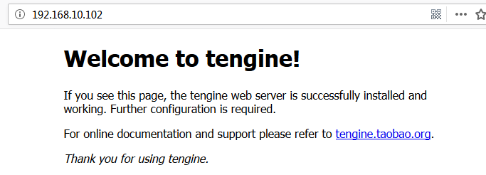
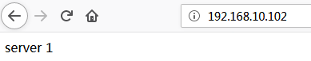
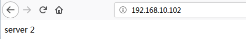

# [Nginx的“远方表哥”—Tengine](https://www.cnblogs.com/along21/p/10407979.html)

　　今天想起当初研究nginx反向代理负载均衡时，nginx自身的upstream后端配置用着非常不舒服； 当时使用的淘宝基于nginx二次开发的Tengine，今天总结一下。

## 1、认识Tengine

#### **1.1 介绍**

- Tengine是由淘宝网发起的Web服务器项目。它**在Nginx的基础**上，针对大访问量网站的需求，添加了很多高级功能和特性。它的目的是打造一个高效、安全的Web平台。
- Tengine的性能和稳定性已经在大型的网站如淘宝网，天猫商城等得到了很好的检验。
- 它的最终目标是打造一个高效、稳定、安全、易用的Web平台。
- 从2011年12月开始，Tengine成为一个开源项目。
- 现在，它由Tengine团队开发和维护。Tengine团队的核心成员来自于淘宝、搜狗等互联网企业。

 

#### **1.2 功能**

-  继承Nginx-1.6.2的所有特性，**兼容Nginx的配置**；
-  **动态模块加载（DSO）支持**。加入一个模块不再需要重新编译整个Tengine；
-  支持SO_REUSEPORT选项，**建连性能**提升为官方nginx的三倍；
-  支持SPDY v3协议，自动检测同一端口的SPDY请求和HTTP请求；
-  流式上传到HTTP后端服务器或FastCGI服务器，大量减少机器的I/O压力；
-  **更加强大的负载均衡能力**，包括一致性hash模块、会话保持模块，还可以对后端的服务器进行主动健康检查，根据服务器状态自动上线下线，以及动态解析upstream中出现的域名；
-  输入过滤器机制支持。通过使用这种机制Web应用防火墙的编写更为方便；
-  支持设置proxy、memcached、fastcgi、scgi、uwsgi在后端失败时的重试次数
-  动态脚本语言Lua支持。扩展功能非常高效简单；
-  支持管道（pipe）和syslog（本地和远端）形式的日志以及日志抽样；
-  支持按指定关键字(域名，url等)收集Tengine运行状态；
-  组合多个CSS、JavaScript文件的访问请求变成一个请求；
-  自动去除空白字符和注释从而减小页面的体积
-  自动根据CPU数目设置进程个数和绑定CPU亲缘性；
-  监控系统的负载和资源占用从而对系统进行保护；
-  显示对运维人员更友好的出错信息，便于定位出错机器；
-  更强大的防攻击（访问速度限制）模块；
-  更方便的命令行参数，如列出编译的模块列表、支持的指令等；
-  可以根据访问文件类型设置过期时间；

 

## 2、编译安装tengine

#### **2.1 下载指定版本**

官网：http://tengine.taobao.org/download.html

```
`[root@along app]``# wget http://tengine.taobao.org/download/tengine-2.2.3.tar.gz``[root@along app]``# tar -xvf tengine-2.2.3.tar.gz`
```

　　

#### **2.2 创建用户，下载依赖的安装包**

```
`[root@along app]``# groupadd nginx``[root@along app]``# useradd -s /sbin/nologin -g nginx -M nginx``[root@along app]``# yum -y install gc gcc gcc-c++ pcre-devel zlib-devel openssl-devel`
```

　　

#### **2.3 编译安装**

```
`[root@along app]``# cd tengine-2.2.3/``[root@along tengine]``# ./configure --user=nginx --group=nginx --prefix=/app/tengine --with-http_stub_status_module --with-http_ssl_module --with-http_gzip_static_module``[root@along tengine]``# make && make install``[root@along tengine]``# chown -R nginx.nginx /app/tengine``[root@along tengine]``# ll /app/tengine``total 8``drwxr-xr-x 2 nginx nginx 4096 Feb 20 14:55 conf``drwxr-xr-x 2 nginx nginx  40 Feb 20 14:50 html``drwxr-xr-x 2 nginx nginx 4096 Feb 20 14:50 include``drwxr-xr-x 2 nginx nginx  6 Feb 20 14:50 logs``drwxr-xr-x 2 nginx nginx  6 Feb 20 14:50 modules``drwxr-xr-x 2 nginx nginx  35 Feb 20 14:50 sbin`
```

注：

-  \#指定运行权限的用户  --user=nginx
-  \#指定运行的权限用户组  --group=nginx
-  \#指定安装路径  --prefix=/usr/local/nginx
-  \#支持nginx状态查询 --with-http_stub_status_module
-  \#开启ssl支持  --with-http_ssl_module
-  \#开启GZIP功能  --with-http_gzip_static_module

 

## 3、开启服务

#### **3.1 配置开机启动脚本**

```
`[root@along nginx]``# vim /usr/lib/systemd/system/nginx.service``[Unit]``Description=nginx - high performance web server``Documentation=http:``//nginx``.org``/en/docs/``After=network.target remote-fs.target nss-lookup.target` `[Service]``Type=forking``PIDFile=``/app/tengine/logs/nginx``.pid``ExecStartPre=``/app/tengine/sbin/nginx` `-t -c ``/app/tengine/conf/nginx``.conf``ExecStart=``/app/tengine/sbin/nginx` `-c ``/app/tengine/conf/nginx``.conf``ExecReload=``/bin/kill` `-s HUP $MAINPID``ExecStop=``/bin/kill` `-s QUIT $MAINPID``PrivateTmp=``true` `[Install]``WantedBy=multi-user.target`
```

　　

#### **3.2 启动服务**

```
`[root@along ~]``# systemctl start nginx``[root@along ~]``# ss -nutlp |grep 80``tcp  LISTEN   0   128    *:80          *:*          ``users``:((``"nginx"``,pid=4933,fd=6),(``"nginx"``,pid=4932,fd=6))`
```

网页访问验证



 

## 4、使用tengine的负载均衡功能

　　因为tengine的其他功能和nginx配置差不多，就不在演示了；主要演示，我认为较为方便的反向代理配置。

#### **4.1 配置反向代理**

tengine配置反向代理格式和haproxy很相似；

后端两台服务器事先自己准备好网页服务（nginx/httpd等都可以）

```
`[root@along tengine]``# cd /app/tengine/conf/``[root@along conf]``# vim nginx.conf``http {``... ...``#配置后端代理集群，默认是轮询算法``  ``upstream srv {``    ``server 192.168.10.101:80;``    ``server 192.168.10.106:80;``    ``check interval=3000 rise=2 fall=5 timeout=1000 ``type``=http;``    ``check_http_send ``"HEAD / HTTP/1.0\r\n\r\n"``;``    ``check_http_expect_alive http_2xx http_3xx;``  ``}``... ...``#在server端location反向代理``  ``server {``    ``location / {``      ``proxy_pass http:``//srv``;``    ``}``  ``}``... ...``}`
```

　　

#### **4.2 重启服务器，验证**

（1）验证配置是否有误

```
`[root@along tengine]``# ./sbin/nginx -t``nginx: the configuration ``file` `/app/tengine/conf/nginx``.conf syntax is ok``nginx: configuration ``file` `/app/tengine/conf/nginx``.conf ``test` `is successful`
```

　　

（2）重启服务器

```
`[root@along tengine]``# systemctl restart nginx`
```

　　

（3）网页访问验证



因为默认是轮询算法，所以刷新页面，就会轮询调度到后台2个网页服务器



 

## 5、nginx upstream模块调度算法详解

### **5.1 轮询**

　　轮询是upstream的**默认分配方式**，即每个请求按照时间顺序轮流分配到不同的后端服务器，如果某个后端服务器down掉后，能自动剔除。

```
`upstream srv {``    ``server 192.168.10.101:80;``    ``server 192.168.10.106:80;``}`
```

　　

### **5.2 weight加权轮询**

　　加权轮询，轮询的加强版，即可以指定**轮询比率**，weight和访问几率成正比，主要应用于后端服务器异质的场景下。

```
`upstream srv {``    ``server 192.168.10.101:80 weight=1;``    ``server 192.168.10.106:80 weight=2;``}`
```

　　

### **5.3 ip_hash** 

　　每个请求按照访问ip（即Nginx的前置服务器或者客户端IP）的**hash结果分配**，这样每个访客会固定访问一个后端服务器，可以解决session一致问题。

 

```
`upstream srv {``    ``ip_hash;``    ``server 192.168.10.101:80;``    ``server 192.168.10.106:80;``}`
```

**注意：**

-  当负载调度算法为ip_hash时，后端服务器在负载均衡调度中的状态不能是weight和backup。
-  导致负载不均衡。

 

### **5.4 fair** 

　　fair顾名思义，公平地按照**后端服务器的响应时间**（rt）来分配请求，响应时间短即rt小的后端服务器优先分配请求。如果需要使用这种调度算法，必须下载Nginx的upstr_fair模块。

```
`upstream srv {``    ``fair;``    ``server 192.168.10.101:80;``    ``server 192.168.10.106:80;``}`
```

　　

### **5.5 url_hash（目前用consistent_hash替代url_hash）**

　　与ip_hash类似，但是**按照访问url的hash结果来分配请求**，使得每个url定向到同一个后端服务器，主要应用于后端服务器为缓存时的场景下。

```
`upstream srv {``    ``server 192.168.10.101:80;``    ``server 192.168.10.106:80;``    ``hash` `$request_uri;``    ``hash_method crc32;``}`
```

-  其中，hash_method为使用的hash算法，需要注意的是：此时，server语句中不能加weight等参数。
-  提示：url_hash用途cache服务业务，memcached，squid，varnish。特点：每个rs都是不同的。
-  按访问url的hash结果来分配请求，让每个url定向到同一个后端服务器，**后端服务器为缓存服务器时效果显著**。在upstream中加入hash语句, server语句中不能写入weight等其他的参数，hash_ method是使用的hash算法。。
-  url_ hash.按访问ur1的hash结果来分配请求，使每个url定向到同-一个后端服务器，可以**进一步提高后端缓存服务器的效率命中率**。Nginx 本身是不支持ur1_ hash的，如果需要使用这种调度算法，必须安装Nginx的hash软件包。

 

## 6、upstream段用法介绍

（1）参数说明

-  server：关键字，必选。

-  address：主机名、域名、ip或unix socket，也可以指定端口号，必选。

-  parameters

    ：可选参数，可选参数如下：

    -  **down**：表示当前的server暂时不参与负载均衡。
    -  **backup**：预留的备份机器。当其他所有的非backup机器出现故障或者忙的时候，才会请求backup机器，因此这台机器的压力最轻。
    -  **weight**：默认为1.weight越大，负载的权重就越大。
    -  **max_fails**：允许请求失败的次数，默认为1。当超过最大次数时，返回proxy_next_upstream 模块定义的错误。
    -  **fail_timeout**：在经历了max_fails次失败后，暂停服务的时间。max_fails可以和fail_timeout一起使用。
    -  max_fails和fail_timeout一般会关联使用：如果某台server在fail_timeout时间内出现了max_fails次连接失败，那么Nginx会认为其已经挂掉了，从而在fail_timeout时间内不再去请求它，fail_timeout默认是10s，max_fails默认是1，即默认情况是只要发生错误就认为服务器挂掉了，如果将max_fails设置为0，则表示取消这项检查。

 

（2）举例说明如下：

```
`upstream backend {``  ``server  backend1.example.com weight=5;``  ``server  127.0.0.1:8080 max_fails=3 fail_timeout=30s;``  ``server  unix:``/tmp/backend3``;     ``}`
```