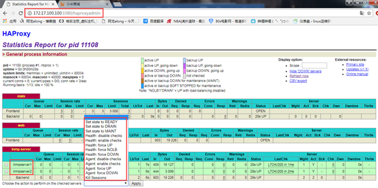
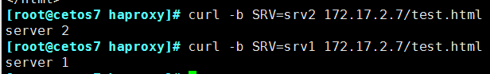
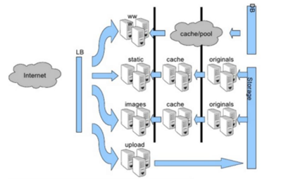
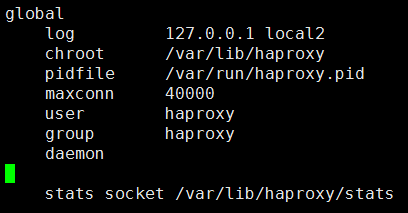
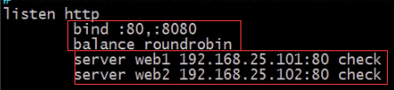
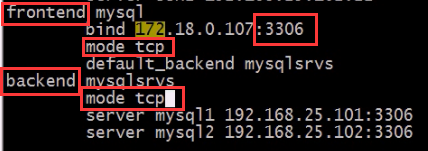
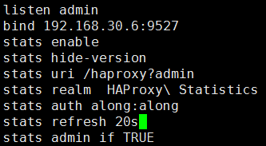
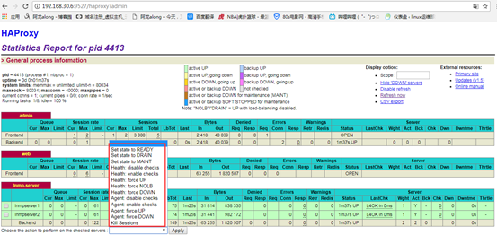
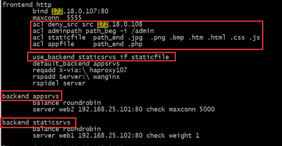

# 一、HAProxy实现高级负载均衡实战和ACL控制

 **haproxy实现高级负载均衡实战**

　　环境：随着公司业务的发展，公司负载均衡服务已经实现四层负载均衡，但业务的复杂程度提升，公司要求把mobile手机站点作为单独的服务提供，不在和pc站点一起提供服务，此时需要做7层规则负载均衡，运维总监要求，能否用一种服务同既能实现七层负载均衡，又能实现四层负载均衡，并且性能高效，配置管理容易，而且还是开源。

**实验前准备**：

① 两台服务器都使用yum 方式安装haproxy 和 keepalived 服务

yum -y install haproxy

yum -y install keepalived

② iptables -F && setenforing 清空防火墙策略，关闭selinux

  

## 实战一：实现基于Haproxy+Keepalived负载均衡高可用架构

### 1、环境准备：

| 机器名称              | IP配置                               | 服务角色           | 备注           |
| --------------------- | ------------------------------------ | ------------------ | -------------- |
| haproxy-server-master | VIP：172.17.100.100DIP：172.17.1.6   | 负载均衡器主服务器 | 配置keepalived |
| haproxy-server-backup | VIP：172.17.100.100DIP：172.17.11.11 | 负载服务器从服务器 | 配置keepalived |
| rs01                  | RIP：172.17.1.7                      | 后端服务器         |                |
| rs02                  | RIP：172.17.22.22                    | 后端服务器         |                |

 

### 2、先配置好keepalived的主从

（1）在**haproxy-server-master 上**：

vim /etc/keepalived/keepalived.conf

```json
! Configuration File for keepalived
global_defs {
   notification_email {
        root@localhost
   }
   notification_email_from root@along.com
   smtp_server 127.0.0.1
   smtp_connect_timeout 30
   router_id keepalived_haproxy
}

vrrp_script chk_haproxy {   #定义一个脚本，发现haproxy服务关闭就降优先级
        script "killall -0 haproxy"
        interval 2
        fall 2
        rise 2
        weight -4
}

vrrp_instance VI_1 {
    state MASTER
    interface eth0
    virtual_router_id 191
    priority 100
    advert_int 1
    authentication {
        auth_type PASS
        auth_pass along
    }
    virtual_ipaddress {
        172.17.100.100
    }
track_script {   #执行脚本
chk_haproxy
}
}
```

service keepalived start 开启keepalived服务

开启服务后可以查看，VIP已经生成


 

（2）在**haproxy-server-backup 从上**：只需把主换成从，优先级降低就好

vim /etc/keepalived/keepalived.conf

```
! Configuration File for keepalived
global_defs {
   notification_email {
        root@localhost
   }
   notification_email_from root@along.com
   smtp_server 127.0.0.1
   smtp_connect_timeout 30
   router_id keepalived_haproxy
}


vrrp_instance VI_1 {
    state BACKUP
    interface eth0
    virtual_router_id 191
    priority 98
    advert_int 1
    authentication {
        auth_type PASS
        auth_pass along
    }
    virtual_ipaddress {
        172.17.100.100
    }
}
```

 

service keepalived start 开启keepalived服务

 

**3、配置haproxy ，总共有两大段，和第二大段的4小段，两个haproxy可以配置的一样**

（1）第一大段：global 全局段

```
global
    log         127.0.0.1 local2
    chroot      /var/lib/haproxy
    pidfile     /var/run/haproxy.pid
    maxconn     40000
    user        haproxy
    group       haproxy
    daemon
    stats socket /var/lib/haproxy/stats
```

（2）第二大段：proxies 对代理的设定

```
① defaults 默认参数设置段
defaults
    mode                    http
    log                     global
    option                  httplog
    option                  dontlognull
    option http-server-close
    option forwardfor       except 127.0.0.0/8
    option                  redispatch
    retries                 3
    timeout http-request    10s
    timeout queue           1m
    timeout connect         10s
    timeout client          1m
    timeout server          1m
    timeout http-keep-alive 10s
    timeout check           10s
    maxconn                 3000

② listen 段
listen stats
bind 0.0.0.0:1080
stats enable
stats hide-version
stats uri /haproxyadmin
stats auth along:along
stats admin if TRUE

③ frontend 与客户端建立连接，打开服务监听端口段
frontend  web
bind :80
default_backend         lnmp-server

④ backend 与后端服务器联系段
backend lnmp-server
    balance     roundrobin
    option      httpchk GET /index.html
    server  lnmpserver1 172.17.1.7:80 check inter 3000 rise 3 fall 5
    server  lnmpserver2 172.17.22.22:80 check inter 3000 rise 3 fall 5
```

 

开启服务 service haproxy start

 

### 4、在后端server·打开事先准备好的web server

systemctl start nginx

systemctl start php-fpm

systemctl start mariadb

 

### 5、测试

（1）网页访问 http://172.17.100.100:1080/haproxyadmin 进入状态监控页面，可以控制自己的后端服务



 

（2）可以坏2台不是一组的机器

一台后端server宕机，haproxy会调度到另一个server，继续提供服务

一个主的haproxy宕机，keepalived会把VIP漂移到从上，继续提供服务


 

## 实战二：基于ACL控制实现动静分离

**原理：**acl：访问控制列表，用于实现**基于请求报文的首部**、**响应报文的内容**或**其它**的环境状态信息来做出转发决策，这大大增强了其配置弹性。其配置法则**通常分为两步**，首先去**定义ACL** ，即定义一个测试条件，而后**在条件得到满足时执行某特定的动作**，如阻止请求或转发至某特定的后端。

### 1、环境准备：

 

| 机器名称       | IP配置              | 服务角色   | 备注                  |
| -------------- | ------------------- | ---------- | --------------------- |
| haproxy-server | 172.17.2.7          | 负载均衡器 | 配置keepalivedACL控制 |
| rs01           | RIP：192.168.30.107 | 静态服务器 | 小米网页              |
| rs02           | RIP：192.168.30.7   | 动态服务器 | 小米网页              |

### 2、在haproxy 上定义ACL和后端服务器

vim /etc/haproxy/haproxy.cfg  前面global 全局段和default 段不用修改

```
① 定义web 监控页面
listen stats
bind 0.0.0.0:1080
stats enable
stats hide-version
stats uri /haproxyadmin
stats auth along:along
stats admin if TRUE

② 在frontend 段定义ACL
frontend web
        bind :80
        acl staticfile path_end .jpg .png .bmp .htm .html .css .js
        acl appfile path_end .php
        use_backend staticsrvs if staticfile
        default_backend appsrvs

③ 设置backend 后端集群组
backend staticsrvs
        balance roundrobin
        server staticweb 192.168.30.107:80 check inter 3000 rise 3 fall 3

backend appsrvs
        balance roundrobin
        server appweb 192.168.30.7:80 check inter 3000 rise 3 fall 3
```

 

### 3、开启后端web服务

systemctl start nginx

systemctl start php-fpm

systemctl start mariadb

 

### 4、测试结果

（1）后端服务器正常时


web 检测页面，一切正常


 

（2）当后端静态页面服务集群宕机，显示不出静态页面，说明动静分离成功

 

 

## 实战三：基于ACL实现权限控制及会话保持

### 1、环境准备：

 

| 机器名称       | IP配置              | 服务角色   | 备注                  |
| -------------- | ------------------- | ---------- | --------------------- |
| haproxy-server | 172.17.2.7          | 负载均衡器 | 配置keepalivedACL控制 |
| rs01           | RIP：192.168.30.107 | 后端服务器 | 小米网页              |
| rs02           | RIP：192.168.30.7   | 后端服务器 | 小米网页              |

### 2、这haproxy 上定义ACL和后端服务器

vim /etc/haproxy/haproxy.cfg  前面global 全局段和default 段不用修改

```
① 定义web 监控页面
listen stats
bind 0.0.0.0:1080
stats enable
stats hide-version
stats uri /haproxyadmin
stats auth along:along
stats admin if TRUE

② 在frontend 段定义ACL，用户权限控制
frontend web
        bind :80
        acl allow_src src 172.17.0.0/16
        block unless allow_src
        default_backend appsrvs

③ 设置backend 后端集群组，设置cookie，会话保持
backend staticsrvs
        balance roundrobin
        cookie SRV insert nocache
        server appweb1 192.168.30.107:80 check inter 3000 rise 3 fall 3 cookie srv1
        server appweb2 192.168.30.7:80 check inter 3000 rise 3 fall 3 cookie srv2
```

 

### 3、开启后端web服务

systemctl start nginx

systemctl start php-fpm

systemctl start mariadb

 

### 4、检测结果

（1）检测权限控制

① 在172.17.0.0 段的机器访问，正常

 

 ② 在这个网段外的机器访问，拒绝

 

 

（2）检测会话保持

① 分别在两个后端创建两个测试页面

vim ../test.html

server 1/2

② 测试

curl 测试需加-b SRV= 指定的对应cookie访问

curl -b SRV=srv1 172.17.2.7/test.html

curl -b SRV=srv2 172.17.2.7/test.html

 

 

## 实战四：实现haproxy的ssl加密

### 1、自签生成证书

cd /etc/pki/tls/certs

make /etc/haproxy/haproxy.pem


ls /etc/haproxy/haproxy.pem 确实生成了证书和秘钥的文件

 

### 2、在haproxy 中设置

```
frontend  web
        bind :80
        bind :443 ssl crt /etc/haproxy/haproxy.pem   监听443端口，且是ssl加密
        redirect scheme https if !{ ssl_fc }    实现302重定向，将80跳转到443端口
```

### 3、网页访问 https://172.17.11.11/


 

# 二、HAProxy 反向代理负载均衡

## 一、企业服务架构图及负载均衡的要求

1、场景说明

　　在企业生产环境中，每天会有很多的需求变更，比如**增加服务器**、**新业务上线、url路由修改、域名配置**等等，对于**前端负载均衡**设备来说，**容易维护，复杂度低**，是**首选指标**。在企业中，稳定压倒一切，与其搞得很复杂，经常出问题，不如做的简单和稳定。

　　在企业中，**90%以上的故障，来源于需求变更**。可能是程序bug，也可能是人为故障，也可能是架构设计问题等等。前端负载均衡设备为重中之重，在软件选型上一定充分考虑，能满足业务的前提下，**尽可能降低复杂度，提高易维护性。**

 

2、企业服务架构图



**3、四层和七层负载均衡的区别**

**四层：**

通过分析**IP层及TCP/UDP层**的流量实现的**基于"IP+端口"**的负载均衡。

**七层：**

可以根据内容，再配合负载均衡算法来选择后端服务器，**不但可以根据"ip+端口"方式**进行负载分流，还可以根据**网站的URL，访问域名，浏览器类别，语言**等决定负载均衡的策略。**七层**负载均衡模式下，**负载均衡与客户端及后端的服务器会分别建立一次TCP连接**，而在**四层**负载均衡模式下(DR)，**仅建立一次TCP连接**；七层负载均衡对负载均衡设备的要求更高，处理能力也低于四层负载均衡。

 

## 二、haproxy介绍

1、定义

（1）HAProxy是一个使用**C语言编写**的自由及开放源代码软件，其提供高性能性、负载均衡，以及基于TCP和HTTP的应用程序代理。相较与 Nginx，HAProxy **更专注与反向代理**，因此它可以支持**更多的选项**，**更精细的控制**，**更多的健康状态检测机制**和**负载均衡算法****。**

（2）HAProxy特别适用于那些**负载特大的web站点**，**这些站点**通常又**需要会话保持或七层处理**。HAProxy运行在当前的硬件上，完全可以**支持数以万计的并发连接**。并且它的运行模式使得它可以很简单安全的整合进您当前的架构中， 同时可以保护你的web服务器不被暴露到网络上。

（3）包括 GitHub、Bitbucket、Stack Overflow、Reddit、Tumblr、Twitter在内众多知名网站，及亚马逊网络服务系统都使用了HAProxy

 

2、haproxy的功能

HAProxy 是TCP / HTTP **反向代理服务器**，尤其适合于高可用性环境

① 可以针对HTTP 请求添加**cookie ，进行路由后端服务器**

② 可平衡负载至后端服务器，并**支持持久连接**

③ 支持**基于cookie 进行调度**

④ 支持所有**主服务器故障切换至备用**服务器

⑤ 支持**专用端口实现监控服务**

⑥ 支持**不影响现有连接情况下停止接受新连接请求**

⑦ 可以在**双向添加**，修改或删除HTTP 报文首部

⑧ 支持**基于pattern** 实现连接请求的访问控制

⑨ 通过**特定的URI** 为授权用户提供详细的状态信息

⑩ 支持http 反向代理，支持动态程序的反向代理，支持基于数据库的反向代理

版本：1.4 1.5 1.6 1.7 1.8

 

3、Haproxy的特性

① **可靠性与稳定性**都非常出色，可与硬件级设备媲美。

② **支持连接拒绝**，可以用于防止DDoS攻击

③ **支持长连接、短连接和日志功能**，可根据需要**灵活配置**

④ 路由HTTP请求到后端服务器,基于**cookie作会话绑定**；同时**支持**通过获取指的**url来检测后端服务器的状态**

⑤ HAProxy还拥有功能强大的**ACL支持**，可**灵活配置路由功能，实现动静分离**，在架构设计与实现上带来很大方便

⑥ **可支持四层和七层负载均衡**，几乎能为所有服务常见的提供负载均衡功能

⑦ 拥有功能强大的**后端服务器的状态监控web页面**，可以实时了解设备的运行状态，还**可实现设备上下线等简单操作**。例：cobbler、samba、httpd

⑧ **支持多种负载均衡调度算法，并且也支持session保持**。

 

4、Haproxy安装方式

（1）Haproxy安装常用两种方式，yum安装和源码包安装

（2）yum 安装：通常是在线安装，好处是安装方式简单，不易出错；常用的安装yum源为epel

（3）源码包安装：是先将 Haproxy 的源码下载下来，在自己的系统里编译生成可执行文件，然后执行，好处是因为是在自己的系统上编译的，更符合自己系统的性能，也就是说在自己的系统上执行 Haproxy服务性能效率更好。

（4）区别：**路径和启动方式不同，支持的模块也不同**。

 

5、Haproxy程序路径

主程序：/usr/sbin/haproxy

**主配置文件：/etc/haproxy/haproxy.cfg**

Unit file：/usr/lib/systemd/system/haproxy.service（centos7）

Init.file :/etc/init.d/haproxy （centos6）

 

## 三、Haproxy配置文件结构

### 1、格式介绍

haproxy 的配置文件由**两大部分**组成：

　　**全局设定（globalsettings）**和 **对代理的设定（proxies）**

（1）global settings：主要用于定义haproxy进程管理安全及性能相关的参数

 

（2）proxies共分为4段：defaults，frontend，backend，listen

① **defaults** <name>：为其它配置段提供**默认参数**，下面的段可以**继承**默认参数；默认配置参数可由**下一个"defaults"重新设定**。

② **frontend** <name>：定义一系列**监听的套接字**，这些套接字可**接受客户端请求并与之建立连接**。**可以监听多个端口**，例：监听80和3306端口，80请求给后端的web服务器，3306请求给后端的数据库服务器

③ **backend** <name>：定义"后端"服务器，前端代理服务器将会**把客户端的请求调度至这些服务器**。

④ **listen** <name>：定义监听的套接字和后端的服务器。**类似于将frontend和backend段放在一起，适用于一对一环境**

 

**（3）注意**：

**① 后端的real server可以属于多个backend组**，一个backend可以包括一个或多个real server

② frontend 可以交叉调用backend


 

### 2、 global 全局配置参数

（1）和进程安全相关的设置

① **nbproc** <number> 要启动的haproxy 的**进程数量**，系统默认单进程，要求使用daemon 模式；和linux的cpu数相关，lscpu可以查看cpu数

② ulimit-n <number> 每个haproxy 进程**可打开的最大文件数**，**系统自动会指定，不建议设置**

③ **daemon 后端守护方式运行**，建议使用

④ user 执行进程的用户

⑤ group 执行进程的组

 

（2）**log 日志**的设置

a）日志存放在haproxy的本机上

① vim /etc/**rsyslog**.conf 在日志服务的配置文件中自定义一条存放haproxy 日志的设置

**local2.\*　　 /var/log/haproxy.log**

service rsyslog restart 重启日志服务

② 在haproxy的全局段设置日志

log 　　 **127.0.0.1 local2** 日志存放在本机

 

b）日志存放在远程的机器上

① vim /etc/**rsyslog**.conf

$ModLoad imudp 　　远方存放日志的模块打开

$UDPServerRun 514 　　打开的监听端口

local2.* 　　/var/log/haproxy.log

② 在haproxy的全局段设置日志

log 　　 **172.17.22.22 local2** 日志存放在远程服务器上

 

c）将特定信息记录在日志中，略

① 捕获的请求和响应报文中的 cookie 并记录日志

capture **cookie** <name> len <length>

② 捕获请求报文中指定的首部并记录日志

capture **request** header <name> len <length>

　　示例:capture request header X-Forwarded-For len 15

③ 捕获响应报文 中指定的首部并记录 日志

capture **response** header <name> len <length>

　　示例：

　　capture response header Content-length len 9

　　capture response header Location len 15

 

（3）性能调整，优化

**① maxconn** <number>： 设置每个haproxy 进程所能接受的**最大并发连接数**

② maxconnrate <number> ：设置每个进程**每秒**种所能建立的**最大连接数量**，速率，一个连接里可以有多个会话，也可以没有会话

③ maxsessrate <number> ：设置每个进程**每秒**种所能建立的**最大会话数量**

④ maxsslconn <number>：每进程支持**SSL 的最大连接数量**

⑤ spread-checks <0..50, in percent>：**健康检测延迟时长**比建议2-5 之间

 

（4）例：

```
global
    log         127.0.0.1 local2
    chroot      /var/lib/haproxy
    pidfile     /var/run/haproxy.pid
    maxconn     40000
    user        haproxy
    group       haproxy
    daemon
    stats socket /var/lib/haproxy/stats
```



 

### 3、代理配置段，4小段的格式

（1）defaults相关的配置

```
defaults
　　mode http   #实现http的7层规则
　　log global    #日志定义
　　option httplog   #启用日志记录HTTP请求，默认haproxy日志记录是不记录HTTP请求
　　option dontlognull   #日志中将不会记录空连接。
　　option httpclose   # 强制短连接，每次收发完包后都把连接关闭
　　option forwardfor   #添加xforward日志标记
　　retries 3   # 定义连接后端服务器的失败重连次数
　　timeout http-request 10s   # 请求超时
　　timeout queue 1m  #队列超时
　　timeout connect 10s   #连接超时
　　timeout client 1m  #客户端超时
```


 

（2）frontend 相关的配置

"frontend"段用于定义一系列监听的套接字，这些套接字可接受客户端请求并与之建立连接

```
例：frontend main *:5000
    acl url_static path_beg -i /static /images     /javascript/stylesheets
　　acl url_static path_end -i .jpg .gif .png .css .js
　　use_backend static    if url_static
　　default_backend        app
```


（3）backend 相关的配置

"backend"段用于定义一系列"后端"服务器，代理将会将对应客户端的请求转发至这些服务器。

```
例：backend app
　　balance roundrobin
　　server app1 127.0.0.1:5001 check
　　server app2 127.0.0.1:5002 check
　　server app3 127.0.0.1:5003 check
　　server app4 127.0.0.1:5004 check
```

 


（4）listen 相关的配置

listen段通过关联"前端"和"后端"定义了一个完整的代理，frontend和backend 块的结合体



  

## 四、Haproxy配置文件选项详解

### 1、bind：定义监听套接字，指定一个或多个前端侦听地址和端口

（1）格式：

bind [<**address**>]:<**port**_range> [**,** ...] 多个可以以，隔开

bind [<address>]:<port_range> [, ...] interface <interface>

 

（2）此指令仅能用于**frontend和listen**区段，用于定义一个或几个监听的套接字。

① <address>：可选选项，其可以为**主机名、IPv4地址**、IPv6地址或*；省略此选项、将其指定为***或0.0.0.0**时，将监听当前系统的所有IPv4地址；

② <port_range>：可以是一个特定的TCP**端口**，也可是一个端口范围(如5005-5010)，代理服务器将通过指定的端口来接收客户端请求；需要注意的是，每组监听的套接字

③ <address:port>在同一个实例上只能使用一次，而且小于1024的端口需要有特定权限的用户才能使用，这可能需要通过uid参数来定义；

④ <interface>：指定**物理接口**的名称，仅能在Linux系统上使用；其不能使用接口别名，而仅能使用物理接口名称，而且只有管理有权限指定绑定的物理接口；

 

（3）示例

listen http_proxy

　　bind :80,:443

　　bind 10.0.0.1:10080,10.0.0.1:10443

 

### 2、mode { tcp|http|health } 实例运行模式

**设定实例的运行模式或协议**。当实现内容交换时，**前端和后端必须工作于同一种模式**(一般说来都是HTTP模式)，否则将无法启动实例。可以放在任何4段中 default frontent backent listen

① **tcp**：实例运行于**纯TCP模式**，在客户端和服务器端之间将建立一个全双工的连接，且**不会对7层报文做任何类型的检查**，通常用于SSL、SSH、SMTP等应用；

② **http**：实例运行于HTTP模式，7层，客户端请求在转发至后端服务器之前将被深度分析，所有不与RFC格式兼容的请求都会被拒绝；**centos实际默认模式**

③ **health**：实例工作于health模式，其对入站请求**仅响应"OK"信息并关闭连接**，且不会记录任何日志信息；此模式将用于响应外部组件的健康状态检查请求；目前来讲，此模式已经废弃，因为tcp或http模式中的monitor关键字可完成类似功能；可以用于测试

 

（2） mode tcp

tcp-request connection {accept|reject} [{if | unless} <condition>] 根据第4层条件对传入连接执行操作

例：ssh 的远程调度


mysql 的远程调度



 

### 3、balance 分配算法策略

格式：balance <algorithm> [ <arguments> ]

定义负载均衡算法，可用于**"defaults"、"listen"和"backend"**。<algorithm>用于在负载均衡场景中挑选一个server，其仅应用于用户新请求或需要将一个连接重新派发至另一个服务器时。支持的算法有：

（1）不含hash的算法

① **roundrobin**：基于**权重进行轮叫**，在服务器的处理时间保持均匀分布时，这是最平衡、最公平的算法。此算法是**动态的**，这表示其权重可以在运行时进行调整，不过，在设计上，每个后端服务器仅能最多接受4128个连接；

　　特点：**动态算法**，支持**权重的运行时调整**，支持**慢启动**；每个后端backend 中最多支持4095 个server，**有上限**

② **static-rr**：基于权重进行轮叫，与roundrobin类似，但是为静态方法，在运行时调整其服务器权重不会生效；不过，其在后端服务器连接数上没有限制；

　　特点：**静态算法**，**不支持权重的运行时调整**及，**不支持慢启动（不好用）**；后端主机数量**无上限**

 

③ **leastconn**：新的连接请求被派发至具有**最少连接数目**的后端服务器；在有着**较长时间会话**的场景中推荐使用此算法，如LDAP、SQL数据库等，其并不太适用于较短会话的应用层协议

④ **first**：根据服务器在列表中的位置，**自上而下进行调度**；**前面服务器的连接数达到上限**，**新请求才会分配给下一台服务**；

 

（2）含hash的算法

⑤ source ：源地址hash，新连接先按权重分配，后续连接按source 分配请求，用的不多

 

⑥ **uri**：对**URI 的左半部分**或**整个uri** 做hash 计算，并除以服务器总权重取模，以后派发至某挑出的服务器，**适用于后端缓存服务器**

例：<scheme>://<user>:<password>@<host>:<port>**/<path>;<params>**?<query>#<frag>

　　左半部分：/<path>;<params>

　　整个uri ：/<path>;<params>?<query>#<frag>

 

⑦ **url_param**：对用户请求的uri 中的<params> **部分中的参数的值**作hash 计算，并由**服务器总权重相除**以后派发至某挑出的服务器；**通常用于追踪用户**，以确保来自**同一个用户的请求始终发往同一个Backend Server**

例：http://www.magedu.com/bbs/hello;**type=title （这个参数相当于用户的id）**

 

（3）hdr的算法，了解

**hdr**(<name>) ：对于每个http 请求，此处由<name> 指定的**http 首部**将会被取出做hash； 计算； 并由服务器总权重相除以后派发至某挑出的服务器； 无有效值的会被轮询调度 hdr(Cookie)

rdp-cookie 远程桌面相关

rdp-cookie(<name>)

 

（4）设置默认权重

default-server weight 10


 

 

### 4、server：定义后端主机的各服务器及其选项

（1）格式

**server** <**name**> <**address**>[:[port]] [**param***]

① <name> ：服务器在haproxy 上的内部名称；出现在日志及警告信息；如果设定了"http-send-server-name"，它还将被添加至发往此服务器的请求首部中；

② <address> ：服务器地址，支持使用主机名，只不过在启动时需要解析主机名至相应的IPv4地址；

③ [:[port]] ：指定将连接请求所发往的此服务器时的目标端口，其为可选项；未设定时，将使用客户端请求时的同一相端口；

④ [param*] ：参数，下面仅说明几个常用的参数；

 

（2）参数**param**

**① weight** <weight>：**权重**，默认为1，**最大值为256**，**0表示不参与负载均衡**；

**② backup**：设定为**备用服务器**，仅在负载均衡场景中的其它server均不可用于启用此server；

**③ check**：启动对此server执行**健康状态检查**，其可以借助于额外的其它参数完成更精细的设定，如：

　　addr：检测时使用的IP 地址，可以不为real server的ip

　　port：针对此端口进行检测

　　**inter** <delay>：设定**健康状态检查的时间间隔**，**单位为毫秒**，默认为2000；也可以使用fastinter和downinter来根据服务器端状态优化此时间延迟；

　　**rise** <count>：设定健康状态检查中，某离线的server从**离线状态**转换至**正常状态**需要**成功检查的次数；**

　　**fall** <count>：确认server从**正常状态**转换为**不可用状态**需要**检查的次数**；

例：

```
例：
backend lnmp-server
    balance     roundrobin
    server  sorryserver 172.17.1.6:80 backup
    server  lnmpserver1 172.17.1.7:80 weight 1 check inter 3000 rise 3 fall
    server  lnmpserver2 172.17.22.22:80 weight 2 check inter 3000 rise 3 fall
```

 


 

④ **cookie** <value>：为指定server设定cookie值，此处指定的值将在请求入站时被检查，第一次为此值挑选的server将在后续的请求中被选中，其**目的在于实现持久连接的功能**；

例：

```
cookie  SRV insert nocache   先定义，下边才能使用；insert插入报文首部，nocache不缓存，安全
server  lnmpserver2 172.17.1.7:80 check inter 3000 rise 3 fall 5 cookie srv1
server  lnmpserver2 172.17.22.22:80 check inter 3000 rise 3 fall 5 cookie srv2
```

 

注意：curl 测试需加-b SRV= 指定的对应cookie访问，如：curl **-b SRV=srv1** 172.17.11.11

 

**⑤ maxconn** <maxconn>：指定**此服务器**接受的**最大并发连接数**；如果发往此**服务器的连接数**目**高于**此处**指定的值**，其将被**放置于请求队列**，以等待其它连接被释放；

**注意**：此处是放在backend 段的server 后，是后端服务器的最大并发连接数；

也可**放在frontend 段**，设置前端的最大并发连接数

 

⑥ maxqueue <maxqueue>：设定**请求队列的最大长度**；

⑦ backlog <backlog> ：当server 的连接数达到上限后的**后援队列长度**

 

⑧ observe <mode>：通过观察服务器的通信状况来判定其健康状态，默认为禁用，其支持的类型有"layer4"和"layer7"，"layer7"仅能用于http代理场景；

⑨ **redir** <prefix>：启用**重定向功能**，将发往此服务器的GET和HEAD请求均以**302状态码**响应；需要注意的是，在prefix后面不能使用/，且不能使用相对地址，以免造成循环；

　　例如：server srv1 172.16.100.6:80 **redir http://**www.baidu.com

　　若用curl查询，记得加-L 跳转；curl -L 172.17.11.11

⑩ disabled：标记为不可用

 

### 5、stats 状态监测web页面

可以放在任何4段中 default frontent backent listen

```
stats enable    #启用统计页；基于默认的参数启用stats page
stats uri   /haproxy?stats（默认值）    #自定义stats page uri
stats hide-version    #隐藏统计报告版本信息
stats realm  HAProxy\ Statistics    #页面登陆信息
stats auth  user:passwd    #验证账号和密码信息
stats refresh 20s     #设定自动刷新时间间隔
stats admin if TRUE    #如果验证通过，启用stats page 中的管理功能 
```



打开状态访问页面 http://192.168.30.6:9527/haproxy?admin


能监控和管理



 

### 6、option httpchk 健康状态监测

（1）解释

对后端服务器做http 协议健康状态检测：通常用于backend

在default、backend、listen使用，禁止在frontend使用

定义基于http 协议的7 层健康状态检测机制

 

（2）格式：

**option httpchk** 默认为：/ OPTIONS HTTP/1.0

option httpchk <uri>

option httpchk <method> <uri>

option httpchk <method> <uri> <version>

http-check expect [!] <match> <pattern> 期望得到的 http协议健康状态检测响应内容或指定**响应码**

（3）例：

option httpchk **GET** **/index.html** **HTTP/1.1**\r\n**host: #**检测后端的index.html页面，构造响应报文首部，HTTP/1.1 协议版本，/n换行

http-check **expect status 200** #返回的响应码为200是正常，接受不到200，就不再给后端server调度


### 7、forwardfor 配置

（1）分析：后端收到服务的请求是haproxy的，所以日志记录的请求ip也是haproxy的；如我们想要记录真实client 的ip，需加forwardfor 选项；

在由haproxy 发往后端主机的请求报文中添加"X-Forwarded-For" 首部，其值为前端客户端的地址；用于向后端主发送真实的客户端IP

（2）格式

**option forwardfor** [ except <network> ] [ header <name> ] [ if-none ]

　　[ except <network> ] ：请求报请来自此处指定的网络时不予添加此首部，如haproxy 自身所在网络

　　[ **header** <name> ] ：使用自定义的首部名称，而非**默认的"X-Forwarded-For"**

　　[ if-none ] 如果没有首部才添加首部，如果有使用默认值

（3）为指定的MIME 类型启用压缩传输功能

　　compression algo <algorithm> ... ：启用http 协议的压缩机制，指明压缩算法gzip, deflate

　　compression type <mime type> ... ：指明压缩的MIMI 类型

（4）例：option forwardfor except 127.0.0.0/8

还需在nginx、httpd服务的日志格式中加上"$http_**x_forwarded_for**" ，才能记录client 的ip


 

### 8、 errorfile、errorloc 自定义错误页

(1)**errorfile** <code> <file> 自定义作为页面

　　<code> ：HTTP status code.

　　支持200, 400, 403, 408, 500, 502, 503, 504.

　　<file> ：错误页文件路径，当然，需在haproxy上事先准备好

　　　　mkdir /etc/haproxy/error_pages

　　　　echo Custom ERROR 503 > /etc/haproxy/error_pages/503.html 定制503错误

示例：

errorfile 503 /etc/haproxy/error_pages/503.html

 

(2)**errorloc** <code> <url> 重定向到其他页面

相当于errorloc302 <code> <url> ，利用302 重定向至指URL

示例：

errorloc 503 http://www.baidu.com/error_pages/503.html

 

### 9、修改报文首部

① 在**请求**报文尾部**添加指定首部**

**reqadd** <string> [{if | unless} <cond>]

② 在**响应**报文尾部添加指定首部

**rspadd** <string> [{if | unless} <cond>]

示例：reqadd **X-via**:\ haproxy01 \ 转译空格

在后端server nginx上日志格式加上这条 "$http_x_via"

rspadd Server:\ alonginx 伪造报文首部，加个假的版本信息

 

③ 从请求报文中删除匹配正则表达式的首部

**reqdel** <search> [{if | unless} <cond>]

**reqidel** <search> [{if | unless} <cond>] **i不分大小写**

④ 从响应报文中删除匹配正则表达式的首部

**rspdel** <search> [{if | unless} <cond>]

rspidel <search> [{if | unless} <cond>] 不分大小写

示例： **rspidel server.\*** 删除报文首部的版本信息

 

### 10、连接超时

① timeout client <timeout>

客户端最长空闲连接超时时长 默认单位是毫秒

② timeout server <timeout>

后端服务器最长空闲连接超时时长

③ timeout http-keep-alive <timeout>

持久连接的持久时长

④ timeout http-request <timeout>

一次完整的HTTP 请求的最大等待时长

⑤ timeout connect <timeout>

成功连接后端服务器的最大等待时长

⑥ timeout client-fin <timeout>

客户端半连接的空闲时长

⑦ timeout server-fin <timeout>

后端服务器半连接的空闲时长

 

## 五、haproxy中的ACL

1、定义

acl：访问控制列表，用于实现**基于请求报文的首部**、**响应报文的内容**或**其它**的环境状态信息来做出转发决策，这大大增强了其配置弹性。其配置法则**通常分为两步**，首先去**定义ACL** ，即定义一个测试条件，而后**在条件得到满足时执行某特定的动作**，如阻止请求或转发至某特定的后端。

 

**2、acl定义的格式**

acl <aclname> <criterion> [flags] [operator] [<value>] ...

① <aclname> 必须：ACL 名称，**区分字符大小写**，且其**只能包含大小写字母、数字、-( 连接线) 、_( 下划线) 、.( 点号) 和:( 冒号)** ；haproxy 中，acl 可以重名**，重名是或的关系**

② <criterion> 必须：**测试标准**，即对什么信息发起测试；测试方式可以由[flags] 指定的标志进行调整；而有些测试标准也可以需要为其在<value> 之前指定一个操作符[operator]

③ [flags] 非必须

　　**-i 不区分大小写**

　　-m 使用指定的pattern 匹配方法

　　-n 不做DNS 解析

　　-u 强制每个ACL 必须 唯一ID ，否则多个同名ACL 或关系

　　-- 强制flag 结束. 当字符串和某个flag 相似时使用

④ [operator] 非必须

匹配整数值：eq 、ge 、gt 、le 、lt

匹配字符串：

　　- exact match (-m **str**) : 字符串必须**完全匹配**模式，**默认**

　　- substring match (-m **sub**) : 在**提取的字符串**中查找模式 ，如果其中任何一个被发现，ACL将 将 匹配

　　- prefix match (-m **beg**) : 在提取的字符串**首部**中查找模式，如果其中任何一个被发现，ACL 将匹配

　　- suffix match (-m **end**) : 将模式与提取字符串的**尾部**进行比较，如果其中任何一个匹配，则ACL 进行匹配

　　- subdir match (-m dir) : 查看提取出来的用斜线分隔（ "/" ）的字符串， 如果其中任何一个匹配，则ACL 进行 匹配

　　- domain match (-m dom) : 查找提取的用点（"." ）分隔字符串，如果 其中任何一个匹配，则ACL 进行

 

⑤ <value> 的类型：必须

\- boolean

\- integer or integer range

\- IP address / network

\- string (exact, substring, suffix, prefix, subdir, domain)

\- regular expression

\- hex block


 

**3、criterion 标准**

（1） base : string 返回第一个主机头和请求的路径部分的连接，该请求**从第一个斜杠开始，并在问号之前结束,** 对**虚拟主机**有用

<scheme>://<user>:<password>@**<host>:<port>**/**<path>;<params>**?<query>#<frag>

base : exact string match 确切的字符串匹配

base_**beg** : prefix match **前缀**匹配

base_**dir** : subdir match **子目录**匹配

base_**dom** : domain match **域**匹配

base_**end** : suffix match **后缀**匹配

base_len : length match 长度匹配

base_reg : regex match 正则表达式匹配

base_sub : substring match 子串匹配

 

（2） **path** : string 提取请求的**URL 路径**，该路径从第一个斜杠开始，并在问号之前结束（无主机部分）

<scheme>://<user>:<password>@<host>:<port>/**<path>;<params>**?<query>#<frag>

path : exact string match

**path_beg** : prefix match

**path_dir** : subdir match

path_dom : domain match

**path_end** : suffix match

path_len : length match

path_reg : regex match

path_sub : substring match

 

例：

① acl adminpath path_beg /admin 以admin开头的

block if deny_src adminpath 都拒绝访问

② acl imagefile path_end -i .bmp .jpg .png .gif .jpeg 以图片后缀结尾的，不区分大小写

use_backend imagesrvs if imagefile 都给imagesrvs 为名的backend后端server 处理



 

（3） url : string 提取请求中的URL。一个典型的应用是具有**预取能力的缓存**，以及需要从数据库聚合多个信息并将它们保存在缓存中的网页门户入口

url : exact string match

url_beg : prefix match

url_dir : subdir match

url_dom : domain match

url_end : suffix match

url_len : length match

url_reg : regex match

url_sub : substring match

 

（4） **req.hdr**([<name>[,<occ>]]) : string 提取在一个**HTTP 请求报文的首部**

**hdr**([<name>[,<occ>]]) : exact string match

**hdr_beg**([<name>[,<occ>]]) : prefix match

**hdr_dir**([<name>[,<occ>]]) : subdir match

**hdr_dom**([<name>[,<occ>]]) : domain match

**hdr_end**([<name>[,<occ>]]) : suffix match

hdr_len([<name>[,<occ>]]) : length match

hdr_reg([<name>[,<occ>]]) : regex match

hdr_sub([<name>[,<occ>]]) : substring match 子串匹配

示例：

① acl bad_curl **hdr_sub**(**User-Agent**) -i curl 以curl 访问的

block if bad_curl 都拒绝

② acl phphost hdr(host) php.magedu.com 访问php的域名

use_backend srvs1 if wwwhost 都给对应的后端server组处理


能实现多个域名的分离


 

**4、引用执行acl 的设置**

① **use_backend** <**backend**> [{**if** | unless} <**condition**>]

当if/unless 一个基于ACL 的条件匹配时切换指定backend

② **block** { if | unless } <condition> **阻止**7 层请求if/unless 一个条件匹配

③ **http-request** { **allow | deny** |add-header <name> <fmt> |set-header <name> <fmt> } [ { if | unless } <condition> ] 对7 层请求的访问控制

例：acl deny_method **method HEAD** 访问我首部的请求，就是curl -I

**http-request deny** if deny_method 拒绝

④ **tcp-request** connection {accept|reject} [{if | unless} <condition>] 根据**第4层条件**对传入连接执行操作